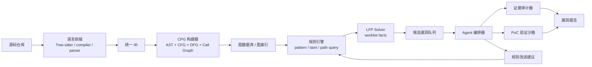
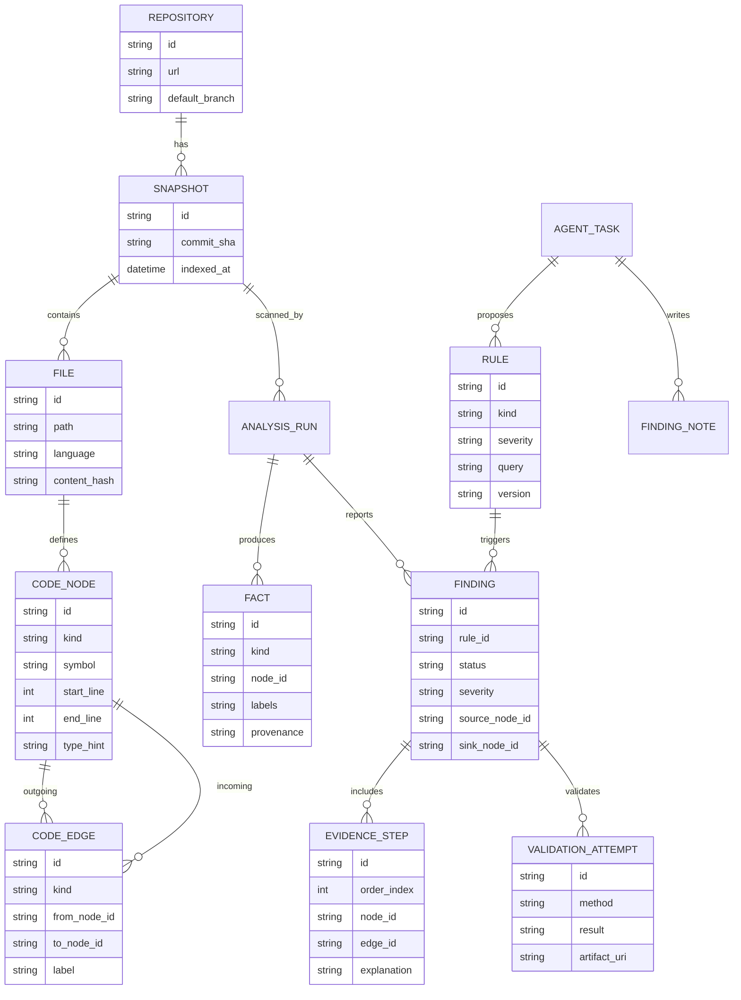
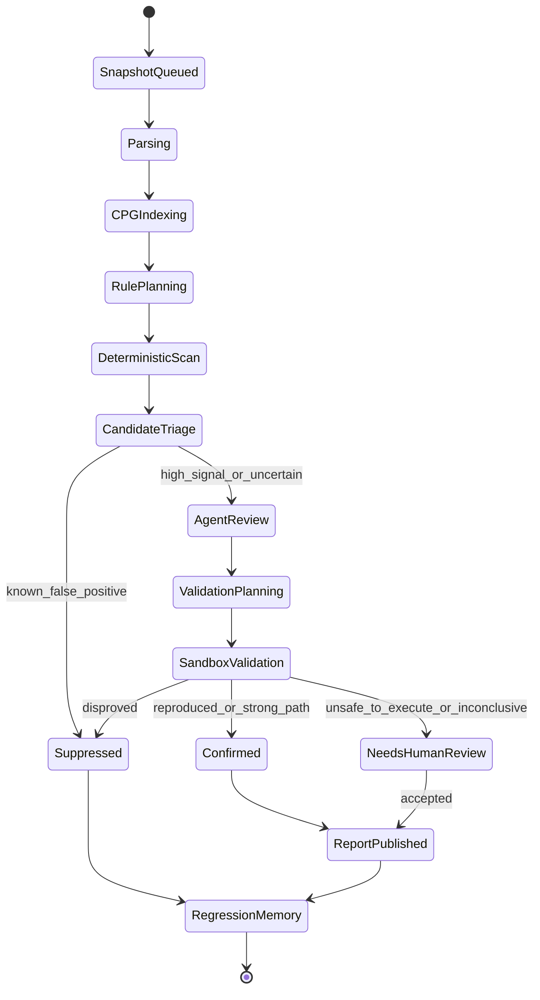

## 来源说明

这篇不是新闻复述，而是一次方案设计。资料侧重点放在三类来源：

- 经典基础：Code Property Graph 原始论文、抽象解释、数据流分析中的 least fixed point。
- 工程工具：Joern、CodeQL、Semgrep、Tree-sitter 等可落地组件。
- Agent 安全扫描新方向：LLM 辅助漏洞分析、自动验证、MDASH 这类多 Agent 扫描 harness。

我把用户提到的 `LFP` 明确解释为静态分析里的 **least fixed point，最小不动点**。如果以后讨论的是另一个缩写，可以再单独修订术语，但在白盒扫描器语境下，LFP 是非常自然的解释：污点传播、可达性、别名近似、状态集合迭代，最后都需要收敛到一个稳定解。

主要参考：

- FABIAN YAMAGUCHI 等：[*Modeling and Discovering Vulnerabilities with Code Property Graphs*](https://fabianyamaguchi.com/files/2014-ieeesp.pdf)
- Joern Documentation: [Code Property Graph](https://docs.joern.io/code-property-graph/)
- CodeQL Documentation: [About CodeQL queries](https://codeql.github.com/docs/writing-codeql-queries/about-codeql-queries/)
- CodeQL Documentation: [Creating path queries](https://codeql.github.com/docs/writing-codeql-queries/creating-path-queries/)
- CodeQL Documentation: [Analyzing data flow in JavaScript and TypeScript](https://codeql.github.com/docs/codeql-language-guides/analyzing-data-flow-in-javascript-and-typescript/)
- CodeQL Documentation: [Using flow labels for precise data flow analysis](https://codeql.github.com/docs/codeql-language-guides/using-flow-labels-for-precise-data-flow-analysis/)
- Semgrep Documentation: [Taint analysis](https://semgrep.dev/docs/writing-rules/data-flow/taint-mode/)
- Tree-sitter Documentation: [Introduction](https://tree-sitter.github.io/tree-sitter/)
- Cousot & Cousot: [Abstract Interpretation: A Unified Lattice Model](https://www.di.ens.fr/~cousot/COUSOTpapers/POPL77.shtml)
- Microsoft Security Blog: [MDASH: Multi-Model Agentic Scanning Harness](https://www.microsoft.com/en-us/security/blog/2026/05/12/mdash-multi-model-agentic-scanning-harness/)

## 先给结论

白盒扫描器不能靠 Agent “读完整仓库然后判断哪里有漏洞”。这条路在 demo 里容易惊艳，在真实代码库里会很快撞上上下文、误报、证据缺失、不可复现和成本问题。

更稳的做法是把系统拆成四层：

1. **语言前端层**：把源码解析成 AST、符号、调用、控制流、数据流、类型和依赖。
2. **程序图层**：用 CPG 把 AST、CFG、DFG、PDG、调用图和框架语义统一到一个可查询图。
3. **固定点分析层**：用 LFP/worklist 做污点传播、可达性、状态集合传播和摘要计算。
4. **Agent 编排层**：让 Agent 做规则生成、跨文件假设、漏洞解释、PoC 规划、误报裁剪和报告生成，但所有关键结论必须回到图查询、路径证据或沙箱验证。

也就是说，Agent 不是替代静态分析，而是站在静态分析的证据层上工作。它可以提出假设，但不能直接签发漏洞；它可以写查询，但查询必须跑；它可以生成 PoC，但 PoC 必须复现；它可以解释影响面，但解释必须挂在 source-to-sink 路径、调用链、配置条件和版本信息上。

## 为什么 CPG 是白盒扫描器的核心骨架

Code Property Graph 的价值，不是把代码画成一张很大的图，而是把多种程序表示统一起来。传统扫描器常常在不同模块里分别维护 AST、调用图、控制流图、数据流图和类型信息，规则一复杂，就会出现“语法规则查得到，但路径证据接不上”的问题。

CPG 的核心思路是把这些维度叠在同一个图模型上：

- AST 负责语法结构：函数、调用、字面量、表达式、字段访问。
- CFG 负责执行顺序：分支、循环、异常、提前返回。
- DFG 负责值传播：变量赋值、参数传递、返回值、字段读写。
- PDG 负责控制依赖和数据依赖。
- Call graph 负责跨函数、跨文件、跨模块传播。
- Type graph 或 schema graph 负责语言和框架语义。

一个 SQL 注入规则如果只看 AST，可能只能找到 `query(sql)` 这种调用；如果接上 DFG，就能知道 `sql` 是否来自 `req.query.name`；如果接上 CFG，就能看中间是否经过校验；如果接上 call graph，就能跨 helper、service、repository 层追踪；如果接上框架语义，就能识别 Express、NestJS、FastAPI、Spring MVC 的入口。

Agent 真正需要的不是整仓库文本，而是这样的结构化上下文：候选入口、候选 sink、路径片段、过滤器、不可达原因、框架约定和历史误报。

## LFP：污点传播为什么不是简单递归

白盒扫描的很多问题都能写成“不断传播集合，直到不再变化”：

- 从 source 出发，哪些表达式会被污染？
- 从某个函数入口出发，哪些 sink 可达？
- 某个对象字段在循环和分支后可能有哪些抽象状态？
- 某个 sanitizer 之后，污点标签是否被移除？
- 哪些函数摘要会影响上层调用者？

这就是最小不动点问题。设 `F` 是一次传播函数，`S` 是当前已知事实集合，分析过程不断计算：

```text
S0 = initial facts
S1 = F(S0)
S2 = F(S1)
...
Sn = F(Sn-1)
stop when Sn = Sn-1
```

这个稳定的 `Sn` 就是固定点。它不是数学装饰，而是工程上的扫描器主循环。没有固定点，递归函数、循环、互相调用的 service、复杂 builder 模式和异步回调都很难正确处理。

一个最小实现可以这样写：

```ts
type Fact =
  | { kind: "tainted"; value: NodeId; labels: Set<string>; evidence: EdgeId[] }
  | { kind: "reachable"; from: NodeId; to: NodeId; evidence: EdgeId[] }
  | { kind: "sanitized"; value: NodeId; labels: Set<string>; sanitizer: NodeId };

function solveLeastFixedPoint(initial: Fact[], rules: TransferRule[]): Fact[] {
  const facts = new FactSet(initial);
  const worklist = [...initial];

  while (worklist.length > 0) {
    const fact = worklist.shift()!;
    for (const rule of rules) {
      for (const next of rule.apply(fact, facts)) {
        if (facts.add(next)) {
          worklist.push(next);
        }
      }
    }
  }

  return facts.toArray();
}
```

真实系统还要处理 widening、递归深度、上下文敏感度、字段敏感度、路径敏感度和语言特性。我的建议是第一版不要追求“全语言精确”。先做标签化污点传播：`user_input`、`file_path`、`command_arg`、`html`、`sql`、`secret`、`authz_context` 等标签独立传播，再让不同 sink 声明自己关心哪些标签。

## Agent 应该干什么，不应该干什么

Agent 不适合直接做底层传播，因为它不稳定、不可穷举、不可证明收敛。LFP solver、CPG 查询、规则匹配和路径枚举应该是确定性系统。

Agent 适合做四件事。

第一，**理解框架语义**。例如某个内部 RPC 框架的入口、鉴权中间件、参数绑定方式、ORM 封装和审计函数，往往不在通用规则库里。Agent 可以阅读项目代码，生成候选 source、sink、sanitizer、validator、auth guard 规则，再交给扫描器执行。

第二，**解释路径证据**。一条 source-to-sink 路径可能跨十几个函数。Agent 可以把图路径解释成安全工程师能看懂的报告，但报告里的每一步必须带节点、边、文件行号和传播标签。

第三，**误报裁剪**。比如路径中经过了业务白名单、schema validator、类型约束、权限检查。Agent 可以提出“这可能是 sanitizer”的假设，但不能直接关闭告警；它应该生成一个可审查的 suppression reason，或者生成补充查询验证。

第四，**PoC 和修复建议**。Agent 可以基于路由、参数、权限、版本和调用路径生成验证计划。对能本地运行的仓库，它还可以启动测试、构造请求、生成最小复现，最后把结果写回证据库。

## 总体架构

下面是一个我认为能落地的白盒扫描器架构。核心原则是：规则、图查询、固定点传播和验证结果是事实来源；Agent 负责生成、组织、解释和复核事实。



语言前端不一定要从零写。多语言场景可以从 Tree-sitter 起步，拿到稳定 AST 和增量解析；对 Java/Kotlin/Go/TypeScript 这类语言，能接编译器、Language Server 或 CodeQL database 时优先接，因为类型信息和构建系统信息会显著降低误报。

CPG 存储也有多种选择。原型阶段可以用本地 SQLite/Postgres 存节点边表，配合内存索引；复杂查询可以接 Neo4j、OverflowDB 或自研列式边索引。不要一开始就迷恋图数据库，关键是节点 schema、边类型、查询 API 和证据可追溯。

## 数据模型：ER 图

扫描器的数据模型要服务两个目标：快速查询和可审计。下面这个 ER 图是第一版足够用的骨架。



注意 `FINDING` 不应该只是一段文本。它至少要包含 rule、source、sink、路径证据、传播标签、状态、验证尝试和版本。这样后续做去重、回归检测、误报学习和趋势分析才有基础。

## 扫描流程状态机

白盒扫描器不能无限“思考”。每个扫描任务要有明确状态机，尤其是引入 Agent 后，更要限制它在什么时候能生成规则、什么时候必须执行查询、什么时候必须进入人工审查。



这里的关键是 `DeterministicScan` 必须先于 `AgentReview`。如果一开始就让 Agent 扫全仓库，它会把大量注意力浪费在目录浏览和风格判断上。先用确定性扫描拿到候选，再让 Agent 看证据，成本和质量都会好很多。

## 扫描器模块拆解

第一层是 repository indexer。它负责拉取代码、锁定 commit、识别语言、读取 lockfile、构建依赖图、提取框架信息。扫描报告必须绑定 commit，不然复现时会出现“昨天有、今天没”的混乱。

第二层是 parser adapter。它把不同语言的 AST 统一成内部节点：`FunctionDecl`、`CallExpr`、`MemberAccess`、`Assignment`、`Return`、`Literal`、`Import`、`ClassDecl`。第一版不要追求全语义，先保证常见调用、参数、返回、字段访问可表示。

第三层是 graph builder。它生成 AST 边、CFG 边、DFG 边、CALLS 边、TYPE_OF 边、IMPORTS 边。CPG 查询的体验很大程度取决于这里的 schema 是否稳定。

第四层是 rule engine。规则分三种：

- pattern rule：找危险 API、配置错误、硬编码密钥、调试开关。
- taint rule：source 到 sink 的污染路径。
- semantic rule：鉴权缺失、状态绕过、业务约束错误，这类需要框架语义和项目语义。

第五层是 LFP solver。它处理跨函数传播、函数摘要、循环和递归。这里要有强约束：每个 fact 要可去重、可比较、可追溯；传播要有预算；超预算时要输出 `incomplete`，不能假装结果完整。

第六层是 Agent orchestrator。它不是一个单 Agent，而是一组受限角色：

- Rule Miner：阅读项目框架，提出 source/sink/sanitizer/auth guard 候选。
- Path Explainer：把图路径转成中文/英文漏洞解释。
- False Positive Analyst：检查路径中是否存在强 sanitizer 或不可达条件。
- PoC Planner：给可安全验证的 finding 生成复现计划。
- Patch Advisor：基于项目风格提出最小修复点。

第七层是 validation sandbox。它可以运行单元测试、启动本地服务、发送 HTTP 请求、执行轻量 PoC、比对响应、保存日志。危险 payload、破坏性操作、外部网络和凭据访问必须默认禁用。

## 规则系统示例：从 SQL 注入开始

一个最小 SQL 注入规则可以拆成三个集合：

```yaml
sources:
  - express.req.query
  - express.req.body
  - koa.ctx.request.query
  - fastapi.query_param

sinks:
  - pg.client.query
  - mysql.connection.query
  - prisma.$queryRawUnsafe
  - sqlalchemy.text

sanitizers:
  - parameterized_query
  - schema_enum_validator
  - allowlist_mapper
```

图查询先找 source 和 sink，然后 LFP solver 传播 `user_input` 标签。如果路径进入 sink 前没有遇到强 sanitizer，就生成候选 finding。Agent 只处理候选 finding：检查 SQL 构造是否真的是字符串拼接、是否有 enum allowlist、ORM 是否参数化、是否有测试可复现。

这比“让模型找 SQL 注入”稳定得多，因为模型不是在猜全仓库，而是在审计一条明确路径。

## 规则系统示例：鉴权缺失

鉴权缺失比 SQL 注入难，因为它不是简单 source-to-sink。它更像状态机问题：

- 路由是否对外暴露？
- handler 是否经过 auth middleware？
- 当前用户身份是否被解析？
- 资源 owner 是否被检查？
- 管理员路径是否有角色约束？

这里可以把程序状态抽象成标签：

```text
Unauthenticated
Authenticated(user)
Authorized(role)
ObjectScoped(resource_id, owner_id)
AdminOnly
```

然后用 LFP 在调用链上传播这些状态。若一个外部入口能到达敏感 sink，比如 `deleteUser`、`exportBillingData`、`updateRole`，但路径上没有进入 `Authorized` 或 `ObjectScoped` 状态，就生成候选。

Agent 的价值在于识别项目里的“鉴权约定”。很多代码不会叫 `authMiddleware`，可能叫 `requireSession`、`loadPrincipal`、`tenantGuard`、`withOrgAccess`。Agent 可以从已有安全路径中学习候选 guard，再让确定性查询验证它们的覆盖范围。

## Agent 记忆在扫描器里怎么用

这类系统很适合使用记忆，但不能记成“聊天历史”。建议分四种记忆：

- Rule memory：已确认的 source、sink、sanitizer、guard、framework adapter。
- False-positive memory：被证明无效的规则组合、路径形态和 suppress reason。
- Project memory：项目架构、模块职责、鉴权模式、数据访问层约定。
- Vulnerability memory：历史 finding、修复 commit、回归测试、复现 artifact。

每种记忆都必须有作用域。项目 A 的 sanitizer 不应该自动套到项目 B；某个版本的框架语义不应该套到未来版本；一次人工 suppress 不应该让同类漏洞永久消失。这里可以沿用 memory system 的老原则：记忆要有来源、时间、置信度、适用范围和撤销机制。

## 技术选型建议

如果目标是尽快做出能用的原型，我会这样选：

- 语言前端：Tree-sitter + TypeScript compiler API + Python ast 起步。
- CPG 存储：Postgres 表存节点边，关键边建索引；原型期不急着上复杂图数据库。
- 查询层：自定义 DSL + SQL/recursive CTE；复杂语言可接 CodeQL database。
- 污点分析：自研 worklist LFP solver，先做字段不敏感、上下文有限敏感。
- 规则库：Semgrep 风格 YAML 做 pattern/taint 配置，复杂规则用 TypeScript 插件。
- Agent：一个 orchestrator 加多个工具函数，而不是让模型直接拥有仓库。
- 验证：Docker/Firecracker 类隔离环境，默认无外网、无真实凭据、资源限额。

如果目标是生产质量，应该更积极地复用 CodeQL 和 Joern。CodeQL 的 path query、数据流库和多语言生态很成熟；Joern 的 CPG 和安全研究传统很适合做代码图探索。自研部分应集中在项目语义、Agent 编排、证据管理、验证沙箱和运营流程，而不是重复造完整静态分析平台。

## 误报控制

白盒扫描器最怕误报淹没用户。我的基线策略是三层评分：

第一层是结构评分：source、sink、路径长度、跨函数数量、是否有 sanitizer、是否经过危险 API。

第二层是上下文评分：入口是否外部可达、是否需要高权限、参数是否可控、配置是否启用、版本是否受影响。

第三层是验证评分：是否有单元测试复现、是否有 HTTP PoC、是否能观察到危险行为、是否只能理论可达。

报告状态不要只有 open/closed，至少要有：

- `candidate`：规则命中但未审计。
- `triaged`：路径合理，但未验证。
- `confirmed`：复现或强证据成立。
- `needs-human-review`：安全风险高或验证环境不足。
- `suppressed`：有明确误报原因。
- `fixed`：修复提交已验证。

Agent 只能把状态从 `candidate` 推到 `triaged` 或 `needs-human-review`。要到 `confirmed`，必须有可审计证据。

## 为什么要引入 MDASH 这类多 Agent 思路

Microsoft 近期公开的 MDASH 很值得关注，因为它强调的不是“一个超级模型发现漏洞”，而是 multi-model、agentic scanning harness：多个模型/Agent 以不同视角扫描、互相补充，再通过 harness 管理发现和验证。

这对我们的方案有两个启发。

第一，安全扫描需要多角色分工。一个模型同时做规则生成、路径解释、PoC、误报裁剪和报告，很容易自洽但不可靠。把角色拆开，再让确定性工具和验证层做裁判，质量更稳。

第二，模型能力变化很快，扫描器不能绑定某个模型。Agent 层应该是可替换的。规则引擎、CPG、LFP、证据库和验证沙箱才是长期资产。

但也要克制。MDASH 这样的系统并不意味着每个团队都该立刻做全自动漏洞挖掘。对个人或小团队，最有价值的第一步是“Agent 辅助静态分析”，不是“无人值守打真实目标”。这涉及安全边界、授权范围和合规风险。

## 实施路线

第一阶段做单语言 MVP。建议选 TypeScript/Node，因为 Web 安全场景多、入口和 sink 明确、工程反馈快。目标是支持 Express/NestJS 常见 source、SQL/command/path traversal sink、硬编码 secret、危险反序列化和基础鉴权缺失。

第二阶段引入 CPG 和 LFP。把 AST pattern 升级为跨函数 taint path；每个 finding 带 source-to-sink 证据。这个阶段不要追求覆盖所有框架，优先把证据链做扎实。

第三阶段接 Agent。先让 Agent 做规则挖掘和路径解释，不要一开始开放自动 PoC。所有 Agent 输出都写入 `AGENT_TASK` 和 `FINDING_NOTE`，保留 prompt、工具调用和引用节点。

第四阶段做验证沙箱。对 Web 项目运行测试服务，生成安全 payload，验证响应差异。验证失败不代表无漏洞，但验证成功可以显著提升报告可信度。

第五阶段做运营闭环。每次扫描产生 false-positive memory、规则改进建议和回归用例。真正的壁垒不是第一条规则，而是系统能不能从每次误报和漏报里变好。

## 风险边界

这个方向容易被做成“自动黑客工具”，所以边界必须写清楚：

- 只扫描自己拥有或明确授权的代码。
- 默认不对公网目标发起攻击流量。
- PoC 沙箱默认无真实凭据、无外网、有限资源。
- 报告中避免给出可直接攻击第三方目标的细节。
- Agent 不能绕过策略执行危险命令。
- 所有发现都应服务修复和防御。

白盒扫描器的目标是帮助工程团队更早发现问题，而不是替代授权流程。

## 我会怎样定义第一版成功

第一版不要用“发现多少高危漏洞”做唯一指标。更合理的成功标准是：

1. 能对一个真实 TypeScript 项目生成稳定 CPG。
2. 能跑出跨函数 source-to-sink 路径。
3. 每个 finding 都有文件行号、路径证据和传播标签。
4. Agent 能解释 finding，但不能产生无证据报告。
5. 至少三类规则可用：SQL 注入、命令注入、鉴权缺失。
6. 误报能被结构化 suppress，并进入回归记忆。
7. 扫描结果绑定 commit，可复现，可 diff。

达到这一步，系统就已经不是普通“AI 看代码”，而是一个有证据链、有状态机、有记忆、有验证入口的白盒扫描器雏形。

## 自审

事实可靠性：CPG、CodeQL、Semgrep、Tree-sitter、抽象解释和 MDASH 均来自论文或官方资料。本文没有声称已复现 MDASH 或任何论文结果。

原创性：主体是自建白盒扫描器的工程方案，包含架构、ER 图、状态机、规则模型、Agent 分工、实施路线和风险边界，不是资料拼贴。

标题与内容：标题中的 Agent、CPG、LFP 均在正文中展开，并落到白盒扫描器构建方案。

薄内容检查：文章给出了数据模型、状态机、模块拆解、规则示例、选型和落地路径，能指导第一版实现。

安全边界：文章定位为授权白盒扫描和防御建设，没有提供针对第三方目标的攻击流程。
