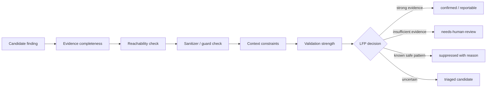
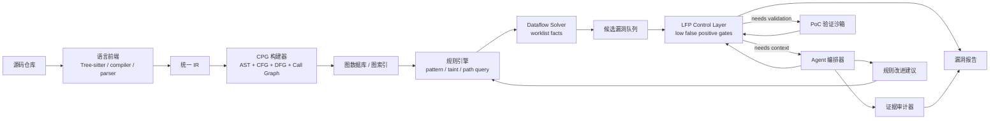
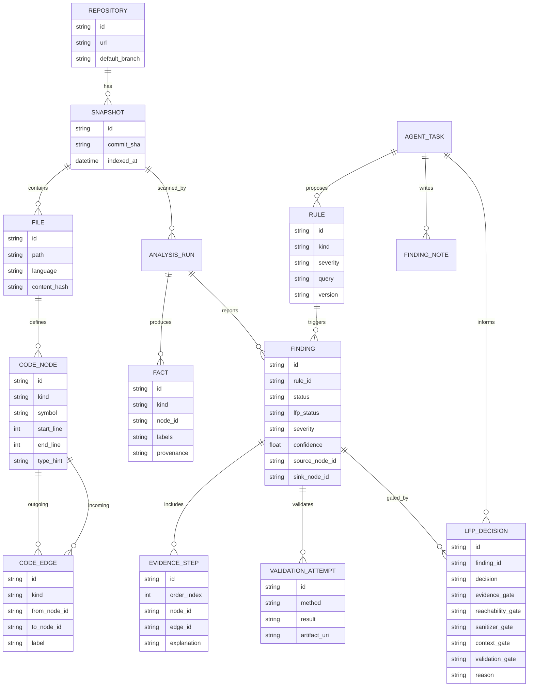
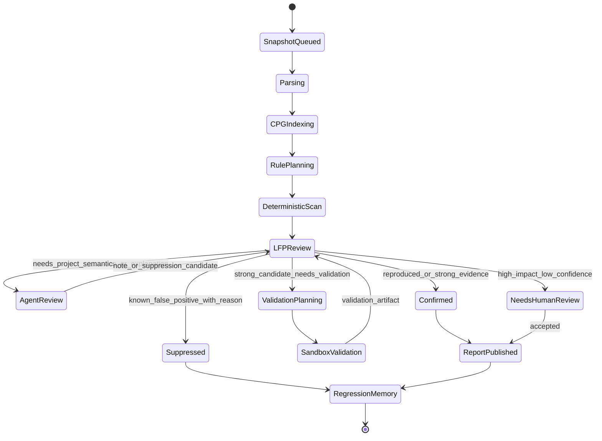

## 来源说明

这篇不是新闻复述，而是一次方案设计。资料侧重点放在三类来源：

- 经典基础：Code Property Graph 原始论文、抽象解释、数据流分析、低误报治理和证据链建模。
- 工程工具：Joern、CodeQL、Semgrep、Tree-sitter 等可落地组件。
- Agent 安全扫描新方向：LLM 辅助漏洞分析、自动验证、MDASH 这类多 Agent 扫描 harness。

术语修订：本文中的 `LFP` 指 **Low False Positive Control Layer，低误报控制层**，不是“最小不动点”。白盒扫描器底层的数据流传播当然会用到 worklist、固定点收敛、函数摘要和状态集合迭代，但这些属于 deterministic analysis engine 的实现技术；本文标题里的 LFP 是候选 finding 到最终报告之间的质量控制层，负责把“规则命中”变成“可审计、可复核、低误报”的安全结论。

主要参考：

- FABIAN YAMAGUCHI 等：[*Modeling and Discovering Vulnerabilities with Code Property Graphs*](https://fabianyamaguchi.com/files/2014-ieeesp.pdf)
- Joern Documentation: [Code Property Graph](https://docs.joern.io/code-property-graph/)
- CodeQL Documentation: [About CodeQL queries](https://codeql.github.com/docs/writing-codeql-queries/about-codeql-queries/)
- CodeQL Documentation: [Creating path queries](https://codeql.github.com/docs/writing-codeql-queries/creating-path-queries/)
- CodeQL Documentation: [Analyzing data flow in JavaScript and TypeScript](https://codeql.github.com/docs/codeql-language-guides/analyzing-data-flow-in-javascript-and-typescript/)
- CodeQL Documentation: [Using flow labels for precise data flow analysis](https://codeql.github.com/docs/codeql-language-guides/using-flow-labels-for-precise-data-flow-analysis/)
- Semgrep Documentation: [Taint analysis](https://semgrep.dev/docs/writing-rules/data-flow/taint-mode/)
- Tree-sitter Documentation: [Introduction](https://tree-sitter.github.io/tree-sitter/)
- Cousot & Cousot: [Abstract Interpretation: A Unified Lattice Model](https://www.di.ens.fr/~cousot/COUSOTpapers/POPL77.shtml)
- Microsoft Security Blog: [MDASH: Multi-Model Agentic Scanning Harness](https://www.microsoft.com/en-us/security/blog/2026/05/12/mdash-multi-model-agentic-scanning-harness/)

## 先给结论

白盒扫描器不能靠 Agent “读完整仓库然后判断哪里有漏洞”。这条路在 demo 里容易惊艳，在真实代码库里会很快撞上上下文、误报、证据缺失、不可复现和成本问题。

更稳的做法是把系统拆成五层：

1. **语言前端层**：把源码解析成 AST、符号、调用、控制流、数据流、类型和依赖。
2. **程序图层**：用 CPG 把 AST、CFG、DFG、PDG、调用图和框架语义统一到一个可查询图。
3. **确定性分析层**：用规则引擎、图查询、worklist 数据流和函数摘要做污点传播、可达性、状态集合传播。
4. **LFP 低误报控制层**：对候选 finding 做证据完整性、可达性、sanitizer、权限前置条件、验证强度和人工复核门控。
5. **Agent 编排层**：让 Agent 做规则生成、跨文件假设、漏洞解释、PoC 规划、误报复核和报告生成，但所有关键结论必须回到图查询、路径证据、LFP 门控或沙箱验证。

也就是说，Agent 不是替代静态分析，而是站在静态分析的证据层上工作。它可以提出假设，但不能直接签发漏洞；它可以写查询，但查询必须跑；它可以生成 PoC，但 PoC 必须复现；它可以解释影响面，但解释必须挂在 source-to-sink 路径、调用链、配置条件和版本信息上。

## 为什么 CPG 是白盒扫描器的核心骨架

Code Property Graph 的价值，不是把代码画成一张很大的图，而是把多种程序表示统一起来。传统扫描器常常在不同模块里分别维护 AST、调用图、控制流图、数据流图和类型信息，规则一复杂，就会出现“语法规则查得到，但路径证据接不上”的问题。

CPG 的核心思路是把这些维度叠在同一个图模型上：

- AST 负责语法结构：函数、调用、字面量、表达式、字段访问。
- CFG 负责执行顺序：分支、循环、异常、提前返回。
- DFG 负责值传播：变量赋值、参数传递、返回值、字段读写。
- PDG 负责控制依赖和数据依赖。
- Call graph 负责跨函数、跨文件、跨模块传播。
- Type graph 或 schema graph 负责语言和框架语义。

一个 SQL 注入规则如果只看 AST，可能只能找到 `query(sql)` 这种调用；如果接上 DFG，就能知道 `sql` 是否来自 `req.query.name`；如果接上 CFG，就能看中间是否经过校验；如果接上 call graph，就能跨 helper、service、repository 层追踪；如果接上框架语义，就能识别 Express、NestJS、FastAPI、Spring MVC 的入口。

Agent 真正需要的不是整仓库文本，而是这样的结构化上下文：候选入口、候选 sink、路径片段、过滤器、不可达原因、框架约定和历史误报。

## LFP：Low False Positive Control Layer 应该控制什么

这里先把术语说清楚：LFP 不是“再写一个模型让它判断误报”，而是一个位于候选漏洞队列和最终报告之间的控制层。它的目标是减少误报、保留可疑但证据不足的问题、明确人工复核点，并把每次 suppress 的原因写回回归记忆。

很多扫描器的问题不是找不到候选，而是候选太多、证据太弱、关闭理由不可复用。一个好用的 Low False Positive Control Layer 至少要检查六件事：

1. **证据完整性**：是否有 source、sink、中间路径、文件行号、传播标签和规则版本。
2. **路径可达性**：入口是否真实暴露，调用链是否可能执行，配置条件是否成立。
3. **净化与约束**：路径上是否存在 sanitizer、schema validator、allowlist、权限 guard 或类型约束。
4. **上下文条件**：漏洞是否依赖特定部署、版本、环境变量、feature flag 或权限级别。
5. **验证强度**：是否有单元测试、HTTP 复现、沙箱验证、日志证据或只能保持理论可达。
6. **人工复核门**：高危、低置信度、破坏性验证、生产动作和规则 suppress 必须进入人工复核。

可以把 LFP 层理解成 finding 的质量闸门：



这样设计之后，Agent 的位置会更清楚：Agent 可以帮助解释路径、识别项目里的 guard 命名、生成验证计划、提出 suppress reason，但 LFP 层必须用结构化字段记录为什么一个 finding 被确认、暂缓或抑制。

## 数据流传播为什么仍然需要固定点

白盒扫描的很多问题都能写成“不断传播集合，直到不再变化”：

- 从 source 出发，哪些表达式会被污染？
- 从某个函数入口出发，哪些 sink 可达？
- 某个对象字段在循环和分支后可能有哪些抽象状态？
- 某个 sanitizer 之后，污点标签是否被移除？
- 哪些函数摘要会影响上层调用者？

这是底层数据流分析中的固定点问题。设 `F` 是一次传播函数，`S` 是当前已知事实集合，分析过程不断计算：

```text
S0 = initial facts
S1 = F(S0)
S2 = F(S1)
...
Sn = F(Sn-1)
stop when Sn = Sn-1
```

这个稳定的 `Sn` 就是固定点。它不是数学装饰，而是工程上的扫描器主循环。没有固定点，递归函数、循环、互相调用的 service、复杂 builder 模式和异步回调都很难正确处理。注意，这一段讨论的是 deterministic dataflow solver，不是本文缩写 LFP 的含义。

一个最小实现可以这样写：

```ts
type Fact =
  | { kind: "tainted"; value: NodeId; labels: Set<string>; evidence: EdgeId[] }
  | { kind: "reachable"; from: NodeId; to: NodeId; evidence: EdgeId[] }
  | { kind: "sanitized"; value: NodeId; labels: Set<string>; sanitizer: NodeId };

function solveLeastFixedPoint(initial: Fact[], rules: TransferRule[]): Fact[] {
  const facts = new FactSet(initial);
  const worklist = [...initial];

  while (worklist.length > 0) {
    const fact = worklist.shift()!;
    for (const rule of rules) {
      for (const next of rule.apply(fact, facts)) {
        if (facts.add(next)) {
          worklist.push(next);
        }
      }
    }
  }

  return facts.toArray();
}
```

真实系统还要处理 widening、递归深度、上下文敏感度、字段敏感度、路径敏感度和语言特性。我的建议是第一版不要追求“全语言精确”。先做标签化污点传播：`user_input`、`file_path`、`command_arg`、`html`、`sql`、`secret`、`authz_context` 等标签独立传播，再让不同 sink 声明自己关心哪些标签。

## Agent 应该干什么，不应该干什么

Agent 不适合直接做底层传播，因为它不稳定、不可穷举、不可证明收敛。数据流 solver、CPG 查询、规则匹配和路径枚举应该是确定性系统。

Agent 适合做四件事。

第一，**理解框架语义**。例如某个内部 RPC 框架的入口、鉴权中间件、参数绑定方式、ORM 封装和审计函数，往往不在通用规则库里。Agent 可以阅读项目代码，生成候选 source、sink、sanitizer、validator、auth guard 规则，再交给扫描器执行。

第二，**解释路径证据**。一条 source-to-sink 路径可能跨十几个函数。Agent 可以把图路径解释成安全工程师能看懂的报告，但报告里的每一步必须带节点、边、文件行号和传播标签。

第三，**辅助低误报复核**。比如路径中经过了业务白名单、schema validator、类型约束、权限检查。Agent 可以提出“这可能是 sanitizer”的假设，但不能直接关闭告警；它应该生成一个可审查的 suppression reason、补充查询或验证计划，再交回 LFP 层做结构化门控。

第四，**PoC 和修复建议**。Agent 可以基于路由、参数、权限、版本和调用路径生成验证计划。对能本地运行的仓库，它还可以启动测试、构造请求、生成最小复现，最后把结果写回证据库。

## 总体架构

下面是一个我认为能落地的白盒扫描器架构。核心原则是：规则、图查询、数据流传播、LFP 门控和验证结果是事实来源；Agent 负责生成、组织、解释和补充事实，但不直接改变最终 finding 状态。



语言前端不一定要从零写。多语言场景可以从 Tree-sitter 起步，拿到稳定 AST 和增量解析；对 Java/Kotlin/Go/TypeScript 这类语言，能接编译器、Language Server 或 CodeQL database 时优先接，因为类型信息和构建系统信息会显著降低误报。

CPG 存储也有多种选择。原型阶段可以用本地 SQLite/Postgres 存节点边表，配合内存索引；复杂查询可以接 Neo4j、OverflowDB 或自研列式边索引。不要一开始就迷恋图数据库，关键是节点 schema、边类型、查询 API 和证据可追溯。

## 项目目标和边界

如果把这套方案当成真实项目，而不是一篇概念文章，我会把目标写得更窄一点：

> 构建一个面向授权代码库的白盒安全扫描器。它以 CPG、确定性数据流分析和 LFP 低误报控制层为证据与质量底座，用 Agent 做项目语义理解、规则生成、路径解释、误报复核和修复建议，最终输出可审计、可复现、可回归的漏洞报告。

第一版不追求“所有语言、所有漏洞、完全自动化”。第一版要证明三件事：

1. 对真实仓库建立稳定代码图。
2. 对少数高价值漏洞类型输出 source-to-sink 证据链。
3. 让 Agent 增强扫描质量，而不是制造不可复核的判断。

项目边界要写死：

- **扫描对象**：本地仓库、企业内部 Git 仓库、明确授权的开源仓库。
- **首发语言**：TypeScript/JavaScript，兼容 Node.js Web 服务。
- **首发框架**：Express、Koa、NestJS 的入口识别；数据库层覆盖 pg、mysql2、Prisma、TypeORM 的常见危险调用。
- **首发漏洞类型**：SQL 注入、命令注入、路径穿越、SSRF、鉴权缺失、硬编码密钥。
- **输出形式**：SARIF、Markdown 报告、JSON API、可选 PR comment。
- **不做的事**：不扫描未授权公网目标；不默认执行破坏性 payload；不把 Agent 输出直接当作漏洞结论；不承诺零误报。

这个边界很重要。白盒扫描器最大的问题不是“想象力不够”，而是范围失控。范围一失控，规则库、图 schema、验证沙箱、报告质量和误报治理都会一起塌。

## 产品形态

我会把它设计成三个入口，而不是一个单体命令。

第一是 CLI：

```bash
scanner init
scanner index --repo . --commit HEAD
scanner scan --rules rules/web-ts --format sarif,json
scanner explain finding_01
scanner validate finding_01 --sandbox docker
```

CLI 用来服务个人开发者、本地调试和 CI。它必须快、可缓存、可离线运行。CLI 的输出要稳定，不依赖前端服务。

第二是服务端 API：

```http
POST /api/repositories
POST /api/repositories/{repoId}/snapshots
POST /api/scans
GET  /api/scans/{scanId}
GET  /api/findings/{findingId}
POST /api/findings/{findingId}/validate
POST /api/findings/{findingId}/suppress
```

API 用来做队列、历史扫描、团队协作、规则版本管理和仪表盘。它不应该参与底层分析逻辑，只负责调度和存储。

第三是 Git 集成：

- Push 后触发增量扫描。
- PR 只扫描 diff 影响面，同时回查全局可达路径。
- 严重 finding 以 review comment 形式贴到对应行。
- SARIF 上传到 GitHub Code Scanning。
- 修复后自动跑回归验证。

这样三种形态对应三类用户：研究者用 CLI，团队用 API，工程流用 Git 集成。

## 分层模块契约

每一层都要有清晰输入输出，否则 Agent 加进来后会变成一团不可调试的流程。

| 模块 | 输入 | 输出 | 不允许做什么 |
|---|---|---|---|
| Repository Indexer | repo URL、本地路径、commit | 文件清单、语言清单、依赖图、lockfile 信息 | 不做漏洞判断 |
| Parser Adapter | 文件内容、语言配置 | 统一 AST 节点、符号、基础类型 | 不跨文件猜调用 |
| Graph Builder | AST、符号、依赖图 | CPG 节点边、调用边、数据流边 | 不做风险评分 |
| Dataflow Solver | 初始 facts、transfer rules、图索引 | taint facts、reachability facts、函数摘要 | 不生成自然语言报告 |
| Rule Engine | 规则 DSL、CPG、facts | candidate findings | 不调用模型 |
| LFP Control Layer | candidate findings、证据、路径、上下文、验证结果 | confirmed、triaged、needs-human-review、suppressed | 不凭主观判断关闭高危 |
| Agent Orchestrator | finding、证据、项目上下文 | 解释、规则建议、验证计划、修复建议 | 不绕过 LFP 门控直接确认漏洞 |
| Sandbox Validator | 验证计划、测试环境 | validation artifact、复现结果 | 不访问真实生产凭据 |
| Report Builder | finding、证据、验证结果 | SARIF、Markdown、JSON | 不隐藏不确定性 |

最关键的是 `Rule Engine`、`LFP Control Layer` 和 `Agent Orchestrator` 的边界。规则命中必须来自确定性执行；LFP 负责状态门控和低误报决策；Agent 只能补充语义、解释、suppression 候选和验证计划。这样后续即使换模型，也不会影响核心扫描结果的可复现性。

## 数据流：从 commit 到报告

更细的执行流可以拆成十步：

1. **锁定快照**：记录 repo、branch、commit、依赖锁文件 hash、扫描配置 hash。
2. **文件分层**：跳过 build output、vendor、minified、generated 文件；识别入口目录、测试目录、迁移脚本。
3. **解析与符号收集**：生成 AST，抽取函数、类、import/export、路由声明、middleware、ORM 调用。
4. **构建 CPG**：写入 AST/CFG/DFG/CALLS/IMPORTS/TYPE_OF 等边。
5. **项目语义挖掘**：Agent 只读少量代表性文件，提出 source/sink/sanitizer/guard 候选。
6. **规则执行**：规则引擎把候选合并到规则上下文，运行 pattern 和 taint 查询。
7. **数据流求解**：跨函数传播污点和状态，输出带 provenance 的 facts。
8. **LFP 初审**：按 evidence completeness、reachability、sanitizer、context constraint 给候选 finding 打门控状态。
9. **Agent 补证**：只有 LFP 标记为需要语义解释、项目 guard 识别或验证计划时，Agent 才介入。
10. **验证与最终门控**：沙箱验证和人工复核结果回写 LFP 层，由 LFP 输出 `confirmed`、`triaged`、`needs-human-review` 或 `suppressed`。

这里有一个容易忽略的点：Agent 不应该在第 5 步读取整个仓库。它应该由 indexer 先给出“代表性样本”：入口文件、鉴权中间件、数据库封装、路由聚合、配置文件、已有安全测试。这样它的上下文更干净，也更容易产出项目语义规则。

## 规则 DSL 草案

规则必须可版本化、可审查、可禁用、可回归。下面是一个偏 Semgrep/CodeQL 之间的 YAML DSL 草案：

```yaml
id: ts.sql-injection.raw-query
title: Raw SQL receives user-controlled input
severity: high
language: typescript
track: taint

sources:
  - kind: framework_param
    frameworks: [express, koa, nestjs]
    selectors:
      - req.query.*
      - req.body.*
      - ctx.request.query.*
      - param.decorator.Query

sinks:
  - kind: call
    symbols:
      - pg.Client.query
      - mysql.Connection.query
      - prisma.$queryRawUnsafe
      - dataSource.query
    tainted_argument: [0]

sanitizers:
  - kind: call
    symbols:
      - sql-template-tag.sql
      - z.enum.parse
      - allowlist.map
    removes_labels: [sql]

propagation:
  labels: [user_input, sql]
  field_sensitive: false
  max_call_depth: 8
  max_path_count: 20

evidence:
  require_source: true
  require_sink: true
  require_path: true

agent_review:
  enabled: true
  questions:
    - Is the sink actually parameterized?
    - Is there an allowlist sanitizer on every path?
    - Is this route externally reachable?
```

第一版 DSL 不要太强。最重要的是表达四类东西：source、sink、sanitizer、propagation budget。复杂的业务语义可以放到插件里，不要全塞进 YAML。

## CPG 节点和边的最小 schema

第一版的节点种类可以控制在二十个以内：

```text
Project, File, Module, ImportDecl, ExportDecl
FunctionDecl, MethodDecl, ClassDecl, Param, Return
CallExpr, MemberExpr, Identifier, Literal, Assignment
IfStmt, LoopStmt, AwaitExpr, ObjectExpr, RouteDecl
```

边类型也先收敛：

```text
AST_CHILD
CFG_NEXT
DFG_READS
DFG_WRITES
DFG_FLOWS_TO
CALLS
RETURNS_TO
IMPORTS
EXPORTS
HAS_PARAM
HAS_TYPE
GUARDED_BY
SANITIZED_BY
ROUTE_TO
```

其中 `GUARDED_BY`、`SANITIZED_BY`、`ROUTE_TO` 是白盒安全扫描特别需要的语义边。它们不一定来自编译器，很多时候来自框架 adapter 或 Agent 提出的项目语义候选，再由确定性查询确认。

节点必须保存：

- `stable_id`：由 commit、file path、node kind、range、symbol 生成。
- `file_path`、`start_line`、`end_line`。
- `code_hash`：用于判断节点是否变化。
- `symbol`：函数名、方法名、变量名或调用目标。
- `raw_snippet_hash`：报告可以引用短片段，但数据库里不一定存完整代码。

边必须保存：

- `from_node_id`、`to_node_id`。
- `edge_kind`。
- `confidence`：确定性边为 1.0，Agent/启发式候选低于 1.0。
- `provenance`：来自 parser、compiler、framework adapter、agent proposal 还是人工规则。

这样后面才能做增量扫描。否则每次扫描都全量重建，成本会很快失控。

## Agent 工具协议

Agent 不能自由读写所有东西。它应该只能通过工具访问经过裁剪的证据。

```ts
interface AgentTools {
  getFinding(id: string): Finding;
  getPathEvidence(findingId: string): EvidenceStep[];
  getNodeContext(nodeId: string, radius: number): CodeContext;
  searchSymbols(query: string): SymbolHit[];
  runGraphQuery(query: GraphQuery): QueryResult;
  proposeRulePatch(ruleId: string, patch: RulePatch): ProposalId;
  createValidationPlan(findingId: string, plan: ValidationPlan): ProposalId;
  writeFindingNote(findingId: string, note: FindingNote): void;
}
```

这里有两个原则：

第一，Agent 输出的是 proposal，不是最终事实。`proposeRulePatch`、`createValidationPlan` 都要进入审计队列或自动验证流程。

第二，Agent 的每条 note 都要引用证据节点。没有 node id、edge id、query result 的自然语言解释，不能进入最终报告。

## 验证沙箱设计

验证沙箱不必第一版就做到很重，但边界要从一开始设计好。

最小沙箱能力：

- 用 Docker Compose 启动项目依赖。
- 注入测试数据库，而不连接生产数据库。
- 禁止访问外部网络，除非规则显式允许。
- 对 HTTP 服务生成本地请求。
- 捕获请求、响应、日志、异常栈和数据库变化。
- 每次验证生成 artifact：命令、环境、payload、输出、退出码。

验证策略分三档：

- **静态强证据**：source-to-sink 路径完整，sink 明确危险，但无法安全运行项目。
- **动态弱验证**：服务可启动，请求可到达 sink，但没有证明危险副作用。
- **动态强验证**：payload 触发可观察差异，例如 SQL error、命令执行回显、任意文件读取、越权数据返回。

对于命令注入、SSRF、路径穿越这类风险，payload 必须是安全 payload。比如命令注入验证只允许 `echo scanner_probe_<nonce>` 这种无害命令；SSRF 只打本地受控 mock server；路径穿越只读取沙箱内临时 canary 文件。

## CI 和 PR 集成

CI 里不能每次全量深扫，否则开发者会关掉它。推荐三层策略：

| 触发 | 扫描范围 | 时间预算 | 阻断策略 |
|---|---|---:|---|
| PR push | diff 影响文件 + 调用邻域 | 2-5 分钟 | 只阻断新增 high/confimed |
| main merge | 全仓规则扫描 | 10-30 分钟 | 记录趋势，不轻易阻断 |
| nightly | 深度 taint + Agent review + sandbox | 30-120 分钟 | 输出安全日报 |

PR 模式最重要的是“新增风险”。如果历史上已有 200 个 candidate，不能每次 PR 都拿它们吓人。扫描器应该比较 baseline：

```text
new_findings = current_findings - baseline_findings
fixed_findings = baseline_findings - current_findings
changed_findings = same_sink_but_path_changed
```

这也是为什么 finding 必须有稳定 fingerprint。一个 fingerprint 可以由 `rule_id + source_node_stable_id + sink_node_stable_id + normalized_path_shape` 组成。

## 风险评分模型

第一版评分不要用黑盒模型，先用透明规则：

```text
score =
  source_confidence * 0.2 +
  sink_severity * 0.25 +
  path_completeness * 0.2 +
  sanitizer_absence * 0.15 +
  external_reachability * 0.1 +
  validation_strength * 0.1
```

然后映射为：

- `critical`：外部可达 + 高危 sink + 动态强验证。
- `high`：外部可达 + 完整路径 + 无 sanitizer。
- `medium`：路径成立但入口或 exploitability 不完整。
- `low`：危险模式存在，但缺少可控输入或可达性。
- `info`：需要人工确认的安全气味。

Agent 可以影响 `external_reachability` 和 `sanitizer_absence` 的解释，但不能直接把 severity 提到 critical。critical 必须来自规则和验证证据。

## 数据模型：ER 图

扫描器的数据模型要服务两个目标：快速查询和可审计。下面这个 ER 图是第一版足够用的骨架。



注意 `FINDING` 不应该只是一段文本。它至少要包含 rule、source、sink、路径证据、传播标签、状态、LFP 决策、验证尝试和版本。这样后续做去重、回归检测、误报学习和趋势分析才有基础。

## 扫描流程状态机

白盒扫描器不能无限“思考”。每个扫描任务要有明确状态机，尤其是引入 Agent 后，更要限制它在什么时候能生成规则、什么时候必须执行查询、什么时候必须进入人工审查。



这里的关键是 `DeterministicScan` 必须先于 `LFPReview`，`LFPReview` 又必须先于大部分 `AgentReview`。如果一开始就让 Agent 扫全仓库，它会把大量注意力浪费在目录浏览和风格判断上。先用确定性扫描拿到候选，再用 LFP 层筛出需要补证、需要验证或需要人工复核的 finding，最后才让 Agent 介入，成本和质量都会好很多。

## 扫描器模块拆解

第一层是 repository indexer。它负责拉取代码、锁定 commit、识别语言、读取 lockfile、构建依赖图、提取框架信息。扫描报告必须绑定 commit，不然复现时会出现“昨天有、今天没”的混乱。

第二层是 parser adapter。它把不同语言的 AST 统一成内部节点：`FunctionDecl`、`CallExpr`、`MemberAccess`、`Assignment`、`Return`、`Literal`、`Import`、`ClassDecl`。第一版不要追求全语义，先保证常见调用、参数、返回、字段访问可表示。

第三层是 graph builder。它生成 AST 边、CFG 边、DFG 边、CALLS 边、TYPE_OF 边、IMPORTS 边。CPG 查询的体验很大程度取决于这里的 schema 是否稳定。

第四层是 rule engine。规则分三种：

- pattern rule：找危险 API、配置错误、硬编码密钥、调试开关。
- taint rule：source 到 sink 的污染路径。
- semantic rule：鉴权缺失、状态绕过、业务约束错误，这类需要框架语义和项目语义。

第五层是 dataflow solver。它处理跨函数传播、函数摘要、循环和递归。这里要有强约束：每个 fact 要可去重、可比较、可追溯；传播要有预算；超预算时要输出 `incomplete`，不能假装结果完整。

第六层是 LFP Control Layer。它把候选 finding 过一遍低误报门控：证据是否完整、路径是否可达、是否存在强 sanitizer、上下文条件是否成立、验证是否足够、是否需要人工复核。它的输出不是自然语言，而是结构化状态和原因。

第七层是 Agent orchestrator。它不是一个单 Agent，而是一组受限角色：

- Rule Miner：阅读项目框架，提出 source/sink/sanitizer/auth guard 候选。
- Path Explainer：把图路径转成中文/英文漏洞解释。
- False Positive Analyst：检查路径中是否存在强 sanitizer 或不可达条件。
- PoC Planner：给可安全验证的 finding 生成复现计划。
- Patch Advisor：基于项目风格提出最小修复点。

第八层是 validation sandbox。它可以运行单元测试、启动本地服务、发送 HTTP 请求、执行轻量 PoC、比对响应、保存日志。危险 payload、破坏性操作、外部网络和凭据访问必须默认禁用。

## 规则系统示例：从 SQL 注入开始

一个最小 SQL 注入规则可以拆成三个集合：

```yaml
sources:
  - express.req.query
  - express.req.body
  - koa.ctx.request.query
  - fastapi.query_param

sinks:
  - pg.client.query
  - mysql.connection.query
  - prisma.$queryRawUnsafe
  - sqlalchemy.text

sanitizers:
  - parameterized_query
  - schema_enum_validator
  - allowlist_mapper
```

图查询先找 source 和 sink，然后 dataflow solver 传播 `user_input` 标签。如果路径进入 sink 前没有遇到强 sanitizer，就生成候选 finding。LFP Control Layer 再检查证据完整性、sink 是否真的危险、sanitizer 是否覆盖所有路径、验证是否充分。Agent 只处理候选 finding：检查 SQL 构造是否真的是字符串拼接、是否有 enum allowlist、ORM 是否参数化、是否有测试可复现。

这比“让模型找 SQL 注入”稳定得多，因为模型不是在猜全仓库，而是在审计一条明确路径。

## 规则系统示例：鉴权缺失

鉴权缺失比 SQL 注入难，因为它不是简单 source-to-sink。它更像状态机问题：

- 路由是否对外暴露？
- handler 是否经过 auth middleware？
- 当前用户身份是否被解析？
- 资源 owner 是否被检查？
- 管理员路径是否有角色约束？

这里可以把程序状态抽象成标签：

```text
Unauthenticated
Authenticated(user)
Authorized(role)
ObjectScoped(resource_id, owner_id)
AdminOnly
```

然后用数据流分析在调用链上传播这些状态。若一个外部入口能到达敏感 sink，比如 `deleteUser`、`exportBillingData`、`updateRole`，但路径上没有进入 `Authorized` 或 `ObjectScoped` 状态，就生成候选。随后 LFP 层要检查是否存在项目特定 guard、全局 middleware、数据库 RLS、网关权限或部署隔离，避免把“代码路径存在”直接写成“漏洞成立”。

Agent 的价值在于识别项目里的“鉴权约定”。很多代码不会叫 `authMiddleware`，可能叫 `requireSession`、`loadPrincipal`、`tenantGuard`、`withOrgAccess`。Agent 可以从已有安全路径中学习候选 guard，再让确定性查询验证它们的覆盖范围。

## Agent 记忆在扫描器里怎么用

这类系统很适合使用记忆，但不能记成“聊天历史”。建议分四种记忆：

- Rule memory：已确认的 source、sink、sanitizer、guard、framework adapter。
- False-positive memory：被证明无效的规则组合、路径形态和 suppress reason。
- Project memory：项目架构、模块职责、鉴权模式、数据访问层约定。
- Vulnerability memory：历史 finding、修复 commit、回归测试、复现 artifact。

每种记忆都必须有作用域。项目 A 的 sanitizer 不应该自动套到项目 B；某个版本的框架语义不应该套到未来版本；一次人工 suppress 不应该让同类漏洞永久消失。这里可以沿用 memory system 的老原则：记忆要有来源、时间、置信度、适用范围和撤销机制。

## 技术选型建议

如果目标是尽快做出能用的原型，我会这样选：

- 语言前端：Tree-sitter + TypeScript compiler API + Python ast 起步。
- CPG 存储：Postgres 表存节点边，关键边建索引；原型期不急着上复杂图数据库。
- 查询层：自定义 DSL + SQL/recursive CTE；复杂语言可接 CodeQL database。
- 污点分析：自研 worklist dataflow solver，先做字段不敏感、上下文有限敏感。
- 低误报控制：单独实现 LFP Control Layer，记录证据完整性、可达性、sanitizer、上下文条件、验证强度和人工复核状态。
- 规则库：Semgrep 风格 YAML 做 pattern/taint 配置，复杂规则用 TypeScript 插件。
- Agent：一个 orchestrator 加多个工具函数，而不是让模型直接拥有仓库。
- 验证：Docker/Firecracker 类隔离环境，默认无外网、无真实凭据、资源限额。

如果目标是生产质量，应该更积极地复用 CodeQL 和 Joern。CodeQL 的 path query、数据流库和多语言生态很成熟；Joern 的 CPG 和安全研究传统很适合做代码图探索。自研部分应集中在项目语义、Agent 编排、证据管理、验证沙箱和运营流程，而不是重复造完整静态分析平台。

## LFP 误报控制模型

白盒扫描器最怕误报淹没用户。LFP 层不是一个分数，而是一组门控状态。我的基线策略是三层评分加五个 gate：

第一层是结构评分：source、sink、路径长度、跨函数数量、是否有 sanitizer、是否经过危险 API。

第二层是上下文评分：入口是否外部可达、是否需要高权限、参数是否可控、配置是否启用、版本是否受影响。

第三层是验证评分：是否有单元测试复现、是否有 HTTP PoC、是否能观察到危险行为、是否只能理论可达。

五个 gate 是：

- `evidence_gate`：source、sink、路径、规则版本、传播标签是否完整。
- `reachability_gate`：入口是否真实可达，配置和部署条件是否成立。
- `sanitizer_gate`：是否存在 sanitizer、allowlist、schema validator、权限 guard 或强类型约束。
- `context_gate`：是否依赖特定租户、权限、feature flag、版本或环境变量。
- `validation_gate`：是否有沙箱复现、测试证据、日志证据，还是只能理论可达。

报告状态不要只有 open/closed，至少要有：

- `candidate`：规则命中但未审计。
- `triaged`：路径合理，但未验证。
- `confirmed`：复现或强证据成立。
- `needs-human-review`：安全风险高或验证环境不足。
- `suppressed`：有明确误报原因。
- `fixed`：修复提交已验证。

Agent 不能直接把 finding 改成 `confirmed` 或 `suppressed`。它只能写入 `FINDING_NOTE`、提出 `suppression_candidate` 或生成验证计划；最终状态变化必须由 LFP gate、验证结果或人工复核驱动。要到 `confirmed`，必须有可审计证据；要到 `suppressed`，必须有明确原因、作用域和过期策略。

## 为什么要引入 MDASH 这类多 Agent 思路

Microsoft 近期公开的 MDASH 很值得关注，因为它强调的不是“一个超级模型发现漏洞”，而是 multi-model、agentic scanning harness：多个模型/Agent 以不同视角扫描、互相补充，再通过 harness 管理发现和验证。

这对我们的方案有两个启发。

第一，安全扫描需要多角色分工。一个模型同时做规则生成、路径解释、PoC、误报裁剪和报告，很容易自洽但不可靠。把角色拆开，再让确定性工具和验证层做裁判，质量更稳。

第二，模型能力变化很快，扫描器不能绑定某个模型。Agent 层应该是可替换的。规则引擎、CPG、数据流分析、LFP 低误报控制层、证据库和验证沙箱才是长期资产。

但也要克制。MDASH 这样的系统并不意味着每个团队都该立刻做全自动漏洞挖掘。对个人或小团队，最有价值的第一步是“Agent 辅助静态分析”，不是“无人值守打真实目标”。这涉及安全边界、授权范围和合规风险。

## 实施路线

第一阶段做单语言 MVP。建议选 TypeScript/Node，因为 Web 安全场景多、入口和 sink 明确、工程反馈快。目标是支持 Express/NestJS 常见 source、SQL/command/path traversal sink、硬编码 secret、危险反序列化和基础鉴权缺失。

第二阶段引入 CPG 和跨函数数据流。把 AST pattern 升级为 taint path；每个 finding 带 source-to-sink 证据。这个阶段不要追求覆盖所有框架，优先把证据链做扎实。

第三阶段引入 LFP 低误报控制层。不要急着让 Agent 自动确认漏洞，先把 evidence completeness、reachability、sanitizer/guard、context constraint、validation strength 和 human-review gate 做成结构化状态。

第四阶段接 Agent。先让 Agent 做规则挖掘和路径解释，不要一开始开放自动 PoC。所有 Agent 输出都写入 `AGENT_TASK` 和 `FINDING_NOTE`，保留 prompt、工具调用和引用节点。

第五阶段做验证沙箱。对 Web 项目运行测试服务，生成安全 payload，验证响应差异。验证失败不代表无漏洞，但验证成功可以显著提升报告可信度。

第六阶段做运营闭环。每次扫描产生 false-positive memory、规则改进建议和回归用例。真正的壁垒不是第一条规则，而是系统能不能从每次误报和漏报里变好。

更具体的里程碑可以这样排：

| 周期 | 目标 | 可交付物 |
|---|---|---|
| 第 1-2 周 | TypeScript 仓库索引和 AST 统一节点 | CLI、文件过滤、节点表、基础符号表 |
| 第 3-4 周 | CPG 最小图和查询 API | AST/DFG/CALLS 边、节点上下文查询、路径查询 |
| 第 5-6 周 | 跨函数污点传播 | source/sink/sanitizer DSL、worklist solver、路径证据 |
| 第 7-8 周 | LFP 低误报控制层 | evidence gate、reachability gate、sanitizer gate、review gate |
| 第 9-10 周 | 首批规则 | SQL 注入、命令注入、路径穿越、硬编码 secret |
| 第 11-12 周 | Agent review 与报告 | 项目语义挖掘、路径解释、误报复核 note、SARIF、Markdown、JSON API |

第一版上线前必须拿三个仓库做验证：

- 一个小型故意漏洞项目，用来确认规则能命中。
- 一个真实开源 Node 项目，用来观察误报。
- 一个内部或自建业务风格项目，用来验证框架语义挖掘是否有价值。

## 风险边界

这个方向容易被做成“自动黑客工具”，所以边界必须写清楚：

- 只扫描自己拥有或明确授权的代码。
- 默认不对公网目标发起攻击流量。
- PoC 沙箱默认无真实凭据、无外网、有限资源。
- 报告中避免给出可直接攻击第三方目标的细节。
- Agent 不能绕过策略执行危险命令。
- 所有发现都应服务修复和防御。

白盒扫描器的目标是帮助工程团队更早发现问题，而不是替代授权流程。

## 我会怎样定义第一版成功

第一版不要用“发现多少高危漏洞”做唯一指标。更合理的成功标准是：

1. 能对一个真实 TypeScript 项目生成稳定 CPG。
2. 能跑出跨函数 source-to-sink 路径。
3. 每个 finding 都有文件行号、路径证据、传播标签和 LFP gate 决策。
4. Agent 能解释 finding，但不能产生无证据报告。
5. 至少三类规则可用：SQL 注入、命令注入、鉴权缺失。
6. 误报能被结构化 suppress，并进入回归记忆。
7. 扫描结果绑定 commit，可复现，可 diff。

达到这一步，系统就已经不是普通“AI 看代码”，而是一个有证据链、有状态机、有记忆、有验证入口的白盒扫描器雏形。

## MVP 验收清单

最后我会用下面这张清单判断项目是否真的可用，而不是只完成了一篇漂亮设计文档。

| 项目 | 验收标准 |
|---|---|
| 构建稳定性 | 同一 commit 连续扫描三次，finding fingerprint 一致 |
| 图完整性 | 常见函数调用、参数传递、返回值、字段读写能形成路径 |
| 规则可维护性 | 新增一个 source/sink 不需要改 solver 代码 |
| 证据可读性 | 报告能展示 source、sink、中间传播步骤和文件行号 |
| LFP 门控 | 每个 reportable finding 都有 evidence/reachability/sanitizer/context/validation gate |
| Agent 可控性 | Agent note 都引用节点或查询结果，没有纯主观结论，也不能绕过 LFP 改状态 |
| 误报处理 | suppress 必须有原因、作用域、证据引用和过期策略 |
| 验证安全 | PoC 在无外网、无生产凭据、资源限制下执行 |
| CI 体验 | PR 扫描只报告新增风险，不翻旧账 |
| 性能基线 | 10 万行 TypeScript 项目在 10 分钟内完成基础扫描 |
| 安全边界 | 未授权目标、真实攻击 payload、生产凭据访问默认禁止 |

这个验收清单比“支持多少漏洞类型”更重要。漏洞类型可以慢慢扩展；如果证据链、稳定性和边界一开始没做好，后面加越多规则，系统越难运营。

## 自审

事实可靠性：CPG、CodeQL、Semgrep、Tree-sitter、抽象解释和 MDASH 均来自论文或官方资料。本文没有声称已复现 MDASH 或任何论文结果。

原创性：主体是自建白盒扫描器的工程方案，包含架构、ER 图、状态机、规则模型、DSL、模块契约、Agent 分工、沙箱验证、CI 集成、实施路线和验收清单，不是资料拼贴。

标题与内容：标题中的 Agent、CPG、LFP 均在正文中展开；其中 LFP 已明确为 Low False Positive Control Layer，并落到白盒扫描器低误报控制方案。

薄内容检查：文章给出了数据模型、状态机、模块拆解、规则示例、选型、产品形态、模块接口、评分模型、落地路径和 MVP 验收标准，能指导第一版实现。

安全边界：文章定位为授权白盒扫描和防御建设，没有提供针对第三方目标的攻击流程。
