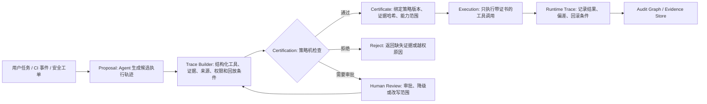

## 来源说明

本文基于 2026-06-02 的每日深度技术研究流程写成。今天没有找到足够强的同日 arXiv 新论文批次；最适合写成支柱扩展的材料来自过去一周尚未在本站单独处理的安全研究：

- Xiao-Yang Liu Yanglet, Xiaodong Wang, Agostino Capponi: [*No Certificate, No Execution: Certified Traces as a Foundation for Trustworthy AI Agents*](https://arxiv.org/abs/2605.24462), arXiv:2605.24462
- Faruk Alpay, Taylan Alpay: [*AgentSecBench: Measuring Prompt Injection, Privacy Leakage, and Tool-Use Integrity in LLM Agents*](https://arxiv.org/abs/2605.26269), arXiv:2605.26269
- Chaofan Li 等: [*Towards Security-Auditable LLM Agents: A Unified Graph Representation*](https://arxiv.org/abs/2605.06812), arXiv:2605.06812
- OpenAI Agents SDK: [Tracing](https://openai.github.io/openai-agents-python/tracing/) 与 [Tool guardrails](https://openai.github.io/openai-agents-python/ref/tool_guardrails/)
- Amazon Bedrock Agents: [Trace events](https://docs.aws.amazon.com/bedrock/latest/userguide/trace-events.html) 与 [Action groups](https://docs.aws.amazon.com/bedrock/latest/userguide/agents-action-create.html)
- OWASP Gen AI Security Project: [Memory Is a Feature. It Is Also an Attack Surface](https://genai.owasp.org/2026/05/13/memory-is-a-feature-it-is-also-an-attack-surface/) 与 [OWASP Top 10 for Agentic Applications 2026](https://genai.owasp.org/resource/owasp-top-10-for-agentic-applications-for-2026/)

这篇文章和本站 2026-05-18 的白盒扫描器文章相邻，但问题不同。那篇文章讨论的是怎样用 CPG、LFP、规则引擎和验证沙箱构建可复现的白盒扫描器；本文讨论的是扫描器、修复 Agent、CI Agent 或安全运营 Agent 在真正调用工具前，如何证明这次动作被授权、证据足够、范围正确、可回放、可审计。

稳定 slug：`2026-06-02-certified-traces-agent-security-audit`。

## 先给结论

安全 Agent 的核心边界不应该是“模型说它要安全执行”，而应该是“系统能否在执行前检查一份结构化证书”。

`No Certificate, No Execution` 的判断很适合迁移到安全工程：生成不是授权。Agent 可以提出白盒扫描、漏洞验证、补丁修改、工单关闭、云权限查询、CI 触发、生产部署或告警降噪建议，但这些建议不应该直接进入执行层。它们必须先变成一条可认证轨迹：包含目标、步骤、工具、证据、权限、审批、凭证作用域、回放条件、风险标签和失败处理。只有轨迹通过策略机认证，执行器才可以继续。

我的工程判断是：下一代 Agent 安全审计会从“事后看日志”转向“事前验轨迹”。日志只能回答发生了什么；证书要回答为什么允许发生、谁允许、基于哪些证据、是否仍在授权范围内、执行结果能不能回放。对授权白盒扫描和安全自动化来说，这个差异非常具体：

- 扫描 Agent 不能因为模型推理认为某路径可疑，就直接运行高风险验证。
- 修复 Agent 不能因为模型生成了 patch，就直接改权限、删文件或提交部署。
- 记忆系统不能因为某条历史经验被召回，就让它越权影响工具调用。
- 多 Agent 协作不能因为上游 Agent 说“已确认”，就把确认当作权限。

更稳的系统应该把所有外部副作用动作都拆成 Proposal、Certification、Execution 三段：模型负责提出候选轨迹，确定性策略机负责认证，执行器只执行带证书的轨迹。

## 技术问题：运行日志不是执行许可

现在很多 Agent 平台已经有 trace。OpenAI Agents SDK 文档显示，它默认记录 agent run、LLM generation、function tool call、guardrail、handoff 等 span；Amazon Bedrock Agent trace 也会返回 action group、knowledge base 查询、参数、执行类型和失败原因。这些能力对调试很有价值。

但 trace 不是天然的安全边界。

trace 通常在动作发生前后记录事实：模型看到了什么、调用了什么工具、参数是什么、某个 guardrail 是否介入。它更像观测层。安全执行需要的是授权层：在动作发生前，系统能否判定这条轨迹满足组织策略、任务范围、凭证作用域、数据来源约束和人类审批要求。

这就是 certified trace 的价值。它不是普通 chain-of-thought，也不是把日志写得更详细，而是把“将要执行的动作”抽象成一个可检查对象：

- 它准备调用哪些工具？
- 每个工具参数来自哪里？
- 哪些 memory、RAG 记录、工具输出、用户输入或系统策略影响了动作？
- 这些来源各自的权威等级是什么？
- 当前用户、Agent、会话和任务是否拥有对应能力？
- 是否需要人工确认、双人复核或只读模式？
- 如果执行失败，是否能复现输入、环境和前置证据？

AgentSecBench 提醒我们，LLM Agent 的常见风险来自一个根本问题：可信指令、检索记录和工具观察经常进入同一个生成通道。只在 prompt 里写“不要泄漏秘密”或“不要调用未授权工具”，并不等于 enforcement。真正有效的是 provenance projection、capability restriction 和 output validation：把模型可见内容、可用能力和可输出结果在生成前后用结构化策略限制住。

所以，可认证轨迹不是 trace 的替代品，而是 trace 的上游闸门。trace 负责记录，certificate 负责放行。

## 机制拆解：PCE 架构怎样落到安全 Agent

`No Certificate, No Execution` 把可信 Agent 形式化为 Proposal-Certification-Execution，也就是 PCE。迁移到安全工程后，可以画成下面的状态机。



这里最关键的不是图，而是职责拆分。

**Proposal** 是生成层。它可以由 LLM 完成，负责计划扫描、选择规则、整理证据、生成 patch、提出验证命令。它可以不稳定，但不能直接接触高权限执行入口。

**Certification** 是策略层。它应该尽量确定性，至少对高风险动作不能只靠另一个 LLM 裁判。策略机检查范围、来源、能力、审批、敏感数据、命令类型、文件路径、目标资产、网络边界、回放性和证据完整性。

**Execution** 是动作层。它不再接受“自然语言计划”，只接受带 certificate id 的结构化调用。执行器还要确认当前环境没有漂移：策略版本、凭证作用域、代码 commit、目标资产、时间窗口和审批状态仍然匹配。

Agent-BOM 的思路可以放在这个体系的后半段。Certified trace 更偏事前许可；Agent-BOM 更偏把模型、工具、长期记忆、目标、推理轨迹和动作组织成可查询图，用于事后根因分析和路径级风险评估。两者合起来，才有完整闭环：执行前可认证，执行后可审计。

## 轨迹数据模型：不要只存 prompt 和 tool call

如果要在白盒扫描器或安全自动化里实现 certified trace，我会从一个最小 schema 开始。

| 字段 | 作用 | 失败风险 |
| --- | --- | --- |
| `trace_id` | 绑定一次候选执行轨迹 | 事后无法关联计划、审批和执行 |
| `task_scope` | 说明授权仓库、资产、分支、时间窗口 | Agent 扫描或修改越界 |
| `actor` | 用户、Agent、服务账号、审批人 | 权限和责任链不清 |
| `proposed_steps` | 结构化步骤列表，不是自由文本计划 | 无法逐步认证 |
| `tool_calls` | 工具名、参数、参数来源、风险等级 | 只知道调了工具，不知道参数为何可信 |
| `evidence_refs` | CPG 路径、规则命中、测试输出、工单、策略 | 模型推断替代证据 |
| `memory_refs` | 影响决策的长期记忆、来源、权威等级 | 被污染记忆漂白成经验 |
| `capability_set` | 本次允许的工具、文件、网络、凭证范围 | allowlist 过宽 |
| `policy_version` | 认证使用的策略版本 | 审计时无法复现判定 |
| `approvals` | 人工审批或自动审批证据 | 高风险动作无复核 |
| `replay_context` | commit、依赖版本、环境快照、输入哈希 | finding 无法复现 |
| `certificate` | 策略机签发的结果、有效期和限制 | 执行器无法确认放行依据 |

这个 schema 的目标不是追求治理术语完整，而是避免一个常见失败：团队有大量日志，却缺少执行前的判定证据。日志里可以看到 Agent 调用了 `run_test`、`apply_patch` 或 `deploy`，但看不到它为什么有权调用、调用是否依赖低权威记忆、是否属于当前工单、是否只读、是否已经通过验证门槛。

## 工程落地方案：把证书做成工具代理，而不是文档

我不会把 certified trace 做成一个“写在报告里的承诺”。它应该是工具代理的一部分。

最小实现可以这样分层：

1. **Trace Builder**：接收 Agent proposal，把自然语言计划转换成结构化 steps。每个 step 必须声明工具、参数、来源和预期副作用。
2. **Evidence Resolver**：把 evidence refs 解析成可检查对象，例如 CodeQL/Joern/CPG 路径、Semgrep 结果、测试日志、CI run id、工单 id、commit hash。
3. **Policy Engine**：用 Rego、Cedar、自定义 TypeScript DSL 或数据库策略表做认证。高风险规则必须确定性执行。
4. **Certificate Store**：保存 certificate、策略版本、证据哈希、有效期、审批链和撤销状态。
5. **Tool Proxy**：所有有副作用工具都必须经过代理。代理拒绝没有 certificate 的调用，也拒绝 certificate 与实际参数不一致的调用。
6. **Audit Graph**：把 proposal、certificate、execution trace、memory refs、tool result 和后续人工处理写成可查询图。

伪代码可以写成这样：

```ts
type RiskLevel = "read" | "write" | "network" | "credential" | "deploy";

type ProposedToolCall = {
  tool: string;
  args: Record<string, unknown>;
  argSources: Record<string, string[]>;
  risk: RiskLevel;
  expectedEffect: string;
};

type CertifiedTrace = {
  traceId: string;
  taskScope: {
    repo?: string;
    branch?: string;
    assetGroup?: string;
    ticketId: string;
    expiresAt: string;
  };
  evidenceRefs: string[];
  memoryRefs: Array<{ id: string; authority: "trusted" | "user" | "tool" | "web" | "unknown" }>;
  proposedCalls: ProposedToolCall[];
  policyVersion: string;
  certificate?: {
    decision: "allow" | "deny" | "needs_review";
    allowedCalls: string[];
    constraints: string[];
    evidenceHash: string;
    signedAt: string;
  };
};

function certifyTrace(trace: CertifiedTrace, policy: Policy): CertifiedTrace {
  const decision = policy.evaluate({
    scope: trace.taskScope,
    calls: trace.proposedCalls,
    evidence: trace.evidenceRefs,
    memories: trace.memoryRefs,
  });

  return {
    ...trace,
    certificate: {
      decision: decision.type,
      allowedCalls: decision.allowedCalls,
      constraints: decision.constraints,
      evidenceHash: hashEvidence(trace.evidenceRefs),
      signedAt: new Date().toISOString(),
    },
  };
}
```

对授权白盒扫描器来说，策略规则可以很具体：

```yaml
rules:
  - id: no-write-without-ticket
    when:
      risk: ["write", "deploy", "credential"]
    require:
      - taskScope.ticketId
      - approvals.securityReviewer

  - id: exploit-validation-must-use-local-harness
    when:
      tool: "run_vulnerability_validation"
    allow_if:
      - args.target == "local_sandbox"
      - evidenceRefs contains "repro_harness"
      - capabilitySet.network == "disabled"

  - id: memory-cannot-grant-tool-authority
    when:
      argSources contains "memory"
    deny_if:
      - memoryRefs.authority in ["web", "unknown"]
      - risk in ["write", "network", "credential", "deploy"]
```

这类规则的原则很简单：长期记忆、网页内容、工具输出和模型总结都可以提供线索，但不能单独授予高风险工具权限。权限必须来自任务范围、身份、策略、审批和可复核证据。

## 和现有 Guardrail / Trace 的关系

OpenAI Agents SDK 的 tool guardrails 已经提供了工具调用前后的检查点，返回行为可以是 allow、reject_content 或 raise_exception；Bedrock action group 则把 agent 能调用的动作和参数结构显式定义出来，trace 会记录 action group、API path、参数和执行类型。这些都是 certified trace 的工程入口。

但我会把它们分成三层使用：

| 层级 | 现有能力 | certified trace 的补充 |
| --- | --- | --- |
| 调试观测 | SDK trace、Bedrock trace、span、tool result | 把观测事件绑定到策略版本、证据哈希和审批链 |
| 单点拦截 | input/output guardrail、tool guardrail、action group schema | 检查跨步骤组合是否越权，而不是只看单次参数 |
| 执行授权 | 工具 allowlist、IAM、CI 权限 | 要求每次副作用调用携带 certificate id |

也就是说，guardrail 是必要部件，但不等于完整认证。一个工具调用单看参数可能安全，多个调用组合后可能越权；一次扫描命令单看是只读，配合外部网络、凭证和历史记忆就可能超出授权范围。Certified trace 的价值正是在组合层检查轨迹，而不是只检查字符串。

## 适用场景

第一类是授权白盒扫描。Agent 可以提出 CPG 查询、Semgrep 规则、CodeQL path query、PoC 验证计划和修复建议，但执行前必须证明目标仓库、分支、漏洞类别、验证 harness 和网络边界都在授权范围内。

第二类是安全修复 Agent。自动 patch 很有吸引力，但写文件、改依赖、改 IAM policy、触发 CI、开 PR、合并和部署应该是不同风险等级。证书可以把“生成 patch”和“执行部署”严格拆开。

第三类是 SOC/SIEM 自动化。Agent 可以关联告警、查询日志、拉取资产上下文和生成处置建议；一旦涉及封禁账号、隔离主机、修改规则或关闭告警，就必须进入 certified trace。

第四类是企业内 Agent 工具平台。只要 Agent 能调用 SaaS、数据库、MCP server、云 API 或代码执行工具，就应该有工具代理和 certificate store。否则审计只能在事故后翻日志。

第五类是长期记忆 Agent。记忆投毒和工具劫持研究已经说明，历史状态会影响未来工具选择。Certified trace 应该显式记录哪些 memory 影响了 proposal，并限制低权威 memory 对高风险动作的授权能力。

## 失败模式

第一，证书只是另一段模型输出。最危险的实现是让同一个 Agent 生成计划、解释风险、再自签证书。这样只是把“我认为安全”换成“我证明安全”。认证层必须有确定性策略、外部证据和可审查规则。

第二，策略只看单个工具调用。Agent 风险经常来自组合：先读取配置，再查询日志，再生成 patch，再触发部署。每一步单看可能合理，组合起来可能越界。

第三，证据引用不可回放。报告写着“测试通过”“路径可达”“用户已确认”，但没有 CI run id、commit hash、CPG path、审批记录或输入哈希。这样的证据不能支撑认证。

第四，memory 被当作授权来源。长期记忆可以告诉 Agent “这个项目通常这样做”，但不能替代当前工单授权。特别是来自网页、邮件、普通对话或其他 Agent 的 memory，必须默认低权威。

第五，证书不绑定实际参数。策略机认证了一个计划，执行器却允许工具参数在执行时被模型重新生成。证书必须绑定工具名、参数哈希、范围、有效期和环境条件。

第六，忽略撤销和过期。审批、凭证、任务范围和目标环境都会变化。证书应该短期有效，并在工单关闭、分支变更、策略升级或凭证撤销后失效。

第七，把事后审计误当预防。Agent-BOM 这类图表示很适合重建攻击链和解释根因，但如果没有执行前闸门，它只能帮助复盘，不能阻断高风险动作。

## 可验证指标清单

我会用下面这些指标评估 certified trace 是否真的改善安全，而不是增加流程噪声。

| 指标 | 说明 | 期望 |
| --- | --- | --- |
| `uncertified_execution_rate` | 有副作用工具调用中没有 certificate 的比例 | 0 |
| `certificate_argument_match_rate` | 执行参数与证书绑定参数一致的比例 | 接近 100% |
| `policy_replay_success_rate` | 事后用同一策略版本能否复现认证结果 | 高于 99% |
| `evidence_resolution_rate` | 证据引用能解析到真实 artifact 的比例 | 高于 95% |
| `memory_authority_violation_count` | 低权威 memory 影响高风险动作的次数 | 0 |
| `benign_task_friction` | 合法任务因认证增加的延迟和人工介入率 | 可接受且分风险等级统计 |
| `blocked_unauthorized_action_rate` | 预设越权测试中被阻断比例 | 高于 baseline guardrail |
| `false_block_rate` | 合法只读/低风险动作被错误阻断比例 | 持续下降 |
| `audit_path_completeness` | 从工单到 proposal、certificate、execution、result 的链路完整度 | 高于 95% |
| `revocation_effectiveness` | 证书撤销后工具代理拒绝旧调用的比例 | 100% |

AgentSecBench 的启发是，评测不应只看模型回答是否安全，还要看防御是否关闭了模型可见的危险通道。迁移到 certified trace 后，测试集应该包含成对任务：一个合法 benign-control，一个携带越权来源、低权威记忆、污染检索结果或超范围工具参数的 adversarial-control。合格系统应该在不显著伤害正常任务的前提下阻断后者。

## 我会如何实现和验证

如果我要在一个现有安全 Agent 平台里落地，我会分四周做最小闭环。

第一周只做只读轨迹。让 Agent 对白盒扫描任务生成结构化 proposal，但所有工具仍只读：列文件、构建 CPG、运行 Semgrep/CodeQL、读取 CI 日志。目标是把 trace schema、evidence resolver 和 audit graph 跑通。

第二周加工具代理。所有写文件、运行验证 harness、触发 CI、开 PR 的动作都必须经过 proxy。没有 certificate id 的调用直接拒绝。这个阶段不追求复杂策略，先做硬边界：仓库、分支、工单、文件路径、网络禁用和有效期。

第三周加 memory 和 provenance 检查。每个 proposal 必须声明引用了哪些长期记忆、检索记录和工具观察。低权威来源可以影响只读分析，但不能直接支持写入、网络、凭证或部署动作。

第四周做红队式回归，但只针对自有测试仓库和授权沙箱。构造越界分支、伪造工单、污染 memory、替换工具参数、重放过期证书、组合多个低风险调用等场景。每个场景都要有预期阻断点和可复现证据。

验收标准不是“模型解释得很合理”，而是：

1. 未带证书的高风险工具调用无法执行。
2. 证书参数和实际参数不一致时无法执行。
3. 低权威 memory 不能单独授权高风险动作。
4. 策略版本、证据哈希和审批链能事后复放。
5. 合法只读扫描的额外延迟可接受。
6. 所有阻断都有明确、可操作的原因，而不是泛泛提示“安全风险”。

## 局限分析

第一，certified trace 不能证明 Agent “整体安全”。它只能证明某条候选轨迹在某个策略系统下满足可检查条件。策略覆盖不到的风险仍然存在。

第二，策略机本身会成为关键资产。规则写错、过宽、过期或被绕过，证书就会给错误动作背书。因此策略要版本化、测试、审计，并接受人工复核。

第三，证据完整性很难。CPG path、测试日志、CI 结果、审批记录、memory 来源和工具输出来自不同系统。要让它们可回放，需要额外的数据治理成本。

第四，过度认证会拖慢工程。低风险只读动作不应该被和部署、凭证、网络外发放在同一审批强度下。否则团队会绕过系统。

第五，不能把 chain-of-thought 当证据。可认证轨迹可以包含模型解释摘要，但真正应被认证的是工具、参数、来源、策略、证据和环境条件，而不是模型隐藏或显式推理文本。

第六，本文没有复现实验结果。AgentSecBench、Agent-BOM 和 Certified Traces 的论文结论都按作者报告呈现；本文的贡献是把这些材料整理成授权白盒扫描和安全自动化的工程架构，而不是声称已经验证某个产品。

## 自审

事实可靠性：论文标题、提交时间、核心概念和摘要级结论来自 arXiv 条目；OpenAI Agents SDK tracing/tool guardrails、Amazon Bedrock trace/action groups、OWASP ASI06 相关材料来自官方文档或项目页面。本文没有引用社区讨论作为核心事实。

来源完整性：主线覆盖形式化 certified trace、Agent 安全评测、审计图表示、SDK 级 trace/guardrail、云平台 action trace 和 OWASP agentic risk taxonomy。

原创性：本文不是复述单篇论文摘要，而是把 PCE/certified trace 转译成安全 Agent 的工具代理、证书 schema、策略规则、指标和四周实施路线。

标题边界：标题中的“没有证书，就不要执行”是对 certified trace 原则的工程化表述，不声称证书能解决全部 Agent 安全问题。

站内重复：区别于 2026-05-18 的 CPG/LFP 白盒扫描器文章，本文聚焦执行前认证和工具授权；区别于 2026-05-31 的记忆投毒文章，本文把 memory provenance 纳入执行证书，而不是继续分析投毒攻击本身。

安全边界：本文只讨论授权白盒扫描、防御建设、安全自动化和审计控制；没有提供针对第三方目标的攻击流程或操作步骤。

工程价值：文章提供了可落地的数据模型、工具代理架构、策略规则草案、验证指标和实施路线，可以作为安全 Agent 平台的设计检查清单。
