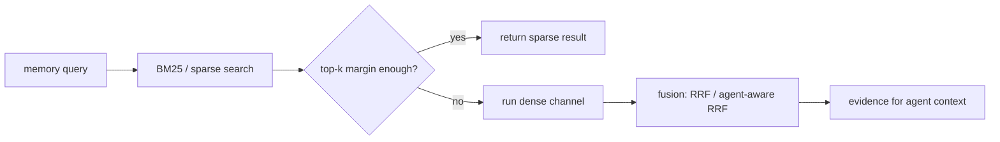

## 来源说明

本文基于 2026-06-03 的每日深度技术研究发布流程写成。今天没有找到足够强的 2026-06-03 同日新论文或官方工程发布，可以支撑一篇当天新材料文章；因此选择过去一周尚未在本站单独处理、但机制足够完整的主线：`AgentIR: A Workload-Adaptive Cascade Retrieval Substrate for Long-Term Conversational Memory`。

核心来源：

- Aojie Yuan, Haiyue Zhang, Shahin Nazarian: [AgentIR: A Workload-Adaptive Cascade Retrieval Substrate for Long-Term Conversational Memory](https://arxiv.org/abs/2605.25092), arXiv:2605.25092, submitted on 2026-05-24
- Di Wu 等: [LongMemEval-V2: Evaluating Long-Term Agent Memory Toward Experienced Colleagues](https://arxiv.org/abs/2605.12493), arXiv:2605.12493
- Adyasha Maharana 等: [Evaluating Very Long-Term Conversational Memory of LLM Agents](https://arxiv.org/abs/2402.17753), LoCoMo, arXiv:2402.17753
- Abdelghny Orogat, Essam Mansour: [Is Agent Memory a Database? Rethinking Data Foundations for Long-Term AI Agent Memory](https://arxiv.org/abs/2605.26252), arXiv:2605.26252

这篇文章和本站 2026-05-09 的数据库原生记忆文章、2026-05-12 的 benchmark hygiene 文章、2026-05-29 的记忆注入文章相邻，但问题不同：本文只讨论长期记忆的读路径控制面。它不解决记忆写入、修订、遗忘和权限治理；它解决的是另一个生产痛点：当记忆库持续增长、每次调用都有低延迟预算时，固定的 BM25 + dense + rerank 管线会浪费大量计算，并且不一定比轻量路径更准。

稳定 slug：`2026-06-03-agentir-adaptive-memory-retrieval`。

## 先给结论

长期 Agent 记忆检索不应该默认是一条固定 RAG 管线。

AgentIR 的关键提醒是：长期对话记忆的 workload 和传统搜索引擎不一样。索引不是离线构建后基本静态，而是在用户会话、工具调用和环境事件中持续增长；查询不是独立同分布，而会在同一会话内从事实回忆、时间定位、偏好查找、跨会话推理之间切换；延迟预算也不是“几百毫秒能接受”，而是经常需要在单次 Agent step 里压到 10ms 以内。

如果每次检索都无条件跑 dense channel，再做 RRF 或 rerank，就会把大量本来可以由 sparse path 解决的问题变成成本问题。AgentIR 把检索做成一个双轴控制面：第一轴选择 BM25、dense、RRF 或 agent-aware RRF；第二轴判断这次是否值得支付 dense channel 的成本。论文报告中，这个 cascade router 只用 BM25 top-k margin 就能决定是否升级检索路径；在 LongMemEval 上跳过 63% 查询仍保持 LLM judge accuracy parity，在 LoCoMo 上自动调到 100% skip，并报告 132x faster 和 Hit@5 提升。

我的工程判断是：生产 Agent memory 的读路径应该像查询优化器，而不是 prompt helper。系统需要先估计查询类型、证据新近性、BM25 置信度、dense 成本、用户可接受延迟和当前任务风险，再决定检索路径。dense retrieval 是工具，不是信仰；BM25 也不是旧技术，而是许多记忆场景里的低延迟强基线。

## 技术问题：长期记忆检索不是普通搜索

普通 IR 系统通常假设索引相对稳定，查询之间弱相关，用户可以接受几十到几百毫秒延迟。Agent 长期记忆不满足这些条件。

第一，索引会在运行时增长。每次对话、工具观察、用户纠正、环境状态、失败尝试和计划变更都可能写入记忆。一个长期运行的 assistant 不是每天重建一次索引，而是在 query stream 中边写边查。

第二，相关性有强时间结构。很多记忆查询并不是“全库最相似文档”，而是“最近这个项目里，用户刚刚纠正过什么”“上一次这个命令为什么失败”“当前流程最新状态是什么”。这类查询通常带有强 recency bias。

第三，查询类型会漂移。用户先问一个事实，再要求根据旧事实推断，随后又要求撤销或更新偏好。固定检索策略很容易在某些类型上过度检索，在另一些类型上漏掉证据。

第四，Agent step 会放大延迟。一次复杂任务可能包含几十次 memory lookup。如果每次 lookup 都固定支付 dense encoding、ANN、fusion、rerank 成本，单步延迟会变成整条任务链路的瓶颈。

第五，记忆召回不是最终目标。LongMemEval-V2 把问题推进到环境经验：静态状态、动态状态、工作流知识、环境陷阱和前提意识。LoCoMo 则强调跨长会话的问答、事件总结和多模态对话。检索层最终要服务于下游决策，不只是提高 Recall@5。

## 机制拆解：AgentIR 的三个值得保留的设计

### 1. 用 cascade router 决定是否升级 dense path

AgentIR 最实用的机制不是“又做了一个新向量库”，而是把 dense retrieval 从默认步骤变成条件步骤。

简化后的路径是：



这里的关键指标是 BM25 top-k margin。我的理解是：如果 sparse path 的头部结果和后续结果分差足够大，说明这次查询已经有明确文本锚点，继续跑 dense 可能收益有限；如果 margin 不够，说明 sparse 结果不稳定，再升级到 dense + fusion。

这不是把 dense 判死刑，而是把 dense 当作预算可控的补充路径。AgentIR 摘要报告 dense channel 约 52ms；当一次 Agent run 里有很多 lookup，这个成本会线性放大。cascade router 的价值就是把“每次都付费”改成“低置信时付费”。

### 2. 用 agent-aware fusion 承认记忆有时间和重要性

普通 RRF 把不同检索器的 rank 合并起来，但 Agent memory 不是普通网页检索。很多记录有角色、时间、来源、重要性和作用域。

AgentIR 提到的 agent-aware RRF 可以理解为：在 sparse/dense 排名之外，给新近性和重要性留一个显式入口。工程上我不会让它直接变成“越新越重要”，而会拆成三个信号：

- `recency_score`：这条记忆距离当前任务有多近。
- `authority_score`：来源是用户明确确认、工具输出、项目文件，还是网页/模型总结。
- `utility_score`：历史上被正确使用、减少纠错或通过验证的次数。

这样做的原因是，记忆系统最危险的错误之一就是把“最近”误当成“可信”。最近的网页片段、低权威记忆或污染输入，不应该因为时间新就压过经过验证的项目事实。

### 3. 用时间分区索引处理增长，而不是无限扫全库

AgentIR 的底层 substrate 使用 time-partitioned index。论文摘要报告，在时间分区索引下，1234x corpus growth 只带来 3.6x latency increase，并在 5M records 上达到 sub-100us p50；作者还报告在 BEIR 数据集上相对 Pyserini/PISA 的速度优势，同时指出 BM25/GPU correctness pitfalls 可能造成 nDCG@10 大幅退化。

这些数字我不会当作未经复现的生产承诺，但机制本身很重要：长期记忆库不能只靠“加机器”和“换向量库”。如果 workload 有明显 recency bias，就应该把时间作为索引组织的一等维度。更具体地说：

- 最近分区常驻热索引。
- 较旧分区按项目、实体、主题或重要性降级。
- 查询先命中近分区，低置信或特定问题再扩展到旧分区。
- 旧分区不是被删除，而是进入更便宜、更慢、更可审计的路径。

这和人类工作记忆很像：近期上下文应该便宜可取，历史档案可以慢一点，但不能丢失来源。

## 工程判断：读路径要和写路径解耦

AgentIR 很强，但它不能被误读成“长期记忆问题已经由检索优化解决”。

读路径回答的是：给定现有 memory state，如何低延迟、高质量地取证据。写路径回答的是：哪些内容应该进入 memory state，旧事实如何修订，错误记忆如何撤销，访问一次是否应该提升 salience，遗忘是否保留审计历史。

`Is Agent Memory a Database?` 的 GEM 观点刚好提供了边界：长期记忆正确性是 state trajectory 的属性，不是单条记录、embedding 或边的属性。它把 ingestion、revision、forgetting、retrieval 都看成会改变状态的 operator。这个观点和 AgentIR 不冲突，反而互补：AgentIR 适合做高性能 retrieval substrate；GEM 类工作提醒我们 retrieval 不能替代 memory governance。

我会按下面的架构拆分：

| 层 | 负责什么 | 不负责什么 |
| --- | --- | --- |
| Memory write policy | 写入、修订、遗忘、来源、作用域、审计 | 低延迟检索优化 |
| Retrieval control plane | 查询分类、cascade routing、fusion 选择、延迟预算 | 判断事实是否应该被写入 |
| Index substrate | sparse/dense/time-partitioned index、热冷分层、并发容量 | 业务语义治理 |
| Context injector | 把证据压入当前工作上下文 | 决定证据是否真实 |
| Evaluation harness | 召回、使用、延迟、成本、污染和回归指标 | 线上策略自动正确 |

这套拆分的好处是，读路径可以快速演进，不会把“更快的检索”伪装成“更可信的记忆”。反过来，写入治理也不会被迫承担每次 lookup 的性能优化。

## 一个可落地的实现方案

如果我要在现有 Agent 系统里实现 AgentIR 风格的记忆读路径，我会先做一个保守版本，而不是重写整个检索引擎。

第一步，所有 memory record 都带上最小元数据：

```ts
type MemoryRecord = {
  id: string;
  scope: "user" | "project" | "task" | "runtime";
  source: "user_confirmed" | "tool_output" | "project_file" | "web" | "model_summary";
  createdAt: string;
  updatedAt?: string;
  importance: number;
  salience: number;
  text: string;
  embeddingRef?: string;
};
```

第二步，把检索 API 从 `search(query)` 改成带预算和意图的 `retrieve(request)`：

```ts
type RetrievalRequest = {
  query: string;
  scope: string[];
  intent: "fact" | "temporal" | "preference" | "workflow" | "debug" | "unknown";
  maxLatencyMs: number;
  requireAuthority?: Array<MemoryRecord["source"]>;
};

type RetrievalPlan =
  | { mode: "sparse_only"; reason: string }
  | { mode: "dense_fusion"; reason: string }
  | { mode: "expand_old_partitions"; reason: string };
```

第三步，先跑 sparse path，计算可解释的置信特征：

- top1/top2 score margin
- top-k scope purity
- top-k authority distribution
- top-k recency distribution
- query 是否含实体、时间、路径、命令、错误码
- 当前任务是否属于高风险执行

第四步，再做路由：

```ts
function planRetrieval(features: RetrievalFeatures, req: RetrievalRequest): RetrievalPlan {
  if (features.authorityMissing) {
    return { mode: "expand_old_partitions", reason: "sparse hits lack required authority" };
  }

  if (features.margin >= thresholdFor(req.intent) && features.scopePurity > 0.8) {
    return { mode: "sparse_only", reason: "high sparse confidence under budget" };
  }

  if (req.maxLatencyMs >= 60) {
    return { mode: "dense_fusion", reason: "low sparse confidence and dense budget available" };
  }

  return { mode: "expand_old_partitions", reason: "low confidence but dense budget unavailable" };
}
```

第五步，把每次检索计划和最终答案绑定记录下来。否则团队只能看到“模型答错了”，看不到错在写入、索引、路由、融合、注入还是模型使用。

## 适用场景

适合 AgentIR 思路的场景有三个共同点：记忆持续增长、单次任务会多次检索、延迟预算明确。

第一类是个人长期 assistant。它频繁查用户偏好、项目习惯、历史决策和最近状态。多数查询可以先用 sparse + recency，只有跨语义推理或表达不一致时才升级 dense。

第二类是 coding agent。命令、文件路径、错误码、测试名和 API 名天然适合 sparse path；但“上次为什么不这样修”或“用户偏好哪种抽象”可能需要 dense/fusion。固定 dense 管线通常浪费。

第三类是企业流程 agent。工单、客户、策略、审批和流程节点都有明确结构。读路径应优先使用高权威结构化记录，dense 只用于补充语义相近的历史案例。

第四类是研究 agent。它需要在笔记、论文、实验日志和失败假设中检索证据。这里最重要的是来源和时间，而不是单纯 embedding 相似度。

## 失败模式

第一，BM25 置信度幻觉。top-k margin 高不代表事实正确，只代表文本匹配集中。错误写入或污染记忆也可能有很高 sparse confidence。

第二，新近性误用。最近记录可能只是临时状态、错误观察或低权威网页片段，不能自动压过长期确认事实。

第三，dense 被过度跳过。某些跨表达、跨语言、跨概念查询确实需要 dense；skip threshold 如果只按平均指标调优，会伤害长尾任务。

第四，评测只看 retrieval，不看使用。召回正确证据后，模型仍可能忽略、误读或过度泛化。

第五，旧分区失明。时间分区可以加速，但如果旧事实仍是当前约束，过早停止会造成系统性遗忘。

第六，多作用域污染。用户级、项目级、任务级记忆混在同一索引里，retrieval control plane 再聪明也会把错误作用域的证据带进上下文。

第七，GPU 正确性退化。AgentIR 摘要特别提到 BM25/GPU correctness pitfalls。工程团队如果只追吞吐，不做 CPU/GPU ranking parity 检查，可能把检索质量悄悄打坏。

第八，把快当成好。132x faster 这类数字只能说明特定 workload 下路径选择有效；上线决策还要看任务成功率、纠错率、来源可信度和安全边界。

## 可验证指标

Sparse skip rate：不同意图、不同作用域下，dense channel 被跳过的比例。

Quality parity under skip：跳过 dense 后，下游 LLM judge accuracy、人工验收或任务成功率是否保持不降。

Intent-specific threshold curve：事实、时间、偏好、工作流、debug 查询分别对应的 margin threshold 和质量曲线。

Latency p50/p95/p99：不只看平均检索时间，尤其看多次 lookup 串联后的任务级延迟。

Evidence authority mix：最终注入上下文的证据中，用户确认、工具输出、项目文件、网页、模型摘要各占多少。

Old-partition recall：需要旧事实的问题中，时间分区 early stop 是否漏召回。

Scope contamination rate：跨用户、跨项目、跨任务错误召回比例。

Retrieval-to-use rate：被检索出的证据有多少真的被模型引用、执行或影响决策。

Correction recurrence：用户重复纠正同一记忆相关错误的次数是否下降。

CPU/GPU ranking parity：同一查询在 CPU sparse path 和 GPU optimized path 下的 top-k、nDCG 或业务标签是否一致。

Cost per successful task：每个成功任务消耗的 memory lookup 次数、dense 调用次数、token 注入量和端到端时间。

Poisoned-memory resilience：低权威或污染记录进入索引后，router/fusion 是否会把它提升到高风险上下文。

## 局限分析

第一，AgentIR 是预印本，本文使用的是论文摘要和可公开页面信息。作者报告的速度、accuracy parity、capacity 和 BEIR 对比数字不能等同于独立复现结果。

第二，LongMemEval、LoCoMo 和 LongMemEval-V2 都是重要基准，但它们仍不能完整代表真实生产系统。真实系统有权限、隐私、成本、撤销、错误写入、用户反馈和长期状态漂移。

第三，BM25 margin 适合作为 cheap confidence signal，但不是事实可信度。它需要和来源权威、作用域、时间、验证结果一起用。

第四，time-partitioned index 依赖 workload 的 recency bias。如果系统大量查询长期稳定规则、历史合同、旧研究结论或多年项目约束，时间优先策略可能漏掉关键证据。

第五，读路径优化不能替代写路径治理。没有 ingestion、revision、forgetting 和审计策略，检索越快，只会越快地把错误记忆送进上下文。

## 我会如何实现和验证

我不会第一天就实现 AgentIR 级别的专用 IR substrate。更稳的路线是先在现有 memory store 上加一层 retrieval control plane。

第一周做日志改造：记录每次查询的 intent、scope、top-k margin、dense 是否运行、最终注入证据、模型是否引用、任务结果和用户纠错。没有这些数据，任何 threshold 都是在猜。

第二周做 sparse-first cascade：默认先跑 BM25 或关键词索引，只有低 margin、低 scope purity、缺少权威来源或特定 intent 时才跑 dense/fusion。阈值先离线回放，不直接影响线上。

第三周做时间分区实验：按 day/week/project 分区，比较全库检索、近分区优先、近分区 early stop 三种策略在旧事实召回和延迟上的差异。

第四周做回归集：从真实失败中抽取 100 到 300 个 memory lookup case，标注期望证据、可接受来源、是否需要旧分区、是否允许 dense skip。每次改 router 都跑这套回归。

上线门槛不应该是“平均延迟下降”，而是同时满足：p95 latency 下降、任务成功率不降、旧事实召回不降、scope contamination 不升、低权威证据注入下降、用户重复纠错下降。

## 自审

事实可靠性：AgentIR 的提交日期、研究问题、BM25/dense/RRF/agent-aware RRF、BM25 top-k margin cascade、LongMemEval 与 LoCoMo 报告数字、time-partitioned index 和 BM25/GPU correctness pitfalls 均来自 arXiv 页面摘要。LongMemEval-V2、LoCoMo 和 GEM 只作为相关工作边界，不用于证明 AgentIR 的实验结果。

来源完整性：核心结论来自原始 arXiv 页面；未把二级论文评论当作核心事实来源。由于当前 shell DNS 无法直接下载 PDF，本文没有引用论文正文中无法从公开摘要复核的细节。

是否复述摘要：正文重点是把 AgentIR 拆成 retrieval control plane，并给出工程分层、API、指标和验证路线，不是逐段改写摘要。

标题党检查：标题只说“需要控制面”，没有声称 AgentIR 解决长期记忆，也没有把 dense retrieval 贬为无用。

薄内容检查：正文包含机制图、数据模型/API 示例、工程落地方案、可验证指标、失败模式、局限和自审。

猜测边界：实现方案、阈值特征和上线门槛是本文工程建议；AgentIR 的性能数字明确标为作者报告结果。

站内重复：本站已有数据库原生记忆、benchmark hygiene、工作上下文注入、级联压缩和记忆安全文章。本文新增的是长期记忆读路径的自适应检索控制面，主题不重复。
