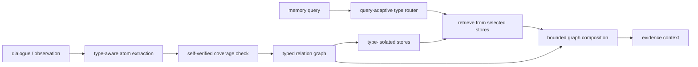

## 来源说明

本文基于 2026-06-04 的每日深度技术研究发布流程写成。今天没有找到足够强的 2026-06-04 同日主来源，可以支撑一篇当天新材料文章；因此选择过去一周尚未在本站单独处理、但机制完整且有工程价值的主线：`MemGuard: Preventing Memory Contamination in Long-Term Memory-Augmented Large Language Models`。

核心来源：

- Hyeonjeong Ha 等: [MemGuard: Preventing Memory Contamination in Long-Term Memory-Augmented Large Language Models](https://arxiv.org/abs/2605.28009), arXiv:2605.28009, submitted on 2026-05-27
- Adyasha Maharana 等: [Evaluating Very Long-Term Conversational Memory of LLM Agents](https://arxiv.org/abs/2402.17753), LoCoMo
- Di Wu 等: [LongMemEval-V2: Evaluating Long-Term Agent Memory Toward Experienced Colleagues](https://arxiv.org/abs/2605.12493), arXiv:2605.12493
- Ding Chen 等: `HaluMem: Evaluating Hallucinations in Memory Systems of Agents`, arXiv:2511.03506，作为 MemGuard 论文报告的评测背景

这篇文章和本站 2026-05-31 的记忆投毒文章相邻，但不是同一问题。记忆投毒讨论的是不可信输入如何长期影响 Agent 行为；本文讨论的是即使没有攻击者，系统也会因为把不同功能的记忆当作可互换证据而产生长期幻觉。它更接近记忆系统的数据建模和证据治理问题。

稳定 slug：`2026-06-04-memguard-type-aware-memory-boundary`。

## 先给结论

长期记忆系统不能只问“这条记忆和查询语义相似吗”，还要问“这条记忆在当前推理里是什么证据类型”。

MemGuard 提出的核心失效模式是 heterogeneous memory contamination，本文译作“异构记忆污染”：稳定用户事实、一次性情景事件、行为规则或操作建议被写进同一个共享空间，检索时又被当作同等证据组合。结果是，情景事件可能被过度泛化成稳定事实，操作建议可能覆盖约束条件，语义相似但功能不兼容的记忆会挤掉真正需要的证据。

论文作者报告，MemGuard 在写入时把对话分解为 semantic、episodic、procedural 三类原子记忆，维护类型隔离的存储和跨类型关系图；检索时先做查询类型路由，再通过关系图有限扩展证据。作者在 HaluMem、LoCoMo、LongMemEval、PerLTQA 等任务上评估，报告 HaluMem anti-hallucination accuracy 达到 89.53%，相对基线提升 28.27%，并在部分长期对话任务中减少记忆 token 检索量。

我的工程判断是：这篇论文最值得保留的不是“三类记忆”这个分类本身，而是把类型边界变成可靠性约束。生产系统如果继续用一个 `memories` 表、一套 embedding、一个 top-k，把用户偏好、项目事实、一次工具观察、历史失败和操作规范混在一起，后续再靠 prompt 告诉模型“谨慎使用记忆”，成本会很高。正确的位置应该在写入、更新、检索和组合四个阶段都显式保留证据类型。

## 技术问题：记忆幻觉会在写入和检索阶段累积

很多团队把长期记忆幻觉理解成生成阶段问题：模型拿到了上下文但没有正确回答。这个解释不完整。

长期记忆系统的错误可以在更早阶段固化。一次对话里出现的临时事件，如果被写成稳定事实，它会在未来多次被召回；一次工具失败原因，如果被抽象成“永远不要使用某工具”，就会污染后续任务规划；一次用户对具体项目的偏好，如果被写成全局偏好，就会造成跨项目泄漏。

MemGuard 论文把问题拆成三段：

| 阶段 | 典型错误 | 工程后果 |
| --- | --- | --- |
| 写入污染 | 不完整抽取、过度概括、把临时事件写成稳定事实 | 错误记忆跨会话持续存在 |
| 检索污染 | 语义相似但功能不兼容的记忆一起进入上下文 | 正确证据被噪声挤掉或降权 |
| 组合失败 | 模型把证据类型混用，或在证据不足时仍回答 | 幻觉被包装成“基于记忆”的结论 |

作者在 LoCoMo 上做的错误分析报告了一个有用信号：unverifiability errors 主要和写入阶段污染相关，factuality errors 更常和检索阶段污染相关。这个结果来自论文实验和 LLM-as-a-judge 标注，不应视作独立复现结论；但它给工程排障提供了方向：当系统在证据不足时仍然回答，先查写入门禁；当正确事实存在但答错，先查检索路由和排序。

## 机制拆解：类型边界不是标签，而是控制面

MemGuard 的机制可以简化成两个闭环：写入时重组记忆，检索时按查询动态路由。



### 1. 写入：每条记忆只能承担一个功能角色

论文把记忆原子建模为：

```ts
type MemoryType = "semantic" | "episodic" | "procedural";

type MemoryAtom = {
  id: string;
  title: string;
  details: string;
  type: MemoryType;
  timestamp: string;
  sourceTurnIds: string[];
};
```

重点不是字段名，而是单类型约束。一个 atom 不能同时是“用户稳定事实”和“一次事件观察”。如果一段对话同时包含事实、事件和建议，就要拆成多个 atom。

这会增加写入成本，但换来两个收益：

- 更新只在同类型存储里发生，避免 procedural 建议覆盖 semantic 约束。
- 检索可以先决定需要哪类证据，而不是把所有相似片段交给模型自行辨认。

### 2. 自检：防止抽取器漏掉约束

单次 LLM 抽取很容易漏掉否定、时间、限定条件和例外。MemGuard 在写入前加入 self-verified extraction：先抽取原子记忆，再检查原始对话中哪些信息没有被 atom 覆盖，把缺失 atom 补回来。

工程上我会把这个步骤实现为两个独立 prompt 或两个模型调用，并保留 coverage diff：

```ts
type CoverageCheck = {
  sourceTurnIds: string[];
  extractedAtomIds: string[];
  missingClaims: Array<{
    text: string;
    proposedType: MemoryType;
    reason: "constraint" | "exception" | "temporal_scope" | "preference" | "task_state";
  }>;
};
```

这里不能只看“抽取了多少条”。更重要的指标是约束覆盖率：包含否定、禁用、过敏、权限、时间范围、项目范围、撤销和用户纠正的句子，是否被原样保留下来。

### 3. 关系图：允许组合，但不允许混写

类型隔离不等于互相看不见。长期记忆经常需要跨类型组合：一个 semantic 约束可能解释某个 episodic 事件，一个 procedural 规则可能只适用于某个项目状态。

MemGuard 的做法是维护关系图：atom 内容保留在各自类型存储中，跨类型依赖通过边表达。工程上可以从简单关系开始：

```ts
type MemoryRelation =
  | "supports"
  | "contradicts"
  | "scopes"
  | "updates"
  | "caused_by"
  | "derived_from"
  | "requires";

type MemoryEdge = {
  from: string;
  to: string;
  relation: MemoryRelation;
  confidence: number;
  createdAt: string;
};
```

这比“把相关内容合并成一条摘要”更可控。摘要会压扁证据类型；关系图可以让系统在检索时有限扩展，比如最多 2 hop，并要求每条扩展证据说明它和主证据的关系。

### 4. 检索：先路由类型，再取 top-k

传统记忆检索通常是：

```text
query -> embedding -> vector top-k -> prompt context
```

MemGuard 更接近：

```text
query -> required memory types -> per-type retrieval budget -> graph expansion -> evidence set
```

一个可落地的路由策略如下：

```ts
function routeMemoryTypes(queryIntent: string, riskLevel: "low" | "normal" | "high") {
  if (queryIntent === "stable_user_fact") return { semantic: 0.8, episodic: 0.2, procedural: 0 };
  if (queryIntent === "what_happened_last_time") return { semantic: 0.1, episodic: 0.8, procedural: 0.1 };
  if (queryIntent === "how_should_i_do_this") return { semantic: 0.3, episodic: 0.2, procedural: 0.5 };
  if (riskLevel === "high") return { semantic: 0.6, episodic: 0.2, procedural: 0.2 };
  return { semantic: 0.34, episodic: 0.33, procedural: 0.33 };
}
```

这段伪代码不是论文实现，只是工程化表达。关键原则是：高风险回答不能只依赖 episodic 记忆；操作建议必须带 semantic 约束；项目状态类问题要优先最近 episodic 证据，但不能让历史事件覆盖当前明确规则。

## 工程判断：把 memory type 做成 schema，而不是 prompt 约定

我会把 MemGuard 的思想落到四个系统边界。

第一，存储 schema 必须有类型和作用域。`type`、`scope`、`source`、`validFrom`、`validUntil`、`supersedes`、`confidence` 不应该是可选备注，而应该参与写入和检索策略。

第二，更新只能在同类型内发生。用户事实更新用户事实，任务事件更新任务事件，操作规则更新操作规则。跨类型影响只能通过关系边表达，不能直接合并。

第三，检索结果必须带证据角色进入上下文。给模型的不是一段无结构文本，而是类似：

```yaml
semantic_constraints:
  - id: m_17
    text: "用户明确不希望在生产环境自动执行破坏性命令。"
episodic_events:
  - id: m_42
    text: "上次部署失败是因为 Vercel CLI 缺少认证。"
procedural_rules:
  - id: m_81
    text: "发布前必须先构建，通过后再推送和部署。"
relations:
  - from: m_81
    to: m_42
    relation: "scopes"
```

第四，生成阶段仍要做 grounding 检查。MemGuard 论文也承认，它主要控制写入和检索，不直接控制生成时行为。生产系统需要在输出前检查：结论是否引用了正确类型的证据，是否把 episodic 事件写成稳定事实，是否在证据不足时应该 abstain。

## 适用场景

这类设计最适合以下系统：

- 个人助手：需要同时记住稳定偏好、一次性安排、健康/财务等高风险约束。
- 编程 Agent：需要区分仓库事实、一次运行日志、修复规则、用户风格偏好。
- 企业知识助手：需要避免把某个客户案例泛化为全公司规则。
- 安全审计 Agent：需要区分授权范围、一次扫描证据、验证步骤和通用修复策略。
- 多会话工作流 Agent：需要追踪项目状态变化，而不是只保留最终摘要。

不适合的场景也很明确：如果系统只做短会话问答，没有长期写入；或者记忆只是用户手动维护的少量 profile 字段，完整的类型隔离和关系图可能过重。

## 失败模式

MemGuard 方向并不能自动解决所有记忆问题。

| 失败模式 | 为什么会发生 | 缓解方式 |
| --- | --- | --- |
| 类型分类错误 | LLM 把事件误标为事实，或把规则误标为偏好 | 高风险类型用规则校验和人工审核 |
| 关系图膨胀 | 每次写入都生成大量弱关系 | 限制边类型、置信度和 hop 数 |
| 过度隔离 | 检索只看单一类型，漏掉必要上下文 | 查询路由保留最小跨类型预算 |
| 生成阶段误用 | 上下文正确，但模型仍把证据角色混用 | 输出前 grounding / citation check |
| 删除和撤销不彻底 | 旧 atom 仍通过关系边被扩展出来 | 删除要同步处理索引、边和派生摘要 |
| 成本上升 | 写入抽取、自检、路由都需要额外推理 | 只对长期记忆和高风险作用域启用完整流程 |

这里最危险的是“类型标签看起来存在，但不参与控制”。如果 `type` 只是前端展示字段，检索仍然全库 top-k，更新仍然跨类型合并，那么系统只是在污染上加了颜色。

## 可验证指标

我会用下面这组指标验证类型边界是否真的提高可靠性。

| 指标 | 目的 | 计算方式 |
| --- | --- | --- |
| type classification accuracy | 写入类型是否可靠 | 人工标注样本对比 atom type |
| constraint coverage recall | 关键约束是否被写入 | 否定、禁用、例外、撤销句子的覆盖率 |
| cross-type overwrite rate | 是否发生功能混写 | UPDATE 操作中跨类型合并比例，应为 0 |
| retrieval type precision | 检索是否拿到需要的证据类型 | top-k 中符合查询意图的类型占比 |
| evidence sufficiency abstention | 证据不足时是否拒答 | 无答案样本上的 abstain rate |
| stale episodic dominance | 旧事件是否压过新事实 | 有冲突样本中旧 episodic 被引用比例 |
| token efficiency | 类型路由是否节省上下文 | 每次回答使用的 memory token 数 |
| answer groundedness | 最终回答是否由证据支持 | 输出 claim 到 atom 的引用覆盖率 |

这些指标要分作用域统计。全局平均值可能很好看，但高风险场景坏一次就足够严重。尤其是医疗、财务、安全操作、生产部署和权限相关记忆，应该单独设阈值。

## 我会如何实现和验证

如果要在一个现有 Agent 记忆系统里落地，我不会一开始重写全部存储层。更稳妥的路线是先加一个 type-aware shadow path。

第一阶段，只对新写入记忆生成 typed atoms 和关系边，旧记忆保持只读。每条新 atom 必须记录原始 turn、抽取 prompt 版本、类型、作用域和更新时间。

第二阶段，在检索服务旁路增加 type router。先不改变生产回答，只记录传统 top-k 和 typed top-k 的差异：哪些查询会因为类型过滤少拿噪声，哪些查询会漏掉证据。

第三阶段，构造回放集。样本至少包含：

- 用户纠正旧事实。
- 一次事件不应变成稳定偏好。
- 项目 A 的规则不应泄漏到项目 B。
- 操作建议必须带约束条件。
- 证据不足时应拒答。

第四阶段，在低风险功能中启用 typed retrieval，把 prompt context 改成结构化 evidence block，并强制模型在回答中区分“稳定事实”“历史事件”“操作规则”。

第五阶段，上线监控 cross-type overwrite、abstain、token efficiency 和人工抽检 groundedness。如果 token 下降但拒答过多，说明路由太保守；如果准确率提升但成本过高，就把自检和关系图扩展限制在高风险作用域。

## 局限分析

第一，MemGuard 的实验结果是作者报告的预印本结果。HaluMem、LoCoMo、LongMemEval 和 PerLTQA 提供了有价值的评测面，但不能直接等价于生产助手可靠性。

第二，LLM-as-a-judge 参与了部分错误分析和评测。它适合做大规模趋势观察，但对边界安全、医疗财务建议、企业权限判断这类场景，仍需要人工标注和可执行检查。

第三，三类记忆不一定覆盖所有工程场景。编程 Agent 至少还需要 artifact state、tool trace、policy、credential boundary、environment fact 等更细类型。我的建议是从 semantic / episodic / procedural 起步，但不要把它当作最终本体。

第四，类型边界会提高写入复杂度。对短生命周期任务，可能不值得；对长期助手、企业 Agent 和安全敏感场景，额外成本通常是合理的。

第五，它不替代记忆安全。类型隔离能降低误用和污染，但不能防止恶意输入被写入；仍然需要来源信任、写入权限、用户可见审计、删除机制和记忆投毒检测。

## 自审

- 事实可靠性：主来源是 arXiv:2605.28009；关键实验数字标注为作者报告结果，没有写成独立复现。
- 来源完整性：补充了 LoCoMo、LongMemEval-V2 和 HaluMem 作为评测背景；没有使用社区帖作为核心证据。
- 原创性：文章重点是把类型边界转化为生产 memory schema、路由、关系图和指标，不复述论文摘要。
- 站内差异化：区别于 2026-05-31 的记忆投毒文章，本文聚焦非对抗条件下的异构记忆污染和可靠性治理。
- 工程价值：包含机制图、数据模型、接口示例、落地路线和可验证指标。
- 边界：没有给出攻击第三方目标的操作流程；安全相关内容仅用于防御和系统治理。
