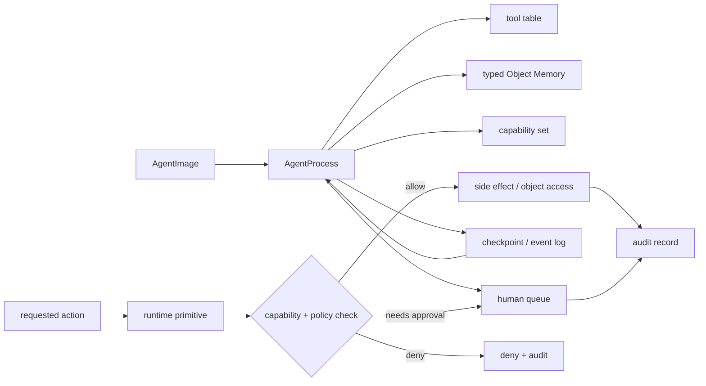

## 来源说明

本文基于 2026-06-05 的每日深度技术研究发布流程写成。今天没有找到足够强的 2026-06-05 同日主来源；选择过去三天尚未在本站处理、但足以支撑一篇原创安全工程文章的主线：`Agent libOS: A Library-OS-Inspired Runtime for Long-Running, Capability-Controlled LLM Agents`。

核心来源：

- Yingqi Zhang: [Agent libOS: A Library-OS-Inspired Runtime for Long-Running, Capability-Controlled LLM Agents](https://arxiv.org/abs/2606.03895), arXiv:2606.03895, submitted on 2026-06-02
- Yiqi Wang 等: [From Agent Traces to Trust: Evidence Tracing and Execution Provenance in LLM Agents](https://arxiv.org/abs/2606.04990), arXiv:2606.04990, submitted on 2026-06-03
- Haiyue Zhang 等: [Agent Audit: A Security Analysis System for LLM Agent Applications](https://arxiv.org/abs/2603.22853), arXiv:2603.22853，以及 [HeadyZhang/agent-audit](https://github.com/HeadyZhang/agent-audit) 项目文档
- OpenAI: [The next evolution of the Agents SDK](https://openai.com/index/the-next-evolution-of-the-agents-sdk) 与 [Agents SDK tracing docs](https://openai.github.io/openai-agents-python/tracing/)，作为生产 Agent 运行时、沙箱和 tracing 方向的官方工程背景
- AWS: [AgentOps: Operationalize agentic AI at scale with Amazon Bedrock AgentCore](https://aws.amazon.com/blogs/machine-learning/agentops-operationalize-agentic-ai-at-scale-with-amazon-bedrock-agentcore/) 与 [Extending MCP support for Amazon Bedrock AgentCore Gateway](https://aws.amazon.com/blogs/machine-learning/extending-mcp-support-for-amazon-bedrock-agentcore-gateway-2/)，作为托管运行时中策略、身份和 MCP gateway 的工程背景
- GitHub: [CodeQL 2.25.5 changelog](https://codeql.github.com/docs/codeql-overview/codeql-changelog/codeql-cli-2.25.5/)，作为传统静态分析覆盖面的对照

这篇文章和本站 2026-06-02 的“认证轨迹”文章相邻，但不是同一篇。那篇文章讨论执行前的计划证书和策略认证；本文讨论更底层的问题：如果工具调用只是一个普通函数边界，长期运行 Agent 的权限、记忆、恢复和审计仍然会散落在应用胶水代码里。Agent libOS 给出的启发是，把 Agent 当作可调度进程，把 Object Memory、capability、人类审批、checkpoint 和 audit record 做成运行时原语。

稳定 slug：`2026-06-05-agent-libos-runtime-authority-boundary`。

## 先给结论

长期运行 Agent 的安全边界不应该只放在 prompt、tool schema 或“调用工具前问模型一遍是否安全”上。真正可审计的边界应该在运行时原语上：读对象、写文件、注册工具、调用 shell、等待外部事件、恢复 checkpoint、请求人工授权、发起外部副作用，都应该经过同一套能力检查和审计记录。

Agent libOS 论文把 Agent 抽象成 `AgentProcess`：有进程身份、父子 lineage、生命周期状态、由 `AgentImage` 派生的工具表、typed Object Memory、显式 capabilities、人类队列、checkpoint、event 和 audit record。作者明确说它不是内核、不是 POSIX OS，也不解决硬件隔离；它是在宿主 OS 之上给 LLM Agent 提供一个 library-OS 风格的运行时基座。

我的工程判断是：这篇论文最有价值的地方不是“给 Agent 做一个 OS”这个比喻，而是它把信任边界从工具 wrapper 上移开。工具可以是模型可见的接口；授权必须落在运行时 primitive。否则任何 MCP server、function tool、JIT tool 或自定义 skill 都可能把权限语义藏在实现细节里，安全团队只能在事故后读日志猜测“当时到底是谁允许了这个动作”。

## 技术问题：工具边界不是权限边界

当前很多 Agent 系统默认采用这样的模型：

```text
LLM plan -> choose tool -> call tool function -> append result -> continue
```

这对演示足够，对长期运行任务不够。长期运行 Agent 会跨多轮模型调用维护状态，会 fork 子任务，会等待外部审批，会恢复中断任务，会把中间结果写入记忆，会生成或安装新工具，还会执行真实副作用。风险不只来自单次 tool call，而来自多个状态变化的组合。

典型失败不是“某个工具函数名字写错”，而是：

| 问题 | 传统工具边界的弱点 | 运行时边界应该提供什么 |
| --- | --- | --- |
| 权限漂移 | 工具一旦暴露，模型可在不同上下文反复调用 | capability 带作用域、期限和一次性授权 |
| 记忆越权 | 历史对象被当作普通上下文读写 | Object Memory 命名空间、类型和访问策略 |
| JIT 工具风险 | 动态注册工具绕过原始 allowlist | 注册本身是受控 primitive |
| 恢复不可审 | checkpoint 之后继续执行时丢失授权语境 | checkpoint 绑定身份、能力和审批记录 |
| 人审断裂 | 人类批准的是自然语言描述，不是具体副作用 | approval 绑定 action、参数、资源和有效期 |
| 审计缺口 | 日志记录“调用了工具”，但不能解释为什么可调用 | audit record 记录授权决策和证据链 |

`From Agent Traces to Trust` 从 provenance 角度补充了同一问题：最终答案正确率无法解释证据、工具输出、记忆项、环境观察、中间声明、动作和最终答案之间的关系。我的推断是，trace/provenance 如果只作为外部日志存在，最多帮助事后解释；如果要变成安全控制，就必须嵌入运行时原语。

## 机制拆解：把 Agent 当作进程，而不是聊天循环

Agent libOS 的抽象可以压缩成一个控制面：



### 1. AgentProcess：把身份和 lineage 固化下来

长期运行 Agent 不能只用 `session_id` 表示身份。一个主 Agent fork 出子任务后，子任务继承了哪些权限、能访问哪些对象、能否注册新工具、能否写回父任务记忆，都必须可检查。

我会把进程元数据设计成：

```ts
type AgentProcess = {
  pid: string;
  parentPid?: string;
  imageId: string;
  principal: string;
  lifecycle: "created" | "running" | "waiting" | "suspended" | "completed" | "failed";
  namespace: string;
  capabilityIds: string[];
  checkpointId?: string;
};
```

事实层面，Agent libOS 论文报告了 Python 原型、async scheduling、namespace-local Object Memory、runtime-integrated human approval、one-shot permission grants、per-process working directories、Deno/TypeScript JIT tools over a syscall broker 等组件。工程上我不会直接把这些视为生产成熟度证明；我会把它们当作一个可验证架构清单。

### 2. Object Memory：记忆是对象资源，不是 prompt 字符串

Agent memory 文章经常讨论抽取、检索、压缩和评测；安全工程里更容易被忽略的是访问控制。一个长期任务中，记忆项可能包含用户授权、扫描证据、生产环境路径、客户数据片段、临时凭证引用、失败恢复状态。把这些全部拼成 prompt，会让权限语义消失。

运行时应该把记忆当作对象资源：

```ts
type ObjectRef = {
  objectId: string;
  type: "fact" | "artifact" | "credential_ref" | "scan_evidence" | "approval" | "checkpoint";
  namespace: string;
  ownerPid: string;
  labels: string[];
};

type Capability = {
  id: string;
  subjectPid: string;
  action: "read" | "write" | "append" | "delete" | "execute" | "register_tool";
  resourcePattern: string;
  expiresAt?: string;
  oneShot?: boolean;
  requiresApproval?: boolean;
};
```

这和 2026-06-04 的 MemGuard 类型边界有交集，但目的不同。MemGuard 关注记忆类型如何减少长期幻觉；这里关注记忆对象如何参与授权、恢复和审计。一个 `credential_ref` 可以被允许传给部署 primitive，但不应该被普通总结工具读取；一个 `scan_evidence` 可以被报告生成器读取，但不能被 JIT 工具写入覆盖。

### 3. Runtime primitive：工具只是 libc-like wrapper

Agent libOS 的核心设计规则是：工具像 libc wrapper，runtime primitives 才是 authority boundary。这个判断很关键。

如果 `delete_file`、`run_shell`、`register_tool`、`write_memory` 都只是普通工具函数，安全策略就分散在工具实现里。换一个框架、换一个 MCP server、换一个 wrapper，策略可能就消失。运行时 primitive 的意义是，无论动作来自哪个工具表项，最终都必须通过同一个受控入口。

一个极简执行路径可以是：

```ts
async function invokePrimitive(proc: AgentProcess, op: RuntimeOp) {
  const decision = await policy.evaluate({
    pid: proc.pid,
    principal: proc.principal,
    namespace: proc.namespace,
    op,
    capabilities: proc.capabilityIds,
    checkpointId: proc.checkpointId,
  });

  await audit.append({ proc, op, decision, at: new Date().toISOString() });

  if (decision.type === "deny") throw new Error(decision.reason);
  if (decision.type === "approval_required") return humanQueue.enqueue(proc, op, decision);
  return primitiveExecutor.run(proc, op);
}
```

这段代码不是论文实现，只是把论文的运行时边界翻译成工程接口。重点是 `policy.evaluate` 在 primitive 前发生，而不是在模型生成 tool call 后由模型自我解释。

### 4. Audit record：日志要记录授权事实，而不只是动作结果

OpenAI Agents SDK tracing 文档说明，trace 可以包含 LLM generation、tool call、handoff、guardrail 和 custom event。AWS AgentCore 的工程材料也强调通过 Gateway/Policy 对 tool request 做 deterministic policy check，并在多 Agent 链中验证身份和权限传播。这些官方材料说明生产基础设施正在把 Agent 运行时从“框架回调”推向“可治理执行面”。

但 tracing 不是天然等于审计。审计记录至少要回答：

- 哪个进程、代表哪个 principal、在什么 namespace 下请求了动作？
- 请求动作的参数是什么，是否包含外部副作用？
- 哪个 capability 授权了它，是否一次性、是否过期、是否需要人工批准？
- 人工批准如果存在，批准的是哪个资源和参数，而不是哪段自然语言总结？
- 动作读取了哪些 memory object，写入了哪些 artifact，生成了哪些后续能力？
- 恢复执行时，checkpoint 是否仍然绑定同一组能力和策略版本？

这些字段不只是合规材料。它们也是安全验证和故障恢复的最小证据。

## 工程判断：静态扫描要发现边界缺失，运行时要执行边界

Agent Audit 和 CodeQL 给了一个重要对照。CodeQL 2.25.5 的默认 suite 覆盖 496 个 security queries，这是传统 SAST 的强项；Agent Audit 则把检测对象扩展到 Agent tool boundary、MCP config、credential、权限和 OWASP Agentic 风险类别。Agent Audit 项目文档还明确列出局限：当前核心是静态分析，不执行代码；污点分析主要是函数内；Python 为主；复杂运行时逻辑仍可能漏掉。

我的判断是，Agent 安全需要两层配合：

| 层 | 目标 | 应该检查什么 |
| --- | --- | --- |
| 静态白盒扫描 | 发现明显缺失和高风险模式 | tool 参数流向危险 sink、MCP 路径权限过宽、硬编码凭证、无审批副作用、无迭代上限、无记忆 TTL |
| 运行时原语 | 在真实执行时强制授权 | object access、filesystem、shell、network、tool registration、approval、checkpoint、side effect |
| provenance / trace | 解释和复盘执行链 | memory lineage、tool output、claim support、policy decision、approval binding、recovery path |

静态扫描不能替代 runtime policy，因为模型选择、工具返回、外部状态和人类审批都是运行时事件。runtime policy 也不能替代静态扫描，因为很多缺陷在上线前就能被发现，例如 MCP server 来源未固定、工具函数无输入校验、长效凭证写在配置里。

对安全团队来说，最现实的落地路线不是“先造一个完整 Agent OS”，而是先把高风险 primitive 收敛到少数入口：文件写入、shell 执行、网络出站、MCP server 注册、持久记忆写入、外部系统 mutation。只要这些入口被统一授权和审计，哪怕上层仍然使用 LangChain、CrewAI、OpenAI Agents SDK、MCP 或自研框架，安全边界也不会完全依赖框架约定。

## 适用场景

这个设计最适合以下系统：

- 编程 Agent：会读写仓库、执行测试、修改文件、安装依赖、提交代码。
- 安全审计 Agent：会运行扫描器、读取证据、生成验证结论、创建 issue 或 PR。
- 企业流程 Agent：会跨 SaaS、内部 API、审批系统和客户数据执行副作用。
- 多 Agent 工作流：会 fork 子任务、共享对象、转交权限和合并结果。
- 长任务研究/发布 Agent：会跨多小时恢复任务，保留来源、草稿、构建和部署记录。

不适合的场景也明确：只做一次性问答、无持久状态、无工具副作用、无外部系统访问的聊天机器人，不需要完整的进程/能力模型。过早引入复杂运行时，可能让简单应用承担不必要的开发和运维成本。

## 失败模式

| 失败模式 | 为什么会发生 | 缓解方式 |
| --- | --- | --- |
| capability 太粗 | `filesystem:*`、`network:*` 仍然等于全权 | 按资源、动作、期限、namespace 拆细 |
| approval 绑定不严 | 人类批准的是摘要，实际执行参数被替换 | approval record 绑定 op hash 和参数 |
| checkpoint 恢复漂移 | 恢复时策略版本或能力集合已变化 | checkpoint 记录策略版本，恢复前重新认证 |
| Object Memory 旁路 | 工具直接读底层数据库或文件 | 所有对象访问走 runtime object bridge |
| JIT tool 越权 | 新工具注册后获得宿主权限 | register_tool 本身需要 capability 和 sandbox |
| 审计噪声过大 | 每个内部步骤都记录，无法排查 | 分层 trace：decision 必记，debug span 可采样 |
| 静态扫描漏报 | 动态代码、跨函数流和运行时配置难覆盖 | 让扫描器负责上线前基线，runtime 负责执行时强制 |

这里最危险的是“看起来有权限系统，但权限只影响工具列表”。工具列表控制的是模型可见选择，不是宿主系统实际授权。如果底层 primitive 没有校验，模型不可见的路径、插件、脚本或 MCP server 仍然可能绕过边界。

## 可验证指标

我会用下面的指标验证一个 Agent runtime 是否真的把边界下沉到了原语层。

| 指标 | 目的 | 验证方式 |
| --- | --- | --- |
| primitive coverage | 高风险动作是否全部经过受控入口 | 文件、shell、network、memory、MCP、JIT 工具的调用路径审计 |
| denied bypass rate | 未授权动作是否能绕过 runtime | 负向测试：直接调用底层 wrapper、伪造 tool、恢复旧 checkpoint |
| approval binding accuracy | 人审是否绑定具体动作 | 检查 approval record 与 op hash、参数、资源是否一致 |
| capability minimality | 授权是否过宽 | 每个任务实际使用能力 / 授予能力比例 |
| memory object access violation | 记忆对象是否越权读写 | 按 namespace/type/resource pattern 做红队测试 |
| checkpoint recovery correctness | 恢复后是否保持授权语义 | 中断、策略更新、能力过期后的恢复测试 |
| audit explainability | 事故复盘能否重建执行链 | 从最终副作用追溯到 principal、capability、approval、memory source |
| static-runtime agreement | 扫描发现和运行时拒绝是否一致 | Agent Audit / Semgrep / CodeQL 结果与 runtime deny log 对照 |

指标里最重要的是 denied bypass rate。一个系统如果能漂亮地记录允许动作，却挡不住未授权旁路，就只是 observability，不是 security boundary。

## 我会如何实现和验证

第一阶段，我不会重写 Agent 框架，而是做一个 runtime broker。所有高风险工具都只能调用 broker 暴露的 `read_object`、`write_object`、`run_command`、`write_file`、`call_external`、`register_tool`、`request_approval`。旧工具可以保留，但必须迁移到 broker primitive。

第二阶段，给每个任务创建 `AgentProcess` 和 namespace。默认只有只读项目对象、临时工作目录和报告草稿写权限。任何生产副作用、外部网络、凭证引用、持久记忆写入都需要额外 capability。

第三阶段，把人类审批从聊天消息里拿出来，变成结构化记录：

```yaml
approval:
  principal: "user:owner"
  pid: "agent:scan-142"
  op: "write_file"
  resource: "repo://src/content/posts/..."
  op_hash: "sha256:..."
  expires_at: "2026-06-05T12:00:00Z"
  one_shot: true
```

第四阶段，写负向测试。测试不应该只证明“正常任务能跑通”，还要证明：

- 没有 `write_file` capability 时，任何工具都不能写工作区外文件。
- 已过期的一次性 capability 不能在 checkpoint 恢复后继续使用。
- JIT tool 不能获得比注册时声明更大的权限。
- `credential_ref` 不能被普通文本总结工具读取。
- MCP server 配置新增高风险路径时，静态扫描在 CI 阶段阻断。
- audit record 可以从最终文件变更追溯到 approval 和 capability。

这套实现比单纯加 prompt guardrail 重，但它的价值在于可复核。安全边界不是“模型承诺不会做”，而是“运行时没有授权就做不了，并且做过什么可以还原”。

## 局限分析

第一，Agent libOS 是一篇新近预印本，论文报告的是原型和安全导向评估，不等于独立复现的生产系统。本文引用它作为架构启发，而不是把作者报告的组件数量或测试数量当作行业结论。

第二，library-OS 风格运行时不提供内核级隔离。真正的代码执行、容器隔离、网络隔离、secret 管理、供应链验证仍然要依赖宿主 OS、沙箱、云平台和 CI/CD 控制。运行时 broker 是授权面，不是所有安全问题的替代品。

第三，capability 模型会增加开发成本。团队需要维护资源命名、策略版本、能力生命周期、approval UX 和审计存储。如果任务很简单，这套成本可能不划算。

第四，静态扫描和运行时控制之间需要工程闭环。Agent Audit 这类工具能发现大量 agent-specific 风险，但当前仍有语言、框架和过程间分析局限；运行时 broker 能强制执行，但如果工具绕过 broker 或资源直接暴露，边界仍会失效。

第五，privacy-aware audit 仍然困难。trace 和 audit record 会包含敏感输入、工具结果、记忆对象和审批信息。记录太少无法审计，记录太多会扩大数据暴露面。生产系统需要分级脱敏、保留期限、访问控制和可删除策略。

## 自审

- 事实可靠性：核心事实来自 arXiv 原文摘要页、官方 OpenAI/AWS 文档、GitHub 项目文档和 CodeQL 官方 changelog；作者报告结果均标注为预印本或项目报告，不写成独立复现结论。
- 来源完整性：文章使用 Agent libOS 作为主来源，Agent Traces to Trust 作为 provenance 框架，Agent Audit/CodeQL 作为静态分析对照，OpenAI/AWS 作为生产运行时趋势背景。
- 非摘要改写：正文重点是把论文思想落到 runtime primitive、Object Memory access、capability、approval binding、checkpoint 和 audit schema，而不是复述 abstract。
- 标题检查：标题准确描述文章判断，没有把 Agent libOS 写成真实 OS 或已成熟产品。
- 站内重复：区别于 2026-06-02 的 certified traces，本文关注执行时授权边界；区别于 2026-05-18 的白盒扫描器支柱，本文把静态扫描定位为上线前基线，把运行时原语作为执行边界。
- 工程价值：包含机制图、数据结构、执行伪代码、落地路线、负向测试和可验证指标。
- 安全边界：只讨论授权环境内的白盒扫描、防御建设、运行时治理和审计，不提供攻击第三方目标的操作流程。
