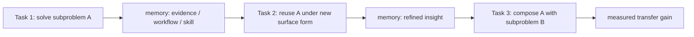

## 来源说明

本文基于 2026-06-06 的每日深度技术研究发布流程写成。今天没有找到足够强的 2026-06-06 同日主源，可以支撑一篇严格意义上的当天新材料文章；因此选择过去几天尚未在本站处理、但足以扩展长期记忆评测支柱的主线：`AgentCL: Toward Rigorous Evaluation of Continual Learning in Language Agents`。

核心来源：

- Yiheng Shu, Bernal Jimenez Gutierrez, Saisri Padmaja Jonnalagedda, Yuguag Yao, Huan Sun, Yu Su: [AgentCL: Toward Rigorous Evaluation of Continual Learning in Language Agents](https://arxiv.org/abs/2606.02461), arXiv:2606.02461, submitted on 2026-06-01
- Zhikai Chen 等: [Exploring Cross-Scenario Generality of Agentic Memory Systems: Diagnostics and a Strong Baseline](https://arxiv.org/abs/2606.04315), arXiv:2606.04315, submitted on 2026-06-03
- Di Wu 等: [LongMemEval-V2: Evaluating Long-Term Agent Memory Toward Experienced Colleagues](https://arxiv.org/abs/2605.12493), arXiv:2605.12493
- Hyunji Amy Lee 等: [LongMINT: Evaluating Memory under Multi-Target Interference in Long-Horizon Agent Systems](https://arxiv.org/abs/2605.18565), arXiv:2605.18565
- Semgrep product updates: [AI Security rules, agent skill rules, MCP server, hooks and skills](https://semgrep.dev/products/product-updates), used only as engineering context for agent-memory and agent-security tooling convergence

本文和本站 2026-05-14 的 LongMemEval-V2、2026-05-20 的 LongMINT、2026-06-03 的 AgentIR 相邻，但问题不同。LongMemEval-V2 关心环境经验能否被取证，LongMINT 关心多目标干扰和事实修订，AgentIR 关心低延迟检索控制面。AgentCL 关心另一个更接近“学习”的问题：一个 Agent 在前序任务中获得的经验，能不能在后续任务中带来可测的迁移收益，而不是只让记忆库变大。

稳定 slug：`2026-06-06-agentcl-continual-learning-memory-evaluation`。

## 先给结论

Agent 长期记忆评测不能只问“能不能想起”。更关键的问题是：记住之后，后续任务是否真的做得更好。

AgentCL 的价值在于把 continual learning 从一个模糊口号收窄成可诊断的任务流设计。它区分两类流：受控的 compositional streams 和普通的 naive streams。前者刻意让早期任务的子解法、证据或工作流在后续任务中可复用；后者不保证这种关系。这个区分很重要，因为如果任务之间本来没有明确可迁移关系，记忆系统表现不好时，我们很难判断问题出在记忆设计、任务编排、检索策略还是任务本身不可复用。

我的工程判断是：生产 Agent memory 的评测应该增加一个“经验迁移层”。现在很多系统只测 retrieval accuracy、answer accuracy、latency、context compression 或 stale-memory rate，这些都必要，但仍然不够。真正有长期价值的记忆应该让 Agent 少走重复弯路、复用可验证的子方案、避免已知失败路径，并且在不相关任务上不过度复用旧经验。

换句话说，好的长期记忆不是“更多历史”，而是“可控复用”。AgentCL 提醒我们，记忆系统需要同时证明 plasticity 和 stability：能从新任务中吸收经验，也不会把旧经验强行套到不该套的任务上。

## 技术问题：召回正确不等于学会复用

长期记忆系统常被拆成三个问题：写入、检索、注入。写入回答什么该存，检索回答怎么找，注入回答怎么放进当前上下文。这套拆分适合做 RAG memory 和长对话记忆，但还没有完整覆盖 continual learning。

Continual learning 多了一个问题：前一次任务里的经验是否能改变下一次任务的行为。

例如 coding agent 修过一次 `pytest` fixture 泄漏。普通记忆评测可能问：系统能否找回那次失败日志。更好的环境经验评测会问：系统能否解释这类失败在当前仓库里如何触发。continual learning 评测还要继续问：下一次遇到相似测试隔离问题时，系统是否更快定位、少试错、复用正确的验证命令，并避免把 fixture 经验错误套到完全不同的数据库事务问题上。

这类问题不能只靠单轮问答测出来。它要求任务之间有明确的可迁移结构，也要求指标能度量“用了记忆之后比不用记忆好多少”。如果没有这个设计，memory system 很容易出现两种假象：

- 记忆看起来很有用，但只是因为任务流里有大量近重复问题。
- 记忆看起来没用，但其实任务之间没有可复用关系，评测没有给系统学习机会。

AgentCL 的核心提醒就是：要评价 Agent 是否会持续学习，必须先控制任务之间的关系。

## 机制拆解：AgentCL 的三个关键设计

### 1. 用受控任务流暴露迁移，而不是只跑自然任务序列

AgentCL 摘要明确指出，已有 lifelong-adaptation benchmark 常依赖 naive task streams，缺少对跨任务关系的分析。问题是，naive stream 看起来真实，但诊断性很弱。一个 Agent 在这种流里变好，可能是记忆有效，也可能是任务碰巧重复；变差，可能是记忆污染，也可能是后续任务本来更难。

受控流的价值是把“可迁移单元”显式埋进去：



这里评测者知道 Task 2 和 Task 3 应该从 Task 1 获益，所以可以测迁移收益；也可以构造不该复用的对照任务，用来测负迁移。这个设计比“把一堆真实任务按时间排序”更适合定位记忆机制。

工程上，我会把受控任务流看成 memory evaluation 的单元测试。它不替代线上 A/B，也不完全代表真实世界，但它能告诉我们某个 memory design 是否具备最基本的经验复用能力。

### 2. 把记忆设计拆成 interactions、insights、skills

AgentCL 提出 MemProbe 作为诊断性方法。摘要描述中，MemProbe 会存储 interactions、insights 和 skills，并在 consolidation 时过滤不可靠经验。

这组三分法很有工程价值：

| 记忆层 | 保存什么 | 典型用途 | 主要风险 |
| --- | --- | --- | --- |
| interaction | 原始任务轨迹、观察、工具结果、失败尝试 | 回放、审计、重新抽取 | 太长、噪声多、检索成本高 |
| insight | 从轨迹中抽出的局部结论、约束、失败原因 | 快速提醒、错误避免、任务定位 | 摘要漂移、来源断裂 |
| skill | 可复用流程、命令序列、策略或检查清单 | 跨任务迁移、自动化执行 | 过度泛化、旧技能失效 |

很多 Agent memory 系统只保留前两层：raw history 和 summary。AgentCL 把 skill 也纳入评测语境，说明它关注的是“经验变成能力”的过程。对 coding、deep research 和 language understanding/reasoning 任务来说，这一点很关键。长期记忆如果永远只是事实存储，就很难解释为什么下一次任务应该更快、更稳或更少犯错。

但 skill 也是最危险的一层。一个未验证的流程如果被提升成 skill，会把一次偶然成功包装成通用策略。AgentCL 摘要提到过滤不可靠经验，这个边界不能省。

### 3. 同时看迁移收益和记忆诱发退化

AgentCL 摘要中的一个重要结果是：受控流能更清楚地区分 memory design 的 plasticity，而 naive 和 held-out 设置往往收益有限，并可能暴露 memory-induced degradation。

我不会把这句话解读成“所有长期记忆都会伤害 Agent”。更准确的边界是：记忆只有在任务关系明确、经验表示合适、检索和注入受控时才会带来稳定收益。否则，旧经验可能增加上下文噪声、引入错误假设、诱导模型走旧路径，或者让 Agent 过早停止探索。

这和 LongMINT 的抗干扰结论相通，但关注点不同。LongMINT 更像状态有效性测试：旧事实和新事实如何互相覆盖。AgentCL 更像可迁移性测试：旧经验是否应该帮助新任务。如果两者都不测，系统很容易在 demo 中显得聪明，在长期使用中变成“带着一堆历史偏见工作的 Agent”。

## 和 AutoMEM 的关系：主动管理记忆比被动召回更像生产系统

2026-06-03 的 AutoMEM 论文提供了一个相邻信号。作者重新评估八种 memory system 和一个 agentic harness，覆盖 single-turn QA、multi-session chat、agentic-trajectory QA、memory stress tests 和 long-horizon agentic tasks。摘要报告里，允许 Agent 通过工具自主管理 flat text-file storage 的 harness 获得较好的跨任务排名，并由此实例化 AutoMEM。

我把它作为 AgentCL 的工程旁证，而不是本文主线。两者共同指向一个趋势：长期记忆正在从“固定 store + 固定 retriever”变成“Agent 可操作的经验空间”。

区别在于，AutoMEM 强调跨场景 generality 和主动存取控制；AgentCL 强调任务流中可复用关系的诊断和迁移收益。前者回答“这个记忆系统能不能换场景”，后者回答“这个记忆系统是否真的学到了可复用经验”。生产系统两者都需要。

## 一个可落地的评测方案

如果我要在一个 coding/research Agent 里验证 AgentCL 风格的 continual memory，我会先做一个小而硬的评测，而不是直接等线上指标。

第一步，定义任务流，不要只随机抽任务。每条 stream 至少包含三类任务：

- source task：产生可复用证据、工作流或技能。
- transfer task：表面不同，但应该复用 source task 的经验。
- distractor task：语义相近，但不应该复用该经验。

第二步，把每次运行分成无记忆和有记忆两组：

```ts
type MemoryMode = "none" | "interaction_only" | "insight_memory" | "skill_memory";

type ContinualTask = {
  id: string;
  streamId: string;
  relation: "source" | "transfer" | "distractor" | "heldout";
  expectedReuse?: string[];
  forbiddenReuse?: string[];
  successOracle: string;
};
```

第三步，每次任务后只允许通过审计过的 memory writer 写入：

```ts
type ExperienceCandidate = {
  kind: "interaction" | "insight" | "skill";
  sourceTaskId: string;
  claim: string;
  evidenceRefs: string[];
  confidence: number;
  reusableFor: string[];
  invalidWhen: string[];
  verificationStatus: "observed_once" | "reused_successfully" | "contradicted";
};
```

第四步，在 transfer task 上测迁移收益，在 distractor task 上测负迁移：

```ts
type ContinualMemoryReport = {
  transferGain: number;
  negativeTransferRate: number;
  repeatedMistakeRate: number;
  evidenceReuseRate: number;
  skillPromotionPrecision: number;
  staleSkillInvocationRate: number;
};
```

第五步，要求 Agent 在执行前声明它准备复用哪些记忆。否则我们只能看到任务成功或失败，看不到成功是因为记忆、模型能力、随机搜索，还是外部工具刚好帮了忙。

## 我会如何实现和验证

我会从一个仓库级 coding agent 入手，因为它的 oracle 更容易做硬验证。

先选 12 条真实或半合成任务流。每条流包含一个 source issue、两个 transfer issue 和一个 distractor issue。source issue 可能是“某个测试框架的隔离失败”“某个 API 的鉴权中间件约定”“某个项目的构建命令陷阱”。transfer issue 改变文件路径、错误文本和表面需求，但保留同一可复用经验。distractor issue 使用相似词汇，但正确策略不同。

然后跑四组配置：无记忆、只保存原始交互、保存 insight、保存 insight + skill。每组固定模型、工具、预算和随机种子范围。每个任务必须通过测试、lint 或人工可复核断言，不用 LLM judge 作为唯一裁判。

我会重点看三件事：

1. transfer issue 的成功率和步数是否改善。
2. distractor issue 是否因为旧 skill 被误用而退化。
3. 进入上下文的每条 insight/skill 是否能回到 source task 的证据。

如果 insight + skill 组只在 transfer 上提升，但 distractor 上明显变差，我不会上线自动 skill 注入，而会改成执行前建议和人工/规则门控。如果 interaction_only 组成本太高但收益小，我会减少原始轨迹注入，转向结构化 insight。如果所有组收益都不稳定，我会先怀疑任务流和 oracle，而不是急着调 embedding。

## 工程判断：记忆系统需要“晋升门”

AgentCL 讨论 continual learning，最容易被误读成“把每次成功都写成长期技能”。这正是生产系统应该避免的。

我会把经验晋升拆成四级：

| 等级 | 说明 | 默认注入策略 |
| --- | --- | --- |
| raw episode | 原始轨迹和工具结果 | 不默认注入，只用于回放 |
| candidate insight | 单次或少量任务中抽出的观察 | 低风险任务可检索，必须带来源 |
| verified pattern | 在多个 transfer task 中复用成功 | 可进入规划上下文 |
| scoped skill | 带适用条件、禁用条件和验证命令的流程 | 只在匹配作用域时执行前建议 |

这样做的原因很简单：一次成功不是技能。只有在不同表面形式下稳定复用、在 distractor 上不误触发、并且有明确失效条件的经验，才应该被晋升为 skill。

这套晋升门也能连接安全工程。Semgrep 近期把 AI Security rules、agent skill rules、MCP server、hooks 和 skills 放进产品更新，说明 agent 技能和安全扫描正在合流。对记忆系统来说，skill memory 本质上也是可执行能力的一部分，应该接受类似 SAST/策略检查：是否含高权限动作、是否绕过审批、是否来源不明、是否跨作用域调用。

## 适用场景

AgentCL 风格评测适合所有“希望 Agent 越用越会做事”的系统。

第一类是 coding agent。它需要把历史修复、构建陷阱、测试约定、review 偏好和项目结构变成可复用经验。但它也最容易被旧代码事实污染，所以必须同时测迁移和负迁移。

第二类是 deep research agent。研究任务有可迁移的检索策略、可信来源筛选、表格抽取、事实核对和写作模板。问题是，某个主题里的来源策略不一定适用于另一个主题，旧经验需要作用域。

第三类是企业流程 agent。审批、工单、CRM、财务和合规流程都有组织特定经验。Agent 记住一次流程并不够，它要知道这个流程适用于哪个角色、系统版本、租户和审批链。

第四类是个人助理。偏好、写作习惯、日程安排和沟通风格有长期可复用价值，但同样存在上下文边界。工作偏好不能自动迁移到私人场景，短期安排不能晋升为长期规则。

不太适合的场景也明确。如果应用只是一次性问答、静态文档检索或短会话客服，AgentCL 式任务流可能过重。此时先做好来源、权限、召回和延迟就够了。

## 失败模式

第一，伪迁移。任务之间只是表面重复，记忆系统看起来有收益，但没有真正抽象出可复用经验。

第二，负迁移。旧 insight 或 skill 被带到不相关任务，导致 Agent 过早套用错误方案。

第三，技能过度晋升。一次成功轨迹被提升成长期 skill，后续反复误导执行。

第四，来源断裂。系统注入“应该这样做”的结论，但找不到原始任务、测试结果、用户确认或工具证据。

第五，只测成功率，不测成本。记忆让成功率小幅上升，但显著增加 token、检索延迟、工具调用和调试复杂度。

第六，任务流设计太弱。naive stream 没有明确可迁移关系，导致不同 memory design 差异被噪声淹没。

第七，held-out 退化被忽略。系统在相似任务上变好，却在未见任务上因为旧经验偏置而变差。

第八，把 continual learning 和 personalization 混在一起。用户偏好记忆不等于任务技能学习；两者的写入、检索、删除和评测指标应该分开。

## 可验证指标

Transfer gain：有记忆相对无记忆，在受控 transfer task 上的成功率、步数、成本和修复时间改善。

Negative transfer rate：在 distractor 或 held-out task 上，因为旧经验注入导致失败或成本增加的比例。

Experience attribution rate：成功任务中，Agent 明确引用并正确使用历史 insight/skill 的比例。

Skill promotion precision：被晋升为 skill 的经验中，后续复用成功且未触发禁用条件的比例。

Repeated mistake reduction：同类错误在后续任务中重复发生的次数是否下降。

Stale skill invocation rate：已过期、被推翻或不匹配作用域的 skill 被调用的比例。

Scope leakage rate：用户级、项目级、任务级、运行时经验被跨作用域使用的比例。

Evidence coverage：每条 insight/skill 是否能追溯到原始任务、工具输出、测试结果或人工确认。

Plasticity-stability curve：提高新经验写入速度时，transfer gain 和 negative transfer 如何变化。

Cost per transferred success：每个由记忆带来的额外成功，需要多少存储、检索、token、工具调用和审计成本。

Human override rate：人类或策略层阻止 memory/skill 注入的次数，以及阻止后是否避免错误。

Regression under naive streams：在没有明确可迁移结构的自然任务流中，记忆是否至少不显著伤害基线。

## 局限分析

第一，AgentCL 是预印本。本文使用 arXiv 摘要和公开页面信息做机制分析，作者报告的实验结论不能等同于独立复现。

第二，本文没有直接下载并复现实验代码和数据。当前工作环境对 arXiv、Hugging Face、GitHub 的 shell DNS 解析失败，无法用本地脚本拉取 PDF、数据集或仓库。文章中涉及 AgentCL 的具体结论均限定为论文摘要和公开索引展示的信息。

第三，受控任务流不等于真实生产流。它适合做诊断，但上线仍需要真实任务分布、权限边界、用户反馈和失败复盘。

第四，transfer gain 指标容易被任务构造影响。如果 source 和 transfer 太像，会高估记忆；如果关系太隐蔽，会低估系统。任务流设计需要审计。

第五，skill memory 的安全边界比 fact memory 更重。事实写错会误导回答，技能写错可能触发错误工具调用、错误修改或越权流程。本文只讨论授权环境里的防御性工程，不讨论对第三方系统的攻击流程。

## 自审

事实可靠性：主线基于 AgentCL 的 arXiv 页面和公开摘要；AutoMEM、LongMemEval-V2、LongMINT 和 Semgrep product updates 作为边界和工程背景。所有论文结果均以“作者报告”“摘要指出”表述，没有写成独立复现事实。

来源完整性：文章列出原始论文和官方产品更新入口。没有使用新闻聚合站或社区帖子作为核心事实来源。

原创性：本文主线是 continual learning evaluation 和 transfer/negative-transfer 评测，与本站 LongMemEval-V2 的环境经验、LongMINT 的抗干扰、AgentIR 的检索控制面不同。

标题检查：标题没有宣称 AgentCL 解决长期记忆，只说它提醒评测要看经验迁移，符合来源边界。

薄内容检查：正文包含来源说明、结论、技术问题、机制拆解、工程判断、适用场景、失败模式、可验证指标、局限分析和自审；同时包含机制图、表格、TypeScript 数据模型和具体验证方案。

猜测边界：任务流实现、晋升门、指标体系是我的工程建议，文中已和来源事实区分。

站内重复：仓库已有文章覆盖环境经验、抗干扰、数据库原生记忆、记忆注入、AgentIR 检索控制面、MemGuard 类型边界；尚未有文章单独讨论 AgentCL 或 continual learning transfer evaluation。
