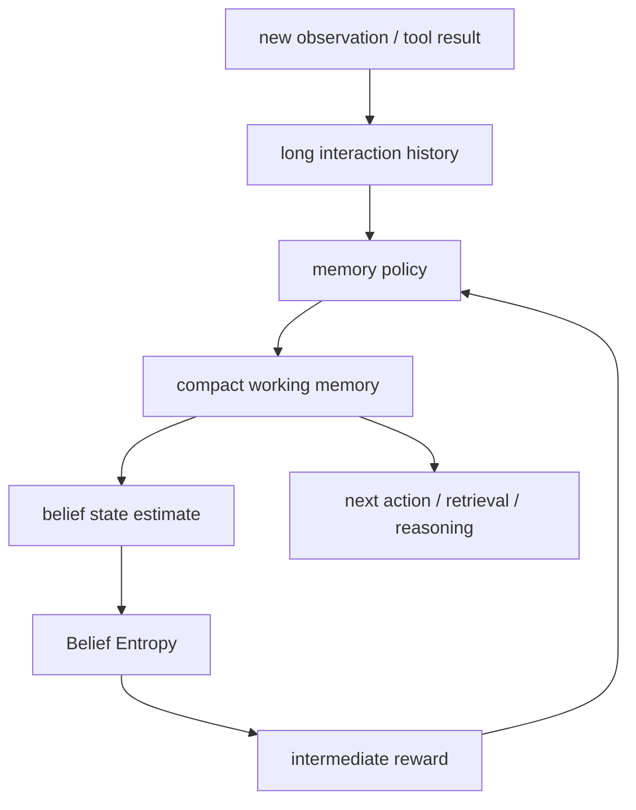

## 来源说明

本文基于 2026-06-07 的每日深度技术研究发布流程写成。今天没有找到足够强的 2026-06-07 同日主源，可以支撑一篇严格意义上的当天新材料文章；因此选择过去几天尚未在本站处理、但足以扩展长期 Agent 记忆评测和训练方法的近期论文：`Meta-Cognitive Memory Policy Optimization for Long-Horizon LLM Agents`。

核心来源：

- Zeyu Zhang, Xingyuan Bu, Sihan Zeng, Tianyu Liu, Yulan He, Yuchen Eleanor Jiang, Xintong Li, Xing Xie, Shuaiqiang Wang, Yanghua Xiao: [Meta-Cognitive Memory Policy Optimization for Long-Horizon LLM Agents](https://arxiv.org/abs/2605.30159), arXiv:2605.30159, submitted on 2026-05-28
- Hongli Yu 等: [MemAgent: Reshaping Long-Context LLM with Multi-Conv RL-based Memory Agent](https://arxiv.org/abs/2507.02259), arXiv:2507.02259, used as a recurrent memory-agent baseline context
- Sikuan Yan 等: [Memory-R2: Fair Credit Assignment for Long-Horizon Memory-Augmented LLM Agents](https://arxiv.org/abs/2605.21768), arXiv:2605.21768, used as credit-assignment context
- Yiheng Shu 等: [AgentCL: Toward Rigorous Evaluation of Continual Learning in Language Agents](https://arxiv.org/abs/2606.02461), arXiv:2606.02461, used as transfer-oriented evaluation context

本文和本站 2026-06-01 的级联压缩/参数化记忆、2026-06-03 的 AgentIR、2026-06-06 的 AgentCL 相邻，但问题不同。那几篇分别讨论记忆载体、检索控制面和经验迁移评测；本文聚焦的是：当 Agent 必须在长程任务中不断压缩中间观察时，训练信号不能只来自终局成功率，还要监督每一步记忆是否让任务信念更可决策。

稳定 slug：`2026-06-07-belief-entropy-memory-policy-optimization`。

## 先给结论

长程 Agent 的记忆摘要不应该只问“压得短不短”或“最后答对没有”。更关键的问题是：每次写入或重写 memory 后，Agent 是否更清楚当前任务已经知道什么、还缺什么、下一步该看哪里。

MMPO 的核心价值，是把这个问题做成中间监督。论文提出 Belief Entropy 作为过程级指标：如果一段记忆让 Agent 对下一步状态、所需信息和候选动作更不确定，它即使语言流畅，也不应该得到高奖励；如果一段记忆保留了决策所需证据、减少无关噪声，并让后续推理更集中，它才是有用记忆。

这对工程系统很重要。很多 memory-augmented agent 失败不是因为向量库召回不到材料，而是因为长期任务中的中间摘要越来越像“任务故事”，不像“决策状态”。摘要保留了背景、目标和部分事实，却丢了排除过的路径、未验证假设、证据缺口、时间顺序和下一步依赖。最终 Agent 看似有上下文，实际没有可执行状态。

我的判断是：生产 Agent memory 需要引入 memory quality gate。写入 memory 后，不只做长度、相似度和来源检查，还要测它是否降低任务不确定性、是否保留关键证据、是否不会诱导错误行动。MMPO 是一个研究原型，不是现成生产方案；但它提供了一个更好的方向：把记忆策略当成可训练、可评测、可回滚的控制策略，而不是后台摘要脚本。

## 技术问题：终局奖励太稀疏，摘要奖励太表面

长程任务里的 Agent memory 往往承担三件事：压缩上下文、保存中间状态、为后续动作提供线索。传统做法通常是手写提示词，让模型定期总结历史，或者用规则截断、向量检索和最近窗口拼接上下文。

这类方法最大的问题不是不能工作，而是缺少中间质量信号。

如果只看最终任务成功率，奖励太稀疏。一个 Agent 失败时，我们很难知道原因是记忆摘要丢了关键证据、检索排序错了、规划器没用上记忆、工具失败，还是模型本身不会解题。

如果只看摘要质量，奖励又太表面。人工或 LLM judge 可能喜欢简洁、连贯、覆盖主要事件的摘要，但长程 Agent 真正需要的是操作性状态。一个“好读”的摘要可能把重要约束改写成背景，把未验证假设写成事实，或者把失败路径删掉。

MMPO 试图补这个洞：记忆策略每次压缩历史后，都要面对一个问题：这段 memory 是否让 Agent 的内部信念更接近可行动状态。

## 机制拆解：Belief Entropy 监督的记忆策略

MMPO 的方法可以拆成四层。

第一层是递归记忆生成。Agent 在长程任务中不断接收新观察，并用 memory policy 生成或更新一段紧凑记忆。这和普通 summary 不同：它不是为了写给人读，而是为了让后续推理使用。

第二层是信念建模。论文把 Agent 对任务进展的认知显式化：已经确定的事实、仍不确定的变量、下一步需要的信息、候选动作之间的分布。Belief Entropy 试图度量这种信念的不确定性。

第三层是过程奖励。记忆更新后，如果 Agent 对关键状态的分布更集中、对下一步信息需求更明确，就给正向信号；如果摘要让不确定性上升或误导后续决策，就给负向信号。这样训练不必等到整条任务结束才知道 memory 是否有用。

第四层是策略优化。论文使用 GRPO 风格的优化，把 Belief Entropy 作为中间奖励信号，训练 memory policy 在多个长程任务中产生更有决策价值的记忆。



这张图里的关键不是具体优化算法，而是反馈位置。记忆摘要不再只是历史的压缩产物，而是会影响下一步行动的控制变量。只要它会控制行动，就应该被过程级指标约束。

## 和已有记忆方向的差异

MMPO 与本站近期几条主线的关系，可以这样划分：

| 方向 | 关心的问题 | MMPO 补上的部分 |
| --- | --- | --- |
| 级联压缩 vs LoRA consolidation | 记忆应该留在上下文、外部 store，还是进入参数化状态 | 即使仍用文本 memory，也要监督每次压缩后的决策质量 |
| AgentIR | 长期记忆检索应如何按查询负载选择路径 | 检索到材料后，工作记忆怎么更新才不增加不确定性 |
| AgentCL | 历史经验能否迁移到后续任务 | 经验在任务过程中被摘要成什么状态，是否支持后续迁移 |
| Memory-R2 | 长期记忆操作的 RL 信用分配是否公平 | 中间 memory state 本身应有质量奖励，不能只看终局 |
| MemAgent | 用 RL 训练 recurrent memory agent 处理长上下文 | 记忆压缩质量需要更细的元认知信号 |

这也说明 MMPO 不适合被简化成“一个新的摘要算法”。它更像一种 memory policy training 思路：用任务信念作为监督对象，让 Agent 学会保留和丢弃信息。

## 工程判断：把 memory 当作状态估计器，而不是笔记本

我会把长程 Agent memory 分成两类：证据记忆和工作记忆。

证据记忆保存原始来源、工具输出、文件引用、用户确认、时间戳和权限作用域。它追求可审计、可回放、可删除。

工作记忆保存当前任务的压缩状态：目标、已确认事实、开放问题、失败路径、下一步依赖、风险和假设。它追求可行动、低噪声、低延迟。

MMPO 的 Belief Entropy 更适合监督工作记忆，而不是替代证据记忆。原因很简单：工作记忆可以被压缩和重写，但证据不能被摘要替代。生产系统应该允许工作记忆根据任务进展变化，却必须保留证据链，方便回滚和审计。

一个可落地的数据模型可以这样写：

```ts
type WorkingMemory = {
  taskId: string;
  goal: string;
  confirmedFacts: Array<{ claim: string; evidenceRefs: string[] }>;
  openQuestions: Array<{ question: string; blocksAction: boolean }>;
  rejectedHypotheses: Array<{ hypothesis: string; reason: string; evidenceRefs: string[] }>;
  nextInformationNeeds: string[];
  actionConstraints: string[];
  confidence: number;
  updatedFrom: string[];
};

type MemoryQualityReport = {
  entropyBefore: number;
  entropyAfter: number;
  missingEvidenceRefs: string[];
  unsupportedClaims: string[];
  staleConstraints: string[];
  decisionUtilityScore: number;
};
```

这里的 `entropyBefore` 和 `entropyAfter` 不一定要一开始就实现成论文同款算法。工程早期可以用更粗的代理指标：开放问题数量、候选动作分歧、下一步检索目标是否明确、关键证据引用是否完整、模型对下一步计划的一致性等。

## 一个工程落地方案

我会先从离线评测开始，不直接让线上 Agent 自训练 memory policy。

第一步，收集长程任务轨迹。每条轨迹必须包含原始用户请求、工具调用、观察结果、中间推理摘要、最终答案或任务结果。coding agent 可以用 issue 修复、测试定位、重构任务；research agent 可以用多源事实核查、论文综述和资料表构建。

第二步，构造 memory update 点。每隔 N 个观察或每次上下文接近阈值时，让候选 memory policy 生成工作记忆。

第三步，为每个 update 点生成质量检查：

```ts
function evaluateWorkingMemory(
  previous: WorkingMemory,
  candidate: WorkingMemory,
  futureOracle: TaskOracle
): MemoryQualityReport {
  return {
    entropyBefore: estimateTaskUncertainty(previous),
    entropyAfter: estimateTaskUncertainty(candidate),
    missingEvidenceRefs: checkRequiredEvidence(candidate, futureOracle),
    unsupportedClaims: findClaimsWithoutEvidence(candidate),
    staleConstraints: findContradictedConstraints(candidate, futureOracle),
    decisionUtilityScore: scoreNextActionHelpfulness(candidate, futureOracle),
  };
}
```

第四步，只允许通过质量门的工作记忆进入线上模板：

```ts
function shouldInjectMemory(report: MemoryQualityReport) {
  return (
    report.entropyAfter < report.entropyBefore &&
    report.unsupportedClaims.length === 0 &&
    report.staleConstraints.length === 0 &&
    report.decisionUtilityScore >= 0.7
  );
}
```

第五步，逐步替换手写摘要。先比较人工提示词摘要、LLM judge 优化摘要、MMPO 风格策略摘要三组结果，看它们在同一批任务上的成功率、步数、错误复现率和证据缺失率。

## 我会如何实现和验证

如果我在一个 coding/research Agent 里验证这条路线，会先做一个小型“中间记忆回归集”。

我会选 30 条历史长任务，每条任务切成 4 到 8 个 checkpoint。每个 checkpoint 都保存当时完整历史、候选工作记忆和后续真实轨迹。然后让不同 memory policy 在 checkpoint 上生成压缩状态，并强制 Agent 只看该状态和必要证据索引继续任务。

验证指标不只看最终成功率，而是看三类差异。

第一，下一步定位能力。Agent 是否能更快指出还缺什么信息、该打开哪个文件、该跑哪个命令、该查哪篇来源。

第二，错误路径抑制。之前已经证伪的假设是否还会被重复尝试。

第三，证据完整性。工作记忆中的关键 claim 是否都能追溯到原始工具输出或来源文档。

如果某个策略让摘要更短但 `rejectedHypotheses` 丢失，我不会上线；如果它降低了 entropy 但产生 unsupported claim，也不会上线。长程 Agent 最危险的不是“不知道”，而是带着一个看似确定的错误工作状态继续行动。

## 适用场景

第一类是深度研究 Agent。研究任务经常跨多源材料、多个候选解释和多轮事实核对。工作记忆必须保留“哪些来源已验证、哪些结论只是作者报告、哪些问题还没查”，否则很容易把摘要写成顺滑结论。

第二类是 coding Agent。长程修复中，最有价值的中间状态不是“我们在修登录问题”，而是“数据库事务假设已被测试排除；当前阻塞是 mock server 初始化顺序；下一步应检查 fixture 生命周期”。这正是 Belief Entropy 类指标想捕捉的差异。

第三类是数据分析 Agent。它需要记住已做过的数据清洗、异常值判断、指标口径和未解决的数据质量问题。摘要一旦丢掉口径约束，后续图表和结论都会漂移。

第四类是安全审计 Agent。授权白盒扫描过程中，工作记忆要保留已确认攻击面、已排除路径、证据文件、漏洞验证状态和仍需人工确认的边界。这里尤其不能把未经验证的假设写成事实。

不太适合的场景也明确。短问答、静态 FAQ、简单 RAG 搜索和单轮客服不需要复杂的 Belief Entropy 训练。先把来源、权限、召回和延迟做好更重要。

## 失败模式

第一，熵指标被代理目标骗过。模型可能生成看似确定的 memory，让不确定性估计下降，但实际是把未知问题写成了假事实。

第二，证据引用断裂。工作记忆保留了结论，却丢掉来源，后续无法审计，也无法判断结论是否过期。

第三，开放问题被误删。摘要为了简洁，把“还没验证”的问题删掉，Agent 后续误以为任务状态完整。

第四，失败路径消失。已证伪假设没有进入 memory，Agent 在后续 checkpoint 重复浪费步骤。

第五，任务信念过窄。记忆策略过度追求低 entropy，导致 Agent 提前收敛到一个错误方向，减少必要探索。

第六，跨任务污染。一个任务中的工作记忆被保存成长期规则，在另一个作用域中错误生效。

第七，评测 oracle 太弱。未来轨迹本身不可靠或只有 LLM judge，导致 memory policy 学会迎合裁判语言，而不是支持真实行动。

第八，训练数据投毒。错误工具输出、恶意指令或未经授权内容进入 memory policy 训练集，之后影响所有任务摘要。

第九，过程奖励和终局目标冲突。某段 memory 短期降低不确定性，但长期导致错过替代路径。

第十，成本失控。每个 checkpoint 都做复杂信念估计和质量评审，可能抵消 memory compression 带来的 token 节省。

## 可验证指标

Entropy delta：每次 memory update 后，任务不确定性估计是否下降；下降是否与真实后续成功相关。

Unsupported claim rate：工作记忆中没有证据引用的事实性 claim 占比。

Open-question preservation：后续任务真正需要的问题，在 memory 中是否仍被标记为未解决。

Rejected-hypothesis recall：已证伪路径是否被保留，并在后续行动中避免重复尝试。

Next-action agreement：不同随机种子或模型副本在读取同一工作记忆后，下一步计划是否更一致。

Evidence retrieval precision：工作记忆指向的 evidence refs 是否真能支持当前行动。

Compression utility：每减少 1,000 个上下文 token，任务成功率、步数和错误复现率如何变化。

Decision latency：质量门和信念估计增加了多少延迟，是否仍适合交互式 Agent。

Long-horizon degradation：经过多轮 update 后，工作记忆是否持续变窄、变假或变成模板化摘要。

Negative certainty rate：模型高置信执行但事实错误的比例。这个指标比普通 hallucination rate 更贴近长程 Agent 风险。

Rollback recovery：发现某次 memory update 错误后，回滚到上一 checkpoint 是否恢复后续任务表现。

Human correction recurrence：用户是否还需要反复提醒同一个已知约束。

## 局限分析

第一，MMPO 是预印本。它提出了有价值的训练和评测思路，但本文不能把作者报告结果当作独立复现事实。

第二，Belief Entropy 的定义和估计方式会强烈影响结论。工程系统如果用简化代理指标，必须验证这些指标是否真的预测后续任务成功。

第三，中间奖励可能引入新的过拟合。memory policy 可能学会生成裁判喜欢的结构，而不是真正改善行动。

第四，工作记忆不能替代证据记忆。任何压缩状态都可能漏掉条件、时间、来源和反例；原始证据必须保留。

第五，长程任务的 oracle 很难构造。coding task 可以用测试和 diff，research task 需要来源核验和人工抽查，安全审计 task 还要避免把未经授权操作流程写进评测。

第六，本文的工程方案偏向离线验证。线上持续学习还需要权限边界、数据隔离、隐私删除、训练集审计和版本回滚。

## 自审

事实可靠性：核心事实来自 arXiv:2605.30159 的论文页面和论文内容：MMPO 面向长程 LLM Agent，提出 Meta-Cognitive Memory Policy Optimization、Belief Entropy、中间奖励和 GRPO 风格优化。MemAgent、Memory-R2 和 AgentCL 只作为相邻研究脉络，不作为 MMPO 效果的独立验证。

来源完整性：本文使用原始 arXiv 来源作为核心来源；社区页面只用于发现候选线索，没有作为核心事实来源。

原创性：本文主线是“用任务信念监督工作记忆更新”，不同于本站 2026-06-01 的记忆载体取舍、2026-06-03 的检索控制面和 2026-06-06 的经验迁移评测。

标题党检查：标题没有声称 MMPO 解决长期记忆，只说它提示记忆摘要需要中间监督。

薄内容检查：正文包含来源说明、先给结论、技术问题、机制拆解、工程判断、适用场景、失败模式、可验证指标、局限分析和自审，并包含机制图、表格、接口设计与实现/验证方案。

猜测边界：工作记忆数据模型、质量门、指标和落地方案属于本文工程建议，已与论文事实区分。

安全边界：涉及安全审计 Agent 的部分只讨论授权白盒扫描和防御工程中的状态管理，不提供攻击第三方目标的操作流程。
