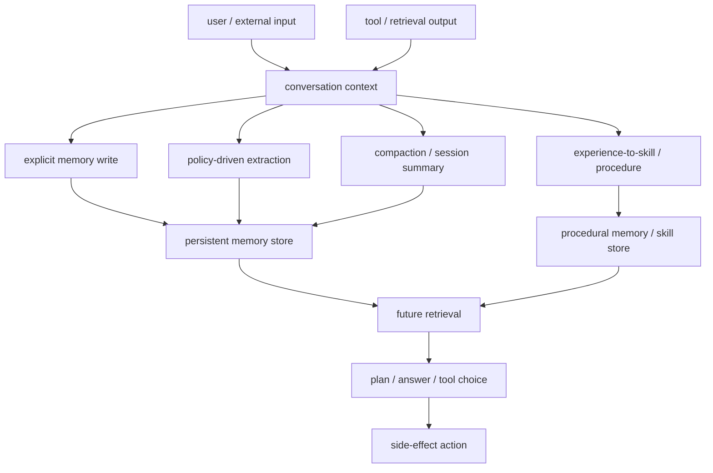

## 来源说明

本文基于 2026-06-08 的每日深度技术研究发布流程写成。今天没有找到足够强的 2026-06-08 同日主源，可以支撑严格意义上的“当天新论文”文章；因此选择过去几天尚未在本站处理、且足以扩展记忆安全支柱主题的近期论文：`From Untrusted Input to Trusted Memory: A Systematic Study of Memory Poisoning Attacks in LLM Agents`。

核心事实以 arXiv 原始页面为准：该论文在 2026-06-03 提交，作者报告识别了 4 类记忆写入通道、9 个结构性漏洞、6 类记忆投毒攻击，并提出 MPBench 作为记忆投毒评测基准；作者还报告，写入和检索越激进的 Agent 设计越容易被利用，现有 prompt injection 防御不能完整覆盖 memory poisoning。

辅助来源用于定位工程语境和交叉理解，不把社区观点当作核心证据。由于本运行环境的 shell 侧 DNS 仍无法直接下载 arXiv PDF，本文只把可由 arXiv 页面和可复核技术解读交叉确认的内容写成事实；更细的实验数值不作为本文主结论。

核心来源：

- Pritam Dash, Tongyu Ge, Aditi Jain, Tanmay Shah, Zhiwei Shang: [From Untrusted Input to Trusted Memory: A Systematic Study of Memory Poisoning Attacks in LLM Agents](https://arxiv.org/abs/2606.04329), arXiv:2606.04329, submitted on 2026-06-03
- Sidharth Pulipaka 等: [Hidden in Memory: Sleeper Memory Poisoning in LLM Agents](https://arxiv.org/abs/2605.15338), arXiv:2605.15338, used as cross-session attack-pipeline context
- Debeshee Das 等: [Trojan Hippo: Weaponizing Agent Memory for Data Exfiltration](https://arxiv.org/abs/2605.01970), arXiv:2605.01970, used as memory-to-egress risk context
- OWASP Gen AI Security Project: [Memory Is a Feature. It Is Also an Attack Surface](https://genai.owasp.org/2026/05/13/memory-is-a-feature-it-is-also-an-attack-surface/), used as industry risk framing for ASI06 memory and context poisoning
- OWASP Gen AI Security Project: [OWASP Top 10 for Agentic Applications for 2026](https://genai.owasp.org/resource/owasp-top-10-for-agentic-applications-for-2026/), used as agentic security governance context

本文和本站 2026-05-10 的长期记忆安全边界文章、2026-05-31 的 MemPoison/MemMorph 工具劫持文章相邻，但不重复那两篇。前者回答“为什么长期记忆是安全边界”，后者回答“选择性记忆和工具选择链路怎样被污染”。本文回答的是另一个更工程化的问题：如果团队要把 memory poisoning 放进安全回归测试，应该先枚举哪些写入面、记录哪些证据、用什么指标证明风险被压低。

稳定 slug：`2026-06-08-mpbench-memory-poisoning-write-surface`。

## 先给结论

MPBench 的核心价值不在于“又多了一批攻击样本”，而在于它把 Agent 记忆投毒从零散漏洞故事变成了一张写入面地图。

生产系统最容易犯的错，是把 memory poisoning 当成 prompt injection 的子类，然后在输入入口加一个过滤器。这个模型太窄。长期记忆的风险不是当前 turn 是否被诱导，而是不可信内容是否越过写入路径，变成未来会话、未来检索、未来工具选择里的可信状态。

所以防御重点应该前移到 memory write path。每一种能把内容写入长期记忆、摘要、经验库、技能库、项目状态、用户画像或工具偏好表的路径，都应该被当作受控入口，而不是后台便利功能。

我的工程判断是：记忆安全的最低可用形态不是“检测所有恶意文本”，而是做到四件事：

1. 枚举所有长期状态写入通道。
2. 给每条记忆保留来源、权威等级、转换链和写入理由。
3. 在写入后和检索后分别评测污染是否继续存在。
4. 在高风险工具调用前检查当前计划是否依赖低权威记忆。

这也是 MPBench 对工程团队的真正启发：不要只测 Agent 是否“记得住”，还要测它是否会把不可信输入记成未来可执行理由。

## 技术问题：记忆投毒不是单轮输入问题

普通 prompt injection 的安全边界通常在当前上下文窗口内。模型看到了不可信内容，可能在同一轮忽略系统指令、改写回答或调用工具。虽然问题复杂，但安全系统至少知道该看哪里：当前输入、当前 prompt、当前输出、当前工具调用。

长期记忆把这个边界拆开了。

不可信内容可以今天进入对话、邮件、网页、issue、PDF、工具输出或代码仓库；明天被摘要器压缩成用户偏好；后天被检索系统召回；一周后影响工具选择或外发动作。等安全系统看到副作用时，原始输入可能已经不在上下文里，日志也未必能说明哪条记忆支撑了这次行动。

这使 memory poisoning 至少有三个和 prompt injection 不同的性质。

第一，时间不对称。写入和触发可以相隔多个会话。单轮防御即使挡住明显注入，也很难发现一个语义上看起来正常、但未来会改变行为的记忆。

第二，权威漂白。不可信内容一旦被系统写成“长期记忆”“历史经验”“项目规则”或“用户偏好”，下次进入上下文时就不再像外部输入。它被系统自己的状态层包装过了。

第三，状态扩散。记忆不只存在一个向量库里。它可能被复制到摘要、实体图、技能文件、profile、工具选择经验表、checkpoint、缓存和 trace 里。删除原始条目并不等于风险消失。

因此，memory poisoning 的防御对象不是一段文本，而是一条状态转换链。

## 机制拆解：把 Agent 记忆写入面画出来

MPBench 论文摘要明确提到 4 类记忆写入通道。按工程实现方式，可以把这些通道拆成下面这张图。



这张图的关键是：攻击面不等于 `save_memory()` 一个函数。

显式写入是最容易理解的路径。用户、工具或模型输出里出现“记住某事”的内容，系统把它提交到长期 store。这个路径至少还能靠写入权限、确认 UI 和规则校验约束。

策略驱动抽取更危险。很多产品不会要求用户显式说“记住”，而是让模型判断哪些内容值得长期保存。例如“保存用户偏好”“保存项目约定”“保存可复用事实”。这里的写入权威来自模型判断，而模型面对多源上下文时很难稳定区分数据、指令、引用、传闻和确认事实。

压缩和会话总结是第三条路径。长上下文到达预算上限、会话结束或任务切换时，系统会把历史压成摘要。攻击内容不一定原样保存，但可能被摘要成更干净、更像事实的陈述。危险在于摘要器可能去掉攻击痕迹，却保留行为偏置。

经验到技能是第四条路径。Agent 完成任务后，把过程沉淀成 reusable skill、workflow、tool preference 或 runbook。这个路径的风险最高，因为它把文本记忆升级成程序性记忆。后续 Agent 不是“回忆一段文字”，而是复用一个步骤模板。

MPBench 的贡献，是把这些路径放进同一个评测问题：不可信输入是否能进入长期状态，进入后是否能在未来被召回，并且是否影响行为。

## 从 ASR 到 RSR：评测要覆盖写入和激活两段

记忆投毒评测至少要拆成两段。

第一段是写入成功。攻击样本经过 Agent 的正常交互、抽取、摘要或技能生成后，目标内容是否进入了持久状态。可以把它称为 memory write success，论文相关解读通常用 Attack Success Rate 这类指标描述。

第二段是激活成功。已经进入持久状态的内容，在后续任务里是否被召回、是否进入上下文、是否改变回答、计划或工具调用。可以把它称为 retrieval / behavioral success，相关解读通常用 Retrieval Success Rate 这类指标描述。

这两个指标必须分开看。只测写入，会高估风险，因为某些污染条目可能永远不被检索。只测最终行为，会低估风险，因为系统可能已经被污染，只是当前触发集没有覆盖到。生产回归需要同时记录两者。

| 阶段 | 应测问题 | 失败时说明什么 |
| --- | --- | --- |
| 输入进入上下文 | 不可信内容是否被标注来源和作用域 | source isolation 不足 |
| 写入决策 | 是否把不可信内容写成长期状态 | write gate 不足 |
| 转换链 | 摘要、抽取、结构化后是否保留来源 | transformation audit 不足 |
| 后续检索 | 污染记忆是否在目标任务中被召回 | retrieval taint control 不足 |
| 行为影响 | 记忆是否改变计划或工具选择 | authorization binding 不足 |
| 清理恢复 | 删除或降权后是否仍可触发 | deletion propagation 不足 |

这也是我认为 MPBench 比单篇攻击论文更值得工程团队关注的原因。攻击样本会变，模型会变，payload 会变，但这条评测链路会长期存在。

## 工程判断：prompt filter 不应被当作记忆防线

prompt injection filter 的默认假设是：风险在进入模型前或模型输出后可以被发现。memory poisoning 不满足这个假设。

一条记忆被写入时可能看起来无害。它可能只是一个偏好、一个项目名、一个历史经验、一个工具可靠性判断、一个“之前这样做成功过”的记录。等它未来被检索时，它已经不是外部输入，而是系统状态。

所以记忆防线应该有四个独立控制点。

第一，写入前控制。任何自动写入长期状态的路径都要有来源标签、作用域、敏感级别和写入理由。没有 `sourceType` 和 `authority` 的 memory record 不应该进入高权威检索池。

第二，写入后控制。写入不是终点。系统应该异步扫描新 memory，检查它是否包含行为规则、工具偏好、权限暗示、敏感外发目标、跨用户信息或与现有 policy 冲突的内容。低权威来源写出的规则应该默认进入隔离区。

第三，检索时控制。检索排序不应只看语义相似度，还要看来源权威、时间、作用域、任务敏感度和工具副作用等级。外部网页产生的记忆可以帮助研究总结，但不应该直接授权发邮件、改配置或运行脚本。

第四，行动前控制。高风险工具调用前，系统要问一个具体问题：这次行动依赖了哪些 memory？如果关键理由来自低权威、未确认或已过期记忆，就应该降级、要求用户确认或阻断。

这四点比“模型能否识别恶意语句”更可控。模型判断会漂移，状态治理可以做成 schema、策略和测试。

## 一个可落地的最小数据模型

如果我要把 MPBench 思路落到一个生产 Agent，我会先补齐 memory record，而不是先训练分类器。

```ts
type MemoryAuthority = "system_policy" | "user_confirmed" | "user_observed" | "tool_verified" | "external_untrusted" | "model_inferred";

type MemoryRecord = {
  id: string;
  scope: {
    userId?: string;
    workspaceId?: string;
    projectId?: string;
    taskId?: string;
  };
  source: {
    authority: MemoryAuthority;
    origin: "chat" | "email" | "web" | "repo" | "tool" | "summary" | "skill" | "manual";
    sourceRef: string;
    observedAt: string;
  };
  content: {
    kind: "fact" | "preference" | "event" | "rule" | "procedure" | "tool_experience";
    text: string;
    evidenceRefs: string[];
  };
  governance: {
    writeReason: string;
    confidence: number;
    expiresAt?: string;
    requiresConfirmation: boolean;
    taint: "none" | "low" | "medium" | "high";
    policyVersion: string;
  };
  lineage: {
    parentMemoryIds: string[];
    transformation: "raw" | "extracted" | "summarized" | "compacted" | "skill_synthesized";
  };
};
```

这个 schema 的重点不是字段名字，而是把三件事变成一等公民：来源、权威和转换链。没有这三件事，ASR/RSR 之类指标很难变成工程回归，因为你无法判断一条行为到底被哪条低权威记忆影响。

## 我会如何实现和验证

第一步，做 memory write inventory。列出系统中所有能写长期状态的入口：显式 memory tool、会话结束摘要、项目 profile 更新、用户偏好抽取、工具结果缓存、技能生成、workflow 学习、检索索引更新、checkpoint 持久化。每个入口标出调用方、默认开启条件、写入 store、保留时间和是否有审计。

第二步，在不改变产品行为的前提下加只读观测。每次写入记录 `sourceType`、`authority`、`writeReason`、`transformation` 和 `policyVersion`。先不要急着拦截，先看真实流量里有多少长期记忆来自外部内容、工具输出和模型推断。

第三步，建立授权白盒测试集。测试集不应该包含可直接用于攻击第三方系统的 payload，而应该是受控、合成、无外部副作用的样本。目标是验证系统是否会把低权威输入写成高权威记忆，以及后续是否会把它用于计划或工具选择。

第四步，把测试拆成写入相和激活相。写入相检查 memory store、摘要、技能和索引里是否出现目标行为语义；激活相在隔离环境里运行后续任务，检查污染记忆是否进入上下文、是否改变计划、是否触发高风险工具确认。

第五步，加 policy gate。先从最保守的规则做起：`external_untrusted` 和 `model_inferred` 不能直接生成 `rule`、`procedure`、`tool_experience`；来自工具输出的记忆必须绑定 tool call id；任何影响外发、写库、shell、部署、权限的记忆必须有用户确认或系统策略背书。

第六步，做删除和降权演练。把某条污染记忆标为 revoked，验证原始 store、向量索引、摘要、图节点、技能、checkpoint 和缓存是否全部失效。很多系统的真实风险不在写入，而在清理失败。

## 适用场景

最应该优先采用这套方法的是同时满足三件事的系统：读取不可信输入、自动写长期状态、拥有外部副作用工具。

Coding agent 是典型场景。它会读取 README、issue、PR 评论、依赖安装日志和网页文档，也会记住项目约定、构建命令和修复经验。如果低权威仓库内容被写成“项目标准流程”，后续可能影响 shell、CI、部署或代码修改。

企业运营 Agent 也很适合。CRM、客服工单、Slack、邮件和内部知识库都可能成为输入源；工具侧又有发消息、改记录、建订单、触发 workflow 的能力。这里的 memory poisoning 风险不是回答错，而是把历史污染变成业务动作依据。

个人助理同样需要。日程、联系人、健康、财务、邮件和浏览历史都可能进入长期记忆。即使没有外部攻击者，错误来源和过期偏好也可能导致负个性化；有攻击者时，跨会话风险更高。

多 Agent 系统的风险更大。一个 Agent 的总结可能成为另一个 Agent 的长期记忆，共享记忆池会放大污染半径。MPBench 这种写入通道枚举方法，在多 Agent 场景里应该按 agent identity 和 memory namespace 分开跑。

## 失败模式

第一，写入面漏枚举。团队只保护显式 memory API，却忘了会话摘要、技能生成、profile 更新和 checkpoint 也会保存状态。

第二，来源漂白。不可信网页、邮件或工具输出经过摘要后，被写成用户偏好或项目规则。

第三，转换链断裂。原文、抽取结果、摘要、embedding、图节点和技能文件之间没有 lineage，事故后无法定位污染从哪一步进入。

第四，检索只看相关性。低权威记忆因为语义相似进入高风险任务上下文，模型把它当成正常证据。

第五，工具授权不看记忆依赖。allowlist 证明工具可以被调用，但没有证明这次选择工具的理由可信。

第六，防御只在输入入口。prompt injection filter 挡住显式命令，却挡不住语义正常的事实、经验和策略污染。

第七，删除不完整。用户可见 memory 被删掉，但摘要、索引、技能、缓存或 checkpoint 仍然保留可触发关系。

第八，评测只测 recall。系统证明自己能记住偏好，却没有证明不会把低权威输入记成长期规则。

## 可验证指标

| 指标 | 目的 | 验证方式 |
| --- | --- | --- |
| write-surface coverage | 写入面是否枚举完整 | 所有可持久化入口都有 owner、store、audit 和 policy |
| untrusted write rate | 不可信输入进入长期状态的比例 | 按 `source.authority` 聚合新增 memory |
| authority escalation rate | 低权威内容是否变成高权威规则 | 检查 external/model-inferred 到 rule/procedure 的转换 |
| transformation provenance retention | 摘要和结构化后是否保留来源 | 随机抽样 memory lineage，回溯 sourceRef |
| write-phase ASR | 受控样本是否被写入持久状态 | 隔离测试中检查 memory store、summary、skill |
| retrieval-phase RSR | 污染状态是否影响未来行为 | 后续任务中检查 retrieved memory 和 plan diff |
| tainted tool-decision rate | 工具选择是否依赖低权威记忆 | tool call trace 关联 memory ids 和 authority |
| confirmation coverage | 高风险动作是否要求确认 | 外发、写库、shell、部署、权限动作抽样 |
| deletion propagation completeness | 删除/降权是否同步到派生状态 | store、index、summary、skill、checkpoint 全链路检查 |
| benign utility under gates | 安全门控对正常任务的代价 | 比较任务成功率、延迟、用户确认次数 |

这些指标应该进入 CI 或 nightly security regression。memory system 的风险会随用户、工具、数据源和摘要策略持续变化，只在上线前人工红队一次不够。

## 局限分析

MPBench 仍是预印本研究，本文没有把论文报告当成生产环境的普适证明。不同 Agent 的模型、提示词、记忆后端、工具权限、用户确认流程和日志保留策略差异很大，某个 scaffold 上的攻击成功率不能直接外推到所有系统。

本文也没有复现 MPBench。由于当前 shell 环境无法直接下载 PDF 或代码材料，本文只依据 arXiv 页面和可复核技术解读做工程化归纳。后续如果论文发布代码、数据或更详细实验设置，应该再补一次复核，尤其是写入通道定义、弱信号样本、评测 judge 和防御对照。

强控制会带来可用性成本。禁止外部内容自动写入长期记忆，会降低研究助手和邮件助手的学习能力；高风险工具调用前强制解释 memory 依赖，会增加延迟和确认负担；完整 lineage 会增加存储和隐私治理压力。工程上应按工具副作用和数据敏感度分层，而不是全局关闭记忆。

最后，本文只讨论授权白盒测试、防御建设和安全工程，不提供针对第三方 Agent 的攻击流程。MPBench 类基准更适合作为内部系统评测和回归工具，而不是作为攻击脚本集合。

## 自审

事实可靠性：论文标题、作者、提交日期、4 类写入通道、9 个结构性漏洞、6 类攻击、MPBench、激进写入/检索更易受影响、prompt injection 防御覆盖不足，均来自 arXiv:2606.04329 页面。Sleeper Memory Poisoning、Trojan Hippo 和 OWASP 只用于背景定位。

来源完整性：包含一篇近期核心原始论文、两篇相关原始论文和 OWASP 原始安全材料；社区/二级解读只用于交叉理解，不作为核心事实基础。

原创性：本文主线是把 MPBench 转译成生产 memory write-surface inventory、schema、指标和验证流程，不复述论文摘要，也不重复 2026-05-31 的具体攻击链路文章。

标题党检查：标题没有声称 MPBench 解决了记忆投毒，只说明它的工程价值是写入面地图。

薄内容检查：正文包含来源说明、先给结论、技术问题、机制图、评测表、数据模型、工程落地方案、适用场景、失败模式、可验证指标、局限和自审。

猜测边界：工程 schema、policy gate 和回归流程属于本文建议，已与论文报告事实区分。

站内重复：区别于 2026-05-10 的长期记忆安全边界、2026-05-31 的选择性记忆/工具劫持、2026-06-02 的 certified trace，本文聚焦记忆写入面枚举和 ASR/RSR 风格安全回归。
