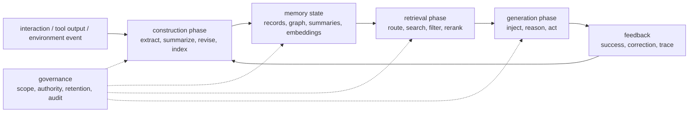
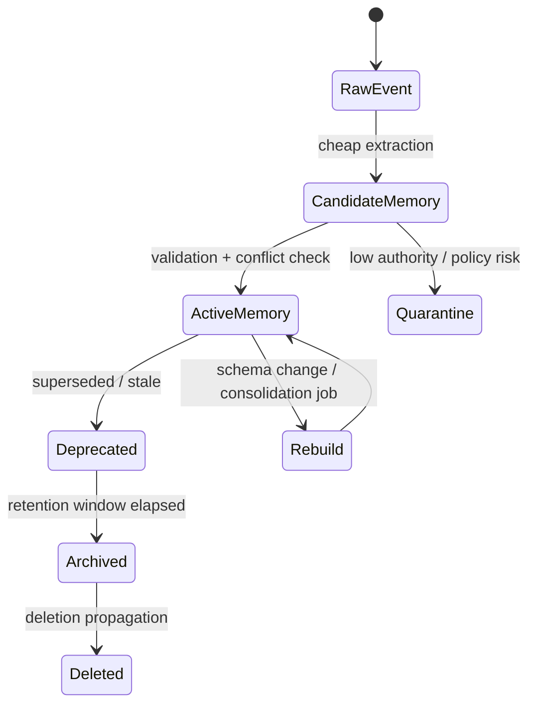

## 来源说明

本文基于 2026-06-10 的每日深度技术研究发布流程写成。今天没有找到足够强的 2026-06-10 同日主源，可以支撑严格意义上的当天新论文文章；因此选择过去一周尚未在本站单独处理、且足以扩展 agent memory 支柱主题的近期论文：`Agent Memory: Characterization and System Implications of Stateful Long-Horizon Workloads`。

核心事实以 arXiv 原始页面为准：该论文在 2026-06-04 提交，作者声称提出了第一个 agent memory systems characterization；其工作包括四轴系统分类、phase-aware profiling harness、对 10 个代表性系统在两个 benchmark suite 上的表征，以及 10 条系统建议，覆盖 construction scheduling、capability floors、query volume amortization、freshness-latency tradeoff 和 fleet-scale management。

由于本运行环境的 shell 侧 DNS 仍无法直接下载 arXiv PDF，本文只把 arXiv 页面摘要中可复核的信息写成事实；机制图、接口、指标和路线图是我的工程推断与建议，不当作论文作者报告结果。

核心来源：

- Yasmine Omri 等: [Agent Memory: Characterization and System Implications of Stateful Long-Horizon Workloads](https://arxiv.org/abs/2606.06448), arXiv:2606.06448, submitted on 2026-06-04
- Abdelghny Orogat, Essam Mansour: [Is Agent Memory a Database? Rethinking Data Foundations for Long-Term AI Agent Memory](https://arxiv.org/abs/2605.26252), arXiv:2605.26252, used as state-trajectory governance context
- Yuyao Wang 等: [EvoMemBench: Benchmarking Agent Memory from a Self-Evolving Perspective](https://arxiv.org/abs/2605.18421), arXiv:2605.18421, used as evaluation boundary context
- Pengfei Du: [Memory for Autonomous LLM Agents: Mechanisms, Evaluation, and Emerging Frontiers](https://arxiv.org/abs/2603.07670), arXiv:2603.07670, used as taxonomy and open-challenge context
- Aojie Yuan 等: [AgentIR: A Workload-Adaptive Cascade Retrieval Substrate for Long-Term Conversational Memory](https://arxiv.org/abs/2605.25092), arXiv:2605.25092, used only as adjacent read-path optimization context

本文和本站 2026-06-03 的 AgentIR 文章相邻，但不重复。AgentIR 重点是检索读路径控制面；本文重点是系统层成本归因、调度、容量治理和上线门槛。它也不同于 2026-05-07 的 memory bottleneck diagnostics：那篇关注调试面，这篇关注运行成本账本和规模化运维。

稳定 slug：`2026-06-10-agent-memory-systems-cost-governance`。

## 先给结论

Agent memory 进入生产后，最容易被低估的问题不是“能不能记住”，而是“记忆层到底把成本放到了哪里”。

一个长期 Agent 系统通常包含写入抽取、摘要、合并、索引、检索、重排、上下文注入、生成和反馈回写。团队在 demo 阶段常只看最终回答质量，或者只统计 prompt token。这样会漏掉一个关键事实：很多 memory architecture 不是降低成本，而是把成本从生成阶段转移到构建阶段、检索阶段或后台维护阶段。

`Agent Memory: Characterization and System Implications of Stateful Long-Horizon Workloads` 的价值在这里。它把 agent memory 作为 stateful long-horizon workload 来表征，而不是继续讨论某一种记忆结构是否更像人类记忆。作者摘要明确强调 phase-aware profiling，也就是把 construction、retrieval、generation 分开归因。这个视角对工程团队非常实用：长期记忆是否值得上线，不能只看 accuracy，要看每个 phase 的成本、延迟、失败率和随规模增长的斜率。

我的工程判断是：生产级 Agent memory 至少要有一套 memory cost ledger。它要回答：

1. 每条 memory 是什么时候、由谁、基于什么来源、用多少成本构建出来的？
2. 它被检索了多少次，实际被模型使用了多少次，带来多少成功任务或纠错下降？
3. 它增加了多少写入延迟、后台任务、索引容量、检索 p95、上下文 token 和安全审计负担？
4. 当 query volume、用户数、记录数、作用域数和保留周期增长时，收益是否还能覆盖成本？

没有这张账本，长期记忆只是更复杂、更难调试、更贵的上下文。

## 技术问题：Agent memory 是状态工作负载，不是一个向量库功能

很多产品最初把 memory 实现成三个函数：`addMemory`、`searchMemory`、`deleteMemory`。这足以做原型，但不足以支持长期系统。

原因是 agent memory 的工作负载有四个特征。

第一，状态持续演化。记忆不是离线知识库。它会在对话、工具调用、用户纠正、环境变化、任务完成和失败复盘中不断写入、修订、降权或遗忘。GEM 论文把长期记忆正确性描述为 state trajectory 的属性，而不是单条 record、embedding 或 graph edge 的属性。这个判断很关键：如果状态轨迹错了，检索再快也只是更快地取出错误状态。

第二，成本跨阶段转移。抽取事实可以降低未来上下文 token，但会增加写入时的模型调用、schema 校验、冲突检测和索引更新。把会话总结成长期条目可以降低检索噪声，但可能增加总结延迟和错误压缩风险。把所有历史交给 long-context 模型可以减少 memory pipeline 复杂度，但会把成本推到 generation phase。

第三，收益依赖 query volume。某条 memory 如果只被构建一次、从未被有效使用，那它就是沉没成本。相反，一条高质量项目约定如果在 200 次任务中减少重复纠错，它可能值得付出较高构建成本。这就是作者摘要里提到 query volume amortization 的工程含义：不能孤立评估一次写入，必须评估未来复用频率。

第四，规模化后出现 fleet 问题。单用户 demo 的 memory store 可以靠简单 cron、全库检索和人工删除维持。多租户系统会遇到容量配额、热冷分层、后台构建调度、过期策略、跨区域复制、审计日志、隐私删除和异常租户隔离。这些问题已经不是 prompt engineering，而是系统工程。

## 机制拆解：把记忆层拆成三个成本相位

我会把 Agent memory 的运行路径拆成 construction、retrieval、generation 三个相位，再把 governance 横切进去。



这张图里，每条边都应该能记账。

Construction phase 负责把原始交互变成可复用状态。它的成本包括抽取模型调用、摘要 token、冲突检测、schema validation、embedding、索引写入和人工确认。它的主要风险是过度写入、错误抽取、来源丢失和过早合并。

Retrieval phase 负责从已有状态中找当前任务需要的证据。它的成本包括 sparse search、dense search、graph traversal、rerank、权限过滤、旧分区扩展和上下文裁剪。它的主要风险是召回错误作用域、漏掉旧事实、过度运行 dense path 或把低权威记忆提到高风险上下文。

Generation phase 负责把记忆证据转化为回答或行动。它的成本包括注入 token、模型推理时间、工具调用、失败重试和审计 trace。它的主要风险是检索到了但没使用、使用了但误读、或者把记忆当成授权依据。

Governance 不应只在写入时出现。来源权威、作用域、保留期、删除传播、用户同意和安全策略应该贯穿三个相位。否则系统会出现一种常见错觉：写入时看起来合规，检索和行动时却越权使用。

## 工程判断：memory ROI 应该按 phase 计算

如果只看最终任务成功率，memory 系统很容易被误判。

一种系统可能在 benchmark 上提高 3% accuracy，但每次任务多跑 6 次 LLM 抽取、3 次检索和 2KB 上下文注入。另一种系统可能 accuracy 没有明显提高，但把用户重复纠错下降一半，长期支持成本更低。两者不能用一个总分判断。

我会把 memory ROI 拆成四层。

| 层级 | 该问的问题 | 不能只看什么 |
| --- | --- | --- |
| Record ROI | 单条 memory 是否被有效复用 | 是否写入成功 |
| Phase ROI | construction、retrieval、generation 各自是否带来净收益 | 总 token 或总 latency |
| Task ROI | 有 memory 相对无 memory 是否提高任务成功、减少步数或减少纠错 | 单轮回答分数 |
| Fleet ROI | 多用户、多租户、多项目规模下成本是否线性可控 | 小样本 benchmark |

这套拆分能解释很多看似矛盾的结果。EvoMemBench 摘要指出，当前 memory systems 仍远非通用解；long-context baselines 仍有竞争力；memory 在当前上下文不足或任务困难时帮助更明显；不同 memory form 在 knowledge-intensive 和 execution-oriented 场景下表现不同。我的理解是：这不是 memory 没用，而是 memory ROI 强依赖任务类型、当前上下文容量、复用频率和执行结构。

因此，系统不应该默认“所有任务都启用长期记忆”。更合理的策略是按任务类型打开不同记忆相位：

- 低风险、短任务：只用当前上下文或轻量 recent memory。
- 需要用户偏好或项目约定的任务：启用 scoped retrieval。
- 需要复用历史流程的任务：启用 procedural / experience memory，但要检查来源和适用条件。
- 需要长时间运行的任务：启用 construction scheduling，把重抽取、合并和降权放到后台。
- 高风险工具任务：启用 memory-to-action trace，要求关键行动能解释依赖了哪些 memory。

## 一个可落地的成本账本数据模型

我不会先改记忆算法，而会先补齐观测数据。没有账本，团队无法判断哪种架构值得保留。

最小数据模型可以长这样：

```ts
type MemoryRecord = {
  id: string;
  scope: {
    userId?: string;
    workspaceId?: string;
    projectId?: string;
    taskId?: string;
  };
  kind: "fact" | "preference" | "event" | "summary" | "procedure" | "tool_experience";
  source: {
    authority: "user_confirmed" | "user_observed" | "tool_verified" | "project_file" | "external_untrusted" | "model_inferred";
    sourceRefs: string[];
    createdAt: string;
  };
  lifecycle: {
    status: "candidate" | "active" | "deprecated" | "quarantined" | "deleted";
    supersedes?: string[];
    expiresAt?: string;
    lastUsedAt?: string;
  };
  cost: {
    constructionMs: number;
    constructionTokens: number;
    embeddingCost: number;
    indexWriteMs: number;
    maintenanceCost: number;
  };
  usage: {
    retrievalCount: number;
    injectedCount: number;
    citedByModelCount: number;
    positiveOutcomeCount: number;
    correctionCount: number;
  };
};
```

检索请求也要记账：

```ts
type MemoryRetrievalTrace = {
  requestId: string;
  taskId: string;
  intent: "fact" | "preference" | "workflow" | "debug" | "temporal" | "unknown";
  enabledPhases: Array<"sparse" | "dense" | "graph" | "rerank" | "old_partition">;
  latency: {
    sparseMs?: number;
    denseMs?: number;
    filterMs?: number;
    rerankMs?: number;
    totalMs: number;
  };
  resultStats: {
    candidates: number;
    injected: number;
    authorityMix: Record<string, number>;
    oldestRecordAgeDays: number;
  };
  outcome: {
    modelUsedMemory: boolean;
    taskSucceeded?: boolean;
    userCorrectedMemory?: boolean;
  };
};
```

这个账本不要求一开始完美，但必须贯穿线上路径。否则 construction scheduling、freshness-latency tradeoff 和 fleet-scale management 都无从谈起。

## 架构建议：把构建调度从请求路径里拿出来

很多 memory 系统的第一版会在用户请求路径里同时做抽取、写入、检索和生成。这会让体验和成本都不稳定。

更稳的架构是把记忆构建拆成同步候选和异步晋升。



请求路径只做低成本候选抽取和必要的短期状态更新。高成本任务进入后台队列：

- 批量摘要和合并。
- 冲突检测和 supersede 更新。
- embedding 重算。
- graph link 维护。
- 旧记录降权。
- 隐私删除传播。
- 低使用率 memory 清理。

这样做有两个好处。第一，用户请求不会被重构记忆拖慢。第二，系统可以按负载调度后台构建：高峰期只保留必要写入，低峰期做合并和重索引。

这也是 capability floors 的实际含义之一。一个 memory system 上线前不必拥有所有高级能力，但要定义最低能力线：至少能写入、检索、删除、审计、回放、限额和降级。如果做不到这些，再复杂的层次记忆或图谱结构都容易成为不可治理状态。

## 适用场景

第一类是长期个人 assistant。它需要记住偏好、联系人、项目习惯和用户纠正。这里最重要的是 record ROI 和负个性化率：记忆是否真的减少重复说明，还是制造了“不该记的时候记住”的体验。

第二类是 coding agent。它会复用仓库约定、失败测试、构建命令和修复经验。这里最重要的是 task ROI：有记忆后是否减少文件遍历、测试重跑和错误补丁，而不是只看是否召回了历史日志。

第三类是企业流程 agent。它处理工单、审批、客户状态和内部策略。这里最重要的是 governance 和 fleet ROI：跨租户隔离、权限过滤、审计、删除和成本配额比单次准确率更关键。

第四类是研究和分析 agent。它会积累论文、实验、假设、反例和引用链。这里最重要的是来源完整性和 freshness-latency tradeoff：旧证据不能被粗暴遗忘，新材料也不能因为最近就自动覆盖已验证结论。

不适合过早引入复杂长期记忆的场景也很明确：短会话客服、一次性生成、低复用任务、强监管但审计链不完善的系统，以及没有用户纠错回路的自动化流程。对这些系统，先把当前上下文、显式配置和日志做好，通常比引入长期 memory store 更稳。

## 失败模式

第一，构建成本被隐藏。系统声称节省 prompt token，但后台抽取、摘要、embedding 和索引成本没有计入总账。

第二，低使用率记忆堆积。大量 memory 被写入后从未被检索或使用，却持续占用索引容量、维护任务和隐私风险预算。

第三，平均延迟掩盖 p95。少数复杂检索、旧分区扩展或 rerank 会拖慢长任务链路，平均值看不出来。

第四，写入越积极，治理越困难。自动抽取可以提升覆盖率，也会增加错误事实、重复条目、冲突和记忆投毒面。

第五，把 long-context baseline 忽略掉。对某些任务，直接保留当前长上下文可能比构建长期 memory 更便宜、更可靠。EvoMemBench 的摘要也提醒，long-context baselines 仍有竞争力。

第六，只做检索评测。召回正确 memory 不等于模型使用正确，也不等于任务成功。必须记录 retrieval-to-use 和 task outcome。

第七，删除不传播。用户删除一条 memory，但它仍存在于摘要、embedding、graph link、缓存、trace 或 procedure memory 中。

第八，fleet 中的异常租户拖垮系统。少数高写入、高检索、高保留周期用户可能占据大部分成本，必须有配额、降级和隔离策略。

第九，后台构建和在线状态竞争。异步合并如果没有版本和快照，可能让一次任务前半段用旧记忆、后半段用新记忆，导致行为不一致。

第十，把成本优化当成质量优化。降低 dense 检索、减少摘要或缩短保留期可能节省费用，但也可能增加旧事实遗漏、纠错和负迁移。

## 可验证指标

Construction cost per accepted memory：每条进入 active 状态的 memory 平均消耗多少模型 token、时间、embedding 和索引写入成本。

Candidate acceptance rate：自动抽取出的 candidate 有多少最终晋升为 active；过低说明抽取策略太宽。

Memory utilization rate：active memory 中，在固定周期内至少被检索、注入或引用一次的比例。

Retrieval-to-use rate：被检索出的 memory 有多少真的被模型引用、执行或影响决策。

Correction reduction：启用 memory 后，用户重复纠正同一偏好、事实或流程的次数是否下降。

Task delta under memory：同一任务集在 no-memory、recent-only、long-context、retrieval-memory、procedural-memory 条件下的成功率、步数、成本和延迟差异。

Phase latency p50/p95/p99：construction、retrieval、generation 分相位统计，而不是只看总耗时。

Storage growth slope：每个活跃用户、项目、任务的 memory 数量和索引体积增长斜率。

Amortized value per memory：单条 memory 的正向 outcome 数量除以构建和维护总成本。

Stale-memory harm rate：过期或被 supersede 的 memory 被检索并导致错误的比例。

Deletion propagation latency：删除请求到 record、summary、embedding、graph、cache、trace 全部失效需要多久。

Authority-weighted injection mix：注入上下文中 user_confirmed、tool_verified、project_file、model_inferred、external_untrusted 的占比。

Fleet hot-tenant ratio：前 1% 租户消耗的 memory 写入、检索、存储和后台任务比例。

Graceful degradation success：关闭 dense、暂停后台合并、限制旧分区检索时，关键任务是否还能保持可接受质量。

## 我会如何实现和验证

我会用四周做一个保守版本，而不是直接重写 memory architecture。

第一周只做观测。给现有 memory write、search、inject、delete 加 trace id，记录 phase latency、token、候选数量、来源权威、注入条数、模型是否引用和用户是否纠错。先不改策略，避免把观测和策略变化混在一起。

第二周建立离线回放集。从真实任务中抽 200 到 500 个 memory case，标注期望证据、允许来源、是否需要长期记忆、是否可以只用当前上下文、是否有安全敏感动作。用 no-memory、recent-only、long-context 和 current-memory pipeline 跑对比。

第三周引入调度和配额。把高成本构建任务移到后台队列；给 workspace 设置 memory write budget、retention policy 和 old partition lookup budget；低权威来源先进入 candidate 或 quarantine，不直接进入 active pool。

第四周做上线门槛。只有同时满足以下条件才扩大流量：

| 门槛 | 目标 |
| --- | --- |
| 任务成功率 | 不低于 long-context baseline |
| p95 retrieval latency | 不超过既定交互预算 |
| correction reduction | 在目标场景下降低重复纠错 |
| memory utilization | active memory 低使用率可解释 |
| deletion propagation | 满足产品和合规要求 |
| authority mix | 高风险任务不依赖低权威记忆 |
| fleet cost | 高写入租户不会拖垮后台队列 |

如果成功率提升但成本和纠错没有改善，我不会上线默认长期记忆；我会改成按任务意图启用。长期记忆应该是按需能力，不是所有 Agent 调用的默认税。

## 局限分析

第一，主源是预印本。本文没有独立复现作者对 10 个系统和两个 benchmark suite 的表征结果，也没有引用 arXiv 摘要之外的细节。

第二，phase-aware profiling 只能说明成本在哪里，不自动说明策略该怎么改。写入、检索、生成之间存在质量和成本 tradeoff，需要结合具体产品目标。

第三，memory ROI 很难完全自动衡量。模型是否“使用了某条记忆”可以通过引用、attention proxy、输出解释或 trace 估计，但仍需要人工抽检和任务级验证。

第四，long-context baseline 会持续变强。随着上下文窗口、缓存和推理成本变化，某些场景里长期 memory pipeline 的相对优势可能下降。

第五，安全治理没有在本文展开。记忆投毒、跨作用域泄漏和工具授权需要单独 threat model；本文只讨论授权环境中的防御性工程和成本治理。

第六，成本账本本身也有成本。过细 trace 会增加存储、隐私和调试负担。生产系统应该先记录能支撑决策的最小字段，再逐步扩展。

## 自审

事实可靠性：主源提交日期、四轴分类、phase-aware profiling harness、10 个代表性系统、两个 benchmark suite、10 条系统建议及其覆盖方向，均来自 arXiv:2606.06448 页面摘要。GEM、EvoMemBench、Memory survey 和 AgentIR 的使用仅限于其 arXiv 页面摘要可复核的相邻观点。

来源完整性：核心来源为原始 arXiv 页面；没有把社区讨论、新闻稿或二级评论作为事实支撑。shell DNS 无法下载 PDF 的限制已在来源说明中披露。

是否只是复述摘要：正文重点是把系统表征转化为成本账本、phase ROI、数据模型、调度状态机、指标和四周验证路线，不是改写论文摘要。

标题党检查：标题只主张“先做成本账本”，没有声称论文解决长期智能或给出通用最优架构。

薄内容检查：正文包含两张机制图/状态机、一个数据模型、一个检索 trace 模型、工程落地方案、指标清单、失败模式、局限和自审。

猜测边界：所有架构、接口、指标和路线图均明确作为我的工程建议；作者报告结果没有被扩展成未经验证的生产结论。

站内重复：本站已有 AgentIR 读路径、AgentCL 迁移评测、MMPO 工作记忆策略、MPBench 记忆安全文章。本文新增的是长期记忆系统的成本归因、调度和 fleet 治理视角。

工程价值：文章给出了可直接落地的 memory cost ledger、上线门槛和验证计划，适合正在把 Agent memory 从 demo 推向生产的团队使用。
