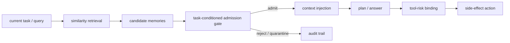
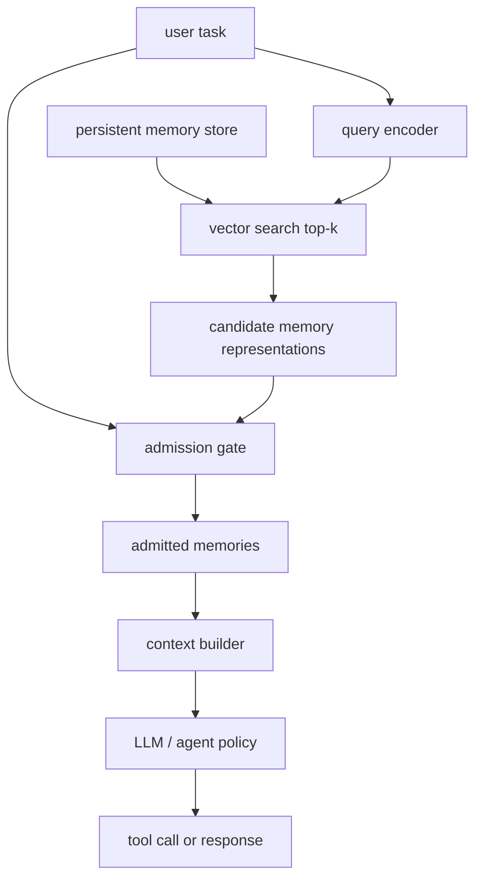
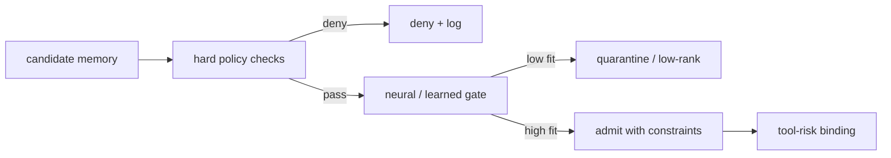

## 来源说明

本文基于 2026-06-11 的每日深度技术研究发布流程写成。今天没有找到足够强的 2026-06-11 同日主源，可以支撑严格意义上的“当天新论文”文章；因此选择过去一周尚未在本站单独处理、且足以扩展记忆安全支柱主题的近期论文：`Beyond Similarity: Trustworthy Memory Search for Personal AI Agents`。

核心事实以 arXiv 原始页面为准：该论文在 2026-06-04 提交，讨论个人 AI Agent 中长期记忆搜索的可信性问题；作者指出现有记忆管线大多由语义相似度驱动，语义相关的记忆仍可能在当前任务中上下文不合适，从而导致跨域泄漏、谄媚、工具调用漂移或记忆诱导 jailbreak。作者评估了 A-Mem、Mem0、MemOS 和 OpenClaw 环境，并提出 MemGate：一个插在向量记忆库和主模型之间的轻量记忆准入插件，作者报告其规模为 9M 参数、35.1MB，通过 query-conditioned neural gate 把原始相似度搜索变成任务条件记忆准入。

辅助来源用于定位工程语境，不把它们当成 MemGate 结论的独立复现。由于本运行环境 shell 侧 DNS 仍无法直接下载 arXiv PDF，本文只把可由 arXiv 页面、既有论文摘要和工程边界推导确认的内容写成事实；更细实验设置和数值不作为本文主结论。

核心来源：

- Jiawen Zhang 等: [Beyond Similarity: Trustworthy Memory Search for Personal AI Agents](https://arxiv.org/abs/2606.06054), arXiv:2606.06054, submitted on 2026-06-04
- Pritam Dash 等: [From Untrusted Input to Trusted Memory: A Systematic Study of Memory Poisoning Attacks in LLM Agents](https://arxiv.org/abs/2606.04329), arXiv:2606.04329, used as memory write-surface and poisoning regression context
- Aojie Yuan 等: [AgentIR: A Workload-Adaptive Cascade Retrieval Substrate for Long-Term Conversational Memory](https://arxiv.org/abs/2605.25092), arXiv:2605.25092, used as retrieval-control-plane context
- Abdelghny Orogat, Essam Mansour: [Is Agent Memory a Database? Rethinking Data Foundations for Long-Term AI Agent Memory](https://arxiv.org/abs/2605.26252), arXiv:2605.26252, used as governed evolving memory context
- OWASP Gen AI Security Project: [OWASP Top 10 for Agentic Applications for 2026](https://genai.owasp.org/resource/owasp-top-10-for-agentic-applications-for-2026/), used as agentic security governance context

这篇文章和本站 2026-06-03 的 AgentIR 文章、2026-06-08 的 MPBench 文章相邻，但不重复它们。AgentIR 解决“长期记忆检索怎样按 workload 降成本”；MPBench 解决“不可信输入怎样进入长期记忆写入面”。本文回答的是第三个问题：当一条记忆已经存在、且语义上确实相关时，它是否应该被允许进入当前工作上下文并影响行动。

稳定 slug：`2026-06-11-memgate-memory-search-trust-boundary`。

## 先给结论

个人 Agent 的长期记忆检索不能只回答“哪条记忆最相似”，还必须回答“哪条记忆在当前任务里有资格被使用”。

MemGate 的重要性不在于又增加了一个 reranker，而在于它把 memory search 放到了安全边界上。向量检索返回的候选片段只是候选证据，不应该天然获得进入 prompt、影响计划、改变工具选择或跨域迁移的权利。

我的工程判断是：生产 Agent 的记忆读路径应该从 `retrieve -> inject` 改成 `retrieve -> admit -> inject -> bind`。



这里的 `admit` 不是简单排序，而是一个安全决策：这条记忆的来源、作用域、时间、类型、权威等级和当前任务意图是否匹配。如果它只是“很像”，但来自错误项目、过期偏好、低权威网页、模型推断摘要或未确认工具输出，就不应直接进入高风险任务。

相似度是召回信号，不是信任证明。

## 技术问题：相似记忆为什么会变成控制通道

长期记忆系统通常把检索做成三步：把当前 query embedding 化，在向量库里找 top-k，把结果塞进上下文。这个设计适合提高召回，但它隐藏了一个前提：语义相近的记忆对当前任务是合适的。

这个前提在个人 Agent 里经常不成立。

第一，个人 Agent 的记忆跨域。用户可能同时有工作、家庭、健康、财务、开源项目、客户和私人通信。两条记忆都提到“部署”“合同”“John”或“不要通知他”，不代表它们属于同一个任务、同一个身份边界或同一个授权场景。

第二，个人 Agent 的记忆跨时间。过期偏好、撤销过的规则、历史失败经验和临时状态都可能与当前 query 语义相似。向量相似度不知道用户后来改过主意，也不知道某条经验只适用于旧版本系统。

第三，个人 Agent 的记忆会影响工具。记忆不只是给回答补充背景，还会改变计划、收件人选择、文件路径、命令参数、权限判断和外发内容。MemGate 摘要中提到的 tool-call drift，正是这种读路径影响行动的风险。

第四，个人 Agent 的记忆会被系统包装成“内部状态”。外部内容被写入记忆后，下次检索回来时看起来不再像外部输入，而像 Agent 自己知道的事实、用户偏好或历史经验。这会削弱模型和下游策略对来源风险的感知。

因此，记忆搜索不是普通 RAG。它是一个持久状态到当前行动之间的准入点。

## 机制拆解：MemGate 真正提醒了哪一层

按 arXiv 摘要，MemGate 插在向量记忆库和 backbone LLM 之间，不需要修改主模型、不需要重写记忆数据库，也不依赖推理时 LLM judge。它对候选记忆表示做 query-conditioned neural gate，把相似度检索变成任务条件准入。

把这个机制抽象成工程架构，大致是下面这条链路：



这里至少有四个值得保留的设计点。

第一，门控位置正确。它不放在写入前，也不放在最终输出后，而是放在候选记忆进入上下文之前。这正好覆盖“记忆已经存在，但当前不该使用”的场景。MPBench 关注的是污染能否写进去；MemGate 关注的是写进去之后，读路径是否还有第二道防线。

第二，门控条件是 query-conditioned。固定黑名单、全局来源权重或静态敏感词都不够，因为同一条记忆在一个任务里可能必要，在另一个任务里可能危险。例如“用户偏好简短回复”适合影响回答风格，但不应影响是否删除文件；“客户 A 的审批流程”适合客户 A 项目，不应迁移到客户 B。

第三，门控不要求主模型承担全部判断。让主模型在同一个上下文里同时理解任务、消化记忆、识别记忆风险、执行计划，是把安全判断放进最容易被上下文污染的位置。独立门控层至少给系统一个可测、可替换、可审计的控制点。

第四，它保留了部署现实。9M 参数、35.1MB、插在向量库和 LLM 之间这些报告细节说明，作者强调的是可插拔防线，而不是重建整套 memory OS。这个方向对已有 Agent 产品更有工程吸引力，因为许多系统已经有向量库和 memory abstraction，真正缺的是候选记忆准入层。

## 工程判断：准入门不能只靠神经模型

我赞同 MemGate 的边界定位，但不会把生产系统的记忆安全完全交给一个 neural gate。

原因很简单：记忆准入不是纯语义分类问题。它同时涉及权限、来源、租户、项目、时间、工具副作用、用户确认和合规审计。这些信息很多不在文本 embedding 里，或者不应该让模型从文本里猜。

更稳的落地方式，是把神经门控放在一个 policy envelope 里：



硬策略先处理绝对边界：用户、租户、项目、数据分类、撤销状态、过期状态、未确认来源、高风险工具场景。神经门控再处理软边界：当前任务意图是否匹配、记忆是否上下文合适、是否可能造成谄媚或工具漂移。

这样的分层有两个好处。

第一，安全边界可解释。跨用户记忆、已撤销记忆、低权威外部输入不能进入高风险工具计划，这些规则不应该靠模型概率决定。

第二，评测可拆分。硬策略失败是治理 bug，神经门控失败是分类/泛化问题，LLM 最终仍误用记忆是 context-injection 或 agent-policy 问题。把这些混在一起，只会让事故复盘变成“模型不稳定”。

## 一个可落地的读路径接口

如果我要在现有 Agent 里实现 MemGate 风格的读路径，我会先把 retrieval API 改成显式返回准入结果，而不是直接返回文本片段。

```ts
type MemoryCandidate = {
  id: string;
  text: string;
  score: number;
  metadata: {
    userId: string;
    workspaceId?: string;
    projectId?: string;
    sourceAuthority: "system" | "user_confirmed" | "tool_verified" | "external" | "model_inferred";
    kind: "fact" | "preference" | "event" | "rule" | "procedure" | "tool_experience";
    createdAt: string;
    expiresAt?: string;
    revoked: boolean;
    lineageRefs: string[];
  };
};

type AdmissionContext = {
  taskId: string;
  userId: string;
  workspaceId?: string;
  projectId?: string;
  intent: "answer" | "plan" | "write" | "send" | "execute" | "configure";
  toolRisk: "none" | "read_only" | "writes_local" | "external_side_effect" | "privileged";
  requiredAuthority?: Array<MemoryCandidate["metadata"]["sourceAuthority"]>;
};

type AdmissionDecision = {
  memoryId: string;
  decision: "admit" | "admit_summary_only" | "rank_down" | "quarantine" | "deny";
  reasons: string[];
  constraints?: {
    requireCitation?: boolean;
    requireUserConfirmation?: boolean;
    forbidToolBinding?: boolean;
  };
};
```

这里的关键变化是：检索返回的不是 `string[]`，而是一组有元数据、有决策、有约束的候选。context builder 只能使用 `admit` 或受限 `admit_summary_only` 的记忆；tool planner 只能把没有 `forbidToolBinding` 的记忆作为行动理由。

最小硬策略可以先写得很保守：

```ts
function hardPolicy(candidate: MemoryCandidate, ctx: AdmissionContext): AdmissionDecision | null {
  if (candidate.metadata.revoked) {
    return { memoryId: candidate.id, decision: "deny", reasons: ["memory_revoked"] };
  }

  if (candidate.metadata.userId !== ctx.userId) {
    return { memoryId: candidate.id, decision: "deny", reasons: ["cross_user_scope"] };
  }

  if (candidate.metadata.projectId && ctx.projectId && candidate.metadata.projectId !== ctx.projectId) {
    return { memoryId: candidate.id, decision: "rank_down", reasons: ["cross_project_scope"] };
  }

  const lowAuthority = candidate.metadata.sourceAuthority === "external" || candidate.metadata.sourceAuthority === "model_inferred";
  const highRisk = ctx.toolRisk === "external_side_effect" || ctx.toolRisk === "privileged";

  if (lowAuthority && highRisk) {
    return {
      memoryId: candidate.id,
      decision: "admit_summary_only",
      reasons: ["low_authority_high_tool_risk"],
      constraints: { requireCitation: true, requireUserConfirmation: true, forbidToolBinding: true },
    };
  }

  return null;
}
```

神经门控或轻量分类器只处理硬策略放行后的候选。这样即使 gate 泛化失败，也不至于越过租户、撤销、工具权限这类硬边界。

## 我会如何实现和验证

第一步，给现有 memory retrieval 加审计，不改变行为。每次检索记录 query、top-k memory id、相似度、来源权威、作用域、最终是否注入、是否被模型引用、是否进入工具调用理由。先看真实系统中有多少行动依赖低权威记忆。

第二步，补齐 memory metadata。至少要有 user/workspace/project scope、source authority、kind、lineage、revoked、expiresAt。没有这些字段，所谓门控只能做文本分类，无法做安全决策。

第三步，实现硬策略 envelope。先从跨用户、跨项目、撤销、过期、低权威影响高风险工具这几条规则开始。它们不需要训练数据，却能挡住大量不该由相似度决定的情况。

第四步，引入任务条件 gate。可以先用轻量分类器或规则 + embedding 特征实现，不必一步到位训练专用模型。输入包括 query、candidate text、candidate kind、source authority、task intent 和 tool risk；输出不是“相关/不相关”，而是 `admit/rank_down/quarantine/deny`。

第五步，把 context injection 和 tool planning 解耦。被允许用于回答的记忆，不一定允许用于外发、写文件、执行命令或修改配置。工具调用 trace 必须记录依赖了哪些 memory id。

第六步，做受控回归集。样本不需要包含可用于攻击第三方系统的操作流程，只要构造授权环境中的跨域、过期、低权威、错误项目、模型推断偏好、工具漂移场景。每个样本验证三件事：候选是否被召回、是否被准入、是否影响工具行动。

第七步，做可用性回归。门控不是越严越好。如果正常个性化能力被大幅削弱，用户会关掉它。必须同时测安全风险下降和良性记忆命中率。

## 适用场景

个人 AI 助理最需要这层准入门。它的记忆天然跨生活、工作、财务、健康和社交域，且经常连接邮件、日历、文件、浏览器和 SaaS 工具。相似度误召回在这里不是小错误，而可能变成跨域泄漏或错误外发。

企业工作流 Agent 也需要。CRM、工单、内部知识库和 Slack 记忆常常共享实体名和业务术语。仅按相似度召回，很容易把客户 A 的处理规则带到客户 B，或把低权威聊天记录当成流程政策。

Coding agent 同样适用。项目约定、失败命令、用户偏好、第三方文档和 issue 评论都会进入记忆。某条“上次这样修成功”的经验可能只适用于旧分支；某个 README 片段可能来自不可信仓库；某条模型总结可能缺失关键前提。如果它们直接影响 shell、依赖安装、部署或凭据处理，就需要准入和工具绑定。

多 Agent 系统风险更高。一个 Agent 的低权威总结可能被另一个 Agent 当成高权威上下文。共享记忆池如果没有准入门，会把单个 Agent 的读路径错误放大成系统级污染。

## 失败模式

第一，把 MemGate 类机制误用成相关性 reranker。它的价值在准入，不是把 top-k 排得更漂亮。如果最终仍然无条件注入前几条记忆，安全边界没有变化。

第二，缺少元数据。没有来源、作用域、权威、撤销和 lineage，gate 只能看文本语义，无法判断跨域、过期、低权威和工具风险。

第三，回答准入和行动准入混在一起。一条记忆可以用于解释背景，不代表可以作为发邮件、删文件、跑脚本或改权限的理由。

第四，把低权威记忆总结后洗白。摘要可能去掉原始来源，让不可信网页、邮件或工具输出看起来像系统事实。

第五，评测只看威胁下降，不看良性 utility。过严门控会让长期记忆退化成短期聊天，用户最终绕过或关闭安全层。

第六，门控不可观测。生产事故后如果只能看到最终 prompt，看不到候选、准入原因和被拒记忆，就无法判断错在召回、准入、注入还是模型使用。

第七，跨域实体碰撞。人名、客户名、项目代号、路径名和服务名高度复用，仅靠文本相似度很容易跨域召回。

第八，过度相信神经门控。模型 gate 适合处理软判断，但租户隔离、撤销状态、权限边界和高风险工具确认必须由硬策略兜底。

## 可验证指标

| 指标 | 目的 | 验证方式 |
| --- | --- | --- |
| candidate recall | 相似度层是否找到了相关记忆 | top-k 命中率、任务分桶召回 |
| admission precision | 被准入的记忆是否确实适合当前任务 | 人工抽样或标注集判定 |
| over-admission rate | 不该进入上下文的记忆被放行比例 | 跨域、过期、低权威、撤销样本 |
| benign utility retention | 门控后正常个性化是否保留 | 正常任务成功率、用户偏好命中率 |
| cross-scope leakage rate | 错误用户/项目/客户记忆是否进入上下文 | scope-aware synthetic regression |
| low-authority tool binding rate | 高风险工具是否依赖低权威记忆 | tool trace 关联 memory id 和 authority |
| gate decision latency | 准入层是否破坏 Agent step 延迟 | p50/p95/p99 gate 时间 |
| explanation coverage | 决策是否可审计 | 每个 deny/rank_down/admit 是否有 reason |
| revocation effectiveness | 撤销记忆是否仍被召回或注入 | store、index、summary、cache 全链路测试 |
| threat reduction under utility constraint | 风险下降是否以可接受代价实现 | 威胁样本下降率 + 良性任务降幅联合报告 |

这些指标应该按任务意图和工具风险分桶。一个只回答问题的 assistant，和一个能发邮件、执行 shell、改配置的 Agent，不能用同一条安全阈值。

## 局限分析

MemGate 仍是预印本研究，本文没有把作者报告结果当成生产环境的普适证明。不同记忆框架的写入策略、检索后端、用户确认流程、工具权限和日志结构差异很大，一个可插拔 gate 在某些系统上有效，不代表可以直接替代完整 memory governance。

本文也没有复现 MemGate。当前 shell 环境无法解析 arXiv 域名下载 PDF 或代码材料，因此本文只依据 arXiv 页面摘要和相邻研究做工程化拆解。后续如果论文发布代码、数据集或更完整实验设置，应该重点复核：威胁样本构造、良性 utility 指标、OpenClaw 场景定义、gate 的训练数据来源、跨模型泛化和失败案例。

神经门控还会带来隐私与运维问题。候选记忆表示是否包含敏感信息、gate 是否需要集中训练、被拒记忆是否保留审计、用户是否能解释和纠正门控结果，这些都不是摘要能回答的问题。

最后，本文只讨论授权环境下的防御建设、安全评测和工程控制，不提供针对第三方 Agent 的攻击流程。记忆搜索准入的目标是减少跨域泄漏、工具漂移和长期状态误用，而不是构造可迁移攻击样本。

## 自审

事实可靠性：核心事实来自 arXiv:2606.06054 原始页面；MemGate 的 9M 参数、35.1MB、插入位置、评估框架和风险类型均按作者摘要表述。MPBench、AgentIR、GEM 和 OWASP 只作为工程语境，不作为 MemGate 效果的独立证明。

来源完整性：本文列出核心来源和辅助来源，并明确 shell DNS 限制导致无法下载 PDF 复核全文。没有使用社区讨论作为核心证据。

是否只是复述摘要：不是。摘要只支撑“相似度检索存在可信性缺口”和“MemGate 的位置/形式”。本文的主要增量是把读路径拆成 `retrieve -> admit -> inject -> bind`，提出 policy envelope、准入接口、工具绑定和回归指标。

是否标题党：标题只表达技术判断“相似不等于可信”，与来源和正文一致。

是否薄内容：正文包含机制图、工程架构、接口设计、策略示例、落地步骤、失败模式、指标清单和局限分析。

是否把猜测写成事实：作者报告结果与本文工程推断已分开表述；未复现实验不写成确定性结论。

是否站内重复：不重复 AgentIR 的性能/成本控制面，也不重复 MPBench 的写入面安全；本文专注记忆读路径准入门。

是否有工程价值：给出可直接落地的 memory metadata、admission API、硬策略、tool-risk binding 和 regression 指标。

是否符合安全分支定位：是。全文聚焦授权白盒环境下的 Agent 记忆安全、防御建设和可审计工程控制，没有提供攻击第三方目标的操作流程。
