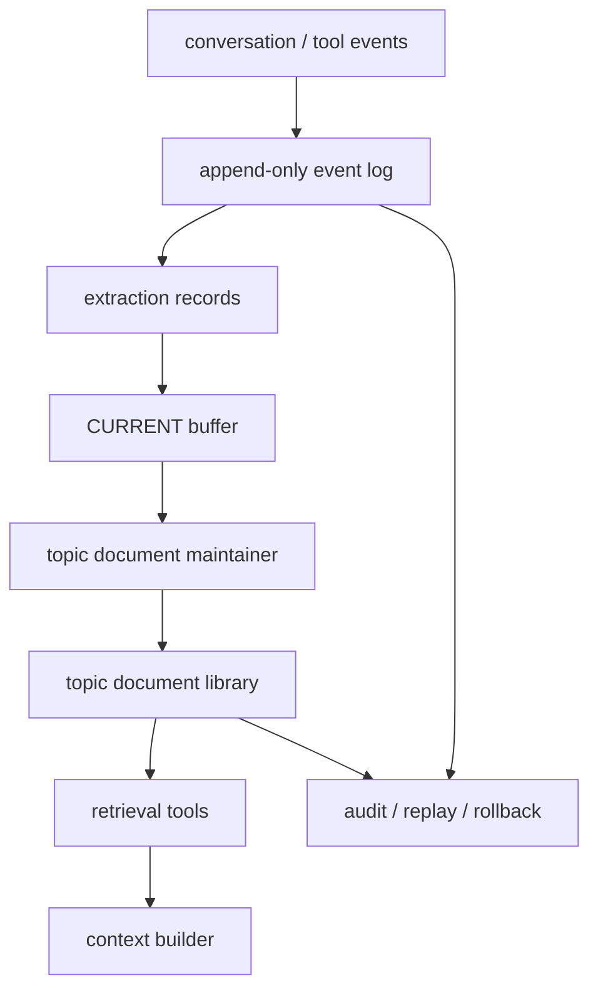

## 来源说明

本文基于 2026-06-14 的每日深度技术研究发布流程写成。今天检索到的安全分支材料以综述和弱信号为主，不足以支撑一篇新的白盒扫描或 CPG 支柱文章；Agent Memory 分支则有一个足够强的近期主源：`Infini Memory: Maintainable Topic Documents for Long-Term LLM Agent Memory`。

核心事实以原始论文和开源仓库为准。论文 arXiv 页面显示其 v1 于 2026-06-09 提交，标题为 `Infini Memory: Maintainable Topic Documents for Long-Term LLM Agent Memory`，作者来自 Infinigence AI、清华大学和上海交通大学。论文提出把长期 Agent 记忆组织成 topic-structured documents，新观察先进入 `CURRENT` 缓冲，再周期性合并、拆分、更新到主题文档库；读路径支持 Hybrid reader 和 Agentic reader；作者在 MemoryAgentBench 上报告 Infini Memory-A 总分 64.7%。

我还阅读了开源仓库 `infinigence/Infini-Memory`。仓库是 Python 包，`pyproject.toml` 标记为 Alpha，核心实现集中在 `src/infini_memory/memory.py`、`manager.py`、`config.py` 和 `convenience.py`。源码中可以看到 `CURRENT` 缓冲、`REWRITE_CURRENT`、`PLAN_UPDATE_PROMPT`、split/update/merge、BM25 partition、Agentic tool search、文件系统文档后端和基础 CRUD。仓库测试覆盖了当前缓冲转 raw、搜索、split/merge 去重等路径。因此本文不只复述论文摘要，而是把论文机制和公开实现一起拆成工程判断。

核心来源：

- Suozhao Ji 等: [Infini Memory: Maintainable Topic Documents for Long-Term LLM Agent Memory](https://arxiv.org/abs/2606.10677), arXiv:2606.10677, submitted on 2026-06-09
- 论文 HTML: [arXiv HTML 2606.10677v1](https://arxiv.org/html/2606.10677v1)
- 开源仓库: [infinigence/Infini-Memory](https://github.com/infinigence/Infini-Memory)
- Yuanzhe Hu 等: [Evaluating Memory in LLM Agents via Incremental Multi-Turn Interactions](https://arxiv.org/abs/2507.05257), used as MemoryAgentBench context
- Minjae Kim 等: [MemRefine: LLM-Guided Compression for Long-Term Agent Memory](https://arxiv.org/abs/2606.13177), used only as adjacent evidence that storage-budgeted memory maintenance is becoming an active topic

这篇文章和本站 2026-06-03 的 AgentIR 文章、2026-06-10 的 memory cost governance 文章相邻，但问题不同：AgentIR 讨论读路径如何按 workload 选择检索策略；成本治理讨论预算、TTL 和审计；本文关注的是更底层的持久记忆表示问题：什么样的存储单元能同时支持写入、修订、检索、遗忘和人工审计。

稳定 slug：`2026-06-14-infini-memory-topic-document-maintenance`。

## 先给结论

Infini Memory 的价值不在于“用 Markdown 存记忆”这个表层选择，而在于它把长期记忆的维护单元从孤立 memory item 改成了 Topic Document。

在生产 Agent 里，长期记忆不是一个无限追加的事实列表，也不是只要向量相似就能注入上下文的片段池。它更像一个会被持续修订的技术文档库：同一主题下的证据需要聚合，旧事实需要被新证据覆盖，来源和时间要跟着内容迁移，读路径要能展开局部上下文，而不是只拿到一个脱离上下文的 chunk。

我的工程判断是：当记忆系统已经进入多会话、多项目、长期偏好和事实更新阶段，Topic Document 是比原子记忆条目更接近生产形态的抽象。但它不是免费午餐。它把一部分检索复杂度前移到了维护任务里，也引入了 LLM 重写错误、文档路由错误、跨主题混合和并发一致性问题。

更准确的架构判断是：


这条链路的重点不是让记忆“更像笔记”，而是让记忆有生命周期：先暂存，再归档，再维护，再带上下文地读取。

## 技术问题：孤立片段为什么维护不了长期记忆

多数 Agent memory 的第一版实现都很相似：从对话里抽取事实，存成短文本，加上 embedding 或关键词索引，查询时取 top-k 注入 prompt。这个模型适合演示“它记得我的名字”，但不适合长期系统。

长期记忆会遇到四类维护问题。

第一是证据碎片化。用户连续十轮对话逐步修正一个项目设定，系统如果把每轮都存成独立条目，下一次检索可能只拿到其中一条，而不是完整演化过程。模型看到片段，就容易把局部信息当成全局事实。

第二是事实冲突。长期 Agent 必然会遇到“用户改主意”“项目配置更新”“旧联系人失效”“之前的判断被证伪”。如果只追加不修订，旧事实和新事实会同时可召回。检索分数高的一条未必是最新、最权威或最适用的一条。

第三是压缩损失。摘要记忆能降成本，但常常丢掉时间、来源、证据顺序和反事实边界。对于“什么时候改的”“谁确认的”“这个偏好是否只适用于某个项目”这类问题，摘要的可读性不等于可验证性。

第四是检索上下文不足。向量或 BM25 返回的是匹配片段，而长期记忆经常需要邻近证据、同主题历史、被 supersede 的旧条目和更新原因。只拿 top-k 片段，会让读路径在“召回相关文本”和“重建事实状态”之间断层。

Infini Memory 的核心问题定义就是：长期 Agent 记忆应该被当作一个可维护状态，而不是一次次检索时临时拼接的上下文碎片。

## 机制拆解：Topic Document 承担了什么职责

Infini Memory 的 Topic Document 大致由 metadata header、summary、hierarchical body 和 entry-level metadata 组成。正文用标题层级组织事实、偏好和事件线索；条目里保留 `seq`、时间和来源等可解析签名。源码和 README 里也保留了文件系统后端、用户隔离目录、索引 JSON、事件日志和 CRUD 接口。

把它抽象成数据模型，可以得到下面的最小形态：

```ts
type TopicDocument = {
  id: string;
  summary: string;
  tokenCount: number;
  createdAt: string;
  updatedAt: string;
  updateCount: number;
  currentEpoch: number;
  body: Array<{
    headingPath: string[];
    entries: Array<{
      seq: number;
      time?: string;
      source?: "user" | "assistant" | "tool" | "external" | "ai";
      text: string;
      supersedes?: number[];
      sensitivity?: "public" | "internal" | "private";
    }>;
  }>;
};
```

这个模型同时解决三件事。

第一，Topic Document 是聚合单元。它把同一主题的相关证据放在一个可读上下文里，避免检索命中一个事实时丢掉邻近的约束和更新历史。

第二，Topic Document 是修订单元。当新观察进入系统后，维护过程可以选择更新既有文档、创建新文档、拆分过大的文档或合并过小的相邻文档。论文和源码都把 split/update/merge 放在维护流程中，而不是让所有事实永久以原始条目形态存在。

第三，Topic Document 是审计单元。Markdown 文件、metadata、`event.json`、`history`、`parent_id`、`merged_from` 等字段让系统至少有机会回答“这条记忆从哪里来、什么时候变成这样、被哪个文档吸收过”。这比黑箱向量库里的一堆 chunk 更容易检查和回滚。

## 写路径：CURRENT 缓冲的工程意义

Infini Memory 没有把每次抽取结果都立刻路由到长期主题库，而是先追加到 `CURRENT`。当 `CURRENT` 超过 token 阈值或变 stale，再进入 rewrite、plan、split/update/merge。

这个设计很关键。很多记忆系统的问题不是不会总结，而是太急着总结。相邻几轮对话通常共享任务上下文：用户先给出需求，随后补充限制，再修正一个细节，最后否定前面的假设。如果第一轮刚结束就写入长期记忆，系统可能把临时假设固化成事实。

`CURRENT` 缓冲提供了一个局部稳定窗口：

| 阶段 | 输入 | 输出 | 主要风险 |
| --- | --- | --- | --- |
| Extract | 原始对话/工具观察 | 带 `seq` 的候选记忆 | 抽错、漏抽、把推断当事实 |
| Append | 新候选记忆 | `CURRENT` 文档 | 缓冲过长、跨任务混合 |
| Rewrite | `CURRENT` 内容 | 按主题整理的近期草稿 | LLM 重写丢来源或改事实 |
| Plan | 近期草稿 + 既有文档摘要 | 新建/更新计划 | 路由错文档、目标 id 幻觉 |
| Split/Update/Merge | 计划和文档库 | 维护后的 Topic Documents | 重复、冲突、过度合并 |

源码里可以看到一些现实防护：`PLAN_UPDATE_PROMPT` 失败时会做 fallback splitting；过大的内容会先按 H1 或 newline 分块；更新目标 id 不存在时会退化为新文档；merge 只处理 token 数低于阈值的候选；并发路径里用锁保护 index 和 event 文件。这些细节说明作者在处理真实工程问题，而不是只画了一张架构图。

但这里也暴露了边界：维护质量高度依赖 LLM 重写和计划输出。如果 LLM 在 rewrite 中省略来源、过度概括、错误合并两个相似但不同的项目，后续检索再强也只能读到被污染的状态。

## 读路径：从一次召回变成证据检查

Infini Memory 的读路径有两种主要形态：Hybrid reader 和 Agentic reader。Hybrid reader 用摘要选择加 BM25 partition 补充；Agentic reader 让 LLM 通过工具多轮检索，比如 `grep`、`grep_doc`、`search`、`list_docs`、`read_lines`。源码中 Agentic search 默认有迭代上限、grep 限制、行读取上限和 BM25 fallback。

这和普通 RAG 的差异在于：读路径不是只问“哪个 chunk 匹配 query”，而是问“我能否围绕某个主题文档逐步找到足够证据”。这对长期记忆很重要，因为很多问题需要多跳事实：

- 用户现在的偏好是什么，旧偏好是否被替代过？
- 某个项目的部署约束来自哪几次对话？
- 一个联系人信息是用户确认的，还是模型从上下文推断的？
- 某个任务失败经验只适用于旧版本，还是仍然有效？

论文报告 Infini Memory-A 在 MemoryAgentBench 上总分 64.7%，并在 ablation 中显示结构维护和 agentic retrieval 都有贡献。这里我会谨慎解读：这是作者在特定 benchmark、特定配置和基线下报告的结果，不代表所有生产任务都会得到同等收益。但它支持一个工程判断：长期记忆质量不能只靠更好的 retriever，维护结构本身也会影响读路径上限。

## 工程判断：Topic Document 适合哪些系统

我会在以下场景优先考虑 Topic Document：

第一，多会话个人 Agent。用户偏好、项目规则、联系人、长期目标会随时间变化，系统需要把新旧证据合并成可解释状态。

第二，研发或运维 Agent。项目约定、错误复盘、命令经验、环境差异和部署策略都天然有主题边界，适合维护成文档而不是短事实列表。

第三，需要人工审计的企业记忆层。文件系统或文档库后端虽然不一定是最终形态，但“可读、可 diff、可回滚”的属性对治理很有价值。

第四，低基础设施复杂度的本地 Agent。Infini Memory 的实现说明，至少原型阶段不一定要先上图数据库或向量数据库。Markdown 文档加索引、BM25 和 LLM 工具检索，可以先验证记忆生命周期是否成立。

我不建议在以下场景直接采用：

第一，高频实时决策。每次维护都依赖 LLM 重写和计划，延迟、成本和不确定性都高于简单 append-only store。

第二，强事务一致性的业务事实库。订单状态、权限、库存、支付记录不应该靠 Topic Document 做事实源。记忆层可以引用这些事实，但不能替代业务数据库。

第三，主题边界非常弱的开放爬取知识库。如果内容主题不断漂移，split/update/merge 会变成昂贵且不稳定的聚类问题。

第四，高敏感数据场景。如果没有来源权威、租户隔离、字段级权限、删除证明和审计策略，Markdown 可读性反而可能放大泄漏风险。

## 一个更稳的落地方案

如果我要在生产 Agent 中借鉴 Infini Memory，我不会直接把所有记忆都写进 Markdown 文档。我会采用双层存储：



底层保留 append-only event log，作为不可篡改事实来源；Topic Document 是维护后的派生视图，可以重建、回滚和重新评测。这样做能避免一个危险：如果维护文档被 LLM 错误改写，系统仍然有原始事件可以回放。

接口上，我会让写入分成两个显式阶段：

```ts
type MemoryEvent = {
  eventId: string;
  userId: string;
  workspaceId?: string;
  projectId?: string;
  source: "user" | "assistant" | "tool" | "external";
  createdAt: string;
  content: string;
  sensitivity: "public" | "internal" | "private";
};

type MaintenancePlan = {
  planId: string;
  inputEventIds: string[];
  creates: Array<{ title: string; content: string }>;
  updates: Array<{ topicDocumentId: string; patch: string }>;
  splits: Array<{ topicDocumentId: string; reason: string }>;
  merges: Array<{ topicDocumentIds: string[]; reason: string }>;
  warnings: string[];
};
```

执行上，`MaintenancePlan` 不应直接生效。低风险个人助手可以自动应用；企业或安全敏感场景应至少对高影响更新做策略检查：跨项目合并、敏感字段降级、删除请求、权限规则、外部来源覆盖用户确认事实，都需要进入人工或规则审批。

## 可验证指标

我会用以下指标判断 Topic Document 方案是否真的有价值，而不是只是把记忆写得更漂亮：

| 指标 | 说明 | 验证方式 |
| --- | --- | --- |
| Evidence coverage | 回答中需要的证据是否能从 Topic Document 找到 | 标注问题到证据行，计算证据覆盖率 |
| Revision accuracy | 新事实是否正确覆盖旧事实 | 构造偏好/配置变更任务，检查是否引用最新状态 |
| Source retention | 重写后是否保留来源、时间和序号 | 对比 event log 与文档条目元数据 |
| Topic purity | 单文档是否混入无关主题 | 抽样文档，人工或分类器标注主题混杂率 |
| Fragment recovery | 检索是否返回足够局部上下文 | 比较 top-k chunk 与 read_lines/partition 展开后的答案准确率 |
| Maintenance drift | 多轮 rewrite 后事实是否漂移 | 定期从原始事件重建，与当前文档 diff |
| Cost per useful memory | 每条最终被使用的记忆维护成本 | 统计 extract/rewrite/plan/retrieval token 与命中率 |
| Deletion latency | 用户撤销或删除后多久从读路径消失 | 写入删除事件后回放检索测试 |
| Conflict backlog | 未解决冲突在文档库中的存量 | 扫描同主题互斥事实和过期条目 |
| Audit replay success | 事故后能否复现记忆状态 | 用 event log 重建指定时间点文档库 |

这些指标里，我最看重 `Revision accuracy`、`Source retention` 和 `Maintenance drift`。长期记忆的失败经常不是搜不到，而是系统自信地搜到了一个已经被维护过程改坏的“整洁版本”。

## 我会如何实现和验证

第一周，我会先实现 append-only event log 和只读检索评测，不立刻启用自动维护。每条用户输入、模型输出、工具观察都写入事件日志，另行生成候选记忆。评测集覆盖姓名偏好、项目配置、冲突更新、撤销请求、跨项目同名实体和工具失败经验。

第二周，引入 `CURRENT` 缓冲和 Topic Document 派生视图。维护任务先离线运行，输出 plan、patch、warnings 和 diff，不自动进入线上读路径。用人工抽样看它是否错误合并主题、丢失来源、把推断写成事实。

第三周，只把低风险记忆接入读路径。比如风格偏好、项目术语、常用命令经验。高风险信息，比如权限、联系人、支付、外发内容和安全策略，仍然要求从业务系统或用户确认读取。

第四周，做 A/B 回放。对比三套方案：原始 chunk + BM25、Topic Document + BM25 partition、Topic Document + Agentic tools。观察准确率、拒答率、延迟、token 成本、证据覆盖率和错误类型。只有当 Topic Document 在修订类和多跳类问题上稳定提升，并且维护漂移可控，才扩大范围。

我还会增加一个强制回滚机制：任何 Topic Document 都能从 event log 重新生成；任何 maintenance plan 都能撤销；任何回答都能追到具体文档行和原始事件 id。没有这些能力，长期记忆系统迟早会变成“看起来很懂用户，但没人知道它为什么这么懂”的黑箱。

## 失败模式

第一，主题路由错误。两个项目都叫 `billing`，维护器把客户 A 的部署经验合并进客户 B 的文档。这个错误在检索阶段很难发现，因为合并后的文档看起来上下文完整。

第二，重写漂移。LLM 为了让文档更流畅，把“用户可能更喜欢 X”改成“用户喜欢 X”。这种从不确定到确定的语气漂移，会逐步污染个性化记忆。

第三，来源降级。原始事件里有 `source=external` 或 `source=AI`，重写后只剩自然语言事实。下一次读路径无法判断它是用户确认、工具验证还是模型推断。

第四，过度合并。小文档 merge 可以降低碎片，但也可能把两个只在关键词上相似的主题混在一起。论文的 split-threshold 实验也提醒，文档过大后会伤害主题路由和 partition-level retrieval。

第五，维护积压。高频交互下 `CURRENT` 如果迟迟不 flush，读路径会同时面对未归档近期状态和旧主题库，可能出现“最新事实还在缓冲里，长期文档仍是旧版本”的窗口期。

第六，删除不彻底。用户要求忘记某条信息后，如果只改 Topic Document，不清理 raw、rewrite、event、索引和派生摘要，读路径或审计导出仍可能泄漏。

第七，Agentic reader 过度自由。工具式多轮检索能提升证据检查能力，也会增加延迟和不可预测路径。生产系统需要限制工具、轮数、读取范围和最终引用规则。

## 局限分析

本文没有复现实验，只基于论文、HTML、开源仓库和源码结构做工程分析。论文报告的 64.7% MemoryAgentBench 总分、ablation 差异和阈值敏感性，应理解为作者报告结果，不是本文独立验证。

开源实现目前仍是 Alpha 状态，且核心维护路径依赖 LLM。它很适合研究和原型验证，但生产落地还需要更强的租户隔离、权限模型、删除语义、数据加密、评测流水线和观测指标。

Topic Document 也不是向量库、图数据库或业务数据库的替代品。它更像长期记忆的维护视图：适合承载可读、可修订、可审计的主题上下文；不适合作为强一致事实源。

## 自审

事实可靠性：论文标题、提交日期、核心机制、MemoryAgentBench 报告分数、Topic Document 结构、`CURRENT` 缓冲、Hybrid/Agentic retrieval、开源仓库路径和 Alpha 状态均来自 arXiv 页面、论文 HTML、GitHub README 与源码检查。

来源完整性：本文使用论文、HTML、仓库和相关 benchmark 论文作为来源，没有使用新闻稿或二手摘要作为主证据。

原创性：本文的主判断是工程化拆解：Topic Document 的价值在于维护单元，而不是 Markdown 表示；生产落地应保留 append-only event log，把 Topic Document 作为派生视图。这不是论文摘要复述。

边界：没有把作者报告结果写成独立复现结果；没有声称 Topic Document 适用于所有记忆系统；没有把 LLM 维护路径描述成确定可靠。

站内重复：本站已有 AgentIR、成本治理和记忆安全文章；本文聚焦表示与维护单元，不重复读路径路由、安全准入或预算治理。

工程价值：文章给出机制图、数据模型、指标表、落地路线和失败模式，满足本站 Agent Memory 分支定位。
