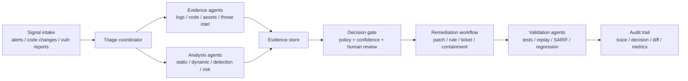
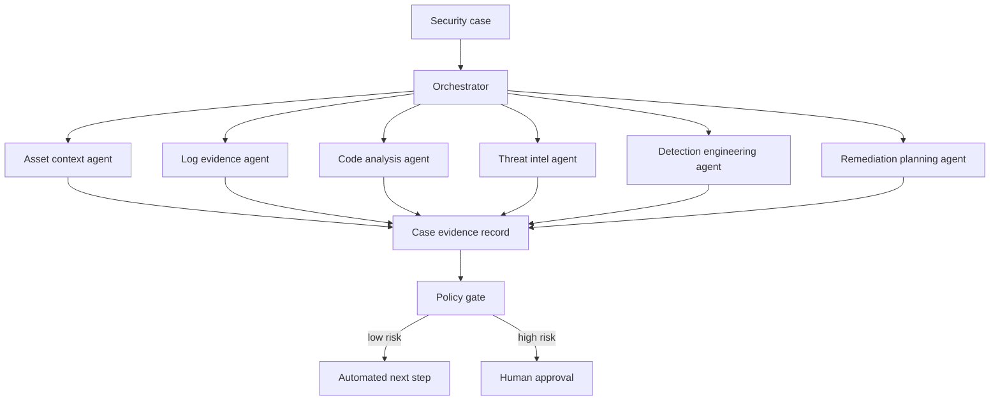
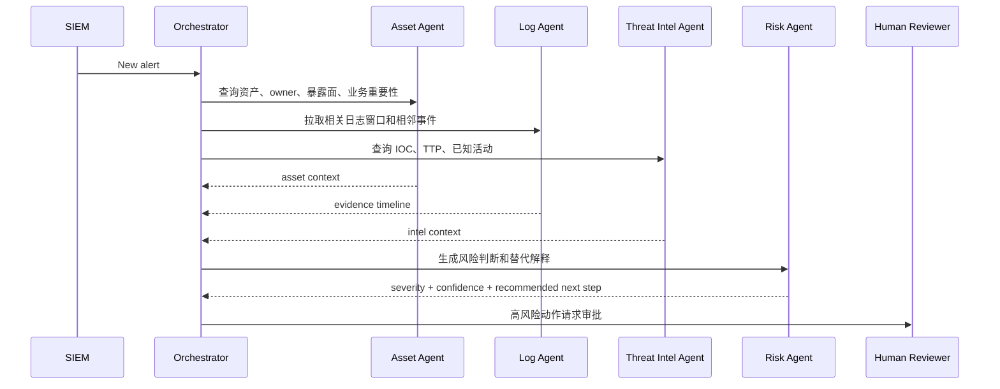
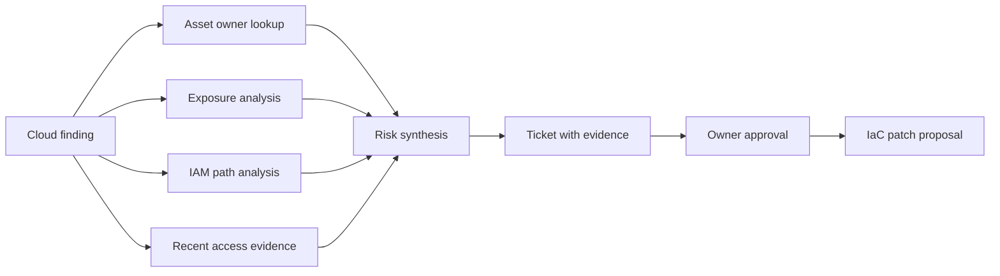
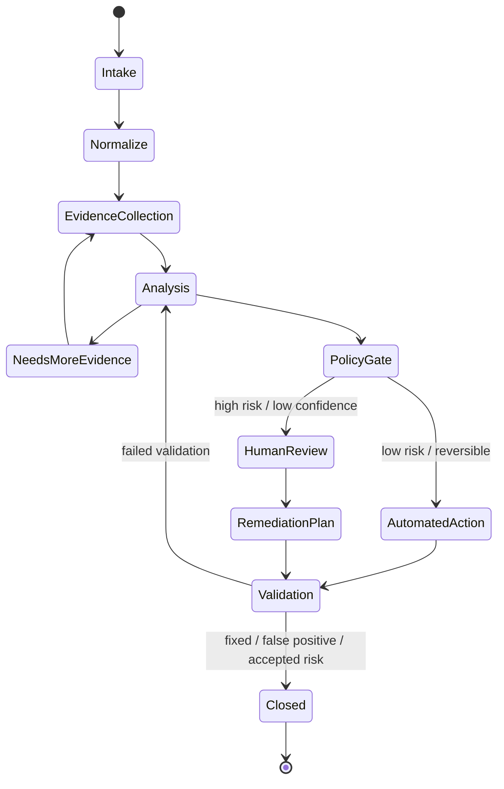
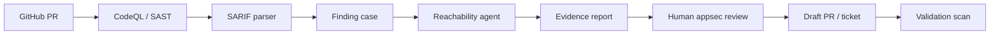

## 来源说明

本文基于 2026-06-15 的调研写成，目标是回答一个工程问题：Agent 编排在网络安全里到底应该怎么用，哪些环节适合自动化，哪些环节必须保留人工审核，以及如果要落地一个安全 Agent 编排系统，第一版架构应该长什么样。

我优先参考了官方文档、厂商安全工程案例和近期研究：

- Microsoft Security Blog 在 2026-06-02 的 Build 文章中介绍了 MDASH，也就是 multi-model agentic scanning harness。文章称该系统编排超过 100 个专门 AI agents，用模型组合发现、验证并证明代码库中的可利用漏洞。[1]
- Microsoft 2026-05-12 的 MDASH 文章把重点讲得更清楚：模型只是输入，产品是 agentic system；其报告包括 planted vulnerabilities、MSRC 历史案例和 CyberGym benchmark 等评测结果。[2]
- Google Cloud Architecture Center 在 2026 年发布的 Agentic AI SOC 架构文档，把安全 Agent 编排定义为跨 SIEM、威胁情报、CSPM、EDR 等系统的多 Agent 调查与分流流程。[3]
- LangChain 文档把 multi-agent 模式拆成 subagents、handoffs、skills、router 等，其中 subagents 是主 Agent 把子 Agent 当工具调用，handoffs 则是 Agent 之间转移控制权。[4]
- OpenAI Agents SDK 文档强调，复杂工作流需要 orchestration、handoffs、guardrails、human review、results/state 和 observability。[5]
- Microsoft Agent Framework 文档强调显式 multi-agent workflow、session state、type safety、filters、telemetry 和 human-in-the-loop 长流程。[6]
- GitHub Code Scanning 文档说明 CodeQL 是 GitHub 的代码分析引擎，也支持第三方工具通过 SARIF 接入 code scanning。[7]
- GitHub SARIF 文档强调稳定 fingerprint、ruleId、locations、codeFlows 等字段对于去重和可操作告警很重要。[8]
- OWASP Top 10 for Agentic Applications 2026 把 autonomous and agentic AI systems 的风险作为独立框架处理，说明 Agent 本身也必须被当作安全对象管理。[9]
- NIST AI RMF Generative AI Profile 给出了跨行业 AI 风险管理视角，适合作为治理层参考。[10]
- AgentSOC 论文提出面向大型企业 SOC 的多层 Agentic AI 框架，强调 triage consistency、攻击者意图预测和可行的 containment recommendations，但其评估仍是概念性企业环境评估，需要谨慎解读。[11]

本文不提供攻击第三方目标的操作流程。所有方案默认用于授权环境中的安全运营、代码审计、检测工程、漏洞验证和防御建设。

稳定 slug：`2026-06-15-agent-orchestration-cybersecurity-workflows`。

## 先给结论

Agent 编排在网络安全里最有价值的位置，不是替代安全专家，也不是把扫描器换成聊天机器人，而是把安全工作流里大量“跨工具、跨证据、跨上下文、需要判断但又高度重复”的环节串起来。

一个成熟的安全 Agent 编排系统应该像安全团队的任务调度和证据操作系统：



我的判断是：网络安全里的 Agent 编排要从三个原则出发。

第一，Agent 不能直接拥有无限权限。它应该拿到的是任务级、时间级、环境级的最小权限，并且每个高风险动作都要进入审批门。

第二，Agent 不能只输出“判断”。它必须输出证据包，包括原始信号、检索来源、工具命令、规则命中、代码路径、日志片段、置信度、替代解释和复核建议。

第三，Agent 编排系统的核心不是 prompt，而是状态机。没有状态，就没有可恢复执行、去重、回放、审计、人工接管和质量评估。

## 为什么安全场景需要编排，而不是单 Agent

安全工作的问题很少是“问一个问题，给一个答案”。更常见的是一串带状态的判断：

- 这个告警是否真实？
- 资产是否暴露在公网？
- 这个 CVE 是否影响当前版本和配置？
- 代码路径是否可达？
- taint flow 是否跨过了权限边界？
- 现有检测规则是否覆盖这个行为？
- 修复补丁是否真的消除路径？
- 关闭告警会不会丢掉同类风险？

单 Agent 最大的问题是上下文会混在一起。它既要读日志，又要读代码，又要查威胁情报，又要生成修复建议，还要决定是否执行动作。短期 demo 可以跑，但生产里会出现四类失败。

第一是职责混乱。负责证据收集的 Agent 不应该同时负责最终决策。负责生成检测规则的 Agent 不应该同时批准上线规则。

第二是权限过宽。如果一个 Agent 同时能读源码、读生产日志、开工单、改规则、触发隔离动作，它就变成了一个高权限自动化账号。Agent 被提示注入、记忆污染或工具输出污染影响时，风险会放大。

第三是不可审计。安全结论必须能回放：它看了哪些日志，调用了哪些工具，忽略了哪些证据，为什么把优先级从 P2 提到 P1。单 Agent 对话记录通常无法满足这种审计粒度。

第四是评估困难。你无法知道失败来自模型推理、工具输入、检索漏召、规则误配、权限不足，还是人类审批延迟。

因此，安全 Agent 编排更接近下面这个抽象：



Orchestrator 不一定是最聪明的模型。它更像一个状态协调器：分派任务、限制工具、合并证据、检查置信度、调用审批、记录 trace。

## 适合 Agent 编排的五类安全应用

### 1. SOC 告警分流与证据收集

最适合落地的第一类场景是 SOC triage。原因很简单：告警量大、上下文分散、重复动作多、输出格式稳定、风险动作可以延后。

一个告警分流工作流可以这样设计：



第一版不要让 Agent 自动隔离主机或封禁账号。更稳妥的是让它自动完成：

- 告警去重
- 资产上下文补全
- 最近 30-120 分钟事件时间线
- 相关 IOC 和 ATT&CK 技术映射
- 误报可能性说明
- 建议给人类 analyst 的三步验证清单

这类工作流的质量指标不是“回答看起来专业”，而是：

- 平均分流时间是否下降
- 高危告警漏判率是否下降
- 误报关闭是否有足够证据
- 人工复核时是否能直接沿着证据链检查
- 同一类告警是否稳定给出相同级别判断

Google Cloud 的 SOC 编排文档强调跨 SIEM、威胁情报、CSPM、EDR 等系统组织调查流程，这和上面的设计方向一致。[3]

### 2. 白盒扫描与漏洞验证编排

第二类场景是白盒扫描。它比 SOC 更适合写成 Agent 编排系统，因为代码分析天然可以拆成多个阶段：

- 仓库识别
- 语言和框架识别
- attack surface 枚举
- 静态规则扫描
- CPG / CodeQL / Semgrep / Joern 分析
- 可达性判断
- 数据流和权限边界分析
- exploitability 证据整理
- 修复建议和回归验证

Microsoft MDASH 的公开信息很重要。Microsoft 没有把它描述成“一个模型找漏洞”，而是 multi-model agentic scanning harness：多模型、多 Agent、验证和证明可利用性。[1][2] 这说明安全自动化的关键正在从“单点模型能力”转向“编排系统能力”。

一个白盒扫描 Agent 编排方案可以这样拆：

| Agent | 输入 | 输出 | 权限 |
| --- | --- | --- | --- |
| Repo profiler | 仓库、构建文件、依赖清单 | 语言、框架、入口、危险 API 初筛 | 只读源码 |
| Query planner | profiler 结果、历史漏洞类型 | CodeQL/Semgrep/Joern 查询计划 | 只读规则库 |
| Static runner | 查询计划 | SARIF、CPG 查询结果、命中路径 | CI 沙箱 |
| Reachability analyst | 命中路径、路由、配置 | 可达性判断、前置条件 | 只读源码和构建产物 |
| Exploitability reviewer | 可达路径、权限边界 | 风险等级、反例、置信度 | 无生产权限 |
| Patch planner | 风险证据、代码上下文 | 修复建议、测试建议 | 可开 PR，不可自动 merge |
| Validation agent | PR diff、测试、扫描结果 | 回归结论、残余风险 | CI 沙箱 |

这里最好把扫描结果统一落到 SARIF 或内部等价结构。GitHub Code Scanning 已经把 CodeQL 和第三方 SARIF 接入作为标准路径，SARIF 里的 ruleId、locations、codeFlows、partialFingerprints 对去重和告警稳定性非常关键。[7][8]

我的建议是：不要让 Agent 输出“这个地方有漏洞”这种自由文本作为主结果，而是输出结构化 finding：

```yaml
finding_id: "authz-route-missing-tenant-check-001"
rule_id: "custom.authz.tenant-boundary"
severity: "high"
confidence: 0.78
artifact:
  repo: "service-api"
  commit: "abc123"
  file: "src/routes/projects.ts"
  line: 142
evidence:
  entrypoint: "PATCH /projects/:id"
  source: "user-controlled project id"
  sink: "updateProjectOwner"
  missing_check: "tenant membership check before mutation"
  code_flow:
    - "router.patch('/projects/:id')"
    - "ProjectController.update"
    - "ProjectService.updateOwner"
counter_evidence:
  - "global auth middleware verifies login only, not tenant membership"
required_review:
  - "confirm multi-tenant deployment mode"
  - "check whether database row-level security is enabled"
recommended_fix:
  type: "guard-before-mutation"
  tests:
    - "cross-tenant update should return 403"
```

这类结构化结果可以被 code scanning、工单系统、知识库和复测流水线复用，而不是停留在一次聊天里。

### 3. 检测工程：从事件到规则再到回归

第三类应用是 detection engineering。Agent 编排可以把“写规则”这件事拆成证据链：

1. 从 incident 或 threat intel 中抽取行为模式。
2. 映射到 ATT&CK technique 或内部行为 taxonomy。
3. 查询现有日志源是否覆盖相关字段。
4. 生成 Sigma / YARA / KQL / SPL 等候选规则。
5. 在历史日志上 replay，估计误报率。
6. 生成测试样例和调优建议。
7. 进入人工 review。
8. 上线后持续监控 drift。

这比“让模型写一条 Sigma 规则”更实用。规则文本只是中间产物，真正有价值的是字段覆盖、误报分析、样本回放和维护责任。

这个流程里可以设置两个关键门：

- Evidence gate：没有足够样本、字段覆盖不完整、攻击行为描述不明确时，不允许生成生产规则。
- Promotion gate：规则必须通过历史 replay、影子运行和人工 review 后才能进入 blocking 或 paging。

### 4. 云安全与暴露面治理

Agent 编排还适合 CSPM、云资产暴露面和身份权限治理。原因是云安全问题往往需要跨多个系统：

- 资产清单
- IAM 权限
- 网络暴露面
- workload 配置
- secret 扫描
- 审计日志
- owner 和业务上下文

单个规则只能告诉你“这个 bucket public”或“这个 role 权限过大”，但不能自动判断业务影响、可达路径、历史访问、owner 和修复路径。

一个云安全 Agent workflow 可以先只做建议，不做自动改动：



第一版只允许 Agent 开 ticket 和 PR，不允许直接改生产云配置。等指标稳定后，再把低风险、可回滚的修复动作纳入自动执行。

### 5. 安全知识库与复盘自动化

第五类容易被低估：安全知识库维护。Agent 可以把 incident、finding、规则、误报、修复 diff、复测结论整理成可检索的长期知识。

这和本站一直讨论的 Agent memory 有交叉：安全 Agent 的记忆不应该是“记住所有聊天”，而是维护安全事实：

- 哪些服务是关键资产
- 哪些规则容易误报
- 哪些漏洞类型在某个代码库反复出现
- 哪些 owner 对某类修复响应慢
- 哪些检测字段不可靠
- 哪些补丁模式已经验证有效

但是这类记忆必须带来源、时间、适用范围和撤销机制。否则它会把过期事实带入新的安全判断。

## 编排模式选择：Router、Supervisor、Handoff 还是状态机

Agent 编排有很多框架名词，但落到安全工程，我会按风险级别选择模式。

### Router：适合低风险分类

Router 模式负责把任务分给不同 Agent，比如：

- 这是代码扫描任务，交给 white-box workflow。
- 这是 SOC 告警，交给 triage workflow。
- 这是规则编写，交给 detection workflow。

Router 输出应该是结构化分类和置信度，而不是直接处理最终结果。

### Supervisor：适合多证据合成

Supervisor 模式适合一个中心协调者调用多个 specialist。LangChain 文档里的 subagents 模式就是主 Agent 把子 Agent 当工具协调，所有 routing 经过主 Agent。[4]

安全场景里，Supervisor 的优点是可控：所有工具调用、权限和状态都可以由中心节点管理。缺点是中心容易成为瓶颈，prompt 和上下文过大时会出现遗漏。

### Handoff：适合人机协作和复杂分支

Handoff 适合某个阶段需要由另一个 Agent 接管上下文，例如从 triage 转入 incident response，从 code analysis 转入 patch planning。OpenAI Agents SDK 和 LangChain 都把 handoff 当作多 Agent 工作流的重要机制。[4][5]

安全场景要注意：handoff 不是权限继承。每次 handoff 都应该重新计算工具权限和允许动作。

### 显式状态机：适合生产安全系统

真正生产化时，我更建议把 Agent 编排写成状态机，而不是自由对话。



Microsoft Agent Framework 文档强调显式工作流、session state、telemetry 和 human-in-the-loop，这类能力比“多 Agent 能聊天”更贴近安全生产系统需要。[6]

## 一套可落地的系统方案

下面给出一个我会采用的 MVP 架构。目标不是一口气做全自动 SOC，而是先构建“可审计的安全工作流编排层”。

### 组件 1：Case Store

Case 是系统主对象。每个安全任务都必须落到 case：

```yaml
case:
  id: "sec-2026-06-15-001"
  type: "code_finding | soc_alert | cloud_exposure | detection_rule"
  source: "github_code_scanning | siem | cspm | manual"
  status: "intake | evidence | analysis | review | validation | closed"
  severity: "info | low | medium | high | critical"
  confidence: 0.0
  owner: "security-platform"
  created_at: "2026-06-15T09:30:00+08:00"
  related_assets: []
  related_commits: []
  related_alerts: []
```

Agent 不直接“处理一个消息”，而是处理 case 的状态转移。

### 组件 2：Evidence Store

Evidence Store 存所有证据，不存未标注来源的结论。

```yaml
evidence:
  id: "ev-001"
  case_id: "sec-2026-06-15-001"
  source_type: "code | log | config | threat_intel | scan_result | human_note"
  source_uri: "repo://service-api/src/routes/projects.ts#L142"
  collected_by: "code-analysis-agent"
  collected_at: "2026-06-15T09:34:12+08:00"
  trust_level: "direct | derived | model_inferred"
  content_hash: "sha256:..."
  summary: "route mutates project owner before tenant membership check"
```

每个 Agent 的结论都必须引用 evidence id。没有 evidence id 的结论只能作为 hypothesis。

### 组件 3：Policy Engine

Policy Engine 决定动作边界：

| 动作 | 默认策略 |
| --- | --- |
| 读取公开源码 | 自动允许 |
| 读取生产日志 | 需要 case scope 和审计 |
| 运行静态扫描 | 自动允许，限 CI 沙箱 |
| 生成 PR | 自动允许，但标记为 bot PR |
| merge PR | 必须人工审批 |
| 关闭高危告警 | 必须人工审批 |
| 隔离主机 / 禁用账号 | 必须人工审批，除非预定义低风险 playbook |
| 修改检测规则为 paging | 必须人工审批和 shadow run |

Policy 不应该写在 prompt 里，而应该写在代码和配置里。

### 组件 4：Agent Registry

每个 Agent 都是可登记、可版本化、可评估的：

```yaml
agent:
  id: "reachability-analyst-v1"
  purpose: "判断静态扫描命中是否可达"
  allowed_tools:
    - "repo.read"
    - "callgraph.query"
    - "route.map"
  denied_tools:
    - "prod.shell"
    - "cloud.write"
  input_schema: "ReachabilityTask"
  output_schema: "ReachabilityReport"
  eval_set: "reachability-regression-2026-06"
  owner: "appsec"
```

这样做的好处是：Agent 的能力变化可以被审计，输出可以被回归测试。

### 组件 5：Trace 与 Replay

每次运行都应该保留：

- 输入 case
- 调用的 Agent 版本
- 工具调用参数
- 工具返回摘要和 hash
- 模型输出
- policy gate 决策
- 人工审批记录
- 最终状态转移

没有 trace 的 Agent 编排系统，在安全里很难上线。因为你无法解释一次错误封禁、误关告警或漏报是怎么发生的。

## 白盒扫描 MVP：我会怎么实现

如果从零开始做，我不会先接生产 SOC。我会从白盒扫描开始，因为它更容易隔离权限，也更容易回归验证。

### 第 1 周：读源码和统一结果

目标：

- 支持 GitHub repo 输入
- 运行 CodeQL 或现有 SAST
- 解析 SARIF
- 把结果写入 Case Store
- Agent 只做结果解释和证据补全

交付物：

- `case.json`
- `evidence/*.json`
- `findings.sarif`
- `triage_report.md`

质量门：

- 不能自动关闭告警
- 不能自动提交修复
- 每个 finding 必须有 ruleId、file、line、evidence summary

### 第 2 周：可达性和误报解释

目标：

- 为每个 finding 查找入口路径
- 识别配置条件
- 找反证：是否已有 middleware、权限检查、schema validation
- 输出 true positive / likely false positive / needs review

指标：

- 人工 review 节省时间
- 高置信 true positive 的准确率
- false positive explanation 是否可复核

### 第 3 周：PR 级修复建议

目标：

- 只对高置信 finding 生成 patch plan
- 生成测试建议
- 可选择开 draft PR

限制：

- 不自动 merge
- 不自动改安全策略
- 所有 patch 都必须附带 evidence 和 validation plan

### 第 4 周：回归验证和知识沉淀

目标：

- 对修复 PR 重跑扫描
- 对同类漏洞生成规则或 checklist
- 把确认过的修复模式写入安全知识库

指标：

- 同类 finding 复发率
- patch 被接受率
- review comment 数量
- 误报重复出现率

## SOC MVP：我会怎么实现

SOC 侧建议更保守，从只读分流开始。

第一阶段只做：

- 告警归一化
- 资产上下文补全
- 时间线构建
- IOC 查询
- 初始严重性建议
- 人工 analyst checklist

第二阶段再做：

- 自动开工单
- 自动关联历史案例
- 自动生成检测规则候选
- 自动生成 containment proposal

第三阶段才考虑：

- 低风险动作自动化
- 可回滚 playbook
- 带审批的 EDR 动作
- 持续评估 MTTD / MTTR / false positive reduction

这里的核心是安全边界：Agent 可以加速调查，但不应该一开始就拥有生产处置权限。

## 风险控制：Agent 编排系统本身也是攻击面

OWASP Top 10 for Agentic Applications 2026 的存在说明一个现实：Agentic systems 自己就是新的安全对象。[9] 安全团队用 Agent 做防御时，不能忽略 Agent 的风险。

我会重点防这几类问题。

### 1. Prompt injection 和工具输出污染

安全 Agent 会读取日志、issue、代码注释、README、网页和 threat intel。这些输入都可能包含诱导性文本。

控制方式：

- 工具输出和用户指令分离
- 不把外部文本当系统指令
- 对高风险工具调用做 policy check
- 对总结类输出保留 evidence id

### 2. 权限扩散

多个 Agent 串起来后，权限可能在 handoff 中隐式扩散。

控制方式：

- 每次状态转移重新计算权限
- 高风险工具要求 case scope
- 写操作默认禁止
- 生产动作必须审批

### 3. 证据幻觉

模型可能生成看似合理但不存在的代码路径、日志字段或威胁情报。

控制方式：

- 每个关键结论必须引用 evidence id
- 证据 hash 和 source URI 必须存在
- 把 model_inferred 和 direct evidence 分开
- 人工审核界面默认显示原始证据

### 4. 自动化误伤

安全自动化最怕“做错了还很快”。Agent 编排一旦接入 EDR、IAM、WAF、CI/CD，就必须做动作分级。

控制方式：

- read-only by default
- dry-run first
- reversible action only
- blast radius limit
- approval + rollback

## 评估方案

不要只评估回答质量。安全 Agent 编排要评估 workflow 质量。

| 指标 | 含义 | 目标 |
| --- | --- | --- |
| Evidence coverage | 结论引用的证据完整度 | 高风险结论必须 100% 有证据 |
| Triage precision | 高置信判断准确率 | 比人工 baseline 不低 |
| False closure rate | 错误关闭告警比例 | 必须接近 0 |
| Review time saved | 人工复核耗时下降 | 先追 20%-40% |
| Reproducibility | 同输入重复运行结果稳定性 | case 状态和结论一致 |
| Action safety | 自动动作误伤率 | 第一阶段不允许高风险自动动作 |
| Trace completeness | 是否可回放 | 每次工具调用和状态转移都有记录 |
| Regression catch rate | 修复后同类问题复测能力 | 持续上升 |

对于白盒扫描，还要加入：

- SARIF 去重稳定性
- finding fingerprint 变更率
- confirmed finding rate
- patch acceptance rate
- regression test pass rate

## 工程落地清单

第一版系统我会按这个顺序做：

1. 只做一个场景：白盒扫描或 SOC triage，不要同时做所有安全自动化。
2. 建 Case Store 和 Evidence Store。
3. 给每个 Agent 定义 input/output schema。
4. 所有工具调用经过 Policy Engine。
5. 输出结构化 finding，而不是自由文本结论。
6. 接入 SARIF 或等价内部格式。
7. 做 trace 和 replay。
8. 第一阶段只读，不执行生产处置动作。
9. 引入人工审批门。
10. 建回归集，每次改 prompt、模型、工具或规则都跑。

如果只做一个最小可用版本，我会选择：



这个版本不酷，但可控。它能让团队先验证 Agent 是否真的减少人工审计成本，而不是在生产 SOC 里承担过大的误伤风险。

## 与本站已有文章的关系

本站之前写过 CPG、LFP 和 Agent 结合构建白盒扫描器的方案，也写过 Agent memory security boundary。本文的差异在于：它不是讨论单个扫描技术，而是讨论如何把扫描、SOC、检测工程、修复验证和安全知识库串成一个可治理的 Agent 编排系统。

也就是说，CPG、CodeQL、Semgrep、Joern、EDR、SIEM、CSPM 都只是工具。真正要设计的是：

- 谁负责调用工具
- 谁负责合并证据
- 谁负责判断风险
- 谁负责审批动作
- 谁负责记录可回放 trace
- 谁负责把经验写回长期安全知识库

## 局限分析

第一，公开案例仍偏早期。MDASH 是非常强的信号，但公开细节有限，不能直接复制其内部工程；AgentSOC 论文提供了框架思路，但仍需要真实企业环境验证。

第二，Agent 编排不能解决基础数据质量问题。如果资产清单不准、日志缺字段、代码构建不了、规则库过期，Agent 只会把混乱包装成更流畅的报告。

第三，安全 Agent 的 ROI 需要靠流程指标验证。没有 baseline，就无法证明它真的提升了安全效率。

第四，自动化越深入，治理成本越高。审批、trace、权限、回滚、评估集和红队测试都不是可选项。

## 自审

- 事实可靠性：核心事实来自 Microsoft、Google Cloud、OpenAI、LangChain、Microsoft Learn、GitHub、OWASP、NIST 和 arXiv。
- 来源完整性：已列出主要来源，并区分官方文档、厂商案例和研究论文。
- 是否只是复述：不是。本文把材料综合成 SOC、白盒扫描、检测工程、云安全和知识库五类落地方案。
- 是否标题党：标题聚焦 Agent 编排在安全工作流中的位置，和正文一致。
- 是否薄内容：包含架构图、状态机、Agent 分工表、数据模型、MVP 路线、评估指标和风险控制。
- 是否把猜测写成事实：对 MDASH 和 AgentSOC 的可复制性做了边界说明。
- 是否存在安全风险：没有提供攻击第三方目标的步骤；方案用于授权扫描、防御运营和安全工程。

## 参考来源

[1] Microsoft Security Blog: [Microsoft Build 2026: Securing code, agents, and models across the development lifecycle](https://www.microsoft.com/en-us/security/blog/2026/06/02/microsoft-build-2026-securing-code-agents-and-models-across-the-development-lifecycle/)。官方厂商安全工程案例，可信度高，但应注意产品发布语境。

[2] Microsoft Security Blog: [Defense at AI speed: Microsoft’s new multi-model agentic security system tops leading industry benchmark](https://www.microsoft.com/en-us/security/blog/2026/05/12/defense-at-ai-speed-microsofts-new-multi-model-agentic-security-system-tops-leading-industry-benchmark/)。官方案例，包含 MDASH 评测描述，可信度较高，但具体系统实现细节未完全公开。

[3] Google Cloud Architecture Center: [Agentic AI use case: Orchestrate security operations workflows](https://docs.cloud.google.com/architecture/agentic-ai-orchestrate-security-ops-workflows)。官方架构文档，适合作为 SOC 编排参考。

[4] LangChain Docs: [Multi-agent](https://docs.langchain.com/oss/python/langchain/multi-agent)。官方框架文档，适合理解 subagents、handoffs 和 router 等模式。

[5] OpenAI Developers: [Agents SDK](https://developers.openai.com/api/docs/guides/agents)。官方文档，强调 orchestration、handoffs、guardrails、human review、state 和 observability。

[6] Microsoft Learn: [Microsoft Agent Framework Overview](https://learn.microsoft.com/en-us/agent-framework/overview/)。官方文档，说明显式 workflow、session state、type safety、filters、telemetry 和 human-in-the-loop 的价值。

[7] GitHub Docs: [Code scanning](https://docs.github.com/en/code-security/concepts/code-scanning/code-scanning)。官方文档，说明 CodeQL 和第三方 SARIF 工具接入方式。

[8] GitHub Docs: [SARIF support for code scanning](https://docs.github.com/en/code-security/reference/code-scanning/sarif-files/sarif-support)。官方文档，说明 SARIF 去重、ruleId、locations、fingerprints 等字段要求。

[9] OWASP Gen AI Security Project: [OWASP Top 10 for Agentic Applications for 2026](https://genai.owasp.org/resource/owasp-top-10-for-agentic-applications-for-2026/)。社区安全框架，适合治理 agentic AI 风险。

[10] NIST: [Artificial Intelligence Risk Management Framework: Generative Artificial Intelligence Profile](https://www.nist.gov/publications/artificial-intelligence-risk-management-framework-generative-artificial-intelligence)。官方风险管理框架，适合 AI 系统治理参考。

[11] arXiv: [AgentSOC: A Multi-Layer Agentic AI Framework for Security Operations Automation](https://arxiv.org/html/2604.20134v1)。研究论文，提供 SOC Agent 框架视角，但其评估仍需结合真实环境进一步验证。
