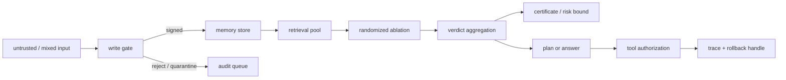
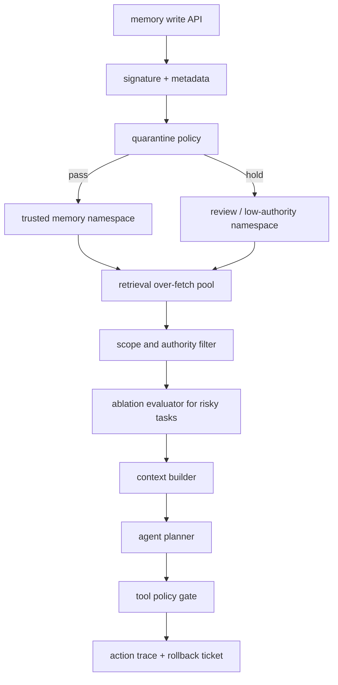

## 来源说明

本文基于 2026-06-15 的每日深度技术研究发布流程写成。今天最值得处理的不是单个攻击技巧，而是一组新材料共同指向的工程变化：长期记忆安全正在从“发现 memory poisoning”进入“证明系统在什么假设下能抗住 memory poisoning”。

核心来源包括：

- Tarun Sharma: [SMSR: Certified Defence Against Runtime Memory Poisoning in Persistent LLM Agent Systems](https://arxiv.org/abs/2606.12703), arXiv:2606.12703v1, 2026-06-10；配套仓库 [tarun-ks/smsr](https://github.com/tarun-ks/smsr) 提供参考实现、15 个企业场景、实验驱动和 `smsr_certificate.py` 证书复算脚本。
- Zehao Lin, Xixuan Hao 等: [A Survey on Long-Term Memory Security in LLM Agents: Attacks, Defenses, and Governance Across the Memory Lifecycle](https://arxiv.org/abs/2604.16548), arXiv:2604.16548v2, 2026-06-11；提出 Write、Store、Retrieve、Execute、Share & Propagate、Forget & Rollback 的生命周期框架，并把治理原语收敛到写入授权、来源可见、主体隔离检索、可回滚和可验证遗忘。
- Yv Zhang, Hao Sun 等: [MemVenom: Triggered Poisoning of Multimodal Memories in Web Agents](https://arxiv.org/abs/2606.10742), arXiv:2606.10742v1, 2026-06-09；把记忆投毒扩展到网页 Agent 的图结构、多模态外部记忆和触发式召回。
- Ahmad Al-Tawaha 等: [Remembering More, Risking More: Longitudinal Safety Risks in Memory-Equipped LLM Agents](https://arxiv.org/abs/2605.17830), arXiv:2605.17830, 作为跨任务、随时间累积的记忆安全评测背景。
- Zhong 等: [From Storage to Steering: Memory Control Flow Attacks on LLM Agents](https://arxiv.org/abs/2603.15125), arXiv:2603.15125v3, 作为“记忆影响工具选择和控制流”的背景来源。

这篇文章和本站 2026-06-08 的 MPBench 文章、2026-06-11 的 MemGate 文章相邻，但不重复。MPBench 讨论“哪些路径能把不可信输入写进长期记忆”；MemGate 讨论“语义相似的记忆是否有资格进入当前上下文”。本文回答第三个问题：如果团队声称部署了 memory poisoning 防御，怎样判断它的安全保证是否真实、边界是否清楚、实验是否可复算。

稳定 slug：`2026-06-15-runtime-memory-poisoning-certified-defense`。

## 先给结论

长期记忆安全的防御中心正在从“过滤可疑文本”转向“治理可变状态”。

SMSR 的价值不只是提出 HMAC provenance tagging 和 randomized memory ablation，而是把一个容易被营销化的问题拉回了可验证工程：没有写路径来源边界，检索时再聪明的过滤器都很难给出证书；有了来源边界，仍要处理已认证写入里的污染、未来召回里的多数投票偏差、证书参数和运行成本。

我的工程判断是：生产 Agent 记忆系统不应该把“有 prompt injection filter”“有 memory reranker”或“有 LLM judge”当成安全完成态。最低可接受形态应该是一条可审计的闭环：



这条链路里，证书只覆盖明确假设下的风险，不覆盖所有安全问题。它不能替代租户隔离、工具权限、人工确认、记忆删除和事故复盘。但它给工程团队一个更硬的验收标准：不要只问“模型觉得这条记忆安全吗”，要问“污染预算是多少、抽样参数是多少、证书如何复算、哪些写入路径没被签名、哪些已签名污染仍可能影响工具调用”。

## 技术问题：运行时记忆投毒不是静态 RAG 投毒

静态 RAG 的知识库通常由离线流程构建，防御可以围绕语料清洗、文档来源、索引构建和检索排序展开。长期记忆 Agent 的状态不同：记忆来自交互流，用户、网页、邮件、工具输出、模型摘要、其他 Agent 和自动压缩都可能写入持久状态。

这导致运行时记忆投毒有三个更难的性质。

第一，写入面在线。攻击或错误内容不需要进入离线知识库，只要能通过正常交互影响 Agent 的“学习”路径，就可能成为未来记忆。SMSR 把这种跨会话场景称为 Multi-Session Memory Poisoning：内容先写入，未来相关查询再触发。

第二，来源会被漂白。原始输入可能来自低权威网页、未确认聊天或工具输出，但经过摘要、抽取、结构化和向量化后，下次被检索回来时更像系统自己的状态。长期记忆安全综述的关键判断是，LTM 风险不能只在 retrieve 或 execute 阶段补救，必须从存储时来源、版本和保留策略开始设计。

第三，行为影响不只体现在答案文本。Memory Control Flow 的相关工作已经说明，记忆可以改变工具选择和调用顺序；MemVenom 则把风险扩展到多模态网页 Agent，攻击面不再只是文本 memory，而是截图、OCR、图结构和触发式召回共同组成的外部记忆。

所以，“检索过滤器能不能识别坏内容”只是子问题。真正的问题是：一个不断写入、压缩、召回和执行的状态系统，能否证明低权威状态不会跨过边界变成高影响行动理由。

## 机制拆解：SMSR 给了两个分层控制点

SMSR 的设计可以抽象为两个组件。

第一层是写入时来源签名。系统只接受通过可信写路径产生的 memory，并用 HMAC-SHA256 这类机制给条目绑定来源证明。这样可以阻断直接篡改 memory store、绕过应用层写入 API 或把未签名内容塞进检索池的攻击路径。

第二层是查询时随机化记忆消融。即使污染内容通过了认证写路径，例如 Agent 自己在对话中被诱导后写入了错误记忆，系统也不把完整 top-k 检索结果一次性喂给模型，而是从候选池多次随机抽样，分别运行 Agent 或判定器，再用 verdict-based aggregation 聚合结果。论文强调，不应只做字符串多数投票，因为攻击者可以生成更一致的恶意表述，让文本一致性压过数量劣势；按“正确 / 恶意 / 其他”等 verdict 聚合，才更接近安全目标。

这两个组件分别处理不同威胁：

| 控制点 | 主要防什么 | 防不了什么 | 工程验收方式 |
| --- | --- | --- | --- |
| 写入签名 | 绕过应用层的未授权 memory 注入 | 被可信 Agent 自己写入的污染 | 枚举所有写入路径，验证 store 不能被旁路写入 |
| 来源元数据 | 来源漂白、权威混淆、跨主体记忆复用 | 来源可信但内容错误 | 每条 memory 保留 origin、authority、lineage、policyVersion |
| 随机化消融 | 少量已认证污染在检索池里的影响 | 大规模污染、检索池高度同质、模型 judge 失真 | 复算污染预算下的 bound，并做 end-to-end 回归 |
| verdict 聚合 | 字符串一致性诱导的多数投票偏差 | verdict schema 设计错误、judge 偏置 | 固定判定 rubric，抽样人工复核边界样本 |
| 工具授权绑定 | 记忆影响高风险工具调用 | 无审计的外部执行系统 | 记录哪些 memory 支撑了工具计划，低权威依赖触发确认 |

这里最容易误读的是“认证”。签名不是说内容真实，而是说内容确实来自某条受控写路径。它提供的是完整性和来源边界，不是真值保证。生产系统如果把“signed memory”当成“trusted fact”，仍然会被已认证的错误摘要、过期偏好或被诱导写入的经验污染。

## 为什么不能只靠检索时过滤

SMSR 论文提出的一个核心主张是：没有来源边界的 retrieval-time filter 很难给出非平凡安全证书。这个结论对工程团队很重要，因为很多系统的默认防线正是“检索回来后让模型判断一下是否恶意”。

检索时过滤有三类结构性问题。

第一，它只能看到当前候选，未必知道写入历史。一个看似普通的企业规则、用户偏好或项目经验，如果没有 sourceRef、writer、transformation lineage 和确认记录，过滤器很难判断它是否来自低权威输入。

第二，它面对的是经过系统改写后的文本。攻击痕迹可能在抽取和摘要过程中消失，但行为偏置仍然保留。此时过滤器看到的是“干净的错误规则”，不是原始注入。

第三，它缺少污染预算。没有签名、隔离和写入审计，系统不知道候选池里最多可能有多少污染条目，也就无法把随机化抽样转化为可复算的风险边界。

这不是说检索过滤没用。它仍然可以降低风险，尤其适合做内容分类、PII 检测、跨项目作用域检查和低权威降权。但它不应该被包装成“已认证防御”。证书需要明确假设，而假设必须落在系统结构上：谁能写、写到哪里、写后是否能旁路、检索池大小是多少、污染预算怎么估计、聚合器如何判定成功。

## 多模态记忆让写路径治理更紧迫

MemVenom 的意义在于提醒我们：Agent 记忆正在从文本片段变成多模态、图结构、环境经验和网页观察的混合状态。网页 Agent 会保存截图、OCR 文本、页面元素、任务轨迹、经验节点和链接关系。攻击或错误信息不一定以显式文本指令出现，而可能通过视觉触发、OCR 优先级、图节点连接和后续页面观察激活。

这会削弱两种常见防御假设。

第一，“只检查 memory text 就够了”不再成立。多模态 memory 的风险可能存在于图结构、图片扰动、OCR 结果、节点边和检索 embedding 位置里。文本审计只能覆盖其中一层。

第二，“只要当前网页没问题就安全”也不成立。外部记忆让网页 Agent 拥有跨任务状态，过去页面观察可以在未来任务中被召回。触发条件和恶意目标可以分离，当前页面只是激活器。

因此，多模态 Agent 更需要把 memory record 设计成可治理对象，而不是把截图和文本摘要直接丢进同一个向量库。

```ts
type GovernedMemory = {
  id: string;
  principal: {
    userId: string;
    workspaceId?: string;
    agentId: string;
  };
  source: {
    origin: "chat" | "web" | "email" | "tool" | "screenshot" | "ocr" | "agent_summary";
    authority: "system_policy" | "user_confirmed" | "tool_verified" | "external_untrusted" | "model_inferred";
    sourceRef: string;
    signedBy?: string;
    observedAt: string;
  };
  content: {
    modality: "text" | "image" | "ocr" | "graph_node" | "trajectory" | "procedure";
    kind: "fact" | "preference" | "rule" | "event" | "tool_experience";
    text?: string;
    blobRef?: string;
    graphRefs?: string[];
  };
  governance: {
    taint: "none" | "low" | "medium" | "high";
    expiresAt?: string;
    revoked: boolean;
    policyVersion: string;
    lineageRefs: string[];
  };
};
```

这个模型不是为了增加字段，而是为了让后续策略有可用输入。没有 `origin`，就无法区分网页观察和用户确认；没有 `authority`，就无法决定是否允许影响工具；没有 `lineageRefs`，就无法在事故后追溯摘要和 OCR 从哪里来；没有 `revoked` 和 `expiresAt`，就无法实现可验证遗忘。

## 工程落地方案：把证书当成验收件，而不是论文术语

如果我要在生产 Agent 中落地这类防御，我会分四个阶段做。

第一阶段，冻结写路径资产清单。列出所有会改变长期状态的路径：显式记忆工具、会话压缩、用户画像抽取、网页观察缓存、工具结果摘要、技能生成、检索索引更新、Agent 间共享记忆、人工导入、后台迁移脚本。每条路径都要标注调用身份、写入 store、默认权限、是否签名、是否保留 lineage。

第二阶段，给高风险 store 加写入门。不是马上阻断所有自动记忆，而是先要求所有进入高影响检索池的条目必须通过受控 API，并生成来源签名、authority、scope 和 policyVersion。直接数据库写入、批处理脚本和调试入口要么禁用，要么只能写入隔离区。

第三阶段，在读路径增加随机化评测模式。生产请求未必一开始就启用多次抽样，因为延迟和成本会增加。但至少应该在 CI、预发布和高风险场景里运行 ablation regression：固定污染预算、候选池大小、抽样次数、判定 rubric，记录 defended ASR、utility、latency 和 judge disagreement。

第四阶段，把工具调用和 memory trace 绑定。任何外发、写库、发消息、运行命令、改权限、部署或付款类工具调用，都要记录“本次计划依赖了哪些 memory”。如果关键理由来自 `external_untrusted`、`model_inferred`、已过期或未确认记忆，就触发降级、引用要求或人工确认。

最小上线架构可以这样拆：



注意这里有两个 namespace：可信 namespace 不代表内容为真，只代表写入路径受控；低权威 namespace 仍可用于研究、摘要和引用，但不能直接成为高风险工具的行动依据。

## 可验证指标

我会把验收指标分成六类。

写路径覆盖率：所有长期状态写入入口中，经过受控写入 API、签名和 metadata schema 的比例。目标不是“主路径覆盖”，而是后台任务、迁移脚本、调试入口和 Agent 间同步也覆盖。

未签名召回率：检索候选池里没有有效签名、缺少来源或 lineage 断裂的条目比例。高风险任务中这个指标应接近 0。

认证污染压制率：在受控测试集中，让污染通过可信写路径进入 memory store，测量 defended ASR 相对 undefended baseline 的下降，并报告置信区间，而不是只报单次成功率。

证书复算一致性：用独立脚本复算给定 `m`、`k`、抽样次数、污染预算 `t` 下的 bound，并和论文或内部报告一致。SMSR 仓库提供的 `smsr_certificate.py` 值得作为“证书需要可复算”的工程范式参考。

效用损失：开启签名校验、来源过滤、随机化消融和工具确认后，正常任务成功率、延迟、token 成本和用户确认次数的变化。没有效用指标的安全方案很难上线。

可恢复性：撤销一条污染记忆后，原始 store、向量索引、摘要、图节点、OCR 缓存、技能和 checkpoint 中相关状态全部失效所需时间。长期记忆安全综述把 Forget & Rollback 放进生命周期，是因为删除失败会让“修复”只停留在 UI 层。

## 我会如何实现和验证

我会先做一个一周内可验证的实验，而不是直接承诺“全面防御 memory poisoning”。

第一天，列出 memory write inventory，并在代码里给所有写入入口加 audit log。每条日志至少包括 writer、origin、authority、store、scope、transformation 和 request id。

第二天，实现签名字段和校验中间件。所有高权威 memory namespace 只接受受控 API 写入；批处理和导入脚本必须显式声明 authority，默认进入低权威 namespace。

第三天，构造 20 到 50 个合成企业场景，覆盖政策问答、工具选择、网页摘要、用户偏好和项目经验。样本只在本地沙箱运行，不包含第三方目标或真实攻击操作。

第四天，实现 ablation harness。对每个目标 query，从 over-fetch pool 中多次抽样，运行 Agent 或 judge，输出 verdict 分布、ASR、utility 和 latency。先用于 CI 和预发布，不直接进入所有线上请求。

第五天，把 memory trace 接到工具授权。工具调用前输出 `supportingMemoryIds` 和 `memoryAuthoritySummary`；低权威记忆支撑高风险动作时强制人工确认。

第六天，做撤销演练。把一条已触发污染标记为 revoked，验证它不会从向量索引、摘要、图节点、技能或缓存中残留召回。

第七天，复盘指标：写路径覆盖率是否达到 100%，未签名召回是否为 0，defended ASR 是否显著下降，正常任务效用损失是否可接受，人工确认是否集中在真正高风险动作上。

这套实验的成功标准不是“所有攻击都失败”，而是团队能明确说出：当前防御覆盖哪些写路径，在什么污染预算下有效，哪些场景仍需人工确认，哪些 store 还没有可验证删除。

## 适用场景

第一类是企业知识库 Agent。它们会把文档、工单、会议纪要、邮件和聊天摘要转成长期记忆，又可能回答政策、生成合同、更新 CRM 或触发工作流。这里最需要区分系统政策、用户确认、外部材料和模型推断。

第二类是网页操作 Agent。MemVenom 说明，多模态外部记忆会让截图、OCR 和图节点成为持久攻击面。网页 Agent 如果能点击、填写表单或跨站执行任务，记忆来源和工具授权必须绑定。

第三类是研发 Agent。它们会保存项目构建习惯、修复经验、依赖风险和部署流程。低权威 issue、README、网页搜索结果或工具日志不应该直接沉淀成高权威 procedure。

第四类是个人助理。长期偏好、联系人、日程、财务和健康相关记忆更需要主体隔离、过期策略、撤销传播和显式确认。

第五类是多 Agent 团队。一个 Agent 的摘要会成为另一个 Agent 的输入或长期状态，共享记忆池必须区分 writer identity、目标 namespace 和传播路径，否则污染半径会快速扩大。

## 失败模式

第一，签名旁路。主应用写入会签名，但后台导入、数据库迁移、调试脚本或第三方同步可以直接写 store。

第二，认证误读。团队把 signed memory 当成 trusted fact，忽略“签名只证明来源路径，不证明内容真实”。

第三，污染预算失真。证书假设候选池里最多有少量污染条目，但实际系统允许同一来源批量写入高度相似的污染记忆。

第四，judge 漂移。verdict aggregator 依赖的判定模型随版本变化，导致历史证书和当前行为不一致。

第五，多模态盲区。文本 memory 被治理了，但 OCR、截图、图节点、trajectory 和 skill store 没有同等来源控制。

第六，工具层断链。记忆检索做了防御，但工具调用不知道计划依赖了哪些 memory，因此无法根据低权威记忆触发确认。

第七，删除不完整。用户或管理员撤销了可见 memory，但向量索引、摘要、缓存、图节点或 agent skill 仍然保留语义残留。

第八，成本不可接受。随机化消融需要多次 Agent 或 judge 调用，如果没有按风险分层启用，会拖慢低风险普通任务。

## 局限分析

本文依赖的核心材料仍以预印本和参考实现为主。SMSR 报告的 ASR 降低、企业场景数量、抽样参数和成本估计需要在具体产品、模型、检索器、判定器和 memory schema 上重新验证，不能直接外推为通用安全保证。

证书的价值来自明确假设。只要实际系统的写路径、候选池构造、污染预算、抽样策略或 verdict 定义偏离论文设置，就必须重新复算和重测。工程上最危险的做法，是引用“certified defense”这个词，却没有把证书参数放进 CI 和发布验收。

MemVenom 说明多模态记忆扩大了攻击面，但不同网页 Agent 的 memory representation 差异很大。截图、OCR、DOM、accessibility tree、trajectory 和 graph memory 的风险分布不同，本文的治理模型只给出通用结构，不替代具体实现审计。

此外，强记忆治理会带来产品代价：自动学习变慢、用户确认增加、存储和审计成本上升、低风险任务延迟变高。合理策略不是全局启用最重防御，而是按来源权威、工具副作用和数据敏感度分层。

## 自审

事实可靠性：SMSR 的日期、两个组件、MSMP 威胁、配套 GitHub 仓库和实验方向来自 arXiv 页面与仓库 README；长期记忆安全生命周期和治理原语来自 arXiv:2604.16548v2；MemVenom 的多模态图结构记忆和触发式投毒来自 arXiv:2606.10742v1。本文没有把论文报告结果写成独立复现结果。

来源完整性：核心判断依赖原始论文和源码仓库，不以新闻、社区帖或二手摘要作为主要证据。

是否只是复述：本文没有逐段概括 SMSR，而是把它放进写路径治理、检索随机化、证书复算、工具授权和回滚验收链里，形成工程判断。

标题党检查：标题没有声称 SMSR 已解决所有记忆安全问题，只强调证书必须绑定写路径，符合材料边界。

薄内容检查：正文包含机制图、对比表、数据模型、工程落地方案、可验证指标、一周实验计划、失败模式和局限分析。

猜测边界：生产落地架构、指标和一周实验计划属于本文工程建议；论文实验结果、日期、组件和生命周期框架作为事实陈述。

站内重复：本文区别于 MPBench 的写入面地图和 MemGate 的检索准入门，重点放在“可认证防御如何被工程验收”。
