## 来源说明

本文基于 2026-06-16 的每日深度技术研究发布流程写成。今天最值得处理的不是某个单点 Agent 产品，而是 Microsoft Work IQ API 到达 GA 这一类“企业上下文层”开始从发布叙事进入可计费、可治理、可接入阶段。

核心来源如下：

- Microsoft 365 Blog: [Announcing the new Work IQ APIs](https://www.microsoft.com/en-us/microsoft-365/blog/2026/06/02/announcing-the-new-work-iq-apis/)。该文说明 Work IQ API 包含 Chat、Context、Tools、Workspaces 四个域，并称 API 在 2026-06-16 GA；Context 返回 agent-ready context，Tools 用简单动词和 resource paths 暴露 Microsoft 365 操作，Workspaces 用于长期 Agent 的中间状态、文件、memory、progress 和输出。
- Microsoft Licensing: [Work IQ GA June 16, 2026](https://www.microsoft.com/en-us/licensing/news/work-iq-general-availability)。该页说明 Work IQ API 在 2026-06-16 达到 GA，使用 Copilot Credits 消费计费，Tools API 有静态调用费用，Chat/Context 按场景复杂度变动。
- Microsoft Learn: [Work IQ API overview](https://learn.microsoft.com/en-us/microsoft-365/copilot/extensibility/work-iq/api-overview)。该页当前标题仍标注 preview，但提供了协议和开发形态：A2A、Local MCP、Remote MCP、REST，能力覆盖邮件、会议、OneDrive/SharePoint 文档、Teams 消息、人员与组织上下文、企业搜索结果，并强调 permission-trimmed 和 policy-enforced。
- Microsoft Learn: [Microsoft 365 Copilot Retrieval API overview](https://learn.microsoft.com/en-us/microsoft-365/copilot/extensibility/api/ai-services/retrieval/overview)。该页说明 Retrieval API 可以在不复制、索引、分块和另建安全管线的情况下，从 SharePoint、OneDrive 和 Copilot connectors 返回相关文本片段，并保留 Microsoft 365 权限和治理控制。
- Microsoft Learn: [Microsoft Agent 365 overview](https://learn.microsoft.com/en-us/microsoft-agent-365/overview)。该页把 Agent 365 定义为通过 registry、Entra、Purview 等集中管理 Agent 生命周期、访问控制、合规和审查的控制平面。
- Microsoft Learn: [Agentic Workflows: Task Adherence](https://learn.microsoft.com/en-us/azure/foundry/guardrails/task-adherence)。该页给出一个防错信号：当 Agent 工具调用与用户意图不一致时，系统可以阻断或升级到人工审核。
- OpenAI: [Introducing workspace agents in ChatGPT](https://openai.com/index/introducing-workspace-agents-in-chatgpt/)。该文把 shared agents 描述为可以跨工具和团队运行长流程、请求审批、保留 memory、在 Slack 等工作表面协作，并提供软件审查、反馈路由、周报、销售跟进、第三方风险等模板场景。
- GitHub Blog: [Improving token efficiency in GitHub Agentic Workflows](https://github.blog/ai-and-ml/github-copilot/improving-token-efficiency-in-github-agentic-workflows/)。该文提供了一个可复盘实践：GitHub 为 agentic workflows 输出 `token-usage.jsonl`，按输入、输出、cache read/write、模型、provider 和时间戳记录消耗；还用 Daily Token Usage Auditor 与 Daily Token Optimizer 找出未使用 MCP tools、可前置下载的数据和可替换为 CLI 的工具调用。

我不会把这些材料写成“企业知识库已经自动完成 AI Native 转型”。更稳妥的判断是：企业 Agent 的关键工程问题正在从“怎样把数据塞进 prompt”变成“怎样把组织上下文、工具动作、持久工作区、权限治理、成本账本和人工审核放进同一条工作流”。

稳定 slug：`2026-06-16-work-iq-enterprise-agent-context-workflow`。

## 先给结论

企业 AI Native 工作流的瓶颈通常不是模型不会写总结，而是 Agent 没有一个可信、可审计、可控成本的上下文层。

Work IQ 的信号在这里：它不是单纯的 RAG API，而是把 Chat、Context、Tools、Workspaces 放进同一套 Agent 接口，并试图让 Agent 在 Microsoft 365 租户边界内读取上下文、发现工具 schema、执行动作、保存中间状态。Agent 365、Retrieval API、Task Adherence 和 Workspace Agents 这类材料共同说明一个方向：生产 Agent 应该围绕工作流建，而不是围绕聊天框建。

我建议把企业 Agent 上线的第一批场景限制在“高信息整合、低不可逆副作用、强人工审核”的工作里，例如产品反馈周报、客户访谈主题归纳、研发周报、运营异常复盘、内部政策问答和安全告警证据包。不要一开始就让 Agent 自动改合同、发客户邮件、批预算或改生产配置。

一个可落地的目标形态如下：

```mermaid
flowchart LR
  A["human request<br/>scope + rubric"] --> B["intake agent"]
  B --> C["context broker<br/>Work IQ / Retrieval API"]
  C --> D["evidence workspace<br/>sources + extracts + state"]
  D --> E["analysis agent<br/>themes / conflicts / actions"]
  E --> F["quality gate<br/>citations / policy / task adherence"]
  F --> G["human review<br/>approve / edit / reject"]
  G --> H["action agent<br/>ticket / report / message draft"]
  H --> I["ledger<br/>cost / quality / corrections"]
```



核心不是“AI 自动生成周报”，而是把原来散落在人、会议、聊天、邮件、文档和工单里的状态，变成有来源、有权限、有审核点、有成本账本的可复用流程。

## 场景定义：产品反馈与路线图影响周报

我用一个具体场景展开：产品团队每周需要把客户访谈、销售反馈、支持工单、Teams/Slack 讨论、路线图文档和上周行动项整合成一份产品反馈与路线图影响周报。

这类工作适合 AI Native 改造，因为它有三个特点。

第一，信息源多且分散。事实可能在会议纪要、客户邮件、CRM 备注、支持工单、产品路线图、设计文档和聊天线程里。

第二，产物结构稳定。每周都要输出主题、证据、影响范围、优先级、建议动作、负责人和未确认问题。

第三，风险可以分层。Agent 可以先做检索、归纳、草稿和票据草案，但最终路线图变更、客户外发、优先级承诺必须由人审批。

这比“让 Agent 自主运营产品团队”更现实，也更适合一周内验证 ROI。

## 原流程痛点

传统流程通常是这样：

1. PM 或运营同事手工翻会议纪要、聊天记录、工单系统和文档。
2. 把相关反馈复制到一个文档或表格里。
3. 靠人工经验合并相似问题，判断哪些是重复噪声，哪些代表真实趋势。
4. 找研发、销售或支持确认上下文。
5. 写周报、开会讨论，再把结论拆成 issue、PRD 更新或客户跟进。

这里最浪费时间的不是写作，而是上下文拼接和证据追踪。常见失败包括：漏掉最新文档、引用过期路线图、把一个大客户的意见误当作普遍需求、无法解释某个优先级来自哪些证据、周报结论和实际工单状态不同步。

## 目标工作流

AI Native 后，流程应拆成状态机，而不是一个大 prompt。

| 阶段 | Agent / 工具 | 输入 | 输出 | 人工审核点 |
| --- | --- | --- | --- | --- |
| 任务定义 | Intake Agent | 周报周期、产品线、客户分层、排除范围、评分 rubric | `run.yaml` 与查询计划 | PM 确认范围 |
| 上下文收集 | Work IQ Context / Retrieval API / connectors | Teams、邮件、会议、SharePoint、工单、CRM 摘要 | 带来源的 evidence bundle | 高敏来源需确认 |
| 证据整理 | Evidence Agent | 原始片段、元数据、时间、来源权限 | 主题候选、冲突列表、待确认问题 | 抽样查证 |
| 分析归纳 | Analysis Agent | 主题候选、路线图、历史行动项 | 周报草稿、优先级建议、行动项草案 | PM/研发负责人复核 |
| 风险控制 | Policy Gate / Task Adherence | 草稿、工具调用计划、外发动作 | 阻断、升级或允许 | 外发、改票、改路线图必须审批 |
| 发布与回写 | Action Agent | 审批后的结论 | 周报、issue、PRD diff、负责人提醒 | 只执行已批准动作 |
| 复盘 | Auditor Agent | 运行日志、token、审批、纠正 | 成本账本、质量报告、失败样本 | 周度流程改进 |

这个表里最重要的是职责边界：Context Agent 只取证据，Analysis Agent 只提出判断，Action Agent 只能执行审批后的动作，Auditor Agent 不能修改业务产物。

## Agent 与工具分工

我会按五个角色实现第一版，而不是让一个全能 Agent 从头跑到尾。

**Intake Agent** 负责把人的请求变成可执行范围。它必须产出结构化任务文件，例如：

```yaml
workflow: product-feedback-weekly
period:
  from: 2026-06-09
  to: 2026-06-16
scope:
  product_area: "enterprise search"
  customer_segments: ["enterprise", "regulated-industry"]
  exclude: ["sales pricing negotiation", "uncommitted roadmap rumors"]
sources:
  include: ["meetings", "teams", "sharepoint", "support tickets", "crm summaries"]
quality_bar:
  min_sources_per_theme: 2
  require_citation: true
  require_owner_for_action: true
approval:
  external_message: "manual"
  roadmap_change: "manual"
  ticket_creation: "manual-before-create"
```

**Context Broker** 负责调用 Work IQ Context、Retrieval API 或现有企业搜索，不直接写结论。它的输出必须是 evidence bundle，而不是自然语言答案。

**Evidence Agent** 负责去重、聚类、标注时间和来源，把片段分成 `confirmed fact`、`customer claim`、`internal interpretation`、`open question`。如果来源不足两条，不能升级成主题结论。

**Analysis Agent** 负责写周报草稿和行动建议。它必须引用 evidence id，而不是只写“用户反馈显示”。

**Review / Action Agent** 负责把审批后的内容转成 issue、PRD 更新、周报页面或消息草稿。它不能在没有审批的情况下发送外部邮件、更新路线图承诺或关闭客户问题。

## 数据与权限边界

企业 Agent 的上下文层不能绕过现有权限。Work IQ 和 Retrieval API 的工程意义之一，就是把检索尽量留在 Microsoft 365 trust boundary 内，保留权限裁剪和治理控制。即使不用 Microsoft 栈，也应复刻这个原则。

我会把权限分成四层。

第一层是读取范围。Agent 只能读取本次 workflow 声明的 sources；跨客户、跨产品线、跨地域的数据默认不进上下文。

第二层是来源分级。客户邮件、内部路线图、财务数据、安全事件、HR 信息和公开文档不能拥有同一权重。Evidence bundle 需要记录 `source_type`、`sensitivity`、`owner`、`retrieved_at` 和 `allowed_actions`。

第三层是动作权限。创建草稿、创建内部 issue、发 Teams 消息、发客户邮件、修改 PRD、更新路线图是不同风险等级。高风险动作必须进入人工审批。

第四层是回写权限。Agent 的中间总结不能直接写回权威知识库。只有通过审核的结论才可以进入周报目录、PRD、FAQ 或长期记忆。

示例数据结构：

```json
{
  "evidence_id": "ev-20260616-042",
  "source_type": "customer_interview_email",
  "source_url": "m365://mail/thread/...",
  "retrieved_at": "2026-06-16T09:30:00Z",
  "sensitivity": "confidential",
  "permission_scope": "user-delegated",
  "claim": "three enterprise customers asked for admin-level audit export",
  "supporting_entities": ["Customer A", "Customer B", "Customer C"],
  "allowed_actions": ["summarize", "cite-in-internal-report"],
  "blocked_actions": ["external-send", "roadmap-commit"]
}
```

这类结构比“把相关资料都贴给模型”麻烦，但它能让后续审核、删除、追责和复盘成立。

## 可复制 SOP

第一周只做一个产品线、一个固定周报、一个小团队，不做全公司推广。

1. 建立 `workflows/product-feedback-weekly/` 目录，放 `run.yaml`、`rubric.md`、`sources.md`、`approvals.md`、`reports/`、`evidence/` 和 `ledger/`。
2. 让 PM 写清本周问题：产品线、时间范围、客户分层、必须排除的来源、评分规则和最终产物格式。
3. Context Broker 只拉取候选证据，不生成结论。每条证据保存来源链接、时间、权限和敏感级别。
4. Evidence Agent 做聚类，输出最多 10 个主题候选，每个主题至少两个独立来源，否则标记为弱信号。
5. Analysis Agent 生成周报草稿，必须包含主题、证据、影响、建议动作、反证或不确定点。
6. Policy Gate 检查外发、改票、改路线图等动作。没有明确审批就只生成草稿。
7. PM、研发负责人和支持负责人各抽样复核：事实是否可追溯、优先级是否合理、是否漏掉关键反例。
8. Action Agent 只执行审批后的动作，例如创建内部 issue、更新周报页面、生成客户回复草稿。
9. Auditor Agent 生成运行报告：耗时、token、API 调用、人工修改次数、被拒绝建议、错引来源、重复主题。
10. 下周只改一到两个失败点，例如缩窄来源、调整主题合并规则、增加审批门，不要同时重写整条链路。

## 工具栈选择理由

如果企业已经在 Microsoft 365 里，Work IQ / Retrieval API / Agent 365 的吸引力是：上下文、权限、工具和工作区在同一个治理边界内，少维护一套独立向量库和同步管线。代价是平台绑定、消费计费、API 成熟度和地域/合规约束需要单独评估。

如果团队用 ChatGPT workspace agents，适合从“共享 Agent + 审批 + Slack 工作表面”起步，把周报、反馈路由、软件审查这类流程做成可复用模板。代价是复杂企业数据源、细粒度策略和内部系统回写仍需要工程接入。

如果是研发团队，GitHub 的 agentic workflow 经验非常值得复用：所有自动化都输出 token usage artifact，先把确定性数据下载到文件，再让 Agent 分析，少让模型在每一轮携带巨大 MCP schema。这个思路适用于所有企业工作流：能确定性取数的步骤前置，能结构化保存的上下文不要反复塞进 prompt。

## 质量评估

第一版不要用“节省多少人天”做唯一指标。更可靠的是同时看质量、成本和风险。

| 指标 | 计算方式 | 目标 |
| --- | --- | --- |
| Evidence coverage | 周报关键判断中有来源链接的比例 | 90% 以上 |
| Theme precision | 抽样主题中被 PM 认为真实可用的比例 | 80% 以上 |
| Missing critical signal | 人工补充的关键主题数量 | 每周下降 |
| Correction rate | 每 1000 字周报的事实修正次数 | 连续下降 |
| Approval latency | 草稿到批准的时间 | 比原流程缩短 |
| Action acceptance | Agent 提议行动被采纳比例 | 逐周稳定 |
| Rework rate | 发布后因证据错误返工次数 | 接近 0 |
| Cost per accepted report | API/模型/人工审核成本除以采纳报告数 | 可解释且可控 |
| Risk block precision | 被 Policy Gate 阻断动作中真实有风险的比例 | 抽样复核 |
| Stale evidence rate | 引用过期文档或旧状态的比例 | 接近 0 |

GitHub 的实践提醒很重要：只看 token 数会误判。模型换档、缓存命中、任务大小变化都会影响成本。因此我会同时记录 LLM 调用次数、每次输入/输出/cache tokens、工具调用次数、证据数量、人工修改次数和最终采纳率。

## 成本估算

按 Microsoft licensing 页给出的示例，Work IQ Chat/Context 的轻、中、重场景价格区间不同，Tools API 还有静态调用费用。这意味着企业 Agent 不能只做功能验收，还要做 unit economics。

产品反馈周报的成本账本可以这样算：

```text
total_run_cost =
  work_iq_context_calls
  + tool_calls
  + model_generation_cost
  + reviewer_minutes * internal_rate
  + correction_minutes * internal_rate

accepted_report_roi =
  baseline_manual_minutes
  - assisted_manual_minutes
  - correction_minutes
```

如果 Agent 把 4 小时人工整理降到 90 分钟审核，但每周引入 60 分钟事实纠错，它并没有真正成功。第一周的目标应是建立账本，不是追求自动化率。

## 失败与回滚方案

第一类失败是来源漂移。Agent 引用旧路线图、错误客户分层或不该看的文档。回滚方式是冻结本次报告，保留 evidence bundle，修正 source allowlist 和时间过滤，再重新跑 Context Broker。

第二类失败是主题过度合并。不同客户的不同问题被合成一个大主题。回滚方式是把主题拆回 evidence cluster，要求 Analysis Agent 输出反例和差异，不允许直接合并。

第三类失败是行动越权。用户只要求写草稿，Agent 准备发送邮件或改工单。回滚方式是阻断工具调用，把 Task Adherence 或自建 policy gate 放到所有副作用动作之前。

第四类失败是成本失控。MCP tools 太多、上下文太大、重复检索太频繁。回滚方式是按 GitHub 的思路记录每次调用，删除未使用工具 schema，把固定取数前置为脚本或 API 下载文件。

第五类失败是审核疲劳。Agent 产物太多，人没有时间看。回滚方式是降低自动生成数量，只保留 top 5 主题和高置信行动项，把弱信号放进观察清单。

第六类失败是长期记忆污染。未经确认的周报草稿被写入知识库，下周又被当成事实引用。回滚方式是区分 draft workspace、approved workspace 和 canonical docs；未审批内容只能作为候选证据，不能作为权威来源。

## 一周实验计划

第 1 天：选一个产品线，整理过去两周周报作为 baseline，记录人工耗时、输入来源、最终报告结构和常见返工点。

第 2 天：配置 sources allowlist 和 `run.yaml`，只接入 2 到 3 类低风险来源，例如会议纪要、内部文档和支持工单摘要。

第 3 天：跑 Context Broker 和 Evidence Agent，不生成周报，只检查证据是否可追溯、是否越权、是否漏掉明显主题。

第 4 天：生成第一版周报草稿，PM 做逐段审核，记录每个错误属于来源、合并、推断、过期、表达还是优先级问题。

第 5 天：接入 Policy Gate，只允许创建内部 issue 草稿，不允许自动发送消息或修改路线图。

第 6 天：发布一份人工批准后的周报，并保存 ledger：API 调用、token、证据数、审核分钟、采纳行动项、被拒建议。

第 7 天：复盘 ROI。若事实错误多于人工流程、审核时间没有下降或越权风险无法控制，暂停扩展；若证据覆盖和审核效率明显改善，再增加一个数据源或一个自动动作。

## 工程判断

我的判断是：企业 Agent 的第一性问题不是“是否接入企业知识库”，而是“上下文被谁授权、怎样进入工作流、怎样影响动作、怎样被审计、怎样计费、怎样回滚”。

Work IQ 这类平台把很多基础能力产品化了，但不会替团队解决流程设计。团队仍然要定义任务范围、证据标准、审批点、成本账本和失败复盘。没有这些，Agent 只是更快地生成不可追溯的组织文本。

更合理的路线是从一个稳定、可验收、低副作用的工作流开始，把 Agent 当成流程里的角色，而不是独立员工。它可以收集证据、形成草稿、暴露冲突、准备行动项；但优先级承诺、客户外发、权限升级和权威知识库写入，仍应由人或明确策略门批准。

## 适用场景

适合：产品反馈周报、运营异常复盘、研发周报、客户访谈主题归纳、内部知识问答、政策 FAQ 更新、安全告警证据整理、供应商初筛报告。

暂不适合：高金额采购审批、合同承诺、生产变更、HR 处分、客户外发承诺、法律结论、跨租户数据混合分析。

判断标准很简单：如果错误动作不可逆，或者证据来源本身就需要法律/合规解释，第一版只允许 Agent 做证据包和草稿，不允许自动执行。

## 自审

事实可靠性：Work IQ API 的 GA 日期、消费计费、四个域、Context/Tools/Workspaces 定义来自 Microsoft 365 Blog 和 licensing 页；协议形态、支持数据源、permission-trimmed / policy-enforced 来自 Microsoft Learn Work IQ API overview；Retrieval API 的免复制索引、权限保留和 SharePoint/OneDrive/connectors 来源来自 Microsoft Learn；Agent 365 的 registry、Entra、Purview 治理来自 Microsoft Learn；Task Adherence 的阻断/升级语义来自 Azure Foundry 文档；Workspace Agents 的共享 Agent、审批和示例场景来自 OpenAI；token ledger 和 MCP tool 裁剪来自 GitHub Blog。

边界：本文没有实测 Work IQ API，也没有声称 Microsoft 的内部性能数字能直接迁移到任意企业。Learn 文档仍有 preview 标识的部分，只作为当前公开开发形态参考。

原创性：本文不复述发布稿，而是把材料落到一个可执行的产品反馈周报工作流，给出角色分工、目录结构、数据结构、SOP、指标、成本账本和回滚方案。本站此前没有 `ai-native-practice` 分支文章，本文作为该分支的第一篇支柱实践笔记。

工程价值：读者可以在一周内用现有企业搜索、Work IQ / Retrieval API 或替代工具复刻这个流程，并用 evidence coverage、correction rate、approval latency、cost per accepted report 等指标判断是否继续投入。

安全与合规：本文只讨论授权企业数据、租户边界、权限裁剪、审计和人工审批，不建议绕过权限或让 Agent 自动执行高风险动作。
