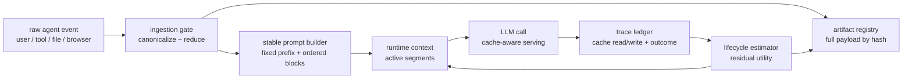

## 来源说明

本文基于 2026-06-17 的每日深度技术研究发布流程写成。今天筛选到几条强信号：`FragFuse` 把长期记忆与访问控制绕过联系起来，`T-Mem` 讨论写入时为未来关联召回生成 triggers，`ToolMenuBench` 把工具菜单过滤变成可评测对象，`TokenPilot` 则直接切中长程 Agent 的运行成本问题。

我选择写 `TokenPilot`，原因是它补上了本站已有 context compression 文章中还不够明确的一层：压缩上下文不等于降低真实推理成本。如果压缩、裁剪、分页不断改变 prompt 的物理布局，系统可能节省了表面 token，却丢掉 prompt/KV cache 命中，最后总成本和延迟反而更差。

核心来源如下：

- Buqiang Xu 等: [TokenPilot: Cache-Efficient Context Management for LLM Agents](https://arxiv.org/abs/2606.17016), arXiv:2606.17016, v1 submitted on 2026-06-15。论文提出 dual-granularity context management：全局的 Ingestion-Aware Compaction 与局部的 Lifecycle-Aware Eviction，并报告在 PinchBench 和 Claw-Eval 上降低 56%-87% 成本，同时保持有竞争力的任务表现。
- arXiv HTML: [TokenPilot full text](https://arxiv.org/html/2606.17016)。我主要参考其中对 prefix stabilization、observation reduction、artifact registry、residual utility 和 batch-turn eviction 的机制描述。
- Hugging Face Papers: [TokenPilot paper page](https://huggingface.co/papers/2606.17016)。该页记录论文在 Hugging Face 上的发布与社区摘要，并指向 LightMem2 集成信息。
- GitHub Blog: [Improving token efficiency in GitHub Agentic Workflows](https://github.blog/ai-and-ml/github-copilot/improving-token-efficiency-in-github-agentic-workflows/)。该文提供生产侧可复盘做法：输出 `token-usage.jsonl`，记录 input、output、cache read/write、model、provider 和 timestamp，并用日常 auditor/optimizer 找出昂贵 workflow。
- Noppanat Wadlom 等: [Efficient LLM Serving for Agentic Workflows: A Data Systems Perspective](https://arxiv.org/html/2603.16104v1)。Helium 把 agentic workflows 视为 query plan，把 LLM invocation 当成 first-class operator，强调 workflow-aware caching 和 cache-aware scheduling。

事实边界：TokenPilot 的实验结果、模块名称和核心机制来自论文；本文的生产架构、数据模型、上线 SOP、指标和安全边界是我的工程推断与落地建议，不是作者报告结果。

稳定 slug：`2026-06-17-tokenpilot-cache-aware-context-management`。

## 先给结论

长程 Agent 的上下文管理不能只优化“本轮 prompt 有多短”，还要优化“连续多轮调用中哪些前缀可以稳定复用”。

很多压缩系统的默认目标是删除低价值 token、总结旧消息、折叠工具输出或把历史搬到外部记忆。这个方向没有错，但如果每轮都重排消息、改写系统提示、移动工具定义、插入不同长度的环境观察，就会破坏 prompt cache 的前缀连续性。对支持 prompt/KV cache 的推理后端来说，这会把大量本可缓存的前缀变成 full prefill，成本和延迟重新上升。

TokenPilot 的重要性在这里：它把 context compression 从“文本稀疏化问题”改写成“文本稀疏化 + cache alignment 的联合问题”。我的工程判断是，生产 Agent 需要一层 cache-aware context manager，放在模型调用前，统一处理稳定前缀、工具输出压缩、外部 artifact 引用、上下文生命周期和成本账本。

一个可落地形态如下：



这里的关键不是“越短越好”，而是“足够短、足够稳定、可恢复、可审计”。

## 技术问题：上下文压缩为什么会伤害缓存

长程 Agent 的上下文通常由四类材料组成：

1. 稳定系统材料：system prompt、工具说明、项目规则、身份和安全边界。
2. 用户目标和任务状态：当前目标、计划、待办、约束、最近确认的事实。
3. 执行轨迹：模型推理摘要、工具调用、工具结果、文件 diff、测试日志、浏览器观察。
4. 长期状态注入：用户偏好、项目记忆、历史失败、外部知识库检索结果。

传统 context compression 常从第三类材料下手，因为工具结果和执行轨迹最容易膨胀。但真实 Agent 运行中还有一个成本层：推理后端对相同 prompt 前缀的缓存复用。当前缀 byte-identical 或满足 provider 的缓存规则时，重复部分可以低成本读取；当前缀布局被改动时，就需要重新 prefill。

压缩可能破坏缓存的常见方式包括：

| 行为 | 表面收益 | 隐藏代价 |
| --- | --- | --- |
| 每轮重新总结全部历史 | prompt 更短 | 前缀持续变化，cache 命中下降 |
| 将工具定义按相关性动态重排 | 当前工具更靠前 | 稳定系统前缀变成动态区域 |
| 裁剪工具输出但不保留原文引用 | token 减少 | 关键证据丢失后无法恢复 |
| 每次插入不同长度的状态摘要 | 当前状态更完整 | 后续 block 位置抖动 |
| 频繁分页旧轨迹 | 活跃上下文变小 | 每轮结构变化导致缓存失效 |

所以，一个只看 token count 的压缩器会做出错误决策。它可能删除了 20% token，却让 80% 原本可缓存的稳定前缀重新计费。TokenPilot 论文把这个矛盾称为 text sparsity 和 prompt cache continuity 之间的 trade-off。

## 机制拆解：TokenPilot 的两层设计

TokenPilot 的设计可以概括为两层。

第一层是全局的 Ingestion-Aware Compaction。它不等上下文膨胀后再回头压缩，而是在事件进入上下文时就做规范化和降噪。论文描述了两类动作：prefix stabilization 和 observation reduction。

Prefix stabilization 的工程含义是：把会造成位置抖动的运行时变量变成稳定占位符，并把稳定内容放在稳定位置。比如请求 id、临时时间戳、随机路径、动态工具列表、环境噪声都不应该进入可缓存前缀。系统提示、固定工具协议、项目不变量和安全边界应尽量保持 byte-identical。

Observation reduction 的工程含义是：工具输出、浏览器 DOM、测试日志、检索结果这类 open-world environmental feedback 先经过确定性压缩，只把结构化预览放入工作上下文，同时把完整 payload 放入 artifact registry。如果后续执行发现压缩预览不够，再通过恢复工具按 hash 拉回完整内容。

第二层是局部的 Lifecycle-Aware Eviction。它不做每轮激进裁剪，而是跟踪上下文 segment 的 residual utility，也就是这个片段对后续任务是否仍有边际价值。只有当片段的任务价值充分过期时，才按保守的 batch-turn schedule 从活跃上下文移走。

这两层的差异很重要：

| 层级 | 处理时机 | 主要目标 | 不该做什么 |
| --- | --- | --- | --- |
| Ingestion-Aware Compaction | 材料进入上下文时 | 稳定前缀、去除环境噪声、保留恢复路径 | 事后反复重写整个历史 |
| Lifecycle-Aware Eviction | 任务推进过程中 | 判断片段是否仍有残余价值 | 每轮按 token 上限机械删除 |

我的理解是：TokenPilot 不是一个“更聪明的摘要器”，而是一层 runtime harness。它在模型看到上下文之前，先把上下文变成适合长期执行和缓存复用的物理布局。

## 工程判断：上下文应该按 block 编译，而不是拼字符串

要落地 cache-aware context management，第一步不是接入某个压缩模型，而是把 prompt 从字符串拼接改成 block compilation。

每个上下文 block 至少要有这些字段：

```ts
type ContextBlock = {
  id: string;
  kind:
    | "stable_system"
    | "tool_contract"
    | "task_state"
    | "user_message"
    | "tool_observation"
    | "memory_retrieval"
    | "execution_trace"
    | "artifact_preview";
  cachePolicy: "stable_prefix" | "active" | "evictable" | "never_cache";
  authority: "system" | "user" | "tool_verified" | "retrieved" | "model_inferred";
  contentHash: string;
  sourceRefs: string[];
  tokenEstimate: number;
  createdAt: string;
  lastUsedAt?: string;
  residualUtility?: number;
  restoreRef?: string;
};
```

编译器再按稳定顺序生成 prompt：

```ts
const ORDER = [
  "stable_system",
  "tool_contract",
  "task_state",
  "user_message",
  "memory_retrieval",
  "artifact_preview",
  "execution_trace",
  "tool_observation",
] as const;

function compileContext(blocks: ContextBlock[]) {
  return ORDER.flatMap((kind) =>
    blocks
      .filter((block) => block.kind === kind)
      .sort((a, b) => a.id.localeCompare(b.id))
      .map(renderBlock),
  ).join("\n\n");
}
```

这段伪代码的重点不是排序本身，而是原则：稳定块要稳定，动态块要被隔离，低权威材料不能挤进高权威前缀，工具输出要有 hash 和恢复入口。

没有 block 编译层，后续所有优化都会变成脆弱的 prompt 字符串手术。你无法解释哪个 block 破坏了 cache，也无法回答某次错误回答是否来自过期摘要、错误检索、工具输出裁剪，还是系统前缀漂移。

## 工程落地方案

我会把第一版 cache-aware context manager 做成模型调用前的代理层，而不是直接塞进 Agent 业务逻辑。

### 1. 固定前缀契约

把 system prompt、工具协议、输出格式、安全边界和稳定项目规则拆成固定 block。任何运行时变量都放到后面的 active block，不进入 stable prefix。

需要特别检查这些字段：

- 时间戳、随机 id、临时路径。
- 动态排序的工具列表。
- 每轮重写的“当前状态总结”。
- 从外部环境复制来的大段噪声。
- 会话压缩器生成的不同长度摘要。

目标是让同一 workflow 的前缀在多次运行中尽可能稳定。

### 2. 工具输出进入 artifact registry

工具结果不要原样全塞进 prompt。每次工具调用输出都保存成 artifact：

```json
{
  "artifact_id": "art-20260617-041",
  "content_hash": "sha256:...",
  "source": "npm-test-output",
  "full_payload_path": "artifacts/2026-06-17/npm-test-output.log",
  "preview": {
    "exit_code": 1,
    "failed_tests": 3,
    "top_errors": ["TypeError in ContextCompiler", "snapshot mismatch"],
    "token_estimate": 178
  },
  "restore_policy": "tool_call_allowed",
  "retention": "14d"
}
```

prompt 里只放 preview 和 restoreRef。Agent 如果需要完整日志，再调用恢复工具读取原文。这样既减少噪声，又避免“压缩后无法复核”的问题。

### 3. 残余价值评分

不要按时间机械删除上下文。每个 block 维护 residual utility：

| 信号 | 含义 |
| --- | --- |
| 最近是否被引用 | 模型输出、工具参数或人工复核是否使用过 |
| 是否仍阻塞任务 | 当前待办是否依赖该证据 |
| 是否可恢复 | 原文是否在 artifact registry 中 |
| 来源权威 | 用户确认、工具验证、模型推断权重不同 |
| 变更风险 | 删除后是否可能造成不可逆误判 |

低价值且可恢复的工具观察可以移出活跃上下文；高权威任务约束和用户纠正不应被压缩器随意移走。

### 4. 成本账本

借鉴 GitHub agentic workflows 的实践，每次模型调用输出一行 usage 记录：

```json
{
  "run_id": "ctx-20260617-001",
  "step": "analysis-agent-call-04",
  "model": "gpt-5",
  "provider": "openai",
  "input_tokens": 18342,
  "output_tokens": 1220,
  "cache_read_tokens": 14080,
  "cache_write_tokens": 2810,
  "stable_prefix_hash": "sha256:...",
  "context_blocks": 47,
  "artifact_previews": 9,
  "restores": 1,
  "latency_ms": 8200,
  "task_outcome": "accepted_with_minor_edits"
}
```

如果没有 `cache_read_tokens` 和 `stable_prefix_hash`，团队很容易把“token 变少”误判成“成本变低”。

## 适用场景

第一类是 coding agent。它会反复读取仓库结构、测试日志、构建输出和 diff。稳定前缀可以包含代码风格、工具协议和安全规则；测试日志进入 artifact registry；当前失败栈、待改文件和验证计划保留在 active context。

第二类是研究 agent。它会持续处理论文、网页、笔记和证据链。稳定前缀应包含引用规范和事实边界；原始 PDF/网页摘录存 artifact；结论草稿和未验证假设分开管理。

第三类是企业流程 agent。它会跨邮件、会议、文档、工单和内部系统工作。这里 cache-aware context manager 还要和权限边界结合：低权限检索结果不能被提升到稳定系统前缀，高敏 artifact 必须有过期和审计。

第四类是安全分析 agent。它会处理扫描结果、SARIF、日志、代码路径和验证输出。大量证据适合 artifact preview + restore，而不是每轮塞完整报告。高风险结论必须引用可恢复证据。

不适合过度优化的场景也明确：一次性短任务、上下文很小的客服问答、没有 prompt cache 支持的后端、或者尚未建立基础观测的原型系统。先把业务正确性跑通，再做 cache-aware 优化。

## 可验证指标

上线 cache-aware context manager 后，我会至少看这些指标：

| 指标 | 目标 | 解释 |
| --- | --- | --- |
| Stable prefix hash stability | 同类 workflow 多轮稳定 | 判断前缀是否频繁漂移 |
| Cache read ratio | 上升且任务质量不降 | 不能只看 input token 降低 |
| Full prefill regression count | 逐周下降 | 捕捉因布局变化导致的缓存失效 |
| Token reduction vs cost reduction gap | 差距可解释 | token 少但钱没少就是警报 |
| Restore rate | 低但非零 | 说明 preview 通常够用，必要时可恢复 |
| Missing evidence rate | 接近 0 | 压缩不能删掉关键证据 |
| Correction rate | 不上升 | 上下文裁剪不能增加人工纠错 |
| p95 latency | 下降或稳定 | 平均值不够 |
| Stale block injection | 接近 0 | 生命周期估计不能保留过期状态 |
| Cost per accepted artifact | 下降 | 最终按可验收产物算账 |

这些指标要和任务结果绑定。只提高 cache read ratio 没有意义；如果 Agent 因为看不到关键上下文而多次返工，缓存命中再高也是坏优化。

## 我会如何实现和验证

第一周只选一个高频 workflow，例如“自动代码审查 + 测试失败分析”。

第一天，给现有 Agent 调用补日志，不改行为。记录 input/output/cache read/cache write、prompt hash、系统前缀 hash、工具输出大小、任务结果和人工修改量。

第二天，把 prompt 改成 block 编译。先不压缩，只保证固定顺序和稳定前缀，比较 cache read ratio、latency 和输出质量。

第三天，把测试日志、lint 输出、扫描结果改为 artifact preview + restoreRef。抽样验证 Agent 在需要完整证据时能恢复原文。

第四天，引入保守 eviction。只移出低权威、可恢复、最近未使用的工具观察，不动用户目标、系统规则和人工纠正。

第五天，做 A/B 对照：原始上下文管理、只 token 压缩、cache-aware block 编译三组比较。主要看 cost per accepted report、p95 latency、人工纠错和 restore 成功率。

第六天，做失败注入。构造超长日志、重复工具输出、动态工具列表、旧摘要、缺失 artifact、权限不足 artifact，验证系统是恢复、降级还是升级人工审核。

第七天，写复盘。只保留能证明净收益的优化，删除只让 prompt 更复杂但没有降低 artifact-normalized cost 的规则。

## 失败模式

第一，稳定前缀里混入动态变量。只要时间戳、随机路径、临时任务 id 进入 stable prefix，cache 命中就会被悄悄打碎。

第二，压缩器删除证据链。工具输出被总结后没有原文 hash、路径和恢复工具，后续就无法复核。

第三，过度追求 cache hit。为了稳定前缀而保留过期规则、错误状态或越权材料，会把性能优化变成质量和安全问题。

第四，生命周期估计过于激进。Agent 可能在第 12 步才需要第 3 步的证据，过早 eviction 会增加返工。

第五，只记录 provider 账单，不记录任务结果。成本下降但人工修正上升，实际 ROI 可能为负。

第六，多租户边界不清。不同用户、项目、客户的 artifact 或 cache key 混在一起，会制造隐私和权限风险。

第七，把 model-inferred 摘要当成 verified fact。压缩结果必须标注来源权威，否则下游 Agent 会把推断写成事实。

## 局限分析

TokenPilot 的公开结果仍需要在更多真实生产系统中验证。论文报告了 PinchBench 和 Claw-Eval 上的成本下降，但不同 provider 的 cache 计费、前缀匹配规则、工具调用格式和上下文窗口策略都可能不同，迁移时不能直接套用百分比。

第二，cache-aware 优化对高度交互、目标频繁变化的任务更难。稳定前缀越少，收益越依赖 artifact preview 和保守 eviction。

第三，压缩和恢复工具本身也有复杂度。团队需要维护 artifact registry、hash、权限、过期、恢复失败处理和审计日志。对低频 workflow，这套工程可能不划算。

第四，安全边界不能交给缓存层兜底。缓存层只负责上下文物理布局和成本，不应绕过权限过滤、数据脱敏、人工审批和删除传播。

## 自审

事实可靠性：主事实来自 arXiv 原文、Hugging Face Papers 页面、GitHub Blog 和 Helium arXiv 页面；实验数值只引用 TokenPilot 摘要中的 56%-87% 成本下降说法，没有扩展成未经验证的生产结论。

来源完整性：本文列出原始论文、全文页面、社区论文页、生产实践文章和相邻系统论文，关键判断均标明事实与工程推断边界。

是否只是复述摘要：不是。文章重点放在 block compilation、artifact registry、residual utility、usage ledger、上线 SOP 和指标体系，属于面向落地的工程方案。

是否标题党：标题只表达核心工程判断：上下文压缩不能破坏 prompt cache，没有夸大 TokenPilot 已解决所有长程 Agent 成本问题。

站内重复检查：本站已有 context compression、memory cost governance、persistent environment evaluation 等文章；本文新增的是 prompt/KV cache continuity 与上下文物理布局治理，不重复。

工程价值：可以直接转化为一周实验计划、数据模型、日志字段、上线指标和失败注入清单。
