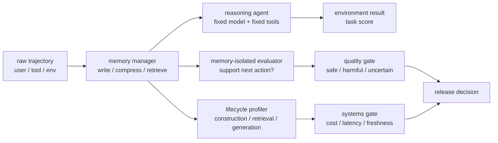

## 来源说明

本文基于 2026-06-18 的每日深度技术研究发布流程写成。今天没有看到一个可以直接改变生产架构的新 memory 算法，但筛选到两个适合合并成支柱文章的强材料：一个从 benchmark 角度讨论怎样隔离 memory 能力，另一个从系统角度讨论 memory 的生命周期成本。

核心来源如下：

- Wujiang Xu 等: [MemGym: a Long-Horizon Memory Environment for LLM Agents](https://arxiv.org/abs/2605.20833), arXiv:2605.20833, submitted on 2026-05-20。论文提出 MemGym，把工具对话、deep-research 检索、代码、Web 导航等场景放到统一 memory-reasoning interface 下，并报告 memory-isolated scores，用来减少推理、检索和工具能力对 memory 策略排名的干扰。
- MemGym GitHub: [WujiangXu/MemGym](https://github.com/WujiangXu/MemGym)。仓库 README 和 `docs/architecture.md` 说明核心 loop 是 `Environment -> Memory Manager -> Agent -> Environment`，memory strategy 可以通过统一接口替换，轨迹会记录 memory action、context 和 reasoning action。
- MemGym Docs: [MemRM](https://github.com/WujiangXu/MemGym/blob/main/docs/memrm.md) 与 [Data Catalog](https://github.com/WujiangXu/MemGym/blob/main/docs/data.md)。文档说明 MemRM 是基于 Qwen3-1.7B 的 QLoRA reward model，用来判断 memory compaction 后的上下文是否仍支持记录下来的下一步动作；同时列出训练集、IID held-out、scenario-OOD、strategy-OOD 的公开状态和 caveat。
- Yasmine Omri 等: [Agent Memory: Characterization and System Implications of Stateful Long-Horizon Workloads](https://arxiv.org/abs/2606.06448), arXiv:2606.06448, submitted on 2026-06-04。论文把 agent memory 系统拆成 construction、retrieval、generation 等阶段，比较十类代表系统，并强调准确率指标会隐藏写入成本、检索延迟、存储足迹、freshness-latency tradeoff 和 query volume amortization。
- 站内已有文章：2026-05-12 的 benchmark hygiene、2026-05-28 的 persistent environment evaluation、2026-06-10 的 cost governance 和 2026-06-17 的 cache-aware context management。本文不重复“要做评测”这个结论，而是把 memory-isolated scoring 与 lifecycle profiling 合成一套可执行评测协议。

事实边界：MemGym 的 track、MemRM 配置、公开数据状态和 memory-reasoning separation 来自论文与仓库；2606.06448 的 taxonomy、phase-aware profiling 和若干 cost/freshness 观察来自论文；本文的评测协议、指标表、数据结构、上线步骤和风险门槛是我的工程建议，不是原作者报告结果。

稳定 slug：`2026-06-18-memory-evaluation-lifecycle-protocol`。

## 先给结论

Agent memory 的评测应该分成两张表：第一张表回答“这个记忆策略是否真的改善了长期任务行为”，第二张表回答“这个改善在生产系统里是否付得起、等得起、审得清”。

只看最终答对率会有三类错觉。

第一，memory 能力和 reasoning 能力混在一起。一个模型可能因为工具调用、代码补丁、Web 操作或基础推理更强而答对，不代表 memory policy 更好。

第二，压缩收益和信息损失混在一起。一个摘要策略可能让 prompt 变短，但删除了后续动作需要的关键事实；如果只看少量成功样本，很容易把“幸运没用到被删信息”当成“压缩可靠”。

第三，用户侧延迟和系统侧成本被拆开。一个 LLM-mediated fact store 可能把 query prompt 做得很短，但在写入阶段反复调用 LLM、embedding 和 graph builder。对于高查询量、低更新量的系统，这可能划算；对于持续流入、稀疏查询的 Agent，可能完全不划算。

我建议把生产级 memory 评测做成下面这个双层协议：



一句话：先隔离 memory 对行为的贡献，再把这个贡献放回生命周期成本里定价。

## 技术问题：为什么普通 benchmark 不够

长期记忆系统通常被包装成“提高长期任务准确率”的模块，但真实 Agent 任务不止是聊天问答。

代码 Agent 的记忆问题可能是：三十轮前测试失败的根因、某个文件的约束、用户已经否定过的修复方向、仓库里隐含的 API 契约。Web Agent 的记忆问题可能是：多页面导航后的状态、表单输入、前面打开过的证据、用户目标和权限边界。Deep research Agent 的记忆问题可能是：多跳查询中哪些事实已经确认、哪些来源只是候选、哪些证据互相冲突。企业工作流 Agent 的记忆问题还包括：任务状态、审批、来源敏感级别、回写权限和人工纠正。

如果评测只问“最后回答是否正确”，至少会丢掉五个关键信息：

| 被隐藏的问题 | 例子 | 为什么危险 |
| --- | --- | --- |
| Memory 是否真的参与了成功 | 模型靠当前 observation 或预训练知识答对 | 会高估 memory 价值 |
| 压缩是否破坏下一步动作 | 摘要删掉失败测试名，但当前样本没触发 | 会低估长期风险 |
| 写入成本是否可摊销 | 每次会话结束后花大量 LLM 调用抽取事实 | 小流量 demo 看不出来 |
| 检索延迟是否拖慢交互 | query 前做多轮规划、图遍历和 rerank | 用户只看到“Agent 慢” |
| 新鲜度是否足够 | 异步写入没完成，下一 session 读到旧状态 | 长期任务会出现时序错误 |

这就是 MemGym 和 2606.06448 放在一起的价值：前者告诉我们怎么把 memory 从 agentic task 里拆出来评；后者告诉我们即使 memory 有效果，也必须按系统生命周期评。

## 机制拆解一：MemGym 的 memory-reasoning separation

MemGym 的核心不是又做了一个 leaderboard，而是把记忆策略做成可替换的运行时组件。

在统一 loop 里，environment 产生 observation，memory manager 决定哪些内容进入 agent 可见上下文，agent 基于过滤后的 context 选择 action，再回到 environment。换句话说，memory manager 管“看见什么、保留什么、压缩什么、恢复什么”，reasoning agent 管“下一步做什么”。

这个拆分有三个工程价值。

第一，memory strategy 可以横向替换。`none`、`passthrough`、rolling summary、structured summary、adaptive token budget、A-MEM、HippoRAG、Mem0、SimpleMem 等策略可以挂到同一组任务上比较，而不是每个系统自带一套不可分离的 prompt、agent 和 benchmark。

第二，轨迹可审计。MemGym 文档里的 trajectory 结构会记录 observation、action、memory_action、context、reasoning_action。这让失败分析不必停在“模型答错了”，而可以追问：是 observation 没进 context，summary 删除了证据，retrieval 没召回，还是 agent 看到了证据仍然推理错。

第三，评测场景更贴近 Agent。MemGym 包含五类 track：SWE-Gym/SWE-bench Lite 代码修复、tau2-bench 工具对话、WebArena-Infinity 浏览器任务、MemGym-DR 多跳 deep-research、MemGym-CodeQA 代码问答。它们不是同一种聊天记忆题换皮，而是覆盖了不同环境反馈、动作空间和证据保留压力。

我的判断是，memory-reasoning separation 应该成为生产 memory 评测的基本接口，而不是学术 benchmark 的实现细节。没有这个接口，团队很难回答“换一个 memory policy 是否真的更好”，因为 agent、tool、prompt、模型、任务都可能同时变了。

## 机制拆解二：MemRM 把压缩质量变成可抽样信号

MemGym 的另一个有用设计是 MemRM。它不是替代完整任务评测，而是给 memory compaction 提供一个更便宜的抽样判定：压缩后的上下文是否仍支持轨迹里记录的下一步动作。

这解决了一个常见工程难题：完整 SWE-bench 或 Web 任务 rollout 很贵，不能每改一个 summary prompt、token budget 或 eviction rule 都跑全量 Docker / browser / tool 环境。但只看摘要长度也没有意义，因为摘要短不代表安全。

MemRM 的输入可以理解为一条 memory compaction event：原始轨迹中的下一步动作是已知的，压缩后的 context 是否保留了支撑该动作的必要信息。文档报告它用 Qwen3-1.7B-Base 加 LoRA/QLoRA 训练，公开 checkpoint 是 `MemGym/memgym-rm-1p7b`，IID held-out 有 3,007 条，训练集有 15,630 条，文档也明确列出 scenario-OOD 和 strategy-OOD 的覆盖限制。

这个 caveat 很重要。MemRM 适合作为 regression signal，不适合作为“生产安全证明”。它能帮助发现某类压缩策略系统性删除了下一步动作需要的信息，但不能证明所有未来任务都安全，也不能替代真实环境 rollout、人工抽样和业务指标。

我会这样使用 MemRM 类信号：

| 用法 | 可以做 | 不应该做 |
| --- | --- | --- |
| 压缩策略回归 | 比较同一轨迹集上两个 memory policy 的 harmful rate | 宣称某策略在所有 Agent 上安全 |
| 成本前筛 | 在全量 rollout 前淘汰明显破坏上下文的策略 | 用 reward model 替代任务完成率 |
| 失败定位 | 找出被删除的关键事实、路径、测试名、来源 | 只看一个 aggregate AUROC |
| 发布门槛 | 设定 harmful event 上限和人工复核抽样 | 忽略 OOD 任务和数据偏差 |

## 机制拆解三：生命周期成本会改变策略排名

2606.06448 的关键提醒是：agent memory 不只是一个 retrieval module，而是一条有写入、存储、检索、生成和维护阶段的 stateful workload。

论文把 memory 系统拆成 ingestion、memory construction、storage、retrieval、prompt assembly、generation、maintenance。这个拆法比“向量库 vs 图数据库 vs 长上下文”更适合工程决策，因为它能解释成本为什么转移。

一个 deterministic BM25 或 embedRAG 系统可能 construction 很便宜，query 阶段也相对简单，但在语义改写、多跳关系、偏好合并和冲突更新上能力有限。一个 LLM-mediated fact store 可能 query 很快，因为历史已被写成 atomic facts，但 construction 阶段要不断抽取、合并、更新和嵌入。一个 agentic memory 系统可能最灵活，但 memory 操作进入 LLM 控制流后，延迟、调用次数和失败面都会变成变量。

所以评测不能只输出：

```text
strategy A accuracy: 62%
strategy B accuracy: 65%
```

至少要输出：

```text
accuracy / memory-isolated score / harmful compaction rate
construction tokens / construction wall time / construction error rate
retrieval latency p50/p95 / generated prompt tokens / cache hit rate
storage footprint / stale-read rate / maintenance backlog
cost per accepted answer / cost per corrected answer
```

如果一个策略把答对率从 62% 提到 65%，但 construction 成本提高 20 倍，且 freshness 在真实 session 到达间隔下不可控，它不一定是更好的生产选择。

## 工程判断：评测协议应该有三道门

我会把 Agent memory 评测分成三道门：能力门、隔离门、系统门。

**能力门** 先确认候选策略在目标任务上有基本收益。这里可以跑真实 task score：代码任务是否通过测试、Web 任务是否完成、research QA 是否答对、工作流产物是否被采纳。能力门的目标是防止团队花时间优化一个本来就不工作的策略。

**隔离门** 再追问收益是否来自 memory。固定 reasoning model、工具集、系统 prompt、任务集和随机种子，只替换 memory manager。记录 memory action、filtered context、retrieved evidence 和下一步 action。对压缩事件做 MemRM 类抽样，或者用人工 rubric 判断关键事实是否被保留。

**系统门** 最后评估部署代价。按 construction、retrieval、generation、maintenance 分阶段记录 token、调用次数、墙钟时间、p95 延迟、存储增长、stale reads、失败重试和人工纠正。没有系统门，memory benchmark 很容易选出一个只适合论文表格、不适合生产负载的策略。

这三道门可以形成一个 release matrix：

| Gate | 必须回答的问题 | 失败时的动作 |
| --- | --- | --- |
| 能力门 | 真实任务表现是否高于 baseline | 暂停上线，回到策略设计 |
| 隔离门 | 成功是否来自 memory，而不是模型或工具差异 | 固定变量，重跑 ablation |
| 系统门 | 成本、延迟、新鲜度和维护是否可接受 | 限制场景、降级策略或异步化 |

## 数据模型：把一次评测记录成可复盘对象

生产系统里，我不会只保存 leaderboard 表格，而会保存每次评测 run 的结构化对象。

```yaml
eval_run:
  id: "memory-eval-2026-06-18-01"
  workload: "coding-agent-long-horizon"
  reasoning_model: "gpt-4.1-mini"
  toolset_version: "tools-2026-06-01"
  memory_strategy: "adaptive-token-budget-v3"
  baseline_strategy: "passthrough-window-64k"
  dataset:
    name: "internal-coding-regression"
    tasks: 120
    split: "frozen"
  gates:
    capability:
      task_success_rate: 0.58
      baseline_success_rate: 0.51
    isolation:
      harmful_compaction_rate: 0.034
      missing_critical_fact_rate: 0.041
      retrieval_support_rate: 0.82
    systems:
      construction_wall_time_p95_ms: 4200
      retrieval_latency_p95_ms: 380
      generation_prompt_tokens_p50: 11800
      stale_read_rate: 0.006
      cost_per_success_usd: 0.84
  decision: "limited-rollout"
```

这个对象的重点不是字段名，而是把可复盘性前置。三个月后如果线上事故出现，团队应该能追溯当时 memory policy 在什么任务、什么模型、什么数据、什么成本假设下被放行。

## 可执行落地方案

我会用四周做一个最小可用的 memory evaluation harness。

第一周只做轨迹记录和 baseline。选择一个真实场景，例如 coding agent、research agent 或客服工具对话。固定模型、工具、任务集和输出判定方式。先跑 `passthrough`、`recent-tail`、`rolling-summary` 三个简单策略，保存每步 observation、memory action、filtered context、agent action、tool result 和最终 task score。

第二周做 memory-isolated ablation。把 memory manager 做成可替换接口，确保同一个 task seed 下只改变 memory policy。为每个失败样本标注失败归因：未写入、写入错误、检索失败、压缩删除、上下文排序错误、agent 推理错误、工具错误。抽样压缩事件，用 MemRM 类评估器或人工 rubric 判断压缩后是否仍支持下一步动作。

第三周加 lifecycle profiler。每个阶段记录 token、模型调用、embedding 调用、I/O、wall time、p50/p95 延迟、存储大小、cache read/write 和失败重试。construction 和 retrieval 必须分开记账，不能混在总 token 里。异步写入系统还要记录 write backlog 和 stale-read rate。

第四周做 release gate。把策略分为 `block`、`offline-only`、`limited-rollout`、`default` 四档。任何策略如果 harmful compaction rate 超标，不能进入默认；任何策略如果 stale-read rate 在目标 session 间隔下超标，只能用于离线总结或低风险检索；任何策略如果 cost per accepted answer 不优于 baseline，不能扩大流量。

目录结构可以很朴素：

```text
memory-eval/
  configs/
    workloads/coding-agent.yaml
    memory/adaptive-token-budget-v3.yaml
  runs/
    2026-06-18-01/
      eval_run.yaml
      trajectories.jsonl
      memory_events.jsonl
      lifecycle_metrics.jsonl
      failures.review.jsonl
      report.md
  rubrics/
    compaction-support.md
    failure-taxonomy.md
```

## 可验证指标清单

下面这张表是我会放进 CI 或 nightly eval 的最小指标，不建议只选准确率。

| 指标 | 含义 | 发布门槛示例 |
| --- | --- | --- |
| Task success delta | 相比 baseline 的真实任务成功率变化 | 目标任务至少不下降 |
| Memory-isolated delta | 固定 agent 后只替换 memory 的收益 | 正收益且置信区间可解释 |
| Harmful compaction rate | 压缩后不再支持下一步动作的比例 | 高风险任务低于 1%-3% |
| Missing critical fact rate | 失败样本中因关键事实缺失导致的比例 | 逐版下降 |
| Retrieval support rate | 检索结果包含回答/动作所需证据的比例 | 高于人工设定下限 |
| Construction cost per session | 写入/抽取/建索引的 token 与时间 | 可被查询量摊销 |
| Retrieval latency p95 | 读取 memory 到组装 prompt 的延迟 | 不突破交互预算 |
| Prompt token p50/p95 | 最终 generation prompt 长度 | 不破坏 cache 和成本预算 |
| Stale-read rate | 查询时读到未更新 memory 的比例 | 对时序任务接近 0 |
| Storage growth per session | 每个 session 增加的持久状态 | 有上限和清理策略 |
| Cost per accepted success | 总成本除以被采纳成功结果 | 优于 baseline 或理由充分 |
| Human correction rate | 人工纠正事实、来源或动作的比例 | 上线后持续监控 |

最关键的不是某个阈值，而是阈值必须按场景区分。个人写作助手可以容忍更高 stale-read rate；安全审计、代码修改、企业客户跟进和权限相关 workflow 不能。

## 适用场景

这套协议适合三类系统。

第一类是长程 coding / research / browser Agent。它们有长轨迹、工具结果和任务状态，memory 的好坏会直接影响下一步 action。

第二类是企业知识工作流。产品反馈、客户支持、研发周报、安全告警复盘、合规证据包都需要把来源、权限、时序和人工纠正纳入 memory，而不是只做语义检索。

第三类是需要比较多种 memory backend 的平台团队。比如同一套 Agent 想比较 BM25、dense RAG、graph memory、fact store、A-MEM、Mem0、rolling summary 和 long-context passthrough。没有统一 harness，比较结果很容易被 prompt 和 agent 差异污染。

不适合的场景也要明确。如果任务只有短会话、无跨轮状态、无外部工具、无长期成本压力，完整 memory eval 可能过重。此时做简单 retrieval eval 和人工抽样就够了。

## 失败模式

第一类失败是 memory isolation 假隔离。团队以为只替换了 memory，实际同时换了模型、工具 prompt、检索器、输出格式或重试策略。解决方式是把 eval run 的所有版本信息写入 manifest，并做最小 ablation。

第二类失败是 reward model 过度信任。MemRM 类评估器是加速抽样，不是安全证明。尤其是 OOD 任务、企业内部数据、权限相关动作和少数类失败，必须保留人工复核和真实 rollout。

第三类失败是只优化 compression。压缩器为了降低 token 删除了来源、时间、文件路径、测试失败名、审批状态或用户纠正。短期 prompt 变短，长期行动质量下降。解决方式是把 harmful compaction rate、source retention 和 restore success rate 放进 gate。

第四类失败是 construction backlog。异步写入看起来降低了用户延迟，但下一 session 读到旧 memory。解决方式是定义 freshness SLA：哪些查询必须等写入提交，哪些可以读旧状态并标记 stale，哪些只能走 passthrough fallback。

第五类失败是成本错配。高 construction 成本策略用于低查询量场景，无法摊销；低 construction 策略用于高价值多跳任务，召回能力不足。解决方式是按 query arrival pattern 选择策略，而不是按单一 leaderboard 排名。

## 我会如何实现和验证

如果要在一个现有 Agent 平台里落地，我会先做一个透明代理层，而不是重写 memory backend。

代理层暴露三个接口：

```ts
type MemoryEvalEvent = {
  runId: string;
  stepId: string;
  observationHash: string;
  memoryPolicy: string;
  filteredContextHash: string;
  retrievedRefs: string[];
  action: string;
  outcome?: "success" | "failure" | "unknown";
};

type LifecycleMetric = {
  runId: string;
  stepId: string;
  phase: "construction" | "retrieval" | "prompt_assembly" | "generation" | "maintenance";
  inputTokens?: number;
  outputTokens?: number;
  wallTimeMs: number;
  modelCalls?: number;
  storageBytesDelta?: number;
  staleRead?: boolean;
};

type CompactionReview = {
  runId: string;
  stepId: string;
  policy: string;
  verdict: "safe" | "harmful" | "uncertain";
  missingFacts: string[];
  reviewer: "reward-model" | "human";
};
```

验证顺序如下：

1. 先在 30-50 条固定任务上跑 baseline，确认轨迹完整、成本账本能对上 provider usage。
2. 再引入一个简单 memory policy，例如 recent-tail + summary，不追求高分，只验证 harmful compaction review 能发现明显删除关键事实的样本。
3. 然后引入候选策略，做 pairwise ablation，要求每个策略至少输出 task delta、harmful compaction rate、construction cost、retrieval p95、stale-read rate。
4. 最后做 shadow deployment。线上仍用旧策略执行，只让新策略旁路生成 context 和 action proposal，不产生副作用。比较新旧 proposal 的证据覆盖、人工采纳率和成本。

只有 shadow deployment 连续一周通过，才把新 memory policy 放到低风险流量。涉及文件修改、客户外发、安全结论、权限变更和付款等动作，必须保留人工审核。

## 局限分析

MemGym 很有价值，但它仍是 benchmark，不是生产环境本身。公开文档显示 MemGym-CodeQA 数据还处于 pending 状态，MemRM 的 strategy-OOD 公开子集也有覆盖限制。它可以帮助团队设计评测接口和回归信号，但不能直接替代内部任务、内部数据和业务约束。

2606.06448 的系统刻画也有边界。论文选择了代表性系统、benchmark 和硬件/模型设置；不同模型价格、缓存策略、embedding 服务、数据合规要求、并发模式和用户行为都会改变成本排序。文中某些具体数值不应被直接复制到自己的容量规划里，应该复制的是 phase-aware profiling 方法。

还有一个更根本的限制：memory evaluation 会追赶系统变化。用户偏好会变，工具会变，schema 会变，模型会变，缓存规则会变。一次发布前评测只能证明当时条件下通过，不能证明长期安全。因此 memory eval 必须进入 nightly regression 和线上观测，而不是一次性验收。

## 自审

事实可靠性：核心事实来自 arXiv 页面、MemGym GitHub README、架构文档、MemRM 文档和数据目录；涉及公开状态与 OOD caveat 的部分已按文档写入。

来源完整性：本文使用了论文、源码文档和站内已有文章作为上下文，没有只依赖社区摘要。

非摘要改写：正文重点是把 MemGym 的 memory-reasoning separation、MemRM 的 compaction signal 和 2606.06448 的 lifecycle profiling 合成一套工程评测协议，而不是复述 abstract。

标题准确性：标题只说“不能只看答对率”，没有夸大为“解决 Agent memory 评测”。

猜测边界：评测协议、数据模型、四周落地方案和发布门槛属于本文工程建议，已与作者报告结果区分。

站内差异化：2026-05-12 讨论 benchmark hygiene，2026-05-28 讨论环境级 memory evaluation，2026-06-10 讨论成本治理，2026-06-17 讨论 cache-aware context management；本文新增的是 memory-isolated scoring 与 lifecycle profiling 的合并发布门槛。

工程价值：文章给出了机制图、指标表、数据结构、目录结构、四周实施方案、失败模式和 shadow deployment 验证路径，满足发布质量要求。
