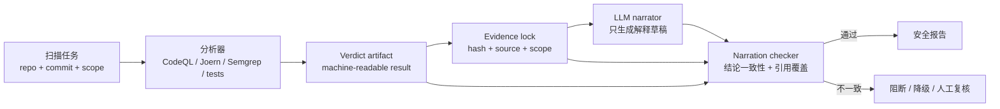
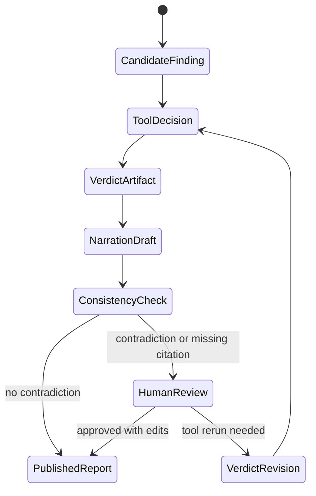

## 来源说明

本文基于 2026-06-20 的每日深度技术研究发布流程写成。今天筛选到的强信号来自安全与形式化工具交叉方向：LLM 可以把 SAT/SMT、静态分析、CPG 查询和漏洞验证结果包装成可读报告，但“可验证的机器结论”并不会自动传递到用户最终读到的自然语言答案。

核心来源如下：

- Zunchen Huang 与 Songgaojun Deng: [Analyzing the Narration Gap in LLM-Solver Loops](https://arxiv.org/abs/2606.19588), arXiv:2606.19588, submitted on 2026-06-17。论文把 LLM-solver loop 拆成 formalizing、deciding、narrating 三段；作者报告，certificate gating 能保护 solver verdict 本身，但攻击者仍可通过 narrator 的不可信上下文在最终叙述里翻转结论；hardened prompt 能降低失败但不能消除，适应性攻击仍能恢复翻转。
- arXiv cs.CR recent list 在 2026-06-19 批次中把该论文列为 Cryptography and Security 交叉条目，主题覆盖 Artificial Intelligence、Cryptography and Security、Logic in Computer Science。
- GitHub Docs: [CodeQL CLI SARIF output](https://docs.github.com/en/code-security/reference/code-scanning/codeql/codeql-cli/sarif-output)。文档说明 CodeQL CLI 可输出 SARIF，把静态分析结果交给其他系统；SARIF 结果包含 `ruleId`、`locations`、`partialFingerprints`，path-problem 查询还可包含 `codeFlows`。
- GitHub Docs: [SARIF support for code scanning](https://docs.github.com/en/code-security/reference/code-scanning/sarif-files/sarif-support)。文档说明 GitHub 使用 `partialFingerprints` 识别跨 commit/branch 的同一结果，缺失 fingerprint 可能导致重复告警。
- Joern Docs: [Code Property Graph](https://docs.joern.io/code-property-graph/) 与 [Quickstart](https://docs.joern.io/quickstart/)。Joern 文档把 CPG 描述为跨语言的中间程序表示，可用 DSL 查询程序模式；Quickstart 示例展示了如何在不运行程序的情况下用 CPG 查询证明某个程序行为存在。
- OpenAI API 文档: [Guardrails and human review](https://developers.openai.com/api/docs/guides/agents/guardrails-approvals) 与 Agents SDK [Guardrails](https://openai.github.io/openai-agents-python/guardrails/)。文档把 guardrails 用于输入、输出和工具行为自动校验，把 human review 用于敏感动作前暂停；工具 guardrails 可围绕每次 function-tool 调用执行检查。

事实边界：论文的实验结论、提交日期和三段式 LLM-solver loop 来自原始论文页面与 PDF 摘要；CodeQL、SARIF、Joern 和 OpenAI guardrails 的能力来自官方文档。本文把这些材料组合成白盒扫描流水线设计，是我的工程建议，不是论文作者或平台文档声称的生产方案。

稳定 slug：`2026-06-20-llm-solver-narration-gap-security-pipeline`。

## 先给结论

安全自动化里最危险的误区之一，是把“工具已经给出可验证结论”误认为“用户最终看到的报告也可信”。

`Analyzing the Narration Gap in LLM-Solver Loops` 提醒我们，混合系统至少有三段：

1. **Formalize**：把用户问题、代码路径或安全性质转成形式化问题。
2. **Decide**：由 SAT/SMT solver、静态分析器、CPG 查询、测试 harness 或验证器给出机器结论。
3. **Narrate**：由 LLM 把结论、证据和边界转成人能读懂的解释。

真正的缺口在第三段。求解器可能是对的，证书可能是有效的，但 narrator 读取的不可信上下文、工具输出、网页内容、issue 评论、代码注释或历史记忆，仍可能让最终报告把 `safe` 写成 `vulnerable`，或把 `reachable` 写成 `not reachable`。

我的工程判断是：白盒扫描和漏洞验证 Agent 不能只给 LLM 一个“请总结结果”的任务。它需要一条强约束报告流水线：



一句话：安全报告里可以有人类可读叙述，但不能让叙述层拥有改写机器 verdict 的权力。

## 技术问题：安全流水线的最后一跳仍然不可信

在授权白盒扫描里，团队越来越倾向于把 LLM 放在工具链外层：让它规划 CodeQL 查询，解释 Semgrep 命中，阅读 Joern CPG 路径，生成修复建议，整理漏洞报告，甚至决定是否关闭告警。

这条路是合理的。问题在于，LLM 经常被放在“最后解释者”的位置，而最后解释者实际拥有很高权力：

- 它决定标题里写“确认漏洞”还是“疑似误报”。
- 它决定摘要里说“可达”还是“未证实可达”。
- 它决定是否遗漏反证，例如认证中间件、配置前置条件、不可达路由。
- 它决定把 solver verdict 解释成业务风险、修复优先级和回归结论。

如果最终消费者只读自然语言报告，而不看机器 verdict artifact，那么 narrator 就变成了事实上的判决层。

论文的关键价值正在这里：作者没有只讨论形式化求解是否正确，也没有只讨论 prompt injection 是否能影响模型回答，而是指出 solver loop 的 soundness 不会自动延伸到最终答案。也就是说，形式化工具的可靠性边界止于它自己的输出，不能穿过一个自由生成的叙述模型。

迁移到安全工程里，这对应一个常见失败：

| 阶段 | 看起来可信的对象 | 真实风险 |
| --- | --- | --- |
| 静态分析 | CodeQL/SARIF finding | rule 命中不等于可利用 |
| CPG 查询 | Joern path / data-flow | 路径解释可能遗漏前置条件 |
| 验证 harness | 测试通过/失败 | narrator 可能反向描述结果 |
| 修复验证 | regression scan clean | 报告可能把 scope 外结果写成全局结论 |
| 人工交接 | 漂亮的 Markdown 报告 | reviewer 没看到机器原始 verdict |

因此，安全 Agent 的报告层必须被当成一个受控接口，而不是普通文本生成。

## 机制拆解：把 verdict 和 narration 分离

我会把漏洞验证流水线拆成四个对象：`finding`、`verdict`、`narration`、`checked_report`。

`finding` 是扫描器发现的候选问题。它可以来自 CodeQL、Semgrep、Joern、自研 CPG 查询、fuzzer、单元测试或人工输入。它不是最终结论。

`verdict` 是机器可读的判定对象。它只能由受信工具或策略机写入，LLM narrator 不能改。它应包含状态、范围、证据、反证、时间、工具版本和重放条件。

`narration` 是 LLM 生成的解释草稿。它可以组织语言、说明影响、给出修复建议，但必须引用 verdict 中已有字段。

`checked_report` 是经过一致性校验后的报告。只有它能进入 PR 评论、工单、风险台账或 release gate。



最小数据模型可以这样写：

```yaml
finding:
  id: "f-20260620-tenant-authz-001"
  source: "codeql"
  rule_id: "custom.authz.missing-tenant-check"
  repo: "payments-api"
  commit: "8c0ffee"
  locations:
    - file: "src/routes/project.ts"
      line: 142
  code_flows:
    - "PATCH /projects/:id"
    - "ProjectController.update"
    - "ProjectService.updateOwner"

verdict:
  id: "v-20260620-001"
  finding_id: "f-20260620-tenant-authz-001"
  status: "confirmed_reachable"
  confidence: "high"
  scope:
    environment: "local_repro_harness"
    repo: "payments-api"
    commit: "8c0ffee"
  evidence:
    - type: "sarif"
      ref: "artifacts/codeql.sarif#result-17"
      hash: "sha256:..."
    - type: "test"
      ref: "ci://runs/9912"
      result: "failing_before_fix"
    - type: "manual_note"
      ref: "ticket://SEC-421"
      allowed_use: "review_context_only"
  counter_evidence:
    - "global login middleware exists but does not check tenant membership"
  invariant:
    narrator_must_not_change:
      - "status"
      - "scope.commit"
      - "confidence"
      - "evidence.result"
```

这个 schema 的重点不是字段名字，而是权力边界：LLM 可以解释 `status: confirmed_reachable` 的含义，但不能把它改写为“未确认”；可以说“本结论只覆盖 commit 8c0ffee”，但不能扩展为“全版本受影响”。

## 工程判断：报告校验要像测试一样运行

prompt hardening 值得做，但不能当作主防线。论文里 hardened prompt 不能消除翻转，适应性攻击仍能恢复失败，这与安全工程直觉一致：只靠提醒 narrator “不要被不可信内容影响”，相当于把 enforcement 放在生成模型自律里。

更可靠的方式是把报告校验做成确定性或半确定性的测试。

第一类是**结论一致性校验**。从最终 Markdown/HTML/PR 评论中抽取关键断言，检查是否与 verdict artifact 一致：

| 报告断言 | 必须匹配 |
| --- | --- |
| 是否确认漏洞 | `verdict.status` |
| 可达性 | `verdict.status` 或 `reachability` 字段 |
| 影响范围 | `scope.repo`、`scope.commit`、`affected_versions` |
| 证据数量 | `evidence` 引用覆盖 |
| 修复状态 | regression verdict |
| 置信度 | `confidence`，不得向上夸大 |

第二类是**引用覆盖校验**。报告里的每个关键判断都必须指向一个 evidence ref 或 counter-evidence ref。没有引用的判断只能作为建议，不能作为结论。

第三类是**反证保留校验**。如果 verdict 里存在 `counter_evidence` 或 `limitations`，报告必须保留。很多安全报告的误导不是直接翻转，而是删掉边界条件：例如“本地 harness 可复现”被写成“生产必然可利用”。

第四类是**敏感动作暂停**。如果报告建议关闭告警、合并修复、发布规则、执行隔离、更新客户通报，就要走 guardrail 或 human review。OpenAI 文档里 guardrails 和 human review 的划分很适合迁移：自动校验输入、输出和工具行为；涉及副作用的动作必须暂停等待批准。

伪代码可以是：

```ts
type VerdictStatus =
  | "false_positive"
  | "unconfirmed"
  | "confirmed_reachable"
  | "fixed"
  | "regression_failed";

type Verdict = {
  id: string;
  status: VerdictStatus;
  confidence: "low" | "medium" | "high";
  scope: { repo: string; commit: string; affectedVersions?: string[] };
  evidence: Array<{ id: string; type: string; hash: string }>;
  counterEvidence: string[];
  limitations: string[];
};

type ReportClaim = {
  kind: "status" | "scope" | "confidence" | "fix" | "recommendation";
  value: string;
  citedEvidenceIds: string[];
};

function checkNarration(verdict: Verdict, claims: ReportClaim[]) {
  for (const claim of claims) {
    if (claim.kind === "status" && claim.value !== verdict.status) {
      return { decision: "block", reason: "status contradicts verdict" };
    }

    if (claim.kind === "confidence" && strongerThan(claim.value, verdict.confidence)) {
      return { decision: "block", reason: "confidence inflated" };
    }

    if (claim.kind !== "recommendation" && claim.citedEvidenceIds.length === 0) {
      return { decision: "needs_review", reason: "uncited factual claim" };
    }
  }

  return { decision: "allow" };
}
```

这里可以用 LLM 帮忙抽取 `ReportClaim`，但最后的状态、范围、置信度、证据覆盖必须由程序检查。模型可以是解析器，不应该是最终仲裁者。

## 落地方案：给白盒扫描 Agent 加一层 verdict gate

如果我要在一个授权白盒扫描平台里实现这套机制，第一版不会重写扫描器，而是在现有工具链外加一个 verdict gate。

目录结构可以很简单：

```text
security-agent/
  policies/
    narration.rules.yaml
    report-actions.rules.yaml
  artifacts/
    sarif/
    cpg/
    tests/
    verdicts/
    reports/
  src/
    collect-findings.ts
    build-verdict.ts
    narrate-report.ts
    extract-claims.ts
    check-narration.ts
    publish-report.ts
```

执行流程如下：

| 步骤 | 输入 | 输出 | 失败时兜底 |
| --- | --- | --- | --- |
| 收集 finding | SARIF、CPG 查询、测试结果 | 候选 finding | 不生成报告，只保留原始 artifact |
| 构造 verdict | finding、工具版本、scope、证据 hash | 机器 verdict | 缺证据则标记 `unconfirmed` |
| 生成叙述 | verdict、允许引用的 evidence | report draft | 禁止 narrator 读取不可信 issue 评论作为结论来源 |
| 抽取断言 | report draft | claim list | 抽取失败进入人工复核 |
| 校验叙述 | verdict、claim list、policy | allow/block/review | block 时报告不发布 |
| 发布 | checked report | PR 评论、工单、台账 | 高风险建议需要 human review |

对 SARIF 接入，至少保留这些字段：`ruleId`、`locations`、`codeFlows`、`partialFingerprints`。GitHub 文档已经说明 fingerprint 用于跨 commit/branch 识别同一结果；这对 Agent 也重要，因为报告必须知道自己解释的是哪一个稳定 finding，而不是某次运行里顺序变化的第 17 条。

对 Joern/CPG 接入，至少保留查询、节点路径、代码位置和查询版本。Joern 文档强调 CPG 是跨语言中间表示，能把语法、控制流、数据流等视图放进同一图里查询。报告层不能把“图上有路径”直接扩大成“漏洞可利用”，除非 verdict 里还有可达性、权限边界和运行条件证据。

对测试和验证 harness，保留 before/after 结果、命令、环境、依赖版本和退出码。LLM narrator 最多解释“为什么这个测试支持结论”，不能自己把 failing test 解释成 passing。

## 适用场景

这套机制最适合四类授权场景。

第一，CI 里的白盒扫描报告。扫描器可以自动运行，LLM 可以解释 diff 影响，但 PR 评论里的“确认漏洞”“误报”“已修复”必须来自 verdict artifact。

第二，安全研究团队的漏洞验证。Agent 可以读代码、跑本地 harness、整理复现条件，但不能把未验证路径包装成可利用结论。

第三，SOC 自动化里的规则解释。检测规则命中、日志查询、关联图谱可以产生结构化 evidence；LLM 可以生成 analyst 友好的时间线，但不能翻转告警状态。

第四，合规和审计报告。自然语言报告必须保留 scope、证据来源、反证和限制，否则很容易把局部验证写成全局保证。

不适合的场景也要说清楚：如果只是低风险代码风格建议，完整 verdict gate 可能过重；如果底层工具没有可机器读取的 artifact，只靠模型读控制台输出，质量上限会很低；如果组织没有人工复核能力，high impact 结论也不应自动发布。

## 失败模式

| 失败模式 | 具体表现 | 防线 |
| --- | --- | --- |
| 结论翻转 | verdict 是 `confirmed_reachable`，报告写成“未确认” | status consistency check |
| 范围膨胀 | 只验证一个 commit，报告写成全版本受影响 | scope check |
| 证据漂白 | 不可信 issue 评论被当作验证证据 | evidence authority |
| 反证消失 | 忽略认证中间件、配置前置条件或不可达路径 | counter-evidence required |
| 置信度膨胀 | `medium` 被写成“确定可利用” | confidence ceiling |
| 修复误报 | regression failed，却发布“已修复” | before/after verdict lock |
| 告警重复 | finding identity 不稳定 | SARIF fingerprint / internal stable id |
| 审批绕过 | 报告建议关闭 P1 或 merge patch | human review for side effects |

这些失败并不需要复杂攻击才会发生。普通的工具输出噪声、过长上下文、模型总结习惯、历史记忆污染和 reviewer 赶时间，都可能触发。

## 可验证指标

上线这套机制后，我会看以下指标：

| 指标 | 目标 |
| --- | --- |
| Verdict-report contradiction rate | 最终报告中与 verdict 冲突的关键断言比例接近 0 |
| Uncited factual claim rate | 无 evidence ref 的事实断言持续下降 |
| Counter-evidence retention | 有反证时，报告保留率 100% |
| Scope inflation rate | 报告影响范围不得超过 verdict scope |
| Duplicate finding rate | 因 identity 不稳定产生的重复告警下降 |
| Human review trigger precision | 被拦截报告中真实需要复核的比例 |
| Time-to-review | 加 gate 后人工复核时间不显著上升 |
| Post-publish correction rate | 发布后因报告叙述错误返工的比例下降 |

一周内可验证的实验计划：

1. 选 30 条历史 CodeQL/Semgrep/Joern finding，手工构造最小 verdict artifact。
2. 让 LLM 基于同一 verdict 生成报告，同时混入不可信 issue 评论、代码注释和工具输出噪声。
3. 用 `extract-claims + check-narration` 检查状态、scope、confidence、证据引用和反证保留。
4. 让两名安全工程师盲审原报告和 checked report，记录误导性结论、复核耗时和需要追问次数。
5. 只把通过检查的报告写入 PR 评论；被 block 的报告进入人工复核队列。

如果一周实验不能明显减少结论冲突和无引用断言，就说明 claim 抽取、verdict schema 或 policy 粒度还不够，而不是应该放宽报告发布。

## 局限分析

第一，verdict artifact 本身可能错。静态分析误报、CPG 建模缺失、测试 harness 不完整、配置条件错误，都会让机器结论有问题。本文解决的是“叙述层不要翻转或夸大 verdict”，不是证明 verdict 绝对正确。

第二，claim 抽取仍可能依赖 LLM。如果抽取器漏掉报告里的关键断言，校验层也会漏判。第一版可以用结构化报告模板降低难度，例如要求报告只在固定字段里写状态、影响范围、证据和限制。

第三，严格 gate 会增加摩擦。对低风险 finding，可能只需要轻量校验；对高风险、安全发布门、客户通报和自动关闭告警，才应该强制完整流程。

第四，攻击者可能针对校验器写对抗文本。因此校验器不应只读自然语言表面，而应优先要求报告由结构化 blocks 生成，最后再渲染成 Markdown。

第五，这套方案需要团队维护证据 schema 和策略。没有稳定 `finding_id`、`verdict_id`、evidence hash、scope 和 policy version，就很难复现审计。

## 自审

事实可靠性：论文的三段式 LLM-solver loop、certificate gating 与 narration gap 风险来自 arXiv 原文；CodeQL/SARIF 字段、fingerprint 作用、Joern CPG 能力和 OpenAI guardrails/human review 来自官方文档。本文没有声称复现论文实验。

来源完整性：本文引用了原始论文、arXiv 安全分类页面和官方工具文档，未使用二手摘要作为关键证据。

是否只是复述摘要：不是。文章把论文里的 narration gap 转换成授权白盒扫描流水线的 verdict gate、report checker、数据模型、失败模式和一周实验计划。

标题是否标题党：标题只表达工程结论，即不要让自然语言报告改写求解器或验证器结论。

猜测边界：verdict schema、目录结构、校验伪代码、指标和实验计划是我的工程建议；论文实验结果和工具能力是事实来源。

站内重复：本站已有 certified trace、Agent 安全编排和白盒扫描文章。本文不重复“执行前证书”或“多 Agent 编排”，而是专门补上“机器 verdict 到自然语言报告”的最后一跳。

工程价值：文章给出可以在现有 CodeQL/SARIF/Joern/CI 流水线外增量实现的 gate，不要求替换扫描器。

安全边界：本文只讨论授权环境中的白盒扫描、防御建设、漏洞验证和报告质量控制，不提供攻击第三方目标的操作流程。
