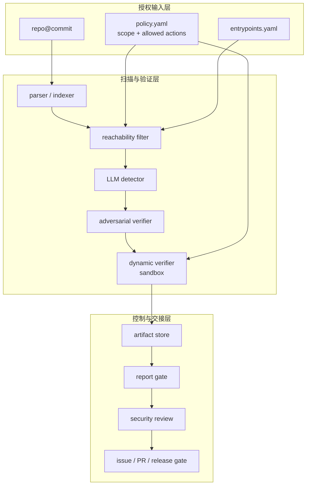

## 来源说明

本文基于 2026-06-21 的每日深度技术研究发布流程写成。今天筛选到的强信号来自 OpenAnt：它不是单独提出一个新的静态分析规则，而是把 LLM 放进仓库级白盒扫描的闭环里，用可达性裁剪降低分析面，用 LLM 做语义候选发现，再用对抗式验证和动态验证把候选压缩成更接近可复核的 finding。

核心来源如下：

- Nahum Korda 与 Gadi Evron: [OpenAnt: LLM-Powered Vulnerability Discovery Through Code Decomposition, Adversarial Verification, and Dynamic Testing](https://arxiv.org/abs/2606.19149v2), arXiv:2606.19149v2, submitted on 2026-06-17, revised on 2026-06-18。论文报告 OpenAnt 在 8 个开源项目、6 种语言上评测，流水线从 64,132 个函数裁剪到 2,281 个 reachable units、586 个 externally exploitable units、376 个 Stage 4 flagged findings、190 个 adversarially confirmed findings 和 144 个 dynamically verified findings；总评测成本为 1,461.25 美元。
- OpenAnt GitHub: [knostic/OpenAnt](https://github.com/knostic/OpenAnt)。仓库说明 OpenAnt 是 Apache-2.0 开源的 LLM-based vulnerability discovery product，支持 Go、Python，JavaScript/TypeScript、C/C++、PHP、Ruby 处于 beta；README 给出本地 CLI 流程 `parse -> enhance -> analyze -> verify -> build-output -> report`，并明确只能扫描自己拥有或明确授权测试的代码。
- Knostic Blog: [OpenAnt: Open Sourcing Knostic’s LLM-based Vulnerability Discovery Product](https://www.knostic.ai/blog/openant)。该文提供产品发布背景和技术说明入口；本文只把它作为项目方说明来源，不把营销表述当成独立实验结论。
- 背景对照：GitHub Docs 的 [CodeQL CLI SARIF output](https://docs.github.com/en/code-security/reference/code-scanning/codeql/codeql-cli/sarif-output) 与 [SARIF support for code scanning](https://docs.github.com/en/code-security/reference/code-scanning/sarif-files/sarif-support) 说明静态分析结果需要保留 rule、location、fingerprint 和 code flow 等机器可读证据；这为本文的 finding artifact 设计提供了工程参照。

事实边界：OpenAnt 的阶段、数据和限制来自论文、仓库与项目方说明；本文的 pipeline、数据模型、发布门、指标和一周实验计划是我的工程建议，不是 OpenAnt 作者声称的生产通用方案。本文只讨论授权白盒扫描、防御建设和安全工程，不讨论对第三方目标的未授权操作流程。

稳定 slug：`2026-06-21-openant-verified-white-box-scanning-pipeline`。

## 先给结论

LLM 进入白盒扫描后，真正值得追求的不是“发现更多疑似漏洞”，而是把每个疑似漏洞推进到可复核、可回放、可拒绝、可交接的状态。

OpenAnt 给出的重要工程信号是：仓库级安全 Agent 不能只有一个 `analyze repo` 大 prompt。它需要一条漏斗式流水线：

```mermaid
flowchart LR
  A["授权代码库<br/>commit + scope"] --> B["代码解析<br/>functions / files / deps"]
  B --> C["可达性裁剪<br/>entrypoints -> reachable units"]
  C --> D["暴露面分类<br/>external / internal / control"]
  D --> E["LLM 候选检测<br/>semantic vulnerability reasoning"]
  E --> F["对抗式验证<br/>attacker capability + victim impact"]
  F --> G["动态验证<br/>sandboxed reproduction"]
  G --> H["Finding artifact<br/>evidence + verdict + limits"]
  H --> I["报告放行<br/>human review / triage / fix"]
```



我的判断是：安全团队应把 LLM 扫描器当成“候选生成器 + 验证编排器”，而不是事实判定者。最终能进入 PR、工单或发布门的对象不应是自然语言报告，而应是带结构化证据的 `finding artifact`。

这和传统 SAST 的差异不是“LLM 更聪明”。差异在于闭环：静态规则倾向于从代码模式推出风险；LLM 候选检测可以读更宽的业务上下文，但更容易幻觉、过度推断或遗漏前置条件。验证层的职责就是把“看起来可疑”变成“在什么边界下成立、在什么边界下不成立”。

## 技术问题：候选漏洞不是安全结论

白盒扫描长期面对两个相反问题。

第一，静态分析会产生大量候选。很多候选只说明某条数据流、API 使用或代码模式值得看，不说明攻击者能否到达、权限边界是否满足、保护逻辑是否已覆盖，也不说明漏洞是否影响受害者数据。

第二，动态验证成本高。为每个候选搭环境、构造输入、跑验证、清理状态，不可能无差别覆盖整个仓库。传统 fuzzing 和集成测试也常受限于环境、认证、外部依赖和业务前置条件。

LLM 的价值在两者之间：它能帮助理解代码语义、业务路径、配置、接口约定和保护逻辑，也能生成验证假设。但如果没有验证闭环，LLM 只会把“候选更多”这个问题放大。OpenAnt 的论文把这个问题落到了工程数据上：8 个项目里，Stage 4 flagged findings 是 376 个，经过对抗式验证后剩 190 个，动态验证后剩 144 个。也就是说，LLM 检测层之后仍需要强过滤。

因此，我会把安全 Agent 的输出分成四级：

| 级别 | 含义 | 能否进入发布门 | 需要保留的证据 |
| --- | --- | --- | --- |
| Candidate | 模式或语义上可疑 | 否 | 代码位置、规则或推理原因 |
| Reachable candidate | 从授权入口可达 | 通常否 | 入口、调用链、路由、权限上下文 |
| Confirmed finding | 对抗式验证认为满足攻击者能力和受害者影响 | 可进入人工 triage | 威胁模型、反证、影响边界 |
| Verified finding | 在隔离环境中复现或由等价证据证明 | 可进入修复/发布门 | 复现记录、环境、版本、输出、清理结果 |

这里最关键的是第二列和第四列。没有证据对象，报告再像样也只是叙述；没有状态级别，团队会把 candidate 当漏洞，把 verified 当绝对真理。

## 机制拆解：OpenAnt 的六段漏斗

OpenAnt 论文把系统拆成多阶段流水线。抽象到安全工程，可以理解为六段。

**第一段：代码解析。** 系统先把仓库拆成函数、文件、依赖和调用上下文。这个阶段不负责判漏洞，而是建立后续分析的单位。

**第二段：分析单元生成与可达性过滤。** 论文报告 OpenSSL 例子中，15,232 个函数先被裁剪到 390 个 reachable units，再通过暴露面分类降到 49 个 externally exposed units。这个数字不应被机械外推到所有项目，但方向很重要：仓库级扫描必须优先减少无关上下文，否则 LLM 成本和误报都会失控。

**第三段：暴露面分类。** OpenAnt 将单元分成 exploitable、vulnerable-internal、security control 和 neutral 等类别。工程上这一步相当于给候选设置“攻击面身份”：外部输入能不能到达？是否只是内部辅助函数？是否其实是认证、校验、清洗逻辑？

**第四段：漏洞候选检测。** LLM 在裁剪后的单元上做语义安全分析。它能覆盖传统规则难以表达的业务漏洞，例如缺失授权、状态机错误、跨对象访问和不完整校验。但它输出的仍是 `flagged`，不是最终结论。

**第五段：对抗式验证。** 这是 OpenAnt 最值得借鉴的部分。验证者不只是问“这是不是漏洞”，而是从攻击者能力、受害者影响、保护逻辑和现实前置条件出发，尝试否定或确认候选。工程上应要求它同时产出支持证据和反证。

**第六段：动态验证。** 论文描述 OpenAnt 会自动生成验证环境，在 sandboxed containers 中执行并丢弃环境。这个阶段的价值不是追求 100% 复现所有漏洞，而是把最重要的一批 finding 推进到可以被人和 CI 复核的状态。

我会把这六段映射成一个可落地的内部对象模型：

```ts
type FindingArtifact = {
  id: string;
  repo: string;
  commit: string;
  scope: "authorized-white-box";
  status: "candidate" | "reachable" | "confirmed" | "verified" | "rejected";
  category: string;
  locations: Array<{ path: string; startLine: number; endLine?: number }>;
  entrypoints: Array<{ kind: "route" | "cli" | "job" | "api"; name: string }>;
  evidence: Array<{ kind: "code" | "trace" | "test" | "config"; ref: string; hash?: string }>;
  counterEvidence: Array<{ claim: string; ref: string }>;
  attackerModel: {
    authenticated: boolean;
    requiredRole?: string;
    controlsVictimData: boolean;
    requiredPreconditions: string[];
  };
  verification: {
    method: "static" | "adversarial-review" | "dynamic-sandbox";
    command?: string;
    containerImage?: string;
    resultRef?: string;
    cleanupVerified: boolean;
  };
  reviewerDecision?: "accept" | "needs-more-evidence" | "false-positive" | "risk-accepted";
};
```

这个模型刻意把 `counterEvidence` 放进一等字段。安全 Agent 最容易失败的地方不是找不到可疑代码，而是没有把“为什么它可能不是漏洞”写进报告。

## 工程判断：验证层要有否决权

如果团队只加一个 LLM 扫描步骤，结果通常是更多 backlog。如果团队把 LLM 用在“发现、解释、验证、复现、交接”多个位置，必须让验证层拥有否决权。

我会按下面的发布门设计：

| 发布门 | 自动条件 | 人工条件 | 失败处理 |
| --- | --- | --- | --- |
| Candidate gate | 有代码位置、类别、初步理由 | 无 | 不完整则丢弃 |
| Reachability gate | 至少一条入口路径或明确内部边界 | 路径不清时抽样复核 | 降级为 internal note |
| Adversarial gate | 攻击者能力、受害者影响、反证均结构化 | 高危类别必须安全工程师复核 | 标记 `needs-more-evidence` |
| Dynamic gate | 隔离环境、命令、输出、清理记录存在 | 涉及破坏性副作用必须人工批准 | 不复现但保留 confirmed |
| Report gate | 叙述与 artifact 状态一致 | 修复建议和影响范围复核 | 阻断发布或降级摘要 |

这里有两个边界要说清楚。

第一，动态验证不是所有 finding 的硬门槛。权限绕过、业务逻辑、竞态、环境相关问题可能很难自动复现；强行要求复现会漏掉真实风险。更稳妥的做法是把 `confirmed` 和 `verified` 分开，报告里明确证据等级。

第二，对抗式验证不是让 Agent “自由攻击”。在授权白盒流程里，它应该运行在受控代码库、受控环境和明确威胁模型内，输出的是可复核假设与反证，不是对第三方系统的操作指南。

## 适用场景

这条 verified finding pipeline 适合三类场景。

第一，开源维护者或企业内部安全团队希望对自己拥有的仓库做深度扫描，并且愿意为高价值 finding 支付 LLM 和环境成本。

第二，传统 SAST 已经产生大量误报，团队需要用可达性、权限上下文和动态验证给告警排序，而不是把所有命中都推给开发。

第三，研发平台希望把安全检查接入 PR 或 release gate，但不想让 LLM 直接决定阻断。此时可以让 Agent 生成候选和证据包，最终由策略机和人决定是否阻断。

不适合的场景也很明确：

- 没有授权边界的外部目标扫描。
- 不能提供隔离验证环境的生产系统。
- 需要低成本、低延迟、每次 commit 全量深扫的路径。
- 组织没有安全 triage 人员，只希望工具“自动判定全部漏洞真假”。

## 失败模式

这类系统的失败模式至少包括八类。

| 失败模式 | 结果 | 缓解措施 |
| --- | --- | --- |
| 入口识别漏掉真实攻击面 | 漏报 | 入口枚举测试、框架适配、人工抽样 |
| 可达性过度裁剪 | 把真实漏洞裁掉 | 保留裁剪日志和被排除样本 |
| LLM 过度推断业务语义 | 误报 | 要求引用代码证据和反证 |
| 验证者和发现者同偏差 | 错误被两阶段共同确认 | 分模型、分 prompt、分证据源运行 |
| 动态环境不等价 | 复现失败或虚假复现 | 固定镜像、依赖、配置和数据种子 |
| 报告层夸大证据等级 | candidate 被写成 verified | 报告从 artifact 渲染，不允许自由改 verdict |
| 成本失控 | 无法进入 CI/CD | 先做入口裁剪、缓存、增量扫描和预算阈值 |
| 高危动作无审批 | 验证过程产生副作用 | sandbox、只读凭据、人工批准和清理检查 |

这些问题说明，安全 Agent 的难点不只是 prompt engineering，而是安全流水线本身要像软件交付系统一样可观测、可回放、可限制。

## 一个工程落地方案

我会用三层架构实现第一版。



目录结构可以这样开始：

```text
security-agent/
  policy.yaml
  entrypoints.yaml
  scans/
    repo-name/
      commit-sha/
        units.jsonl
        reachability.jsonl
        candidates.jsonl
        confirmations.jsonl
        dynamic-runs/
        findings.jsonl
        report.md
  prompts/
    detector.md
    adversarial-verifier.md
    report-renderer.md
  scripts/
    run-incremental-scan.sh
    verify-artifact-schema.ts
    render-report.ts
```

`policy.yaml` 至少应包含：

```yaml
scope:
  mode: authorized-white-box
  repo: example/service
  allowed_paths:
    - src/
    - packages/api/
  denied_paths:
    - secrets/
dynamic_verification:
  allow_network: false
  allow_external_targets: false
  require_container: true
  require_cleanup_check: true
approval:
  require_human_for:
    - destructive_test
    - production_credential
    - external_callback
reporting:
  min_status_for_blocking: verified
  allow_confirmed_as_warning: true
```

报告生成应从 `findings.jsonl` 渲染，而不是让 LLM 从聊天历史自由总结。LLM 可以写解释，但结论字段、状态、证据等级、代码位置和复现状态必须来自 artifact。

## 可验证指标

我会用下面这组指标判断系统是否真的有工程价值。

| 指标 | 为什么重要 | 目标形态 |
| --- | --- | --- |
| Analysis surface reduction | 控制成本和噪声 | 函数数、reachable units、exposed units 分阶段记录 |
| Candidate-to-confirmed ratio | 衡量检测层噪声 | 每类漏洞单独统计，不能只看总数 |
| Confirmed-to-verified ratio | 衡量动态验证能力 | 记录失败原因：环境、前置条件、模型、非漏洞 |
| Evidence coverage | 防止报告空转 | 每个结论至少有 location、entrypoint、reason、counterEvidence |
| Human reversal rate | 衡量自动验证可信度 | 人工 triage 推翻比例按阶段回流 |
| Time per verified finding | 判断 ROI | LLM 成本、环境成本、人工时间分开记 |
| Regression utility | 修复后是否能防回归 | finding 能否转成测试、规则或查询 |
| Safety incidents | 验证过程是否越界 | 网络、凭据、文件写入、清理失败必须记账 |

指标里最值得盯的是 human reversal rate。如果人工经常推翻 `verified`，说明动态验证环境或报告 gate 有问题；如果人工经常推翻 `candidate`，说明检测层太宽，但未必是坏事，关键看成本能否接受。

## 我会如何实现和验证

第一周我不会直接做全仓库自动漏洞发现，而会选一个授权内部服务做小范围实验。

**Day 1：定义边界。** 固定 repo、commit、允许路径、入口类型和禁止动作。先不接生产凭据，不允许外网访问，不允许对第三方目标发请求。

**Day 2：建立索引和入口表。** 用现有语言工具抽取函数、路由、CLI、job 和调用关系。对 20 个入口做人工抽样，确认没有明显漏枚举。

**Day 3：跑候选检测。** 只扫描 reachable units。候选必须输出代码位置、漏洞类别、攻击者模型、受害者影响和至少一个反证问题。

**Day 4：跑对抗式验证。** 用独立 prompt 或独立模型验证候选，要求验证者优先寻找不可利用理由。没有反证字段的候选不能升级。

**Day 5：做隔离动态验证。** 只选 3 到 5 个高置信候选进入 sandbox。记录镜像、命令、配置、输出和清理结果。

**Day 6：人工 triage。** 安全工程师只看 artifact 和最小代码上下文，标记 accept、false positive、needs more evidence 或 risk accepted。

**Day 7：复盘 ROI。** 计算候选数、confirmed 数、verified 数、人工推翻率、总成本、每个 verified finding 的时间和费用。只有当 verified finding 能转化成修复、回归测试或规则时，才扩大范围。

这个实验的目标不是证明“Agent 能取代 AppSec”，而是判断 Agent 是否能把安全工程师从低价值候选里解放出来，同时不损失证据质量。

## 局限分析

OpenAnt 的数据足够有启发，但不能简单推成“LLM 白盒扫描已解决”。我会保留几个限制。

第一，论文评测集中在 8 个开源项目，虽然覆盖多语言，但不同企业仓库的框架、认证、部署拓扑和数据边界差异很大。可达性裁剪和动态验证都需要项目适配。

第二，动态验证无法覆盖所有真实漏洞。很多业务逻辑漏洞依赖角色、历史数据、组织策略或外部服务状态，自动 sandbox 很难完整复刻。

第三，成本不是小问题。论文报告 8 个项目总成本为 1,461.25 美元，而且不同项目差异明显。生产落地必须做增量扫描、预算阈值、缓存和高风险路径优先级。

第四，LLM 验证仍可能同源偏差。发现者和验证者如果共享相同错误假设，流水线会给错误结论制造“二次确认”的错觉。因此验证 prompt、模型、证据源和人工抽样需要刻意分离。

第五，报告层仍可能污染结论。即使前面有 artifact，最后的自然语言报告如果自由生成，仍可能把 `confirmed` 写成 `verified`，或遗漏重要前置条件。报告必须从结构化 verdict 渲染，并做一致性检查。

## 自审

- 事实可靠性：核心事实来自 arXiv 论文、GitHub 仓库、Knostic 项目说明和 GitHub 官方文档；论文数据按作者报告表述，没有写成独立复现实验结果。
- 来源完整性：已给出论文、仓库、项目方博客和 SARIF/CodeQL 背景文档链接。
- 是否只是复述：不是。本文把 OpenAnt 抽象成 verified finding pipeline，并给出 artifact 模型、发布门、目录结构、策略示例、指标和一周实验计划。
- 是否标题党：标题对应核心判断，即白盒扫描 Agent 的产物不能停在 candidate。
- 是否薄内容：包含机制图、表格、数据模型、工程落地方案、验证指标和具体实验计划。
- 是否把猜测写成事实：OpenAnt 的评测数据和支持范围明确归因给论文/仓库；pipeline 和落地方案明确标为我的工程建议。
- 站内重复：本站 2026-06-20 讨论 LLM-solver narration gap，本文讨论候选漏洞到 verified finding 的白盒扫描漏斗；主题相邻但不重复。
- 安全边界：全文限定授权白盒扫描、防御建设、sandbox 和人工审核，没有提供攻击第三方目标的操作流程。
