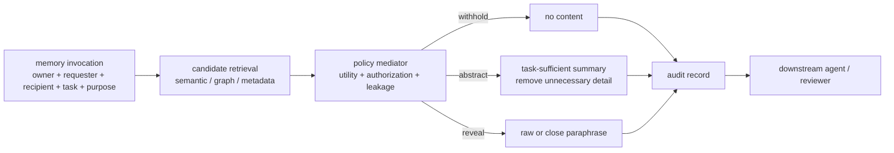
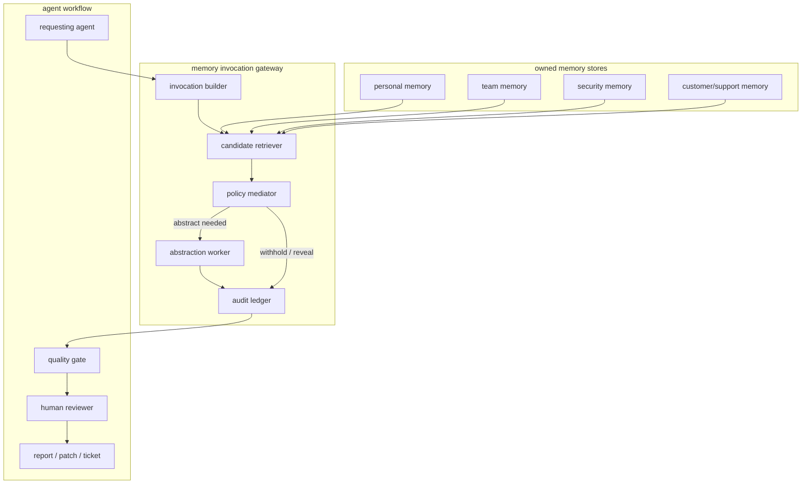

## 来源说明

本文基于 2026-06-22 的每日深度技术研究发布流程写成。今天没有看到足够扎实的新开源实现，但筛选到一个值得补成支柱文章的研究问题：多 Agent 协作时，记忆不再只属于单个用户或单个 Agent，相关性检索会把“对任务有用”和“允许披露”混在一起。

核心来源如下：

- Haichang Li: [Memory as a Service (MaaS): Purpose-Bound Memory Mediation for Cooperative Agents](https://arxiv.org/abs/2506.22815), arXiv:2506.22815v2, 2026-06-11 修订，已接收至 KDD 2026 Workshop on Agentic Software Engineering。论文提出 purpose-bound memory mediation：每次记忆调用按 owner、requester、recipient、task、declared purpose 和上下文评估，mediator 对候选记忆选择 `withhold`、`abstract` 或 `reveal`。作者用 MAGPIE 做诊断压力测试，报告 relevance-based retrieval 的 AUROC 为 0.570、private leak rate 为 53.0%；contextual-integrity prompting 相对 Helpful 降低 21.8 个百分点泄漏，但仍有 32.6% residual leakage；1,456 条 private items 中有 66 条显式 safe-hint abstraction。
- Yasmine Omri 等: [Agent Memory: Characterization and System Implications of Stateful Long-Horizon Workloads](https://arxiv.org/abs/2606.06448), arXiv:2606.06448, 2026-06-04。论文从系统角度把 agent memory 的成本和行为拆到 construction、retrieval、generation 等阶段，提醒我们记忆系统不是一个单点检索函数，而是长期运行工作负载的一部分。
- Anthropic: [Introducing the Model Context Protocol](https://www.anthropic.com/news/model-context-protocol)。MCP 给 Agent 与数据源、工具之间提供标准连接层；它解决“怎样连接”，但不自动回答“某条记忆应该以什么粒度流向哪个 recipient”。
- Google Developers Blog: [Announcing the Agent2Agent Protocol (A2A)](https://developers.googleblog.com/en/a2a-a-new-era-of-agent-interoperability/)。A2A 关注跨框架 Agent 通信、任务管理、artifact 和状态更新；这会放大跨 Agent 记忆流动的问题。
- OpenAI: [Introducing workspace agents in ChatGPT](https://openai.com/index/introducing-workspace-agents-in-chatgpt/)。Workspace agents 强调共享 Agent、长期 workflow、权限控制和审批；这类产品形态让“团队级共享上下文如何进入 Agent”变成实际工程问题。
- NIST CSRC: [asset glossary](https://csrc.nist.gov/glossary/term/asset)。NIST 把 data、information、software、capability、function、service 等都纳入 intangible asset 语义。本文借这个视角把长期记忆当作需要生命周期治理的资产，而不是临时 prompt 材料。

事实边界：MaaS 是 position paper，不是完整产品实现；MAGPIE 压力测试是诊断探针，不代表所有企业记忆系统的泄漏率。本文的 memory invocation gateway、数据模型、指标和落地计划是我的工程建议，不是论文作者报告的生产方案。

稳定 slug：`2026-06-22-purpose-bound-memory-mediation`。

## 先给结论

多 Agent 协作里的长期记忆访问，不能用“语义相关就召回”当授权规则。

如果一个研发 Agent 可以调用测试 Agent、评审 Agent、会议 Agent、客户支持 Agent、安全 Agent 和个人助手的记忆，那么最危险的失败不是“找不到相关上下文”，而是“找到了过于相关的上下文”：它可能包含客户名称、事故责任人、薪酬讨论、尚未公开的路线图、内部安全事件、个人偏好或另一个团队的敏感判断。

MaaS 的价值在于把记忆访问从 retrieval problem 改写成 mediation problem：



我的工程判断是：未来的团队级 Agent 记忆层应该有一个 `memory invocation gateway`。它不替代向量检索、图检索或数据库权限，而是在这些机制之上做目的绑定调解：这条记忆是谁的、谁在请求、最终给谁看、为了什么任务、是否可以原文披露、是否只能抽象、是否需要记录或审批。

## 技术问题：相关性不是授权

单 Agent 记忆系统里，常见问题是写入质量、检索召回、过期、冲突、遗忘和成本。多 Agent 协作后，又多出一个更硬的问题：记忆的 owner 和使用者分离。

一个例子足够说明问题。假设一个编程 Agent 正在修复企业会议纪要系统的 action item 漏检问题。它确实需要知道“会议 Agent 经常漏掉跨轮次隐含责任人”，也需要知道“某些客户会议里 action item 被错误归类为普通讨论”。但它不一定需要看到原始客户名称、销售策略、法律争议、参会人私人评价或内部事故归因。

传统检索会把 query 写成：

```text
Find memories relevant to improving action-item extraction quality.
```

这会把“对改进模型有帮助”的记忆排到前面，但不会判断这些记忆是否允许发给当前 requester，更不会判断能否发给最终 recipient。MaaS 论文的 MAGPIE 探针正好击中这个问题：相关性只弱区分 shareable 和 private items，top retrieval 会泄露大量 private items。prompt 里加入 contextual integrity 会改善，但仍有残余泄漏。

所以这里要拆开三件事：

| 问题 | 传统检索答案 | 目的绑定调解答案 |
| --- | --- | --- |
| 是否有用 | similarity / rank / rerank score | cooperative utility |
| 是否允许 | 常被折叠进用户权限或 prompt 规则 | purpose-bound authorization |
| 应该给多少 | 通常是 chunk 原文或摘要 | withhold / abstract / reveal |

最关键的是第三列。很多记忆并不是非黑即白。它们不能原文发给另一个 Agent，但可以以受限形式贡献任务信息。例如“Customer A 在事故复盘中点名某团队”可能不能披露；“该模块在企业会议场景存在责任人识别稳定性问题”可能足以支撑工程修复。

## 机制拆解：把记忆调用做成一等事件

MaaS 的核心对象是 memory invocation。它不是简单的 `query -> topK memories`，而是一个带目的和接收者的调用事件。

我会把它落成下面的数据模型：

```ts
type MemoryInvocation = {
  id: string;
  owner: {
    kind: "person" | "team" | "agent" | "organization";
    id: string;
  };
  requester: {
    agentId: string;
    runId: string;
    delegatedBy?: string;
  };
  recipient: {
    kind: "same-agent" | "human-reviewer" | "other-agent" | "external-user";
    id: string;
  };
  task: {
    type: "debug" | "review" | "release" | "research" | "support" | "security";
    artifactRef?: string;
  };
  purpose: string;
  query: string;
  contextRefs: string[];
  requestedAt: string;
};

type MediationDecision = {
  invocationId: string;
  memoryId: string;
  action: "withhold" | "abstract" | "reveal";
  reasonCodes: Array<
    | "not-authorized-for-purpose"
    | "recipient-too-broad"
    | "sensitive-detail-not-needed"
    | "owner-policy-allows"
    | "human-approval-required"
  >;
  abstractedContent?: string;
  policyVersion: string;
  expiresAt?: string;
  auditRef: string;
};
```

这里有三个工程要点。

第一，`recipient` 必须和 `requester` 分开。一个安全 Agent 请求记忆，最终接收者可能是开发者、外部客户、另一个 Agent 或公开报告。允许安全 Agent 读取，不等于允许它把内容原样写进最终产物。

第二，`purpose` 不能只是自然语言备注。自然语言可以作为 authoring interface，但执行层需要把它映射成结构化条件：任务类型、信息类型、接收者类别、允许动作、过期时间、是否需要人工批准。

第三，`abstract` 必须是一等动作。只有 `allow/deny` 会迫使系统在“完全泄漏”和“完全没用”之间摇摆；很多协作场景需要的是最小充分披露。

## 工程判断：记忆网关要在检索之后、生成之前

我不会把目的绑定调解放在向量库里，也不会只写进 system prompt。更合理的位置是在检索之后、生成之前。

检索层负责找到候选。它可以用向量、关键词、图、事件日志、权限过滤和时间衰减。调解层负责把候选逐条判定为 `withhold`、`abstract` 或 `reveal`。生成层只能看到调解后的结果，不能绕过 gateway 再查原始 memory store。



这个设计和 MCP、A2A 的关系是互补的。MCP 可以把外部数据和工具接进 Agent；A2A 可以让 Agent 发现能力、交换任务状态和 artifact。记忆网关要补的是内容级决策：即使两个 Agent 可以通信，也不代表所有记忆都应该原样流过这条通道。

## 策略模型：把 owner intent 编译成可执行条件

很多团队会先想做一个“记忆隐私 prompt”。这不够。prompt 可以帮助模型理解上下文，但不能作为唯一 enforcement。

我会把 owner policy 分成两层。

第一层是结构化硬规则，适合直接执行：

```yaml
policies:
  - id: customer-incident-raw-notes
    match:
      information_type: ["customer_incident", "security_event"]
      sensitivity: ["confidential", "restricted"]
    deny_reveal_when:
      recipient: ["external-user", "other-agent"]
    allow_abstract_when:
      purpose: ["debug", "quality-improvement", "security-review"]
      recipient: ["same-agent", "human-reviewer"]
    approval_required_when:
      action: ["reveal"]

  - id: personal-career-memory
    match:
      owner_kind: "person"
      information_type: ["salary", "performance-review", "career-plan"]
    deny_when:
      purpose: ["recruiting", "manager-evaluation", "sales-outreach"]
```

第二层是自然语言 authoring instructions，例如“我在 Company X 的项目经验不要给招聘 Agent 使用”“假期安排可以给家庭 Agent，但不要给工作同事”。这些指令可以进入策略生成流程，但不能直接变成最终执行结果。它们需要被编译、展示、确认和版本化。

一个实用策略引擎至少需要四个输入：

| 输入 | 作用 | 缺失后果 |
| --- | --- | --- |
| Memory metadata | 信息类型、敏感级别、owner、来源、时间 | 无法判断披露风险 |
| Invocation tuple | requester、recipient、task、purpose | 无法做目的绑定 |
| Policy version | 当前规则、owner instruction、组织规则 | 决策不可复盘 |
| Output form | withhold、abstract、reveal、expiry | 只能粗暴 allow/deny |

## 适用场景

这套机制最适合已经出现跨 Agent 记忆调用的场景。

第一类是软件工程团队。编程 Agent 需要读取测试失败、代码评审、发布事故、客户反馈和安全审计记忆，但并不总需要原始对话和敏感归因。

第二类是企业知识工作流。一个 workspace agent 可能跨 Slack、邮件、文档、CRM 和工单工作。共享上下文越多，越需要按任务目的、接收者和最终产物粒度控制披露。

第三类是安全与合规流程。安全 Agent 可能需要使用漏洞验证、事件响应、资产清单和内部调查记录。它可以把“某模块需要修复授权检查”交给研发，但不应默认泄露完整事件细节、客户名称或调查备注。

第四类是个人与团队混合记忆。个人助手、团队 Agent 和公司 Agent 之间最容易产生边界错觉：同一个人授权个人助手记住某件事，不等于授权团队 Agent 在公共频道使用这件事。

不适合的场景也明确。如果系统只是单用户、短会话、低敏感度问答，完整 MaaS 网关可能过重。先做好来源标注、删除机制、TTL 和人工确认即可。

## 失败模式

| 失败模式 | 具体表现 | 缓解措施 |
| --- | --- | --- |
| Relevance-as-policy | 相关性高的 private memory 被直接召回 | 检索分数不能授予披露权 |
| Requester/recipient 混淆 | Agent 可读内容被写进外部报告 | 决策时显式绑定最终接收者 |
| Abstract 失真 | 抽象后删除了任务关键事实或改写结论 | 抽象输出要有 evidence ref 和 reviewer 抽样 |
| 组合泄漏 | 多次安全摘要拼出敏感事实 | 对 recipient 做累计披露预算和审计 |
| 策略只存在 prompt | 模型承诺遵守，但工具可绕过原始 store | gateway 作为唯一读入口 |
| Owner instruction 编译错误 | 自然语言偏好被误映射成过宽规则 | 策略 diff、确认 UI、回滚版本 |
| 过期授权继续生效 | 事件结束后 Agent 仍可读 incident memory | grant TTL、revocation、derived cache 清理 |
| 审计不可用 | 只记录“用了 memory”，不记录为什么允许 | audit record 记录 invocation、action、policy、recipient |

最容易被低估的是组合泄漏。单条 abstract 看起来很安全，十条 abstract 合在一起可能还原出客户、人员或事故细节。因此评测不能只看单次披露是否合规，还要看连续调用后的累计风险。

## 一个工程落地方案

我会从一个很窄的场景做第一版：研发质量改进 Agent 需要读取会议 Agent 和支持 Agent 的记忆，目的是改进 action item extraction 和 workflow classification。

目录结构可以这样设计：

```text
memory-gateway/
  policies/
    org.yaml
    team-product.yaml
    personal-overrides.yaml
  schemas/
    invocation.schema.json
    decision.schema.json
    audit.schema.json
  runs/
    2026-06-22-action-item-debug/
      invocation.jsonl
      candidates.jsonl
      decisions.jsonl
      abstracts.jsonl
      audit.jsonl
      review.md
  evals/
    magpie_subset.jsonl
    synthetic_enterprise_cases.jsonl
    leakage_regression.test.ts
```

最小工作流如下：

1. Agent 发起 invocation，必须声明 task、purpose、recipient 和输出 artifact。
2. Gateway 到各 memory store 拉候选，只返回 `memory_id`、metadata 和必要的安全标签给调解器。
3. Mediator 先执行硬规则，直接拒绝明显越界的 reveal。
4. 对允许抽象的候选，调用 abstraction worker 生成最小充分摘要。
5. Quality gate 检查摘要是否包含禁止字段、是否保留任务所需事实、是否绑定来源。
6. Agent 只能看到调解后的 memory packet。
7. 每条决策写入 audit ledger，保留 policy version、recipient、action 和过期时间。

示例 `memory packet`：

```json
{
  "packet_id": "mp-20260622-018",
  "invocation_id": "mi-20260622-action-item-debug",
  "items": [
    {
      "memory_id": "support-4217",
      "action": "abstract",
      "content": "Enterprise meeting workflows show recurring failures when action ownership is implied across turns rather than named directly.",
      "allowed_use": ["debug", "quality-improvement"],
      "blocked_use": ["external-report", "customer-identification"],
      "evidence_ref": "audit://memory-gateway/2026-06-22/decision-018",
      "expires_at": "2026-07-06T00:00:00Z"
    }
  ]
}
```

这比直接把支持工单、会议纪要或客户邮件塞进 prompt 更麻烦，但它能回答生产系统必须回答的问题：谁的记忆、为什么被用、给了谁、给到什么粒度、何时过期、能否撤销。

## 我会如何实现和验证

第一周不要做通用 MaaS 平台，只做一个可测 gateway。

第一天，定义 30 条合成记忆，覆盖 shareable、private、safe-hint 三类；每条写清 owner、信息类型、敏感级别、允许 purpose 和禁止 recipient。

第二天，实现 `MemoryInvocation`、`MediationDecision` 和 audit JSONL。先用规则引擎，不接 LLM。

第三天，接一个简单向量检索或关键词检索，故意让 private memory 被排到前面，验证 mediator 是否能挡住 relevance-as-policy。

第四天，加 abstraction worker。对 safe-hint 类型先用模板抽象，不让模型自由改写敏感事实。

第五天，加负向测试：外部 recipient、招聘 purpose、过期 grant、跨团队请求、重复摘要组合、无 policy version 的调用，都必须被阻断或升级人工审核。

第六天，让一个真实研发工作流试跑：只允许输出内部 debug note，不允许外发或写回权威知识库。人工抽样检查 20 条 decision。

第七天，复盘三个指标：任务是否仍有足够上下文、泄漏是否下降、人工审核负担是否可接受。只有这三个同时成立，才扩大到更多 memory store。

## 可验证指标

| 指标 | 含义 | 验证方法 |
| --- | --- | --- |
| Private leak rate | private item 被 reveal 或不当 abstract 的比例 | 合成集 + MAGPIE 风格标注 |
| Shareable recall | 合规可共享信息是否仍被提供 | 有 gold label 的协作任务 |
| Abstract sufficiency | 抽象后是否足以完成任务 | 下游任务成功率和人工评分 |
| Abstract leakage | 抽象是否保留不必要敏感细节 | 敏感实体检测 + 人工抽样 |
| Decision reproducibility | 同一 policy/version 下决策是否稳定 | 固定 seed 回归测试 |
| Revocation coverage | 撤销后原文、摘要、缓存是否失效 | grant TTL 和 cache purge 测试 |
| Recipient mismatch rate | 给错最终接收者的比例 | artifact 审计 |
| Human escalation precision | 升级人工的样本有多少确实需要人 | reviewer 标签 |

我会把 `private leak rate` 和 `abstract sufficiency` 放在同一张发布门里。如果只优化泄漏，系统会退化成“什么都不给”；如果只优化任务成功，系统会退回“相关就给”。

## 局限分析

第一，MaaS 论文是问题定义和诊断探针，不是可直接部署的系统。它没有解决策略 authoring UI、组织规则冲突、跨平台撤销、缓存清理、加密存储和法务合规流程。

第二，MAGPIE 是代理数据集。它适合暴露多 Agent privacy tension，但不能直接代表企业邮件、会议、代码评审、客户工单或安全事件的真实分布。

第三，`abstract` 是强大但危险的动作。抽象可能过度删除、错误泛化或保留隐含敏感信息。它必须有评测、来源、审计和人工抽样，不能当成“安全摘要”标签后就放行。

第四，目的绑定不能只依赖声明的 purpose。恶意或错误 Agent 可能把真实目的写得很无害。工程上还要结合任务 artifact、调用来源、历史行为、工具动作和最终输出校验。

第五，本文没有声称 MCP、A2A 或 Workspace Agents 已经实现 MaaS。它们说明连接、协作和共享工作流正在成为主流形态；记忆目的绑定是这些形态放大后需要补上的治理层。

## 自审

事实可靠性：MaaS 的修订日期、会议信息、调用元组、三态动作和 MAGPIE 数字来自 arXiv 摘要与 HTML 正文；2606.06448 的系统生命周期观点来自 arXiv 摘要；MCP、A2A、Workspace Agents 和 NIST asset 定义来自官方来源。

来源完整性：本文使用论文、官方协议/产品说明和 NIST 术语页作为核心来源，没有使用二手营销文章作为事实依据。

是否只是复述摘要：不是。正文把 MaaS 转换成 memory invocation gateway、数据模型、策略编译、审计 ledger、失败模式、指标和一周验证计划。

是否标题党：标题只表达核心工程判断：共享 Agent 记忆不能只靠相关性检索，没有夸大为“解决隐私”或“统一记忆标准”。

是否把猜测写成事实：没有。论文报告数据、官方文档事实和我的工程建议已分开说明。

站内重复：本文和 2026-06-05 的 Agent libOS 权限边界、2026-06-08 的记忆投毒写入面、2026-06-16 的企业上下文层相邻，但切入点不同：本文专门讨论跨 owner、requester、recipient、purpose 的记忆调用调解。

工程价值：给出了可实施的 gateway 位置、schema、策略示例、审计记录、测试集和一周实验计划，适合团队把共享 Agent 记忆从 prompt 约定推进到可验证接口。

安全边界：本文只讨论授权环境中的记忆治理、隐私保护、审计和防御建设，不提供针对第三方 Agent 或系统的攻击流程。
