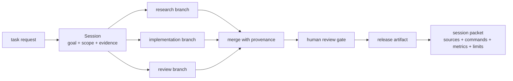
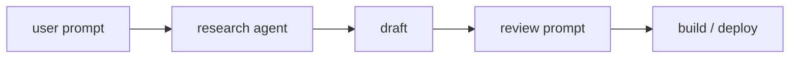
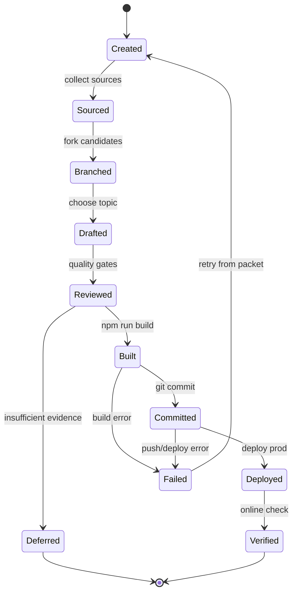

## 来源说明

本文基于 2026-06-23 的每日深度技术研究发布流程写成。今天没有选择写“Agent 工具合集”或“企业 AI 趋势”，因为那类材料大多停在观点层。更扎实的信号来自一篇运行时系统论文：它把 AI Native 工作流从“多个 Agent 怎么编排”推进到“Agent 之间到底传递什么状态”。

核心来源如下：

- Fukang Wen、Zhijie Wang、Ruilin Xu: [OpenRath: Session-Centered Runtime State for Agent Systems](https://arxiv.org/abs/2606.19409), arXiv:2606.19409v1, 2026-06-17。论文提出把 `Session` 作为 Agent 系统的一等运行时值，承载 conversation chunks、sandbox placement、lineage metadata、token usage、pending work、tool evidence 和 memory-boundary records。作者明确限制了结论边界：当前报告证明的是受控运行时属性和 evidence protocol，不声称广泛 benchmark 优越性、memory quality 或 live-provider 质量。
- OpenRath HTML 论文页: [OpenRath HTML](https://arxiv.org/html/2606.19409v1)。HTML 版本给出了更容易核对的结构：Session、Agent、Tool、Sandbox、Memory、Workflow、Selector 七个对象，以及 create、place、transform、branch、persist、release 的 Session 生命周期。
- LangGraph 官方文档: [Persistence](https://docs.langchain.com/oss/python/langgraph/persistence) 与 [Use time travel](https://docs.langchain.com/oss/python/langgraph/use-time-travel)。LangGraph 把 checkpoint 用于线程级状态持久化、human-in-the-loop、time travel 和 fault tolerance；这说明“可恢复状态”已经是 Agent 工程基础层，但它主要服务 graph scheduler。
- OpenAI Agents SDK 官方文档: [Tracing](https://openai.github.io/openai-agents-python/tracing/)、[Agents](https://openai.github.io/openai-agents-python/agents/)、[Handoffs](https://openai.github.io/openai-agents-python/handoffs/)。SDK 把 agent、tool、handoff、guardrail 和 tracing 作为应用构件；tracing 记录 LLM generations、tool calls、handoffs、guardrails 和 custom events，主要服务调试、可视化和生产监控。
- Model Context Protocol 官方文档: [MCP introduction](https://modelcontextprotocol.io/docs/getting-started/intro) 与 [tools specification](https://modelcontextprotocol.io/specification/2025-06-18/server/tools)。MCP 标准化 AI 应用连接外部 tools、data sources 和 workflows 的方式。
- Google ADK 官方文档: [ADK with Agent2Agent Protocol](https://google.github.io/adk-docs/a2a/) 与 [A2A consuming quickstart](https://google.github.io/adk-docs/a2a/quickstart-consuming/)。A2A 关注 Agent 之间安全协作和 agent card 等互操作接口。

事实边界：OpenRath 是一篇技术报告和工作实现说明，不是成熟企业平台评测。本文的研究发布工作流、代码审查工作流、Session schema、SOP、指标和落地路线是我的工程建议，不是 OpenRath 作者报告的生产方案。

稳定 slug：`2026-06-23-session-centered-agent-workflow`。

## 先给结论

AI Native 工作流最先应该工程化的不是“让更多 Agent 说话”，而是把一次工作运行中的状态做成一等对象。

今天很多团队把 Agent 工作流搭成下面这样：一个研究 Agent 查资料，一个写作 Agent 产稿，一个审查 Agent 给意见，一个发布脚本构建部署。看起来已经有分工，但真正出问题时，常常回答不了几个基本问题：

- 哪个来源支撑了哪一句关键判断？
- 哪个工具调用修改了哪个文件？
- 哪个分支被放弃，为什么没有进入最终结果？
- 哪条记忆被召回，是否影响了结论？
- 哪个 Agent 压缩了上下文，压缩时丢掉了什么证据？
- 人类审核看到的是原始证据，还是 Agent 自己整理后的摘要？

OpenRath 的启发是：不要只把这些东西记在 side-channel 日志里，也不要只依赖最终 transcript。把 `Session` 当成工作流运行时值，让 Agent、工具、记忆、沙箱、分支、压缩、审核和发布都读写同一个状态对象。



我的工程判断是：AI Native 研发、研究、运营和安全自动化都应该先做一个最小 `Session Ledger`。它不需要一开始就是完整框架，但必须能把输入、状态变更、证据、分支、成本、人工审核和最终产物连起来。否则工作流规模越大，越容易变成“结果像自动化，责任链像聊天记录”。

## 场景定义：研究发布与代码审查

本文用两个真实约束相近的知识工作场景来讲。

第一个是技术研究发布。原始工作包括选题筛选、来源核验、站内去重、文章撰写、质量自审、构建、提交、部署和线上验证。它的难点不是写字，而是事实链、判断边界和发布状态必须可复核。

第二个是代码审查。原始工作包括读 diff、定位风险、运行测试、给出结论、区分 blocker 和建议、提交修复或评论。它的难点不是让 Agent 看更多代码，而是 evidence、line reference、test result 和 reviewer decision 不能散在多个窗口。

这两个场景有共同结构：

| 维度 | 研究发布 | 代码审查 | 共同要求 |
| --- | --- | --- | --- |
| 输入 | 论文、文档、仓库、旧文章 | diff、上下文代码、测试、CI | 来源必须可追溯 |
| 中间状态 | 候选选题、证据、草稿、自审 | 风险假设、证据、反证、测试结果 | 分支必须可比较 |
| 人工审核 | 是否足够原创、是否薄内容 | 是否真实 bug、是否要阻断 | 审核点必须显式 |
| 输出 | 文章、commit、部署 URL | review findings、patch、test log | 输出必须绑定证据 |
| 失败恢复 | 暂缓发布、保留观察清单 | 降级为非阻断建议、重跑测试 | 回滚路径必须可执行 |

如果只用普通聊天记录，这些状态会混在自然语言里。人可以读，但系统很难验证；Agent 可以接着写，但很难审计。Session 的价值就是把“工作如何发生”变成可持久化、可分支、可合并、可审核的数据。

## 原流程痛点

传统研究发布流程通常是人手动完成：

1. 打开多个来源，复制链接和摘要。
2. 在笔记里记录候选主题。
3. 选一个主题写草稿。
4. 人工检查事实和重复度。
5. 本地构建，提交，部署。
6. 线上检查首页和文章页。

这个流程慢，但责任链清楚。问题是规模上来后，人会漏记录来源、忘记为什么放弃某个候选、无法稳定复盘“这篇文章是不是只是复述论文”。

早期 AI 辅助流程会变成：



它速度快，但有三个硬伤。

第一，证据不可操作。来源通常只以 Markdown 链接出现在正文里，不能直接回答“这条判断对应哪个来源、哪个时间、是否由作者报告”。

第二，分支不可见。Agent 可能看过多个候选主题，但最终只留下一个草稿。被放弃的主题、暂缓原因和后续观察清单消失在上下文压缩里。

第三，审核不可强制。自审段落容易变成文末声明，而不是一个真正阻断发布的 gate。构建通过不代表事实通过，部署成功不代表内容达标。

## 目标工作流：Session Ledger 作为运行时账本

我会把 AI Native 工作流改成下面的形态：



核心不是状态机本身，而是每次状态转换都写入 Session：

```ts
type WorkflowSession = {
  id: string;
  runAt: string;
  workflow: "research-publish" | "code-review" | "security-scan" | "ops-report";
  goal: string;
  scope: {
    repo?: string;
    branch?: string;
    allowedActions: string[];
    forbiddenActions: string[];
  };
  sources: SourceRecord[];
  branches: BranchRecord[];
  evidence: EvidenceRecord[];
  memoryEvents: MemoryEvent[];
  toolEvents: ToolEvent[];
  reviewGates: ReviewGate[];
  costs: CostRecord[];
  artifacts: ArtifactRecord[];
  finalStatus: "verified" | "deferred" | "failed";
};

type EvidenceRecord = {
  id: string;
  kind: "paper" | "official-doc" | "repo" | "command-output" | "human-note";
  ref: string;
  claimSupported: string;
  confidence: "source-reported" | "directly-observed" | "inference" | "recommendation";
  limits: string;
};

type ReviewGate = {
  name: string;
  required: boolean;
  status: "pass" | "fail" | "needs-human";
  checkedBy: "agent" | "script" | "human";
  evidenceRefs: string[];
};
```

这不是为了把所有东西数据库化，而是为了让工作流至少有一个“可复盘最小事实源”。自然语言正文仍然重要，但正文应该从 Session 渲染或引用证据，而不是反过来让 Session 从正文猜测发生了什么。

## Agent 和工具分工

一个可落地的研究发布工作流可以这样分工：

| 角色 | 责任 | 输入 | 输出 | 不允许做什么 |
| --- | --- | --- | --- | --- |
| Source Scout | 收集当天候选来源 | 搜索查询、订阅源、旧记忆 | source records、候选主题 | 不写最终结论 |
| Topic Judge | 判断是否值得发布 | sources、站内旧文、质量要求 | publish / defer 决策 | 不伪造新颖性 |
| Mechanism Analyst | 拆机制和边界 | 原始论文、官方文档、源码 | mechanism notes、claim map | 不把作者结果外推成生产结论 |
| Workflow Designer | 产出工程方案 | mechanism notes、目标场景 | SOP、状态机、数据模型 | 不跳过权限和回滚 |
| Editor | 写中文文章 | evidence、方案、站点风格 | Markdown draft | 不新增未标注来源事实 |
| Gatekeeper | 做质量自审 | draft、session packet | pass/fail gate | 不为了每日发布而放行薄内容 |
| Publisher | 构建、提交、推送、部署、验证 | pass gate、repo | commit、deploy URL、online check | 不在 build 失败时部署 |

代码审查工作流类似，只是 Source Scout 换成 Diff Reader，Mechanism Analyst 换成 Risk Analyst，Publisher 换成 Patch/Comment Writer。重要的是所有角色都只转换 Session，而不是各自维护私有“聊天世界”。

## 数据与权限边界

Session Ledger 必须从第一天就把权限写清楚。否则 Agent 越能干，越容易把观察、编辑、发布、外发混在一起。

我会用四类权限：

| 权限 | 例子 | 默认策略 |
| --- | --- | --- |
| Read | 读仓库、读公开论文、读官方文档 | 允许，记录 source |
| Analyze | 生成候选、做对比、推断局限 | 允许，标注 confidence |
| Mutate | 写文章、改代码、生成配置 | 需要 scope，记录 diff |
| Publish | push、deploy、发评论、发邮件 | 必须通过 gate，可人工审批 |

研究发布流程里，Agent 可以自动读取公开来源、写入 `src/content/posts`、运行构建；但只有通过自审和构建后才能 commit、push、deploy。涉及网络安全内容时，Session 还要写明“只讨论授权白盒扫描、防御建设和安全工程”，避免把安全研究工作流滑向未授权操作。

代码审查流程里，Agent 可以读 diff、运行测试、生成 patch；但高风险修复、数据库迁移、权限策略变更和安全结论必须保留人工审核点。

## 执行 SOP

下面是一套可以复制到团队里的最小 SOP。

**Step 1: 初始化 Session**

记录目标、时间、仓库、分支、允许动作、禁止动作、质量门槛。研究发布要记录今天的三个长期 track；代码审查要记录 PR、base/head commit 和 review 范围。

**Step 2: 收集来源并做候选池**

每个来源写入 `SourceRecord`：URL、发布日期、作者、类型、为什么相关、能支撑什么 claim。低质量营销文只能作为背景，不进入关键证据。

**Step 3: 分支分析**

为每个候选主题 fork 一个 branch record。研究发布可以分成 `agent-memory`、`security`、`ai-native-practice` 三个候选；代码审查可以分成 `correctness`、`security`、`performance`、`test-gap`。每个分支必须输出 publish/defer 或 finding/no-finding。

**Step 4: 合并前审查**

合并时不是简单拼摘要，而是要求每个进入正文或 review finding 的判断都有 evidence ref。没有证据的内容只能标为推断或建议。

**Step 5: 生成 artifact**

研究发布生成 Markdown 文章；代码审查生成 findings 或 patch。artifact 要引用 Session 里的证据，而不是把证据留在 Agent 的临时上下文里。

**Step 6: 质量门**

研究发布至少检查：事实可靠性、来源完整性、是否复述摘要、是否标题党、是否薄内容、是否站内重复、是否有工程价值、是否有指标和验证方案。代码审查至少检查：是否有真实代码证据、是否可复现、是否误把风格建议当 bug、是否运行了相关测试。

**Step 7: 发布和验证**

发布动作必须写入 tool events：命令、退出码、摘要输出、commit hash、deploy URL、线上检查结果。失败时 finalStatus 只能是 `failed` 或 `deferred`，不能写成已上线。

## 工具栈选择理由

我不会一开始就引入重型平台。第一版可以用很朴素的组合：

| 层 | 工具 | 理由 |
| --- | --- | --- |
| Session store | JSONL + artifacts directory | 可 diff、可 grep、可进 CI artifact |
| Workflow runner | Node.js/TypeScript 或 Python 脚本 | 足够表达状态机和命令执行 |
| Agent orchestration | 现有 Agent SDK 或 LangGraph | 前者适合 handoff/tracing，后者适合 checkpoint/time travel |
| Tool connection | MCP servers | 标准化工具暴露，减少私有 glue code |
| Review UI | Markdown packet + PR comment | 人类审核成本低 |
| Metrics | JSON summary + CI check | 先做可验证，不急着做 dashboard |

LangGraph checkpoint 能解决 graph state 的恢复和 time travel；OpenAI Agents SDK tracing 能解决观察和调试；MCP/A2A 能解决工具和跨 Agent 连接。OpenRath 提醒我们的补位是：这些层之间还需要一个工作流自己承认的一等 runtime value。没有这个对象，checkpoint、trace、tool response 和 final artifact 仍然可能各说各话。

## 人工审核点

AI Native 不等于去掉人。相反，它要求更清楚地定义什么时候必须有人。

研究发布至少保留四个审核点：

| 审核点 | 必须人工看的内容 | 阻断条件 |
| --- | --- | --- |
| 选题放行 | 候选来源、站内重复、差异化视角 | 来源不足或只是复述 |
| 事实放行 | claim map、作者结果、我的推断 | 猜测被写成事实 |
| 发布放行 | build 输出、diff、frontmatter | 构建失败或 metadata 错误 |
| 线上放行 | 首页、新文章 URL、RSS/列表可见性 | 部署失败或 URL 不可见 |

代码审查至少保留三类人工点：高危安全 finding、跨模块架构修改、会影响数据/权限/账务的 patch。Agent 可以准备证据包，但不能把“看起来合理”直接升级为“可以合并”。

## 质量评估

Session-Centered 工作流不是为了形式感，它要用指标证明自己比散落日志更可靠。

我会先看这些指标：

| 指标 | 计算方式 | 目标 |
| --- | --- | --- |
| Claim coverage | 关键判断中有 evidence ref 的比例 | 95% 以上 |
| Source freshness | 关键来源发布日期和访问日期完整率 | 100% |
| Gate strictness | gate fail 后仍发布的次数 | 0 |
| Replay success | 用 packet 重跑到同一状态的比例 | 第一周 70% 以上 |
| Branch retention | 被放弃候选有 defer reason 的比例 | 90% 以上 |
| Human review latency | 人审从 packet 到决定的耗时 | 比读完整 transcript 低 30% |
| Correction rate | 发布后事实修正或 review 反转次数 | 持续下降 |
| Cost per accepted artifact | token、API、CI、人工时间合计 | 形成周趋势 |

这些指标的重点不是追求漂亮数字，而是把失败显性化。比如 replay success 低，说明工具环境、外部来源或命令输出没有被记录够；correction rate 高，说明 Gatekeeper 没有真正阻断弱证据。

## 成本估算

第一版成本主要来自三部分。

第一是记录成本。每次工具调用、来源、分支和 gate 都要写入 JSONL。这个成本很低，但需要脚本和约定。

第二是 Agent 成本。研究发布场景通常需要 source scan、mechanism analysis、draft、review 四类模型调用。比单次写作贵，但能换来可复核证据链。

第三是人工审核成本。短期看会增加，因为人要读 packet；长期看应减少，因为人不再从完整聊天和散落日志里找证据。

一个一周试验可以把预算压到很小：每天只跑一个工作流，只保留最多三个候选主题，每篇文章最多一个主来源和三到五个辅助来源，Session packet 控制在 200KB 内。先证明“可复盘”，再谈规模化。

## 失败模式与回滚方案

| 失败模式 | 表现 | 回滚或兜底 |
| --- | --- | --- |
| Session 变成垃圾桶 | 所有细节都塞进去，没人读 | 分离 raw log 和 claim packet，只让关键证据进 gate |
| Agent 私有状态绕过 Session | 最终判断找不到来源 | 禁止无 evidence ref 的关键 claim 进入 artifact |
| 分支合并丢 provenance | 不知道哪个候选支撑结论 | merge 必须记录 parent branch 和 accepted evidence |
| Trace 和 Session 不一致 | 监控看到的 tool call 与 packet 对不上 | tool event 使用同一 run id，CI 检查数量和 hash |
| 记忆误召回 | 旧经验污染当前任务 | memory event 记录 memory id、scope、reason 和 discard decision |
| 人审疲劳 | packet 太长，审核流于形式 | gate 只展示 blocker、claim map、diff 和失败项 |
| 自动发布误触发 | build 过了但事实没过 | publish 权限依赖 quality gate，而不是依赖 build gate |
| 外部服务不可用 | push/deploy/search 失败 | finalStatus 写 failed，保留 commit 和 retry command |

最关键的回滚原则是：发布状态不能靠自然语言承诺，必须由 Session 里的 gate 和 tool event 决定。push 失败就是未发布，deploy 失败就是未上线，线上 URL 不可见就是未验证。

## 我会如何实现和验证

如果我在团队里落地，会先做一个非常小的 `sessions/` 目录，而不是先买平台。

```text
automation/
  sessions/
    2026-06-23-research-publish/
      session.json
      sources.jsonl
      branches.jsonl
      evidence.jsonl
      tool-events.jsonl
      gates.jsonl
      artifacts/
        draft.md
        build.log
        deploy.log
        online-check.json
      packet.md
  templates/
    research-session.yaml
    code-review-session.yaml
  scripts/
    start-session.ts
    add-source.ts
    add-evidence.ts
    check-gates.ts
    render-packet.ts
```

第一周只做三条自动检查：

1. `check-gates.ts` 检查所有关键 claim 是否有 evidence ref，所有 required gate 是否 pass。
2. `render-packet.ts` 生成给人看的 packet：候选主题、采用理由、放弃理由、关键证据、命令结果、剩余风险。
3. CI 在 `npm run build` 前运行 gate check，gate fail 时禁止进入 commit/deploy 步骤。

一周实验计划如下：

| 天 | 实验 | 成功标准 |
| --- | --- | --- |
| Day 1 | 手工记录一个研究发布 Session | packet 能解释为什么发布或暂缓 |
| Day 2 | 加入 source/evidence schema | 关键判断 90% 以上有 evidence ref |
| Day 3 | 加入 branch/defer 记录 | 每个放弃主题都有原因 |
| Day 4 | 接入 build/test tool event | 命令、退出码、artifact 路径完整 |
| Day 5 | 做一次代码审查 Session | findings 能从 packet 复核 |
| Day 6 | 人工审核 packet 而不是 transcript | 审核耗时和疑问数量下降 |
| Day 7 | 复盘失败项，删掉无用字段 | schema 缩小，gate 更硬 |

这个计划的验证点很具体：不用证明 Agent “更聪明”，只证明工作流在出错、暂停、复审和交接时更容易恢复。

## 工程判断

OpenRath 的重要性不在于它是否会成为大家都用的框架，而在于它把一个容易被忽略的边界说清楚了：Agent 系统需要一个程序自己传递的一等运行时状态。

Graph checkpoint、trace span、MCP tool response、A2A task artifact 都有价值，但它们的主要读者不同。checkpoint 服务调度和恢复，trace 服务观察和调试，tool protocol 服务连接，agent protocol 服务互操作。真正的 AI Native 工作流还需要回答：当前这次工作运行的“事实源”是什么？

我的建议是：

- 对个人和小团队，先做 JSONL Session Ledger，不要急着平台化。
- 对研发团队，把 Session packet 接进 PR、CI 和 release review。
- 对安全和合规场景，把 memory event、tool authority、human approval 和 final artifact 绑定在同一个 packet 里。
- 对企业知识管理，不要只建知识库检索层，要记录知识如何被 Agent 使用、改写、舍弃和发布。

这类设计的收益通常不会体现在第一次 demo，而会体现在第三次失败复盘：当一个自动化流程写错、漏测、误引、误发或部署失败时，你能不能从一个 packet 里找到原因，并从正确状态恢复。

## 局限分析

本文没有声称 Session Ledger 能解决 Agent 安全、事实正确性或记忆质量。它只是把这些问题放到一个可审计的位置。

OpenRath 论文也明确限制了自身结论：当前证据主要支持 deterministic runtime behavior、lineage export、本地 sandbox、workflow transcript、focused tests 和 claim ledger；memory plane 仍有 evidence-gated 项，live-provider 输出和广泛 benchmark 不在当前报告范围内。

工程上还有几个限制：

- JSONL ledger 容易先变成手工负担，需要脚本化。
- 如果团队没有硬 gate，Session 只会变成更整齐的日志。
- 复杂工作流会遇到 merge policy、权限继承和证据裁剪问题。
- 外部网页、模型输出和云服务结果不总能完全 replay，只能记录环境和边界。
- 人工审核仍然不可替代，尤其是事实判断、安全结论和对外发布。

因此，第一版目标应该克制：不是自动完成所有知识工作，而是让每次 AI Native 工作流都有可复盘证据、可执行回滚和明确的人类责任点。

## 自审

- 事实可靠性：关键事实来自 OpenRath arXiv 原文、LangGraph/OpenAI Agents SDK/MCP/Google ADK 官方文档；没有把社区观点当作实验结论。
- 来源完整性：每个核心来源在“来源说明”中列出，并标注其支撑范围。
- 原创性：正文不是复述 OpenRath 摘要，而是把 Session 运行时边界转化为研究发布和代码审查的 AI Native 工作流方案。
- 标题克制性：标题只表达工程判断，不声称 OpenRath 已经解决所有 Agent 工作流问题。
- 工程价值：包含状态机、数据模型、Agent 分工、权限边界、SOP、指标、成本、失败模式、回滚方案和一周实验计划。
- 猜测边界：明确区分论文事实、官方文档能力和我的工程建议。
- 站内差异化：此前文章讨论企业上下文层、Agent 控制面和安全发布门；本文聚焦“Session 作为工作流运行时账本”，避免重复写工具接入或泛治理。
- 发布判断：材料足够支撑一篇支柱型 AI Native 实践文章，可以发布。
