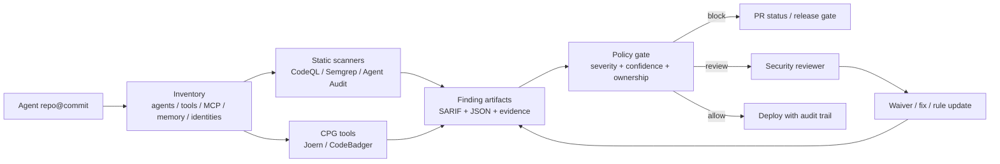
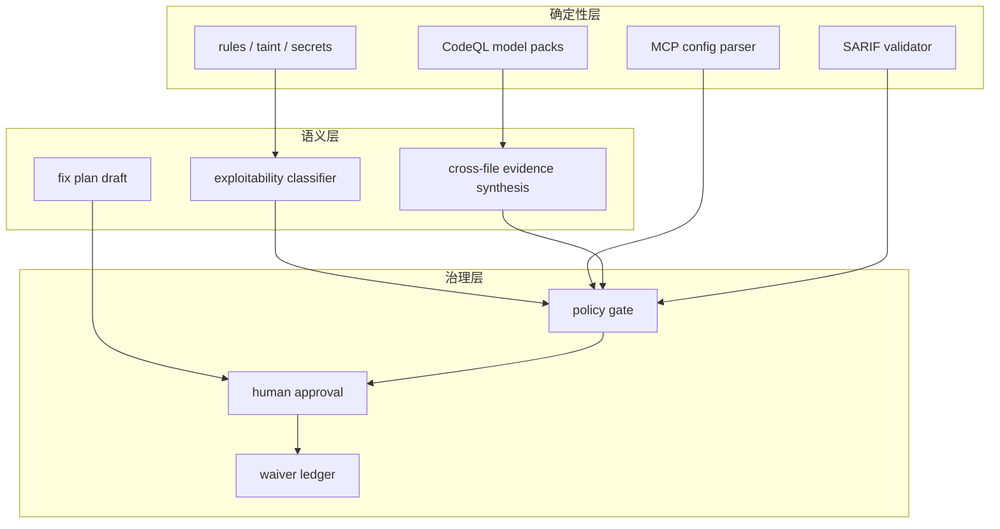

## 来源说明

本文基于 2026-06-24 的每日深度技术研究发布流程写成。今天没有看到足够支撑全新 AI memory 支柱文章的强材料；安全分支里更值得写的是 Agent 应用上线前的白盒审计关口：它把传统 SAST、Agent 专属配置检查、MCP 工具权限、CI 阻断、证据留存和人工复核连成一条发布流程。

核心来源如下：

- Haiyue Zhang、Yi Nian、Yue Zhao: [Agent Audit: A Security Analysis System for LLM Agent Applications](https://arxiv.org/abs/2603.22853), arXiv:2603.22853, submitted on 2026-03-24。论文把 LLM Agent 应用的安全面拆到 tool code、deployment artifacts 和 MCP 配置，报告 Agent Audit 结合 dataflow analysis、credential detection、structured configuration parsing 与 privilege-risk checks；在 22 个样本、42 个标注漏洞上检测到 40 个漏洞和 6 个误报，并支持 terminal、JSON、SARIF 输出。
- Agent Audit GitHub: [HeadyZhang/agent-audit](https://github.com/HeadyZhang/agent-audit)。仓库 README 把它定位为面向 AI Agent 代码的静态安全扫描器，覆盖 prompt injection、tool-boundary taint tracking、MCP configuration auditing、semantic secret detection 等；截至我访问时，README 写明有 53 条规则映射到 OWASP Agentic Top 10 2026，并支持 `agent-audit scan`、`--fail-on`、baseline、SARIF upload 和 GitHub Action。
- Lekssays 等: [Bridging Code Property Graphs and Language Models for Program Analysis](https://arxiv.org/html/2603.24837v1)。论文介绍 codebadger：一个把 Joern CPG 能力通过 MCP 暴露给 LLM Agent 的服务，提供 program slicing、taint tracking、data flow analysis 和 semantic code navigation，目标是避免 LLM 直接写复杂 CPGQL 或把整个仓库塞进上下文。
- Semgrep Blog: [Introducing Semgrep Custom Workflows](https://semgrep.dev/blog/2026/introducing-semgrep-custom-workflows/), 2026-03-18。Semgrep 把 Custom Workflows 描述成把确定性扫描、policy checks、validation 与 AI reasoning 串成 typed/testable pipeline；其中 AI 步骤用于 exploitable classification、跨文件证据合成和修复生成，而确定性工具保留扫描、策略与校验职责。
- GitHub Docs: [Creating and working with CodeQL packs](https://docs.github.com/en/code-security/tutorials/customize-code-scanning/create-and-work-with-codeql-packs) 与 [Using the CodeQL model editor](https://docs.github.com/en/code-security/how-tos/scan-code-for-vulnerabilities/scan-from-vs-code/using-the-codeql-model-editor)。文档说明 CodeQL model packs 通过 YAML data extensions 扩展对自定义依赖和框架的建模，model editor 可辅助建模 external APIs 和 dependency public APIs。
- OWASP GenAI Security Project: [OWASP Top 10 for Agentic Applications for 2026](https://genai.owasp.org/resource/owasp-top-10-for-agentic-applications-for-2026/)。它把 autonomous and agentic AI systems 的关键风险独立成框架，适合作为 Agent 应用审计规则分类的上层参照。

事实边界：Agent Audit 的实验数字来自论文摘要；GitHub 仓库的规则数、命令和评测快照来自 README，可能随版本变化；CodeBadger、Semgrep 和 CodeQL 的能力分别来自论文、厂商博客和官方文档。本文提出的上线关口、数据模型、CI 策略和一周实验计划是我的工程建议，不是上述来源共同声明的标准。

稳定 slug：`2026-06-24-agent-application-security-audit-gate`。

## 先给结论

Agent 应用的安全审计不应该只问“模型会不会被提示注入”。上线前更应该问：

- 工具函数是否把用户输入、检索内容或 Agent 中间状态传给危险操作？
- MCP 配置是否暴露凭据、过宽文件路径、未固定工具定义或不可信服务器？
- 子 Agent、工具调用、人审步骤和记忆写入是否突破了身份和权限边界？
- 发现的问题是否能用 SARIF、JSON、baseline 和 CI gate 进入正常研发流程？

我的判断是：Agent 应用需要一条专门的白盒安全审计关口。它不是替代 CodeQL、Semgrep、Joern 或人工安全评审，而是在传统 SAST 旁边增加 Agent 专属检查面，并把结果整理成可阻断、可解释、可复核、可豁免的发布证据。



这条关口的核心不是“再跑一个扫描器”，而是把 Agent 特有的攻击面纳入工程制度：工具边界、配置边界、身份边界、记忆边界和审计边界。

## 技术问题：Agent 应用把安全边界从代码扩展到了运行协议

传统 Web 应用审计通常围绕代码、依赖、配置和部署环境展开。Agent 应用多了几层会改变风险形态的东西。

第一，工具调用让自然语言上下文可以间接驱动文件、网络、数据库、shell、浏览器、票据系统和内部 API。一次普通用户输入可能不直接执行危险操作，但它可能进入 prompt、tool argument、planner state、memory 或 sub-agent instruction，最后在另一个阶段变成工具参数。

第二，MCP 和插件生态把工具权限变成运行时协议问题。一个 `mcp.json`、桌面客户端配置或远端 server 描述，可能决定 Agent 能读哪些目录、带哪些环境变量、调用哪些工具、是否固定版本，以及工具 schema 是否发生漂移。

第三，Agent 的“安全状态”不只在代码里。系统提示词、工具描述、上下文压缩、长期记忆、审批记录、trace 日志和子 Agent 分工都会影响行为。如果审计只扫描 `.py` 或 `.ts` 文件，很多真实边界不会进入视野。

Agent Audit 论文的重要性就在这里：它把问题从“LLM 模型是否安全”移动到“Agent 周边软件栈是否安全”。论文摘要明确提到 tool functions、deployment artifacts、exposed credentials 和 over-privileged MCP configurations。这个视角比单纯做 prompt injection 红队更适合作为上线前 CI 检查。

## 机制拆解：上线前关口要扫五类对象

我会把 Agent 应用审计分成五个对象层。

| 审计对象 | 典型证据 | 自动检查 | 人工复核重点 |
| --- | --- | --- | --- |
| Tool code | `@tool` 函数、function calling handler、命令执行、SQL、HTTP client | taint flow、dangerous sink、输入校验、sandbox 标记 | 工具是否真的需要写权限或外网权限 |
| MCP / plugin config | `mcp.json`、desktop config、server manifest、env | 凭据暴露、路径过宽、未固定版本、重复 tool name、无 auth | server 来源是否可信，工具变更是否可追踪 |
| Agent policy | system prompt、handoff、approval policy、iteration limit | 缺少人审、自动批准、越权 delegation、trace suppression | 哪些动作必须暂停等待批准 |
| Memory / context | 记忆写入规则、检索源、压缩摘要、用户画像 | 不可信内容写入、跨租户混用、来源缺失、过期策略缺失 | 哪些记忆能影响工具调用或身份决策 |
| CI / audit trail | SARIF、JSON、baseline、waiver、owner | new finding 阻断、严重度阈值、fingerprint、证据完整性 | 豁免是否有期限、owner 和补偿控制 |

Agent Audit 覆盖了其中一部分，尤其是 tool-boundary taint tracking、MCP configuration auditing 和 secret detection。CodeBadger 代表另一类能力：当问题需要跨函数、跨文件理解数据流时，让 Agent 调用高层 CPG 工具，而不是让模型凭检索片段猜路径。Semgrep Custom Workflows 的信号则是流程形态：确定性工具负责扫描、策略和校验，AI 负责需要语义判断的中间步骤。

这三类材料合在一起，说明一个好的审计关口应该是混合系统：



这里的权力边界要清楚：语义层可以解释和补证据，但不应该单独决定放行；确定性层可以阻断明显高危项，但对业务语义不完整的 finding 应进入人工复核，而不是被当成绝对真理。

## 工程判断：不要把 Agent 安全塞进普通 SAST 的角落

普通 SAST 对 Agent 应用仍然必要。命令注入、SQL 注入、路径穿越、硬编码密钥、SSRF、反序列化这些问题不会因为用了 LLM 而消失。但 Agent 引入了三类普通 SAST 经常看不见的差异。

第一类是协议配置风险。例如 MCP server 的文件系统根目录过宽、环境变量透传过多、server provenance 不清、工具名冲突或工具定义漂移。这些风险不一定表现为代码里的危险 sink。

第二类是控制流跨越自然语言边界。用户输入进入 system prompt 拼接、planner message、memory summary 或 tool description 后，再影响工具参数。传统 taint engine 不一定知道这些字段是“控制数据”。

第三类是审批和身份语义。是否允许自动批准工具、子 Agent 是否继承父 Agent 全量工具集、human-in-the-loop 是否能被 delegation 绕开，这些更像工作流安全和权限模型问题。

所以，我不会把 Agent 安全实现为“在普通 SAST 后面追加一个 LLM 总结”。更稳妥的做法是给它单独的审计 schema：

```yaml
agent_security_gate:
  scope:
    repo: "agent-service"
    commit: "abc123"
    authorized: true
  inventory:
    agents:
      - name: "research-agent"
        tools: ["web_search", "filesystem_read", "ticket_create"]
        memory_write: true
    mcp_servers:
      - name: "filesystem"
        command: "npx @modelcontextprotocol/server-filesystem"
        allowed_paths: ["./workspace"]
        env_policy: "deny-by-default"
  policy:
    block_on:
      - "critical"
      - "secret_exposure"
      - "tool_exec_from_untrusted_input"
      - "mcp_path_escape"
    require_human_review:
      - "new_external_tool"
      - "memory_write_affects_tool_use"
      - "subagent_privilege_expansion"
  outputs:
    sarif: "artifacts/agent-security.sarif"
    json: "artifacts/agent-security.json"
    waiver_ledger: "security/agent-waivers.yml"
```

这个 schema 的重点是让审计对象显式化。Agent 越复杂，越不能靠“大家知道这个工具不能乱用”来维持边界。

## 一个可落地的 CI/CD 方案

第一版不需要把所有能力一次做满。我会按四个阶段落地。

### 阶段 1：资产盘点和只读扫描

目标是先知道仓库里有哪些 Agent、工具、MCP server、记忆写入点和审批点。

最小做法：

- 扫描 `src/**`、`agents/**`、`tools/**`、`.mcp.json`、`mcp.json`、`.cursor/**`、`.claude/**`、workflow 配置和部署 manifests。
- 生成 `agent-inventory.json`，记录 tool name、handler、可用权限、外部依赖、env 引用、memory read/write 标记。
- 跑 Agent Audit、Semgrep/CodeQL 基线扫描和 secret scanning。
- 输出 SARIF 和 JSON，不先阻断，只在 PR comment 或 security tab 展示。

### 阶段 2：新问题阻断

目标是避免一次性历史债务压垮团队，只阻断新增高危项。

策略：

| 条件 | 处理 |
| --- | --- |
| 历史 finding | 进入 baseline，不阻断但要求 owner |
| 新 critical/high finding | 阻断 PR 或 release |
| 新 MCP server | 要求人工审批来源、权限和版本 |
| 新工具写权限 | 要求 threat model 片段和回滚方案 |
| 记忆写入影响工具调用 | 要求人工复核写入策略和清理策略 |

Agent Audit README 里的 baseline 和 `--fail-on` 模式正好适合这一阶段。关键是不要用“全量清零”作为第一天目标；真实组织里应该先阻止风险继续增加。

### 阶段 3：跨文件语义复核

目标是处理普通规则难以判断的问题，例如授权缺失、跨配置权限不一致、sub-agent 继承过宽、tool schema 漂移。

这里可以引入 CodeBadger / Joern / CodeQL model packs 这类语义工具：

- 用 CPG 或 CodeQL 找从不可信输入到 tool sink 的路径。
- 用 model packs 补齐内部框架的 source、sink、sanitizer 和 validator。
- 用 LLM 只做证据合成、路径解释和修复草案，不让它单独改 verdict。
- 对每条高风险 finding 保存 code flow、配置路径、工具版本和反证。

### 阶段 4：治理闭环

目标是让审计关口变成稳定的发布制度。

需要补齐：

- waiver ledger：每个豁免必须有 owner、理由、过期时间和补偿控制。
- rule review：误报要反向改规则或模型包，而不是靠评论淹没。
- release evidence：每次发布记录 agent inventory hash、scanner versions、SARIF hash 和人工审批。
- incident feedback：生产事件或红队发现要回灌成规则、测试或 workflow check。

## 可验证指标清单

这类关口不能只看“扫出了多少问题”。我会用下面的指标衡量是否真的有工程价值。

| 指标 | 目标 | 为什么重要 |
| --- | --- | --- |
| Agent inventory coverage | 95% 以上 Agent/tool/MCP 配置被识别 | 盘点不全时所有策略都会失真 |
| New high-risk block rate | 新高危项 100% 进入阻断或人工复核 | 防止新增风险绕过 |
| False positive triage time | 单条高危误报复核小于 15 分钟 | 避免工具伤害研发流速 |
| Waiver expiry compliance | 过期豁免 0 个 | 防止临时例外永久化 |
| Evidence completeness | 高危 finding 100% 有 location、rule、source、sink 或 config path | 让开发能复核和修复 |
| MCP permission drift | 未审批 drift 为 0 | 防止工具定义和权限悄悄变化 |
| Human approval retention | 高风险动作 100% 保留审批记录 | 事故复盘和合规需要 |
| Regression recurrence | 已修同类问题复发率下降 | 证明规则和流程在学习 |

如果一个月后只看到“扫描数量上升”，但误报复核时间、豁免过期、MCP drift 和复发率没有改善，这条关口就还没有成功。

## 我会如何实现和验证

我会先做一个一周实验，而不是直接推全公司。

第一天，选一个真实但权限可控的内部 Agent 仓库，冻结一个 commit，列出所有 Agent、tool handler、MCP 配置、记忆写入点和部署入口。输出 `agent-inventory.json`，人工抽样确认漏报。

第二天，把 Agent Audit、Semgrep 和现有 secret scanning 接到 CI，只生成 SARIF/JSON，不阻断。把结果分成“普通应用问题”和“Agent 专属问题”，看哪些是传统 SAST 已覆盖的，哪些是新攻击面。

第三天，为内部框架补一个最小 CodeQL model pack 或 Semgrep 规则，让自定义 tool decorator、approval helper、memory writer 被识别出来。目标不是写很多规则，而是证明审计工具能理解本地框架。

第四天，挑 5 条高风险或高噪声 finding 做人工 triage：每条都要求 location、source、sink/config path、攻击前置条件、反证和修复建议。误报必须记录误报原因。

第五天，启用 baseline，只阻断新增 critical/high，且所有阻断都允许通过有期限 waiver 放行。waiver 需要 owner、到期时间和补偿控制。

第六天，模拟一次权限变更：新增 MCP server、扩大文件路径或让子 Agent 继承工具集，验证 CI 是否要求人工复核。

第七天，复盘指标：漏识别了哪些 Agent 资产、哪些 finding 不能复核、哪些规则误报最高、开发是否能在 15 分钟内理解阻断原因。只有这些问题可控，才扩大到更多仓库。

## 适用场景

这套方案适合正在把 Agent 放进真实研发、运营、安全、数据分析或企业知识流程的团队，尤其是 Agent 能调用内部系统、读写文件、发起网络请求、创建工单、查询数据库或写入长期记忆时。

它也适合安全团队评审 MCP server、内部 Agent 平台、AI coding workflow、企业知识库 Agent 和自动化研究/运营 Agent。它的价值不是证明模型永远安全，而是让“Agent 软件栈是否越权”变成可扫描、可阻断、可复核的问题。

不适合的场景：

- 只做一次性 demo，没有真实权限和部署路径。
- 没有 CI/CD 或代码评审制度，扫描结果无人接收。
- 组织希望工具自动替代所有安全判断，不愿保留人工审批和 waiver 管理。
- 没有授权边界的外部扫描。本文只讨论自有或明确授权系统的防御性白盒审计。

## 失败模式

| 失败模式 | 表现 | 缓解 |
| --- | --- | --- |
| 只扫代码不扫 MCP/config | 工具权限和凭据暴露漏掉 | 把配置文件和部署 artifacts 作为一等输入 |
| 只看 scanner 数量 | backlog 增长但风险没下降 | 用 new finding、MTTR、复发率和 waiver expiry 衡量 |
| LLM 负责最终放行 | 语义解释越权成决策 | verdict 来自策略机和人工复核，LLM 只补证据 |
| baseline 永久化 | 历史高危长期不修 | baseline 要有 owner、SLA 和分批清理计划 |
| 规则不懂内部框架 | 大量漏报或误报 | 用 CodeQL model packs / Semgrep rules 建模本地框架 |
| MCP server 漂移 | 审计后工具 schema 或权限变化 | 固定版本、记录 schema hash、CI 校验 drift |
| 人审点过多 | 研发绕过流程 | 只把高风险动作放入人审，低风险自动记录 |
| 证据不可复核 | 开发无法定位和修复 | 输出 SARIF/JSON，保留 location、path、rule 和 code flow |

## 局限分析

第一，Agent Audit 的论文实验规模仍然有限，GitHub README 的 benchmark 也不能直接代表所有企业 Agent 框架。它适合作为方向和起点，不应被当作通用充分证明。

第二，CodeBadger/CPG 能增强跨文件语义分析，但 CPG 构建和查询有成本，对动态语言、运行时插件、反射和框架魔法仍会有盲区。论文也提到非常大的仓库会有资源开销，运行时漏洞如竞态并不是它的强项。

第三，Semgrep Custom Workflows 展示的是厂商平台方向，其中部分能力处于 private beta。工程判断可以借鉴“确定性扫描 + AI 语义步骤 + 可审计 workflow”的形态，但具体实现要看团队已有工具栈。

第四，任何 CI gate 都会制造摩擦。没有 owner、waiver、误报修正规则和指标复盘，安全关口很快会被视为噪声来源。

## 自审

- 事实可靠性：核心事实来自 arXiv 论文、GitHub 仓库 README、GitHub 官方文档、Semgrep 官方博客和 OWASP 官方页面；涉及版本和规则数量的描述已标注可能随时间变化。
- 来源完整性：每个关键判断都能追溯到原始来源或明确标为我的工程建议。
- 是否只是复述：不是。文章把 Agent Audit、CodeBadger、CodeQL model packs 与 Semgrep Workflows 组合成上线前审计关口，并给出了对象层、CI 阶段、schema、指标和一周实验计划。
- 是否标题党：标题限定为“上线前白盒安全审计关口”，没有夸大为彻底解决 Agent 安全。
- 是否薄内容：包含机制图、表格、CI 落地方案、指标清单、具体实验计划和失败模式。
- 是否把猜测写成事实：工具能力和实验数字按来源表述；关口设计、schema 和阶段路线明确是我的建议。
- 站内重复：与 2026-06-20 的 narration gap 和 2026-06-21 的 verified vulnerability pipeline 有关联，但本文聚焦 Agent 应用自身的 tool/MCP/policy/memory/CI 审计关口，选题不重复。
- 安全边界：只讨论授权白盒扫描、防御建设、CI 审计和安全工程，没有提供攻击第三方目标的操作流程。
