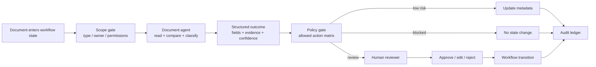

## 来源说明

本文基于 2026-06-25 的每日深度技术研究发布流程写成。今天 AI memory 与安全工程分支没有看到足够支撑全新支柱文章的强材料；更值得发布的是 AI Native 实践分支：文档型 Agent 正在从“帮我找答案”走向“读文档、做判断、改属性、创建对象、推动流程”，这要求工程侧先设计可审计动作流。

核心来源如下：

- M-Files Press Release: [M-Files Expands Agentic AI Capabilities with New Agents That Deliver Context-Aware Automation](https://www.m-files.com/press-releases/m-files-ai-agents/), 2026-06-24。M-Files 宣布 Custom Agents Beta 以及 Metadata Agent、Insights Agent、Task Agent、Quality Agent、Contracts Agent 等组合；其中 Custom Agents 可用自然语言配置，读取文档和业务上下文，只更新有权限修改的属性，并把 reasoning 与 source 记录到 metadata card。
- M-Files Community: [M-Files Custom Agents — Public Beta Available for Customers Now](https://community.m-files.com/blogs-65091858/b/product-news/posts/m-files-custom-agent), 2026-06-24。该文给出更工程化的工作方式：对象进入配置了 Agent 的 workflow state 后，Agent 读取内容和上下文，返回结构化结果，更新触发对象的属性或创建相关对象，并记录每次结果背后的 reasoning。
- M-Files Platform: [AI Document Management System with Smarter Automation](https://www.m-files.com/m-files-platform/capabilities/artificial-intelligence/)。该页把 M-Files AI 描述为覆盖 metadata extraction、workflow automation、conversational experience 的 AI fabric，并强调 contextual data foundation、dynamic permissions、tracking、policy-based governance。
- M-Files Community: [M-Files Aino GenAI Technology](https://community.m-files.com/p/m-files_aino)。该页说明 Aino Metadata Agent at Scale 可由管理员配置批量 enrich 条件，按自然语言指令设置 metadata，作为 admin-triggered background process 运行，并在需要时通过 custom views 做人工验证。
- Box Blog: [A complete guide to agentic AI governance](https://blog.box.com/complete-guide-agentic-ai-governance-0)。Box 把 agentic governance 定义为 delegated authority 的管理问题：Agent 能访问什么、调用什么工具、哪些动作不需要人工确认；它还强调内容层治理要让 Agent 继承人类用户相同的安全与合规边界。
- LlamaIndex Blog: [Agentic Document Processing: How AI Agents Are Automating Complex Workflows](https://www.llamaindex.ai/blog/agentic-document-processing)。该文区分 document extraction 与 document understanding，并把文档 Agent 架构拆成 LLM reasoning/planning、knowledge base/RAG、APIs/ERP/tools、structured output，同时建议从 bottleneck documents、knowledge base 和 manageable pilot 起步。

事实边界：M-Files 的能力、可用性和产品命名来自厂商发布与社区页；Box 与 LlamaIndex 的材料是厂商/平台视角，不等同于中立评测。本文的合同合规工作流、数据结构、SOP、指标和回滚方案是我的工程建议，不是上述来源共同声明的标准。

稳定 slug：`2026-06-25-document-agent-audit-workflow`。

## 先给结论

文档型 Agent 的关键变化不是“摘要更准了”，而是它开始能改状态、写属性、创建相关对象和推进流程。只要 Agent 会产生副作用，系统设计就不能只围绕 prompt、RAG 和模型效果展开，而要围绕动作授权、证据绑定、人工复核和回滚能力展开。

我的建议是：第一批文档 Agent 不要做全自动合同审批，也不要做泛化企业知识问答。更稳的落点是“合同合规初筛”这类文档密集、规则明确、可人工复核、动作可分级的流程。Agent 可以读合同、对照 playbook、生成结构化差异、更新内部属性和创建复核任务；但客户承诺、法务结论、合同状态变更必须由人批准。



这篇文章的核心判断：文档 Agent 的上线单元不是“一个聊天入口”，而是一条带状态机的可审计动作流。

## 场景定义：合同合规初筛

选一个具体场景：供应商合同进入审批流程后，企业需要检查付款条款、责任限制、数据处理条款、续约/终止条件、SLA、审计权和偏离标准模板的条款。传统流程里，法务或采购同事要读合同、查内部 playbook、手动填字段、标注风险、找业务方确认，再推动审批。

AI Native 后，不应该让 Agent 直接“批准合同”。更合适的目标是把初筛变成结构化、可追溯、可复核的中间层：

- Agent 读取合同和相关上下文。
- Agent 对照组织的合同 playbook 和审批规则。
- Agent 输出条款差异、风险等级、证据位置和建议下一步。
- 系统只允许 Agent 更新低风险 metadata 或创建复核任务。
- 人工审批后，流程才进入下一状态。

这个范围够窄，能一周内验证；同时又足够真实，因为它包含文档理解、业务规则、权限边界、结构化输出、人审和审计。

## 原流程痛点

| 原步骤 | 常见问题 | Agent 可介入点 |
| --- | --- | --- |
| 人工读取合同 | 长文档、附件、表格和修订痕迹耗时 | 解析文档并提取候选条款 |
| 对照 playbook | 规则散在 Wiki、模板和历史合同里 | 检索适用规则并绑定证据 |
| 填审批字段 | 重复劳动，字段口径不稳定 | 生成结构化 metadata 建议 |
| 标注风险 | 不同 reviewer 标准不一致 | 按统一 rubric 输出风险等级 |
| 推动下一步 | 待办不清，低风险事项排队 | 低风险自动建任务或路由 |
| 复盘争议 | 很难还原当时依据 | 保存 source、reasoning、版本和人工修改 |

真正的瓶颈不是“没人会总结合同”，而是合同里的判断没有被转成稳定的数据流。没有数据流，就没有质量评估、权限控制、成本账本和复盘。

## 目标工作流

我会把第一版拆成五个角色。

| 角色 | 职责 | 输入 | 输出 | 禁止动作 |
| --- | --- | --- | --- | --- |
| Intake Gate | 判断文档是否适合 Agent 处理 | 文档类型、合同金额、供应商、owner、权限 | `run.yaml` 与处理范围 | 不读无权限文档 |
| Document Parser | 把合同转成可引用片段 | PDF、Word、附件、版本 | clause spans、tables、source ids | 不做合规结论 |
| Compliance Agent | 对照 playbook 做初筛 | clause spans、playbook、历史例外 | 风险项、证据、置信度、字段建议 | 不批准合同 |
| Policy Gate | 根据动作矩阵决定能否写入 | 字段建议、风险等级、权限 | allow / review / block | 不覆盖人工决定 |
| Reviewer | 修改、批准或驳回 | Agent 证据包和建议 | 最终字段、审批意见、回滚指令 | 不跳过审计记录 |

这个分工故意保守。一个“全能合同 Agent”看起来更省事，但上线时最难排查。拆成五段后，每段失败都能定位：是解析错、检索错、规则错、判断错，还是越权写入。

## 数据与权限边界

文档 Agent 的数据模型至少要保留四类信息：证据、判断、动作和审计。只存一段自然语言总结是不够的。

```json
{
  "workflow": "contract-compliance-screening",
  "document_id": "contract-2026-0625-018",
  "document_version": "v3",
  "scope": {
    "contract_type": "supplier_master_agreement",
    "allowed_actions": ["suggest_metadata", "create_review_task"],
    "blocked_actions": ["approve_contract", "send_external_email"]
  },
  "finding": {
    "clause": "limitation_of_liability",
    "risk": "review_required",
    "evidence": [
      {
        "source_id": "span-144",
        "page": 12,
        "text_hash": "sha256:...",
        "playbook_rule": "liability_cap_must_not_exclude_data_breach"
      }
    ],
    "reasoning_summary": "该条款包含责任上限，但未明确排除数据泄露责任，需要法务复核。",
    "confidence": 0.78
  },
  "proposed_action": {
    "type": "create_review_task",
    "assignee_role": "legal_reviewer",
    "metadata_updates": {
      "compliance_status": "needs_review",
      "risk_area": "liability"
    }
  }
}
```

权限上要遵守三条底线。

第一，读取权限继承人类用户或服务账号的最小权限。Agent 不应因为“需要上下文”就绕过文档系统的权限模型。

第二，写入权限按字段分级。`risk_area`、`needs_review`、`extracted_effective_date` 可以低风险自动建议；`approved`、`contract_value_confirmed`、`legal_acceptance` 必须人工确认。

第三，审计记录不可由 Agent 覆盖。Agent 可以追加 reasoning、source 和 confidence，但不能删除被驳回的建议，也不能改写人工审批意见。

## 可复制 SOP

第一周只做一个合同类型、一个团队、一个工作流状态。不要一上来覆盖所有合同和所有业务线。

1. 建立 `workflows/contract-compliance-screening/`，放 `run.yaml`、`playbook.md`、`field-map.yml`、`action-policy.yml`、`evidence/`、`reviews/` 和 `ledger/`。
2. 选 20 份历史合同，要求至少包含 5 份有已知条款偏离、5 份低风险、5 份格式复杂、5 份带附件或修订痕迹。
3. 把 playbook 写成 Agent 可引用的规则表，而不是一篇泛泛的法务指南。
4. Parser 先只输出 clause spans 和表格，不输出风险判断。
5. Compliance Agent 输出结构化 finding，每条 finding 必须引用合同片段和 playbook rule。
6. Policy Gate 只允许 `suggest_metadata` 和 `create_review_task`，禁止批准合同、发送外部邮件、修改最终法律结论。
7. Reviewer 抽样复核所有 high risk 和 20% low risk，记录每条修改原因。
8. 通过后再接入真实 workflow state，但前两周保持 shadow mode：Agent 写入草稿字段，不推动正式审批状态。
9. 两周后只放开低风险 metadata 更新，仍保留高风险人工审批。
10. 每周复盘误判、漏判、越权尝试、人工修改和处理时长，只改一个最影响质量的环节。

目录结构可以很简单：

```text
workflows/contract-compliance-screening/
  run.yaml
  playbook.md
  field-map.yml
  action-policy.yml
  evidence/
  reviews/
  ledger/
```

这比接一个大平台 API 更重要。没有这些文件，团队很快会只剩“某次 Agent 好像判断错了”的口头争论。

## 工具栈选择理由

如果企业已经使用 M-Files 这类 metadata-driven 文档系统，优先把 Agent 放在已有 workflow state、metadata card、permission model 和 audit trail 里。M-Files 这次发布的信号就在这里：Agent 不是另开一个聊天窗口，而是嵌入对象状态变化和元数据更新。

如果使用 Box、SharePoint、Google Drive 或自建文档库，也应复刻同样的架构：内容层权限、动作矩阵、字段级写入、人工复核和审计 ledger。平台不同，控制点不能少。

如果需要从 PDF、扫描件和复杂表格起步，可以先用文档解析/IDP 工具把内容转成 clause spans、tables 和 source ids，再让 Agent 做判断。LlamaIndex 对 extraction 与 understanding 的区分很有用：抽字段只是第一步，判断这些字段对业务规则意味着什么才是 Agent 工作流的价值。

## 质量评估

| 指标 | 计算方式 | 第一阶段门槛 |
| --- | --- | --- |
| Clause recall | 人工标注关键条款中被 Parser 找到的比例 | 90% 以上 |
| Evidence precision | Agent 引用证据确实支撑 finding 的比例 | 85% 以上 |
| High-risk miss rate | 人工发现但 Agent 漏掉的高风险项 | 0 个进入自动放行 |
| Metadata correction rate | 人工修改 Agent 字段建议的比例 | 连续下降 |
| Review time saved | 人工基线耗时减去 Agent 后复核耗时 | 至少节省 30% |
| Unauthorized action attempts | 被 Policy Gate 阻断的越权动作 | 必须可解释且为 0 个漏放 |
| Audit completeness | finding 是否有 source、rule、confidence、reviewer | 100% |
| Rollback success | 能否撤销 Agent 写入并恢复原状态 | 100% 抽样通过 |
| Cost per accepted contract | 模型/解析/人工成本除以通过合同数 | 可解释且可控 |

不要用“Agent 生成了多少摘要”衡量成功。真正要看的是：漏掉高风险了吗？证据能复核吗？人工是否少做了重复劳动？流程状态有没有被错误推进？审计员能否还原当时依据？

## 成本估算

第一版可以用粗账本，不需要复杂 FinOps 系统：

```text
run_cost =
  document_parse_cost
  + model_input_output_cost
  + retrieval_cost
  + reviewer_minutes * internal_rate
  + correction_minutes * internal_rate

net_saving =
  baseline_manual_minutes * internal_rate
  - run_cost
```

如果 Agent 把每份合同从 45 分钟初筛降到 15 分钟复核，但每 10 份合同产生 2 份返工，仍要把返工时间算进去。合同工作流尤其不能只算模型 token，因为法务误判的下游成本远高于推理成本。

## 失败模式与回滚

第一类失败是解析错。PDF 表格、修订痕迹或附件没有被正确拆分，导致后续判断建立在错误文本上。回滚方式是冻结 Agent finding，只保留原文和解析 artifact，重新跑 Parser，不允许自动写字段。

第二类失败是 playbook 过宽。规则写成“检查是否合规”这种泛化指令，Agent 会自由发挥。回滚方式是把规则拆成可枚举条件、例外条件和需要人工复核的灰区。

第三类失败是误把建议当结论。Agent 给出 `needs_review` 被下游系统解释成 `approved`。回滚方式是字段命名和状态机分离：草稿字段、建议字段、正式审批字段不能共用。

第四类失败是权限漂移。服务账号能读到 reviewer 本人无权访问的历史合同或客户资料。回滚方式是按 workflow scope 建 allowlist，并把每次读取的 permission scope 写入 ledger。

第五类失败是审核疲劳。Agent 每份合同都生成十几个中风险提醒，reviewer 不再认真看。回滚方式是把 finding 分成 block、review、observe 三档，只让高风险和低置信项进入强制复核。

第六类失败是审计不可用。Agent 写了 reasoning，但没有 source id、文档版本或 rule id。回滚方式是拒绝落库：缺少证据字段的 finding 只能存在临时草稿，不得更新 metadata。

## 一周实验计划

第 1 天：选定一个合同类型，收集 20 份历史样本和人工审批结果，写出最小 `playbook.md` 与 `action-policy.yml`。

第 2 天：跑文档解析，只评估 clause recall 和表格/附件处理，不让 Agent 做任何判断。

第 3 天：让 Compliance Agent 对历史合同生成 finding，要求每条 finding 有 source id、rule id 和 confidence。

第 4 天：Reviewer 盲审 Agent 输出，记录漏判、误判、证据不充分、字段建议错误和表达不清。

第 5 天：接入 Policy Gate，验证所有高风险动作都进入人工复核，所有正式审批字段都不可自动写入。

第 6 天：用 5 份新合同 shadow run，Agent 只写草稿字段和复核任务，不推动 workflow state。

第 7 天：复盘指标。如果高风险漏判、证据缺失或越权写入任一项失败，不上线；如果通过，只放开低风险 metadata 建议，不放开自动批准。

## 工程判断

M-Files 的新材料有价值，不是因为某个产品功能本身，而是它把 Agent 放到了企业内容对象的状态机里：对象进入 workflow state，Agent 读取上下文，输出结构化结果，写 metadata 或相关对象，并留下 reasoning/source。这个形态比“企业知识库聊天机器人”更接近 AI Native 工作流。

但我不会把它理解成“文档流程可以全自动”。文档工作流的风险在于判断会变成状态，状态会触发动作，动作会影响合同、客户、合规和财务。越靠近动作，越需要把 Agent 当成一个受控执行者，而不是一个自由助手。

最小可上线版本应该只有三种能力：

- 生成带证据的条款 finding。
- 建议低风险 metadata。
- 创建人工复核任务。

自动批准、自动外发、自动修改法律结论都应该延后，直到团队证明漏判率、审计完整性、权限边界和回滚机制可控。

## 自审

事实可靠性：关键事实来自 M-Files 官方发布、M-Files 社区页、M-Files 平台页、Box 博客和 LlamaIndex 博客；已明确厂商材料边界，没有把产品主张写成独立评测结论。

来源完整性：每个关键判断都有来源或被标注为我的工程建议；没有只复述发布稿，而是落到合同合规初筛的工作流设计。

站内重复：本站 2026-06-16 写过企业上下文层，2026-06-23 写过 session-centered workflow。本文更窄，聚焦文档对象状态机、metadata 写入、动作矩阵和审计 ledger，不重复前文。

工程价值：包含流程图、角色分工表、数据结构、SOP、指标、成本账本、一周实验计划和回滚方案，可用于真实团队试点。

标题与边界：标题没有宣称产品效果，只强调文档型 Agent 上线前的可审计动作流。本文不涉及攻击第三方目标，只讨论企业内部授权工作流、防御性治理和质量控制。
