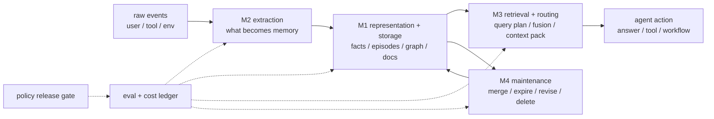

## 来源说明

本文基于 2026-06-26 的每日深度技术研究发布流程写成。今天 AI memory 分支有足够强的新材料发布一篇支柱笔记：一篇新论文不再把 memory system 当成黑盒，而是从数据管理视角拆成四个可单独评测和替换的模块；配套仓库也把多类方法、benchmark 和运行产物放进统一执行框架。

核心来源如下：

- Wei Zhou 等: [Are We Ready For An Agent-Native Memory System?](https://arxiv.org/abs/2606.24775), arXiv:2606.24775, submitted on 2026-06-23。论文提出四模块分析框架：memory representation and storage、memory extraction、memory retrieval and routing、memory maintenance；作者报告评测了 12 个代表性 memory systems 与 2 个参考基线，覆盖 5 类 benchmark workloads 和 11 个 datasets，并从任务效果、检索保真、动态更新鲁棒性、长程稳定性和运行成本五个角度比较。
- OpenDataBox: [MemoryData](https://github.com/OpenDataBox/MemoryData)。仓库 README 将其描述为统一 memory benchmark suite，提供 `main.py` 启动入口、4 个 benchmark families、22 个 method presets、稳定 artifact layout，以及 Long Context、Embedding RAG、BM25、Mem0、MemoChat、GraphRAG、HippoRAG、Letta、A-MEM、SimpleMem、MemOS 等方法适配。
- Yasmine Omri 等: [Agent Memory: Characterization and System Implications of Stateful Long-Horizon Workloads](https://arxiv.org/abs/2606.06448), arXiv:2606.06448, submitted on 2026-06-04。该文把 agent memory 当成 stateful workload，强调 construction、retrieval、generation、maintenance 的生命周期成本会改变架构选择。
- Xingyu Chen 等: [AdaMem: Learning What to Remember for Personalized Long-Horizon LLM Agents](https://arxiv.org/abs/2606.21144), arXiv:2606.21144。AdaMem 的 role-specific Memory Policy、weekly QA feedback、patch-style reflection 和 rollback 说明：写入策略本身也应该被版本化和评测，而不是固定成“尽量多记”。
- Zhenhao Zhang 等: [E-mem: Multi-Agent Based Episodic Context Reconstruction for LLM Agent Memory](https://arxiv.org/abs/2601.21714)。E-mem 把问题指向 destructive de-contextualization：过早把长序列压成事实、向量或图，可能破坏多跳和时序推理需要的上下文完整性。

事实边界：论文指标、模块划分和实验结论来自作者报告的预印本与仓库 README；本文的控制面设计、数据结构、发布门禁和落地路线是我的工程建议，不是上述来源共同声明的生产标准。

稳定 slug：`2026-06-26-agent-native-memory-control-plane`。

## 先给结论

Agent memory 不能再按“要不要接一个长期记忆库”来讨论。更准确的问题是：一个长期运行的 Agent，在写入、表示、检索、路由、维护、删除、回放和成本控制上，是否有一套可审计的控制面。

2606.24775 的价值不在于宣布某个 memory 架构胜出。相反，它给出的关键结论更克制：没有单一架构在所有 workload 上占优；图结构、混合检索、显式规划、保守合并、长上下文和轻量 append store 都有各自的适用边界。工程上应该停止把 memory backend 当成可随意替换的黑盒，而要把每次 memory policy 变更当成一次系统发布。

我会把 Agent 原生记忆系统拆成四个受控模块：



一句话：memory system 的核心不是存得更多，而是每一层都能解释“为什么写、怎么存、如何取、何时改、错了怎么回滚”。

## 技术问题：黑盒 memory 评测为什么会误导

长期记忆系统很容易在 demo 里显得有效：Agent 记住用户偏好、找回历史事实、总结旧任务、跨会话延续上下文。但生产失败通常不发生在“完全找不到记忆”这种简单场景，而发生在更细的模块边界。

| 失败位置 | 表面症状 | 真正要定位的问题 |
| --- | --- | --- |
| 抽取 | Agent 记住了无关闲聊，漏掉关键约束 | 写入策略是否有 role、scope、价值判断 |
| 表示 | 摘要看似正确，但丢掉时序和因果链 | 存储形态是否适合 workload |
| 检索路由 | top-k 召回相关片段，却不支持下一步动作 | query plan、融合和 evidence packing 是否正确 |
| 维护 | 旧事实覆盖新事实，或新事实无法合并 | 合并、版本、过期和冲突规则是否可回放 |
| 成本 | 答对率提升很小，写入和维护成本暴涨 | construction 与 query 成本是否可摊销 |

如果只看 end-to-end success rate，团队只能知道“这次好像更好”，却不知道改进来自哪里，也不知道下一个场景会坏在哪里。2606.24775 把 memory 拆成四个模块，意义就在这里：它让 memory failure 可以被归因，而不是被归咎为“模型不稳定”。

## 机制拆解：四模块不是论文分类，而是发布边界

### M1：Representation And Storage

M1 决定记忆以什么形态存在：原始长上下文、chunk、向量、关键词索引、图、树、topic document、typed memory block、episode archive，还是多种形态并存。

2606.24775 报告的一个重要观察是：结构化系统并不总是换来成比例的准确率收益，却会带来更高的 index construction time 和 query latency。2606.06448 也从 stateful workload 角度提醒，construction 成本可能被转移到用户看不见的写入阶段。

工程判断：M1 不能按“图比向量高级”来选。要按 workload 的证据形态选：

| Workload | 默认表示 | 不适合的原因 |
| --- | --- | --- |
| 简单事实回忆 | BM25 / dense chunk / atomic fact | 上图谱可能过重 |
| 多实体关系 | graph / typed relation | 纯向量难解释关系路径 |
| 长程时序推理 | episode / raw span / event log | 过早摘要会破坏顺序 |
| 个人偏好 | scoped fact + provenance | 原始全文会带来隐私和噪声 |
| 项目执行状态 | structured state + event log | 自然语言摘要难回滚 |

我的默认做法是保留 append-only event log 作为事实来源，再按场景生成派生视图。派生视图可以重建，事件日志不能被 LLM 直接改写。

### M2：Memory Extraction

M2 决定什么内容有资格进入长期记忆。很多系统默认“抽到事实就存”，但 AdaMem 的问题设定更接近生产：不同用户、角色和场景里，值得记住的东西不同；统一抽取会造成 memory bloat，让无关事实挤占上下文预算。

这里的关键不是写一个更长的 extraction prompt，而是把写入策略版本化：

```yaml
memory_policy:
  id: "research-agent-policy-v4"
  role: "technical-research-assistant"
  write:
    keep:
      - "user-stated research priorities"
      - "source credibility decisions"
      - "rejected topics and reasons"
      - "stable project constraints"
    ignore:
      - "one-off greetings"
      - "temporary formatting preference"
      - "unverified claims without source"
  scope:
    project_id_required: true
    cross_project_reuse: "deny_by_default"
  rollback:
    previous_policy: "research-agent-policy-v3"
    eval_gate: "weekly-memory-qa"
```

每次改 M2，都应该跑“写入差分”：新策略比旧策略多写了什么、少写了什么、哪些样本变成了错误记忆、哪些关键事实被漏掉。

### M3：Retrieval And Routing

M3 是最容易被误简化的一层。很多系统把它当成 top-k 检索，但 2606.24775 的消融更细：适度的 hybrid fusion、显式 planning、balanced routing 可能改善检索；但额外 reflection 不一定继续带来收益，还可能增加开销或扰乱路由。

工程判断：M3 的目标不是“召回相关文本”，而是“给当前动作注入足够、必要、不过量的证据”。这需要记录四件事：

| 字段 | 用途 |
| --- | --- |
| `query_plan` | 本次为什么查这些 memory spaces |
| `retrieval_candidates` | 候选、分数、来源、版本 |
| `packed_context` | 最终进入 prompt 的证据和排序 |
| `use_trace` | Agent 是否实际引用或依赖这些证据 |

没有 `use_trace`，检索评测会停在 recall；没有 `query_plan`，路由失败只能靠猜。

### M4：Memory Maintenance

M4 负责合并、过期、冲突处理、删除、重嵌入和重建索引。它是长期记忆里最像数据库维护的一层，但很多 Agent 项目把它塞进“后台总结任务”。

2606.24775 报告 conservative consolidation 比 delayed flushing 或过粗摘要更稳；E-mem 从另一个方向提醒，过早压缩会造成 de-contextualization，尤其损害复杂多跳和时序推理。两者合起来看，维护层的默认策略应该保守：宁可多保留可回放证据，也不要把不可逆摘要当成唯一事实。

维护层至少要支持三种回滚：

| 回滚对象 | 触发条件 | 回滚方式 |
| --- | --- | --- |
| 单条记忆 | 用户纠错、来源撤销、权限变化 | 标记 superseded，保留旧版本 |
| 派生视图 | 合并策略出错、召回下降 | 从 event log 重建 |
| 策略版本 | 新 maintenance policy 导致回归 | 切回旧 policy，重放样本 |

## 工程落地方案：Memory Policy Release Gate

我会把 memory 系统的每次改动都走一个轻量 release gate。它不需要新平台，先用 YAML、JSONL 和 nightly eval 就够。

目录结构：

```text
memory-control-plane/
  policies/
    extraction/research-agent-v4.yaml
    retrieval/hybrid-planning-v2.yaml
    maintenance/conservative-merge-v3.yaml
  evalsets/
    long-session-qa.jsonl
    conflict-update.jsonl
    temporal-reasoning.jsonl
    security-scope.jsonl
  runs/
    2026-06-26-memory-policy-v4/
      manifest.yaml
      memory_writes.jsonl
      retrieval_traces.jsonl
      maintenance_events.jsonl
      cost_ledger.jsonl
      failures.review.jsonl
      report.md
```

一次 policy 发布至少回答五个问题：

1. 新策略在哪个模块生效：M1、M2、M3、M4，还是组合变更。
2. 对固定 evalset 的任务成功率、证据召回、冲突更新、长程稳定性和成本有什么变化。
3. 新增写入是否可解释，删除或忽略的候选是否可接受。
4. 失败样本能否归因到具体模块，而不是只看最终答案。
5. 回滚后能否恢复旧行为和旧派生视图。

发布门禁可以很小：

```yaml
release_gate:
  block_if:
    critical_fact_miss_rate: "> 0.02"
    stale_fact_answer_rate: "> 0.01"
    cross_scope_retrieval: "> 0"
    p95_retrieval_latency_ms: "> 800"
    construction_cost_multiplier: "> 3.0"
  require_review_if:
    new_memory_write_rate_delta: "> 0.25"
    maintenance_merge_rate_delta: "> 0.20"
    task_success_delta: "< 0"
  allow:
    rollout: "10_percent"
    rollback_policy: "previous_policy_and_rebuild_views"
```

这不是为了制造流程，而是防止 memory 变更静默污染长期状态。Agent 记忆一旦进入生产，错误不是只影响一轮回答；它会被后续检索、总结和工具调用反复放大。

## 可验证指标清单

| 指标 | 对应模块 | 说明 |
| --- | --- | --- |
| Write precision | M2 | 写入的 memory 是否确实值得长期保留 |
| Critical fact miss rate | M2 | 关键事实没有写入的比例 |
| Representation replay fidelity | M1 | 派生表示能否回放到原始证据 |
| Evidence retrieval support | M3 | 检索证据是否足以支持回答或动作 |
| Packed-context waste | M3 | 注入但未被使用的 memory token 比例 |
| Temporal error rate | M1/M3/M4 | 时序问题中旧事实、新事实是否排序正确 |
| Conflict resolution accuracy | M4 | 冲突更新后是否使用最新有效事实 |
| Stale answer rate | M4 | 已过期记忆仍影响输出的比例 |
| Construction p95 | M1/M2/M4 | 写入、抽取、建索引的尾延迟 |
| Retrieval p95 | M3 | 查询和上下文组装尾延迟 |
| Cost per useful memory | M2/M4 | 被后续使用的有效记忆摊销成本 |
| Rollback success rate | M4 | 策略回滚和视图重建是否成功 |
| Cross-scope retrieval count | M3 | 跨用户、跨项目、跨权限召回次数 |

我尤其会盯 `packed-context waste`。很多 memory 系统看起来召回率不错，但把大量“可能相关”的历史塞进 prompt，既增加成本，又提高误用旧事实和泄露上下文的概率。

## 我会如何实现和验证

第一步，不换 memory backend，先加 event log。每次用户输入、工具结果、Agent 输出、memory write、retrieval query、packed context、maintenance event 都写 JSONL。没有日志，任何架构讨论都是猜。

第二步，选 100 条真实或半真实长程任务，做四类 frozen evalset：简单召回、冲突更新、时间顺序、多跳组合。每条样本保留 expected evidence，不只保留 final answer。

第三步，把当前系统拆成四个接口：

```ts
type MemoryEvent = {
  scopeId: string;
  sourceId: string;
  text: string;
  createdAt: string;
};

type MemoryWrite = {
  policyId: string;
  value: string;
  kind: "fact" | "episode" | "state" | "preference";
  evidence: string[];
};

type RetrievalTrace = {
  queryPlan: string[];
  candidates: { id: string; score: number; version: string }[];
  packed: string[];
};
```

第四步，只做一个策略变更：例如把“统一抽取”改成“role-specific extraction policy”。跑旧策略和新策略的写入差分，人工复核前 50 条新增写入和前 50 条漏写候选。

第五步，跑 retrieval trace 对比：同一批问题下，新策略是否减少无关 memory、是否漏掉关键 evidence、是否提高 stale answer rate。

第六步，做回滚演练：把 policy 切回旧版本，从 event log 重建派生视图，确认旧 evalset 分数和检索 trace 能恢复到可接受范围。

一周内可验证的目标很具体：

| 天数 | 交付物 | 通过标准 |
| --- | --- | --- |
| Day 1 | event log schema + 当前 memory trace | 能复盘 20 条真实会话 |
| Day 2 | frozen evalset v1 | 每题有 expected answer 和 evidence |
| Day 3 | M2 policy v1/v2 对比 | 输出写入差分和漏写样本 |
| Day 4 | M3 retrieval trace | 能定位每个回答用到的 memory |
| Day 5 | M4 rebuild script | 派生视图可从 event log 重建 |
| Day 6 | release gate report | 指标表、失败归因、成本账本齐全 |
| Day 7 | 10% shadow rollout | 只记录不影响正式回答 |

## 适用场景

这套四模块控制面适合长期运行、会跨会话复用状态的 Agent：个人研究助手、代码 Agent、客户支持 Agent、企业知识库 Agent、安全审计 Agent、运营自动化 Agent。

它尤其适合三类团队：

- 已经接了 Mem0、Letta、Zep、GraphRAG、SimpleMem、A-MEM 或自研 memory store，但线上行为很难解释。
- 正在从短会话聊天走向长程工作流，开始出现旧事实污染、新事实覆盖、跨项目记忆泄漏和上下文膨胀。
- 需要比较多种 memory backend，但不想把模型、prompt、工具和 memory policy 混在一起做不可复现 A/B。

不适合的场景也明确。如果应用只是短文档问答、一次性摘要、无跨会话状态的小工具，完整控制面过重。此时保留来源引用、简单检索评测和人工抽样就够。

## 失败模式

第一，模块拆了，日志没留。接口看起来清晰，但没有 event、write、retrieval、maintenance trace，事故时仍然无法复盘。

第二，把派生摘要当事实源。LLM 合并后的 topic document 或 profile 只能是视图，不能替代原始事件和证据。

第三，过度信任图结构。图能表达关系，但关系抽取错了会更难发现；图遍历也会放大旧边、错边和跨作用域边。

第四，只优化检索，不管使用。召回 evidence 不等于 Agent 真的基于 evidence 行动。必须记录 packed context 和 use trace。

第五，维护策略不可回滚。自动合并、删除、过期和重嵌入如果没有版本和重建脚本，会把错误固化进长期状态。

第六，评测集没有权限样本。memory control plane 必须测 cross-scope retrieval、删除完整性和敏感信息抽象，否则越强的记忆越危险。

## 局限分析

2606.24775 和 MemoryData 的价值是建立统一比较框架，但它们仍是研究 testbed，不等同于生产部署证明。不同企业 Agent 的权限模型、数据保留要求、工具副作用、人工审核和成本结构差异很大，不能直接把论文里的最佳方法搬到线上。

MemoryData 仓库目前是研究导向，README 也说明 datasets 需要按路径自行准备，方法依赖 OpenAI-compatible endpoint 和多种 vendored runtime。它适合做复现实验和方法比较，不是开箱即用的企业记忆平台。

另外，本文强调控制面，但控制面不能替代模型能力。即使写入、检索和维护都做对，最终 Agent 仍可能误读证据、调用错误工具或生成错误结论。memory control plane 只能把失败面变窄、可定位、可回滚，不能把长期 Agent 变成零风险系统。

## 工程判断

Agent 原生记忆系统的成熟标志，不是“支持向量库、图谱和长上下文”，而是支持受控变更。每次 memory 策略更新都应该像数据库迁移和搜索排序变更一样，有样本、指标、回滚和审计。

我的默认路线很保守：

1. 先保留 append-only event log。
2. 再把抽取、表示、检索、维护拆成可替换 policy。
3. 每个 policy 都有 frozen evalset 和 cost ledger。
4. 派生视图可以被 LLM 维护，但必须可重建。
5. 跨作用域检索和不可回滚维护一律作为上线阻断项。

这比“换一个更强 memory 框架”慢一点，但长期更便宜。因为真正昂贵的不是写一个 memory adapter，而是半年后没人能解释 Agent 为什么还记得、为什么忘了、为什么把旧事实当成新事实。

## 自审

- 事实可靠性：核心事实来自 arXiv 论文页、论文 HTML 和 OpenDataBox/MemoryData 仓库 README；已区分作者报告结果与我的工程建议。
- 来源完整性：包含主论文、配套仓库、相关 workload 论文、个性化写入策略论文和 episodic context reconstruction 论文。
- 是否只是复述摘要：不是。本文主线是把四模块 taxonomy 转成 memory policy release gate、日志模型、指标和一周验证计划。
- 标题党检查：标题只说“需要四模块控制面”，没有宣称论文已经解决长期记忆。
- 猜测边界：控制面、门禁阈值、目录结构和 TypeScript 类型均标为我的实现建议。
- 站内重复：区别于 2026-06-18 的 memory evaluation lifecycle protocol；本文聚焦四模块发布边界和长期状态变更治理。
- 工程价值：包含机制图、指标表、数据结构、发布门禁、回滚方案和一周实验计划。
- 安全边界：只讨论授权系统内的记忆治理、权限隔离和防御性评测，不提供攻击第三方 Agent 的操作流程。
