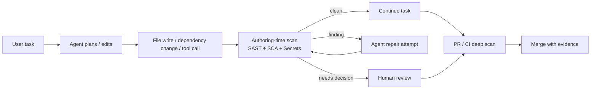
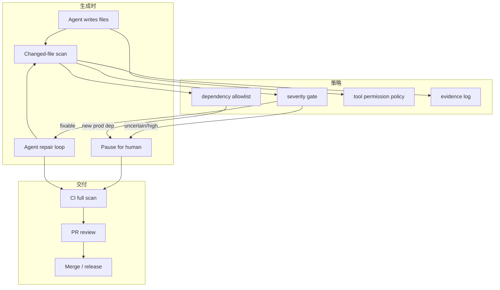

## 来源说明

本文基于 2026-06-27 的每日深度技术研究发布流程写成。今天没有看到足够支撑全新 AI memory 支柱文章的强材料；安全分支里更值得写的是 AI 生成代码的 authoring-time security loop：把安全扫描从“PR/CI 之后”前移到 Agent 写入代码、安装依赖和生成补丁的当下。

核心来源如下：

- Semgrep Blog: [Introducing Semgrep Guardian: Security for AI-Generated Code](https://semgrep.dev/blog/2026/introducing-semgrep-guardian-real-time-security-for-ai-written-code/), 2026-06-23。Semgrep 把 Guardian 定位为面向 AI-generated code 的安全层，运行在 IDE/Agent 写代码的路径上，覆盖 Code、Supply Chain 和 Secrets；文中报告 Guardian 每周运行超过 300 万次扫描，95% 在 5 秒内完成，并给出客户每周拦截 180+ critical issues 的案例。
- Semgrep Docs: [Semgrep Guardian: AI coding agent security plugin](https://docs.semgrep.dev/guardian)。文档说明 Guardian 通过 MCP server、Hooks 和 Skills 接入 Claude Code、Codex、Cursor、GitHub Copilot、VS Code、Windsurf、Kiro 等工具；其中 Claude Code/Cursor/Windsurf 可利用 post-write 或 post-tool hook 自动扫描，Codex、Copilot 和 VS Code 当前更多依赖 MCP 工具调用。
- OpenAI Codex Docs: [Model Context Protocol](https://developers.openai.com/codex/mcp)、[Hooks](https://developers.openai.com/codex/hooks) 与 [Config basics](https://developers.openai.com/codex/config-basic)。文档说明 Codex 可配置 MCP servers、工具启停和 approval mode；Hook 支持 `PreToolUse`、`PostToolUse` 等事件，`PostToolUse` 可在工具输出后给模型反馈或阻断正常处理，但不能撤销已经发生的副作用。
- Jai Lal Lulla 等: [The Impact of Configuring Agentic AI Coding Tools on Build-vs-Buy Decisions: A Study Protocol](https://arxiv.org/abs/2606.03907), 2026-06-02。该注册研究计划指出 agentic coding tools 会在多步任务中自主决定 build-vs-buy，外部依赖带来安全、许可证、性能和维护影响；研究设计将测试 context files、Skills、MCP library discovery、permission controls、allowlist/blocklist 和 dependency disclosure 对工具行为的影响。
- Drew Johnston 等: [The Shift to Agentic AI: Evidence from Codex](https://arxiv.org/abs/2606.26959), 2026-06-25。论文基于 Codex 使用数据观察 agentic AI 工作方式变化，报告 2026 上半年活跃用户数增长超过 5 倍，超过 10% 用户每周某时点管理 3 个以上并发 Codex agents，26.6% 使用 Skills；这说明安全控制面对的是快速扩大的真实工作流，而不是少量实验性补全。

事实边界：Semgrep 的扫描量、延迟和客户案例来自厂商博客，适合作为产品报告事实，不等同于独立基准；Codex 能力来自官方文档；两篇 arXiv 论文分别是使用行为研究和注册研究计划，后者尚未给出实验结果。本文提出的 authoring-time 安全流水线、数据模型、指标和一周实验方案是我的工程建议，不是上述来源共同声明的标准。

稳定 slug：`2026-06-27-ai-generated-code-authoring-security-loop`。

## 先给结论

AI 生成代码的安全问题不应该只在 CI 里处理。CI 仍然必要，但它已经太晚：Agent 可能已经引入依赖、生成调用链、改写配置、写入测试和提交 PR；等到 CI 才发现问题，修复成本和上下文切换都更高。

我的判断是，AI coding workflow 需要一条更靠前的安全反馈回路：



这条回路不是“让扫描器替开发者决定一切”。它的边界更窄：在 Agent 刚写出风险代码时给出可复核反馈；对高风险依赖、敏感权限和不确定 finding 暂停；最终仍由 CI、安全策略和人审决定能否合入。

## 技术问题：AI 写代码改变了安全反馈的时间点

传统安全流水线默认人类开发者在编辑器里写代码，随后经过本地测试、PR review、CI SAST、依赖扫描、secret scanning 和安全评审。这个模型仍然可用，但 agentic coding 改变了三个前提。

第一，代码变化速度更快。`The Shift to Agentic AI` 报告 Codex 使用在 2026 上半年快速增长，并出现多 Agent 并发和 Skills 使用等更复杂工作方式。即使不把论文数字外推到所有公司，方向也很清楚：AI 生成的变更量和并发任务数会抬高审查吞吐压力。

第二，Agent 不只写业务代码。它会运行包管理器、编辑配置、生成测试、调用 MCP 工具、修改脚本，甚至根据错误输出继续迭代。Lulla 等人的注册研究计划抓住了一个具体风险：agentic coding tools 会在任务中自主做 build-vs-buy 选择，依赖引入可能没有被自然语言回复完整披露。

第三，生成时上下文最完整。Agent 刚写完某段代码时，仍然知道用户任务、它的计划、刚改过的文件、失败日志和修复意图。等到 CI 报告出现，很多上下文已经变成“安全告警 + diff”，修复常常需要重新理解。

所以 authoring-time security 的价值不是替代 CI，而是减少低级高危问题进入 PR 的概率，并把 Agent 的修复能力用在它最有上下文的时候。

## 机制拆解：生成时安全回路要管四类事件

最小可用版本不需要平台化大工程。先抓四类事件就够了。

| 事件 | 风险 | 自动动作 | 人工审核点 |
| --- | --- | --- | --- |
| 文件写入 | 注入、认证绕过、危险 API、明文密钥 | 对变更文件跑 SAST/secrets，结果返回 Agent | 高危 finding、修复涉及认证/权限 |
| 依赖变化 | 恶意包、许可证、过宽依赖、版本漂移 | 对 lockfile/package manifest 跑 SCA 和 allowlist | 新生产依赖、未披露依赖、替代库选择 |
| 工具调用 | shell、网络、文件系统、MCP 工具副作用 | tool hook 检查命令/输出，记录证据 | destructive command、外部发布、凭据访问 |
| PR/提交 | 本地扫描漏报、上下文外风险 | CI 全量复扫、SARIF/JSON 留档 | 豁免、误报关闭、风险接受 |

Semgrep Guardian 的新信号在第一列和第二列：把扫描放在 AI agent 写代码的路径上，而不是只等 CI。Semgrep 文档同时提醒我们，不同宿主能力不同：有的 IDE/Agent 支持 post-write hook，有的只能通过 MCP 暴露工具，让 Agent 在合适时机调用。这个差异会直接影响工程设计。

Codex Hook 文档也给了一个重要边界：`PostToolUse` 发生在工具输出之后，可以给模型反馈或阻断正常处理，但不能撤销已经发生的副作用。因此，不要把 post hook 当成权限系统；危险副作用仍应放在 `PreToolUse`、approval policy、sandbox 或人工审批前面拦。

## 工程判断：把安全反馈做成 Agent 可执行的修复任务

Authoring-time 扫描如果只弹出一堆告警，开发体验会很差。更好的反馈对象应该是 Agent 能直接处理的最小修复任务。

我会把每次扫描结果整理成这样的结构：

```json
{
  "event": "post_write",
  "agent_task_id": "task-20260627-001",
  "changed_files": ["src/routes/upload.ts"],
  "findings": [
    {
      "id": "semgrep-js-path-traversal-001",
      "severity": "high",
      "kind": "sast",
      "file": "src/routes/upload.ts",
      "line": 48,
      "claim": "user-controlled filename reaches filesystem write",
      "required_agent_action": "repair_or_explain",
      "human_review": true
    }
  ],
  "dependency_delta": {
    "added": ["formidable@3.5.1"],
    "disclosed_by_agent": false,
    "requires_review": true
  }
}
```

这比自然语言告警更稳，因为策略机可以读，Agent 也能读。Agent 的任务不是“总结扫描结果”，而是执行一个受限循环：

1. 如果 finding 可修，改代码并重新扫描。
2. 如果认为是误报，必须引用代码位置、已有校验和不可达条件。
3. 如果新增依赖，必须说明用途、替代方案、许可证/维护风险和是否可用现有依赖替代。
4. 如果扫描仍不 clean，暂停给人审。

这里有一个懒但够用的边界：第一版只扫描 Agent 改过的文件和 manifest/lockfile delta。跳过全仓深扫，放到 CI。这样延迟可控，失败原因也贴近 Agent 刚做的改动。

## 一个可落地的工作流

我会按三层落地。



### 目录与配置

仓库里只需要几个文件开始：

```text
.agent-security/
  policy.yml
  dependency-allowlist.yml
  scan-events/
  waivers.yml
.codex/
  hooks/
    pre_tool_use_policy.py
    post_tool_use_scan.py
```

`policy.yml` 不要复杂：

```yaml
authoring_time_security:
  scan_changed_files: true
  block_severities: ["critical", "high"]
  require_human_review:
    - "new_production_dependency"
    - "hardcoded_secret"
    - "auth_or_permission_change"
    - "destructive_tool_call"
  max_agent_repair_attempts: 2
  ci_required: true
```

这不是替代平台产品的完整方案，而是让团队能在一周内验证“生成时安全反馈是否真的降低后续 CI/PR 安全返工”。

### 执行 SOP

1. Agent 接到任务前，读取项目安全规则：允许的依赖、禁止的危险 API、哪些路径需要人审。
2. Agent 写文件或改 manifest 后，触发 changed-file scan。
3. 扫描 clean，继续任务；扫描命中 medium 以下，允许 Agent 修复一次并留日志。
4. 命中 high/critical、secret、新生产依赖、认证/权限改动，暂停并生成人审摘要。
5. 人审通过后继续；人审要求修改则回到 Agent repair loop。
6. PR 阶段跑 CI 全量 SAST/SCA/secrets，并检查生成时扫描日志是否齐全。
7. 合入后记录 finding、修复次数、耗时、误报和豁免。

## 适用场景

这条回路适合几类团队：

- 已经在用 Codex、Claude Code、Cursor、Copilot Agent 或类似工具生成真实业务代码。
- AI 生成代码进入 PR 的量明显上升，人工 review 开始吃紧。
- 安全团队已有 Semgrep/CodeQL/SCA/secret scanning，但主要在 CI 或 nightly 运行。
- 组织关心依赖选择、许可证、供应链和凭据泄露，不只是代码模式漏洞。

它不适合被包装成“自动安全审计员”。如果团队没有基本 CI 扫描、没有依赖策略、没有人能处理高危 finding，先做 authoring-time hook 只会把噪音提前。

## 失败模式

| 失败模式 | 结果 | 缓解 |
| --- | --- | --- |
| post hook 误当权限边界 | 副作用已经发生才发现问题 | 危险动作放到 pre hook、approval 和 sandbox |
| Agent 为了 clean 改坏业务逻辑 | 安全告警消失但功能回归 | 修复后必须跑相关测试，认证/权限改动强制人审 |
| 只扫 changed files | 跨文件数据流漏报 | CI 全量复扫，关键路径 nightly 深扫 |
| 依赖引入未披露 | 许可证/供应链风险进入仓库 | lockfile delta 强制检查，新增生产依赖暂停 |
| MCP 工具调用不可观测 | 安全工具是否运行不可复核 | 记录 tool call、版本、输入摘要和结果 hash |
| finding 太吵 | 开发者和 Agent 都绕开工具 | 第一版只阻断 high/critical 和 secrets |
| Agent 自证误报 | 真实问题被自然语言解释关掉 | 误报关闭必须有人审或结构化反证 |

最容易犯的错是把这件事做成“每次保存全仓扫描”。那会慢、吵、没人用。懒一点，先扫 Agent 改过的东西；深的放 CI。

## 可验证指标清单

| 指标 | 一周目标 | 说明 |
| --- | --- | --- |
| Inline scan latency p95 | 小于 10 秒 | 太慢会被绕开 |
| Agent repair success rate | 可修 finding 中 50% 以上一次修复 | 验证反馈是否可执行 |
| CI security failure reduction | AI 相关 PR 的高危 CI 失败下降 | 衡量是否把问题提前消化 |
| New dependency disclosure rate | 100% 记录新增依赖用途 | 对齐 build-vs-buy 风险 |
| Human review precision | 人审项中有效问题比例超过 30% | 太低说明 gate 太吵 |
| False-positive triage time | 单条小于 15 分钟 | 防止流程拖慢研发 |
| Waiver expiry compliance | 过期豁免 0 个 | 防止临时放行变永久 |
| Security log completeness | 100% 记录工具版本、文件、结果 | 事故复盘需要 |

这些指标比“扫描了多少次”更有用。扫描次数增加只能说明工具在跑，不能说明风险下降。

## 我会如何实现和验证

第一周我不会上复杂平台。只做最小闭环：

1. 在一个真实服务仓库选择 10 个 AI coding 任务，覆盖 API、依赖、配置和测试。
2. 配置 Semgrep 或现有 SAST 对 changed files 跑快速规则集，对 manifest/lockfile 跑依赖 delta 检查。
3. 对 Codex/Claude/Cursor 等按宿主能力接入 MCP 或 hook；没有 post-write hook 的，就把扫描作为 Agent 必须调用的 MCP 工具，并在 PR 模板检查扫描日志。
4. 设置 `max_agent_repair_attempts: 2`，避免 Agent 无限修复。
5. 只阻断 high/critical、secret、新生产依赖和认证/权限改动。
6. PR 仍跑原 CI 全量扫描，比较引入前后 AI 相关 PR 的安全失败率、修复耗时和误报。

一周后只回答一个问题：这条生成时回路有没有让高风险问题更早、更便宜地被修掉？如果没有，就不要继续加平台；先调规则、降低阻断面或回到 CI。

## 局限分析

Semgrep Guardian 的公开数字来自厂商报告，不能直接证明所有团队都能得到同样延迟和拦截率。不同 IDE/Agent 的 hook 能力差异很大，Codex 文档里的 `PostToolUse` 也明确不是副作用回滚机制。Lulla 等人的 build-vs-buy 论文目前是注册研究计划，还没有实验结论；我引用它是因为它把依赖选择问题定义清楚，而不是把它当作已验证结果。

此外，changed-file scan 天然看不全跨文件、跨服务和配置相关问题。本文方案必须和 CI 全量扫描、nightly 深扫、人工复核以及发布证据一起使用。

## 自审

- 事实可靠性：关键事实来自 Semgrep 官方博客/文档、OpenAI Codex 官方文档和 arXiv 原始论文页面；厂商指标已标明来源边界。
- 来源完整性：覆盖产品发布、宿主机制、Agent 行为研究和依赖选择研究，不只复述一篇博客。
- 是否站内重复：区别于 6 月 20 的报告叙述可信、6 月 21 的漏洞验证漏斗、6 月 24 的上线前审计关口；本文聚焦生成时反馈和依赖披露。
- 工程价值：给出事件模型、目录结构、策略配置、SOP、失败模式和一周验证指标。
- 安全边界：只讨论授权代码库、开发工作流和防御工程，不提供攻击第三方目标流程。
- 标题克制：标题直接描述工程判断，没有夸大为“彻底解决 AI 代码安全”。
