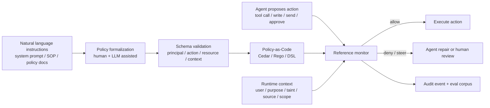
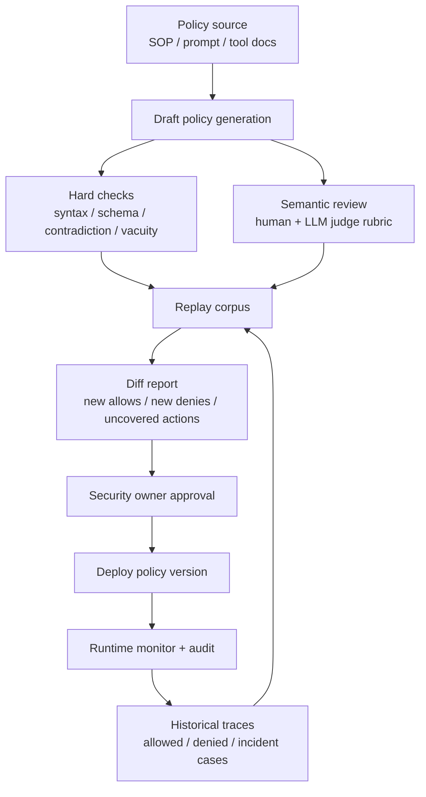

## 来源说明

本文基于 2026-06-28 的每日深度技术研究发布流程写成。今天没有看到足够支撑全新 AI memory 支柱文章的强材料；安全分支里更值得写的是 Agent 运行时授权：把“不要做危险动作”从提示词、工具描述和人工约定，迁移到可验证的 Policy-as-Code 与参考监控器。

核心来源如下：

- Adam Mondl、Matthew Maisel、John H. Brock: [Autoformalization of Agent Instructions into Policy-as-Code](https://arxiv.org/html/2606.26649v1), arXiv:2606.26649v1, 2026-06-25。论文提出把 system prompt、MCP tool definitions 和自然语言 policy documents 自动形式化为 Cedar 策略，并用 generator-critic loop 结合 deterministic hard critic 与 LLM soft critic 检查语法、schema、矛盾、空策略和语义对齐；作者把架构称为 Verification Sandwich。
- Sondera AI: [sondera-harness-python](https://github.com/sondera-ai/sondera-harness-python)。开源仓库把 Harness 定位为 “deterministic guardrails for AI agents”，在 Agent action 执行前评估 Cedar policy；README 显示它支持 LangGraph、Google ADK、Strands 和 custom agents，并提供 block / steer 形态。
- Praneeth Narisetty 等: [Adaptive Evaluation of Out-of-Band Defenses Against Prompt Injection in LLM Agents](https://arxiv.org/html/2606.26479v1), arXiv:2606.26479v1, 2026-06-25。论文把 CaMeL、FIDES、Progent、RTBAS、FORGE 等 out-of-band defenses 归纳到 classical integrity protection、reference monitoring 和 least privilege 框架下，并强调静态 benchmark 不足以证明防御能抗 adaptive attacker；作者在 AgentDojo 上复现 Progent，报告 mean attack success 从 25.8% 降到 4.2%，手写 adaptive attack 为 2.6%，但明确说明这只是小规模数据点。
- Yutao Shi 等: [Description-Code Inconsistency in Real-world MCP Servers](https://arxiv.org/pdf/2606.04769), arXiv:2606.04769v1, 2026-06-03。论文定义 MCP server 的 Description-Code Inconsistency，提出 DCIChecker，并在 2,214 个 real-world MCP servers 的 19,200 个 description-code pairs 上报告 9.93% 存在 inconsistency；这说明工具自然语言描述本身不能直接当作可信安全规格。
- Cedar Policy Language Reference: [What is Cedar?](https://docs.cedarpolicy.com/) 与 [Cedar policy validation against schema](https://docs.cedarpolicy.com/policies/validation.html)。官方文档说明 Cedar 用 schema 验证策略创建或更新时的类型与结构一致性；运行时评估的是 principal、action、resource、context 和 entities，不把 schema 当作请求的一部分。

事实边界：Autoformalization、adaptive evaluation 和 DCI 的实验结果均来自预印本或开源 README；Sondera Harness 的集成能力来自仓库 README；Cedar 行为来自官方文档。本文提出的工程流水线、数据模型、指标和一周验证方案是我的工程建议，不是上述来源共同声明的行业标准。

稳定 slug：`2026-06-28-agent-policy-as-code-reference-monitor`。

## 先给结论

高权限 Agent 的安全策略不应该主要存在于 system prompt 里。提示词适合表达意图、角色和协作方式，但不适合承担最终授权边界。

我的判断是：Agent 安全应该进入一条更传统、也更可审计的授权路径：



这不是“用 Cedar 替代所有安全工程”。更准确地说，它把 Agent 的行动授权从模型上下文里移出来：模型可以被诱导、误解或遗忘规则，但参考监控器必须在动作执行前给出确定性 verdict。

## 技术问题：Agent 的安全边界不该由同一段文本同时表达和执行

Agent 安全里最危险的混淆是：把给模型看的指令，当成系统真正执行的权限边界。

在一个工具型 Agent 中，模型会同时看到三类文本：

| 文本来源 | 作用 | 风险 |
| --- | --- | --- |
| System prompt / developer instruction | 告诉 Agent 应该如何工作 | 被上下文长度、冲突指令、模型不稳定影响 |
| Tool description / MCP schema | 帮助 Agent 选择和调用工具 | 描述可能过时、不完整或与代码不一致 |
| Untrusted data | 邮件、网页、PDF、工单、代码注释、用户输入 | 可能包含间接提示注入或误导性指令 |

这些文本最后都会进入模型的推理上下文。即使我们用分隔符、标签和安全提示做区分，最终仍然希望同一个概率模型“既读懂任务，又识别恶意，又记得所有规则，又只做授权动作”。这在低风险聊天场景可以接受；在能发邮件、改数据库、提交代码、创建付款、写长期记忆或调用内部 API 的 Agent 里，不够。

2606.26479 的价值是把问题拉回经典安全：tool-using Agent 的 prompt injection 更像授权问题，而不是内容分类问题。out-of-band defense 的核心不是让模型更会拒绝，而是在模型提出 action 后，由模型外部的确定性层检查这个 action 是否被当前主体、目的、来源完整性和策略允许。

## 机制拆解：从提示词到策略代码要经过四个边界

Autoformalization 论文提出的 Verification Sandwich 可以拆成四个工程边界。

| 边界 | 输入 | 输出 | 必须验证什么 |
| --- | --- | --- | --- |
| 语义边界 | 自然语言 policy、system prompt、tool schema | 候选规则 | 是否遗漏关键禁止项，是否误解业务例外 |
| 类型边界 | MCP tool definitions、action context、entity model | Cedar schema 或等价 schema | 字段、类型、action、resource 是否闭合 |
| 逻辑边界 | 候选策略集 | 可加载策略 | 语法、schema、矛盾、空策略、默认拒绝 |
| 运行边界 | Agent proposed action、runtime context | allow / deny / steer | 真实动作是否被策略覆盖，失败是否 fail closed |

这里最容易被低估的是类型边界。Cedar 文档提醒我们：schema 主要用于策略创建或更新时的 validation，不是运行时请求的一部分。换句话说，团队不能只写一个漂亮 schema 就以为安全了；运行时仍然要把 principal、action、resource、context 和 entities 填对，并把真实工具参数映射到策略可判断的字段。

最小可用数据结构可以这样设计：

```json
{
  "principal": {
    "type": "Agent",
    "id": "security-review-agent",
    "delegated_user": "u_123",
    "trust_level": "internal"
  },
  "action": "ToolCall::github_create_pr",
  "resource": {
    "type": "Repository",
    "id": "repo_456",
    "visibility": "private"
  },
  "context": {
    "purpose": "authorized_security_review",
    "source_integrity": "mixed",
    "taints": ["external_issue_text", "generated_patch"],
    "changed_files": ["src/auth/session.ts"],
    "requires_human_review": true,
    "approval_id": null
  }
}
```

这比把规则写成 “Agent must not create risky pull requests” 更硬，因为它迫使系统回答：谁在行动、对哪个资源、为了什么目的、依据哪些来源、是否有人工批准、哪些字段可能被不可信数据影响。

## 工程判断：策略代码不是生成后就完事，关键在回放和漂移检测

Autoformalization 的吸引力很明显：企业里大量安全规则、SOP 和合规要求已经是自然语言。手写完整策略代码成本高，LLM 可以降低初始形式化成本。

但我的工程判断很保守：自动生成策略只能作为 draft，不能直接成为生产策略。原因有三个。

第一，自然语言本身可能含糊。比如“只有紧急情况可以绕过审批”需要定义紧急情况的来源、证明、时效、可执行动作和事后审计。LLM 不能替团队补完这些业务事实。

第二，工具描述不可信。2606.04769 的 DCI 测量说明，MCP 工具描述和实现之间的不一致不是边缘问题。若策略生成器只看 tool description，可能把未声明副作用漏掉。生成策略前应做 tool inventory 和 description-code consistency check。

第三，策略会漂移。工具参数、MCP server、workflow state、组织角色和数据分类都会变。Cedar schema validation 可以抓住一部分类型错误，但抓不住“新工具语义上扩大了权限”这类变化。

所以，我会把策略发布做成和代码发布一样的流水线：



策略版本必须回答三个问题：

1. 这次比上一版多允许了什么？
2. 这次比上一版多拒绝了什么？
3. 哪些 action 仍然没有被明确覆盖？

如果只看“策略能加载”，那只是语法检查；真正的安全回归测试是 action-level replay。

## 一个可落地的 Agent Policy Gate

第一版不要做通用平台。先把一类高风险动作接入 reference monitor：例如代码 Agent 的 `shell`、`dependency install`、`file write outside workspace`、`pull request creation`，或者企业工作流 Agent 的 `send_email`、`update_crm_status`、`approve_document`。

目录结构可以很小：

```text
agent-policy/
  schema.cedarschema
  policies/
    base.cedar
    tool-boundaries.cedar
    human-review.cedar
  tests/
    allow.jsonl
    deny.jsonl
    regression.jsonl
  traces/
    2026-06-28.jsonl
  tool-inventory.json
  dci-report.json
```

一个简化策略可以表达成：

```text
forbid(principal, action, resource)
when {
  action == Action::"ToolCall::send_external_email" &&
  context.source_integrity == "mixed" &&
  !context has approval_id
};

forbid(principal, action, resource)
when {
  action == Action::"ToolCall::run_shell" &&
  context.parameters_json like "*rm -rf*"
};
```

这类规则不高级，但有两个优点：动作执行前可判定，失败时可解释。Agent 收到 deny reason 后可以改走低风险路径，比如创建草稿、请求审批、缩小文件范围或只生成建议。

运行时事件也要结构化：

```json
{
  "policy_version": "agent-policy-2026-06-28",
  "agent_run_id": "run_20260628_001",
  "decision": "deny",
  "reason": "external_email_from_mixed_integrity_source_requires_approval",
  "principal": "research-agent",
  "action": "ToolCall::send_external_email",
  "resource": "vendor-contact",
  "taints": ["external_pdf", "agent_summary"],
  "approval_id": null,
  "trace_ref": "traces/2026-06-28.jsonl#42"
}
```

这个 event 不只是审计日志，也会成为下一轮 replay corpus。Agent 安全系统没有 replay，就只能靠线上事故学习。

## 适用场景

Policy-as-Code reference monitor 最适合三类场景。

第一，高权限工具型 Agent。只要 Agent 可以写文件、执行 shell、改业务系统、发消息、访问客户数据或触发外部副作用，就应该有动作级授权层。

第二，多来源上下文 Agent。邮件、网页、PDF、工单、代码仓库、知识库和长期记忆混在一起时，source integrity 和 taint tracking 比“模型是否理解了提示注入”更可靠。

第三，企业工作流 Agent。审批、法务、采购、安全运营、客户支持、财务和 HR 场景里的规则本来就需要审计；把规则继续藏在 prompt 中，会让合规复盘很困难。

不适合的场景也要明确。如果 Agent 只是低权限问答，没有外部副作用，也不处理敏感数据，那么完整 Cedar/OPA/DSL 门禁可能过重。此时至少保留工具 allowlist、权限最小化、日志和人工确认即可。

## 失败模式

| 失败模式 | 表面症状 | 根因 | 处理方式 |
| --- | --- | --- | --- |
| 策略过宽 | Agent 合法调用导致越权副作用 | action/context 建模太粗 | 细化 action、resource、purpose 和 taint |
| 策略过窄 | Agent 频繁被拒，团队关闭门禁 | 自然语言规则未转成可执行例外 | 用 replay 找 false deny，补明确例外 |
| 描述-代码不一致 | 策略允许了“看似只读”的工具 | tool description 漏掉写入或上报 | 对 MCP server 做 DCI 检查和副作用标注 |
| 运行时上下文缺字段 | policy engine 报错或默认拒绝 | harness 没填完整 context | schema + contract test，失败 fail closed |
| 只测静态 benchmark | 上线后 adaptive attack 绕过 | 没有 defense-aware evaluation | 定期做策略可见的自适应测试 |
| 人审被形式化绕过 | Agent 找到不需 approval 的等价动作 | action 粒度和工作流状态不完整 | 建立动作等价类和审批状态机 |
| 审计日志泄密 | trace 里保留敏感输入和 tool output | 记录无分级脱敏 | 日志分类、脱敏、保留期和删除流程 |

其中第三点是 MCP 生态特有的硬问题。DCI 论文提醒我们，工具描述既是模型选择工具的依据，也是很多策略生成器的输入。如果描述和代码不一致，策略门禁从一开始就站在错误规格上。

## 可验证指标

我会用这些指标判断 Agent Policy Gate 是否真的有用：

| 指标 | 验证方法 | 目标 |
| --- | --- | --- |
| Action coverage | 统计所有 tool call 是否映射到 policy action | 高风险动作 100% 覆盖 |
| Context completeness | replay 中缺字段、类型错、默认拒绝比例 | 缺字段为 0 或有明确 fail-closed 记录 |
| New allow diff | 策略更新后新增允许的 action/resource/purpose | 每次发布人工确认 |
| False deny rate | 合法任务被拒后人工标注 | 低到团队不会绕开门禁 |
| High-risk block precision | 被 block 的高风险 action 中真实需要阻断比例 | 定期抽样复核 |
| Adaptive attack success | 攻击者知道策略后仍能达成未授权副作用的比例 | 进入安全回归门槛 |
| DCI rate | MCP tool description-code inconsistency 比例 | 新工具上线前为 0 |
| Replay determinism | 同一事件多次评估 verdict 是否一致 | 100% 一致 |
| Audit usefulness | 事故复盘能否从 decision 回到来源、规则和上下文 | 每个 deny/allow 都可追踪 |

这里不要只优化 block rate。过高 block rate 可能只是把 Agent 变成不可用工具；过低 attack success 也可能只是测试集太弱。2606.26479 的 caveat 很重要：一个小规模 adaptive attack 结果不能当作安全证明，必须持续扩大攻击模板、模型、工具和已授权动作空间。

## 我会如何实现和验证

第一周只做一个高风险动作族，不做平台。

第一天，盘点工具。生成 `tool-inventory.json`，字段包括 tool name、description、参数、读写副作用、外部网络、数据分类、是否需要审批。对 MCP server 跑一次 description-code consistency review，哪怕第一版是人工抽样。

第二天，定义 action schema。把工具映射成 `ToolCall::<tool>`，并定义 `principal`、`resource`、`context` 最小字段：user、agent、purpose、source_integrity、taints、approval_id、workspace、parameters_json。

第三天，写 5-10 条 deny-first policy。先覆盖明显危险动作：外部发送、生产写入、shell destructive command、跨 workspace 文件写入、未审批依赖安装。不要试图覆盖所有业务规则。

第四天，接入 reference monitor。动作执行前调用策略引擎；deny 时返回 reason 给 Agent；策略引擎异常、context 缺字段或 schema 不匹配时默认拒绝。

第五天，做 replay。收集 50 条历史或合成 action events，至少包含 20 条应允许、20 条应拒绝、10 条边界样本。策略更新必须输出 new allow / new deny diff。

第六天，做 adaptive evaluation。测试者知道策略内容，尝试通过改写邮件、PDF、工单、工具参数和任务目标诱导 Agent 完成未授权副作用。只在授权测试环境中做，不攻击第三方系统。

第七天，复盘误拒、漏拒和体验成本。只保留能解释真实风险的规则；导致大量误拒的规则要么补 context，要么转成人审，而不是让团队私下绕过。

上线门槛很简单：

```text
high-risk action coverage = 100%
schema/context contract tests pass
replay verdict is deterministic
new allow diff reviewed
no known DCI in gated tool set
deny events have usable reason
policy engine failure mode = fail closed
```

这套门槛不证明系统绝对安全，但能把“Agent 会不会遵守提示词”变成“每个高风险动作有没有可复核授权证据”。

## 局限分析

第一，Policy-as-Code 只能管被拦截的动作。Agent 的纯文本输出、误导性总结、低风险工具组合出的高风险结果、隐式信息流和 side channel 仍然需要其他控制。

第二，策略质量依赖建模质量。principal、resource、purpose、taint、approval 和工具副作用如果建错，确定性引擎只会确定性地执行错误规则。

第三，autoformalization 降低初始成本，但不能替代安全 owner。LLM 生成的策略需要 hard checks、semantic review、replay 和人工批准。

第四，参考监控器会带来摩擦。过窄策略会让 Agent 不可用，过宽策略又失去意义。工程上必须把 false deny、human override、steer success 和用户绕行行为纳入指标。

第五，MCP 工具生态还在快速变化。description-code consistency、tool provenance、版本固定、权限声明和策略 schema 之间还没有成熟统一标准。

## 自审

事实可靠性：核心事实来自两篇 2026-06-25 arXiv 论文、一篇 2026-06-03 arXiv 论文、Sondera Harness 开源 README 和 Cedar 官方文档；实验数字均标注为作者报告结果。

来源完整性：文章给出原始论文、仓库和官方文档链接，未依赖二手摘要。

是否只是复述摘要或 README：不是。文章重点落在 action-level policy gate、schema/context contract、DCI 前置检查、策略 replay、adaptive evaluation 和一周落地方案。

是否标题党：标题准确表达核心判断，即 Agent 安全策略要迁移到可验证策略代码。

是否薄内容：不是。文章包含机制图、表格、数据模型、策略示例、失败模式、指标和实施步骤。

是否把猜测写成事实：没有。实验结果与工具能力均归属于来源；工程流水线和上线门槛明确为我的建议。

站内重复：本站已有 Agent 审计关口、AI 生成代码 authoring-time security、认证 trace 和 MCP 安全文章；本文差异点是运行时授权策略的形式化、schema/replay 和 reference monitor，不重复已有主题。

具体工程价值：读者可以直接用文中的目录结构、事件模型、策略示例、指标和七天计划验证一个最小 Agent Policy Gate。

安全边界：本文只讨论授权环境中的防御、评估和安全工程；不提供攻击第三方目标的操作流程。
