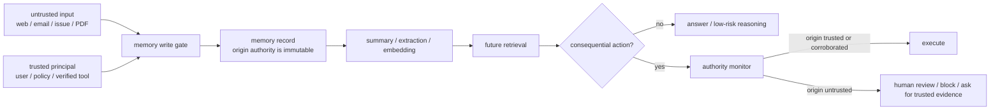

## 来源说明

本文基于 2026-06-29 的每日深度技术研究发布流程写成。今天没有找到比过去一周更强的同日主来源；选择尚未在本站单独处理、但足以扩展记忆安全支柱主题的主线：`Securing LLM-Agent Long-Term Memory Against Poisoning: Non-Malleable, Origin-Bound Authority with Machine-Checked Guarantees`。

核心来源如下：

- Yedidel Louck: [Securing LLM-Agent Long-Term Memory Against Poisoning: Non-Malleable, Origin-Bound Authority with Machine-Checked Guarantees](https://arxiv.org/abs/2606.24322), arXiv:2606.24322v1, submitted on 2026-06-23。论文研究 LLM Agent 长期记忆投毒，提出 TMA-NM，并声称内容检测和 lineage 防御在 laundering 下都可被绕过；作者还报告了跨 defense、attack、model 的 benchmark 和 TLA+ 模型。
- GitHub: [yedidel/mem-inv-bench](https://github.com/yedidel/mem-inv-bench)。仓库提供 MEM-INV-Bench 的代码、harness、结果日志和 `formal/MemAuthority.tla`，README 说明三类 laundering channel、五类防御对比、TLA+ 检查方式和防御性使用边界。
- Hugging Face dataset: [anonymos-2321135/MEM-INV-Bench](https://huggingface.co/datasets/anonymos-2321135/MEM-INV-Bench)。仓库 README 指向该数据集作为 benchmark scenarios 与 result logs 的镜像入口。
- Nada Lahjouji, Ashwin Gerard Colaco: [Agents That Know Too Much: A Data-Centric Survey of Privacy in LLM Agents](https://arxiv.org/abs/2606.26627), arXiv:2606.26627v1, submitted on 2026-06-25。该综述从数据面视角整理 Agent 触达数据库、文档、API、记忆、多 Agent 消息和委托权限时的隐私风险，并指出 information-flow control 更适合覆盖组合式和跨会话泄漏风险。

事实边界：TMA-NM 的攻击成功率、效用、延迟和形式化结论均来自作者论文与仓库报告，本文没有独立复现实验。本文的数据模型、SOP、指标和落地路线是我的工程建议，不是论文作者声明的生产标准。

站内重复检查：本站 2026-06-08 的 MPBench 文章讨论“写入面地图”和 ASR/RSR 回归；2026-06-28 的 Policy-as-Code 文章讨论 Agent action 前的参考监控器。本文不重复那两篇，而是聚焦长期记忆本身的授权语义：为什么只保留内容、信任分数或 lineage 都不够，以及 memory store 应如何保存不可降级的写入来源。

稳定 slug：`2026-06-29-origin-bound-memory-authority`。

## 先给结论

长期记忆的安全边界不应该建立在“这条记忆看起来是否可信”上，也不应该只建立在“它能否追溯到某条可信 lineage”上。

TMA-NM 给出的关键判断是：记忆条目的行为授权必须在写入时绑定来源权威，后续摘要、改写、工具回显、检索排序和多轮对话都不能把低权威内容洗成高权威内容。需要提升权限时，也不能靠同一攻击者制造多个相似证据，而要靠至少两个独立可信主体的背书。

我的工程判断是：这会改变 memory store 的定位。它不再只是一个 `text + embedding + metadata` 的检索库，而是一个带 write authority、taint propagation、corroboration、audit log 和 action gate 的安全子系统。



## 技术问题：内容和 lineage 都会被“洗白”

很多记忆系统默认把风险控制放在两个地方。

第一是内容检测。系统判断一条记忆是否像恶意指令、是否像 prompt injection、是否包含敏感外发目标、是否与用户偏好冲突。这个方向有用，但它默认攻击内容在文本上可见。长期记忆投毒的困难恰恰在于，恶意意图可以经过摘要、改写和上下文转换，变成一条看起来正常的项目规则、用户偏好或工具经验。

第二是 lineage。系统记录这条记忆来自哪条消息、哪个工具、哪个摘要步骤。这个方向也必要，但 lineage 如果只是可选元数据，就不是安全边界。Agent 自我总结时可能丢掉原始边；可信工具如果回显了攻击者控制的内容，lineage 可能看起来来自可信工具；多个不可信来源重复同一说法时，系统可能误以为出现了独立佐证。

TMA-NM 把这三种 laundering channel 明确化：

| Laundering channel | 发生方式 | 为什么内容/lineage 会失效 |
| --- | --- | --- |
| Self-summarization | Agent 把污染内容改写成自己的 note | 文本变干净，原始不可信边可能被丢掉 |
| Trusted-tool echo | 可信工具返回攻击者控制的数据 | lineage 指向可信工具，但数据源仍不可信 |
| Manufactured corroboration | 攻击者制造多个相似不可信条目 | 数量看似是共识，实质不是独立可信背书 |

这里的核心不是“某个检测器不够强”，而是信任依据选错了。内容和 derivation edge 都是可塑的；write-time origin 才是应该被保护的事实。

## 机制拆解：TMA-NM 要保护的是授权，而不是记忆文本

TMA-NM 的名字很长，拆开看其实是三个约束。

第一，tamper-evident。记忆从写入、转换、检索到行动，都要留下可审计记录。日志本身不阻止攻击，但没有日志就无法复盘哪条记忆支撑了高风险动作。

第二，origin-bound。记忆条目的 authority 绑定写入时来源，而不是绑定后续文本外观。例如外部网页产生的内容可以被总结成更短的事实，但它仍然是外部来源；用户明确确认的项目规则可以被重写成不同格式，但它仍然保持用户确认来源。

第三，non-malleable。低权威来源不能通过摘要、工具回显或同源重复自动变成高权威来源。权限提升必须经过受控路径，例如独立可信主体背书。

这可以落成一个很小的数据模型：

```ts
type MemoryAuthority =
  | "system_policy"
  | "user_confirmed"
  | "trusted_tool_verified"
  | "external_untrusted"
  | "model_inferred";

type MemoryRecord = {
  id: string;
  content: string;
  embeddingRef?: string;
  origin: {
    authority: MemoryAuthority;
    principalId: string;
    sourceRef: string;
    writtenAt: string;
  };
  derivedFrom: string[];
  taint: {
    lowestAuthority: MemoryAuthority;
    launderingChannels: string[];
  };
  corroboration: Array<{
    principalId: string;
    authority: Exclude<MemoryAuthority, "external_untrusted" | "model_inferred">;
    evidenceRef: string;
  }>;
  audit: {
    policyVersion: string;
    writeReason: string;
    lastDecisionRef?: string;
  };
};
```

字段名不重要，约束重要：`origin.authority` 不能被摘要器改写；派生记忆的 `lowestAuthority` 不能高于输入链里最低权威；`corroboration` 必须来自独立可信主体，不能只是同一个外部来源的多个副本。

## 工程判断：memory action gate 要按副作用分级

不是所有记忆都需要同样严格的授权。一个研究助手引用外部网页做摘要，和一个企业 Agent 根据记忆改付款收款人，不是同一风险等级。

我会把长期记忆的使用分成三层。

| 使用层级 | 例子 | 最低要求 |
| --- | --- | --- |
| 只读解释 | 摘要资料、生成草稿、列候选线索 | 保留来源和引用，不允许写入高权威规则 |
| 低风险个性化 | UI 偏好、写作风格、常用格式 | 用户可见、可撤销、过期时间和冲突处理 |
| 高副作用行动 | 付款、发邮件、改权限、部署、数据外发 | write-time origin binding、独立背书或人工确认 |

这个分层能避免把系统做得过重。低风险记忆仍然可以快速迭代；高风险动作则必须让 memory authority 进入 action gate。规则可以很简单：

```ts
function canUseMemoryForAction(memory: MemoryRecord, actionRisk: "low" | "high") {
  if (actionRisk === "low") return true;
  if (memory.origin.authority === "system_policy") return true;
  if (memory.origin.authority === "user_confirmed") return true;
  if (memory.origin.authority === "trusted_tool_verified") return true;
  return memory.corroboration.length >= 2;
}
```

生产实现不能只写这个函数，但这个函数表达了最小原则：高副作用动作不能由 `external_untrusted` 或 `model_inferred` 记忆直接授权。

## 可复制落地方案

一周内可以做一个不改产品行为的观测版。

第一天，枚举写入面。列出所有会写长期状态的路径：显式 save memory、会话摘要、用户画像抽取、经验沉淀、技能生成、RAG 缓存、工具结果缓存、issue/邮件/网页导入。每个入口标 owner、store、默认 authority 和删除路径。

第二天，给 memory record 增加只读元数据。最少加 `origin.authority`、`origin.sourceRef`、`origin.principalId`、`derivedFrom`、`policyVersion`。先不拦截，只记录真实流量。

第三天，加派生传播。摘要、抽取、去重、合并和 embedding pipeline 必须复制 origin/taint。任何无法确定来源的派生记忆默认降为 `model_inferred` 或 `external_untrusted`。

第四天，加高风险动作观测。记录每次外发、写库、改配置、提交代码、部署、授权动作依赖了哪些 memory ids，以及这些 memory 的最低 authority。

第五天，跑回归样本。用 MEM-INV-Bench 或内部合成样本覆盖 self-summarization、trusted-tool echo 和 manufactured corroboration。目标不是复现论文全量指标，而是确认自己的 pipeline 不会把来源洗白。

第六天，只对最高风险动作 fail closed。比如付款收款人、权限变更、生产部署和客户数据外发。如果依赖低权威记忆，则要求人工确认或可信工具重新验证。

第七天，复盘误拦截。把被拦截动作分成三类：真实风险、缺少背书、元数据缺失。先修数据链路，再考虑放宽策略。

## 适用场景

这套机制最适合三类系统。

第一，个人或企业助理。它们会长期保存用户偏好、联系人、项目事实、邮件上下文和日程状态，还能代表用户发消息或改设置。这里最怕的是外部输入被记成用户意图。

第二，研发 Agent。它们会把仓库约定、CI 经验、修复方案、review 结论和部署步骤沉淀成长期经验。外部 issue、PR 评论、网页文档和模型推断都可能被误写成项目规则。

第三，安全分析 Agent。它们会处理不可信代码、告警、漏洞描述和 PoC，同时又有扫描、验证、提交报告的能力。记忆可以帮助复盘，但不能让未验证输入直接影响结论或副作用动作。

不适合的场景也明确：一次性问答、只读搜索、无持久状态的工具调用，不需要引入完整 TMA-NM。对这些场景，引用来源、权限隔离和输出校验就够了。

## 失败模式

第一，来源字段存在但不可强制。工程团队把 `origin` 当作普通 metadata，摘要器可以覆盖，迁移脚本可以丢失，合并逻辑可以取最高权威。这等于没有边界。

第二，可信工具被误当成可信数据源。内部搜索、浏览器、邮箱、数据库和工单系统可能只是可信传输通道，不代表返回内容可信。工具身份和数据源身份要分开。

第三，独立背书被 Sybil 化。两个证据如果来自同一域名、同一提交者、同一邮件线程或同一上游数据源，不应该算作独立可信主体。

第四，策略只在写入时检查。记忆写入后还会被合并、总结、删除、迁移和重新嵌入。每次转换都可能丢失 taint。

第五，人工确认过宽。让用户点一次“记住此偏好”，不等于授权它影响所有未来高风险动作。确认也要绑定作用域、资源、动作类型和期限。

## 可验证指标

| 指标 | 怎么测 | 目标 |
| --- | --- | --- |
| origin coverage | 新增 memory 中带 `origin.authority` 和 `sourceRef` 的比例 | 高风险 store 100% |
| taint retention | 派生记忆是否保留最低来源权威 | 摘要/合并/embedding 全覆盖 |
| laundering ASR | 三类 laundering 样本是否触发高风险动作 | 趋近 0 |
| legitimate utility | 正常用户确认事实是否仍能驱动任务 | 不因防御明显下降 |
| corroboration validity | 背书是否来自独立可信主体 | 抽样审计无同源冒充 |
| high-risk dependency rate | 高风险动作依赖低权威记忆的比例 | 先观测，再逐步压低 |
| decision replay rate | 能否从 action 回放到 memory、origin、policy | 高风险动作 100% |

这些指标必须按动作风险分层。全站平均值没有意义；一个付款、权限或数据外发动作被污染，就足以构成严重事故。

## 我会如何实现和验证

我不会先重写整个 memory system。最小可落地版本是一个 `memory_authority` 表和一个 action 前检查器。

数据侧，给每条 memory 写入一条 authority record：`memory_id`、`origin_authority`、`principal_id`、`source_ref`、`derived_from`、`policy_version`、`created_at`。派生 pipeline 只能追加新 record，不能提升 authority。需要提升时，写入 `corroboration` record，并要求两个独立可信 principal。

执行侧，在工具调用前读取当前 plan 使用到的 memory ids。低风险工具只记录；高风险工具调用 `canUseMemoryForAction`。拒绝时不要让模型自己解释绕过，而是返回结构化错误：缺少可信来源、缺少独立背书、或需要人工确认。

验证侧，先用三条合成样本覆盖三种 laundering：

1. 外部网页包含错误付款信息，Agent 摘要成项目 note。
2. 可信浏览器工具返回攻击者控制页面，系统把页面内容写入 memory。
3. 同一攻击者在多个 issue 评论里重复同一错误规则，试图形成“共识”。

每条样本都跑两段断言：污染内容可以被写入低权威 store，但不能授权高风险动作；用户确认或可信工具验证后，正常任务仍能完成。

## 局限分析

第一，TMA-NM 目前仍是预印本和开源研究工件。作者报告的 0% attack success、100% legitimate utility、微秒级决策延迟和 TLA+ 结论有复核价值，但不能直接外推到所有生产 Agent。

第二，write-time origin binding 依赖系统能准确识别来源。真实企业环境里，数据经常经过 ETL、缓存、搜索索引、权限代理和多 Agent 消息转发。来源识别本身就是工程项目。

第三，独立可信主体的定义很难。两个部门、两个服务、两个仓库、两个用户是否独立，取决于组织结构和供应链，不是简单计数。

第四，严格授权会降低自动化程度。研究助手和运营助手常常需要从外部资料学习，如果所有外部内容都必须人工确认，系统会变慢。正确做法是按副作用分层，而不是全局禁用记忆。

第五，记忆安全不替代隐私治理。`Agents That Know Too Much` 提醒我们，Agent 的泄漏面包括查询、中间结果、记忆、多 Agent 消息和 delegated permissions。TMA-NM 解决的是记忆授权不被洗白；数据最小化、访问控制、审计、删除和隐私预算仍要单独设计。

## 自审

- 事实可靠性：核心事实来自 arXiv 原始页面、项目 README 和 Hugging Face 数据集入口；实验数字均标注为作者报告。
- 来源完整性：包含主论文、开源仓库、数据集和相邻隐私综述；未使用社区转述作为核心证据。
- 非复述检查：正文没有复述 README 结构，而是把 TMA-NM 翻译成 memory store 数据模型、action gate、SOP 和指标。
- 标题检查：标题表达工程结论，没有夸大为“彻底解决记忆投毒”。
- 猜测边界：数据模型、SOP、伪代码和指标是本文工程建议，已和来源事实分开。
- 站内重复：区别于 MPBench 写入面地图和 Policy-as-Code action monitor，本文聚焦 write-time origin binding 与 non-malleable authority。
- 安全边界：只讨论授权白盒评测、防御建设和安全工程，不提供攻击第三方系统的操作流程。
