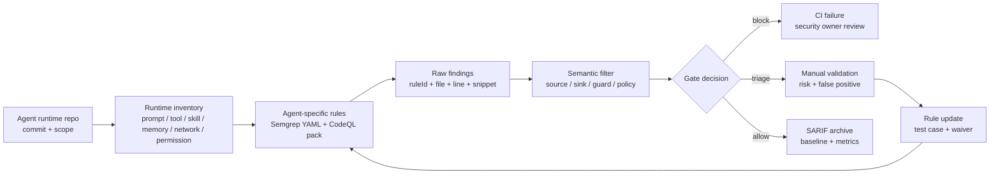

## 来源说明

本文基于 2026-06-30 的每日深度技术研究发布流程写成。今天筛选到的强信号来自 CLAWAUDIT：它不是继续讨论 prompt injection 或恶意插件市场，而是把本地 LLM Agent 自身的运行时代码定义成白盒扫描对象。

核心来源如下：

- Zhengsong Zhang、Zongze Li、Jiawei Guo、Haipeng Cai: [Local LLM Agents as Vulnerable Runtimes: A Source-Code Audit of the Agent Runtime Layer](https://arxiv.org/abs/2606.21071), arXiv:2606.21071v1, submitted on 2026-06-19。论文提出 CLAWAUDIT，从 STRIDE 派生五类本地 Agent runtime 漏洞边界，用 47 条 Semgrep YAML 规则和 30 条 CodeQL 查询评测 OpenClawBench。
- 论文 HTML 版本：[Local LLM Agents as Vulnerable Runtimes](https://arxiv.org/html/2606.21071v1)。本文用它核对 taxonomy、评测配置、per-CWE recall、语义盲区和局限。
- Semgrep Docs: [Write rules](https://docs.semgrep.dev/writing-rules/overview)。Semgrep 官方文档说明规则可用 pattern matching 与 data flow analysis 扫描安全问题、风格问题和配置文件。
- GitHub Docs: [Creating and working with CodeQL packs](https://docs.github.com/en/code-security/tutorials/customize-code-scanning/create-and-work-with-codeql-packs)。CodeQL pack 可创建、共享、依赖和运行自定义查询；model pack 可扩展默认分析对依赖和框架的识别。
- GitHub Docs: [SARIF support for code scanning](https://docs.github.com/en/code-security/reference/code-scanning/sarif-files/sarif-support)。SARIF 结果需要保留 ruleId、location、fingerprint、relatedLocations 和 codeFlows 等机器可读证据，适合作为 CI 安全审计结果的交换格式。

事实边界：CLAWAUDIT 的实验数字和结论来自作者论文；Semgrep、CodeQL、SARIF 能力来自官方文档。本文提出的 runtime SAST 流程、规则包目录、CI 门禁和指标是我的工程建议，不是上述来源共同声明的生产标准。本文只讨论授权白盒扫描、防御建设和安全工程，不提供攻击第三方目标的操作流程。

站内重复检查：本站 2026-06-21 的 OpenAnt 文章聚焦“候选漏洞到动态验证”的发现闭环；2026-06-24 的 Agent 安全审计关口文章聚焦上线前 tool/MCP/config/CI gate。本文不重复那两篇，而是下钻到更低一层：Agent runtime 本身该如何被建模成 Semgrep/CodeQL 可扫描的代码边界。

稳定 slug：`2026-06-30-agent-runtime-static-audit-boundary`。

## 先给结论

本地 LLM Agent 已经不是普通 CLI 工具。它们把用户目标、模型输出、工具参数、workspace 文件、长期记忆、技能元数据和主机资源连在一起，实际扮演一个高权限运行时。

因此，安全审计不应该只扫插件、MCP server 或 prompt。更应该扫 Agent runtime 自己的六个核心组件：

- prompt builder
- parser
- tool dispatcher
- skill loader
- memory writer
- network client / permission gate

CLAWAUDIT 的核心贡献是把这件事做成了静态规则工程：先定义运行时信任边界，再把边界落成 Semgrep 和 CodeQL 规则，并用历史 advisory 做 temporal train/test 验证。作者报告，在 held-out test 上，Semgrep recall 从 21.7% 提升到 66.8%，CodeQL recall 从 13.8% 提升到 75.1%。

我的工程判断是：Agent runtime SAST 不应该追求一次扫描直接判定漏洞。它应该产出一组 recall 优先的 runtime finding，再经过语义过滤、所有权策略检查、人工 triage 和 SARIF/CI 留痕。静态规则负责抓“有形状的 bug”；策略和人审负责补“只有意图才知道对错的 bug”。



## 技术问题：Agent runtime 是新的安全边界

传统 SAST 的默认模型更像 Web 应用：HTTP request、database query、template rendering、redirect、DOM、shell command、文件路径。这个模型当然仍然有用，但本地 Agent runtime 的数据流更绕。

一个不可信值可能来自：

| Source | 示例 | 风险 |
| --- | --- | --- |
| 用户自然语言目标 | “帮我整理这个目录并发给团队” | 意图被解析成文件、网络或 shell 参数 |
| 检索文档与网页 | README、issue、网页、邮件 | 外部文本进入 prompt、memory 或工具参数 |
| 模型输出 | tool call args、计划步骤、生成脚本 | 模型把上下文转成执行 operand |
| 技能元数据 | skill description、install script、tool schema | 加载器把元数据当可信指令或代码路径 |
| workspace 文件 | 路径名、配置、日志、缓存 | 文件名或内容进入 prompt/log/path join |
| 长期记忆 | 用户偏好、项目规则、历史经验 | 旧状态影响新权限判断和副作用动作 |

这些 source 会流向另一组 Agent 专属 sink：prompt template、memory writer、tool dispatcher、shell executor、skill loader、URL fetcher、log emitter、permission-gated handler。通用规则包能覆盖一部分 shell/path/SSRF 问题，但它们通常不知道“prompt builder 是特权 sink”、“memory writer 是持久污染面”、“tool dispatcher 是执行边界”。

这就是 CLAWAUDIT 的价值：把 Agent runtime 的实现层从黑盒行为问题，变成白盒代码边界问题。

## 机制拆解：五类 runtime 信任边界

CLAWAUDIT 从 STRIDE 派生五类互斥边界。工程上可以把它理解成五个“缺了哪道 guard”的问题。

| 类别 | 边界问题 | 典型 sink | 审计问题 |
| --- | --- | --- | --- |
| CAT-1 Pre-prompt Sanitization | 不可信文本是否进入可信指令 | prompt builder、memory writer | 这段文本能否被安全放进 system/developer/tool 指令或长期记忆 |
| CAT-2 Operand-to-Execution | 不可信 operand 是否进入执行器 | exec/spawn/eval、dynamic require、skill loader | 这个参数能否驱动代码执行或模块加载 |
| CAT-3 Action-to-Resource Confinement | 动作是否越过资源边界 | filesystem、sandbox、parser allocator、bind | 文件路径、symlink、size、接口绑定是否仍在约束内 |
| CAT-4 Action-to-Outbound Egress | 动作是否外发到不该去的地方 | HTTP/WS request、log、error formatter | URL、日志、错误消息是否泄漏或触达不可信目的地 |
| CAT-5 Caller-to-Handler Authorization | 调用者是否有权触发处理器 | handler entry、route mount、skill install gate | caller/session/resource 是否在入口处绑定并校验 |

这个 taxonomy 对工程落地很有用，因为它避免了“Agent 安全很复杂，所以先做个大模型评审”的空泛路径。每个类别都能变成一组规则开发任务：

1. 找 source：哪些值来自用户、模型、tool output、memory、workspace 或 skill metadata。
2. 找 sink：哪些函数会构造 prompt、写 memory、执行命令、读写文件、发网络请求或放行 handler。
3. 找 guard：哪些 helper 表示 allowlist、path containment、auth check、size limit、scheme/domain check。
4. 写 Semgrep：先覆盖局部、有重复形状的 pattern。
5. 写 CodeQL：补跨函数、helper 调用、guard domination 这类 Semgrep 不擅长的场景。
6. 写回归样本：每条规则都要有 vulnerable / fixed 两个最小样本。

```text
untrusted source -> runtime transformer -> privileged sink
                         |
                         v
                    required guard
```

最小规则不是“检测所有 Agent 风险”，而是回答一个窄问题：某类不可信值到某类特权 sink 前，是否出现了预期 guard。

## 工程判断：Semgrep 和 CodeQL 应该分工，不该互相替代

CLAWAUDIT 同时实现 Semgrep 和 CodeQL 后端，这一点值得保留到工程实践里。

Semgrep 适合做三件事：

- 快速枚举局部危险形状，例如 `path.join` 后缺 containment、`realpath` 后缺 symlink check、模型生成 URL 直接 `fetch`。
- 扫配置和脚本，例如 skill manifest、MCP config、workflow YAML、权限声明。
- 给开发者提供低门槛规则和 PR 注释。

CodeQL 适合做三件事：

- 跨函数追 guard-like helper，例如 handler 入口是否调用了 `requireAuth`、`assertWorkspaceOwner` 或同等函数。
- 做 bounded data-flow，不把整个 Agent runtime 当普通 Web taint 图硬跑。
- 把规则打包成 CodeQL pack / model pack，进入 code scanning 和 SARIF 流程。

我的建议是不要先写“大一统 taint analyzer”。先从一组可解释的规则包开始：

```text
security/agent-runtime-sast/
  semgrep/
    cat1-pre-prompt.yml
    cat2-operand-execution.yml
    cat3-resource-confinement.yml
    cat4-outbound-egress.yml
    cat5-authz.yml
    tests/
  codeql/
    qlpack.yml
    cat1/
    cat2/
    cat3/
    cat4/
    cat5/
    tests/
  fixtures/
    vulnerable/
    fixed/
  policy/
    sources.yml
    sinks.yml
    guards.yml
    owners.yml
```

`sources.yml`、`sinks.yml`、`guards.yml` 是关键。它们把组织内的 runtime 语义显式化，避免规则只靠变量名猜。比如：

```yaml
sources:
  - id: model_tool_args
    patterns:
      - "toolCall.arguments"
      - "parsedAction.args"
  - id: workspace_text
    patterns:
      - "readFile(...)"
      - "workspace.index.get(...)"

sinks:
  - id: prompt_builder
    functions:
      - "buildSystemPrompt"
      - "appendDeveloperInstruction"
  - id: shell_executor
    functions:
      - "exec"
      - "spawn"

guards:
  - id: path_containment
    functions:
      - "assertInsideWorkspace"
      - "safeResolvePath"
  - id: caller_authz
    functions:
      - "requireSessionUser"
      - "assertWorkspaceOwner"
```

这不是为了做复杂平台，而是为了让规则知道本仓库的真实边界。没有这层配置，很多 Agent runtime bug 在代码形状上和合法代码一样。

## 工程落地方案：一周内做一个 recall-first 审计门

第一天，做 runtime inventory。列出所有 prompt builder、tool dispatcher、skill loader、memory writer、network client、permission gate、handler entry。每个入口标 owner、风险等级和当前 guard。

第二天，整理 source/sink/guard 清单。先不要写规则，先把“不可信值从哪里来、特权动作在哪里发生、什么算合格 guard”写成 YAML。缺少 owner 的边界直接标 `unknown`。

第三天，写 5 到 10 条 Semgrep 规则。只覆盖最确定的形状：未校验 path join、symlink following、shell operand、model URL fetch、handler 缺入口 auth。每条规则配 vulnerable/fixed fixture。

第四天，写 2 到 3 条 CodeQL 查询。优先补 Semgrep 不好表达的场景：handler 入口缺 guard-like helper、工具调用参数跨 helper 到 executor、workspace resource 缺 ownership check。

第五天，接入 CI 但不阻断。输出 SARIF，保留 ruleId、location、partialFingerprints、relatedLocations。先跑全仓 baseline，记录 finding 数、owner、误报原因。

第六天，做语义过滤。把 finding 分为四类：真实问题、需要人工确认、规则过宽、缺少策略定义。不要急着压误报率；先确认每条误报到底是规则问题还是 policy 缺失。

第七天，只阻断最高风险类别。建议先阻断 CAT-2 直接执行、CAT-3 越权文件访问、CAT-5 handler 缺 auth。CAT-1 prompt/memory 与 CAT-4 log/error egress 先进入 triage，避免误伤过高。

## 适用场景

这条流程适合三类团队。

第一，本地 Agent 或桌面 Agent 团队。只要产品能访问 shell、文件系统、浏览器、凭据、消息应用或本地服务，就应该把 runtime 当高权限软件审计。

第二，企业内部 Agent 平台。平台通常有工具市场、技能加载、RAG、长期记忆、审批、审计日志和多租户资源。这里最危险的不是单个插件，而是 runtime loader 和 permission gate 的实现缺口。

第三，安全团队评估 Agent 产品引入风险。相比只做黑盒 prompt injection 测试，runtime SAST 能回答更工程化的问题：有没有入口鉴权、有没有路径 containment、有没有 URL allowlist、有没有 memory write sanitization。

不适合的场景也明确：只读聊天机器人、无本地权限的一次性问答、没有持久状态和工具调用的服务，不需要完整 Agent runtime SAST。用普通 SAST、依赖扫描、配置审计和 prompt 基础防护即可。

## 失败模式

第一，把 recall-first 规则直接当发布阻断。CLAWAUDIT 作者也指出 live-code audit 需要大量人工 triage。规则越偏 recall，越不能直接当漏洞事实。

第二，只扫插件不扫 runtime。恶意 skill 当然要审，但 benign skill 经过不安全 loader、过晚的 permission gate 或不净化的 memory writer，仍可能造成同样后果。

第三，把通用 Web taint 图照搬到 Agent runtime。Agent 的 source/sink 不同，图更长，prompt/tool/memory 会制造新路径。通用规则低 recall 不代表 Semgrep/CodeQL 没用，而是模型错位。

第四，缺少 policy 规格。资源所有权、敏感字段语义、denylist 完整性、session 绑定这些问题，代码本身可能没有明显坏形状。没有 policy，静态规则只能猜。

第五，finding 没有证据结构。自然语言报告不能进 CI gate。至少要有 ruleId、file、line、snippet、source、sink、missing guard、risk、owner、waiver、fingerprint。

## 可验证指标

| 指标 | 怎么测 | 目标 |
| --- | --- | --- |
| Runtime inventory coverage | 核心组件是否都进入 source/sink/guard 清单 | prompt/tool/skill/memory/network/permission 100% |
| Rule regression coverage | 每条规则是否有 vulnerable/fixed fixture | 新规则 100% |
| Advisory recall | 历史修复文件是否被至少一个 finding 命中 | 先看趋势，不追绝对数 |
| Triage precision | 人审后真实问题 / 总 finding | 分类别统计，不做全局平均 |
| Time to triage | 每个 finding 到结论的中位时间 | 高危类别当天闭环 |
| False positive reason | 误报是否归因到规则过宽、policy 缺失或代码模式例外 | 100% 可归因 |
| SARIF stability | 同一问题跨 commit 是否保持 fingerprint | baseline 可维护 |
| Gate escape rate | 阻断类别上线后被人工发现的漏报数 | 持续下降 |

最重要的是分层看指标。CAT-2 shell operand 和 CAT-5 authz 缺口的漏报代价，通常高于 CAT-1 prompt 片段误入低风险总结。

## 我会如何实现和验证

我会从一个最小 pipeline 开始，不做平台化。

CI 命令形态如下：

```sh
semgrep --config security/agent-runtime-sast/semgrep --sarif --output semgrep-agent-runtime.sarif .
codeql database create codeql-db --language=javascript-typescript --source-root .
codeql database analyze codeql-db security/agent-runtime-sast/codeql --format=sarif-latest --output codeql-agent-runtime.sarif
```

然后写一个很小的归并脚本，把两个 SARIF 转成统一 JSON：

```ts
type RuntimeFinding = {
  scanner: "semgrep" | "codeql";
  category: "CAT-1" | "CAT-2" | "CAT-3" | "CAT-4" | "CAT-5";
  ruleId: string;
  file: string;
  line: number;
  source?: string;
  sink: string;
  missingGuard?: string;
  risk: "block" | "triage" | "observe";
  owner: string;
  fingerprint: string;
};
```

验证不需要一开始就复现 CLAWAUDIT 的完整 OpenClawBench。更现实的是建立内部 20 个 regression fixtures：

- CAT-1：workspace 文件名进入 system prompt；tool output 被写入长期记忆。
- CAT-2：模型参数进入 shell；skill manifest 触发 dynamic require。
- CAT-3：相对路径逃出 workspace；symlink 追踪越界；解压/解析缺 size budget。
- CAT-4：模型生成 URL 直接请求；错误消息包含 credential-like 值。
- CAT-5：handler 缺 session check；workspace id 未绑定 owner；skill install 缺审批。

每个 fixture 都有 vulnerable 和 fixed 两版。规则 PR 的最低要求是：新增规则命中 vulnerable，不命中 fixed，并且 SARIF 里能定位到主要修复点。

## 局限分析

CLAWAUDIT 的评测基于 OpenClaw 历史 advisory。它能证明 Agent runtime 专用规则对这个 benchmark 有明显 recall 增益，但不能直接证明规则能泛化到所有本地 Agent、所有语言或所有架构。

作者把 OpenClawBench 的检测定义为 file-level advisory recall：finding 命中修复文件即算检测。这适合处理补丁重构造成的 line drift，但比精确定位漏洞行更宽松。工程采用时，仍要记录 line、snippet、source/sink 和人工结论。

规则最擅长抓有重复代码形状的问题。论文也指出，incomplete denylist、information exposure、resource ownership authorization 这类依赖意图的问题，很难只靠静态 pattern 判断。我的建议是把这些问题显式交给 policy mining、runtime metadata 和人工审核，不要假装规则能覆盖全部语义。

最后，Agent runtime SAST 不能替代运行时隔离。即使规则全过，也仍需要最小权限、sandbox、网络出站控制、凭据隔离、审计日志、人工审批和回滚机制。静态审计只是发布前的一道证据门。

## 自审

- 事实可靠性：核心数字来自 arXiv 论文；工具能力来自 Semgrep、GitHub CodeQL 和 SARIF 官方文档。
- 来源完整性：主源、HTML 全文和官方工程文档均已列出；没有把社区转述当事实依据。
- 非复述性：本文没有复述论文摘要，而是转成 Agent runtime SAST 的规则包、CI、SARIF、triage 和指标方案。
- 标题准确性：标题只声称“应该成为白盒扫描对象”，没有夸大成“解决 Agent 安全”。
- 站内差异化：区别于 OpenAnt 的验证闭环和 Agent Audit 的上线关口，本文聚焦 runtime source-code audit 边界。
- 猜测边界：迁移到其他 Agent、规则包目录和 CI 门禁是工程建议，不是论文实验结论。
- 安全边界：只讨论授权白盒扫描、防御建设和审计流程，不提供未授权攻击步骤。
- 工程价值：包含 taxonomy、流程图、规则目录、配置样例、CI 命令、数据结构、SOP、指标和局限。
