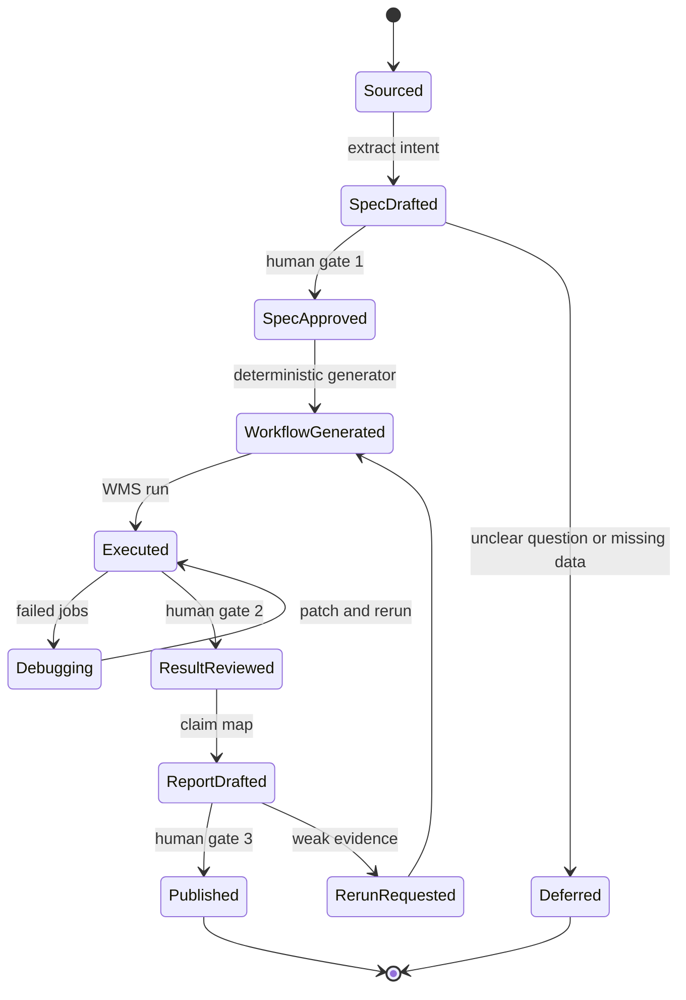

## 来源说明

本文基于 2026-07-01 的每日深度技术研究发布流程写成。今天没有选择继续写 Agent runtime SAST 或记忆安全，因为站内 2026-06-28、2026-06-29、2026-06-30 已连续覆盖 policy-as-code、origin-bound memory 和 Agent runtime 静态审计。更有差异化的新材料来自 AI Native 研究工作流：近期论文开始把“AI 做研究”收窄为可验证的 workflow harness，而不是泛化的 autonomous scientist 叙事。

核心来源如下：

- Komal Thareja、Hamza Safri、Rajiv Mayani、Anirban Mandal、Ewa Deelman: [From Specification to Execution: AI Assisted Scientific Workflow Management](https://arxiv.org/abs/2606.18425), arXiv:2606.18425v1, submitted on 2026-06-16。论文提出把 workflow intent、design、implementation 分离，先做结构化规格验证，再生成和调试 Pegasus workflow；同时用 MCP 层暴露提交、监控和控制接口。
- Chen Zhu、Xiaolu Wang、Weilong Zhang: [(Human) Attention Is (Still) All You Need: Human oversight makes AI-assisted social science reliable](https://arxiv.org/abs/2606.12848), arXiv:2606.12848v1, submitted on 2026-06-11。论文用 280 次完整研究运行比较 unconstrained multi-agent baseline 与 HLER，人审 gate 和确定性计算把 critical failure rate 从作者报告的 72% 降到 16%。
- Bartosz Balis、Michal Orzechowski、Piotr Kica、Michal Dygas、Michal Kuszewski: [From Research Question to Scientific Workflow: Leveraging Agentic AI for Science Automation](https://arxiv.org/abs/2604.21910), arXiv:2604.21910v1, submitted on 2026-04-23。论文把系统拆成 semantic layer、deterministic layer 和 knowledge layer，并报告 Skills 将 intent full-match accuracy 从 44% 提升到 83%，deferred workflow generation 将 data transfer 降低 92%。
- Pegasus WMS Docs: [Introduction](https://pegasus.isi.edu/documentation/user-guide/introduction.html) 与 [Monitoring, Debugging and Statistics](https://pegasus.isi.edu/documentation/user-guide/monitoring-debugging-stats.html)。Pegasus 文档说明科学 workflow 是由 jobs、files 和 dependencies 组成的 DAG，WMS 负责合法拓扑执行、数据管理、故障重试、provenance、monitoring 和 rescue workflow。
- Common Workflow Language Docs: [Common Workflow Language User Guide](https://www.commonwl.org/user_guide/)。CWL 官方用户指南把 CWL 定义为开放标准，用于描述可移植的 workflow 和 command-line tools。
- Nextflow Docs: [Nextflow](https://www.nextflow.io/) 与 [Kubernetes executor](https://docs.seqera.io/nextflow/kubernetes)。Nextflow 文档强调 reproducible、portable scientific workflows，并说明 Kubernetes executor 用 pod 执行容器化 workflow jobs。
- HyperFlow Kubernetes repo: [hyperflow-wms/hyperflow-k8s-deployment](https://github.com/hyperflow-wms/hyperflow-k8s-deployment)。该仓库说明 HyperFlow 在 Kubernetes 上需要 workflow graph、worker image、data image 和 job template；这给“确定性执行层”提供了可复核实现参照。

事实边界：论文中的实验数字和系统能力来自作者报告；Pegasus、CWL、Nextflow、HyperFlow 的能力来自官方文档或项目仓库。本文提出的研究工作流 harness、目录结构、SOP、指标、成本估算和回滚方案是我的工程建议，不是上述来源共同声明的生产标准。

站内重复检查：2026-06-16 文章写企业上下文层，2026-06-23 写 Session Ledger，2026-06-25 写文档 Agent 审计动作流。本文不再泛谈工作流状态，而是聚焦“研究问题如何变成可验证规格、可执行 DAG 和人审 gate”，适合作为 AI Native 研究工作流的支柱笔记。

稳定 slug：`2026-07-01-ai-native-research-workflow-harness`。

## 先给结论

研究型 Agent 的第一版不应该直接替你“做完整研究”。更稳的工程边界是：Agent 负责把自然语言研究问题转成结构化规格、候选设计、假设和解释；确定性程序负责数据处理、统计估计、workflow 编排和结果校验；人类负责关键决策 gate、异常解释和结论放行。

这不是保守口号。三组材料给出同一个机制：

- Specification-to-Execution 说明，直接从自然语言生成 workflow 代码会损害透明性、可复现性和与 WMS 的集成；先拆 intent、design、implementation，更容易验证。
- Research-Question-to-Workflow 说明，LLM 非确定性应该限制在 intent extraction；相同 intent 应生成相同 workflow。
- HLER 说明，在研究任务里，模型能力之外，认知劳动如何在人和机器之间分配会显著影响可靠性。

我的工程判断是：AI Native 研究工作流的上线单元不是“一个研究 Agent”，而是一套 `Research Workflow Harness`。

```mermaid
flowchart LR
  A["Research question"] --> B["Spec Agent<br/>intent + constraints"]
  B --> C["Human Gate 1<br/>scope + estimand + data"]
  C --> D["Design Agent<br/>DAG plan + validation plan"]
  D --> E["Deterministic Generator<br/>Pegasus / CWL / Nextflow / Snakemake"]
  E --> F["Execution Engine<br/>jobs + files + dependencies"]
  F --> G["Debug Agent<br/>logs + failed job diagnosis"]
  G --> H["Human Gate 2<br/>method / result sanity"]
  H --> I["Report Agent<br/>claim map + limitations"]
  I --> J["Human Gate 3<br/>publish / rerun / reject"]
  F --> K["Run ledger<br/>provenance + cost + metrics"]
  J --> K
```



一句话：让 Agent 写规格和解释，让 workflow engine 跑实验，让人类决定什么可以算结论。

## 场景定义：一周内可试跑的研究复现实验

选择一个具体场景：团队每周要复现一篇论文或验证一个业务研究假设，例如“某个推荐排序策略是否提升长尾内容曝光而不伤害点击率”，或者“一个公开数据集上的模型改动是否稳定提升召回”。原流程通常由研究员手动读论文、找数据、写脚本、调参数、修环境、记录结果、写复盘。

这个场景适合 AI Native 改造，因为它满足四个条件：

- 输入有自然语言问题、论文、数据字典、实验约束和目标指标。
- 输出可以落成结构化规格、workflow DAG、日志、指标表和研究笔记。
- 中间步骤有确定性执行面：数据清洗、训练、评估、统计检验、图表生成。
- 结论有风险，不能让 Agent 在没有人审的情况下宣布发现。

第一版目标不是自动发表论文，而是把“从问题到可复现实验包”的时间压短，同时让失败更可定位。

## 原流程痛点

| 原步骤 | 常见问题 | AI Native 后要改造的对象 |
| --- | --- | --- |
| 读论文和需求 | 问题、变量、数据范围和评价指标混在自然语言里 | 结构化 research spec |
| 写实验脚本 | 研究员边想边写，脚本与假设耦合 | 可复核 workflow design |
| 配环境和跑任务 | 依赖、容器、CPU/GPU、存储路径靠个人经验 | WMS + container + resource profile |
| 调试失败 | 日志分散，错误跨数据、代码、环境、资源层 | debug evidence packet |
| 写结论 | 结果、反证、排除条件容易遗漏 | claim map + limitation checklist |
| 交接复盘 | 很难重跑同一次研究 | run ledger + provenance |

最危险的不是 Agent 写错一段代码，而是它把“研究设计、数据处理、统计估计、解释结论”全部揉成一段看似顺滑的输出。这样失败时既不知道错在哪，也不知道该让谁负责。

## 目标工作流

目标形态是把研究任务拆成三个平面：语义平面、确定性执行平面和决策平面。

| 平面 | 由谁负责 | 输入 | 输出 | 不能做什么 |
| --- | --- | --- | --- | --- |
| 语义平面 | Spec Agent、Design Agent、Report Agent | 研究问题、论文、数据字典、约束 | intent、DAG 设计、claim map、局限 | 不直接改原始数据，不直接宣布结论 |
| 执行平面 | Generator、WMS、统计脚本、validator | 通过人审的 spec、workflow template、容器 | jobs、files、metrics、logs、provenance | 不解释业务意义 |
| 决策平面 | 人类研究负责人、领域专家、方法审查人 | spec、设计、结果、异常、成本 | approve / rerun / reject | 不跳过关键 gate |

这里的关键不是多加几个 Agent 名字，而是把“能被机器验证的东西”从自然语言里拉出来。研究问题要先变成规格，规格要先被审核，审核后才允许生成 DAG，DAG 跑出的结果再进入结论审核。



## Agent 与工具分工

第一版我会用六个角色，不做“全能研究员 Agent”。

| 角色 | 职责 | 输入 | 输出 | 人工审核点 |
| --- | --- | --- | --- | --- |
| Source Scout | 收集论文、数据说明、已有代码、基线结果 | 研究问题、关键词、仓库 | source bundle | 研究负责人确认来源可信 |
| Spec Agent | 抽取研究 intent、变量、约束、指标和排除范围 | source bundle、数据字典 | `research-spec.yaml` | Gate 1 审 scope、estimand、数据权限 |
| Design Agent | 设计 workflow DAG、统计检验和失败检查 | approved spec、模板库 | `workflow-design.md`、`checks.yaml` | 方法审查人确认设计 |
| Generator | 从设计生成 Pegasus/CWL/Nextflow/Snakemake workflow | approved design、模板 | 可执行 workflow、容器清单 | 自动校验，不直接放行 |
| Debug Agent | 读取 logs、failed jobs、resource events | WMS 日志、validator 输出 | debug patch 建议、rerun plan | 修改 workflow 前需确认 |
| Report Agent | 生成结论草稿和 claim map | metrics、plots、provenance | report draft、limitations | Gate 3 人类放行 |

MCP 的价值在这里不是“让 Agent 有更多工具”，而是给 workflow submission、status、log retrieval、artifact listing 和 cancellation 一个统一接口。Agent 可以通过 MCP 查询执行状态和日志，但不能绕过 Gate 直接提交高成本任务或发布结论。

## 数据与权限边界

研究工作流必须把数据权限、执行权限和结论权限分开。

第一，数据读取按 project scope。Agent 只能读取本次 spec 声明的数据集、论文、代码仓库和配置。涉及个人数据、医疗影像、客户数据或商业日志时，Spec Agent 必须输出 `data_classification`、`allowed_use`、`retention` 和 `export_rules`。

第二，执行权限按成本和副作用分级。小样本 dry run 可以自动跑；全量 GPU 训练、跨集群任务、外部 API 调用和数据导出必须进入人工审批。

第三，结论权限必须保留给人。Agent 可以写“结果显示”“作者报告”“本次运行观测到”，但不能在没有 Gate 3 的情况下写入权威研究库、PRD 决策、论文草稿结论或对外材料。

一个最小 spec 可以这样写：

```yaml
id: research-run-2026-0701-001
question: "新排序特征是否提升长尾内容曝光且不降低 CTR"
owner: "ranking-research"
data:
  datasets:
    - name: "offline-impression-sample"
      version: "2026-06-week4"
      classification: "internal-confidential"
      allowed_use: ["offline-evaluation"]
      export: "blocked"
intent:
  treatment: "add creator-diversity feature"
  baseline: "current production ranker snapshot"
  metrics:
    primary: ["long_tail_exposure_share", "ctr"]
    guardrail: ["latency_p95", "creator_block_rate"]
  minimum_effect:
    long_tail_exposure_share: "+3%"
    ctr: ">= -0.2%"
constraints:
  max_runtime_hours: 4
  max_gpu_hours: 0
  allowed_actions: ["dry_run", "offline_eval", "generate_report"]
  blocked_actions: ["production_rollout", "external_export", "write_authoritative_decision"]
human_gates:
  - "spec_approval"
  - "method_review"
  - "claim_release"
```

这个文件比一段 prompt 有用，因为它能被校验、diff、复用和审计。

## 执行 SOP

第一周只做一个研究问题、一个数据集、一个 workflow engine。不要一上来做跨学科 autonomous scientist。

1. 建立 `research-workflows/<slug>/` 目录，放 `sources/`、`spec/`、`workflow/`、`runs/`、`reports/`、`reviews/` 和 `ledger/`。
2. Source Scout 只收集原始来源，不写结论。每个来源记录 URL、版本、访问时间、可信度和能支撑的 claim。
3. Spec Agent 生成 `research-spec.yaml`，必须列出 treatment、baseline、metrics、数据版本、排除范围和成本上限。
4. 人类做 Gate 1。问题不清、数据不可用、指标不可验证时直接暂缓，不进入执行。
5. Design Agent 生成 `workflow-design.md` 和 `checks.yaml`，说明 DAG 节点、输入输出、统计检验、sanity checks 和失败条件。
6. Generator 只从 approved design 生成 workflow，不允许自由发明未审步骤。
7. WMS 先跑小样本 dry run。所有 job、file、dependency、容器版本、参数和日志写入 run ledger。
8. Debug Agent 只能基于日志提出 patch 和 rerun plan；改动 workflow 前需要人审或至少通过低风险策略。
9. 全量运行后，Report Agent 生成 claim map：每个结论必须绑定 metric、run id、数据版本、统计检查和局限。
10. Gate 3 决定 publish、rerun 或 reject。只有通过后，结论才能进入知识库、路线图或论文草稿。

目录结构保持简单：

```text
research-workflows/ranking-long-tail-2026-0701/
  sources/
    source-index.yaml
  spec/
    research-spec.yaml
    approvals.md
  workflow/
    workflow-design.md
    checks.yaml
    main.nf
    containers.lock
  runs/
    dry-run-001/
    full-run-001/
  reports/
    claim-map.md
    figures/
  reviews/
    method-review.md
    release-decision.md
  ledger/
    events.jsonl
    costs.jsonl
```

这套目录不新潮，但可交接。研究工作最怕“某个 Agent 当时好像跑过一个版本”，目录和 ledger 是最低成本的反制。

## 工具栈选择理由

如果团队已经用 Pegasus，优先复用 Pegasus。它本来就把 workflow 表达成 jobs、files、dependencies，并提供 provenance、monitoring、debugging、retry、checkpoint 和 rescue workflow。这正好承接 Agent 生成的规格和设计。

如果团队偏生信或数据管线，Nextflow、Snakemake 或 CWL 也合适。关键不是哪一个最先进，而是 workflow 必须能表达 DAG、固定输入输出、容器/环境、资源请求、日志和可重跑规则。

如果要让 Agent 操作 workflow engine，可以在外面包一层 MCP server，暴露少数命令：

```yaml
tools:
  submit_dry_run:
    allowed_after: ["spec_approved", "design_approved"]
    max_runtime_minutes: 30
  get_status:
    allowed_after: ["submitted"]
  fetch_logs:
    allowed_after: ["submitted"]
  cancel_run:
    allowed_after: ["submitted"]
  submit_full_run:
    approval_required: true
    max_runtime_hours: 4
blocked:
  - "delete_dataset"
  - "export_raw_data"
  - "publish_claim"
```

这样 MCP 是受控接口，不是万能后门。Agent 能看状态、拿日志、建议修复；高成本和高影响动作仍由 gate 控制。

## 质量评估

| 指标 | 计算方式 | 第一阶段门槛 |
| --- | --- | --- |
| Spec completeness | spec 是否包含 question、baseline、treatment、metrics、data、constraints、gates | 100% |
| Intent approval rate | Gate 1 一次通过的 spec 比例 | 逐周上升即可 |
| Workflow determinism | 相同 approved spec 是否生成相同 DAG hash | 100% |
| Dry-run pass rate | 小样本运行通过 validator 的比例 | 80% 以上 |
| Debug localization | failed run 是否定位到 data/code/env/resource/method 层 | 90% 以上 |
| Claim traceability | 每条结论是否绑定 run id、metric、数据版本和检查 | 100% |
| Human correction rate | 人类修改 Agent spec/design/report 的比例 | 逐周下降 |
| Critical failure rate | 错误结论、错用数据、无效估计、越权执行 | 第一阶段 0 容忍 |
| Reproducibility | 新机器或新执行环境能否按 lock 文件重跑 | 抽样通过 |
| Cost per accepted claim | 总成本除以通过 Gate 3 的有效结论数 | 可解释且可控 |

不要用“Agent 写了多少代码”衡量研究自动化。真正要看的是：问题是否被正确规格化，执行是否可重跑，失败是否能定位，结论是否有证据链，人类审核是否抓住关键风险。

## 成本估算

第一版可以用很粗的账本：

```text
run_cost =
  source_collection_minutes * reviewer_rate
  + spec_review_minutes * reviewer_rate
  + model_cost
  + compute_cost
  + debug_minutes * engineer_rate
  + final_review_minutes * reviewer_rate

net_value =
  baseline_manual_research_minutes * researcher_rate
  - run_cost
  - rerun_cost
  - correction_cost
```

如果 Agent 让一个复现实验从两天缩短到半天，但每次都需要资深研究员重写统计设计，就没有真正省钱。反过来，如果它只是节省脚本模板和日志整理，却显著提升可复盘性，也值得保留，因为研究工作流的价值不只在速度，还在可审计和可交接。

## 失败模式与回滚

第一类失败是规格错。Agent 把研究问题里的 target population、baseline 或 metric 抽错，后面所有执行都变成精确地做错事。回滚方式是 Gate 1 阻断，并把失败样本加入 spec checklist。

第二类失败是 workflow 结构错。DAG 少了数据过滤、泄漏检查或 bootstrap 重采样。回滚方式是 workflow design 必须通过 `checks.yaml`，并保留 approved design hash；修复后重新生成 DAG。

第三类失败是执行环境错。容器版本、依赖、路径、Kubernetes storage、权限或资源请求不稳定。回滚方式是 containers lock、dry run、resource profile 和 WMS retry/rescue，而不是让 Agent 反复猜命令。

第四类失败是 debug 越权。Debug Agent 为了让任务跑通，建议跳过 validator、降低样本检查或替换数据源。回滚方式是策略门：任何降低质量 gate 的 patch 都必须人工批准。

第五类失败是结论过度外推。离线样本通过，不代表线上用户行为成立；一个公开数据集上的提升，不代表内部数据成立。回滚方式是 claim map 必须区分 `observed result`、`author-reported result`、`inference` 和 `recommendation`。

第六类失败是成本失控。Agent 在调试时反复提交全量任务。回滚方式是默认只允许 dry run，full run 需要预算和审批；每次 run 写入成本 ledger。

## 我会如何实现和验证

我会先做一个最小 CLI，而不是先买平台。

```text
research-harness/
  commands/
    collect-sources.ts
    draft-spec.ts
    validate-spec.ts
    generate-workflow.ts
    run-dry.ts
    collect-ledger.ts
    draft-claim-map.ts
  templates/
    research-spec.schema.json
    checks.schema.json
    nextflow/
    pegasus/
  policies/
    action-policy.yaml
  examples/
    ranking-long-tail/
```

一周实验计划：

| 天数 | 任务 | 验收 |
| --- | --- | --- |
| Day 1 | 选一个历史研究问题，整理 3 个来源和 1 个数据字典 | source index 完整 |
| Day 2 | 写 spec schema 和 validate-spec | 手写 spec 能通过，缺字段会失败 |
| Day 3 | 让 Spec Agent 从来源生成 spec | 人审记录修改点 |
| Day 4 | 从 approved spec 生成最小 workflow | 相同 spec 的 DAG hash 稳定 |
| Day 5 | 跑 dry run 和 validator | 日志、成本、失败都进 ledger |
| Day 6 | 故意注入一个数据路径错误和一个指标错误 | Debug Agent 能定位，不能绕过 gate |
| Day 7 | 生成 claim map 和复盘 | 人类能根据 ledger 判断 publish/rerun/reject |

最小可验证目标：不用证明 Agent 能独立做研究，只证明它能把研究问题稳定转成可审、可跑、可复盘的实验包。

## 工程判断

我不看好“一个 Agent 读完论文、写完代码、跑完实验、直接给结论”的第一版落地路径。它演示效果好，但责任链太弱。

更可靠的路线是把 Agent 放在研究 workflow 的语义层和解释层，把执行交给确定性 workflow system，把结论交给人审 gate。这样做看起来慢一点，但它把失败变成可定位对象：spec 失败、design 失败、execution 失败、debug 失败、claim 失败，每一类都有不同负责人和回滚方式。

这也解释了为什么上述论文值得合并看：Specification-to-Execution 解决“从规格到执行”的结构化路径，Research-Question-to-Workflow 解决“把 LLM 非确定性限制在 intent”的边界，HLER 解决“人类注意力应该放在哪些 gate”的可靠性问题。三者共同指向一个朴素结论：研究自动化的核心不是替代研究员，而是把研究员最需要判断的地方从脚本泥潭里抬出来。

## 局限分析

第一，本文的方案更适合有明确数据、指标和可执行 workflow 的研究任务。开放式理论探索、访谈式研究、早期问题发现不一定能马上规格化成 DAG。

第二，论文结果来自特定任务和系统。HLER 的 failure rate 降幅不能直接外推到所有研究领域；1000 Genomes 和医学影像 workflow 的结果也不能证明所有企业研究任务都能低成本自动化。

第三，workflow engine 不能替代方法学判断。它能保证任务按 DAG 跑完，不保证指标定义正确、样本代表性充分或因果解释成立。

第四，Agent 生成的 spec 也会受来源质量限制。如果论文、数据字典或历史代码本身含糊，Spec Agent 可能只是把含糊变成结构化 YAML。

第五，人审 gate 会带来成本。团队需要明确哪些 gate 真正防止高成本错误，哪些只是形式化审批。否则 AI Native 工作流会变成更复杂的人工流程。

## 自审

事实可靠性：关键事实均来自 arXiv 原始页、Pegasus/CWL/Nextflow 文档和 HyperFlow 仓库；实验数字明确标注为作者报告结果。

来源完整性：本文没有只复述论文摘要，而是把三组材料合并成 AI Native 研究工作流 harness 的工程方案。

标题克制性：标题只表达工程边界，不声称 Agent 不能参与研究，也不声称本文方案解决所有科学自动化问题。

站内重复：此前 AI Native 文章分别写企业上下文层、Session Ledger、文档动作流和 Agent 控制面；本文聚焦研究问题到规格、DAG、执行和 claim gate，不重复。

工程价值：包含流程图、状态机、角色分工、数据结构、SOP、工具栈、指标、成本、失败模式、回滚和一周实验计划。

安全与合规：本文不涉及未授权攻击或第三方目标操作；涉及数据权限时强调 scope、classification、export rules 和人工 gate。

发布判断：材料足够支撑一篇高质量 AI Native 实践支柱文章，可以发布。
