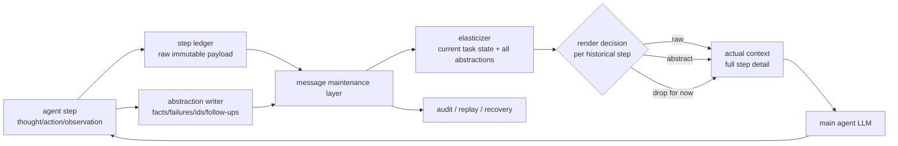

## 来源说明

本文基于 2026-07-02 的每日深度技术研究发布流程写成。今天没有选择继续写 MemoryData，因为本站 2026-06-26 已经用 `Are We Ready For An Agent-Native Memory System?` 和 OpenDataBox/MemoryData 写过 agent-native memory control plane。今天更适合作为补充支柱的是 2026-06-30 提交的 ACE：它不再把上下文压缩当成“把历史变短”，而是把历史表示、当前渲染和未来恢复分开。

核心来源如下：

- Ning Liao 等: [ACE: Pluggable Adaptive Context Elasticizer across Agents](https://arxiv.org/abs/2606.31564), arXiv:2606.31564v1, submitted on 2026-06-30。论文提出 Adaptive Context Elasticizer，在 message maintenance layer 中保存每个历史 step 的 raw message 和 compressed abstraction，在 context orchestration layer 中按当前任务状态把每个历史 step 渲染为 raw、abstract 或 drop。
- ACE HTML 版本: [full text](https://arxiv.org/html/2606.31564)。本文主要核对方法设计、实验配置、ReAct/DeepAgent/WebThinker/MiroFlow 的适配方式、GAIA/HLE/WebShop 等 benchmark 结果、per-step token 分析和 ablation。
- Yao 等: [ReAct: Synergizing Reasoning and Acting in Language Models](https://arxiv.org/abs/2210.03629)。ReAct 给出长程 Agent 轨迹的基本形态：reasoning、action 和 observation 交替累积。ACE 的工程意义要放在这种轨迹持续增长的运行时里理解。
- 本站 2026-06-17: [长程 Agent 的上下文压缩，不能破坏 prompt cache](/articles/2026-06-17-tokenpilot-cache-aware-context-management/)。TokenPilot 文章讨论 cache-aware context management，本文不重复缓存主题，而是下钻到另一个问题：压缩决策能否撤销。
- 本站 2026-06-18: [Agent Memory 评测不能只看答对率](/articles/2026-06-18-memory-evaluation-lifecycle-protocol/)。那篇文章强调 memory-isolated scoring 与 lifecycle profiling，本文把它具体化到 context orchestration 的评测合同。

事实边界：ACE 的提交日期、模块设计、适配框架、benchmark 数字、token 分析和消融结论来自论文与 arXiv HTML。本文提出的数据模型、上线方案、指标门槛、失败模式和实现计划是我的工程建议，不是 ACE 作者声明的生产标准。本文没有复现实验，也没有看到官方代码仓库，因此所有性能数字都按“作者报告”处理。

站内重复检查：2026-06-01 写级联压缩与参数化记忆，重点是长期项目知识是否应该进入权重；2026-06-17 写 TokenPilot，重点是 prompt cache 与上下文物理布局；2026-06-18 写 memory evaluation lifecycle，重点是评测协议。本文聚焦可逆上下文编排：如何让历史步骤在不同决策轮次中可 raw、可抽象、可暂时移出、也可恢复。

稳定 slug：`2026-07-02-reversible-context-orchestration-agent-memory`。

## 先给结论

长程 Agent 的上下文压缩不应该默认是破坏性操作。

截断的问题很直观：远处历史一旦丢掉，后续步骤发现需要它时已经无法恢复。摘要的问题更隐蔽：它保留了“看起来重要”的语义，但可能删除了未来才显得关键的数字、URL、错误原因、工具参数、文件路径、用户否定过的修复方向和失败日志。

ACE 的关键工程信号是：把“保存了什么”和“本轮给模型看什么”分开。保存层应尽量 lossless，至少同时保存 raw step 与 step abstraction；渲染层每一轮重新决定历史 step 的形态：需要细节就给 raw，只需要背景就给 abstract，暂时无关就 drop。drop 不是删除，只是本轮不渲染。

我对生产 Agent 的判断是：上下文管理应该从 `summarize(history) -> prompt` 升级为 `compileContext(taskState, stepLedger) -> prompt`。也就是说，memory runtime 要像编译器，而不是像一次性摘要器。



一句话：上下文压缩的第一原则不是“短”，而是“可恢复、可解释、当前足够密集”。

## 技术问题：为什么一次性压缩会伤害长程任务

长程 Agent 的轨迹和普通聊天历史不同。一个 ReAct 风格 Agent 每一步会产生 reasoning、tool call、observation、错误、重试、部分结论和新的子目标。随着任务推进，轨迹长度线性增长，模型输入会遇到三个压力。

第一，窗口压力。原始历史不断追加，最终超过模型上下文窗口，或者在还没超过窗口前就让注意力变稀。

第二，密度压力。大量工具输出、网页片段、测试日志和中间推理会稀释当前决策真正需要的证据。即使模型能读完，也不等于能稳定使用。

第三，可逆性压力。某个历史步骤在第 8 步看起来无关，在第 21 步可能突然变成关键证据。例如早期网页里的订单号、第一次测试失败的具体报错、用户中途拒绝的方案、工具返回的边界条件，都会在后续分支里重新变重要。

传统做法通常只有两类。

| 方法 | 优点 | 关键缺陷 |
| --- | --- | --- |
| sliding-window truncation | 便宜、确定性、实现简单 | 位于窗口外的证据被永久移出主上下文 |
| threshold summarization | 能保留部分语义，prompt 更短 | 摘要是不可逆重写，遗漏细节后很难补救 |
| agent-controlled memory action | 更灵活，模型可主动折叠历史 | 改动作空间，增加训练或提示复杂度，仍可能破坏原始证据 |
| long-context only | 少做工程，短期可用 | 成本高、注意力稀释，且不能解决上下文组织问题 |

ACE 不是说截断和摘要完全没用。它指出真正的问题是：这些操作通常直接作用在 Agent 的唯一历史表示上。一旦唯一表示被缩短或改写，后面只能基于缩短后的版本继续决策。

生产系统里，这会导致一个常见事故：Agent 的最终答案看起来有引用、有步骤、有总结，但复盘时发现关键证据在中途摘要里被删掉了，或者某个失败操作被概括成“尝试过若干方法”，失去了后续避坑所需的具体信息。

## 机制拆解：ACE 的两层上下文运行时

ACE 的机制可以拆成两个边界。

第一层是 message maintenance layer。每个历史 step 完成后，系统保存两份材料：raw message 和 compressed abstraction。raw message 包含该步完整的 reasoning/action/observation 等原始轨迹；abstraction 是辅助模型生成的短表示。论文特别强调 abstraction 应保留结论、关键事实、数字、URL、日期、ID、公式、引用、工具 schema、失败原因和后续信号。

这一层的原则是不可就地覆盖。step 一旦写入，raw 和 abstraction 不应该因为后续某轮渲染选择而被删除或改写。它是恢复、审计和重新编排的基础。

第二层是 context orchestration layer。主模型每次决策前，elasticizer 读取当前任务描述和所有 step abstractions，给每个历史 step 一个渲染决策：

- `raw`：当前决策需要原始细节，放入完整 step。
- `abstract`：当前决策只需要概览、结论或中间状态，放入压缩表示。
- `drop`：当前决策暂时不需要，不渲染进本轮 prompt。

这里的 drop 不是删除，它只是当前 actual context 的选择。下一轮任务状态变化后，之前 drop 的 step 可以重新以 raw 或 abstract 形式出现。之前 abstract 的 step 也可以恢复为 raw。

论文还有一个看似小但很重要的设计：最近一步始终保留 raw。因为最新 observation 通常定义了当前任务状态，如果把最新 step 也交给 elasticizer 自由摘要或 drop，Agent 可能基于过期状态继续行动。作者的 ablation 也报告，保留最近一步 raw 比让最近一步自适应渲染更稳。

## 作者报告结果怎么读

ACE 在 ReAct 上对比了 no context management、truncation 和 summarization。作者报告，在 GAIA 上，使用 GPT-4.1 时 ReAct overall 从 38.8 到 ACE 的 42.4；使用 Gemini-3.1-flash-lite-preview 时从 46.1 到 52.7。HLE 和 WebShop 上也有不同幅度变化，但 WebShop success 并非所有设置都提升。

更有价值的是 baseline 行为：truncation 在 GAIA 上降低表现，但在 HLE 的部分设置中反而能改善结果。这说明长程任务并不只是“保留越多越好”。远处历史可能是证据，也可能是噪声。摘要在某些模型/任务上有帮助，在另一些模型/任务上会伤害，说明一次性压缩对未来重要性的预测并不稳定。

ACE 还适配到 DeepAgent、WebThinker 和 MiroFlow。作者报告它在这些框架上多数 benchmark 有一致增益，而且不需要改原框架的 action space 或训练主模型。这里我会谨慎解读：这支持“上下文编排可以做成外置 wrapper”的工程方向，但不等于任意生产 Agent 接入后都会得到同等收益。不同 Agent 的工具协议、日志格式、权限边界、缓存策略和任务分布会显著影响效果。

最值得吸收的是消融结论：raw、abstract、drop 三种形态缺一不可。只保留 raw 会引入冗余；只保留 abstract 会丢细节；raw/drop 二态比固定截断灵活，但不如三态；最近一步 raw 有助于避免当前状态被误表示。

## 工程判断：上下文编排要有 step ledger

如果把 ACE 落到生产系统，我不会先写一个“大摘要 prompt”。我会先实现 step ledger。

一个最小数据模型可以是：

```ts
type StepRecord = {
  stepId: string;
  taskId: string;
  turnIndex: number;
  rawRef: string;
  rawHash: string;
  abstraction: StepAbstraction;
  authority: "user" | "system" | "tool" | "model" | "retrieved";
  toolNames: string[];
  sourceRefs: string[];
  createdAt: string;
  supersededBy?: string[];
  securityLabels: string[];
};

type StepAbstraction = {
  outcome: "progress" | "failed" | "blocked" | "decision" | "observation";
  summary: string;
  criticalFacts: string[];
  identifiers: string[];
  failedActions: Array<{
    action: string;
    reason: string;
    avoidUntil?: string;
  }>;
  openQuestions: string[];
  followUpSignals: string[];
};

type RenderDecision = {
  stepId: string;
  mode: "raw" | "abstract" | "drop";
  reason: string;
  expectedUse:
    | "current_state"
    | "evidence"
    | "constraint"
    | "failure_avoidance"
    | "background"
    | "irrelevant";
};
```

这里的关键不是字段数量，而是三个约束。

第一，raw payload 要可恢复。可以放对象存储、SQLite blob、本地文件或 trace store，但 prompt 里的 abstract 必须能指回 raw。

第二，abstraction 要结构化。只写一段自然语言摘要，很难评估它是否保留了数字、路径、工具失败、权限标签和后续问题。结构化字段能让后续 elasticizer、审计器和评测脚本检查遗漏。

第三，render decision 要留痕。每一轮为什么把某个 step 作为 raw、abstract 或 drop，都应该进入 trace。否则线上答错后只能看到最终 prompt，看不到上下文编排器的判断依据。

## 工程落地方案

我会把可逆上下文编排做成模型调用前的一层 runtime，而不是散落在业务 Agent 的 prompt 字符串里。

### 1. 写入侧：每步先入账，再压缩

Agent 每完成一步，先把 raw step 写入不可变 ledger。随后用一个 abstraction writer 生成结构化摘要。写入失败时，不允许只保存摘要；宁可本轮不压缩，也不要丢 raw。

```ts
async function recordStep(event: AgentStepEvent) {
  const rawRef = await rawStore.put(event);
  const abstraction = await writeAbstraction(event);

  return stepLedger.insert({
    stepId: event.stepId,
    taskId: event.taskId,
    turnIndex: event.turnIndex,
    rawRef,
    rawHash: hash(event),
    abstraction,
    authority: classifyAuthority(event),
    toolNames: event.toolCalls.map((tool) => tool.name),
    sourceRefs: collectSourceRefs(event),
    createdAt: new Date().toISOString(),
    securityLabels: classifySecurity(event),
  });
}
```

### 2. 渲染侧：按当前状态重新编译 prompt

每次调用主模型前，context compiler 读取 step ledger，不直接拼完整历史。它先固定系统提示、工具协议、当前用户目标和最近 raw step，再让 elasticizer 对历史 step 做 render decision。

```ts
async function compileContext(task: TaskState, steps: StepRecord[]) {
  const latest = steps.at(-1);
  const candidates = latest ? steps.slice(0, -1) : steps;
  const decisions = await elasticizer.decide(task, candidates.map((s) => s.abstraction));

  return renderPrompt({
    stableSystem: task.systemContract,
    taskState: task.currentState,
    historical: await Promise.all(decisions.map(resolveStepRendering)),
    latestRaw: latest ? await rawStore.get(latest.rawRef) : undefined,
  });
}
```

### 3. 审计侧：把“没给模型看什么”也记录下来

上下文 bug 经常不是 prompt 里有什么，而是 prompt 里没有什么。每次模型调用都要记录：

- 候选 step 总数。
- raw / abstract / drop 的比例。
- 被 drop 的高权威 step 列表。
- 被 abstract 的失败步骤列表。
- 最近一步是否完整保留。
- prompt token、raw 恢复次数、任务结果。

这些信息是后续评测和事故复盘的材料。

### 4. 安全侧：权限标签不能被摘要洗掉

如果某个 raw step 来自不可信网页、外部 issue、用户上传文档或低权限工具，abstraction 不能把它洗成高权威事实。render compiler 也不能只因为 abstract 看起来干净，就把它放进高优先级系统上下文。

可逆编排解决的是信息损失，不自动解决记忆安全。它必须和 origin、authority、scope、PII label、retention policy 绑定。否则系统只是更方便地恢复了污染内容。

## 适用场景

第一类是 deep research Agent。研究任务会长时间积累搜索结果、论文结论、被排除来源、引用冲突和中间判断。早期某篇论文的一行限制条件，可能在最后写作时才变重要。可逆编排能让系统平时只放 abstract，必要时恢复 raw evidence。

第二类是 coding Agent。测试日志、diff、用户纠正、失败修复路径和仓库约定经常跨几十轮才重新出现。只做滚动摘要很容易把“具体失败原因”变成“测试失败过”。step ledger 可以保留失败命令和 stderr，render 时按当前文件和错误类型恢复。

第三类是浏览器和企业流程 Agent。表单字段、订单号、审批状态、页面导航路径和工具返回值会被多轮操作引用。截断历史会让 Agent 重复填写或误判状态；但全量 DOM 又太长。raw/abstract/drop 三态适合这类任务。

第四类是多 Agent 协作。不同 Agent 对同一个历史 step 的需求不同。Planner 可能只需要 abstract，Verifier 可能需要 raw evidence，Writer 只需要最终结论。统一 step ledger 比每个 Agent 自己维护摘要更可控。

第五类是带人工审核的工作流。人工 reviewer 可以看到某个结论背后的 raw step，而不是只能相信 Agent 的摘要。这对安全、法务、财务和发布流程尤其重要。

## 失败模式

第一，abstraction 写坏。raw 虽然还在，但 elasticizer 的输入主要是 abstractions。如果 abstraction 漏掉关键事实，系统可能永远不会决定恢复对应 raw step。

第二，elasticizer 过度 drop。为了节省 token，它把低频但高价值的历史步骤排除在外，导致主模型看不到关键证据。

第三，raw 恢复过多。系统为了避免遗漏，把大量历史都渲染成 raw，最终退化成长上下文堆叠，成本和注意力问题重新出现。

第四，最近状态被污染。虽然最近一步保留 raw，但如果最近 observation 本身来自错误工具结果或不可信内容，主模型仍可能被带偏。

第五，权限洗白。低权威 raw 被摘要成中性事实，编排器没有保留 origin 和 authority，导致不可信内容影响高风险动作。

第六，审计缺失。系统只保存最终 prompt，不保存 render decision。线上失败后无法判断是 abstraction、elasticizer、prompt compiler 还是主模型的问题。

第七，缓存破坏。每轮重新编排历史可能改变 prompt 物理布局，影响 prompt cache。可逆编排要和 stable prefix、block ordering 和 cache policy 协同，而不是每次随机重排。

第八，成本失控。ACE 风格方案引入辅助摘要模型和 elasticizer 调用。小任务上，这些调用可能比直接保留上下文更贵。

第九，评测错位。只看最终任务成功率，无法知道收益来自可逆编排、主模型随机性、工具结果变化，还是 benchmark 偶然。

第十，raw store 治理不足。raw 轨迹可能包含敏感信息、凭证片段、用户数据或第三方内容。保存 raw 是可逆性的前提，也带来保留期限、加密、删除和访问控制要求。

## 可验证指标

| 指标 | 要回答的问题 | 建议门槛 |
| --- | --- | --- |
| raw recoverability | prompt 中每个 abstract 是否能回到原始 step | 100% 有 `rawRef` 和 hash |
| abstraction fidelity | 摘要是否保留关键数字、路径、失败原因、约束 | 人工抽样或规则检查通过率 |
| render decision accuracy | raw/abstract/drop 是否符合当前任务需要 | 用标注轨迹或 replay 评估 |
| critical omission rate | 最终失败中有多少是关键 step 被 drop/误摘要 | 按失败样本归因 |
| raw inflation rate | 每轮 raw step 占比是否失控 | 与 token budget 联动 |
| latest-state integrity | 最近一步是否完整、未过期、未错配任务 | 每轮强制检查 |
| authority preservation | abstraction 是否保留来源权威和安全标签 | 不能降级或丢标签 |
| prompt cache stability | 编排是否破坏稳定前缀缓存 | cache read/write 账本 |
| recovery usefulness | 被恢复 raw step 是否真的影响后续正确决策 | recovery 后成功率对比 |
| cost per successful task | 辅助摘要和 elasticizer 成本是否值回收益 | 对比 truncation / summary / full context |

这些指标要分层看。abstraction fidelity 和 render decision accuracy 是编排器内部质量；task success 是外部效果；cost、latency 和 cache stability 是生产约束；authority preservation 是安全底线。

## 我会如何实现和验证

第一周只做一个最小 harness，不碰复杂训练。

第一天，把现有 Agent 轨迹改造成 step ledger。每个 step 存 raw JSON、结构化 abstraction、authority、sourceRefs 和 token estimate。先用规则和一个轻量 LLM prompt 写 abstraction，不追求最优。

第二天，实现 context compiler。输入 task state 和 step ledger，输出 prompt blocks。先支持固定策略：最近一步 raw；最近三步 raw；更早步骤 abstract；超预算 drop。这样先建立可回放管线。

第三天，实现 elasticizer 策略。给它当前任务状态、所有 abstractions、token budget 和安全标签，要求输出 render decisions。每个 decision 必须有 reason 和 expectedUse。

第四天，做 replay eval。拿 30 到 50 条历史长任务轨迹，分别跑 full context、last-N truncation、rolling summary、fixed compiler、elastic compiler。固定主模型、工具 mock 和随机种子，减少干扰。

第五天，做失败归因。对每个失败样本检查：关键 raw 是否存在，abstraction 是否漏事实，elasticizer 是否 drop 错，主模型是否看见证据仍然推理错。

第六天，加入成本和缓存账本。记录每轮 prompt token、辅助模型 token、raw/abstract/drop 比例、stable prefix hash、cache read/write、恢复 raw 次数。

第七天，设上线 gate。只有当 elastic compiler 在关键遗漏率、成本、延迟和安全标签保持上优于 rolling summary，才允许进入小流量任务；否则保留为离线工具，不进入生产默认路径。

一个可执行目录结构可以是：

```text
agent-context-runtime/
  ledger/
    raw-store.ts
    step-ledger.ts
    schemas.ts
  abstraction/
    writer.ts
    fidelity-check.ts
  compiler/
    elasticizer.ts
    prompt-compiler.ts
    cache-policy.ts
  eval/
    replay-runner.ts
    omission-audit.ts
    cost-ledger.ts
    fixtures/
```

最小实验不需要先证明 ACE 论文所有 benchmark 结果。它只需要回答一个生产问题：相同任务轨迹下，可逆编排是否比当前摘要策略更少遗漏关键证据，并且成本可接受。

## 工程判断

ACE 给我的主要启发不是“再加一个摘要模型”，而是“上下文应该是可编译视图，不是唯一事实源”。

生产 Agent memory 至少要区分三种状态：

- `stored`：系统真实保存了什么，包括 raw trace、来源、权限和审计信息。
- `abstracted`：系统如何把历史压成可索引、可路由、可快速判断的候选表示。
- `rendered`：本轮模型实际看到什么。

很多上下文事故来自把这三层混成一层。摘要既是存储，又是索引，又是最终 prompt；一旦摘要错了，系统没有恢复路径。ACE 的价值是把这三层拆开。

但我不会把 ACE 原样当成生产方案。生产系统还需要补四件事：

第一，确定性和可测试的 fallback。elasticizer 是 LLM 时，它的 decision 会有波动。高风险任务需要规则兜底，例如“最近一步 raw”“用户明确约束 raw”“失败步骤至少 abstract”“高权威 source 不得无理由 drop”。

第二，安全标签贯穿。可逆上下文如果不带 authority，就会把不可信内容以更灵活的方式注入主模型。

第三，cache-aware 编译。每轮都自适应不代表 prompt 可以任意抖动。稳定系统前缀、工具协议和任务状态应保持固定顺序，动态历史块放在后段。

第四，事故复盘接口。render decision、abstraction、rawRef 和最终 prompt 必须能被同一次 trace 关联。否则这套系统会比普通摘要更难调试。

## 局限分析

第一，ACE 的结果来自作者实验。本文没有复跑 GAIA、HLE、WebShop、WebWalkerQA、xBench-DS 或 BrowseComp-ZH，也没有验证不同模型、工具和任务分布下的稳定性。

第二，论文没有在 arXiv 页面展示官方代码仓库。缺少代码会提高复现实验门槛，也限制了我对实现细节、prompt、异常处理和成本的判断。

第三，ACE 需要辅助摘要和 elasticizer 决策。对于短任务、小模型、低成本场景，这个额外层可能不划算。

第四，论文重点是性能和上下文效率，不是安全治理。生产落地必须额外处理 raw trace 保留、敏感信息、删除请求、跨用户隔离、权限标签和 memory poisoning。

第五，可逆编排不是长期记忆的全部。它解决的是同一任务或相邻任务中的轨迹组织问题；跨天、跨项目、跨用户的长期记忆仍需要独立的写入、维护、遗忘、评测和授权机制。

## 自审

- 事实可靠性：ACE 的提交日期、核心机制、三态编排、四个适配框架、实验 benchmark 和关键作者报告数字均来自 arXiv 与 HTML 全文。
- 来源完整性：使用 ACE 论文作为主源，ReAct 作为轨迹背景，并明确区分本站已有 TokenPilot / memory evaluation 文章的边界。
- 是否只是复述摘要：不是。正文新增了 step ledger 数据模型、context compiler 方案、审计指标、失败模式和一周验证计划。
- 是否标题党：标题只陈述工程主张，没有夸大成“解决所有上下文问题”。
- 是否把猜测写成事实：性能数字均按作者报告处理；工程方案明确标注为我的建议。
- 站内重复：没有重复 2026-06-17 的 cache-aware 主题，也没有重复 2026-06-26 的 MemoryData 控制面。
- 工程价值：给出了可执行数据模型、运行时边界、目录结构、指标表和落地步骤。
- 对应分支定位：属于 Agent Memory / AI 记忆系统研究，重点是长程 Agent 的 context compression 与 memory runtime。
