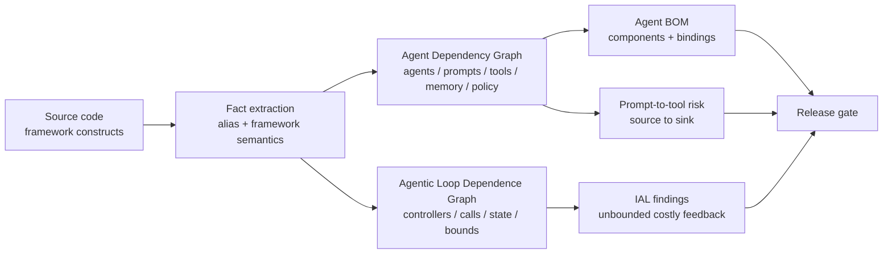

## 来源说明

本文基于 2026-07-04 的每日深度技术研究发布流程写成。今天没有选择继续写记忆诱导谄媚或可逆上下文压缩，因为本站 2026-07-02 和 2026-07-03 已连续覆盖 Agent Memory 的上下文与准入问题。更值得发布的新材料来自 Agent 程序静态分析：两篇 2026-07-02 提交的论文把“Agent 安全扫描”从 AST 级组件枚举推进到 framework semantics 级依赖图。

核心来源如下：

- Shenao Wang 等: [AgentFlow: Building Agent Dependency Graphs for Static Analysis of Agent Programs](https://arxiv.org/abs/2607.01640), arXiv:2607.01640v1。论文提出 Agent Dependency Graph（ADG），把 agent、prompt、model、capability、memory state、control policy 表示为 typed nodes，并用 component/control/data-flow edges 建模依赖；作者报告在 5,399 个真实 Agent 项目上识别 238 个 prompt-to-tool risk 项目。
- Xinyi Hou 等: [When Agents Do Not Stop: Uncovering Infinite Agentic Loops in LLM Agents](https://arxiv.org/abs/2607.01641), arXiv:2607.01641v1。论文提出 IAL-Scan，把 Agent 项目抽象成 Agent IR 和 Agentic Loop Dependence Graph（ALDG），用于检测没有有效边界的模型调用、工具调用、工作流转换和多 Agent 反馈路径；作者报告在 6,549 个仓库中发现 68 个经人工确认的 IAL failures，precision 为 91.9%。
- LangChain Docs: [GRAPH_RECURSION_LIMIT](https://docs.langchain.com/oss/python/langgraph/errors/GRAPH_RECURSION_LIMIT) 与 [Graph API overview](https://docs.langchain.com/oss/python/langgraph/graph-api)。文档说明 LangGraph 到达最大步数仍未命中停止条件时会触发 recursion limit，并提供 RemainingSteps 作为递归限制前的剩余步数管理值。
- OpenAI Agents SDK Docs: [Running agents](https://openai.github.io/openai-agents-python/running_agents/) 与 [Runner reference](https://openai.github.io/openai-agents-python/ref/run/)。文档说明超过 `max_turns` 会抛出 `MaxTurnsExceeded`，且 `max_turns=None` 会关闭该 turn limit。
- Microsoft AutoGen Docs: [Termination](https://microsoft.github.io/autogen/stable/user-guide/agentchat-user-guide/tutorial/termination.html)。文档把 termination condition 定义为基于消息序列返回 StopMessage 的 callable，并说明条件命中后需要 reset 后再复用。
- CrewAI Docs: [Agents](https://docs.crewai.com/v1.14.7/en/concepts/agents)。文档列出 `max_iter`、`max_execution_time`、rate limit 等 Agent 配置项，说明多 Agent 框架已经把边界配置暴露给应用开发者。

事实边界：论文中的数据集规模、节点/边类型、实验数字、误报/漏报分析来自作者报告。本文提出的发布前审计门、最小 Agent BOM schema、规则示例、上线 SOP 和指标门槛是我的工程建议，不是上述论文或框架文档的共同标准。本文只讨论授权白盒扫描、防御建设和安全工程，不提供攻击第三方目标的操作流程。

站内重复检查：2026-06-24 写过“Agent 应用上线前需要白盒安全审计关口”，2026-06-30 写过“本地 Agent 运行时应该成为白盒扫描对象”。本文更窄：它不讨论运行时产品安全边界，而是讨论源代码层如何恢复 Agent dependency graph，并把 prompt-to-tool risk 与 infinite agentic loop 放进同一条审计门。

稳定 slug：`2026-07-04-agent-dependency-graph-static-analysis`。

## 先给结论

Agent 静态分析的最小有效对象不是文件、函数或 tool list，而是 Agent 依赖图。

原因很直接：Agent 程序的风险常常不在单个函数里。一个 prompt 是否能影响发邮件工具，取决于 agent 构造参数、tool decorator、MCP server、handoff、shared memory、approval policy 和 framework 默认运行循环。一个无限循环是否危险，也不只看源码里有没有 `while True`，而要看这条反馈路径是否会反复触达模型调用、工具调用、状态增长或外部副作用，并且是否有真正覆盖该路径的边界。

我的工程判断是：发布前 Agent 安全扫描应该至少产出两张图。

- ADG：回答“谁能影响谁、谁能调用谁、哪里有 memory/policy/human gate”。
- ALDG：回答“哪些反馈路径会重复执行高成本或状态增长动作、边界是否覆盖了实际路径”。



一句话：先恢复依赖图，再写规则。没有图，所谓 Agent 安全扫描大多只是组件盘点。

## 技术问题：Agent 依赖不是普通调用图

传统 SAST 擅长处理显式代码关系：函数调用、变量赋值、数据流、控制流、污点源和危险 sink。但 Agent 框架把很多关键关系藏在 framework semantics 里。

| Agent 语义 | 代码里常见形态 | 普通 AST 扫描容易漏掉什么 |
| --- | --- | --- |
| Agent 绑定 tool | `tools=[...]`、decorator、MCP tool object | prompt 到 tool 参数的可达路径 |
| Agent handoff | `handoff(...)`、graph edge、delegation | 跨 Agent 控制流和消息流 |
| 共享 memory/session | session object、chat history、state graph | 一个 Agent 写入、另一个 Agent 读取 |
| Approval/policy | guardrail、require approval、validator | 高危 capability 是否真的被 gate 覆盖 |
| 循环/重试 | workflow cycle、tool loop、repair retry | 是否会反复触达模型/API/状态增长 |

这就是 AgentFlow 的核心价值：它不是再写一个“找出所有工具”的扫描器，而是把 agent、prompt、model、capability、memory state、control policy 抽象成统一节点，再恢复 component、control-flow 和 data-flow 三类边。论文报告 AgentFlow 支持 OpenAI Agents SDK、LangChain/LangGraph、CrewAI、LlamaIndex 和 Semantic Kernel 五类框架，建模 143 个 framework-specific constructs。

IAL-Scan 解决的是同一类问题的另一个切面：Agent 程序里的无限循环不一定是传统循环。它可能是 LangGraph 条件边回到 tool node，AutoGen group chat 没有 turn bound，OpenAI Agent 被当作 tool 后重新进入 runner，或者模型输出控制“是否继续修复”。这些都需要把 framework 行为还原成图，而不是只 grep `while`。

## 机制拆解：ADG 负责依赖，ALDG 负责反馈路径

AgentFlow 的 ADG 可以理解成三层图叠在同一组节点上。

| 图层 | 关注点 | 例子 | 可做的分析 |
| --- | --- | --- | --- |
| ACDG | 组件绑定 | Agent 绑定 prompt、model、tool、memory、policy | Agent BOM、权限盘点 |
| ACFG | 可执行控制流 | Agent 可调用 tool、可 handoff 到另一个 Agent | 高危 capability 可达性 |
| ADFG | 信息传播 | prompt 影响 agent，tool return 回流，shared memory 跨 Agent 传播 | prompt-to-tool、memory-to-tool 污点 |

这个拆法有一个重要工程含义：Agent BOM 不能只是“项目用了哪些模型、工具、依赖包”。真正可审计的 BOM 要回答绑定关系，比如哪个 Agent 可以调用哪个 MCP server，哪个 prompt 影响哪个高危工具，哪个 memory 被多个 Agent 共享，哪个 approval policy 保护哪个 capability。

IAL-Scan 的 ALDG 则把注意力放到重复执行上。它先构造 Agent IR：execution unit、controller、invocation、state update、bound、exit。然后构造 ALDG，保留和循环行为有关的节点：controller、costly invocation、growing state update、scope。最后用 strongly connected components 找反馈区域，并检查三个条件：

1. 反馈路径是否 agentic，也就是涉及模型、工具、Agent、workflow 或 framework dispatch。
2. 路径是否触达高成本或状态增长动作，比如 LLM call、tool call、subprocess、message append、workflow state update。
3. 是否存在有效边界覆盖这条路径，而不是只在内层调用或无关 scope 上设置了一个看起来存在的 limit。

这比“有没有 max_iter”更严。一个 `max_turns` 可能只约束内层 Agent，不约束外层 evaluator retry；一个 timeout 可能包住单次 tool call，却包不住 tool failure 触发的 repair loop。边界必须覆盖反馈路径本身。

## 工程判断：扫描门应该看路径，不看配置清单

发布前我会把 Agent 静态审计门拆成四个最小问题。

| 问题 | 图查询 | 阻断条件 |
| --- | --- | --- |
| Prompt 能否到达高危工具参数 | ADFG source + ACFG sink + argument flow | 无 policy/human gate 或 gate 不覆盖 sink |
| Memory 是否跨 Agent 传播到高危工具 | memory write/read path + tool reachability | memory source 未分级或缺少 scope |
| Workflow 是否存在无界反馈 | ALDG SCC + costly/state-growing node | 无 turn/step/retry/timeout/token/message bound |
| Agent BOM 是否可解释 | ACDG components + bindings | 只有 inventory，没有绑定关系 |

这里不需要一开始就做完整 CodeQL 级别的通用查询语言。第一版可以更懒：用框架适配器抽取事实，存成 JSON graph，再写几条路径查询。等规则变多、误报需要精细控制时，再接 CodeQL、Joern 或自研 Datalog。

## 最小落地方案

第一版只做 CI 里的发布前审计门，不做平台。

### 1. 抽取 Agent facts

对每个支持框架写一个小适配器，输出统一 facts。先覆盖最常用构造：agent definition、prompt/instructions、model、tool、MCP server、memory/session、handoff/delegation、guardrail/approval、runner invocation、loop bound。

```json
{
  "agents": [{ "id": "research_agent", "framework": "openai-agents" }],
  "capabilities": [{ "id": "send_email", "kind": "mcp_tool", "sensitive": true }],
  "memory": [{ "id": "shared_session", "kind": "sqlite_session" }],
  "policies": [{ "id": "email_approval", "kind": "human_approval" }],
  "edges": [
    { "kind": "bind_tool", "from": "research_agent", "to": "send_email" },
    { "kind": "bind_memory", "from": "research_agent", "to": "shared_session" },
    { "kind": "protects", "from": "email_approval", "to": "send_email" }
  ]
}
```

### 2. 生成 Agent BOM

BOM 只保留能审计的事实。不要塞一堆包版本来假装完整；SBOM 已经做这件事。Agent BOM 应该专门记录 Agent 原生组件和绑定关系。

```yaml
agent_bom_version: 0.1
project: support-agent
agents:
  - id: triage_agent
    model: gpt-5.5
    prompts: [triage_instructions]
    tools: [ticket_search, ticket_update]
    memory: [support_session]
    policies:
      ticket_update: [human_approval_for_priority_p0]
bindings:
  - source: triage_instructions
    path: triage_agent -> ticket_update
    risk: prompt_to_privileged_tool
    gate: human_approval_for_priority_p0
```

### 3. 跑三条阻断规则

先写三条足够有用的规则。

```text
RULE p2t-001:
  prompt_or_user_input reaches sensitive_tool_args
  AND no approval_policy dominates sensitive_tool
  => block release

RULE mem-001:
  unreviewed_memory reaches sensitive_tool_args
  AND memory.scope is missing
  => block release

RULE ial-001:
  feedback_scc contains llm_call OR tool_call OR state_growth
  AND bound_status in [missing_bound, disabled_bound, ineffective_bound]
  => block release
```

这三条规则覆盖最常见的上线事故：prompt 影响副作用工具、脏 memory 进入高危动作、Agent 在失败或工具调用里跑到停不下来。

### 4. 输出可修复证据包

扫描结果必须能让开发者直接改代码。每个 finding 至少包含：

- 触发路径：source、agent、handoff/memory、tool sink。
- 缺失边界：缺 human approval、缺 scope、缺 max turn、缺 retry cap、缺 timeout、缺 message budget。
- 代码位置：构造点、绑定点、runner 调用点、反馈边。
- 最小修复建议：加 policy、拆权限、设置 bound、移动 bound 到外层 scope、限制 memory read/write。

## 我会如何实现/验证

我会先选一个真实 Agent 仓库，限定 Python + LangGraph/OpenAI Agents SDK。第一周只做静态抽取和三条规则，不引入新平台。

```text
agent-audit/
  adapters/
    langgraph.py
    openai_agents.py
  rules/
    p2t.yaml
    memory_scope.yaml
    ial_bound.yaml
  fixtures/
    prompt_to_email/
    langgraph_unbounded_tool_loop/
    shared_memory_to_tool/
  reports/
    agent-bom.yaml
    findings.json
```

验证方式也保持简单：

1. 为每条规则准备一个最小 fixture：一个应该报警，一个应该不报警。
2. 手工标注 20 个内部 Agent 项目的 Agent/tool/memory/policy 关系。
3. 比较扫描输出和手工标注，先看路径召回率，不急着追求零误报。
4. 把扫描放进 CI，只在高危工具和无界循环上阻断，其余先 warning。
5. 每个误报都归因到“事实抽取错、路径查询错、边界覆盖判断错、框架语义缺失”之一。

## 可验证指标

| 指标 | 第一周目标 | 为什么看它 |
| --- | --- | --- |
| Agent/tool/memory/policy 抽取召回 | 手工样本 >= 80% | 图不完整，后面规则无意义 |
| 高危 prompt-to-tool 路径召回 | 已知 fixture 100% | 这是发布门核心风险 |
| IAL fixture 检出率 | 已知 fixture 100% | 防止无界循环进入生产 |
| 阻断误报可解释率 | 100% finding 有路径证据 | 开发者能修，不是看玄学报告 |
| CI 扫描时间 | 单仓库 < 2 分钟 | 发布门不能拖垮迭代 |
| 修复后复扫通过率 | 100% | 证明建议能闭环 |

对生产项目，我不会把“扫描发现多少问题”当成功指标。更好的指标是：高危 Agent 变更是否都有 Agent BOM diff，新增高危 tool 是否有 policy 绑定，无界反馈路径是否在代码评审前被拦下。

## 适用场景

这套方法适合三类团队。

第一，已经在用 LangGraph、AutoGen、CrewAI、OpenAI Agents SDK、LlamaIndex 或 Semantic Kernel 写生产 Agent 的团队。你的风险不是“有没有 Agent”，而是不同 Agent、tool、memory 和 policy 的组合关系开始超出人工 review 的负担。

第二，安全团队需要审计内部 Agent 应用，但普通 SAST 报告解释不了 Agent 语义。ADG 可以把安全问题转成路径问题：哪个 prompt/memory 能到哪个 capability。

第三，平台团队要给 Agent 项目做发布门。此时 Agent BOM 比一次性审计报告更有用，因为它能参与 diff：这次 PR 新增了哪个 tool，哪个 Agent 获得了新的 memory，哪个 guard 被移除。

## 失败模式

| 失败模式 | 表现 | 处理方式 |
| --- | --- | --- |
| 框架适配不完整 | 漏掉 dynamic routing、decorator、factory return | 把漏报归因到 adapter，先补高频构造 |
| 过度近似导致误报 | 找到理论路径，但生产配置有外层 gate | finding 必须展示 bound/gate 位置，允许 suppress 带原因 |
| 边界位置错误 | 有 `max_turns`，但没覆盖外层 retry | 把 bound coverage 当路径属性，不当全局配置 |
| LLM 参与判断不稳定 | 同一候选多次 pruning 结果不同 | LLM 只做负向过滤，阻断依据来自静态证据 |
| BOM 变成库存表 | 只有模型和依赖，没有绑定关系 | 缺 binding 的 BOM 不算通过 |

最需要警惕的是“配置存在幻觉”：代码里确实有一个 limit，但它不支配危险反馈路径。IAL-Scan 的价值正在这里：它把“有没有边界”提升为“边界是否覆盖路径”。

## 局限分析

第一，静态分析只能近似 Agent 行为。模型输出、外部工具返回、动态 prompt 组装和运行时配置都会影响真实路径。结论应该写成“可能可达”和“缺少可证明边界”，不能写成“必然发生事故”。

第二，框架语义更新很快。适配器必须跟随 LangGraph、OpenAI Agents SDK、AutoGen、CrewAI 等框架版本变化，否则会产生系统性漏报。这也是为什么第一版不该同时支持十几个框架。

第三，Agent BOM 不是权限系统。它只能暴露绑定关系和风险路径，不能替代运行时 sandbox、最小权限 token、人工审批、审计日志和外部副作用隔离。

第四，本文没有复现实验。AgentFlow 和 IAL-Scan 的效果数字应视为作者报告结果。真正上线前，要用本团队代码、框架版本和人工标注集复测。

## 自审

- 事实可靠性：核心事实来自两篇 arXiv 论文和官方框架文档；实验数字均标注为作者报告。
- 来源完整性：本文列出论文、LangGraph、OpenAI Agents SDK、AutoGen、CrewAI 文档；没有使用无法复核的社交媒体观点。
- 是否只是复述：不是。本文把 ADG/ALDG 合并为发布前审计门，并给出 Agent BOM schema、规则、SOP 和指标。
- 是否标题党：标题只表达技术判断，没有夸大效果。
- 是否薄内容：包含机制图、对比表、落地方案、规则示例、可验证指标和实现计划。
- 是否把猜测写成事实：工程方案、指标和 SOP 均明确为我的建议；论文实验数字与文档能力单独归属来源。
- 站内重复：与 2026-06-30 的运行时静态审计不同，本文聚焦源代码层 Agent dependency graph 和 infinite agentic loop。
- 安全边界：只讨论授权白盒扫描、防御建设和发布门，不提供攻击第三方系统步骤。
