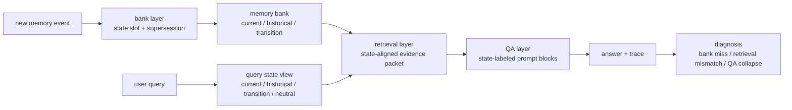
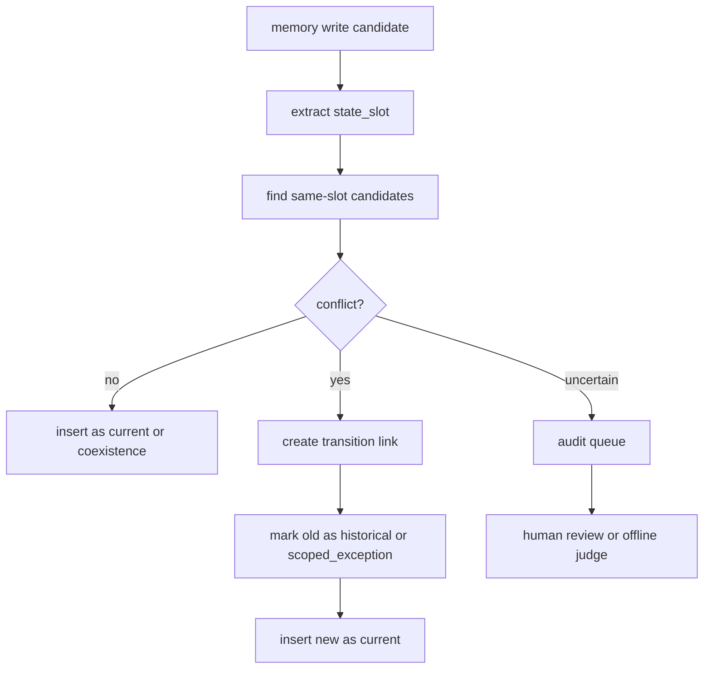

## 来源说明

本文基于 2026-07-05 的每日深度技术研究发布流程写成。今天选择 A-TMA，不是因为它又提出一个新的记忆存储，而是因为它把长期记忆里的一个高频生产问题命名并拆开了：用户事实会变，系统既不能删掉历史，也不能把历史当成当前状态。

核心来源如下：

- Zitong Shi、Yixuan Tang、Anthony Kum Hoe Tung: [A-TMA: Decoupling State-Aware Memory Failures in Long-Term Agent Memory](https://arxiv.org/abs/2607.01935), arXiv:2607.01935v1。arXiv 页面显示论文 2026-07-02 提交。论文提出 ghost memory、A-TMA overlay、LTP benchmark，并报告 Graphiti/Zep + A-TMA 在 LTP 和 LoCoMo 上的结果。
- A-TMA HTML 全文: [arXiv HTML](https://arxiv.org/html/2607.01935v1)。本文核对了三个诊断层次：bank state maintenance、retrieve level evidence construction、QA level evidence state conditioning，以及 LTP 的 10 个 profiles、800 probes、LoCoMo 10 samples 和 1,986 QA pairs 设置。
- Adyasha Maharana 等: [Evaluating Very Long-Term Conversational Memory of LLM Agents](https://arxiv.org/abs/2402.17753), LoCoMo, arXiv:2402.17753。LoCoMo 提供很长对话、多 session、事件图和长期问答评测背景；本文只把它作为 A-TMA 外部泛化评测的背景来源。
- Preston Rasmussen 等: [Zep: A Temporal Knowledge Graph Architecture for Agent Memory](https://arxiv.org/abs/2501.13956), arXiv:2501.13956。Zep/Graphiti 是 A-TMA 论文中使用的 temporal KG host 之一；本文用它说明“有时间图”不等于“回答时一定状态正确”。

事实边界：A-TMA 的提交日期、作者、ghost memory 定义、A-TMA 三层结构、LTP/LoCoMo 规模和作者报告实验数字来自论文与 arXiv 页面。本文提出的状态槽数据模型、上线 SOP、指标门槛和工程实现路径是我的工程建议，不是论文作者声明的生产标准。本文没有复现实验，也没有使用未公开数据。

站内重复检查：2026-06-04 写过 MemGuard 的类型化记忆边界；2026-06-18 写过 memory evaluation lifecycle；2026-07-02 写过可逆上下文编排；2026-07-03 写过记忆取回后的使用准入。本文的差异点更窄：它聚焦同一用户事实随时间变化后，旧状态、当前状态、过渡状态如何在写入、检索和回答三层被显式区分。

稳定 slug：`2026-07-05-state-aware-memory-ghost-memory`。

## 先给结论

长期记忆系统不能只有“相关”和“不相关”两个状态。生产系统至少要区分：

| 记忆角色 | 用途 | 不能做什么 |
| --- | --- | --- |
| current | 回答当前状态问题 | 不能覆盖明确要求历史状态的问题 |
| historical | 回答过去状态、审计、解释变化 | 不能默认进入当前事实槽 |
| transition | 解释从旧状态到新状态的变化 | 不能被当成最终事实 |
| coexistence | 表示多状态同时有效 | 不能被误判成冲突 |
| scoped exception | 表示条件性例外 | 不能泛化到所有场景 |

A-TMA 的价值在于：它没有把问题简化成“删除旧记忆”。它把 ghost memory 定义为状态协调失败：旧事实、当前事实和过渡事实都在库里，但检索包没有按查询要的状态视图组织，回答模型最后把它们混成一个答案。

我的工程判断是：长期记忆下一步要补的是 state-aware memory contract。它不一定需要重写整个 memory store，但需要在三层留下可诊断的状态痕迹：



一句话：长期记忆不是把用户历史越存越多，而是能回答“这条记忆现在还能以什么身份影响本轮答案”。

## 技术问题：ghost memory 不是普通陈旧数据

普通 stale data 的处理方式很直接：发现旧值，替换成新值。Agent memory 不能这么粗暴。

用户曾经住在上海，后来搬到杭州。系统如果只保留杭州，会答不好“我去年住在哪里”；如果只追加杭州，会在“现在寄到哪里”时可能检索出上海；如果保留两条但不标状态，模型可能把“搬家记录”“旧地址”“新地址”混成一个答案。这里的问题不是缺少记忆，而是状态角色没对齐。

A-TMA 把这个问题叫 ghost memory。这个名字有用，因为它提醒工程团队：旧记忆本身不是幽灵。幽灵出现在旧记忆没有被废弃、降权、转成历史证据或绑定到过渡关系时。它仍然能像当前事实一样被召回，并在回答阶段误导模型。

这类失败通常发生在三个位置：

1. Bank 层：写入新事实时没有标记旧事实是否被 supersede，也没有记录 transition link。
2. Retrieval 层：查询要当前状态，但检索包把旧状态排在前面；或查询要历史状态，却只给当前状态。
3. QA 层：正确证据已经在上下文里，但 prompt 没有状态标签，模型把多个状态压成一个顺滑答案。

这也是 A-TMA 比单纯提高最终 QA accuracy 更有价值的地方。最终答案错了，可能是库没维护好，也可能是检索没选对，也可能是模型看到证据后仍然状态坍缩。只看一个分数，很难知道该修哪里。

## 机制拆解：A-TMA 是 overlay，不是新数据库

A-TMA 的设计很务实：它作为现有 memory host 上的一层 overlay 工作。host 可以是图记忆、笔记记忆、向量记忆或其他长期记忆系统。A-TMA 做三件事。

### 1. Bank 层：保留历史，但取消旧事实的默认当前身份

写入新记忆时，系统先找可能属于同一 state slot 的旧记录。论文里这一层有轻量 Sentry candidate proposal 和更重的 Judge。工程上不一定第一天就训练这两层，但思想很清楚：

- 同一槽位的单值事实不能同时有两个 current，除非有 coexistence 关系。
- 被替代的旧状态仍应可查，用于历史问题和审计。
- 过渡记录应连接旧状态和新状态，说明变化发生在哪里。
- 条件性例外不能误判成全局覆盖。

最小实现可以先不训练模型，只从显式字段和规则开始：

```ts
type MemoryStateRole =
  | "current"
  | "historical"
  | "transition"
  | "coexistence"
  | "scoped_exception"
  | "unknown";

type MemoryRecord = {
  id: string;
  userId: string;
  stateSlot: string;
  text: string;
  role: MemoryStateRole;
  validFrom?: string;
  validUntil?: string;
  supersedes?: string[];
  supersededBy?: string[];
  scope?: {
    projectId?: string;
    domain?: string;
    condition?: string;
  };
  source: "user" | "tool" | "human_review" | "system_import";
  confidence: "observed" | "inferred" | "reviewed";
};
```

关键不是字段多，而是把“旧事实仍可恢复”和“旧事实不再默认当前”同时表达出来。

### 2. Retrieval 层：先判断查询要哪个状态视图

很多失败来自查询状态视图没有被识别。下面两个问题词面很像，但应该取不同状态：

| 查询 | 需要的 state view | 检索目标 |
| --- | --- | --- |
| “我现在的报销地址是什么？” | current | 当前地址 |
| “我去年填的报销地址是什么？” | historical | 过去地址 |
| “我为什么从 A 改成 B？” | transition | 变化说明和两端状态 |
| “我一般寄到哪里？” | neutral/current-biased | 当前默认，但保留冲突提示 |

A-TMA 的 retrieval 不是只把 host top-k 原样塞给模型，而是构造 state-aligned evidence packet。它会从 host 检索的 semantic seed 出发，再沿 supersedes、superseded_by、transition 等状态链接扩展候选，然后按查询视图排序。

工程上可以先用很小的规则函数做第一版：

```ts
function inferStateView(query: string): "current" | "historical" | "transition" | "neutral" {
  if (/现在|当前|latest|current|today/i.test(query)) return "current";
  if (/以前|去年|当时|过去|previous|before/i.test(query)) return "historical";
  if (/为什么|怎么变|改成|changed|transition/i.test(query)) return "transition";
  return "neutral";
}

function stateFit(view: string, memory: MemoryRecord): number {
  if (view === "current") return memory.role === "current" ? 3 : memory.role === "transition" ? 1 : 0;
  if (view === "historical") return memory.role === "historical" ? 3 : memory.role === "transition" ? 2 : 0;
  if (view === "transition") return memory.role === "transition" ? 3 : memory.supersedes?.length ? 1 : 0;
  return memory.role === "current" ? 2 : 1;
}
```

这不是最终智能，但足以让系统从“相关记忆列表”升级成“按状态视图组织的证据包”。

### 3. QA 层：把状态标签显式暴露给模型

即使检索包里有正确记录，回答模型仍可能把历史值当当前值。A-TMA 的 QA 层把证据序列化为带状态标签的 prompt blocks，让模型知道哪些是 current、historical、transition。

一个可落地的 prompt 编译结构如下：

```text
Requested state view:
- current

Current memories:
- [mem_42] User's current shipping city is Hangzhou. valid_from=2026-06-12

Historical memories:
- [mem_17] User's shipping city was Shanghai. valid_until=2026-06-12

Transition memories:
- [mem_41] User moved shipping city from Shanghai to Hangzhou on 2026-06-12.

Answer rule:
- Answer the requested state view.
- Do not use historical memories as current facts.
- Mention a transition only if it explains ambiguity or the user asks why it changed.
```

这一步很小，但它修的是最后一公里：不要让所有记忆在 prompt 中变成一段无权威等级的“相关上下文”。

## 论文结果怎么读

A-TMA 论文报告了两个评测设置。

第一，LTP，也就是 LoCoMo Temporal Plus。它是面向 ghost memory 的 conflict-heavy benchmark，论文报告包含 10 个 profiles 和 800 probes。LTP 不是泛泛测长对话能力，而是专门压测旧状态、当前状态、过渡记录是否能被区分。

第二，LoCoMo。LoCoMo 原论文构造了非常长的多 session 对话，每段平均 300 turns、约 9K tokens、最多 35 sessions，并评估长期问答、事件总结和多模态对话。A-TMA 用它做外部泛化检查，论文报告使用 10 samples 和 1,986 QA pairs。

作者报告的关键数字：

| 设置 | 对照 | 作者报告结果 | 我的解读 |
| --- | --- | --- | --- |
| LTP | Graphiti/Zep vs Graphiti/Zep + A-TMA | conflict accuracy 从 0.480 到 0.720，绝对提升 0.240 | temporal KG 有帮助，但显式状态角色还能减少冲突状态误用 |
| LoCoMo | Graphiti/Zep vs Graphiti/Zep + A-TMA | temporal F1 从 0.0295 到 0.1705，average F1 从 0.0809 到 0.1556 | 泛化有信号，但整体分数仍低，不能过度解读为通用解决方案 |
| LTP 子集 | temporal KG evidence support 高但 conflict accuracy 低 | 论文用 Graphiti/Zep 例子说明 evidence support 与 state-correct QA 可分离 | “找到了证据”不等于“按正确状态回答” |

我会谨慎读这些结果。A-TMA 的收益是 host dependent。它依赖底层 host 至少能保存或召回足够证据；如果底层从未写入目标记录，overlay 无法凭空恢复。LoCoMo 上的 lexical metric 也不完全等价于 ghost memory 评测。真正值得带走的是诊断框架：bank、retrieval、QA 三层必须分开看。

## 工程落地方案：先做状态合同，不急着训练新模型

我会把第一版做成一个薄 overlay，接在现有 memory store 外面。不要先上复杂 Judge，不要先换数据库。

### 数据模型

最小表结构：

| 表 | 关键字段 | 作用 |
| --- | --- | --- |
| memory_records | id、user_id、state_slot、text、role、valid_from、valid_until、source、confidence | 保存状态化记忆 |
| memory_links | from_id、to_id、link_type、reason | 表达 supersedes、evolves_to、coexists_with |
| memory_use_trace | run_id、query、state_view、retrieved_ids、rendered_ids、answer_id | 诊断每次使用 |
| memory_audit_queue | candidate_new_id、candidate_old_id、reason、status | 人审或模型审查入口 |

其中 `state_slot` 是最容易被忽略的字段。没有它，系统很难知道“公司”“职位”“城市”“默认项目”“编码风格偏好”到底是不是同一个可更新状态。

### 写入路径



第一周不用追求全自动。凡是涉及高价值偏好、地址、权限、身份、项目状态、长期目标的更新，都可以先进 audit queue。懒一点但更稳：状态合同先覆盖最常出错的 20 个 slot。

### 读取路径

读取路径要做三件事：

1. 识别 query state view。
2. 从 host top-k 结果沿状态链接补齐旧/新/过渡证据。
3. prompt 编译时按 role 分区。

最小伪代码：

```ts
async function retrieveStateAwareMemory(query: string, userId: string) {
  const view = inferStateView(query);
  const seeds = await hostSearch(query, userId);
  const linked = await expandStateLinks(seeds);
  const candidates = dedupe([...seeds, ...linked]);

  return candidates
    .map((memory) => ({ memory, score: semanticScore(memory) + stateFit(view, memory) }))
    .sort((a, b) => b.score - a.score)
    .slice(0, 8);
}
```

这段逻辑故意朴素。它的目标不是替代检索模型，而是把状态错误暴露出来。上线后如果发现规则不够，再把 `inferStateView`、`stateFit` 或 audit queue 换成模型辅助判断。

### Prompt 编译

不要再用单一 `Relevant memories`。改成四段：

| Prompt block | 放什么 | 规则 |
| --- | --- | --- |
| Current state | 当前有效事实 | 可回答当前问题 |
| Historical state | 已过期但可审计事实 | 只回答历史问题或解释变化 |
| Transition evidence | 变化记录 | 说明为什么变，不直接当最终状态 |
| Ambiguous / needs review | 冲突或低置信记录 | 不自动用于结论 |

这一步能直接降低 ghost memory 的表现机会。

## 可验证指标

上线前后我会看这些指标，而不是只看最终满意度：

| 指标 | 检查什么 | 目标 |
| --- | --- | --- |
| same-slot duplicate current rate | 同一用户同一 state_slot 是否出现多个 current | 高风险槽位接近 0 |
| supersession coverage | 新旧冲突是否生成 supersedes / transition link | 每周抽样审查 |
| current-query stale leakage | 当前状态问题是否渲染 historical 为高权威证据 | 越低越好 |
| historical-query recovery | 历史状态问题是否能找回旧值 | 不因覆盖当前而丢历史 |
| transition evidence hit rate | 变化类问题是否取到 transition 记录 | 用于解释性回答 |
| QA state collapse rate | 证据包正确但答案仍选错状态 | 定位 prompt/模型问题 |
| human audit overturn rate | 人审推翻自动状态判定的比例 | 高于阈值则收紧自动写入 |
| token overhead | 状态标签和过渡证据增加多少 token | 和准确性收益一起看 |

这里最关键的是 `QA state collapse rate`。如果 bank 和 retrieval 都正确，模型仍答错，就不要继续调向量索引；应该改 prompt 分区、答案规则或换更可靠的 QA judge。

## 适用场景

这套方法适合用户事实会随时间变化、历史又不能删除的系统：

- 个人助手：地址、旅行偏好、家庭成员、健康限制、设备环境、长期目标。
- 企业知识助手：组织架构、项目 owner、系统状态、运行手册、审批规则。
- 编程 Agent：仓库约定、当前分支目标、已废弃方案、迁移阶段状态。
- 研究 Agent：假设版本、实验结论、被推翻的线索、当前 claim map。
- 客服 Agent：用户套餐、订单状态、纠纷处理阶段、历史承诺。

不适合的场景也要说清楚。如果只是一次性问答，或者记忆只保存短 session 临时状态，A-TMA 这种 overlay 可能过重。先用 session state 和清晰上下文窗口即可。

## 失败模式

第一，state_slot 抽错。系统把“工作城市”和“收货城市”当成同一个槽，后面所有 supersession 都会错。解决方式是高风险 slot 用枚举和人审，不要完全靠自由文本聚类。

第二，历史被过度降权。为了避免 stale leakage，系统可能不再能回答历史问题。解决方式是把 historical 从 prompt 当前事实槽移走，而不是从库里删除。

第三，transition 被当成事实。比如“用户正在考虑换到杭州”不能等价于“用户已经在杭州”。transition 记录需要独立 role，不应自动覆盖 current。

第四，scope 被忽略。用户在项目 A 的偏好不一定适用于项目 B。A-TMA 论文强调 state role，我在工程上会把 scope 和 state role 绑在一起，否则 ghost memory 会变成跨项目污染。

第五，评测样本太干净。LTP 的 controlled conflict 很适合诊断，但生产日志里的表达更乱。上线前要用真实历史更新、撤销、例外和人类纠错日志做 replay。

## 我会如何实现和验证

我会用一周做一个低风险 shadow experiment。

第 1 天：列出 20 个高风险 state_slot，例如 current_company、shipping_city、active_project、coding_style、preferred_language、security_policy_exception。只覆盖这些槽，不做泛化本体。

第 2 天：在 memory write path 旁路生成 `MemoryRecord` 和 `memory_links`，不影响现有回答。对 same-slot 冲突进入 audit queue。

第 3 天：实现 `inferStateView`、状态链接扩展和 prompt 分区，但只在 shadow mode 记录会渲染哪些记忆。

第 4 天：从历史日志抽 100 个查询，人工标注 current/historical/transition/neutral，并标注正确证据。计算 stale leakage、historical recovery、transition hit。

第 5 天：选择 20 个低风险用户或内部测试账号启用状态化 prompt，答案仍要求引用 memory id 和 state role，便于审查。

第 6 天：比较 baseline 与 overlay 的错误。只看状态相关错误，不把普通语义检索错误混进来。

第 7 天：决定是否扩大 slot 范围。若 human audit overturn rate 高，继续 shadow；若 token overhead 高但收益小，减少 historical/transition 的默认渲染，只保留 trace。

最小上线门槛：

- 当前状态查询的 stale leakage 明显下降。
- 历史状态查询的 recovery 不下降。
- 人审发现的“历史当当前”错误可追溯到 bank、retrieval 或 QA 层之一。
- 所有高风险状态更新都有 audit trace。

## 局限分析

A-TMA 的核心限制是它不能救不存在的证据。底层 host 如果没有保存旧状态、新状态或 transition，overlay 只能标出缺失，不能恢复事实。

第二，状态角色需要领域建模。`current`、`historical`、`transition` 是通用骨架，但企业系统还需要权限、租户、项目、地域、法规、数据分类等 scope。没有 scope 的状态记忆仍可能越界。

第三，论文结果仍是作者报告的预印本结果。LTP 是有价值的 conflict-heavy benchmark，但还需要第三方复现、代码数据发布情况、更多 host 系统和真实生产日志验证。LoCoMo 上的提升说明有泛化信号，但不能把它当作生产可靠性的充分证明。

第四，状态化 prompt 会增加 token 和复杂度。不是所有记忆都值得带 transition 证据。工程上应该按风险分层：高风险状态完整渲染，低风险偏好只渲染 current，历史和 transition 留在 trace。

第五，自动 Judge 可能制造新错误。我的建议是先用显式字段、规则和人审覆盖高风险槽位；只有当审查数据足够后，再训练或微调候选提议器和冲突 Judge。

## 自审

- 事实可靠性：A-TMA 的提交日期、作者、ghost memory、A-TMA 三层、LTP/LoCoMo 规模和报告数字均来自 arXiv abstract 与 HTML 全文；LoCoMo 与 Zep/Graphiti 背景来自对应 arXiv 页面。
- 来源完整性：本文使用论文、HTML 全文和相关基础论文作为来源，没有使用社区转述作为核心证据。
- 是否只是复述摘要：不是。正文把 A-TMA 拆成 state-aware memory contract、数据模型、写入路径、读取路径、prompt 编译和一周 shadow experiment。
- 是否标题党：标题只陈述核心工程判断，没有夸大为“解决长期记忆”。
- 是否薄内容：包含机制图、数据模型、伪代码、指标表、SOP、失败模式和验证计划。
- 是否把猜测写成事实：作者报告结果和我的工程建议已分开；未声称复现实验。
- 站内重复：与 MemGuard、memory evaluation lifecycle、可逆上下文编排、MemSyco 的边界不同，本文聚焦状态变化导致的 ghost memory。
- 工程价值：可直接用于现有 memory store 外挂状态合同和 shadow validation。
