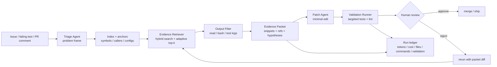
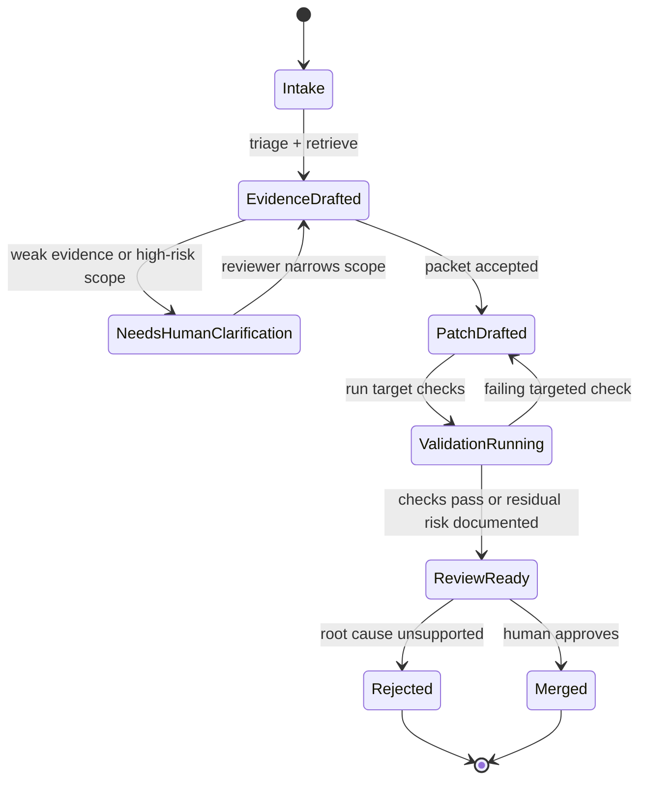

## 来源说明

本文基于 2026-07-06 的每日深度技术研究发布流程写成。今天没有观察到足够强的 7 月 6 日全新提交；可支撑高质量原创判断的材料来自 7 月 1-2 日尚未覆盖的代码 Agent 工作流方向。选择这个选题，是因为它能补本站 AI Native 实践分支的一块空白：代码 Agent 如何从“会读文件和跑命令”升级为可度量、可回滚、可审计的研发工作流。

核心来源如下：

- Chiwang Luk 等: [ContextSniper: AntTrail's Token-Efficient Code Memory for Repository-Level Program Repair](https://arxiv.org/abs/2607.01916), arXiv:2607.01916v1。arXiv 页面显示论文 2026-07-02 提交。论文把 ContextSniper 定义为面向 repository-level program repair 的 code memory layer：检索代码与运行时证据、混合排序、用 intention-aware context gate 过滤长输出、返回 compact evidence packets，同时把可恢复源上下文留在 prompt 外。作者报告在 SWE-bench Lite 上分别接入 OpenClaw 和 Claude Code，每个 host-agent 条件 50 次任务运行。
- ContextSniper HTML 全文: [arXiv HTML](https://arxiv.org/html/2607.01916v1)。本文核对了论文目录中的 system overview、memory hierarchy、memory-repository synchronization、adaptive top-k retrieval、intention-aware filtering、agent integrations、evaluation 和 limitations。
- ContextSniper 开源仓库: [Calluking/ContextSniper](https://github.com/Calluking/ContextSniper)。仓库 README 说明它提供 Claude Code plugin、OpenClaw plugin、本地后端、AGFS local memory、semantic code search、read/bash filtering 和 exact-replacement file edits；GitHub API 显示仓库创建于 2026-06-18，主语言为 Python，许可证为 MulanPSL-2.0。
- ContextSniper SWE runner 文档: [scripts/SWE/README.md](https://raw.githubusercontent.com/Calluking/ContextSniper/main/scripts/SWE/README.md)。该文档列出 Claude/OpenClaw legacy、ContextSniper、ContextSniper-FILTER 六种 runner，输出 validation、session render、tool summary 和 ContextSniper server logs，说明它不只是论文概念，还有可复核的试验脚本。
- Zhihao Lin 等: [How Much Static Structure Do Code Agents Need? A Study of Deterministic Anchoring](https://arxiv.org/abs/2606.26979), arXiv:2606.26979v2。论文 2026-06-25 提交，2026-07-02 修订，已被 ISSTA 2026 接收。作者报告轻量 call/inheritance topology 提升函数级定位、缩短交互轮次，结构锚点更像是让 Agent 的导航更可复现，而不是让模型“更聪明”。
- 本站 2026-07-02: [长程 Agent 的上下文压缩应该可逆](/articles/2026-07-02-reversible-context-orchestration-agent-memory/)。那篇文章讨论通用长程 Agent 的 raw/abstract/drop 编排；本文不重复可逆上下文运行时，而是落到代码修复工作流：证据包如何产生、谁审核、如何验证 ROI。

事实边界：ContextSniper 的提交日期、系统目标、作者报告的 token/cost/resolution 数字、仓库结构和 runner 模式来自论文、arXiv 页面、README 和 GitHub API。Deterministic Anchoring 的定位结果、结构锚点结论和版本信息来自 arXiv 页面。本文提出的研发工作流、目录结构、SOP、权限边界、ROI 指标和上线步骤是我的工程建议，不是上述来源共同声明的生产标准。本文没有复现 SWE-bench Lite，也没有审计 ContextSniper 全部源码。

站内重复检查：2026-07-01 写过研究型 Agent workflow harness，重点是研究规格、DAG 和人审 gate；2026-07-02 写过可逆上下文编排，重点是长程轨迹 raw/abstract/drop；2026-07-04 写过 Agent 静态分析依赖图，重点是安全扫描。本文的差异点更具体：AI Native 研发里的代码修复任务，如何把定位、证据收敛、编辑、测试和人审串成一条可度量工作流。

稳定 slug：`2026-07-06-code-agent-evidence-packet-workflow`。

## 先给结论

代码 Agent 的第一版工程改造，不应该是给它更大的上下文窗口，也不应该是让它随意读完整仓库。更稳的边界是：先让 Agent 产出一份可恢复、可审计、可验证的 evidence packet，再允许它编辑代码。

ContextSniper 和 Deterministic Anchoring 给出同一个信号：

| 问题 | 常见粗糙做法 | 更好的工作流对象 |
| --- | --- | --- |
| 不知道该看哪些文件 | 让 Agent `rg`、`cat`、全文件读取 | 结构锚点 + 语义/关键词混合检索 |
| 日志和文件太长 | 把完整输出塞进上下文 | intention-aware filtering |
| 找到片段但丢了来源 | 复制一段上下文进 prompt | evidence packet + recoverable source ref |
| Agent 路径不可复盘 | 只看最终 diff | session trace + validation report |
| 成本下降但质量下降 | 只看 token | token、cost、resolution、回滚率一起看 |

我的工程判断是：AI Native 代码修复工作流的核心不是“Agent 自动写代码”，而是把定位和证据选择产品化。主模型只应该看到当前修复真正需要的证据；原始文件、完整日志、结构关系和被过滤掉的上下文必须留在 prompt 外，可按需恢复。



一句话：代码 Agent 不是缺“记忆力”，而是缺一份能约束它行动的证据包。

## 场景定义

本文讨论一个具体工作场景：团队把一部分日常 bug 修复、测试失败修复和小型维护任务交给代码 Agent 预处理。

输入通常是：

- issue 描述、PR comment、CI 失败日志或用户报告。
- 仓库代码、测试、配置和已有文档。
- 允许的运行命令、测试预算、编辑范围和安全约束。

期望输出不是“Agent 自主合并代码”，而是：

- 一份 evidence packet：相关文件、符号、调用关系、日志片段、失败假设、被排除路径。
- 一个最小 diff。
- 一组验证结果：目标测试、相关回归测试、lint/typecheck、失败残留。
- 一份给人类 reviewer 的复盘材料。

这类场景足够具体，也足够常见。它比“全自动软件工程师”小很多，但一周内可以验证 ROI。

## 原流程痛点

传统代码修复流程大致是：开发者读 issue，搜索仓库，打开几个文件，跑测试，看日志，改代码，再跑测试，最后写 PR。这里很多动作不是创造性工作，而是定位、过滤和复盘。

代码 Agent 直接接管后，常见问题也很明显：

| 步骤 | 人类原来怎么做 | 直接上 Agent 的失败点 |
| --- | --- | --- |
| 定位 | 根据经验找入口、调用方、配置和测试 | 随机搜索，读很多无关文件 |
| 读代码 | 只读关键函数和邻近上下文 | 全文件读入，token 被样板代码稀释 |
| 看日志 | 抓第一处根因和失败栈 | 把长日志塞满上下文，遗漏关键几行 |
| 修改 | 先做最小修复 | 为了迎合假设扩大 diff |
| 验证 | 先跑目标测试，再补回归 | 跑太少导致假阳性，跑太多浪费时间 |
| 交接 | reviewer 能看懂为什么改 | 只有 diff，没有证据路径 |

所以瓶颈不是模型不会写一行代码，而是工作流没有规定“它凭什么认为这几个文件和这几行日志是足够证据”。

## 技术问题：上下文多不等于证据好

代码仓库有三个和普通文档不同的特点。

第一，结构关系强。一个 bug 可能由调用方、被调用方、继承关系、配置默认值、测试 fixture 和构建脚本共同决定。纯关键词搜索能找到词面相似文件，但很容易漏掉“谁调用我”“谁覆盖我”“哪个配置把行为改了”。

第二，长输出多。测试日志、typecheck、build output、coverage、stack trace 和 CLI debug 信息经常几千行。完整输出通常只有少数行是真正证据，其余是噪声。

第三，修复需要可回放。研究问答可以容忍部分过程不可见；代码变更不行。reviewer 需要知道 Agent 为什么改这个函数、为什么没有改另一个相似函数、跑了什么测试、失败时如何回滚。

ContextSniper 的价值在于把这些问题合成一个 code memory layer，而不是只加一个搜索工具。它先让仓库可检索，再对候选代码和运行时证据做排序与过滤，最后返回 compact evidence packet，并保留可恢复源上下文。Deterministic Anchoring 则从另一个方向说明，轻量静态结构能让 Agent 导航更稳定，尤其是中型仓库里简单 call/inheritance topology 已经能提供可观约束。

我的推断是：代码 Agent 工作流里最应该产品化的不是 prompt，而是 evidence packet contract。

## 机制拆解：证据包需要四层

一个可落地的 evidence packet 至少有四层。

### 1. 结构锚点层

结构锚点不需要一开始做完整 CodeQL 或 CPG。第一版只要能回答几个问题：

- 当前符号的定义在哪里。
- 谁调用它。
- 它调用谁。
- 哪些测试覆盖它。
- 哪些配置或 fixture 影响它。

Deterministic Anchoring 的结论很克制：结构锚点主要让导航更纪律化、更可复现，而不是神奇提升模型能力。这个判断对工程落地很重要。不要把结构索引做成新平台，先把最少结构事实注入检索和证据包。

### 2. 混合检索层

代码检索不能只靠 embedding。变量名、错误码、测试名、文件路径、API 名称和异常字符串都是强词面信号；但 issue 描述和代码实现之间又经常需要语义匹配。

第一版可以用混合排序：

| 信号 | 用途 | 失败模式 |
| --- | --- | --- |
| exact path / symbol | 快速命中显式文件和函数 | issue 没提路径时无效 |
| keyword / BM25 | 错误字符串、配置键、测试名 | 同名噪声多 |
| embedding | 需求语义和实现语义对齐 | 可能找出“像”但不相关的代码 |
| call/caller anchor | 补齐结构邻域 | 大仓库中前向边过多 |
| test affinity | 把代码和验证连起来 | 测试覆盖缺失时会误导 |

ContextSniper 论文提到 adaptive top-k retrieval。工程上我会把它理解为：不要固定取 5 个片段，而是按任务不确定性、候选分数间隔、文件多样性和 token budget 动态决定候选数量。

### 3. 输出过滤层

read 和 bash 输出必须过滤。不是为了省几个 token，而是为了不让模型被无关输出牵着走。

过滤器应该识别：

- stack trace 的根因段。
- pytest/jest/go test 的失败用例、断言差异和文件行号。
- typecheck/lint 的 error block。
- 命令超时、权限失败、依赖缺失和环境错误。
- 大文件读取中的目标符号、邻近定义和相关调用方。

被过滤掉的内容不能直接丢弃。它应该留在 run ledger 里，证据包只放摘要和可恢复引用。

### 4. 证据包编译层

最后给 Patch Agent 的不是“搜索结果列表”，而是一份有结构的任务包。

```yaml
task:
  id: issue-4821
  kind: failing-test
  objective: "修复日期解析在空时区输入下的异常"
  allowed_scope:
    files: ["src/date/*", "tests/date/*"]
    max_files_changed: 3
evidence:
  failing_signal:
    command: "npm test -- date-parser"
    excerpt_ref: "ledger://runs/001/logs/test#L42-L61"
    summary: "DateParser.parse 在 timezone='' 时抛出 TypeError"
  code_candidates:
    - file: "src/date/parser.ts"
      symbols: ["DateParser.parse", "normalizeTimezone"]
      reason: "失败栈直接命中，且 normalizeTimezone 处理 null 但不处理空字符串"
      source_ref: "repo://src/date/parser.ts#L18-L77"
    - file: "tests/date/parser.test.ts"
      symbols: ["parse timezone cases"]
      reason: "已有 null/UTC 覆盖，缺空字符串回归"
      source_ref: "repo://tests/date/parser.test.ts#L33-L58"
  excluded:
    - file: "src/date/format.ts"
      reason: "只消费解析结果，不参与 timezone normalization"
hypothesis:
  root_cause: "空字符串绕过默认 timezone 分支，被传给 Intl API"
  minimal_fix: "把空字符串归一为 undefined，并增加回归测试"
validation:
  required_commands:
    - "npm test -- date-parser"
    - "npm run typecheck"
review_notes:
  human_check:
    - "确认空字符串是否应等价于未传 timezone"
    - "确认没有改变显式 UTC 行为"
```

这份包的作用是约束 Agent：它可以反驳证据包，但不能无理由扩大范围。

## 目标工作流

AI Native 后，任务应该拆成五个角色，而不是一个全能 Agent。

| 角色 | 承担者 | 输入 | 输出 | 人工审核点 |
| --- | --- | --- | --- | --- |
| Triage Agent | LLM + issue parser | issue、CI 日志、PR comment | 问题类型、风险、初始查询 | 高风险任务转人工 |
| Evidence Builder | 搜索工具、结构索引、过滤器 | triage 结果、仓库、日志 | evidence packet | 不确定证据需要人工确认 |
| Patch Agent | 代码 Agent | evidence packet、编辑权限 | 最小 diff、验证命令 | 改动越界必须停下 |
| Validation Runner | CI/local scripts | diff、测试计划 | validation report | 失败残留不能自动放行 |
| Human Reviewer | 负责人 | evidence、diff、validation | approve / revise / reject | 合并权保留给人 |



这个流程的关键是：Evidence Builder 可以自动化，合并决策不能自动化。

## 数据与权限边界

代码 Agent 的权限应该按阶段打开。

| 阶段 | 可读 | 可写 | 可执行 | 禁止 |
| --- | --- | --- | --- | --- |
| Intake | issue、CI 摘要、公开文档 | 无 | 无 | 读 secrets、改代码 |
| Evidence | 仓库代码、测试、允许日志 | evidence packet、ledger | 只读命令、轻量 grep/index | 访问生产环境 |
| Patch | evidence 中允许文件 | 工作区 diff | 目标测试、格式化 | 修改 scope 外文件 |
| Validation | diff、测试配置 | validation report | 白名单测试命令 | 部署、外部副作用 |
| Review | 全部证据和 diff | review decision | 可选复跑 | Agent 自主 merge |

最容易被忽略的是日志权限。CI 日志里可能有 token、内网地址、客户数据或私有路径。输出过滤层要先做脱敏，再把摘要交给模型。证据包里只保留必要片段和引用，不复制整段敏感输出。

## 执行 SOP

第一周不要做平台。只选一个仓库、一个任务类型和一个 Agent runner。

1. 建立 `agent-fix-runs/<date>/<issue-id>/` 目录，放 `input/`、`evidence/`、`patch/`、`validation/`、`ledger/`。
2. 固定任务入口：只接收 issue 文本、失败命令、失败日志和仓库路径。
3. 为仓库生成轻量索引：文件列表、符号表、调用方近似索引、测试文件映射。
4. Evidence Builder 生成 `evidence-packet.yaml`，每条证据必须有 `reason` 和 `source_ref`。
5. 如果 evidence packet 没有直接失败信号、没有候选测试或 root cause 只是猜测，暂缓给人。
6. Patch Agent 只能基于 evidence packet 编辑，默认最多改 3 个文件。
7. Validation Runner 先跑目标测试，再跑受影响模块测试，最后跑低成本 lint/typecheck。
8. 把所有命令、退出码、过滤前日志路径、过滤后摘要、token 和耗时写入 ledger。
9. Human Reviewer 看三样东西：证据是否支撑 root cause、diff 是否最小、验证是否覆盖失败。
10. 每周复盘失败任务，把失败归类为检索漏召、证据误判、编辑错误、测试不足或环境问题。

目录结构保持朴素：

```text
agent-fix-runs/2026-07-06/issue-4821/
  input/
    issue.md
    ci-log.raw.txt
  evidence/
    evidence-packet.yaml
    search-results.jsonl
    filtered-log.md
  patch/
    diff.patch
    touched-files.txt
  validation/
    validation.md
    validation.json
  ledger/
    events.jsonl
    costs.jsonl
    tool-calls.jsonl
```

这套目录比一段聊天记录有用，因为 reviewer 和后续自动化都能消费。

## 工具栈选择理由

如果团队已经用 Claude Code、OpenClaw、Codex CLI 或类似代码 Agent，第一版不要换 Agent。把 evidence layer 放在外面即可。

可选组合：

| 能力 | 懒但够用的选择 | 什么时候升级 |
| --- | --- | --- |
| 文件和文本搜索 | `rg` + 文件清单 | 误召太高时加 BM25 |
| 语义检索 | 现有 embedding endpoint | 多语言仓库或自然语言 issue 多时 |
| 结构锚点 | tree-sitter/语言服务器导出的 symbol/caller 近似 | 安全审计或复杂依赖时上 CodeQL/Joern |
| 输出过滤 | 规则 + 小模型摘要 | 日志格式多、误删根因时加专用 parser |
| 编辑 | Agent 原生编辑工具 | 大规模机械改动时用 codemod |
| 验证 | 现有 npm/pytest/go test | flaky 多时接 CI rerun 和隔离环境 |

ContextSniper 的工程启发不是“必须安装这个项目”，而是它证明 code memory layer 可以作为插件接入现有 host-agent，并且用 runner 产出可比较数据。团队应优先复用已有 Agent 和 CI，把新增部分限制在索引、过滤、证据包和 ledger。

## 质量评估

只看 token 降低会误导。ContextSniper 作者报告 token 和成本下降时，submitted-resolution 也略有下降：OpenClaw 从 26.0% 到 24.0%，Claude Code 从 32.0% 到 30.0%。这说明成本优化不能单独算胜利。

我会用下面的指标组合：

| 指标 | 第一周目标 | 为什么看它 |
| --- | --- | --- |
| 目标失败复现率 | >= 90% | 不能复现就容易乱修 |
| evidence packet 可审计率 | 100% 证据有 source_ref | reviewer 能复核 |
| 候选文件命中率 | 人审样本 >= 80% | 检索层是否够用 |
| 平均输入 token | 相比 baseline 降低 25% | 控制成本和噪声 |
| 修复通过率 | 不低于人工 baseline 太多 | 不能用质量换 token |
| diff 越界率 | < 10% | Agent 是否被证据包约束 |
| 验证闭环率 | 100% 有 validation report | 没验证的修复不算完成 |
| 人审节省时间 | 每任务节省 >= 15 分钟 | ROI 要落到人身上 |

更具体的 ROI 算法：

```text
net_saved_minutes =
  manual_triage_minutes_saved
  + manual_log_reading_minutes_saved
  + manual_reproduction_minutes_saved
  - evidence_review_minutes
  - rerun_minutes_caused_by_agent
  - rollback_minutes
```

如果 token 下降但 reviewer 时间上升，这套工作流没有成功。

## 成本估算

第一周试验可以很小：

| 成本项 | 估算方式 | 控制方法 |
| --- | --- | --- |
| 索引 | 每次仓库变更后增量或每日重建 | 先只索引目标仓库 |
| embedding | 文件 chunk 数 × embedding 单价 | 排除 lockfile、build output、vendor |
| Agent 调用 | evidence 构建 + patch +复盘 | 证据包限制上下文 |
| 测试运行 | 目标测试 + 受影响模块测试 | 先不跑全量 |
| 人审 | 每任务 5-15 分钟 | evidence packet 固定格式 |

如果一个任务本来只要人类 5 分钟，不要交给这套流程。它适合 30 分钟到 3 小时的定位型问题：日志长、仓库中等、根因需要跨文件，但修复面不大。

## 失败模式与回滚

第一类失败是检索漏召。证据包没有包含真正相关文件，Patch Agent 在错误上下文里修补。回滚方式：保留 diff，不合并；把漏掉文件加入 hard negative/positive 样本，更新索引或检索规则。

第二类失败是过滤误删。长日志里真正根因被过滤掉，只留下后续连锁错误。回滚方式：validation report 必须链接 raw log；reviewer 可以恢复原始日志并标注过滤规则问题。

第三类失败是结构锚点误导。近似调用图不完整，Agent 过度相信某条 caller/callee 关系。回滚方式：证据包中把结构事实标为 `approximate`，高风险改动要求人工确认。

第四类失败是过度最小修复。Agent 为了少改文件，只修 symptom，没有修共享函数根因。回滚方式：Evidence Builder 必须列出 sibling callers 和相似测试；reviewer 检查是否需要上移修复点。

第五类失败是验证假阳性。目标测试通过，但相关回归失败。回滚方式：合并前必须有受影响模块测试；上线后发现问题时通过普通 revert 回滚，因为 diff 被限制在小范围。

第六类失败是权限越界。Agent 读取或输出了敏感日志。回滚方式：删除该 run 的模型上下文材料，保留内部审计记录，修正日志脱敏规则；涉及 secrets 时轮换凭据。

## 我会如何实现/验证

我会先做一个薄 wrapper，不改现有 Agent。

```text
code-agent-evidence/
  index/
    build-symbol-index.ts
    build-test-map.ts
  evidence/
    build-packet.ts
    filter-log.ts
    schema.ts
  runners/
    run-agent-task.sh
    run-validation.sh
  templates/
    evidence-packet.yaml
    review.md
  fixtures/
    failing-test-small/
    long-log-root-cause/
```

最小接口：

```ts
type EvidencePacket = {
  task: {
    id: string;
    kind: "failing-test" | "issue" | "pr-comment";
    objective: string;
    allowedScope: {
      files?: string[];
      maxFilesChanged: number;
    };
  };
  evidence: {
    failingSignal?: EvidenceRef;
    codeCandidates: EvidenceRef[];
    excluded: Array<{ file: string; reason: string }>;
  };
  hypothesis: {
    rootCause: string;
    confidence: "low" | "medium" | "high";
    minimalFix: string;
  };
  validation: {
    requiredCommands: string[];
  };
};

type EvidenceRef = {
  file?: string;
  symbols?: string[];
  summary: string;
  reason: string;
  sourceRef: string;
};
```

一周实验计划：

| 天 | 任务 | 验收 |
| --- | --- | --- |
| D1 | 选 10 个历史 bug 或 SWE-like 任务 | 每个任务有 issue、失败命令、期望修复 |
| D2 | 做文件清单、symbol 索引、测试映射 | 能按函数和测试名反查文件 |
| D3 | 做日志过滤和 evidence packet schema | 每个证据有 source_ref |
| D4 | 接入现有代码 Agent，只允许按 packet 编辑 | 产出 diff 和 validation |
| D5 | 人审 10 个结果，标注失败类别 | 得到候选文件命中率和越界率 |
| D6 | 调整检索/过滤规则，不改大架构 | 复跑失败样本 |
| D7 | 汇总 token、耗时、通过率、人审时间 | 决定继续、暂停或扩大范围 |

停止条件也要明确：如果 10 个任务里超过一半需要人类重新定位，先别继续自动修复，应该只保留 evidence builder 作为辅助工具。

## 适用场景

适合：

- 中型仓库里的 bug fix、CI failure、测试维护和小型重构。
- 有明确失败命令或 issue 复现路径的任务。
- reviewer 愿意看 evidence packet，而不是只看最终 diff 的团队。
- 已有基础测试和 lint/typecheck 的项目。

不适合：

- 没有测试、没有复现路径、只能靠产品判断的需求。
- 大规模架构重写或跨团队接口变更。
- 涉及生产数据、密钥、合规边界但没有脱敏和权限隔离的仓库。
- 修复目标本身不清楚，只是“让系统更好”。

## 局限分析

第一，ContextSniper 的作者报告实验显示成本和 token 明显下降，但 resolution 略降。这是重要边界：证据压缩可能牺牲部分探索能力。工程上要把它作为可调阈值，而不是默认越短越好。

第二，结构锚点的收益和仓库形态有关。Deterministic Anchoring 报告中，大仓库和 hub-heavy 项目需要剪枝，密集结构标签可能收益递减。不要把所有调用边都塞进 prompt。

第三，evidence packet 会引入新的错误面。检索器、过滤器和结构索引都可能错。它们的好处是错误可审计，而不是永远正确。

第四，一周实验只能证明团队内部任务是否值得继续，不足以证明通用能力。SWE-bench Lite、历史 bug、当前生产 issue 的分布都不同。

第五，AI Native 研发提效最终受组织流程限制。如果 reviewer 不看证据、CI 不稳定、测试缺失、权限边界不清，Agent layer 只能放大已有混乱。

## 自审

事实可靠性：本文使用 arXiv 页面、论文 HTML、GitHub API、README 和 runner 文档作为原始来源；所有实验数字都标为作者报告，没有写成已复现结论。

来源完整性：来源覆盖论文、开源仓库、试验 runner 和相关静态结构研究；没有使用社区二手转述作为关键证据。

是否只是复述：不是。本文把 ContextSniper 和 Deterministic Anchoring 抽象成 evidence packet workflow，并给出角色分工、权限边界、SOP、指标、成本估算和一周实验计划。

标题党检查：标题只声称“先收敛证据包，而不是读完整仓库”，和正文机制一致，没有承诺全自动修复。

猜测边界：工作流、schema、ROI 公式和上线步骤是我的工程建议；论文结果和仓库信息明确归因到来源。

站内重复：没有重复 2026-07-02 的通用上下文编排，也没有重复 2026-07-04 的 Agent 静态分析安全门；本文专注代码修复工作流落地。

工程价值：文章给出可执行目录结构、证据包 schema、权限矩阵、验证指标和一周实验计划，适合团队小范围试跑。
