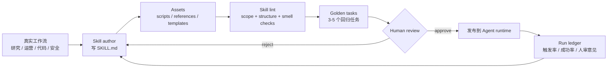
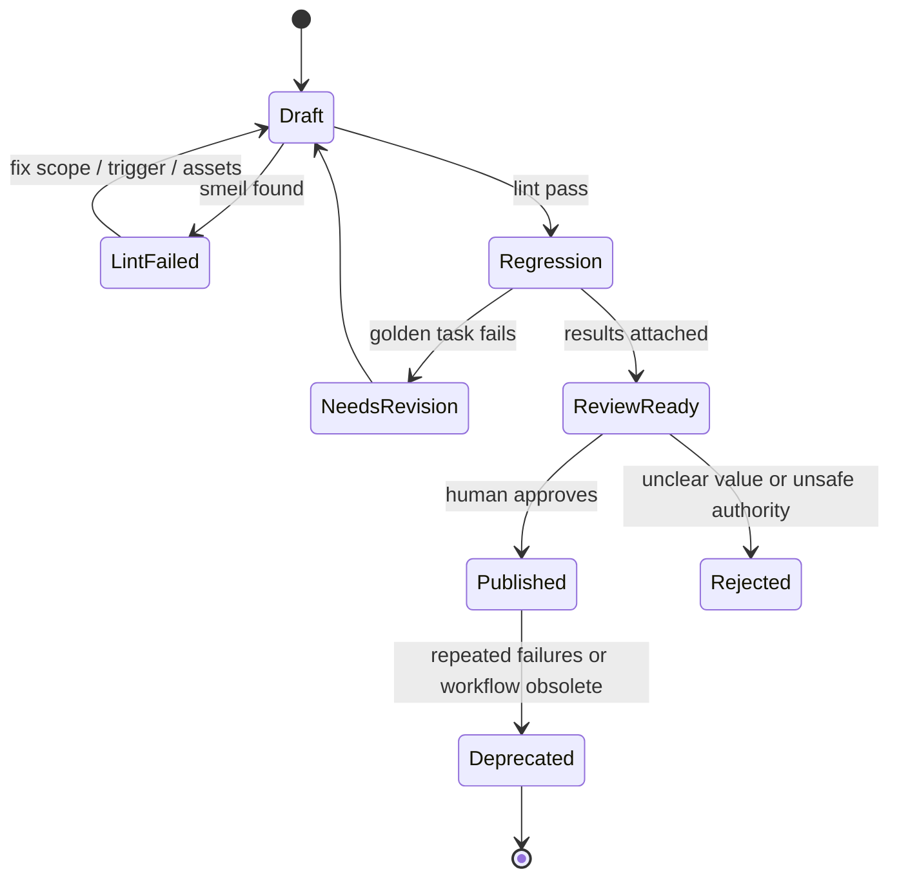

## 来源说明

本文基于 2026-07-07 的每日深度技术研究发布流程写成。今天没有选择继续写“更大的代码上下文”或“新的长期记忆 benchmark”，因为本站 7 月 2 日、7 月 3 日和 7 月 6 日已经连续覆盖上下文编排、记忆使用准入和代码 Agent 证据包。更值得补的一块是 AI Native 工作实践里的知识资产治理：Agent Skill 到底应该如何设计、评审、测试和上线。

核心来源如下：

- Miryung Kim 等: [Smells in LLM Agent Skill Design](https://arxiv.org/abs/2607.01456), arXiv:2607.01456v1。论文 2026-07-01 提交，研究对象是 Anthropic Claude Skills。作者把 skill 定义为一个包含 `SKILL.md`、脚本、资源和元数据的目录，并从 7,375 个公开 repository 中筛选 Skill 仓库，人工标注 smell taxonomy，再对样本和 Claude Sonnet 4.5 生成的技能进行分析。HTML 正文的 finding 写到 238 个样本中 212 个至少有一个 smell，表格里样本总数写作 228；本文保守引用为“作者报告的样本分析存在高比例 smell”，不把两个数字强行合并。
- arXiv HTML: [Smells in LLM Agent Skill Design](https://arxiv.org/html/2607.01456v1)。本文核对了 skill 定义、taxonomy、RQ1-RQ5、example smells、human-AI co-design 结论和 design guidelines。
- Anthropic Docs: [Agent Skills overview](https://platform.claude.com/docs/en/agents-and-tools/agent-skills/overview)。文档说明 skill 由 `SKILL.md` 加可选 scripts、references、assets 组成，并强调 progressive disclosure：模型先读较小的 `SKILL.md`，必要时再加载引用文件或运行脚本。
- Anthropic Docs: [Best practices for Agent Skills](https://docs.anthropic.com/en/docs/agents-and-tools/agent-skills/best-practices)。文档建议让 skills 聚焦具体任务、减少 instructions 冗余、在 `SKILL.md` 内提供清晰触发条件、把大材料放进 references、把确定性流程写成 scripts。
- Anthropic Engineering: [Equipping agents for the real world with Agent Skills](https://www.anthropic.com/engineering/equipping-agents-for-the-real-world-with-agent-skills)。文章把 Skills 定位为可组合的 instruction、script 和 resource 包，用于把领域知识和可执行流程交给 Agent。
- Codex 本地技能机制：当前站点发布流程本身运行在 Codex automation 中，且本工作区可见的技能清单也采用 `SKILL.md`、references、scripts、assets 的分层约定。本文把这些公开机制和本站自动发布经验结合成工程方案；具体 SOP、指标、目录结构和发布门是我的建议，不是上述来源共同声明的标准。

事实边界：论文中的 smell 名称、研究问题、样本来源、作者报告结果和 guideline 来自论文；Anthropic Skill 目录结构、progressive disclosure、scripts/references/assets 用法来自官方文档和工程文章。本文没有复现论文的数据抓取，也没有审计所有公开 skill 仓库。本文讨论的是授权团队内的 AI Native 工作流建设，不涉及绕过平台安全边界或攻击第三方系统。

站内重复检查：本站 2026-07-01 写过 AI Native 研究工作流 harness，重点是研究任务 DAG 和人审 gate；2026-07-06 写过代码 Agent evidence packet，重点是代码修复定位。本文的对象更窄：团队沉淀给 Agent 使用的 Skill/SOP 文件，如何从“提示词片段”升级为可审计、可回滚、可度量的工作流资产。

稳定 slug：`2026-07-07-agent-skill-quality-gate`。

## 先给结论

Agent Skill 不应该被当成提示词收藏夹。它更像 AI Native 团队的可执行 SOP：包含任务边界、触发条件、步骤、脚本、资源、权限说明、人工审核点和验证方法。

如果团队只把经验写进一段很长的 `SKILL.md`，会很快遇到四类问题：

| 问题 | 表面现象 | 真实风险 |
| --- | --- | --- |
| 触发条件模糊 | Agent 不该用时用了，该用时没用 | 工作流漂移，结果不可预测 |
| 指令过载 | `SKILL.md` 变成几千行百科 | token 浪费，关键约束被淹没 |
| 缺少执行资产 | 每次都让模型手写命令和模板 | 可复现性差，错误重复出现 |
| 没有验证门 | skill 改完直接发布 | 团队把脏 SOP 扩散给所有 Agent |

我的工程判断是：AI Native 实践里的 Skill 管理，第一版不用做平台。先把它放进仓库，用一个很小的质量门管住四件事：scope、progressive disclosure、deterministic assets、review evidence。



一句话：能改变 Agent 行为的知识文件，就要像代码一样评审。

## 场景定义

本文讨论一个具体场景：一个技术团队要把重复工作沉淀成 Agent Skills，让 Codex、Claude Code、内部研究 Agent 或运营 Agent 在合适任务上自动加载。

典型技能包括：

- 深度技术研究发布流程。
- PR 评论处理流程。
- 安全白盒扫描流程。
- 客户运营日报生成流程。
- 数据分析报告流程。
- 文档重构和发布流程。

输入通常是一个任务请求、一个仓库或文档库、若干工具权限、历史 SOP 和人工经验。输出不是“一个更聪明的 prompt”，而是一份可执行工作流资产：

- `SKILL.md`：说明何时使用、目标、步骤、边界和验证。
- `scripts/`：把确定性动作写成脚本。
- `references/`：放长文档、规范、示例和领域资料。
- `assets/`：放模板、表格、图片、样例文件。
- 测试任务：证明 skill 在真实任务上不会退化。

## 原流程痛点

没有 Skill 管理时，团队常见做法是把经验散落在聊天记录、Notion、README、自动化 prompt、个人别名和口头约定里。

| 原流程 | 问题 |
| --- | --- |
| 负责人手工复制长 prompt | 版本不可追踪，失败后不知道哪段指令生效 |
| 每个 Agent 重新读完整文档 | 上下文成本高，关键动作被长背景稀释 |
| 遇到失败就补一句规则 | skill 越写越长，互相冲突 |
| 脚本和文档分离 | Agent 知道该做什么，但每次都重新拼命令 |
| 发布后只看最终产物 | 不知道 skill 是否真的改善流程 |

这就是 SKILL.md smells 论文的价值所在：它把“提示词写得不好”具体化为可检查的设计异味。论文列出的 smell 覆盖 undefined skill boundary、poor triggering、bloated instructions、missing examples、overlapping scope、missing assets、unverifiable outcomes 等问题。即使不完全采用论文 taxonomy，工程团队也应该承认一个事实：Skill 是软件工件，不是灵感笔记。

## 技术问题：Skill 是运行时记忆和组织流程的交界面

Agent Skill 介于三类东西之间。

第一，它是 instruction。`SKILL.md` 会进入模型上下文，直接影响 Agent 如何理解任务、调用工具和停止。

第二，它是 memory。Skill 把组织经验变成可复用知识：某类任务怎么做、哪些坑要避开、哪些文件要看、哪些检查必须跑。

第三，它是 workflow adapter。Skill 可以附带脚本、模板和参考资料，把自然语言流程接到真实工具链。

这带来一个容易被低估的风险：Skill 一旦发布，就会以很低摩擦影响大量任务。如果它的触发条件错、权限边界错、验证步骤缺失，错误会被自动化放大。

所以 Skill 质量门至少要回答六个问题：

| 检查项 | 要回答的问题 |
| --- | --- |
| Scope | 这个 skill 到底覆盖哪类任务，不覆盖哪类任务 |
| Trigger | Agent 什么时候应该加载它，什么时候不该加载 |
| Disclosure | `SKILL.md` 是否短而可路由，长材料是否移到 references |
| Determinism | 可脚本化动作是否被脚本化，而不是靠模型临场发挥 |
| Authority | 它会不会要求 Agent 访问、修改或发布高风险资源 |
| Verification | 如何证明使用它比不用它更好，失败如何回滚 |

## 机制拆解：一个好 Skill 至少分四层

### 1. 路由层：让 Agent 知道何时使用

`SKILL.md` 的开头应该像 API contract，不像教程序言。它需要明确：

- 适用任务。
- 不适用任务。
- 必要输入。
- 退出条件。
- 升级人工的条件。

坏写法是“本 skill 可帮助你进行高质量研究”。这句话几乎没有路由价值。好写法是“当用户要求基于当天原始来源发布一篇技术研究文章，并需要写入 Astro content repo、构建、提交、部署时使用；如果来源不足，输出暂缓原因而不是发文”。

### 2. 渐进披露层：把长材料移出主上下文

Anthropic 文档强调 progressive disclosure。工程上这非常实际：`SKILL.md` 应该是索引和决策面，长规范、示例、数据字典、模板和政策应该放到 `references/`，只有需要时才读。

```text
daily-research-publish/
  SKILL.md              # 触发、目标、步骤、质量门
  references/
    source-policy.md    # 来源等级和引用规则
    article-rubric.md   # 文章质量 rubric
    tracks.md           # 站点研究分支定义
  scripts/
    check-frontmatter.js
    collect-post-stats.js
  assets/
    article-template.md
```

这个结构的收益不是“更整洁”，而是降低错误加载成本。Agent 不需要每次都把所有 rubric 塞进上下文；它先读最小约束，遇到文章质量判断时再读 rubric。

### 3. 执行资产层：能脚本化就脚本化

确定性动作不该交给模型临场写。比如：

- frontmatter schema 检查。
- slug 唯一性检查。
- 文章字数和章节检查。
- build、test、deploy 命令。
- 数据导出和格式转换。
- 生成固定目录结构。

这些动作放在 `scripts/` 里，比写成“请确保 frontmatter 正确”更可靠。模型负责判断和编排，脚本负责可重复执行。

### 4. 证据层：Skill 运行后要能复盘

每次使用 skill，至少留下一个 run ledger：

```yaml
skill_run:
  skill: daily-research-publish
  version: "2026-07-07"
  task: "每日深度技术研究发布"
  loaded_references:
    - source-policy.md
    - article-rubric.md
  commands:
    - "npm run build"
    - "git push origin codex/astro-rebuild"
    - "npm run deploy:prod"
  human_review_required:
    - "来源是否足够支撑原创文章"
    - "安全内容是否只讨论授权防御"
  result:
    status: deployed
    article_slug: "2026-07-07-agent-skill-quality-gate"
```

没有 ledger，团队很难知道 skill 失败是因为指令差、脚本坏、输入不足、权限失败，还是 Agent 没遵循流程。

## 目标工作流

AI Native 后，Skill 管理应该拆成五个角色。

| 角色 | 承担者 | 输入 | 输出 | 人工审核点 |
| --- | --- | --- | --- | --- |
| Workflow Owner | 负责人 | 真实业务流程、失败案例 | skill 目标和边界 | 是否值得沉淀成 skill |
| Skill Author | 人 + Agent | SOP、示例、工具说明 | `SKILL.md` 和资产 | 是否清楚、短、可执行 |
| Skill Linter | 脚本 + 小模型 | skill 目录 | smell report | 高风险 smell 阻断 |
| Regression Runner | Agent runtime | golden tasks | 成功率、成本、失败样例 | 关键任务是否退化 |
| Reviewer | 人 | diff、smell、回归结果 | approve / reject | 发布权保留给人 |



## 数据与权限边界

Skill 会把组织知识变成 Agent 行为，因此权限边界必须写进发布流程。

| 资产 | 风险 | 边界 |
| --- | --- | --- |
| `SKILL.md` | 指令越权、绕过人审 | 禁止要求 Agent 跳过审批、秘密读取或自动发布高风险变更 |
| `references/` | 内部资料泄露 | 标注来源等级和可用范围，敏感资料不进入通用 skill |
| `scripts/` | 执行危险命令 | 默认只允许读、检查、格式化；发布、删除、外发必须显式列出 |
| `assets/` | 模板含过期或私密数据 | 模板去标识化，样例不能含真实密钥、客户数据 |
| run ledger | 记录敏感输入输出 | 保存必要证据，脱敏用户、客户、密钥和隐私字段 |

懒一点的第一版做法是：先不建权限平台，只在 skill repo 里加 `authority` 字段和 review checklist。等 skill 数量和自动化权限增长，再接策略引擎。

```yaml
authority:
  filesystem: "read/write current workspace"
  network: "official sources and deployment endpoints"
  external_publish: "requires explicit command in task"
  secrets: "never print or copy"
  human_gate:
    - "production deploy"
    - "security finding disclosure"
    - "customer-facing message"
```

## 执行 SOP

第一周可以按下面流程试跑，不需要新平台。

### Day 1: 盘点候选 Skill

从最近 20 个重复任务里选 3 个候选，不要一次沉淀全部流程。优先选满足三个条件的任务：

- 输入输出稳定。
- 有明确验收标准。
- 失败成本可控。

比如“每日技术研究发布”“PR 评论处理”“内部周报生成”都比“解决所有线上问题”更适合第一批。

### Day 2: 写最小 `SKILL.md`

模板保持短：

```markdown
# Skill name

Use when ...

Do not use when ...

Inputs required:
- ...

Workflow:
1. ...
2. ...
3. ...

Human gates:
- ...

Verification:
- ...

Failure handling:
- ...
```

不要把所有背景都塞进主文件。超过 200 行时，优先拆到 `references/` 或 `scripts/`。

### Day 3: 加脚本和样例

只脚本化最稳定的检查。比如内容站点可以先加 frontmatter、slug、build 检查；安全审计 skill 可以先加仓库枚举、规则运行、报告格式检查。

### Day 4: 做 smell lint

第一版 smell lint 不需要 AST。用简单规则就够：

| Smell | 简单检查 |
| --- | --- |
| Undefined boundary | 缺少 “Use when” 或 “Do not use when” |
| Bloated instruction | `SKILL.md` 超过行数阈值且没有 references |
| Missing verification | 没有 “Verification” 或可运行命令 |
| Missing human gate | 涉及发布、外发、安全、金钱但没有 human gate |
| Asset drift | 文中提到脚本或引用文件但路径不存在 |

### Day 5: 跑 golden tasks

每个 skill 准备 3 到 5 个小任务：

- 一个标准成功任务。
- 一个材料不足应该拒绝的任务。
- 一个需要人工审核的高风险任务。
- 一个历史失败回归任务。

目标不是追求 benchmark，而是防止 skill 改动后把基本边界打破。

### Day 6-7: 小范围发布

只给一个 Agent 或一个团队启用，记录：

- 触发是否正确。
- 是否读取了不必要 references。
- 是否复用了脚本。
- 人审是否能看懂结果。
- 失败是否可回滚。

## 质量评估

我会把 Skill 质量分成四类指标。

| 指标 | 含义 | 一周内可测方式 |
| --- | --- | --- |
| Trigger precision | 不该用时是否误触发 | 把 20 个历史任务跑一次路由 |
| Completion quality | 产物是否达到人工验收 | 人审打分或通过率 |
| Cost and latency | 是否减少上下文和人工时间 | 比较 token、命令次数、人工修改时间 |
| Safety and rollback | 是否保留审批和回滚路径 | 检查 ledger、git diff、失败处理 |

不要只看“用了 skill 后 Agent 更像懂业务”。这太主观。更可用的 ROI 是：

```text
review_time_saved_minutes
manual_corrections_per_run
failed_runs_due_to_missing_context
unnecessary_reference_loads
commands_retyped_by_agent
human_gate_bypass_attempts
rollback_time_minutes
```

如果一个 skill 让产物更稳定、人工审查更快、失败更容易定位，即使它没有完全自动化，也已经有价值。

## 成本估算

第一版成本主要来自三块：

| 成本 | 粗估 | 控制办法 |
| --- | --- | --- |
| 编写 skill | 每个 2-4 小时 | 只沉淀高频流程 |
| 回归任务 | 每个 skill 3-5 个样例 | 用历史真实任务裁剪 |
| 运行成本 | 取决于 Agent 和 references | progressive disclosure，脚本替代长提示 |

不要为了 Skill 管理先建门户、市场、评分系统或复杂 registry。目录加 review checklist 就能跑起来。等 skill 超过 20 个、多人同时维护、误触发开始影响生产任务，再考虑集中索引和权限平台。

## 失败模式与回滚

| 失败模式 | 表现 | 回滚方案 |
| --- | --- | --- |
| 触发过宽 | Agent 在无关任务加载 skill | 收窄 Use when，增加 Do not use when |
| 触发过窄 | 该用时没用 | 增加正例任务和关键词，但不要扩大到泛化描述 |
| 指令冲突 | Agent 一会儿要求自动发布，一会儿要求人审 | 保留更高风险边界，删除重复段落 |
| 资产缺失 | 文档引用不存在脚本或模板 | lint 阻断发布 |
| 脚本副作用过大 | 检查脚本修改文件或访问外部系统 | 拆分 read-only check 和 explicit publish |
| 过期 SOP | 组织流程已变但 skill 没更新 | 标记 deprecated，保留旧版本但停止路由 |
| 质量下降 | golden task 通过率下降 | 回滚到上一版 skill，保留失败 ledger |

Skill 回滚要足够简单：它本来就应该在 git 里。上一版可用就 revert 目录，不要让失败版本继续被 Agent 加载。

## 我会如何实现/验证

我会先用一个仓库目录完成最小闭环：

```text
skills/
  daily-research-publish/
    SKILL.md
    references/
      article-rubric.md
      source-policy.md
    scripts/
      check-post.mjs
    tests/
      standard-task.md
      insufficient-sources.md
      high-risk-security.md
  pr-comment-fix/
    SKILL.md
    scripts/
      collect-review-comments.mjs
```

然后加一个很小的检查脚本：

```text
check-skill
  - 确认 SKILL.md 存在
  - 确认 Use when / Do not use when / Verification 存在
  - 检查引用路径是否存在
  - 检查 scripts 是否可执行或至少可读
  - 检查 authority 字段是否声明高风险动作
```

验证方式：

1. 选两个现有高频流程，各写一个最小 skill。
2. 用过去一周真实任务做 10 次离线 replay。
3. 记录不使用 skill 和使用 skill 的人工修改时间、失败原因、命令重复率。
4. 把 skill 只给一个 automation 启用三天。
5. 第三天复盘 ledger，决定保留、收窄或删除。

这比一次性建设“企业 Agent 知识平台”更可控。先证明一个 skill 能减少重复工作，再谈规模化。

## 适用场景

适合：

- 有稳定 SOP 的研发、研究、运营、安全、数据分析流程。
- 需要人机协同、但可以让 Agent 先收集证据和生成草稿的工作。
- 有明确验收标准和回滚路径的自动化任务。
- 团队希望把个人经验沉淀给多个 Agent 复用。

不适合：

- 一次性创意任务。
- 目标和边界还没弄清的问题。
- 高风险外部操作且没有人工审批的流程。
- 需要实时判断复杂合规责任的任务。

## 局限分析

第一，论文研究对象主要是 Anthropic Claude Skills，不能自动代表所有 Agent runtime。Codex、Claude Code、内部 Agent 平台可能有不同加载机制，但 `SKILL.md + references + scripts + assets` 的设计问题具有迁移价值。

第二，smell taxonomy 是设计辅助，不是形式化安全证明。一个 skill 通过 smell lint，仍可能在真实任务中触发错误工具、误读资料或产出低质量内容。

第三，golden tasks 容易过拟合。团队如果只把成功样例放进去，skill 会看起来稳定但遇到边界任务就失败。必须保留“应该拒绝”和“必须人审”的负例。

第四，Skill 管理会引入维护成本。低频流程不值得沉淀成 skill；过早沉淀会把临时习惯固化成组织负担。

## 自审

- 事实可靠性：核心事实来自 arXiv 论文、arXiv HTML、Anthropic 官方文档和工程文章；论文样本数字存在正文/表格不一致，本文已明确说明并避免夸大。
- 来源完整性：覆盖论文、官方 overview、官方 best practices、工程文章和本站运行环境经验；没有使用二级摘要作为核心证据。
- 是否只是复述：不是。本文主线是把 Skill 视为 AI Native SOP 工件，并给出质量门、权限边界、SOP、指标和回滚方案。
- 是否标题党：标题只陈述工程判断，没有夸大“自动化一切”。
- 是否薄内容：包含机制图、状态机、表格、目录结构、质量指标、执行 SOP、失败模式和验证计划。
- 是否把推断写成事实：论文和文档事实均标来源；质量门、ROI 指标和目录方案明确是我的工程建议。
- 站内重复：与 7 月 1 日研究 workflow harness、7 月 6 日代码 evidence packet 相邻但不重复；本文聚焦 Skill 资产治理。
- 工程价值：一周内可按两个 skill、十次 replay、小范围启用来验证。
