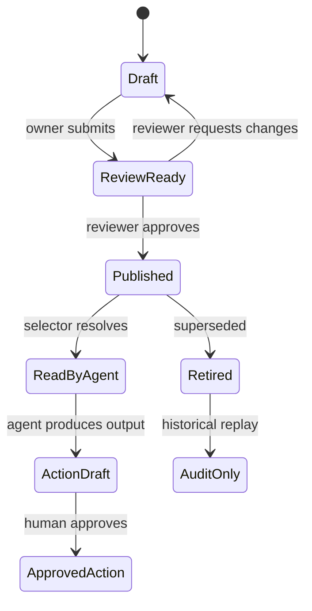

## 来源说明

本文基于 2026-07-08 的每日深度技术研究发布流程写成。今天没有选择再写“代码 Agent 证据包”或“Agent Skill 质量门”，因为本站 7 月 6 日和 7 月 7 日已经覆盖研发证据收敛与 Skill 资产治理。今天更值得补的是 AI Native 工作实践里的组织知识库问题：当 Agent 开始读取 runbook、ADR、政策、SOP 和团队经验时，RAG 只能回答“相关吗”，不能回答“现在是否允许被 Agent 使用”。

核心来源如下：

- Misha Sulpovar 等: [ContextNest: Verifiable Context Governance for Autonomous AI Agents](https://arxiv.org/html/2607.02116v1), arXiv:2607.02116v1。arXiv 页面显示 2026-07-02 提交。论文提出 ContextNest，把 Agent 可消费知识组织成 typed Markdown、YAML metadata、deterministic selector、`contextnest://` URI、SHA-256 hash chain、graph checkpoint、MCP source node 和 context injection audit trace。作者强调它不是 RAG 替代品，而是 RAG 下面的治理层。
- PromptOwl GitHub: [PromptOwl/ContextNest](https://github.com/PromptOwl/ContextNest)。README 说明 ContextNest 是 TypeScript 项目，包含 CLI、engine、MCP server，使用 Markdown vault、versioning、integrity verification 和 query language；README 也列出 AGPL-3.0 implementation 与 Apache-2.0 specification 的拆分。
- npm: [`@promptowl/contextnest-cli`](https://www.npmjs.com/package/%40promptowl/contextnest-cli)。包页面显示 CLI 可通过 npm 安装，用于初始化和管理 ContextNest vault。本文只把它当作“已有可试跑工具”的证据，不评价其生产成熟度。
- Model Context Protocol 官方文档: [MCP introduction](https://modelcontextprotocol.io/docs/getting-started/intro)、[MCP resources](https://modelcontextprotocol.io/specification/2025-11-25/server/resources) 和 [MCP tools](https://modelcontextprotocol.io/specification/2025-11-25/server/tools)。MCP 官方文档把 MCP 定义为 AI 应用连接外部系统的开放标准；resources 负责暴露上下文数据，tools 负责暴露可调用能力。
- 本站 2026-06-16: [Work IQ 不是企业搜索，而是 Agent 工作上下文层](/articles/2026-06-16-work-iq-enterprise-agent-context-workflow/)。那篇文章讨论企业工作上下文如何进入 Agent workflow；本文进一步收窄到“进入上下文前如何治理版本、审批、完整性和审计”。

事实边界：ContextNest 的机制、实验设置、作者报告结果和局限来自论文、README 与 npm 页面。本文没有复现 ContextNest 的实验，也没有审计其实现安全性。本文提出的团队知识库落地 SOP、权限边界、指标和一周实验计划是我的工程建议，不是上述来源共同声明的行业标准。

站内重复检查：本站已经写过长期记忆评测、记忆安全、上下文压缩、代码 Agent 证据包和 Agent Skill 管理。本文的差异点是企业知识库作为 Agent 输入供应链：先治理可消费上下文，再做相似度检索。

稳定 slug：`2026-07-08-context-governance-agent-knowledge-base`。

## 先给结论

企业给 Agent 接知识库时，第一版不应该只问“用哪种 embedding、chunk 多大、top-k 取几条”。更早的问题是：哪些知识现在是已批准版本，谁负责，是否被篡改，Agent 这次到底读了哪一版，事后能不能重放。

ContextNest 给出的工程信号很清楚：RAG 是 relevance layer，context governance 是 eligibility layer。前者回答“哪段内容可能相关”，后者回答“哪份上下文有资格进入 Agent 的工作窗口”。

```mermaid
flowchart LR
  A["Docs / ADR / Runbook / SOP"] --> B["Context Vault<br/>typed markdown + metadata"]
  B --> C["Stewardship<br/>draft / published / reviewer"]
  C --> D["Integrity<br/>version hash chain + checkpoint"]
  D --> E["Governed Subset<br/>current + approved + verifiable"]
  E --> F["RAG / selector / hybrid retrieval"]
  F --> G["Agent Context Window"]
  G --> H["Audit Trace<br/>who read which version when"]
  H --> I["Review / incident replay / ROI metrics"]
```



我的判断是：AI Native 团队知识库的最小可行治理，不是采购一套大平台，而是在现有 Markdown/Docs/ADR 流程上增加四个门：发布状态、负责人、版本校验、消费审计。

## 场景定义

本文讨论一个具体工作场景：一个研发或安全团队想让 Agent 读取组织知识，辅助完成代码审查、上线排障、客户响应、安全扫描、研究写作和运营流程。

原始输入通常包括：

- 架构决策记录、接口规范、编码规范。
- 事故 runbook、发布流程、回滚流程。
- 安全基线、威胁模型、白盒扫描规则说明。
- 客户支持 SOP、内部术语表、项目背景。
- 人写给 Agent 的 prompt、skill、任务模板。

目标不是“把所有文档扔进向量库”，而是让 Agent 每次读取的上下文满足几个条件：

| 条件 | 工程问题 |
| --- | --- |
| 当前有效 | 是否误读了过期 SLA、废弃接口或旧安全规则 |
| 已批准 | 这份知识是否已经过负责人审核 |
| 可归因 | 谁维护这份知识，出问题找谁 |
| 可校验 | 内容和版本历史是否被改写 |
| 可重放 | 事后能否复原 Agent 当时读到的上下文 |

## 原流程痛点

很多团队的“知识库 + Agent”第一版长这样：

1. 把 Notion、Confluence、GitHub docs 或 Obsidian 导出。
2. 做 chunk、embedding、BM25 或 hybrid search。
3. 给 Agent 一个检索工具。
4. 观察答案质量。

这条路能快速出 demo，但生产风险很快出现。

| 失败点 | 典型表现 | 根因 |
| --- | --- | --- |
| 旧文档被召回 | Agent 引用废弃 runbook 或旧价格规则 | index 没有发布状态和版本资格 |
| 草稿被消费 | 未审核策略进入客户回复或代码审查 | 文档库没有 AI consumption gate |
| 审计断裂 | 事故后不知道 Agent 读了哪几段 | 检索结果没有版本和 checkpoint |
| 相似但不该用 | 相关内容来自错误团队或错误服务 | relevance 没有权限、范围和 steward 约束 |
| 人责不清 | 答错后没人认领知识维护 | 文档缺 owner 和审批链 |

这不是 RAG 调参能彻底解决的问题。相似度检索可以更准，但它不会自然知道“这份内容已经退役”“这段 SOP 还没通过审核”“这次输出必须能被合规复盘”。

## 技术问题：检索质量和上下文资格是两件事

ContextNest 论文把问题定义为 context governance gap：Agent 可以访问信息，不等于它消费的信息是已批准、当前、可归因、带版本、未被篡改且可审计的。

这对 AI Native 工作流尤其关键。因为 Agent 不只是回答知识问答，它会把上下文转成行动建议：

- 代码审查 Agent 根据旧 style guide 提出错误修改。
- 安全 Agent 根据过期例外规则放过风险。
- 运营 Agent 根据旧退款政策回复客户。
- 研究 Agent 根据未审核草稿生成外部发布内容。
- 排障 Agent 根据旧 runbook 执行错误恢复步骤。

这些失败看起来像“模型幻觉”，实际常常是上下文供应链问题。模型根据给定上下文推理得很连贯，但上下文本身不该进入窗口。

## 机制拆解

### 1. Typed Markdown：让知识有机器可读身份

ContextNest 的基本单元是带 YAML frontmatter 的 Markdown 文档。论文列出 document、snippet、glossary、persona、prompt、source、tool、reference 等 node type。这个设计并不新奇，但足够实用：组织知识仍然是人可编辑的文本，同时多了机器可读的身份、状态、标签和版本字段。

一个团队可以从更小的 schema 开始：

```yaml
---
title: "Payments 发布回滚 Runbook"
type: runbook
service: payments
tags: ["deploy", "rollback", "sev1"]
status: published
owner: "sre@example.com"
reviewer: "platform-lead@example.com"
version: 4
last_reviewed: 2026-07-08
---
```

这比直接 chunk 文档多几行 metadata，但少掉很多后续补丁。Agent 不必猜它读的是草稿、规范、工具说明还是行为指令。

### 2. 发布状态和 Stewardship：先决定谁能进上下文

ContextNest 区分 draft 和 published，并用 steward 角色处理谁有权审批。它的完整模型包含 scope hierarchy、role lattice 和 separation of duties。第一版内部落地不必全量照搬，保留三个字段就够：

- `status`: `draft | published | retired`
- `owner`: 文档维护人
- `reviewer`: 发布审批人

懒一点但管用的规则是：Agent 检索默认只看 `published`，`draft` 只能在研究或编写模式显式读取，`retired` 只能用于历史复盘，不能进入行动建议。

### 3. Deterministic Selector：结构选择要和相似度检索分开

ContextNest 的 selector grammar 和 `contextnest://` URI 让系统可以按 tag、folder、path、version、anchor 做确定性选择。论文里的关键边界是：direct/set addressing 能给确定性保证，`contextnest://search/{query}` 则显式委托给外部检索。

这对工程实现很重要。不要把所有访问都做成 embedding search。很多上下文应按结构取：

| 任务 | 更合适的第一选择 |
| --- | --- |
| payments 发布回滚 | `service=payments AND type=runbook AND tag=rollback` |
| 安全审查基线 | `type=standard AND tag=security AND status=published` |
| 某 ADR 的当前版本 | stable path + latest published |
| 术语解释 | `type=glossary AND tag=domain` |
| 模糊探索 | hybrid search over governed subset |

相似度检索应该在“已批准且当前”的集合上运行，而不是直接扫原始存储层。

### 4. Hash Chain 与 Checkpoint：让版本可复原

ContextNest 使用 SHA-256 hash chain 绑定每个文档版本，并用 graph-level checkpoint 记录某一时刻整个知识图谱中每个 published 文档的版本。论文明确说 hash chain 是篡改检测，不是篡改预防；这是正确边界。

工程上可以先不实现完整密码学。最小版可以用 Git commit 作为 checkpoint：

```text
context/
  nodes/
    runbooks/payments-rollback.md
    standards/security-review.md
  manifests/
    published.json
  ledger/
    context-reads.ndjson
```

每次发布文档时更新 manifest 并提交；每次 Agent 读取时记录 `commit_sha + path + version + selector + task_id`。这不如 ContextNest 完整，但一周内能证明治理价值。

### 5. Audit Trace：把 Agent 的知识输入变成证据包

ContextNest 的 audit trace 记录 Agent 访问的 URI、版本、checkpoint、作者、编辑时间和访问时间；source node hydration 还记录 tool、server、result hash、cache status 和 duration。

这正好补上 AI Native 工作流最缺的一块：人类 reviewer 不只看最终输出，还能看到 Agent 凭什么输出。

```yaml
context_read:
  task_id: "sec-review-2026-07-08-03"
  agent: "code-review-agent"
  selector: "type:standard tag:security service:payments"
  checkpoint: "git:8f3a1c2"
  documents:
    - path: "nodes/standards/security-review.md"
      version: 7
      owner: "appsec@example.com"
      status: "published"
  result:
    used_in: "review-comment-draft"
    human_reviewer: "security-lead@example.com"
```

## 目标工作流

AI Native 后，团队知识库不应该只是“给 Agent 搜索”。它应该分成五个角色。

| 角色 | 承担者 | 输入 | 输出 | 人工审核点 |
| --- | --- | --- | --- | --- |
| Knowledge Owner | 业务/研发/安全负责人 | 真实 SOP、规则、事故经验 | 文档内容和 owner | 内容是否仍然有效 |
| Context Steward | 负责人或轮值 reviewer | diff、metadata、风险等级 | published / rejected | 高风险上下文发布 |
| Context Resolver | 脚本、MCP server、检索服务 | selector、task scope | 可消费文档集合 | 不确定范围升级 |
| Task Agent | Codex、Claude、内部 Agent | governed context、任务输入 | 草稿、patch、分析、建议 | 行动前必须人审 |
| Auditor | 人 + 自动化脚本 | trace、输出、结果 | 复盘、指标、回滚建议 | 事故和质量抽检 |

状态流转可以保持简单：



## 可复制 SOP

下面是一周内能试跑的最小方案，适合 5-20 人研发、安全或运营团队。

### Day 1：收敛知识入口

只选一个高频场景，不要全公司知识库一起上。推荐从这三类里选一个：

- 发布/回滚 runbook。
- 安全审查标准。
- 代码审查团队规范。

目录结构：

```text
agent-context/
  nodes/
    runbooks/
    standards/
    glossary/
    prompts/
  manifests/
    published.json
  ledger/
    context-reads.ndjson
  scripts/
    check-context.mjs
    resolve-context.mjs
```

### Day 2：定义最小 frontmatter

必填字段只保留这些：

```yaml
title: string
type: runbook | standard | glossary | prompt | reference
status: draft | published | retired
owner: email
reviewer: email
tags: string[]
last_reviewed: YYYY-MM-DD
```

跳过复杂权限模型，等真实冲突出现再加。先把“草稿不能默认进 Agent 上下文”做实。

### Day 3：写 resolver，而不是先接向量库

第一版 `resolve-context.mjs` 只做结构过滤：

```js
// ponytail: structural resolver first; add embeddings when exact tags miss real tasks.
const docs = loadMarkdownNodes("nodes");
const result = docs.filter((doc) =>
  doc.status === "published" &&
  requestedTags.every((tag) => doc.tags.includes(tag))
);
```

输出 JSON，给 Agent 或 MCP tool 使用。这个脚本很土，但能避免最危险的错误：把 raw docs、草稿和 retired docs 全部索引进去。

### Day 4：接入 Agent 工作流

给 Agent 的任务模板固定包含：

```text
先调用 resolve-context 获取 published context。
不要使用 draft 或 retired 文档生成行动建议。
输出中列出使用的 context path、version/commit 和 owner。
如果上下文不足，停止并说明缺口，不要补猜。
```

人工审核点保留在行动之前：Agent 可以写建议、草稿、patch、复盘，不直接发布客户回复、不直接执行生产变更、不直接批准安全例外。

### Day 5：记录 read ledger

每次 resolver 返回上下文时追加一行 ndjson：

```json
{"ts":"2026-07-08T09:30:00Z","task_id":"release-42","selector":["payments","rollback"],"commit":"8f3a1c2","paths":["nodes/runbooks/payments-rollback.md"],"agent":"ops-agent"}
```

这个 ledger 是后续 ROI 和事故复盘的基础。没有它，团队只能争论“Agent 当时可能读了什么”。

### Day 6-7：做 20 个回放任务

选 20 个历史任务，分两组跑：

- A 组：Agent 用原始 RAG 或全文搜索。
- B 组：Agent 只用 governed context resolver。

比较输出质量、引用版本、人工修改量和是否引用过期内容。样本很小，但足够判断是否值得继续投入。

## 工具栈选择理由

| 层 | 第一版选择 | 理由 | 何时升级 |
| --- | --- | --- | --- |
| 文档格式 | Markdown + YAML | 人可读，Git 可审 | 需要协作 UI 时接 CMS |
| 版本 | Git commit | 不写新存储系统 | 需要跨文档 checkpoint API 时引入 ContextNest 类实现 |
| 解析 | Node 脚本 | 项目已有 npm/TypeScript 栈 | 查询复杂后再做服务 |
| Agent 接入 | CLI 或 MCP tool | 先少集成 | 多客户端共享时接 MCP server |
| 检索 | tag selector | 确定性强 | 召回不足时加 hybrid search |
| 审计 | ndjson ledger | 简单可 grep | 合规要求高时接 append-only store |

这里刻意不先上向量库。不是因为 embedding 没用，而是治理层应该先把可消费集合变小、变准、变可审计。之后再在这个集合上做 hybrid search。

## 质量评估

最低指标清单：

| 指标 | 计算方式 | 目标 |
| --- | --- | --- |
| stale context rate | Agent 输出引用 retired/旧版本次数 / 总任务数 | 0 |
| unsupported answer rate | 输出没有 context path 支撑的关键判断 / 总关键判断 | 逐周下降 |
| human edit distance | 人审修改的关键段落数量 | 低于原流程 |
| context token cost | 每任务注入 token | 不高于原 RAG |
| replay success | 通过 ledger 能复原上下文的任务比例 | 100% |
| review latency | 文档从 draft 到 published 的中位时间 | 不阻塞主流程 |
| owner coverage | published 文档有 owner/reviewer 的比例 | 100% |

ROI 不要只看“省了多少分钟”。更可靠的是三类收益：

- 少引用过期知识。
- reviewer 更快判断 Agent 输出是否可信。
- 事故复盘能复原上下文输入。

## 成本估算

一周实验的人力成本大致是：

| 项目 | 成本 |
| --- | --- |
| 整理 20-40 篇核心文档 | 0.5-1 人天 |
| 写 frontmatter 和检查脚本 | 0.5 人天 |
| 写 resolver 和 ledger | 0.5 人天 |
| 接入一个 Agent workflow | 0.5-1 人天 |
| 回放 20 个历史任务并评估 | 1 人天 |

总计 3-4 人天。这个成本比直接建设“企业 Agent 知识平台”低很多，也能更快暴露真实瓶颈：文档没人维护、owner 不明确、标签体系混乱，还是 Agent 的任务模板不够约束。

## 失败模式与回滚

| 失败模式 | 现象 | 兜底 |
| --- | --- | --- |
| 标签太粗 | resolver 返回一堆无关文档 | 增加 service/type 双条件，不急着上 embedding |
| 文档太旧 | published 也不可信 | 加 `last_reviewed` 过期门，超过 90 天要求复审 |
| 人审堵塞 | 文档迟迟不能发布 | 只对高风险 type 要 reviewer，低风险先 owner publish |
| Agent 绕过 resolver | 直接读 raw docs | 在任务模板和工具权限里移除 raw docs 默认入口 |
| ledger 过大 | ndjson 难查 | 每周归档，必要时导入 SQLite |
| metadata 造假 | owner/reviewer 字段不可信 | 用 Git author 和 PR review 绑定发布流程 |
| hash 只能检测不能阻止 | 有写权限的人可改内容 | 用 Git branch protection 或只读发布目录 |

回滚方案很简单：如果 governed resolver 影响任务质量，就把 Agent 退回只读原文档模式，但保留 ledger 和 `status` 字段。治理 metadata 不会破坏原文档，最大损失是多维护几行 frontmatter。

## 工程判断

ContextNest 的价值不在于“又发明一种知识库格式”，而在于它把 Agent context 视为供应链资产。这个判断是对的。

不过我不会建议团队第一天就完整采用它的全部机制。原因有三点：

1. 论文实验仍是早期结果。作者自己也强调 stale-version attack 是小型、合成、带对抗设置的实验，不能当成通用企业 benchmark。
2. 完整 hash chain、checkpoint、federation、stewardship 对小团队可能过重。
3. 企业知识治理的瓶颈常常不是协议，而是 owner、审批和文档更新纪律。

我的落地建议是：先复制边界，不复制全部实现。也就是先建立“published-only + owner + resolver + ledger”的最小治理层；当团队确实需要跨工具、跨 Agent、跨知识库共享时，再评估 ContextNest CLI/MCP server 或类似实现。

## 我会如何实现和验证

如果我在一个研发团队试点，会这样做：

1. 选 `release-runbook` 一个场景，只纳入 30 篇以内文档。
2. 用 Markdown frontmatter 标记 `type/status/owner/reviewer/tags/last_reviewed`。
3. 写一个 100 行以内的 resolver，只返回 `published` 且 tag 匹配的文档。
4. 在 Codex/Claude Code 任务模板里强制先取 governed context，再生成回滚建议。
5. 让 Agent 输出每个关键建议对应的 `path + commit + owner`。
6. 回放最近 20 次发布/回滚/排障任务，对比原流程和 governed resolver。
7. 如果 stale context rate 不降，说明文档治理没做好；如果 token 降但人工修改量上升，说明 selector 召回不足；如果 reviewer 时间下降，才继续扩展到安全审查和代码规范。

最小验收标准：

- 20 个任务都能从 ledger 复原 Agent 读过的上下文。
- 0 次引用 retired 文档。
- 至少 80% 的关键建议带有可点击来源。
- 人审能在 5 分钟内判断“这条建议基于哪份当前知识”。

## 局限分析

Context governance 不能替代这些东西：

- 不能证明文档内容本身正确，只能证明它是哪个版本、谁批准、是否可复原。
- 不能替代 action authorization。Agent 能不能执行命令、发邮件、改生产配置，是另一层权限系统。
- 不能消除 prompt injection。它可以降低未批准上下文进入窗口的概率，但 Agent 读到恶意 published 文档仍可能受影响。
- 不能自动解决知识更新。owner 不维护，治理层只会更明确地暴露陈旧。
- 不能保证相似度召回。结构 selector 和 RAG 应该组合使用。

所以这篇文章的建议很窄：先把 Agent 可消费知识从“文档堆”变成“可审计上下文资产”。不要把它包装成万能企业大脑。

## 自审

- 事实可靠性：核心事实来自 arXiv 论文、PromptOwl GitHub/npm 和 MCP 官方文档；实验数字按作者报告转述，没有当成我复现实验结果。
- 来源完整性：覆盖论文、实现仓库、包分发和协议背景；没有引用二手营销文作为关键证据。
- 是否只是复述：不是。本文把 ContextNest 机制转成一周内可试跑的团队知识库治理 SOP，并明确哪些机制先跳过。
- 标题党检查：标题准确表达主张：RAG 前需要上下文治理，不夸大为“替代 RAG”。
- 猜测边界：ROI、目录结构、脚本和验收标准是我的工程建议，已和来源事实分开。
- 站内重复：区别于 Work IQ、代码 Agent 证据包和 Skill 质量门，本文聚焦组织知识进入 Agent 前的 eligibility、version 和 audit。
- 安全边界：只讨论授权团队内部知识治理、防御和审计，不提供攻击第三方目标流程。
- 工程价值：包含机制图、SOP、目录结构、权限边界、指标、成本估算、失败回滚和一周验证计划。
