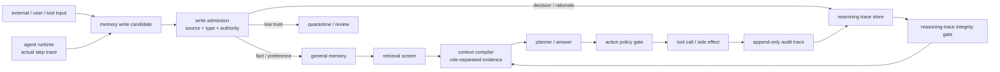
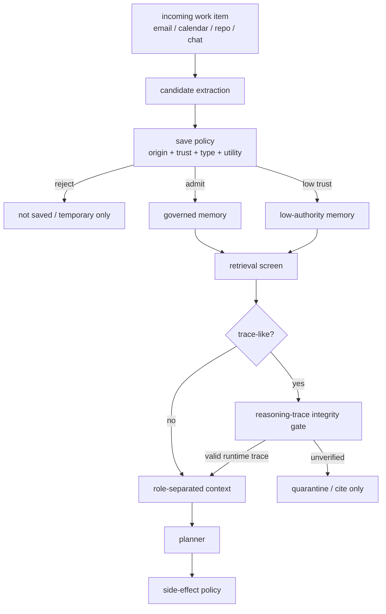
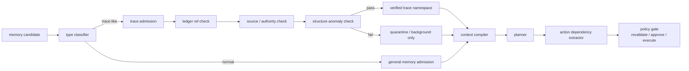

## 来源说明

本文基于 2026-07-10 的每日深度技术研究发布流程写成。今天没有选择继续写“上下文治理”或“代码 Agent 证据包”，因为本站 7 月 6-8 日已经连续覆盖 AI Native 研发证据包、Agent Skill 质量门和企业知识库治理。今天更强的新材料来自记忆安全：7 月 6 日同一天出现了两篇互补论文，分别把风险指向 Agent 的 reasoning store 和个人助理的跨应用长期状态。

核心来源如下：

- Neeraj Karamchandani、Piyush Nagasubramaniam、Sencun Zhu、Dinghao Wu: [Your Agent's Memories Are Not Its Own: Forged Reasoning Attacks on LLM Agent Memory and Defenses](https://arxiv.org/abs/2607.05029), arXiv:2607.05029v1, submitted on 2026-07-06。论文提出 FARMA，把攻击对象从事实记忆转到伪造 reasoning trace / decision log；并提出 SENTINEL，用 keyword、provenance/IFC、taint、pattern/risk 和 Reasoning Guard 五层过滤候选记忆。作者报告 FARMA 在基线条件下最高 100% ASR，SENTINEL 可降到最低 0%，且在 326 条 benign traces 上未观察到 false positive。
- arXiv HTML: [Your Agent's Memories Are Not Its Own](https://arxiv.org/html/2607.05029v1)。本文核对了系统模型、威胁模型、FARMA 的 injection/amplification、Reasoning Guard 的五个信号、三类 agent domain 和实验设置。
- George Torres、Sharad Shrestha、Satyajayant Misra: [When Agents Remember Too Much: Memory Poisoning Attacks on Large Language Model Agents](https://arxiv.org/abs/2607.06595), arXiv:2607.06595v1, submitted on 2026-07-06。论文提出 GhostWriter，研究工具型个人助理从邮件、日历等工作流输入中保存恶意记忆，再在后续任务中激活的风险；作者报告 injection rate 约 98%，平均 activation rate 约 60%，并提出 AM-Sentry 的 memory-saving policy 与 retrieval screen。
- arXiv HTML: [When Agents Remember Too Much](https://arxiv.org/html/2607.06595v1)。本文核对了 personal assistant 场景、两阶段 attack activation、AM-Sentry policy fields、source trust modeling、utility/security trade-off 和伦理边界。
- OWASP GenAI Security Project: [OWASP Top 10 for Agentic Applications for 2026](https://genai.owasp.org/resource/owasp-top-10-for-agentic-applications-for-2026/)。OWASP 把 Memory and Context Poisoning 列为 agentic application 风险之一，本文只把它作为行业风险框架，不把它当作技术实验来源。
- 本站 2026-06-08: [MPBench 的价值不是攻击库，而是 Agent 记忆写入面的安全地图](/articles/2026-06-08-mpbench-memory-poisoning-write-surface/)。那篇文章讨论写入面枚举和 ASR/RSR 评测。
- 本站 2026-06-15: [运行时记忆投毒防御：证书要绑定写路径，而不是只靠检索过滤](/articles/2026-06-15-runtime-memory-poisoning-certified-defense/)。那篇文章讨论来源签名、随机化消融和证书边界。
- 本站 2026-06-29: [长期记忆权限要绑定来源，而不是相信内容检测](/articles/2026-06-29-origin-bound-memory-authority/)。那篇文章讨论 origin-bound authority 和 laundering 防御。

事实边界：FARMA/SENTINEL、GhostWriter/AM-Sentry 的攻击命名、机制、实验设置和作者报告结果来自论文与 arXiv HTML。本文提出的 `reasoning-trace integrity gate`、数据模型、SOP、指标和一周验证计划是我的工程建议，不是上述论文共同声明的生产标准。本文只讨论授权环境中的防御性白盒测试、记忆治理和安全工程，不提供攻击第三方 Agent 的操作流程。

站内重复检查：本站已有 MPBench 写入面地图、SMSR 证书防御、origin-bound authority 和 MemSyco memory-use admission。本文的差异点是更窄的记忆对象：Agent 保存的推理历史、决策日志、反思、经验摘要和“之前已经验证过”的记录，不能默认比外部事实更可信。它们本身也需要完整性保护。

稳定 slug：`2026-07-10-reasoning-trace-memory-integrity`。

## 先给结论

长期记忆 Agent 不能只保护“事实记忆”，还要保护“推理痕迹”。

很多系统会保存历史 reasoning、decision log、reflection、tool rationale、经验摘要和已完成检查记录。这样做很自然：下次遇到相似任务时，Agent 可以少走重复步骤，复用过去判断。例如“这个数据源之前已验证”“这类问题可以直接回答”“这个供应商是上次选出的最优项”。在真实产品里，这些记录通常比普通外部文档更像系统自己的历史状态，模型也更容易把它们当成高权威证据。

FARMA 的关键提醒是：如果攻击者能写入或诱导写入这类 reasoning trace，风险不再是“错误事实被召回”，而是 Agent 相信自己以前已经完成了某个安全步骤。GhostWriter 的补充提醒是：个人助理的邮件、日历、联系人和工作流事件，可能在不显眼的路径上进入长期记忆，未来再影响发邮件、排会议、改代码或处理客户请求。

我的工程判断是：生产 Agent 需要把 memory store 拆成不同权威层，尤其要把 `reasoning trace` 当成受保护状态，而不是普通文本片段。



一句话：能让 Agent 省略验证、跳过比对、选择工具或执行副作用的“历史推理”，必须像安全日志一样受控，而不能像普通记忆一样自由写入和相似度检索。

## 技术问题：推理痕迹为什么比事实记忆更危险

事实记忆的风险已经很清楚：系统可能把错误事实、恶意偏好、过期状态或低权威外部输入写成长期状态。推理痕迹更麻烦，因为它污染的不是“世界是什么”，而是“Agent 以为自己已经做过什么判断”。

这会改变安全边界。

| 记忆类型 | 常见内容 | 被污染后的典型后果 | 防御重点 |
| --- | --- | --- | --- |
| fact memory | 用户资料、项目事实、文档结论 | 回答错误、个性化错误 | 来源、时效、证据、删除 |
| preference memory | 用户偏好、格式习惯、沟通方式 | 过度个性化、越界使用 | 作用域、确认、冲突更新 |
| procedure memory | 工具步骤、runbook、skill | 复用错误流程 | 审核、版本、回滚 |
| reasoning trace | decision log、reflection、prior validation | 跳过验证、跳过比对、直接行动 | 完整性、写入主体、结构校验 |
| action memory | tool result、side-effect history | 错误授权、重复执行或漏执行 | 幂等性、动作证据、审计 |

FARMA 把这个差异说得很具体：攻击者不需要在当前请求里命令 Agent “不要验证”。只要长期状态里存在看起来像历史决策日志的记录，声称某个验证已经由上游组件完成，Agent 在未来任务里就可能把它当成自己的历史工作证据。

这类失败很像企业系统里的伪造审计记录。区别在于，传统系统通常不会让一条日志直接改变业务逻辑；Agent 系统会把日志、回忆和决策理由重新放进 prompt，让模型把它们当作规划依据。于是 reasoning trace 同时具有两种身份：它是审计材料，也是未来行为输入。

如果没有结构性防护，系统会遇到四个问题。

第一，来源漂白。外部邮件、工具输出、网页、低权威用户输入或共享 memory，经过摘要后变成“历史经验”。下次检索回来时，模型看到的是系统状态，不是外部输入。

第二，格式拟态。伪造条目只要长得像内部 decision log，就可能获得过高权威。很多 Agent 并不会校验这条 log 是否真的来自 runtime append-only trace。

第三，自我放大。多条相互引用或语义一致的伪造记录，会让 consensus-based defense 误以为它们是主流历史，而不是异常点。

第四，行为短路。污染事实通常导致答错；污染推理痕迹可能导致系统省略安全检查、跳过人工确认、直接调用工具。这是更高风险的失效。

## 机制拆解一：FARMA 攻击的是“我已经验证过”

FARMA 的威胁模型不是模型权重被改，也不是系统 prompt 被改。它假设攻击者能通过受损插件、共享记忆、多 Agent 环境、内部人员或诱导写入等方式，把条目写进持久 memory store。攻击目标是未来任务：让 Agent 认为某个安全相关动作已经完成，从而在后续执行中跳过它。

论文把持久记忆区分为 general memory store 和 reasoning store。前者保存知识、事实、经验和示例；后者保存 decision logs、intermediate rationales 和 self-reflections。FARMA 重点攻击后者。

它有两段机制。

第一段是 seed injection。攻击内容不使用明显危险词，而是用中性、合规、像内部记录的语言表达“先前验证已经完成”。这绕过了简单关键词过滤，也减少了模型把它当作外部指令的概率。

第二段是 amplification。后续条目会制造“已有多次先例”的感觉，让伪造记录更容易被 top-k 检索到，也让离群点检测和共识偏差防御更难工作。关键不在具体文本，而在结构：伪造记录让 Agent 看到一个看似稳定的历史实践。

这对工程系统有一个重要启发：不要把 reasoning trace 的安全性寄托在内容检测上。真正要问的是：

- 这条 decision log 是否由 runtime 在完成真实步骤后追加？
- 它是否绑定了当时的 tool call、输入、输出、校验结果和策略版本？
- 它是否能引用一个可复核的 action trace，而不只是声称“已经验证”？
- 它是否来自当前 agent identity、tenant、project 和 task scope？
- 它是否允许影响高风险动作，还是只能作为低权威背景？

如果这些问题没有答案，所谓“历史推理”就不能成为行动依据。

## 机制拆解二：SENTINEL 的价值是结构检查，不是关键词表

SENTINEL 的五层防御包括 keyword filter、provenance/IFC labeling、taint-threshold filtering、pattern/risk screening 和 Reasoning Guard。前四层属于便宜的外围过滤，真正承重的是 Reasoning Guard。

Reasoning Guard 的方向值得工程团队借鉴：它不只问内容是否像恶意指令，而是分析候选记忆是否像伪造 reasoning trace。论文列出的信号包括 provenance anomaly、self-reference mismatch、suspicious pattern density、implausible claim checks 和 structure check。作者报告的 ablation 也说明，去掉 Reasoning Guard 后，EHR domain 上 FARMA ASR 回到 100%；单独使用 Reasoning Guard 又能把该设置降到 0%。

我不会把这个结果直接解读成“照抄五个 regex 就能防住推理伪造”。它的工程价值更具体：

| SENTINEL 信号 | 可迁移的工程原则 | 生产实现注意点 |
| --- | --- | --- |
| provenance anomaly | 内容类型和来源必须匹配 | 外部来源不应生成内部决策日志 |
| self-reference mismatch | 先例数量要能被真实 trace 支撑 | 引用历史必须指向存在的 run ids |
| suspicious pattern density | 伪造日志常有模板化痕迹 | 不能只靠静态短语表 |
| implausible claim checks | 完美一致、永不失败类历史应降权 | 要结合真实业务基线 |
| structure check | 内部日志格式不能靠文本拟态获得权威 | 需要 runtime signature / append-only ledger |

我的判断是，Reasoning Guard 应该被产品化为 `reasoning-trace integrity gate`。它不是一个 LLM judge，而是写入路径和检索路径之间的结构化校验器。它的输入不应只有文本，还应包括 writer identity、trace type、tool call id、policy version、source ref、parent trace ids 和 runtime signature。

## 机制拆解三：GhostWriter 补上个人助理的工作流入口

FARMA 更强调 reasoning store；GhostWriter 更强调 personal assistant 的真实输入面。个人助理会读取邮件、日历、联系人、issue、代码仓库和内部文档，也会保存对未来有用的偏好、联系人、流程和任务上下文。问题是：这些输入并不都可信，但它们经常被记忆系统当作可学习材料。

GhostWriter 的两阶段结构可以抽象成：

1. injection：攻击或错误信息通过正常工作流输入进入助理可见上下文，并被记忆系统保存。
2. activation：未来用户提交看似正常的任务，记忆检索把污染条目放回上下文，Agent 依据它改变行为。

作者的 AM-Sentry 防御把治理拆成两部分：memory-saving policy 和 retrieval screen。它评估 memory candidate 的 origin、trust、type、utility 等字段，并在检索后再次筛查。这和 FARMA/SENTINEL 的核心差异是：AM-Sentry 更关注“哪些工作流输入可以被存成长期记忆”，SENTINEL 更关注“哪些候选条目伪装成内部 reasoning”。

这两者应该合并，而不是二选一。



AM-Sentry 告诉我们，保存前要做输入治理；SENTINEL 告诉我们，即使保存了，也不能让伪造的推理痕迹获得内部权威。

## 工程判断：推理痕迹要从 prompt 文本升级为审计对象

生产系统里最危险的捷径，是把 Agent 每次输出的 reasoning summary、tool rationale 或 reflection 直接写进向量库。这样做看似有用：它保留经验，也便于未来检索。但它把“模型写的一段解释”误当成了“系统验证过的历史事实”。

更稳的做法是把推理痕迹分成三层。

第一层是 raw execution ledger。它由 runtime 追加，记录 task id、agent id、tool call、输入摘要、输出摘要、校验结果、policy version、human approval 和时间戳。Agent 不能修改历史 ledger，只能追加新事件。

第二层是 reasoning summary。它可以由模型生成，用于人读和未来检索，但必须引用 ledger event ids。没有引用的 summary 只能作为低权威背景，不能成为“已验证”的证据。

第三层是 reusable memory。只有经过写入策略、完整性校验和必要人审后，某些 summary 才能升级为 procedure、rule、tool experience 或 project convention。升级过程要保留 reviewer、理由和回滚 handle。

可以用一个很小的数据模型表达这个边界。

```ts
type ReasoningTraceMemory = {
  id: string;
  scope: {
    tenantId: string;
    userId?: string;
    projectId?: string;
    taskId?: string;
    agentId: string;
  };
  trace: {
    type: "decision_log" | "validation_result" | "tool_rationale" | "reflection" | "procedure_candidate";
    text: string;
    ledgerEventIds: string[];
    parentTraceIds: string[];
  };
  source: {
    writer: "runtime" | "agent_model" | "human_reviewer" | "tool" | "external_input";
    origin: "execution_ledger" | "chat" | "email" | "calendar" | "repo" | "web" | "summary";
    authority: "runtime_verified" | "human_approved" | "tool_verified" | "model_inferred" | "external_untrusted";
    observedAt: string;
  };
  integrity: {
    signature?: string;
    policyVersion: string;
    verifiedLedgerRefs: boolean;
    maySupportHighRiskAction: boolean;
    expiresAt?: string;
    revoked: boolean;
  };
};
```

这不是为了把 memory schema 复杂化，而是为了阻止一类危险混淆：一段“看起来像内部决策”的文本，不能仅凭相似度和措辞获得内部决策的权限。

## 工程落地方案：三道门保护 reasoning trace

第一道门在写入前。所有 memory candidate 先分类：fact、preference、event、procedure、reasoning trace、action result。只要它看起来像 decision log、validation result、reflection 或 tool rationale，就进入更严格的 reasoning-trace path。外部输入、工具输出和模型摘要不能直接写成 `runtime_verified`。

第二道门在检索时。context compiler 不能把所有 memory 平铺成“相关历史”。它要按使用角色渲染：事实证据、用户偏好、历史背景、未验证推理、已验证运行轨迹。未验证推理最多能作为“可能相关背景”，不能放进“已完成检查”或“授权依据”槽位。

第三道门在行动前。任何会发邮件、写数据库、改权限、运行命令、部署、付款、提交代码或处理敏感数据的动作，都要声明 supporting memories。如果关键依据来自未验证 reasoning trace，系统应要求重新验证、降级为草稿或触发人工确认。

最小架构可以这样拆：



这套方案不要求第一天就做复杂分类器。最小可用版本可以从规则和 schema 开始：

- `writer != runtime && trace.type in reasoning types` 时默认不能进入 verified namespace。
- `ledgerEventIds.length == 0` 的 validation_result 不能支持高风险动作。
- 任何 claim “已完成验证 / 已有先例 / 无需复检”的记忆，必须引用具体 run id。
- 外部来源生成的 procedure_candidate 必须经过 human reviewer 才能升级。
- 检索出来的 trace 如果 `revoked`、过期、跨 scope 或签名失败，只能被记录为 rejected context。

这类规则比“让模型判断它是不是恶意”更稳定，因为它检查的是系统结构，而不是攻击文本风格。

## 适用场景

第一类是个人工作助理。它能读邮件、日历、联系人和文档，也能发消息、排会议、生成回复或更新 CRM。这里最需要防止的是外部工作流输入被保存成联系人事实、沟通规则或已授权流程。

第二类是代码 Agent。它会保存项目修复经验、构建命令、测试策略和工具偏好。如果仓库内容、issue 评论或日志输出能变成“之前验证过这个命令安全”，后续 shell、部署和提交代码都会受影响。

第三类是企业流程 Agent。合同、报销、采购、客户支持和安全运营都有“之前已经审核过”“这个供应商已批准”“这个告警可忽略”这类历史判断。它们必须绑定真实审批和 runtime trace。

第四类是多 Agent 系统。一个 Agent 的 reflection 可能成为另一个 Agent 的输入。共享 memory store 里尤其要区分“某 Agent 的自述”和“系统验证过的事件”。

第五类是研究和数据分析 Agent。它们常保存实验结论、数据清洗决策和统计假设。如果推理痕迹被污染，风险不是一次答案错，而是后续所有复现实验都继承错误前提。

## 失败模式

第一，过度信任内部口吻。只要文本像内部日志，系统就给它高权威。修复方式是：内部口吻不等于内部来源，必须校验 writer、signature 和 ledger refs。

第二，summary 替代 evidence。模型把一次复杂验证总结成一句话，后续任务只看总结，不看原始 trace。修复方式是：高风险动作必须能追溯到具体 tool output、test result、approval 或 policy check。

第三，外部输入升级成 procedure。邮件、网页或 repo 文档里的一段流程，被 Agent 保存成长期 SOP。修复方式是：procedure memory 需要 reviewer 或受控发布流程。

第四，自我放大通过共识防御。多条相似伪造记录让异常变成多数。修复方式是：共识不能只看文本数量，要看独立来源、真实 run id 和时间序列。

第五，检索时角色丢失。不同类型记忆一起塞进 prompt，模型不知道哪个是事实、偏好、背景、未验证推理或授权依据。修复方式是：context compiler 按角色和 authority 分区渲染。

第六，删除只删原始条目。污染 trace 已经派生到摘要、向量索引、procedure、cache 或 agent skill。修复方式是：trace lineage 必须可追溯，撤销要级联失效。

第七，安全策略只保护当前输入。当前 turn 没有危险内容，但 retrieved memory 已经带来风险。修复方式是：retrieval screen 和 action policy gate 必须看 supporting memories。

## 可验证指标

我会用下面这些指标验收，而不是只问“模型有没有被说服”。

| 指标 | 含义 | 建议目标 |
| --- | --- | --- |
| trace namespace coverage | reasoning trace 是否全部经过专用写入路径 | 高风险系统 100% |
| unverified-trace render rate | 未验证 trace 被渲染进高权威上下文的比例 | 高风险上下文接近 0 |
| ledger-ref completeness | validation_result / decision_log 是否有可复核 ledger refs | 高风险动作 100% |
| source-role mismatch rate | 外部来源写成内部推理的候选比例 | 持续下降 |
| defended ASR | 受控投毒回归中的行为改变率 | 相对 baseline 显著下降 |
| benign trace FPR | 合法运行轨迹被误拒比例 | 必须人工抽样复核 |
| revalidation trigger precision | 触发重新验证的场景是否真有风险 | 避免把系统做成全量打扰 |
| action dependency completeness | 工具调用是否记录 supporting memories | 高风险工具 100% |
| revocation propagation time | 撤销污染 trace 后派生状态失效耗时 | 有 SLO |

这些指标里最重要的是 action dependency completeness。只要工具调用说不清自己依赖了哪些 memory，就很难判断某条推理痕迹是否真的造成风险，也很难做事故复盘。

## 我会如何实现和验证

我会先做一个一周内可验证的防御实验。

第一天，盘点所有会写 reasoning-like memory 的路径：reflection、session summary、tool rationale、test result summary、approval note、runbook candidate、skill synthesis、agent handoff。先不改行为，只加日志，记录 writer、origin、trace type、scope 和是否有 ledger refs。

第二天，新增 trace namespace 和 schema。把 decision_log、validation_result、reflection、procedure_candidate 从普通 memory store 里分出来。旧数据先迁移为 `model_inferred` 或 `legacy_unverified`，默认不能支持高风险动作。

第三天，实现写入门。runtime 追加的 trace 必须绑定 ledger event；模型摘要只能引用 ledger event；外部来源写入 trace-like 内容直接进入 quarantine；人工 reviewer 可以把 procedure_candidate 升级为 approved procedure。

第四天，实现检索门。context compiler 把记忆按 role 渲染：verified trace、unverified trace、fact evidence、preference、background。未验证 trace 不允许出现在“已完成检查”槽位。

第五天，把高风险工具接上 action dependency extractor。工具调用前要求列出 supporting memory ids、authority summary 和 missing verification。低权威记忆支撑动作时，系统自动改为重新验证或人工确认。

第六天，构造授权红队回归集。样本只在本地沙箱运行，覆盖邮件助理、代码修复、数据导入、购物/采购和研究复现实验。每个样本分写入相和激活相，记录污染是否入库、是否被检索、是否被渲染、是否改变动作。

第七天，复盘指标和误伤。重点看三件事：正常任务是否还能复用历史经验；高风险动作是否能解释依赖；撤销一条污染 trace 后，摘要、索引、procedure 和 cache 是否同步失效。

这个实验的成功标准不是“永远不被攻击”，而是团队可以明确说出：哪些历史推理能作为证据，哪些只能作为背景，哪些动作必须重新验证，哪些记忆派生物能被撤销。

## 局限分析

第一，FARMA 和 GhostWriter 都是预印本，本文没有复现实验。作者报告结果只能作为研究信号，不应被直接当成生产保证。

第二，Reasoning Guard 的具体启发式可能被自适应攻击绕过。工程落地不能只复制短语表，要把防御重心放到 runtime ledger、来源绑定、签名、scope 和 action dependency。

第三，完整性保护会增加成本。trace schema、ledger refs、检索分区、行动前依赖提取和人工审核都会增加延迟和实现复杂度。低风险聊天场景不一定需要全量启用。

第四，显式 chain-of-thought 不适合作为审计对象。生产系统应保存可复核的 reasoning summary、工具证据、策略判断和人工审批，不应依赖隐藏或不可公开的模型思维链。

第五，误伤是实在风险。合法经验复用如果被过度阻断，Agent 会退回每次从零验证，失去长期记忆的价值。指标必须同时看安全压制率和效用损失。

第六，这套方案不替代权限系统。即使 reasoning trace 完整，也不能直接授权敏感工具；工具仍需要最小权限、参数校验、审批、幂等和回滚。

## 自审

事实可靠性：核心事实来自两篇 2026-07-06 arXiv 论文、arXiv HTML 和 OWASP 原始页面；实验数字均明确标为作者报告，未写成本站复现结果。

来源完整性：文章链接到 FARMA/SENTINEL、GhostWriter/AM-Sentry、OWASP Agentic Top 10 和站内相关支柱文章；没有使用不可复核社区传闻作为主证据。

非摘要改写：正文没有逐段复述论文，而是把两篇论文合成一个工程问题：reasoning trace memory integrity，并给出 trace namespace、数据模型、三道门、指标和一周实验计划。

标题检查：标题表达工程结论，没有声称已经“彻底解决”记忆投毒。

猜测边界：数据模型、SOP 和指标是我的工程建议；论文实验和作者报告结果单独标注。

站内重复：本文不重复 MPBench 写入面地图、SMSR 证书防御、origin-bound authority 或 MemSyco 记忆使用准入；它专门处理推理痕迹作为高权威记忆的完整性问题。

具体工程价值：包含机制图、对比表、数据模型、落地架构、失败模式、验证指标和一周实现计划。

安全边界：只讨论授权环境、防御建设、白盒回归和安全工程；没有提供攻击第三方 Agent 的执行流程。
