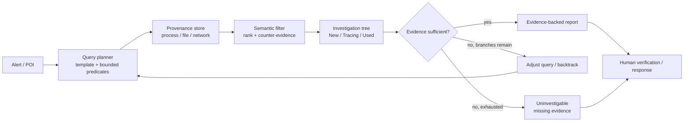
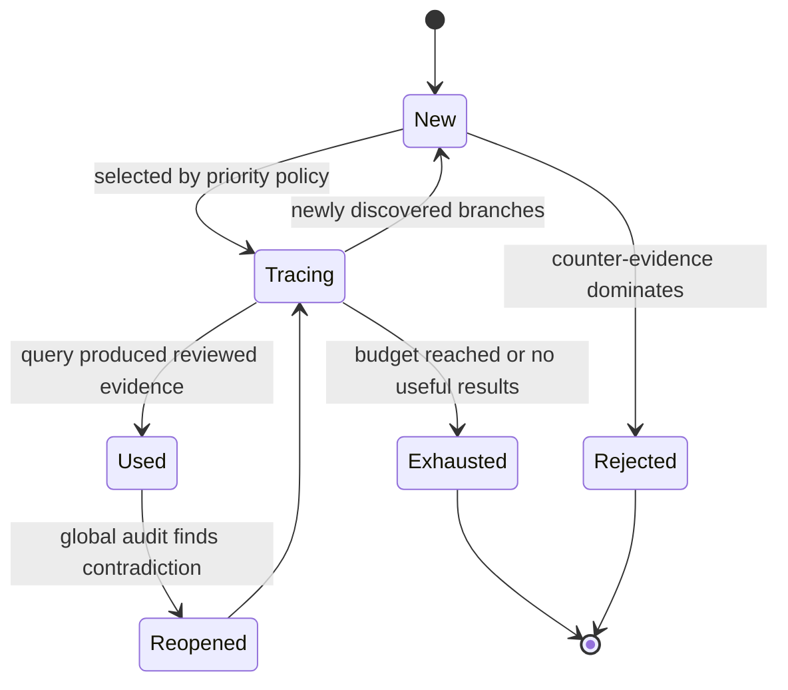
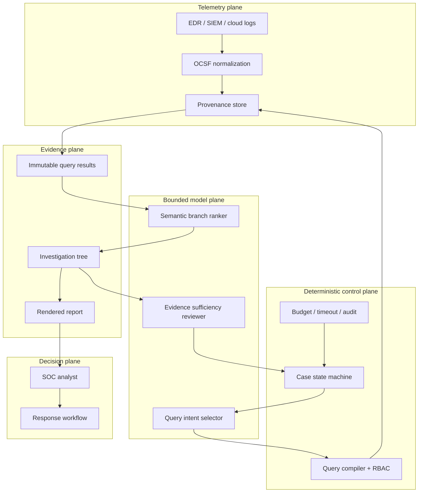

## 来源说明

本文基于 2026-07-13 的每日深度技术研究发布流程写成。当天最强的新材料不是又一个“多 Agent 安全平台”，而是一套在真实 SOC 中运行的调查控制环：SherAgent 从告警的 Point of Interest 出发，在 provenance 数据上反复执行受约束查询、语义过滤、分支选择和回溯，专门处理生产环境里同时存在的两类问题——日志缺失造成的因果链断裂，以及宽查询造成的依赖爆炸。

核心来源如下：

- Zhenyuan Li、Zhengkai Wang、Ling Jiang 等：[SherAgent: Scaling Attack Investigation in the Wild via LLM-Empowered Iterative Query-Filter Backtracking](https://arxiv.org/abs/2607.09176), arXiv:2607.09176v1，提交于 2026-07-10。作者与一家服务数十亿用户的大型互联网企业 SOC 合作，研究超过 10,000 个高严重度告警，并报告系统已在生产中处理 53,849 个真实告警。
- arXiv HTML：[SherAgent 全文](https://arxiv.org/html/2607.09176v1)。本文据此核对了 query generation、branch filtering、investigation tree、re-query、终止条件、实验集选择、基线、错误归因和用户研究。
- Fang 等：[Back-Propagating System Dependency Impact for Attack Investigation](https://www.usenix.org/system/files/sec22-fang.pdf)，USENIX Security 2022。DepImpact 用判别式 dependency weight、反向影响传播和正向因果分析裁剪攻击依赖图，是 SherAgent 对比的传统 provenance investigation 基线之一。
- Open Cybersecurity Schema Framework：[OCSF 官方 schema 仓库](https://github.com/ocsf/ocsf-schema)。OCSF 为安全事件提供跨产品的标准化类别、事件类、对象和属性；SherAgent 的生产日志基础设施使用 OCSF 规范组织进程、文件和网络活动。
- 本站 2026-06-15：[Agent 编排在网络安全里的正确位置](/articles/2026-06-15-agent-orchestration-cybersecurity-workflows/)。那篇文章讨论 SOC、白盒扫描、检测工程和修复验证的通用编排原则；本文只讨论告警调查中的 provenance query-filter-backtracking。

事实边界：SherAgent 的系统机制、样本、指标和作者报告结果来自论文。本文没有访问其私有生产数据，也没有复现系统。本文提出的 `InvestigationCase` 数据模型、权限划分、状态机、质量门、SOP 和一周验证计划是我的工程建议，不是论文作者声明的通用生产标准。全文只讨论组织自有或明确授权环境中的防御调查，不提供针对第三方目标的攻击流程。

站内重复检查：本站已有安全 Agent 通用编排、白盒扫描验证漏斗、Agent 安全审计门和代码 Agent 证据包。本文的差异点是一个更窄的运行时问题：如何让 Agent 在不完整、嘈杂的 provenance telemetry 上推进调查，并且让“证据不足，无法定位入口”成为合法结果，而不是生成一个听起来合理的故事。

稳定 slug：`2026-07-13-provenance-investigation-query-filter-backtracking`。

## 先给结论

SOC 调查 Agent 的核心产品不应该是聊天窗口，而应该是一棵可回放的调查树。

Agent 可以帮助分析命令行、文件路径、URL 和威胁情报，也可以根据当前证据调整查询范围；但它不应该自由生成任意 SQL、一次吞下所有相邻日志，再直接输出“攻击入口”。生产系统需要把模型夹在两个确定性边界之间：前面是可审计的查询模板和数据权限，后面是结构约束、证据充分性规则和人工复核。



SherAgent 最值得复用的不是某个 prompt，而是 `query -> filter -> update tree -> audit -> re-query/backtrack` 这个闭环。它把 LLM 用在传统系统薄弱的语义判断上，同时用模板、状态和终止规则限制 LLM 的自由度。

我的工程判断是：第一版安全调查 Agent 只应该自动生成“证据包 + 建议结论”，不应该自动隔离主机、封禁账号、删除文件或关闭高危告警。它的首要质量指标也不是自报成功率，而是经分析员复核的入口定位正确率、错误结论率、不可调查识别率、证据压缩比和跨运行一致性。

## 技术问题：因果链断裂与依赖爆炸同时存在

provenance-based investigation 通常把系统活动表示成图：进程、文件、网络端点等是节点，创建、执行、读取、连接等活动是边。分析员从触发告警的 POI 向后追踪，寻找初始入口和中间步骤。

理想图里，这是一条连续反向路径。生产环境不是理想图。

| 生产问题 | 典型原因 | 直接后果 | 错误补救 |
| --- | --- | --- | --- |
| relationship missing | 采集丢失、日志合并、反取证 | 两个真实相关实体没有边 | 认定链条已到终点 |
| entity missing | 虚拟设备、外部设备、保留期 | 中间进程或文件完全不存在 | 在全库做无限宽搜索 |
| attribute missing | 字段裁剪、规范化损失 | 缺 CmdLine、路径或 URL | 让模型凭常识补全 |
| dependency explosion | hub process、共享文件、宽时间窗 | 返回数百至数万无关节点 | 把所有结果塞给 LLM |
| semantic ambiguity | 正常运维与恶意行为结构相似 | 路径连通但意图判断错误 | 把“异常”等同于“恶意” |

SherAgent 论文的经验研究指出，真实调查失败的主因包括 telemetry 缺失、查询噪声、无效查询调整和错误结果判断。论文从生产数据中选出的 125 个 broken-chain case 里，系统针对 relationship、entity 和 attribute missing 报告的恢复成功率分别为 93.9%、78.3% 和 88.9%。这说明断链不是一个统一异常，三类缺失需要不同查询恢复策略。

另一端是依赖爆炸。查询过窄会漏掉断链两侧的证据；查询过宽又会让模型在噪声里迷路。论文的对比中，SherAgent 平均分析约 136 个节点，最终调查树保留 14 个；传统对比系统可能分析数百到上万个节点。这不是“越少越好”的证明，而是表明调查系统必须分别度量检索负载和最终证据集规模。

真正的技术问题因此不是“LLM 能不能读日志”，而是：系统如何在每一轮都选择足够宽、但仍可解释的查询范围；如何保留替代分支；如何区分真实因果边与只由语义推断得到的潜在相关；以及何时承认现有 telemetry 不足以形成结论。

## 机制拆解一：让模型填查询参数，不让模型发明数据权限

SherAgent 用预定义 SQL 模板限制 query generation。模型负责根据当前 alert 或 branch 判断查询方向、实体、动作和匹配条件，模板负责限制允许访问的表、字段、谓词形状和返回规模。

这个边界很重要。完全固定的图遍历依赖连续边，遇到断链就停止；完全自由的 text-to-SQL 又可能扩大权限、产生昂贵查询、读取不必要字段，甚至让不可信日志内容影响查询结构。

我会把查询接口设计成受限对象，而不是 SQL 字符串：

```ts
type InvestigationQuery = {
  caseId: string;
  templateId:
    | "process-parent"
    | "process-children"
    | "file-origin"
    | "file-activity"
    | "network-origin";
  entity: {
    type: "process" | "file" | "network_endpoint";
    normalizedValue: string;
  };
  timeWindow: { from: string; to: string };
  relaxationLevel: 0 | 1 | 2;
  maxRows: number;
  reason: string;
  parentEvidenceIds: string[];
};
```

执行器再把它编译成参数化查询。Agent 无权选择数据库、租户、任意列、任意 join 或无限时间范围。`reason` 和 `parentEvidenceIds` 让每次扩查询都能回答“基于什么证据、为什么需要更宽范围”。

论文给出的 adjustment 策略也值得产品化。例如 file source 查询无结果时，可以逐级移除扩展名或匹配父路径。关键是“逐级”：每次放宽都有明确级别、预算和回退点，而不是一句“请尝试别的搜索”。

```yaml
query_policy:
  file-origin:
    level_0: exact_path
    level_1: normalized_name_without_extension
    level_2: parent_path_and_time_window
    max_rows: [50, 100, 200]
    max_attempts: 3
    forbidden_fields: [raw_secret, credential_value, unrelated_user_content]
```

论文把这种做法称为用 existence-based query 跨过严格连接缺失。我的补充边界是：跨过断链不等于修复因果关系。检索到的事件只能先形成 `potential_correlation`，不能直接伪装成观测到的因果边。

## 机制拆解二：语义过滤要同时输出支持与反证

传统 graph traversal 擅长连接，未必理解意图。相同的 file read，在数据外传场景里要追读取者，在解压场景里要追文件来源；相同的 PowerShell 父子关系可能是入侵链，也可能是正常开发工具行为。

SherAgent 为日志补充 CmdLine、完整路径、drive type 等语义字段，再让模型从候选事件中选择最可能推进调查的分支。论文报告其关键节点 Top-1 命中率为 95.4%，而对比的 DepImpact 为 14.2%。这个结果来自作者选定的生产评测集，不能直接外推到其他日志质量、威胁类型和基础模型，但它支持一个工程判断：语义判断应放在结构查询之后，承担排序和剪枝，而不是取代数据检索。

我会要求 filter 输出结构化判据：

```json
{
  "candidate_event_id": "evt-1832",
  "decision": "keep",
  "relation": "potential_correlation",
  "support": [
    "command line references the queried script path",
    "event time is within 12 seconds of the POI"
  ],
  "counter_evidence": [
    "parent process is a commonly used IDE",
    "no direct process-to-file execution edge was collected"
  ],
  "next_query_template": "file-origin",
  "confidence": 0.72
}
```

这里的 `counter_evidence` 不是装饰。没有反证字段，模型很容易把“能讲通”当成“已证实”。`relation` 也必须区分：

- `observed_causal`：原始 telemetry 存在直接事件。
- `derived_causal`：由多条确定性规则推导，可重放。
- `potential_correlation`：基于时间、路径或命令语义提出，待验证。
- `rejected`：曾被考虑但已被证据否定。

最终报告可以包含 potential correlation，但不能把它渲染成已观测事实。

## 机制拆解三：调查树是工作状态，不是对话历史

SherAgent 用 tree-structured state 记录调查进度，边带有 source、sink、relationship、timestamp 和补充语义，分支带 `New`、`Tracing`、`Used` 状态。它的作用有三个：避免模型忘记长程调查状态；保留未探索替代分支；在当前路径失败时回溯，而不是从头重聊。

一个最小状态机可以这样实现：



对应的数据对象应独立于 prompt：

```ts
type InvestigationCase = {
  id: string;
  alertRef: string;
  tenantId: string;
  poi: EvidenceRef;
  status:
    | "investigating"
    | "entry-identified"
    | "uninvestigable"
    | "needs-human-review";
  nodes: Array<{
    id: string;
    entityType: "process" | "file" | "network_endpoint";
    evidenceRefs: string[];
  }>;
  edges: Array<{
    source: string;
    sink: string;
    relation: "observed_causal" | "derived_causal" | "potential_correlation";
    evidenceRefs: string[];
  }>;
  branches: Array<{
    id: string;
    state: "new" | "tracing" | "used" | "exhausted" | "rejected";
    queryAttempts: string[];
    support: string[];
    counterEvidence: string[];
  }>;
  budgets: { maxQueries: number; maxRows: number; maxCostUsd: number };
  reviewer?: { id: string; verdict: string; timestamp: string };
};
```

调查树和聊天摘要的差异在于可寻址。系统可以检查某个结论引用了哪些 event ids、哪些 branch 尚未探索、某条 potential correlation 是何时加入的，也可以在新 telemetry 到达后只重开受影响分支。

## 机制拆解四：显式失败比幻觉成功更有价值

安全调查存在真实不可解情况：日志已经过期，关键设备没有采集，URL 被统一代理域名遮蔽，或者查询噪声持续压过有效事件。此时正确输出是 `uninvestigable`，并列出缺失证据，不是选一个最像入口的节点。

SherAgent 把最终判断与若干攻击类型的完成条件对照；若未定位入口但仍有未探索分支，就继续调查；若分支耗尽，就记录失败。论文专门选取了 25 个 legacy SOC baseline 会“幻觉成功”的不可调查案例，SherAgent 三次运行中分别仍在 3、2、2 个案例上产生幻觉成功，而 baseline 是 22、18、17 个。这说明结构化流程显著降低了问题，却没有消灭它。

生产 release gate 应至少包含：

| 终态 | 必要条件 | 允许的自动动作 |
| --- | --- | --- |
| `entry-identified` | 入口实体、证据链、替代解释、完整性检查均存在 | 生成报告、开调查工单 |
| `uninvestigable` | 分支耗尽或关键 telemetry 明确缺失 | 请求补采、延长保留、转人工 |
| `needs-human-review` | 高影响但证据冲突；预算耗尽但仍有候选 | 分派资深分析员 |
| `benign-explained` | 正常行为解释有原始证据且无未决高风险分支 | 建议关闭，仍需策略许可 |

任何终态都不应仅由一段自然语言结论触发主机隔离、账户禁用或数据删除。动作层需要独立策略和人工批准。

## 工程判断：把 LLM 放在查询编译器与证据验证器之间

我会把生产架构拆成五层：



工具栈不必照抄论文。第一版可用现有 SIEM/ClickHouse/数据湖承载查询，用 OCSF 或内部等价 schema 统一 process/file/network 事件，用关系表或轻量图视图构造 investigation tree，用工作流引擎持久化状态。是否使用图数据库取决于已有基础设施；核心是边类型和证据引用，而不是某个数据库品牌。

模型也不需要同时承担三种角色。query intent selector、branch ranker 和 sufficiency reviewer 可以使用不同 prompt，最好对高风险结论使用独立模型或确定性规则复核，降低同一偏差贯穿全流程的概率。

## 一个可落地的执行 SOP

### 1. Intake 与权限固定

输入是 `alert_id`、tenant、POI、时间窗、允许的数据域和调查预算。系统在任务开始时签发只读、case-scoped 凭据。Agent 不获得响应权限，也不能切换 tenant。

### 2. 建立初始证据

把告警原文、关联 event id、检测规则版本、资产和身份上下文写入 immutable case bundle。缺少这些字段时先补数据，不启动开放式推理。

### 3. 选择受约束查询

Agent 只能从模板表中选择 query intent 并填参数。编译器负责参数化、RBAC、行数限制、时间窗和敏感字段裁剪。每次查询记录 input hash、template version、执行耗时和结果引用。

### 4. 语义排序与树更新

模型对候选事件给出支持、反证、关系类型和 next step。结构验证器拒绝没有证据引用的边；potential correlation 保持显式标签。每轮只推进少量高优先分支，其余保留为 `new`。

### 5. 全局审计与回溯

每轮后检查时间顺序、实体一致性、分支冲突、未探索替代路径和预算。当前分支无进展时，先执行预定义 relaxation，再标记 exhausted 并回到其他分支。

### 6. 形成终态

满足入口类型的证据规则时生成候选报告；所有分支耗尽时输出 uninvestigable；存在高影响冲突时转 needs-human-review。报告必须从 investigation tree 和原始证据渲染，不能让模型重写 verdict。

### 7. 人工审核与反馈

分析员确认入口、纠正关系、补充缺失事件并选择响应动作。反馈进入评测集和查询策略 backlog，不直接无审核地写回 prompt 或规则库。

## 数据与权限边界

| 组件 | 可读 | 可写 | 明确禁止 |
| --- | --- | --- | --- |
| query planner | 脱敏 case state、模板目录 | query object | 原始数据库、任意 SQL |
| query executor | query object、case credential | immutable result set | 跨 tenant、超预算查询 |
| branch ranker | 当前结果、调查树、允许的威胁知识 | branch scores、evidence refs | 修改原始日志 |
| state machine | 结构化结果、策略 | branch state、case status | 自行执行响应动作 |
| report renderer | 已验证 tree、终态 | signed report | 改写证据等级 |
| SOC analyst | 完整 case bundle | verdict、response approval | 绕过审计修改历史证据 |

日志内容本身是不可信输入。CmdLine、文件名和 URL 可能包含提示注入式文本，因此它们应作为 quoted data 进入模型，和系统指令、查询模板、威胁知识分角色隔离。模型输出也必须经过 schema validation，不能直接拼进 SQL 或响应 API。

## 可验证指标

第一版至少同时测正确性、证据质量、效率、稳定性和安全边界：

| 维度 | 指标 | 建议定义 |
| --- | --- | --- |
| 调查正确性 | verified entry-point precision | 人工确认入口 / Agent 报告入口 |
| 覆盖 | investigable-case success rate | 正确定位入口 / 确认可调查案例 |
| 诚实失败 | uninvestigable precision/recall | 正确识别证据不足的能力 |
| 错误风险 | incorrect conclusion rate | 错入口、错因果或无效结论占比 |
| 断链恢复 | recovery success by missing type | 分 relationship/entity/attribute 统计 |
| 剪枝质量 | critical-node Top-k hit rate | 真实关键节点在排序前 k 的比例 |
| 证据压缩 | analyzed-to-retained ratio | 查询节点数 / 最终证据节点数 |
| 稳定性 | repeated-run agreement | 同一 case 多次运行终态一致率 |
| 效率 | p50/p95 time、queries、rows、cost | 每案端到端资源消耗 |
| 人效 | analyst minutes saved | 与盲测人工基线对比 |
| 权限 | policy violation count | 跨租户、超字段、超预算尝试 |

最需要警惕的是自报 success rate。SherAgent 论文指出，legacy tool 的自报成功率与人工审计后的 64.7% 存在明显差距。生产 dashboard 必须以抽检或完整标注后的 verified metric 为准，并同时展示抽检率。

## 成本估算与容量规划

论文报告 SherAgent 每次调查 API 成本低于 0.10 美元、耗时少于 4 分钟，10 名安全从业者的用户研究中有一半报告每案节省超过 10 分钟。这里不能直接换算成本收益：模型价格、日志查询成本、case 难度、人工工资和抽检比例都会改变结果。

内部试验可用下面的简单模型：

```text
weekly_value = verified_cases * analyst_minutes_saved * loaded_hourly_cost / 60
weekly_cost  = model_cost + log_query_cost + storage_cost + review_minutes * loaded_hourly_cost / 60
roi          = (weekly_value - weekly_cost) / weekly_cost
```

容量规划还要单独看 p95，而不只看均值。少数 dependency explosion case 可能消耗大部分查询和 token。每案的 max queries、max rows、max model cost 和 wall-clock timeout 必须是硬预算，超限后转人工而不是无限续跑。

## 失败模式与回滚方案

| 失败模式 | 影响 | 检测 | 回滚/兜底 |
| --- | --- | --- | --- |
| 日志已过保留期 | 无法定位初始入口 | 查询时间早于可用边界 | 输出 uninvestigable，补采或延长保留 |
| 宽查询引入噪声 | 走错分支、成本上升 | rows/query、分支熵异常 | 回滚到上一个 tree checkpoint，缩窄谓词 |
| relaxation 过度 | 假相关变多 | potential correlation 占比升高 | 降级关系等级，强制人工复核 |
| 模型被日志文本诱导 | 查询偏航或越权建议 | schema/策略拒绝、canary fields | 丢弃该轮输出，切换安全模板 |
| 同一模型重复自证 | 幻觉被写成结论 | 缺独立 evidence refs | 独立 reviewer 或确定性完成条件复核 |
| 终止条件过早 | 漏掉真实入口 | 仍有高优先 `new` branch | reopen case，恢复 checkpoint |
| 终止条件过晚 | 查询风暴 | budget/timeout 告警 | 标记 needs-human-review |
| 报告夸大关系 | 推测被当成事实 | report/tree relation mismatch | 只从结构化 tree 渲染报告 |
| 自动响应误触发 | 业务中断 | response policy audit | 第一版禁用自动响应，保留人工批准 |

回滚单位应是调查状态，不是数据库。每次 tree 更新写 append-only event，并周期性做 checkpoint。错误分支可以标记 rejected 或回滚到前一 checkpoint，但原始 query result 和模型判断不能被覆盖删除，便于事故复盘和策略改进。

## 一周内如何实现与验证

我不会第一周就接生产自动响应。目标是用历史 case 做 shadow evaluation，证明调查树和受约束查询比现有聊天式助手更可复核。

**第 1 天：定义 schema 与样本。** 选 30-50 个已结案告警，覆盖完整链、relationship missing、entity missing、attribute missing 和不可调查案例。冻结 ground truth 与分析员说明。

**第 2 天：实现五类 query template。** 只覆盖 process parent/child、file origin/activity、network origin；加入 tenant、时间窗、max rows 和字段 allowlist。

**第 3 天：实现 investigation tree。** 支持 branch state、三类关系、evidence ref、checkpoint 和预算。先用规则驱动，不接模型也能回放。

**第 4 天：接入两个模型角色。** 一个只做 query intent/参数选择，一个只做 branch ranking/support/counter-evidence。所有输出走 JSON Schema 校验。

**第 5 天：实现终止门和报告 renderer。** 把 entry-identified、uninvestigable、needs-human-review 做成显式状态；报告完全从 tree 渲染。

**第 6 天：三次重复盲测。** 对每个历史 case 运行三次，记录正确率、错误率、不可调查识别、Top-k、节点规模、时间、成本和一致率；与当前人工流程或 naive LLM baseline 对比。

**第 7 天：分析员复核。** 不展示系统名称，随机化报告顺序，让分析员评估入口、证据完整性、清晰度和节省时间。只有错误结论率和权限违规均在预设阈值内，才进入只读 shadow deployment。

一个务实的首周放行门可以是：零跨租户/越权查询；所有结论都有原始 evidence refs；不可调查案例不被强行判成功；相较 naive baseline，错误结论率下降且分析员复核时间有统计上稳定的改善。不要用“模型写得更专业”作为放行理由。

## 适用场景

这套方法适合已经有较成熟 EDR/SIEM、结构化 process/file/network telemetry 和安全分析员团队的组织，用于高严重度告警的只读调查、证据整理和入口定位。它尤其适合断链常见、单案需要反复改查询、人工主要耗时在日志筛选的环境。

它不适合日志基础薄弱、事件身份无法稳定关联、没有 ground truth 与复核人员的团队。也不适合把自由文本日志直接交给高权限 Agent，再期待模型自动完成处置。调查自动化不能弥补完全没有采集的数据；61.8% 的论文错误案例被归因为日志保留期到期，这个结果本身就在提醒：数据工程可能比换更强模型更重要。

## 局限分析

第一，论文虽报告处理 53,849 个生产告警，但持续成功率来自每天 10 个案例、共 980 个案例的 spot-check，约占全部告警 2%。这比实验室数据强得多，但不是全量 ground truth。

第二，细粒度对比集是有选择的。125 个案例来自存在日志缺失的子集，另有 25 个专门挑选的 baseline 幻觉成功案例，以及 50 个日志完整的随机案例。作者也明确承认该选择对 SOC baseline 不利。92.2% 实验成功率应在这个采样边界内理解。

第三，生产环境、schema、查询模板、五类攻击完成条件和安全团队经验高度相关。把模板迁移到另一家公司并不会自动复现结果，尤其是 SaaS、容器、身份云和 OT 环境的实体关系不同。

第四，作者使用 DeepSeek-V3.1、64k max completion tokens 和 0.6 temperature，并展示框架跨多个模型仍有优势；但 88.5% 三次运行一致率说明非确定性仍然存在。高风险结论不能只运行一次。

第五，potential correlation 能跨过断链，也会引入伪因果风险。时间接近、路径相似和命令行引用只是关联信号，必须在报告中保留关系等级和证据缺口。

第六，本文没有复现论文，也没有评估隐私、数据驻留、模型供应链和敏感日志出域问题。真实部署需要本地模型或合规推理端点、字段脱敏、访问审计和数据保留策略。

## 自审

- **事实可靠性**：关键数字、机制和限制均核对论文全文；OCSF 与 DepImpact 使用官方仓库或论文原文。
- **来源完整性**：区分论文作者报告、既有方法和本文工程建议；未把生产 spot-check 写成全量人工验证。
- **原创性**：没有复述 abstract，而是把 query-filter-backtracking 转译为受限查询对象、调查树状态机、关系等级、权限矩阵、质量门和一周实验。
- **站内差异**：不重复安全 Agent 通用编排或白盒扫描验证，聚焦 provenance investigation 的断链、依赖爆炸和诚实失败。
- **工程价值**：包含架构图、状态机、数据模型、配置示例、SOP、指标、成本模型、失败回滚和上线计划。
- **安全边界**：只讨论授权环境中的防御调查；第一版明确只读，不提供第三方攻击步骤，不允许 Agent 自动执行高风险响应。
- **标题与边界**：标题表达系统设计判断，不夸大论文结果；文章明确写出采样偏差、2% 抽检、模型非确定性和不可推广部分。
- **发布判断**：材料足够支撑一篇安全工程支柱补充，达到“真实问题、原始来源、机制拆解、工程判断、失败分析、可验证方案”的发布门槛。
