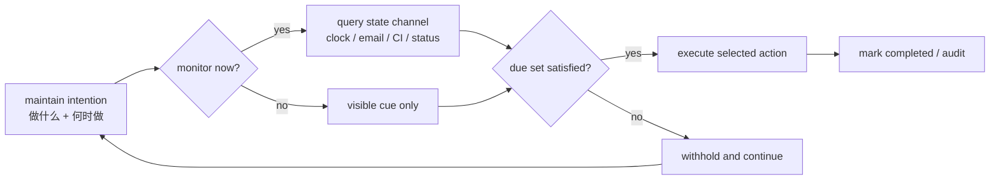
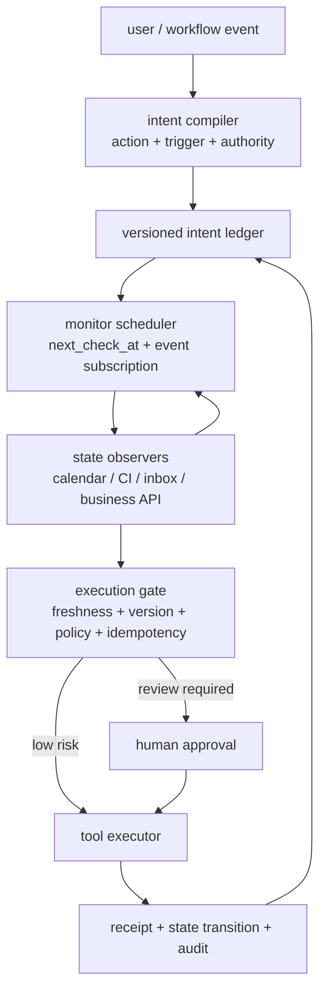
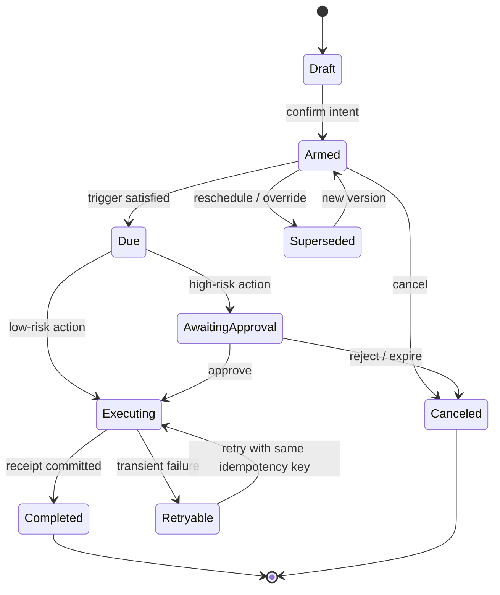

## 来源说明

本文基于 2026-07-17 的每日深度技术研究发布流程写成。今天的主材料不是一个新的向量检索算法，而是一个此前在 Agent memory 讨论中经常被忽略的问题：Agent 即使记得用户说过什么，也未必会在正确的未来时刻采取行动。

原始来源如下：

- Genglin Liu、Saadia Gabriel：[PM-Bench: Evaluating Prospective Memory in LLM Agents](https://arxiv.org/abs/2607.12385)，arXiv:2607.12385v1，2026-07-14 提交，COLM 2026 conference paper。论文给出任务定义、场景生成、八种 Agent 配置、八个模型的实验与细粒度错误分类。
- 论文 HTML 全文：[arXiv HTML](https://arxiv.org/html/2607.12385)。本文重点核对了 benchmark construction、query-then-act 协议、实验表、monitoring slices、cross-day/update-sensitive 结果和附录 prompt。
- 官方仓库：[genglinliu/PMBench](https://github.com/genglinliu/PMBench)。仓库公开确定性 v9 场景、场景验证器、回放评分器、八种配置、64 条轨迹和人类评测前端。
- Peter G. Rendell、Fergus I. M. Craik：[Virtual Week and Actual Week: Age-related Differences in Prospective Memory](https://onlinelibrary.wiley.com/doi/10.1002/acp.770)。PM-Bench 借鉴的 Virtual Week 最初是认知心理学中的桌游式实验范式：被试在持续日常活动中维持并执行延迟意图。
- Mark A. McDaniel、Gilles O. Einstein：[Strategic and Automatic Processes in Prospective Memory Retrieval: A Multiprocess Framework](https://onlinelibrary.wiley.com/doi/abs/10.1002/acp.775)。该框架区分持续监控环境与由显著线索触发意图恢复两类路径，为本文的“监控预算”判断提供理论背景。

我还做了两项离线复核。第一，在仓库 commit `e1093c470c8981daf522d4ef047a7c3a71e077d7` 上执行 `python3 sim/pm_bench.py validate --scenario data/synthetic_week_v9.json`，得到 `Scenario OK`。第二，运行仓库的聚合报告脚本，成功从公开轨迹重建 8 models × 8 setups 的 64-run 报告，核心 Set-F1、TP/FP/FN 和 query 数字与论文表格一致。

复核也发现一个小的发布卫生问题：README 写的是 `runs/March_ALL_results_v9/`，实际目录是 `runs/all_results_v9/`。这不影响数据与评分器，但说明当前仓库只有两个 commit、没有 release tag；复现实验时应固定 commit，不应只跟随 `main`。

事实边界：benchmark 规模、模型与配置、作者报告结果、公开轨迹和代码布局来自论文与仓库；本文提出的生产架构、数据模型、策略规则、上线门槛与 ROI 算法是我的工程建议，不是原作者报告的产品方案。

稳定 slug：`2026-07-17-prospective-memory-trigger-monitoring-execution`。

## 先给结论

长期记忆系统通常回答一个回顾性问题：过去发生了什么，用户偏好是什么，哪段经验与当前任务相似。前瞻记忆回答的却是另一个问题：某个意图形成以后，系统能否在未来的时间、事件或外部状态满足时执行它，并在条件尚未满足、已取消或已被替代时保持克制。

这不是“加一张 TODO 表”就能解决的问题。生产级前瞻记忆至少需要四个可分离部件：

1. **意图账本**：保存待办内容、触发条件、作用域、依赖、版本和终止状态。
2. **触发器编译器**：把自然语言中的“下午四点”“收到回复后”“构建通过且审批完成”编译成可评估谓词。
3. **选择性监控器**：决定何时读取时钟、邮件、日历、CI、工单或业务状态，而不是固定频率轮询一切。
4. **执行门**：在真正调用工具前检查最新版本、条件证据、权限、幂等键和人工审批要求。

PM-Bench 最重要的结果不是“最佳方法只有 65.1% macro Set-F1”，而是它揭示了一个控制问题：多监控、多提醒、多 Agent 并不自动等于更可靠。作者报告的三 Agent hierarchical union-query 配置总共发出 1661 次 state query，远多于单 Agent 配置，却只有 45.2% macro Set-F1；自动 30 分钟 heartbeat 虽把 non-clock monitoring-required hit 提到 15.8%，同时产生 489 个 false positives，整体 macro Set-F1 只有 57.8%。

我的工程判断是：前瞻记忆应该被实现为一个事件驱动、版本化、可撤销的控制平面，而不是更多 prompt、更多轮询或更长上下文。它的主要指标也不应是 retrieval recall，而应同时衡量按时执行、误触发、旧意图执行、监控成本和人工干预。

## 技术问题：回忆正确，为什么仍然做错

考虑四个看似简单的要求：

- “今天 16:00 提醒我提交周报。”
- “客户回复合同条款后，生成差异摘要。”
- “CI 通过且安全审批完成后，准备发布说明，但不要部署。”
- “如果采购额度恢复到阈值以上，再创建订单；我说取消就停止。”

普通 RAG 或对话记忆可以在未来检索到这些句子，但系统仍可能失败：

| 失败位置 | 表现 | 普通检索为什么不够 |
| --- | --- | --- |
| 意图形成 | 把讨论或假设误写成待执行任务 | 相似度不能证明用户授权 |
| 条件保持 | 长任务中丢失待办或只保留动作、丢掉触发条件 | 检索到动作不等于恢复完整意图 |
| 环境监控 | 没有查看邮件、CI 或余额，永远不知道条件已满足 | 线索不在当前上下文中 |
| 更新合并 | 仍按旧时间或旧条件执行已改期任务 | 新旧记忆都“相关” |
| 动作抑制 | 为避免遗漏而每一步都执行候选动作 | 高 recall 可以靠 spam 获得 |
| 完成终止 | 已完成或取消后再次执行 | 检索系统通常缺少消费语义 |

因此，前瞻记忆包含两个不同的记忆负担。回顾性部分要保留“做什么”；前瞻性部分要在未来识别“现在是不是该做”。后者还必须与注意力分配、环境观测、权限控制和工具副作用结合。

这也是 PM-Bench 与多数 multi-session memory benchmark 的差异。它不只问 Agent 能否回答过去信息，而是在连续的七天、80 个 step 中，让 Agent 继续一个 ongoing activity，同时判断延迟意图是否到期。一个动作在错误 step 执行，即使动作内容完全正确，也应被记为 false alarm 或 update violation。

## 机制拆解一：PM-Bench 实际隔离了什么

### 1. 用 query-then-act 分开“看见条件”和“决定执行”

每个 step 中，Agent 先看到叙事场景、三个必须选择的 ongoing activity，以及混有诱饵的匿名动作 handle。它可以先查询 `clock`、`email`、`calendar`、`shipment_status`、`appointment_portal` 等 11 个隐藏状态通道，再提交最终动作集合。

这个接口把一次前瞻执行拆成三个可观察决策：



如果 Agent 没查必要通道，这是 monitoring failure；查到了证据却没行动，是 decision failure；没有证据就行动，是 control failure。普通端到端成功率无法把这三类问题分开。

### 2. 用更新、跨日和诱饵测试意图控制

公开 v9 场景包含 83 个 task definition，其中 81 个可评分动作；57 个 event-based、26 个 time-based、15 个 channel-triggered、7 个 cross-day task，并注入 11 次 cancel、override 或 reschedule update，以及 74 个 lure。

这些设计分别测试：

- 时间触发：是否在目标时间或允许窗口行动；
- 事件触发：可见事件出现时是否恢复意图；
- 隐藏状态触发：是否主动查询正确通道；
- 跨日保持：是否跨越多轮干扰仍保留承诺；
- 更新敏感：是否让新版本取代旧版本；
- 抑制能力：是否拒绝尚未到期、已经取消或只是诱饵的动作。

仓库的场景验证器会检查 task ID、触发线索是否存在、时间是否可达、更新是否指向有效任务，以及同日更新不能把任务静默移到已过去时间。这个做法值得生产评测借鉴：先证明测试环境可解，再把失败归因给 Agent；否则 benchmark 自己的脏数据会被误判为模型遗忘。

### 3. Set-F1 在这里是控制指标，不只是分类指标

PM-Bench 将每一步的 ground-truth due set 与 Agent 选中的 action set 比较，跨完整轨迹累积 TP、FP、FN 并计算 Set-F1。这个选择很关键：

- 只看 precision，最安全的策略是什么都不做；
- 只看 recall，最投机的策略是每一步把所有动作都执行一遍；
- Set-F1 同时惩罚漏做和乱做。

评分器还区分 on-time hit、late execution、miss、false alarm、wrong-content、update violation、dependency violation、exact-set-match 和 query count。对有副作用的企业 Agent，这些诊断指标往往比一个总分更有价值。

## 机制拆解二：为什么 heartbeat 和多 Agent 会失效

论文比较了单 Agent baseline、最多保留五条的 TODO ledger、可选 heartbeat、固定 30/60 分钟 heartbeat，以及由 event/status/update 三个 watcher 加 coordinator 组成的 hierarchical multi-agent。

聚合结果如下：

| 配置 | Macro Set-F1 | Precision | False positives | State queries | 工程含义 |
| --- | ---: | ---: | ---: | ---: | --- |
| Single baseline | 60.0% | 66.7% | 199 | 106 | 基线仍会漏做与误做 |
| TODO ledger | 62.8% | 73.2% | 134 | 118 | 显式账本更克制，但跨日 hit 反而较低 |
| Optional heartbeat | 65.1% | 70.6% | 178 | 130 | 总体最佳，但不是所有模型最佳 |
| Auto heartbeat 60m | 56.6% | 62.0% | 422 | 172 | 固定提醒引入大量噪声 |
| Auto heartbeat 30m | 57.8% | 63.2% | 489 | 203 | 监控更强，误触发也更多 |
| Hierarchical union-query | 45.2% | 51.2% | 273 | 1661 | 获取更多证据不等于做出正确动作 |

这里有三个不能从“模型更聪明”中直接推导出的工程结论。

第一，heartbeat 只是重新分配注意力，不提供真相。固定频率提醒会让模型更频繁地想起“可能有事”，却不会自动判断该查哪个通道、何时停止检查、哪条证据足以执行。提醒过密时，模型可能把“被提醒检查”误解成“现在应该行动”。

第二，多 Agent 增加的是候选信号，不是最终控制。三个 watcher 的 union-query 能扩大观察面，但 coordinator 仍要完成去重、冲突解析、版本检查和动作抑制。如果聚合规则只做多数票或并集，多个弱判断会把 false positive 放大。

第三，scaffold 与 backbone 强耦合。作者报告 GPT-5.4 在 optional heartbeat 下最好，GPT-5.3-Codex 和 Mistral Large 在单 Agent baseline 下最好，Llama 3.3 70B 与 Mistral Small 在 ledger 下最好，Qwen3-32B 则在固定 30 分钟 heartbeat 下最好。不能把某个 prompt scaffold 在单一模型上的收益写成通用架构规律。

## 工程判断：把前瞻记忆做成五段控制平面

我会把生产系统拆成下面五个模块，而不是让一个 LLM 同时负责理解意图、记住条件、轮询环境、决定执行和承担副作用。



### 1. Intent compiler：把语言编译成条件，不直接执行

编译器输出必须区分动作、触发器和权限。例如“测试通过后整理发布说明”不代表“测试通过后部署”。LLM 可以抽取候选结构，但高风险动作需要规则或人工确认。

```yaml
intent_id: int_01K2...
subject: release_notes
action:
  tool: docs.create_draft
  args_ref: artifact://release/context-v4
trigger:
  all:
    - event: ci.completed
      where: { branch: main, conclusion: success }
    - state: security_review.status
      equals: approved
authority:
  actor: user_184
  scope: repo_77
  max_effect: draft_only
review: none
```

### 2. Versioned ledger：待办是状态机，不是便签

前瞻意图至少需要以下状态：



更新不应该原地覆盖。`reschedule`、`override`、`cancel` 都生成新事件，旧版本保留审计但失去可执行性。执行门只接受 `current_version`，从数据结构上阻止 stale intention 被再次唤醒。

建议的最小记录如下：

```ts
type ProspectiveIntent = {
  id: string;
  version: number;
  state: "draft" | "armed" | "due" | "awaiting_approval" |
    "executing" | "completed" | "canceled" | "superseded";
  action: { tool: string; argsRef: string; effect: "read" | "draft" | "write" | "external" };
  trigger: TriggerExpression;
  dependencies: string[];
  scope: { tenantId: string; projectId?: string; actorId: string };
  authorityRef: string;
  nextCheckAt?: string;
  expiresAt?: string;
  idempotencyKey: string;
  sourceRefs: string[];
  lastEvidenceRefs: string[];
};
```

### 3. Monitor scheduler：优先订阅事件，轮询要有预算

固定 heartbeat 可以作为兜底，但不应成为主要机制。我会按以下优先级选择观测方式：

1. 有可靠 webhook/event stream：订阅事件，并在事件到达时只评估相关 intent；
2. 有明确时间条件：调度到 `next_check_at`，而不是每 30 分钟问模型；
3. 只有可查询状态：根据 deadline、状态变化概率、查询成本和动作风险计算动态轮询间隔；
4. 通道不可用：降级为人工待办，不允许模型猜测状态已满足。

一个简单的初始策略可以完全不使用模型：

```text
if event_subscription_available(trigger):
    subscribe(trigger.channel, intent.id)
elif trigger.has_exact_time:
    schedule(trigger.time - safety_margin)
else:
    interval = clamp(
        base_interval * query_cost / max(change_probability, 0.05),
        min_interval_by_risk,
        time_to_deadline / 3
    )
```

LLM 可以建议该查哪个通道，但 scheduler 应用 allowlist、租户隔离、速率上限和预算。这样，monitoring cost 是可治理的系统资源，而不是 prompt 中一句“主动一点”。

### 4. Execution gate：触发命中不等于获得授权

执行前必须重读最新 intent 和最新证据，并检查：

- 当前版本仍是 active，未取消、未替代、未过期；
- 所有依赖都已完成，证据在 freshness window 内；
- tool 与参数在原始 authority scope 内；
- 外部写入、付款、部署、删除等动作是否需要人工审批；
- `idempotency_key` 是否已成功消费；
- 动作预览与用户确认的 effect 是否一致。

这一步应该尽量确定性。LLM 可以生成草稿、摘要或参数候选，但不能自行扩大 `draft_only` 到 `publish`，也不能把“准备部署说明”解释成“执行部署”。

### 5. Receipt：完成是一次可证明的状态转换

工具返回成功不代表业务动作真正完成。系统应保存 receipt：工具调用 ID、输入 hash、外部对象 ID、响应状态、执行时间、intent version 和证据引用。只有 receipt 通过业务验证后，intent 才从 `executing` 进入 `completed`。

失败重试必须复用相同 idempotency key；不确定是否成功时进入 `needs_reconciliation`，而不是再次调用。前瞻记忆最危险的错误往往不是忘记提醒，而是重复付款、重复发信、重复建单或在取消后继续执行。

## 我会如何实现和验证

我不会先建设一个通用“主动 Agent 平台”，而会选一个低风险、可回放的场景，例如“CI 成功且 review 批准后生成发布说明草稿”。一周内完成以下实验。

### 第 1—2 天：建立事件账本和 oracle replay

目录可以保持很小：

```text
prospective-memory/
  schemas/intent.schema.json
  policies/execution-gates.yaml
  fixtures/release-workflow-events.jsonl
  src/compile-intent.ts
  src/reduce-intent.ts
  src/schedule-monitor.ts
  src/evaluate-trigger.ts
  src/execute-gated.ts
  tests/replay.test.ts
```

先人工制作 30 条事件轨迹，覆盖准时触发、无关事件、改期、取消、审批撤回、重复 webhook、通道超时和执行响应丢失。用确定性 reducer 计算每一步的 oracle due set，确保环境本身可解。

### 第 3—4 天：比较三种策略

- Baseline：把全部历史与当前状态交给单 Agent；
- Ledger：结构化 intent ledger + 模型判断 due set；
- Controlled：版本化 ledger + 事件订阅/动态调度 + 确定性执行门。

所有策略使用相同模型、工具 stub 和事件轨迹。每个轨迹至少重复三次，记录动作集合、state query、token、延迟、人工复核与最终 receipt。

### 第 5 天：故障注入

注入以下故障：事件乱序、重复投递、旧版本延迟到达、一个 observer 超时、模型输出无效 JSON、人工审批过期、工具成功但响应丢失。验证系统能进入可解释的 fallback 状态，而不是静默漏做或重复执行。

### 第 6—7 天：shadow mode 与上线门

在真实 CI/review 流上只生成“本来会执行什么”的 decision record，不调用写工具。人工审阅一周 shadow decisions，通过门槛后才开放 `draft_only` 权限；发布和部署仍保留人工动作。

上线顺序应是：提醒 → 生成草稿 → 内部写入 → 可撤销外部动作 → 高影响动作。每一级都重新设定误触发上限，不因前一级成功就自动获得更高权限。

## 可验证指标

建议至少同时维护质量、控制、成本三组指标：

| 指标 | 定义 | 为什么要测 |
| --- | --- | --- |
| On-time execution rate | 在允许窗口内完成的 due intent / 全部 due intent | 核心召回能力 |
| Action Set-F1 | 跨 step 累积 TP/FP/FN | 同时惩罚漏做和乱做 |
| False activation rate | 未到期、已取消或错误作用域动作 / 全部执行尝试 | 有副作用场景的关键安全指标 |
| Update violation rate | 执行旧版本 intent 的次数 / 有更新 intent | 验证版本语义 |
| Duplicate effect rate | 同一 intent 产生多次外部副作用的比例 | 验证幂等与 reconciliation |
| Dependency violation rate | 前置条件未满足却执行的比例 | 验证 workflow 正确性 |
| Monitoring recall | 需要主动观测的线索被及时发现的比例 | 区分没看见与看见没做 |
| Queries per successful intent | state query / 按时完成数 | 衡量监控效率 |
| Irrelevant query rate | 与 active trigger 无关的查询比例 | 发现 heartbeat 噪声 |
| Decision latency p95 | 条件满足到动作决策的延迟 | 验证时效性 |
| Human review precision | 送审事件中确实需要人判断的比例 | 避免审批疲劳 |
| Cost per accepted effect | 模型、查询、工具与人工成本 / 有效结果 | 与业务 ROI 对齐 |

对写操作，我会把 `false activation rate` 和 `duplicate effect rate` 设成 release blocker，而不是只看综合 F1。一个提醒 Agent 可以容忍少量误报；付款、部署、安全处置或客户外发 Agent 不可以用更高 recall 换取同样的误触发。

## 适用场景

前瞻记忆适合有明确未来条件、持续状态和可验证完成回执的任务：

- 研发：CI/review/依赖发布满足后生成变更材料，失败后回到负责人；
- 安全：扫描任务完成后聚合证据，超过风险门槛时创建人工复核项；
- 运营：活动状态、库存或审批变化后生成草稿与检查清单；
- 研究：数据或实验任务结束后触发分析，但结论发布前必须人工审核；
- 团队知识库：决策到期、政策替代或文档 owner 变化时发起复核，而不是自动改写权威内容。

它不适合把含糊愿望自动升级成行动。例如“以后多关注这个方向”“有机会提醒我”“帮我留意市场”缺少可执行边界。系统应该先澄清触发条件、频率、停止条件和允许动作，或者只保存为低优先级观察项。

## 失败模式与回滚

### 失败模式

1. **把相关性当触发条件**：检索到相似内容就执行，没有证明当前事件满足谓词。
2. **固定 heartbeat 造成注意力污染**：提醒越密，模型越倾向于过度行动，查询成本也持续增长。
3. **旧版本复活**：改期或取消只修改一份摘要，向量索引、缓存或子 Agent 仍持有旧意图。
4. **多 Agent 信号放大**：多个 watcher 共享同一偏差，投票把相关候选误当成到期动作。
5. **完成状态不可靠**：工具响应丢失后重试，产生重复副作用。
6. **授权漂移**：用户允许“准备草稿”，Agent 在触发后直接发布或部署。
7. **监控通道泄漏**：为了主动性扩大邮箱、日历、代码库或业务数据访问范围。
8. **审批疲劳**：低质量触发持续送审，人类开始机械批准。

### 回滚方案

- 关闭 executor，只保留 shadow decision 和提醒；
- 冻结新 intent 写入，但继续允许 cancel 与人工完成；
- 按 policy version 回放最近事件，找出从哪个规则版本开始出现误触发；
- 将所有 `executing` 且无可信 receipt 的记录转入 reconciliation queue；
- 撤销尚可撤销的外部动作，并保留原始审计事件；
- 对已取消/替代 intent 重建派生索引和缓存，验证旧版本不可再召回为 active；
- 恢复时先开放 read/draft effect，再逐级开放写权限。

## 与站内已有文章的差异

站内已经讨论过 memory benchmark hygiene、memory lifecycle evaluation、adaptive retrieval、memory control plane 和 Agent policy-as-code。本文不再回答“怎样把过去的信息检索得更准”，也不重复“记忆需要版本、来源和删除”。

本文新增的轴是 **prospective execution**：把一条未来意图从形成、维持、观测、触发、抑制、更新到一次性消费串成完整状态机，并用误触发与监控预算评价主动行为。它补上了长期记忆从“回答依据”进入“未来动作依据”后的控制缺口。

## 局限分析

PM-Bench 是有价值的诊断工具，但不能直接代表生产可靠性。

第一，当前公开 benchmark 只有一个确定性 synthetic week。81 个可评分任务与 80 个 step 足以暴露机制问题，却不足以估计模型跨领域、跨语言和长时间运行的稳定性。仓库提供 seeded generation，但论文主结果仍来自同一个 v9 week。

第二，实验每个 model × setup 只有一条主轨迹。64 runs 指八个模型与八种配置的笛卡尔积，不是每个条件 64 次随机重复。因此，表中差异可能同时受到单次采样与模型服务版本影响，不应从 2—3 个百分点得出强排序结论。

第三，匿名 action handle、结构化 JSON 和离散 step 让评分可重复，但比真实企业环境干净。现实系统有乱序事件、权限变化、重复 webhook、不确定完成状态、跨系统时钟、人工延迟和不可逆副作用。

第四，paper 中的 hierarchical majority/unanimous 是对同一 union-query 轨迹的 replay ablation，不是两次独立的多 Agent 运行。它适合隔离聚合规则，不适合计算完整在线成本差异。

第五，论文列出的 best overall method 是跨八模型聚合后的 optional-heartbeat setup；摘要中“a GPT-5.4 agent reaches only 65.1% F1”容易被误读。细表显示 GPT-5.4 + optional heartbeat 的单次 Set-F1 是 79.1%，65.1% 是该 setup 的 macro aggregate。本文采用表格口径，并把这一表述差异列为阅读边界。

第六，我只运行了场景验证和公开轨迹报告重建，没有消耗外部模型 API 复跑 64 条推理轨迹。当前复核能证明代码、数据和聚合数字相互一致，不能独立证明上游模型响应可再次完全复现。

## 自审

- **事实可靠性**：提交日期、场景规模、八模型八配置、实验数字和错误分类来自论文；代码布局、轨迹数量与命令来自官方仓库；场景验证和报告重建已在固定 commit 上实际执行。
- **来源完整性**：包含论文、HTML 全文、官方代码与数据、原始认知科学范式和多过程理论来源。
- **非复述检查**：文章主线是生产前瞻记忆的 trigger/monitor/gate/receipt 控制平面，不是翻译论文摘要或 README。
- **标题党检查**：标题只表达“记住待办不足以可靠执行”这一由 benchmark 直接支持的边界，没有宣称解决前瞻记忆。
- **薄内容检查**：包含机制图、状态机、数据模型、配置示例、伪代码、工程方案、一周实验、指标、失败与回滚。
- **事实与建议分离**：作者报告结果使用“论文/作者报告”；架构阈值和上线策略明确标为我的工程建议。
- **站内重复检查**：既有文章侧重回顾性检索、生命周期、控制面或安全边界；本文聚焦未来意图的正确时机执行与动作抑制。
- **安全边界**：只讨论授权工作流、权限最小化、人工审核和可回滚执行，不包含针对第三方目标的攻击流程。
- **可执行价值**：给出最小目录、intent schema、状态机、监控策略、执行门、shadow rollout 和 release-blocking 指标。

最终判断：材料足以支撑原创支柱文章。最值得保留的结论不是某个模型或 scaffold 的排名，而是前瞻记忆必须同时优化“记得做”和“不要乱做”，并把主动监控视为有成本、有权限、有停止条件的系统行为。
