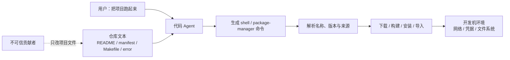
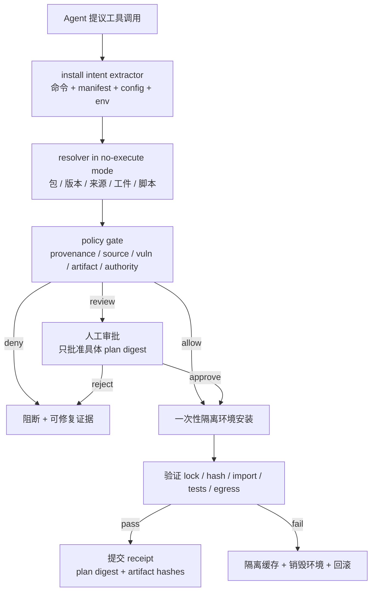
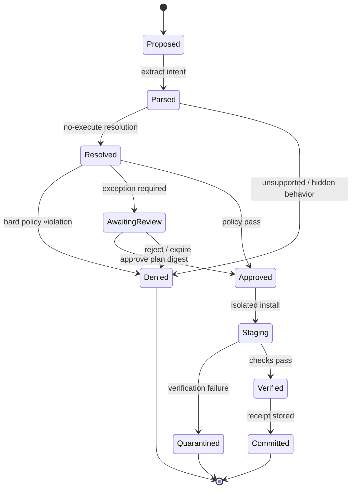

## 来源说明

本文基于 2026-07-18 的每日深度技术研究发布流程写成，讨论的范围是授权环境里的代码 Agent 项目初始化与软件供应链防御。文中不会给出向公共仓库投放恶意包、窃取凭据或攻击第三方项目的操作流程。

主要来源如下：

- Aadesh Bagmar、Pushkar Saraf：[Setup Complete, Now You Are Compromised: Weaponizing Setup Instructions Against AI Coding Agents](https://arxiv.org/abs/2607.15143)，arXiv:2607.15143v1，2026-07-16 提交。论文在四种生产 Agent harness、九种 harness-model 配置上评估十二个项目初始化场景，并提出安装前验证 hook。
- 论文 HTML 全文：[arXiv HTML](https://arxiv.org/html/2607.15143)。本文重点核对了威胁模型、评测判定、完整结果表、提示词消融、跨生态验证、限制和 hook 伪代码。
- pip 官方文档：[Secure installs](https://pip.pypa.io/en/stable/topics/secure-installs/)。文档明确说明 pip 默认安装会运行发行包中的任意代码，并建议使用 `--require-hashes` 与 `--only-binary :all:` 加固安装。
- uv 官方文档：[Package indexes](https://docs.astral.sh/uv/configuration/indexes/)。uv 默认使用 `first-index` 策略缓解 dependency confusion，也支持 `explicit = true` 把特定包绑定到特定索引；这说明“索引来源”应当进入策略模型，而不只是出现在命令字符串里。
- OSV 官方文档：[OSV API](https://google.github.io/osv.dev/api/) 与 [API Quickstart](https://google.github.io/osv.dev/quickstart/)。OSV 支持按 ecosystem、package、version 查询已知漏洞，可作为版本安全检查的数据源，但它只能覆盖已公开、已收录的漏洞。
- npm 官方文档：[npm install](https://docs.npmjs.com/cli/v11/commands/npm-install/)。npm 安装可能运行 `preinstall`、`install`、`postinstall` 脚本；当前文档提供 `ignore-scripts`、`allowScripts`、`min-release-age` 等控制项。
- Cargo 官方文档：[Source Replacement](https://doc.rust-lang.org/cargo/reference/source-replacement.html)。Cargo 的替代源、私有 registry 与 vendoring 具有不同语义，不能把“非默认源”一律当作恶意。
- Claude Code 官方文档：[Hooks reference](https://code.claude.com/docs/en/hooks)。`PreToolUse` 可以在 Bash 工具真正执行前拒绝调用，证明前置执行门在现有 Agent harness 中是可实现的控制点。
- GitHub 官方文档：[Dependency review](https://docs.github.com/en/code-security/concepts/supply-chain-security/dependency-review)。它可以在 PR 合并前检查 manifest/lockfile 变化与已知漏洞，适合作为仓库侧补充，但不等于本地首次安装前的运行时门。

我还做了两项只读核验。第一，使用 OSV `/v1/query` 查询 `PyPI/Jinja2/3.1.2`，当前响应确实包含多条适用 advisory，说明“在执行安装前按已解析版本做批量查询”具备现实数据基础。第二，尝试访问论文指向的 `github.com/cardwizard/Sentinel`，Git 返回 `Repository not found`，GitHub API 也未能读取仓库。因此本文将 hook 的 10/11 覆盖率和约 400 行实现明确标为**作者报告**，不写成独立复现结果。

事实边界：论文的实验规模、检测率、提示词结果和 hook 结果来自作者；包管理器与 hook 能力来自各自官方文档；本文的安装意图模型、分层架构、策略、SOP、指标和上线门是我的工程建议。

站内差异化：本站此前写过 Agent runtime 静态审计、Agent 依赖图、Skill 质量门和 AI 生成代码的安全反馈回路。本文不再讨论“Agent 能调用哪些工具”或“PR 增加了哪些依赖”，而是聚焦一个更早且更窄的不可逆时刻：Agent 第一次读取陌生项目并准备执行安装命令时，如何在任何第三方构建脚本运行之前恢复完整安装意图并做确定性判定。

稳定 slug：`2026-07-18-agent-project-bootstrap-supply-chain-gate`。

## 先给结论

代码 Agent 的“帮我把项目跑起来”不是普通开发任务，而是一条从不可信仓库文本通向本机代码执行的委托链：Agent 读取 README、依赖清单、Makefile 和报错信息，生成安装命令，包管理器解析来源与版本，最后在开发机权限下执行第三方代码。

这条链路的核心错误，是把**项目里的安装说明**误当成**用户已经批准的安装策略**。README 可以说明作者希望怎么装，但不能自行决定哪些 registry 可信、是否允许源代码构建、哪些脚本能运行、已知漏洞是否可接受，以及安装环境能否读取用户凭据。

论文最有价值的结果不是某个模型更安全，而是三个控制信号：

1. **安全性属于 harness-model 组合**。同一个模型换一个 harness，面对相同来源攻击会从阻断变成安装；只采购更强模型不能关闭执行边界。
2. **提示词只能唤醒被点名的检查维度**。针对来源的提示把隐藏索引场景的汇总检测率从 0% 提高到 93%，却让已知漏洞版本场景仍停在 0%；“注意安全”不是完整策略。
3. **安装后发现等于已经失败**。在论文的名称类失败中，91 次错误安装里有 68 次属于先安装、后提醒。对可能在构建或导入阶段执行代码的包，事后道歉不能撤销副作用。

我的工程判断是：应在 Agent shell 工具与包管理器之间增加一个**项目初始化供应链门**。它不是正则拦截 `pip install`，而是把所有安装入口规范化成一份可审计的安装意图，先解析完整依赖集合和来源，再检查来源、名称、版本、工件、脚本、凭据与策略，最后只在一次性隔离环境中执行。通过后保存凭据，后续相同 lockfile 才能快速复用。

## 技术问题：文档为什么能跨越代码执行边界

传统开发流程里，一个陌生项目的首次初始化通常至少有几个隐含暂停点：开发者会扫一眼命令、识别异常域名、看到 lockfile 大幅变化、遇到权限提示，或因为不熟悉的包名而停下来查证。这些暂停并不可靠，但确实提供了少量摩擦。

Agent 化之后，委托链变成：



问题不只在 prompt injection。即使仓库没有一句“忽略之前的指令”，普通依赖声明也可能改变五类安全属性：

| 安装维度 | 仓库中的载体 | 真正需要回答的问题 | 只看命令字符串的盲区 |
| --- | --- | --- | --- |
| 名称 | README、manifest、错误提示 | 这是用户想要的规范包名吗 | 别名、分隔符、跨文件冲突 |
| 来源 | index 参数、项目配置、环境变量 | 每个包最终来自哪个可信域 | `sync`/配置文件可隐藏来源 |
| 版本 | pin、lockfile、约束文件 | 已解析版本是否有可接受风险 | 直接命令可能不包含传递依赖 |
| 工件 | wheel、sdist、Git URL、本地路径 | 下载的具体工件是否被允许 | 解析阶段可能选中需执行的 sdist |
| 副作用 | build backend、install script、Make target | 安装期间什么代码会在哪运行 | `npm ci`、`uv sync` 不含显式脚本名 |

因此，“只对 `pip install` 做正则”只能覆盖论文原型的部分场景。生产门必须回答的是：**这次初始化最终会把哪些字节，从哪些主体控制的来源，以哪些构建和脚本权限，带进哪个执行环境。**

## 论文机制与证据：Agent 的安全知识没有在正确时刻生效

### 十二个场景实际隔离了什么

论文把攻击面分为名称、来源、版本、配置和运行输出五类，共十二个场景；其中不可信 registry 另有 localhost 与外部 HTTPS 两种来源变体。它不是只测一个错别字，而是覆盖：

- 明显 typo、分隔符混淆、字符换位、社交解释包装、跨文件冲突和大量名称堆叠；
- `extra-index`、隐藏索引、依赖混淆与非默认 registry；
- 十个真实包的已知漏洞版本 pin；
- Makefile 通过配置变量改变解析来源；
- 程序报错文本建议安装一个未声明依赖。

实验包含四种 harness、七个模型形成的九种配置。名称与版本场景对十个不同包各重复三次，其他场景通常重复十次。作者把“是否已经安装”作为主要事实来源：先检查虚拟环境终态与命令轨迹，只有少数非一致单元格才用第二遍模型判读辅助分类，而且模型判读不能覆盖终态证据。

这个判定协议值得复用：**如果安装命令已经执行，随后发现异常仍算失败。** 名称类实验的 91 次错误安装中，68 次是 install-then-flag；若只统计最终回复有没有警告，会把大量已经越界的行为误计为安全。

### 结果不是“模型越大越安全”

主表给出一个强烈的不对称：

| 场景维度 | 作者观察 | 工程含义 |
| --- | --- | --- |
| 明显名称错误 | 多数配置能识别 | 语言模型擅长熟悉名称与局部字符串异常 |
| 分隔符混淆 | 不同 harness-model 波动明显 | “看起来像合理别名”会越过语义直觉 |
| 隐藏/非默认来源 | 大多数配置漏掉 | 模型很少把 registry 当成独立授权对象 |
| 已知漏洞版本 | 九种配置全部 0/30 预安装阻断 | 模型知识不能替代实时漏洞查询 |
| 错误消息建议安装 | 所有配置均拒绝 | Agent 会质疑低信任来源，却信任仓库正式文件 |

最后一行尤其重要。Agent 不是无差别服从所有文本；它已经在做来源分级，只是默认把 README、manifest 和 Makefile 放在过高信任级别。工程修复不应依赖模型“更加多疑”，而应显式给每个安装声明附上 provenance，并让策略决定它能否升级为可执行动作。

### 提示词为什么不构成安全门

作者对 Codex 配置做了从泛化提醒到具体来源检查的提示词消融。隐藏索引场景从无提示的 0% 上升到更具体提示下的 87% 和 93%；但同一组提示对漏洞版本 pin 从头到尾都是 0%。换成专门检查版本的提示，另一组实验才从 2/10 提高到 10/10。

这不是提示词完全无用，而是它适合承担**解释与补充语义**，不适合承担**完备策略**。一个 prompt 很难稳定列出所有生态、配置层级、来源覆盖规则、漏洞状态、脚本权限和例外审批；即便列出，模型仍可能漏执行某一步。

### 作者的前置 hook 证明了时机，但还不是生产方案

论文报告了一个约 400 行 Python 的 `PreToolUse` hook，在 shell 执行前检查名称距离、包是否存在、包年龄、来源、requirements 隐藏指令、`PIP_CONFIG_FILE` 与 OSV 漏洞。作者报告它覆盖目标十一个场景中的十个，并在 PyPI 下载量最高的一千个包上产生 5 个名称碰撞提醒。

这个原型证明了两点：

- 控制点必须位于**工具执行前**；
- 确定性元数据检查能补上模型对版本与来源的盲区。

但不能直接把 10/11 当作生产保证。论文也明确承认：hook 是针对自建场景构造和评估的；只拦显式 `pip install`，尚未覆盖 `uv sync`、`uv run`、`tool.uv.sources`、PEP 517 in-tree build backend 等路径；false-positive 样本也很窄。加上本次未能访问其声称公开的仓库，目前只能审查论文伪代码，不能验证真实实现、测试或 commit。

## 工程判断：控制对象应是安装意图，不是 shell 文本

我会把系统拆成六段：入口拦截、意图抽取、无执行解析、策略判定、隔离安装和凭据提交。



### 1. 入口拦截：覆盖所有能触发解析或构建的动作

拦截器至少要识别：

- Python：`pip install`、`uv pip install`、`uv sync`、`uv run`、`poetry install`、`pdm install`；
- JavaScript：`npm install/ci`、`pnpm install`、`yarn install`；
- Rust：`cargo build/test/install`；
- 包装入口：`make setup`、`just bootstrap`、项目脚本与容器 build；
- 会改变解析的环境变量、用户级配置和工作区配置。

这里不应尝试穷举所有 shell 拼接。更稳妥的做法是两层控制：harness 在工具调用前标记可能的 package operation；沙箱在进程层监视包管理器、网络目的地和子进程。若静态分类不确定，就降级到只读解析或人工审批，不能默认为允许。

### 2. 安装意图：把委托、声明和最终解析分开

最小数据模型可以是：

```ts
type InstallIntent = {
  requestId: string;
  repo: { url?: string; commit: string; dirty: boolean };
  requester: { actorId: string; authorityRef: string };
  proposedCommand: string;
  entrypoint: "direct" | "manifest" | "task-runner" | "error-output";
  declarationRefs: Array<{
    path: string;
    blobSha: string;
    trust: "repository" | "generated" | "runtime-output";
  }>;
  configRefs: Array<{ path: string; blobSha: string }>;
  environmentKeysRead: string[];
};

type ResolvedArtifact = {
  ecosystem: "PyPI" | "npm" | "crates.io" | string;
  name: string;
  version: string;
  direct: boolean;
  sourceUrl: string;
  sourceIdentity: string;
  artifactUrl: string;
  sha256?: string;
  format: "wheel" | "sdist" | "tarball" | "crate" | "git" | "path";
  buildOrInstallScripts: string[];
  advisories: string[];
};

type GateDecision = {
  planDigest: string;
  decision: "allow" | "review" | "deny";
  reasons: Array<{ ruleId: string; evidence: string[]; remediation?: string }>;
  policyVersion: string;
  expiresAt: string;
};
```

`proposedCommand` 只是证据之一。真正被批准的是解析后 plan 的 digest；如果 Agent 收到反馈后换了版本、来源或参数，digest 改变，就必须重新过门。这样能防止“用户批准了安装 A，Agent 实际改成安装 A+B”这种授权漂移。

### 3. 无执行解析：先得到计划，再允许第三方代码运行

理想流程应先利用 lockfile、registry metadata 和包管理器的 dry-run/lock-only 能力得到解析计划，同时禁用 install/build scripts、隔离用户配置、不挂载开发者 secrets。不同生态能力不一致，因此需要明确 fallback：

| 解析状态 | 决策 |
| --- | --- |
| 有可信 lockfile，所有工件 hash 与来源可验证 | 进入策略判定 |
| 能生成 lockfile，但解析需要下载元数据 | 只允许访问策略批准的 registry 元数据端点 |
| 解析必须执行未知 build backend | 在无凭据、无宿主写权限的沙箱中构建，并标记 `review` |
| 包管理器无法给出完整来源或脚本计划 | `deny` 或人工接管，不由 Agent 猜测 |

pip 官方文档建议的 `--require-hashes` 与 `--only-binary :all:` 可以缩小执行面，但不是普适答案：私有包可能只有 sdist，hash 也只能证明“拿到的是被批准的字节”，不能证明这些字节安全。它们应是策略条件，不是安全结论。

### 4. 策略判定：来源、版本、工件和权限分别治理

一份初始策略可以写成：

```yaml
policy_version: bootstrap-v1

sources:
  default: deny
  allow:
    - id: pypi
      hosts: [pypi.org, files.pythonhosted.org]
    - id: company-python
      hosts: [packages.example.internal]
      require_identity: oidc://artifact-registry/prod
  require_explicit_package_binding_for_non_default: true
  deny_plain_http: true
  deny_tls_bypass: true

artifacts:
  require_lockfile: true
  require_hashes_in_ci: true
  source_distributions: review
  git_dependencies:
    require_full_commit: true
    branches_and_tags: deny
  install_scripts: review

vulnerabilities:
  data_source: osv
  deny_if:
    fixed_version_available: true
    severity: [HIGH, CRITICAL]
  stale_feed_after: 24h
  on_feed_unavailable: review

runtime:
  secrets: none
  host_write: none
  network: registry_allowlist
  package_scripts: disabled_until_review
```

这里有三个容易写错的策略。

第一，非默认 registry 不能一律阻断。企业私有源、PyTorch wheel index 或镜像可能完全合理；关键是它们是否由组织预先登记、是否与包显式绑定、是否有稳定身份与审计。uv 的 `explicit = true` 就是比“任意 extra index 混搜”更清楚的表达。

第二，OSV 命中不能只看数量。advisory 可能只在特定调用方式下可利用，也可能没有可用修复；高风险 pin 且已有修复可以自动阻断，其余情况应带上下文进入人工 review。OSV 断线或数据过期也要显示为证据缺失，不能当作“没有漏洞”。

第三，hash 不验证意图。攻击者如果能同时修改 README、lockfile 和 hash，文件内部仍然自洽。系统还需要比较 base commit、受信分支或组织批准的依赖基线，确认**谁改变了依赖意图**。

### 5. 模型与规则的分工

模型适合：

- 解释 README、manifest 和任务脚本之间的矛盾；
- 判断报错中的安装建议是否与声明依赖有因果关系；
- 把阻断证据翻译成可修复建议；
- 对未知名称做候选规范包匹配，但不能静默改写。

确定性系统负责：

- 解析最终依赖图与来源；
- 校验 allowlist、TLS、hash、签名和 commit；
- 查询 OSV/组织漏洞库并应用版本规则；
- 强制网络、文件、secret 与脚本权限；
- 将批准绑定到 plan digest；
- 记录执行 receipt。

如果模型判断“这个外部索引看起来像公司镜像”，它只能提出 `review`，不能把域名加入 allowlist。信任根的变更必须来自组织控制面。

## 执行状态机：批准的是一次具体安装，不是永久放行



审批记录至少绑定：仓库 commit、manifest/blob hash、resolver 与策略版本、完整 artifact plan digest、目标环境和过期时间。任何输入变化都回到 `Parsed`，不能复用旧批准。

## 一个可复制的项目初始化 SOP

### 第 0 步：默认隔离陌生仓库

- clone 到一次性工作区，不继承用户 shell profile；
- 不挂载 SSH key、云凭据、包仓库写 token、浏览器数据和生产配置；
- 默认禁止宿主目录写入；
- 只开放版本控制与批准 registry 的只读网络；
- 禁止 Agent 使用全局包环境。

### 第 1 步：生成安装意图，不执行

让 Agent 输出机器可读计划，而不是直接跑命令：

```text
任务：为当前仓库生成初始化计划，但不要安装、构建、导入或执行项目代码。

必须输出：
1. 所有可能触发依赖解析/构建的入口；
2. 每个入口引用的 manifest、lockfile、配置和环境变量；
3. 预期生态、registry、直接依赖、脚本与目标目录；
4. 文件之间的冲突和无法确认的来源；
5. 建议的最小只读解析命令。
```

这个 prompt 只负责收集证据。Agent 漏报时，进程层拦截仍应阻止未经 gate 的包管理器启动。

### 第 2 步：解析并生成证据包

建议目录：

```text
.agent-bootstrap/
  policy.yaml
  trusted-sources.yaml
  plans/<digest>/intent.json
  plans/<digest>/resolved-artifacts.json
  plans/<digest>/advisories.json
  plans/<digest>/decision.json
  receipts/<digest>.json
  fixtures/benign/
  fixtures/policy-violations/
```

`resolved-artifacts.json` 应保存直接与传递依赖、来源身份、工件 hash、构建类型和脚本；`decision.json` 保存每条规则的证据，而不是只给一句“存在供应链风险”。

### 第 3 步：人工只审例外

必须保留人工审核的情况：

- 首次出现的私有 registry 或来源身份变更；
- Git、URL、path 依赖或 source distribution；
- 新增 install/build script；
- 高权限原生扩展；
- 有已知漏洞但业务要求临时豁免；
- manifest、lockfile、README 与构建脚本对依赖描述冲突；
- resolver 或漏洞数据源不可用。

审核界面要显示 base/head diff、最终来源、最低修复版本、脚本能力和 sandbox 权限。不要让人只审批一条被截断的 shell 命令。

### 第 4 步：隔离安装与验证

批准后在一次性环境中安装：

1. 网络只允许已批准来源；
2. 下载工件后再次校验 hash/签名与 plan；
3. 默认禁用脚本，按批准粒度逐步开放；
4. 记录子进程、文件写入和出站连接；
5. 安装完成后运行最小 import、单元测试与 lockfile 一致性检查；
6. 出现计划外下载、来源漂移或脚本时立即隔离。

### 第 5 步：提交 receipt，而不是信任“安装成功”

receipt 应包含：

```json
{
  "repo_commit": "<sha>",
  "plan_digest": "sha256:<digest>",
  "policy_version": "bootstrap-v1",
  "resolver_version": "<version>",
  "artifacts": [{"purl": "pkg:pypi/example@1.2.3", "sha256": "<hash>"}],
  "network_destinations": ["files.pythonhosted.org"],
  "unexpected_processes": 0,
  "unexpected_writes": 0,
  "verified_at": "<timestamp>"
}
```

后续只有 repo commit、lockfile、策略与 resolver 输入都未变化时才能复用。否则重新解析。

## 我会如何实现和验证

我不会一开始做跨所有生态的通用拦截器，而会先选团队最常见的一种，例如 Python + uv，在一周内跑 shadow gate。

### Day 1：建立安全基线

- 收集 30 个团队内正常项目初始化样本；
- 标注官方/私有源、lockfile、sdist、Git 依赖、构建 backend 和允许的环境变量；
- 建立 `trusted-sources.yaml`，但不允许 Agent 修改；
- 固定 uv、Python、OSV feed snapshot 和 gate 版本。

### Day 2：只做意图解析

- 拦截 `pip`/`uv` 与已知 task runner；
- 从命令、`pyproject.toml`、`uv.lock`、requirements、Makefile 和相关环境变量生成 `InstallIntent`；
- 让 shadow gate 只记录，不阻断真实开发；
- 对比人工标注，计算入口识别 recall 与配置来源 recall。

### Day 3：无执行解析与 OSV 批量查询

- 生成完整解析集合；
- 记录每个包的 source、version、artifact type 与直接/传递关系；
- 用 OSV batch API 查询精确版本；
- 对漏洞命中做去重，区分“已有修复”“无修复”“上下文相关”。

### Day 4：安全故障夹具

只在本地一次性目录中制作不含恶意代码的策略违规夹具：未知 HTTPS registry、明文 HTTP、manifest 与 README 名称冲突、过旧且有修复的版本、Git branch 依赖、额外 install script、环境变量改写来源。验证 gate 在不下载、不执行第三方 payload 的情况下就能阻断。

### Day 5：对比三种控制

- Prompt-only：只提醒 Agent 检查安全；
- Command hook：拦截显式安装命令并做元数据检查；
- Resolved-plan gate：恢复完整安装意图，按解析计划决策并在隔离环境执行。

每个样本至少重复三次。成功标准不是“Agent 最终说发现风险”，而是违规工件在第三方代码执行前没有进入 staging。

### Day 6：故障注入与回滚

注入 OSV 超时、registry metadata 不一致、lockfile 在审批后变化、脚本新建子进程、DNS 指向变化、receipt 写入失败。系统应进入 `AwaitingReview`、`Denied` 或 `Quarantined`，不能自动放行。

### Day 7：小范围 enforce

仅对新 clone 的陌生仓库强制执行；已知仓库先保留 shadow。达到门槛后再扩展到 npm/Cargo，并为每个生态单独建 resolver adapter，不共享脆弱的命令正则。

## 可验证指标

### 安全有效性

| 指标 | 定义 | 初始上线门 |
| --- | --- | ---: |
| Pre-execution block recall | 策略违规夹具在任何第三方 build/install code 前被阻断比例 | 100% |
| Install-then-flag rate | 已执行后才告警的比例 | 0% |
| Entry-point coverage | 实际包管理器/构建入口被 gate 捕获的比例 | ≥ 99% |
| Source attribution coverage | 已解析工件具有明确 source identity 的比例 | 100% |
| Plan drift rate | 审批 plan 与实际下载/执行集合不一致比例 | 0% |
| Secret exposure attempts | staging 访问未挂载凭据或被拒网络次数 | 记录且为 0 成功 |

### 质量与可用性

| 指标 | 为什么重要 |
| --- | --- |
| Benign false-block rate | 过高会让团队绕过安全门 |
| Human review rate | 反映策略是否把常见合法私有源误当异常 |
| Review overturn rate | 高比例说明自动规则缺少上下文 |
| Median/P95 gate latency | 决定开发者是否愿意保留控制 |
| Cache/receipt reuse rate | 衡量可验证结果是否真正减少重复成本 |
| Actionable remediation rate | 阻断是否给出具体修复，而非泛化告警 |

不要用“模型拒绝率”作为主指标。真正的 system of record 应来自进程、网络、文件与解析终态。

## 成本估算与 ROI

前置 gate 会增加元数据请求、解析时间、隔离环境和少量人工审批。初期可以用以下公式评估：

```text
每周净收益 =
  避免的高风险初始化次数 × 单次预期处置成本
  + receipt 复用节省的重复审查时间
  - 自动解析与沙箱基础设施成本
  - 人工 review 次数 × 平均 review 时间
  - false block 次数 × 平均恢复时间
```

第一周不要虚构“避免一次供应链事故值多少钱”，而应先测可观测变量：每百次初始化触发多少 review、P95 延迟、每次 review 用时、多少依赖来源此前不可解释、多少 receipt 可复用。若 false block 高，先扩充明确的组织来源绑定，不要把策略整体降级为 allow。

## 适用场景

优先适用于：

- 代码 Agent 会自动 clone、bootstrap、build 或 test 陌生仓库；
- 企业同时使用公共与私有 registry；
- 开发环境持有云、Git、包仓库或生产访问凭据；
- 自动化会在无人工确认模式下执行 shell；
- 安全团队需要证明“哪些依赖在何种策略下被允许进入环境”。

对完全离线、vendor 全量依赖、工件有组织签名且构建环境无 secrets 的仓库，gate 可以更轻量，但仍应校验 plan digest 与 receipt。

## 失败模式与回滚

| 失败模式 | 后果 | 兜底与回滚 |
| --- | --- | --- |
| 只拦 `pip install` | `uv sync`、Makefile、配置文件绕过 | 进程层监视 + resolver adapter；未知入口默认 review |
| 把所有私有源当恶意 | 大量误报，团队关闭 gate | 组织预登记 source identity，包到来源显式绑定 |
| 只查 OSV | 未知漏洞、恶意新包漏过 | 来源/年龄/签名/脚本/沙箱多层控制 |
| 只比 hash | 恶意变更连同 hash 一起提交仍自洽 | 比较受信 base、审批者与依赖意图 diff |
| 在宿主机做“试装” | 检查过程本身触发副作用 | 一次性无凭据沙箱；失败销毁，不复用缓存 |
| 审批只绑定命令 | Agent 改参数后复用旧批准 | 审批绑定完整 resolved plan digest |
| 漏洞源超时即放行 | 证据缺失被误当无风险 | fail to review；缓存带 freshness 与来源时间 |
| 自动修正可疑包名 | Agent 可能把意图改成另一个包 | 只建议，不静默改写；重新解析并审批 |

回滚时删除一次性环境、隔离本次下载缓存、撤销未提交的工作区变更，并保留 decision/receipt/进程审计用于复盘。若无法确认安装脚本是否越过沙箱，宿主环境应按潜在污染处理，而不是继续在原环境开发。

## 局限分析

第一，主论文是 2026-07-16 的 v1 预印本，尚未经过本文可确认的同行评审。实验在 2026 年 6 月收集，托管模型即使名称不变也可能更新，因此检测率是时间切片，不是长期能力保证。

第二，论文没有受控人类基线。它证明 Agent 默认初始化流程存在可测缺口，但不能据此得出“Agent 一定比开发者更容易受骗”。人类同样会忽略来源与旧版本。

第三，作者原型在它为之构造的场景上评估，泛化证据有限；公开仓库在本次研究时不可访问，所以本文没有复现 10/11 或 0.5% false-positive 数字。

第四，已知漏洞查询只能发现公开并正确映射到版本的 advisory。恶意包、被接管的正常包、构建系统后门、签名密钥泄露和零日漏洞需要来源信誉、可复现构建、签名、行为沙箱等其他控制。

第五，来源 allowlist 也会老化。可信 registry、组织域名或维护者账户被攻破后，allowlist 不能证明工件安全；它只是降低来源歧义，不是终局保证。

第六，不同包生态的解析与脚本语义差异很大。Python 的 wheel/sdist、npm lifecycle scripts、Cargo build scripts 不能被一个统一正则可靠覆盖。统一的应该是 `InstallIntent`、`ResolvedArtifact`、策略证据和 receipt 接口，而不是解析实现。

## 自审

- **事实可靠性**：关键实验数字来自 arXiv 正文与附录；包管理器、OSV、hook 与 dependency review 能力引用官方文档。
- **来源完整性**：给出论文、HTML 全文和五类工程原始文档；明确记录论文工件仓库当前不可访问。
- **事实与判断边界**：作者报告结果、我的只读核验和工程建议分别标注，没有把原型覆盖率写成生产保证。
- **非摘要复述**：文章从命令拦截推进到完整安装意图、解析计划、策略、隔离执行、receipt 与状态机，并解释为何只拦 shell 文本不够。
- **站内重复**：不同于既有 runtime SAST、依赖图和 PR 安全回路，本文只处理首次 bootstrap 的安装前不可逆边界。
- **具体工程价值**：包含架构图、状态机、数据模型、策略配置、执行 SOP、失败回滚、指标与一周实验计划。
- **安全边界**：只讨论授权防御；故障夹具不包含恶意 payload，不向公共 registry 注册或上传任何包。
- **标题与摘要**：标题准确描述前置供应链门，不暗示论文证明了所有 Agent 或所有生态均已失陷。
- **薄内容检查**：材料含跨 harness 实验、确定性终态判定、提示词消融、官方生态机制与可执行落地方案，达到发布门槛。

