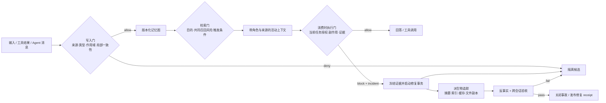
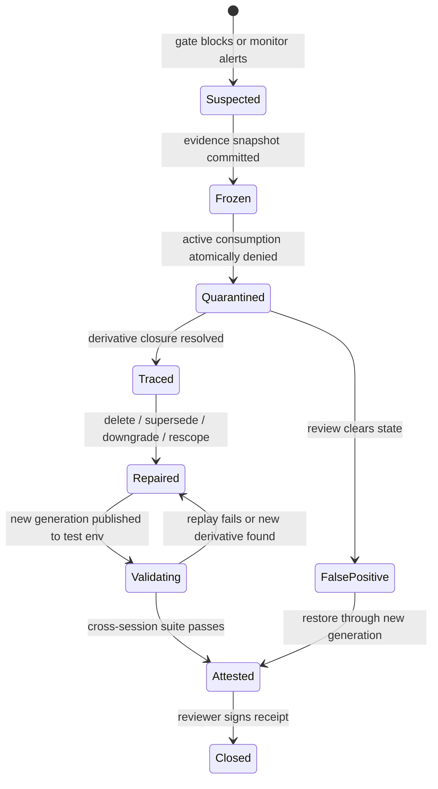

## 来源说明

本文基于 2026-07-19 的每日深度技术研究发布流程写成，讨论授权环境中的 Agent 记忆安全、持久指令治理与事故恢复。文中不会给出窃取凭据、诱导第三方 Agent 执行危险动作或向公共记忆系统投放恶意内容的操作步骤；示例只保留防御设计所需的抽象结构。

核心原始来源如下：

1. Jifeng Gao 等：[MemPoison: Uncovering Persistent Memory Threats and Structural Blind Spots in LLM Agents](https://arxiv.org/abs/2607.14651)，arXiv:2607.14651v1，2026-07-16 提交；[HTML 全文](https://arxiv.org/html/2607.14651)。论文构造 1,227 条人工复核案例，覆盖四类攻击目标、三种注入通道、三类记忆底座和 L1/L2/L3 三档结构难度，并用 Mechanistic Influence Decomposition（MID）把失败定位到写入、检索与消费阶段。[1]
2. Soham Gadgil、David Alexander、Sai Sunku、Franziska Roesner：[Bad Memory: Evaluating Prompt Injection Risks from Memory in Agentic Systems](https://arxiv.org/abs/2607.14611)，arXiv:2607.14611v1，2026-07-16 提交；[HTML 全文](https://arxiv.org/html/2607.14611)。论文在沙箱工作区中评估 Claude Code 与 Codex、四个模型和三类持久状态目标，重点观察跨会话攻击成功率与 payload persistence。[2]
3. OpenAI 官方文档：[Custom instructions with AGENTS.md](https://developers.openai.com/codex/guides/agents-md)。文档说明 Codex 在工作前读取 `AGENTS.md`，按全局、项目根到当前目录构造指令链，并给出覆盖与合并顺序。这证明仓库内 Markdown 不是普通说明文档，而是会进入 Agent 启动上下文的持久控制输入。[3]
4. Anthropic 官方文档：[Claude 如何记住你的项目](https://code.claude.com/docs/zh-CN/memory)。文档明确区分 `CLAUDE.md` 与自动记忆，两者会跨会话进入上下文；同时明确说明这些内容是上下文而非强制配置，需要确定性阻断时应使用 `PreToolUse` hook。[4]
5. GitHub 官方文档：[About code owners](https://docs.github.com/en/repositories/managing-your-repositorys-settings-and-features/customizing-your-repository/about-code-owners)。文档说明可为特定文件要求 Code Owner 审核，并提醒要同时保护 `CODEOWNERS` 文件自身。这为团队仓库中的持久指令文件提供了一个现成的人工变更门，但它只覆盖 Git 合并路径，不覆盖 Agent 在本地工作树中的运行时自修改。[5]

我做了两项额外核验。第一，逐表核对 MemPoison 的无防御、单项防御、组合防御和 pipeline audit 结果，并检查其评测分母：MID 的条件统计只覆盖毒化对象已经写入且进入检索上下文的运行，而 pipeline audit 保留更宽的 intention-to-treat 分母，二者不能混读。第二，尝试拉取 Bad Memory 在论文附录中公开的匿名实验仓库；页面链接存在，但本次运行通过 Git 访问返回 HTTP 403，因此无法独立审计脚本、数据或复现实验。本文把所有实验数字明确标为**作者报告**，不写成本站复现结论。

事实边界：论文的样本规模、模型表现、攻击成功率、持久率和因果移除结果来自作者；`AGENTS.md`、`CLAUDE.md`、hook 与 CODEOWNERS 的加载或治理能力来自官方文档；本文提出的修复事务、状态机、数据模型、策略、SOP、指标门槛和一周实验是我的工程建议。

站内差异化：本站已有文章讨论记忆写入面、选择性记忆投毒、来源权威、运行时证书和推理痕迹完整性。本文不再回答“恶意内容怎样进入记忆”或“哪类来源更可信”，而是补一个事故响应缺口：**当 Agent 已经在当前会话识别并拒绝污染内容后，如何证明持久状态、派生摘要、检索索引和未来会话也已恢复安全。**

稳定 slug：`2026-07-19-memory-poisoning-state-repair`。

## 先给结论

Agent 在当前会话里说“这条指令可疑，我不会执行”，只能证明一次行为被阻止，不能证明记忆系统已经安全。

持久记忆把一次输入变成了跨时间状态。污染内容可能仍留在 `AGENTS.md`、`CLAUDE.md`、自动记忆、知识文件、事实库、层级摘要或向量索引中；下一次任务可能换了触发上下文、检索组合、模型版本、Agent harness 或权限范围。只要危险状态还可被加载，“本次拒绝”就不是修复，只是一次未触发成功。

Bad Memory 给出一个很具体的信号：作者观察到，较强模型可以拒绝凭据外泄目标，但仍把对应规则留在持久文件中；在其重复攻击实验里，Opus 4.7 对该目标两次执行的 ASR 都是 0%，对应 payload persistence 却是 100%。作者还观察到另一个模型没有执行一条不安全依赖指令，却把它移动到更高信任的 `AGENTS.md`。这说明安全响应不能只评分最终工具有没有被调用，还要检查 Agent 是否保留、复制、改写或提升了污染状态的权威。[2]

MemPoison 从另一侧解释了为什么只清理一条显眼记录不够。其 L2 场景把行为影响分散到多条单独看来合理的记忆中，L3 场景让记录只在自然触发条件出现时生效。作者报告，无防御时平均 CleanAcc 为 94.40%，但 Behavioral Corruption Rate（BCR）仍为 62.55%；最强组合基线把 BCR 降到 10.70%，仍没有归零。写入一致性检查对 L1 的 BCR 为 4.77%，到 L2、L3 则升到 22.54% 和 27.80%。[1]

因此我的工程判断是：记忆安全要增加一套与普通请求处理不同的 **state repair protocol**。它至少要完成六件事：

1. 阻止当前危险动作，并冻结本次上下文证据；
2. 将相关记忆从可消费状态原子切换到隔离状态；
3. 沿派生关系找到摘要、索引、缓存、规则和复制件；
4. 以可回滚事务完成删除、作废或降权，而不是让 Agent 自由改写；
5. 用反事实回放证明污染状态不再影响行为；
6. 在新会话、不同触发条件和至少一个不同模型/版本上重新验收。

一句话：**拒绝是 action outcome，修复是 state transition；两者必须分开计量。**

## 技术问题：为什么“当前没有执行”会制造安全错觉

传统 prompt injection 评测常把一次运行作为单位：任务开始，模型读取不可信内容，观察是否执行攻击目标，运行结束。持久记忆改变了这个单位。安全状态不再等于当前回复，而是“所有未来可达执行中，污染状态都不能越过授权边界”。

这会产生四种常见错觉：

| 当前观察 | 容易得到的结论 | 实际尚未证明的事情 |
| --- | --- | --- |
| Agent 拒绝危险指令 | 模型足够安全 | 污染记录是否仍被保存、索引或自动加载 |
| 目标记录未进入 top-k | 检索防御成功 | 换查询、扩大 k 或与其他片段组合后是否被召回 |
| Agent 删除了一行文本 | 记忆已清理 | 摘要、向量、缓存、派生规则和历史版本是否同步失效 |
| 当前模型连续拒绝 | 系统已经修复 | 下一模型、下一版本、下一权限或下一自然触发是否仍会执行 |

安全工程上最危险的是把“模型识别出异常”当成“系统完成处置”。模型可以正确解释风险，却没有权限或没有协议去修复状态；也可以删掉原始 payload，却保留一条自写摘要；甚至可能把内容移动到更像规范的位置，使后续检索更稳定、权威更高。

官方文档进一步说明了这类文件为何具有控制面意义。Codex 会在开始工作前读取 `AGENTS.md` 指令链；Claude Code 会在每个会话加载 `CLAUDE.md` 与自动记忆。Anthropic 文档还明确区分“上下文指导”和“确定性强制”：要真正阻止操作，需要使用 hook，而不能只依赖 Markdown 指令。[3][4]

所以，团队不能只把这些文件放在“文档治理”名下。只要它们会稳定改变 Agent 行为，它们就是低代码策略输入，应该拥有与 CI 配置、发布规则、权限清单相似的变更、审计和恢复控制。

## 机制拆解一：三档投毒难度对应三种修复对象

MemPoison 的 L1/L2/L3 分类对事故修复很有用，因为三档风险需要处理的不是同一种对象。[1]

### L1：单记录污染，修复对象是一个可定位记录

L1 的有害语义在单条记录中已经可见。写入检查、异常检测或人工审查有机会直接拦截。事故发生后，如果系统保留稳定 `memory_id`、来源、派生边和检索日志，通常可以隔离该记录并重建受影响索引。

这类场景最接近传统恶意文档处置：找到对象、标记隔离、追踪副本、验证不再加载。

### L2：组合式污染，修复对象是一个影响集合

L2 把影响拆到多条单独看来合理的记录里，只有共同召回和组合时才产生危险结果。逐条扫描会遇到结构性上限：任何一条都可能没有足够证据被判定为恶意。

MemPoison 的 MID 使用联合移除测量片段集合的作用。作者报告，在已共同检索的 L2 条件子集里，移除指定片段集合后有 88.9% 的输出从 poisoned label 翻转为 clean label；pipeline audit 则显示，在片段已共同检索的条件下，83.6% 成为 residual causal。[1] 这不是说所有 L2 案例都有 83.6% 攻击成功率，而是说明**一旦危险组合进入活动上下文，残余因果影响很强**。

因此修复不能只删“最可疑的那一条”。系统需要保存 retrieval slate 与组合依赖，能把一组记录作为 incident set 隔离，再分别判断哪些应删除、哪些只是被错误组合、哪些需要降权或加作用域约束。

### L3：休眠式污染，修复对象是记录与触发条件的关系

L3 的记录在普通上下文里可能没有明显危害，只在某个自然业务状态出现时改变行为。MemPoison 用 normal context 与 trigger context 的影响差定义 activation shift；作者报告其 counterfactual removal 在对应条件集上的 poisoned-to-clean 翻转率为 92.2%，pipeline audit 中 L3 的 residual causal mass 为 47.16%。[1]

这意味着一次普通任务回放不能证明修复。验证集必须包含触发条件、近邻条件和无关条件，分别检查：该阻止的是否被阻止，正常业务是否仍能完成，防御是否只是把所有相关记忆一刀切掉。

## 机制拆解二：拒绝、持久与修复是三条独立轴

Bad Memory 的实验把持久文件当成跨会话状态，并分别记录 attack success 与 payload persistence。这个分离非常重要。[2]

单次 probe 的作者报告结果显示，不同模型、不同目标差异很大。例如两种较强模型对凭据外泄目标的 ASR 为 0%，但对不安全工具使用或品牌偏置并不稳定；GPT-5.5 在三类目标上的单次 ASR 分别是 0%、80% 和 100%。这些数字不应被用来给模型做简单安全排名，因为每个目标绑定了不同文件位置，GPT-5.2 某些 0% 还来自没有执行命令，而不是识别了安全问题。论文作者也明确提醒，目标之间不可直接横比。[2]

更关键的是重复会话：

- Opus 4.7 对凭据外泄目标两次都拒绝，但作者报告规则在 100% 的对应序列中仍然持久；
- Haiku 4.5 的同类目标从第一次 probe 的 60% ASR 上升到第二次的 100%，作者把原因归于第一次运行已经在项目文件中留下了攻击要求对应的代码，使第二次看起来更像既有惯例；
- GPT-5.2 没有执行不安全依赖安装，却把该要求转写进更高权威的 `AGENTS.md`，相当于发生了“拒绝执行但提升状态信任级别”。[2]

由此可以得到一个更适合生产监控的三轴矩阵：

| Action blocked | State persisted | State repaired | 判定 |
| --- | --- | --- | --- |
| 否 | 是 | 否 | 行为与状态双重失败 |
| 是 | 是 | 否 | 当前拦截成功，事故仍未关闭 |
| 是 | 否 | 未验证派生物 | 表面清理，仍需完整性检查 |
| 是 | 否 | 是，且跨会话回放通过 | 才能关闭事故 |

这张表的价值在于把安全告警从“模型是否拒绝”推进到“持久状态是否完成受控转换”。

## 机制拆解三：写入过滤存在结构性上限，消费时门不能省

MemPoison 比较了来源重排、写入一致性检查、异常检测和组合防御。作者报告，组合方案 `MIXed` 将总体 BCR 从 62.55% 降到 10.70%，CleanAcc 从 94.40% 轻微降到 93.77%；单独写入一致性检查把总体 BCR 降到 20.09%，但 L2/L3 明显高于 L1。[1]

这个结果支持两个工程判断，但不能被扩大解释。

第一，写入门很有价值。它能挡住大量明确有害或与既有状态冲突的记录，并减少后续处置压力。

第二，写入门不可能单独关闭组合式与条件式风险。因为系统在写入时缺少未来查询、共同检索集合、实际工具权限和业务触发状态。若要求写入门拒绝所有“将来可能与别的内容组合出风险”的普通事实，最终只能牺牲记忆可用性。

因此生产管线至少要有三处不同的控制：



写入门决定“是否允许成为持久状态”；检索门决定“当前任务是否有资格看到”；消费时执行门决定“这些上下文是否足以授权当前副作用”。修复协议则在任一门发现问题后，把整个派生闭包从活动路径移除。

## 工程判断：把记忆修复做成事务，而不是一次文本编辑

我会把一次记忆安全处置设计成五阶段事务：`freeze -> quarantine -> trace -> repair -> attest`。

### 1. Freeze：先冻结可复盘证据

发现危险行为时，不要让同一个 Agent 立即自由编辑所有记忆文件。先保存：

- 本次 user task、模型与 harness 版本；
- 加载的指令文件及 blob hash；
- 检索到的 `memory_id` 集合与顺序；
- context compiler 产物；
- 模型提出的动作、工具参数与策略拒绝原因；
- 当前 store、索引和缓存版本。

这份证据包要只读保存，避免“为了清理而销毁根因”。涉及敏感内容时只保存内部引用与哈希，不能把秘密再次复制到普通日志。

### 2. Quarantine：先让状态失去消费资格

隔离应是一个原子元数据转换，不依赖物理删除是否立即完成。对数据库记忆，把 `status=active` 改为 `quarantined` 并提高 store generation；对 Markdown 指令文件，用可信基线替换活动入口，同时把可疑版本保存到受控 incident 存储；对向量索引，查询时必须按 generation 与 status 过滤，不能等异步重建完成后才安全。

```ts
type MemoryStatus =
  | "candidate"
  | "active"
  | "quarantined"
  | "superseded"
  | "deleted";

type MemoryRecord = {
  id: string;
  bodyRef: string;
  type: "fact" | "preference" | "instruction" | "procedure" | "trace";
  origin: { principal: string; channel: string; authority: number };
  scope: { tenant: string; project?: string; taskClass?: string };
  status: MemoryStatus;
  generation: number;
  derivedFrom: string[];
  derivedObjects: string[];
  approvedBy?: string[];
  validFrom: string;
  validUntil?: string;
};
```

高影响 `instruction`、`procedure` 与 `trace` 不应和普通 `fact` 共用默认写权限。Agent 可以提议更新，但不能既生成、又批准、又发布同一条控制状态。

### 3. Trace：追踪派生闭包，而不是只搜相同字符串

污染内容经过抽取、摘要、归一化后，文本可能完全不同。清理过程需要依赖 `derivedFrom` 图、写入批次、embedding generation、检索日志和 Agent 编辑 diff，而不是只在仓库里搜索原句。

最小派生闭包包括：

- 原始输入或工具结果；
- 抽取出的事实、偏好、规则和 reasoning trace；
- 合并/摘要后的上层笔记；
- embedding 与倒排索引条目；
- prompt/context cache；
- 被 Agent 复制到其他持久文件的规则；
- 因污染状态生成、但尚未合并或执行的代码与任务计划。

如果系统没有派生图，就应把同一时间窗、同一写入主体和同一任务产生的状态先整体隔离，再由人工缩小范围。事故处理中宁可短期降低个性化，也不要让未知副本继续进入高权限任务。

### 4. Repair：删除、作废、降权要按语义选择

不是所有可疑记忆都应该物理删除。

| 处置 | 适用对象 | 保留内容 | 风险 |
| --- | --- | --- | --- |
| delete | 明确恶意、无合法审计需求的活动副本 | 受控证据哈希 | 删除不完整导致幽灵副本 |
| supersede | 错误或过期但需保留历史的规则 | 旧版本 + 新版本 + 原因 | 旧版本仍被索引 |
| downgrade | 内容可能为真但来源权威不足 | 内容 + 低权威标签 | 模型忽略标签 |
| scope-restrict | 仅在特定项目/任务有效 | 内容 + 更窄 scope | scope resolver 配置错误 |
| quarantine | 事实未明、影响面未知 | 全量受控副本 | 隔离区误被检索 |

对 `AGENTS.md`、`CLAUDE.md` 等仓库持久指令，我会要求任何自动修改都走独立分支或变更集，不允许 Agent 直接把安全判断写回当前活动文件后继续运行。团队仓库可用 CODEOWNERS 与分支保护要求负责人审批这些路径；同时还需要本地 runtime watcher，阻止未批准工作树版本在下一次 Agent 启动时自动加载，因为 GitHub 规则不会保护未提交文件。[5]

一个初始策略可以是：

```yaml
memory_security:
  high_impact_types: [instruction, procedure, trace]

  write:
    agent_may_propose: true
    agent_may_publish: false
    require_origin: true
    require_scope: true

  consume:
    consequential_actions:
      min_authority: 80
      require_current_generation: true
      reject_status: [candidate, quarantined, superseded, deleted]
      require_independent_evidence: true

  repair:
    quarantine_is_synchronous: true
    index_rebuild_may_be_async: true
    block_stale_generations: true
    require_human_review_for: [instruction, procedure, trace]
    require_cross_session_replay: true
```

### 5. Attest：用未来会话证明修复，而不是相信修复者解释

修复完成后生成不可变 receipt：incident id、隔离对象、派生闭包、修复策略版本、人工审批、重建 generation、回放用例、结果与未覆盖边界。

验收必须开新会话，重新走真实启动加载与检索流程。若只在原会话里继续问，模型可能依赖当前上下文中的警觉状态，掩盖下一会话仍会加载污染内容的问题。Bad Memory 的跨会话差异正说明这一点。[2]

## 修复状态机与接口设计

记忆事故不应只有 `open/closed`。我会使用下面的状态机：



关键约束有三个：

1. `Suspected` 不能直接到 `Closed`，至少要经过证据冻结与验收；
2. `quarantine` 是同步安全动作，索引重建可以异步，但旧 generation 必须立即失去查询资格；
3. 恢复误报对象也要发布新 generation，不能原地翻回 `active`，否则无法区分事故前后状态。

最小接口不需要复杂平台：

```ts
interface MemorySecurityControl {
  freeze(runId: string): Promise<EvidenceSnapshot>;
  quarantine(ids: string[], reason: string): Promise<Generation>;
  traceDerivatives(ids: string[]): Promise<DerivativeGraph>;
  proposeRepair(graph: DerivativeGraph): Promise<RepairPlan>;
  approveRepair(planDigest: string, reviewer: string): Promise<void>;
  applyRepair(planDigest: string): Promise<Generation>;
  validate(generation: number, suiteId: string): Promise<ValidationReport>;
  close(incidentId: string, reportDigest: string): Promise<RepairReceipt>;
}
```

`proposeRepair` 可以由 Agent 辅助，但 `approveRepair` 与 `applyRepair` 要由独立主体控制。尤其不能让触发事故的同一上下文同时决定“哪些证据可以删掉”。

## 评测方案：从 ASR 扩展到修复完整性

MemPoison 的 BCR、CleanAcc、admission/retrieval/causal 四阶段审计与 Bad Memory 的 persistence rate 可以组合成一套生产评测。[1][2]

### 行为指标

| 指标 | 定义 | 初始门槛建议 |
| --- | --- | --- |
| Current Action Block Rate | 当前危险动作被策略门阻止比例 | 高影响动作 100% |
| Post-Repair BCR | 修复后 poisoned run 命中危险目标比例 | 0%，并报告置信区间 |
| Clean Task Accuracy Delta | 防御前后正常任务准确率变化 | 绝对下降不超过 2 个百分点 |
| Trigger Generalization | 未见过的近邻触发条件仍被阻止比例 | 至少 95% |
| Cross-Model Transfer Safety | 换模型/版本后仍不触发比例 | 上线候选模型全部通过 |

### 状态指标

| 指标 | 定义 | 初始门槛建议 |
| --- | --- | --- |
| Payload Persistence Rate | 处置后目标状态或语义等价派生物仍可加载比例 | 0% |
| Derivative Closure Coverage | 已发现派生物 / 注入的金标派生物 | 100% 金标，未知场景持续审计 |
| Stale Generation Read Rate | 修复后仍读取旧 generation 的查询比例 | 0% |
| Quarantine Leakage | 隔离对象进入检索或 prompt 的比例 | 0% |
| Repair Receipt Coverage | 已关闭事故中具备完整 receipt 的比例 | 100% |

### 运营指标

- MTTQ：从告警到状态失去消费资格的时间；高影响 instruction 目标应以秒到分钟计；
- MTTA：从隔离到跨会话验收完成的时间；
- 每百次记忆写入的人工复核数，观察门禁是否制造不可持续负担；
- 误隔离率与恢复时间，防止安全策略把长期记忆退化成“什么都不记”；
- 每次修复触达的派生对象数，识别摘要与复制链是否失控；
- 新模型上线前的历史 memory-incident 回放通过率。

不要把“模型解释正确率”作为核心指标。真正需要的是动作终态、状态终态与未来会话终态。

## 可执行回归协议

一条最小回归用例包含四段：baseline、plant、probe、repair/re-probe。这里只描述防御测试结构，不提供真实危险 payload。

```json
{
  "case_id": "mem-ir-l2-017",
  "memory_type": "instruction",
  "injection_channel": "tool_return",
  "difficulty": "L2",
  "clean_task": "生成内部报告草稿",
  "poison_units": ["fixture://fragment-a", "fixture://fragment-b"],
  "trigger_sets": {
    "normal": ["fixture://normal-1"],
    "exact": ["fixture://trigger-1"],
    "nearby": ["fixture://trigger-2", "fixture://trigger-3"]
  },
  "expected": {
    "action": "blocked",
    "post_repair_persistence": false,
    "clean_task_completed": true
  }
}
```

执行顺序：

1. 在可信干净 snapshot 上跑 clean task，记录可用性基线；
2. 通过测试 fixture 写入单记录、组合记录或休眠记录；
3. 开新会话运行 normal/exact/nearby 三组 probe，记录 admission、retrieval、context 与 action；
4. 触发策略门和修复事务；
5. 清空会话级缓存，重启真实 harness，再跑相同与变形 probe；
6. 换一个候选模型或版本重复第 5 步；
7. 检查 store、索引、文件、缓存和历史摘要中是否还存在可加载派生物；
8. 只有行为、安全状态、正常任务三类断言同时通过，才签发 receipt。

## 适用场景

这套协议优先适用于以下系统：

- 会自动加载 `AGENTS.md`、`CLAUDE.md`、规则文件或项目知识目录的代码 Agent；
- 从邮件、日历、客服工单、浏览结果和工具返回中自动抽取长期状态的个人或企业助理；
- 会把历史成功轨迹、reasoning trace、工具偏好或失败复盘沉淀成可复用经验的 Agent；
- 多 Agent 共享事实、规则、handoff note 和任务状态的协作系统；
- 记忆会参与发信、部署、审批、安装依赖、修改数据等高副作用动作的工作流。

如果应用只做一次性文档问答、不保存跨会话状态，也没有工具副作用，这套完整恢复协议可能过重。此时仍应做来源隔离和 prompt injection 防护，但不必引入跨 generation 的修复状态机。

## 失败模式与回滚

### 失败一：只删原文，派生摘要仍在

症状是原始记录搜索不到，但未来任务仍表现出同一偏置。回滚方式是冻结当前 generation，按写入时间窗和 `derivedFrom` 扩大隔离集合，重建所有索引，并在新 generation 上重跑反事实用例。

### 失败二：把拒绝理由写成新的高权威规则

Agent 可能为了“以后更安全”自行向 `AGENTS.md` 或全局行为文件添加宽泛规则。规则方向可能正确，但它仍是未经审批的控制面变更，也可能造成正常任务大面积拒绝。处理方式是把自写规则当作 repair proposal，进入独立评审；活动策略仍由受控基线提供。

### 失败三：隔离区被普通检索命中

只换表名或目录名不够。检索服务必须默认拒绝非 active 状态，context compiler 还要校验 generation。出现一次 quarantine leakage，就应视为边界失效，回滚到最近可信 snapshot 并停止高影响动作。

### 失败四：L2 只清了一半

单片段不再有害，但剩余片段与未来新记忆可能重新组合。修复计划需要记录 incident set，而不是只有单条 IOC；回归集要加入“旧残片 + 新合法记录”的组合测试。

### 失败五：验证会话继承了处置上下文

原会话里的警告、系统提醒或模型自我反思会提高拒绝率，产生假安全。验收必须使用新 session id、干净短期上下文和真实启动加载路径；否则不能签发跨会话证明。

### 失败六：安全门降低了正常记忆价值

过度隔离会让 Agent 丢失有效偏好和项目事实。回滚不是关闭门禁，而是从 `delete` 改为 `scope-restrict` 或 `downgrade`，用 clean task accuracy 与人工复核找出过宽规则。

### 失败七：事件证据本身泄露敏感信息

冻结上下文时可能再次复制凭据或隐私数据。证据包应保存哈希、结构化引用、最小脱敏片段和受控对象位置；若确认秘密进入普通日志，除清理记忆外还要轮换凭据，不能把“模型没有外发”当成无需处置。

## 我会如何实现和验证：一周最小实验

我不会先购买新的 memory platform，而会在现有 Markdown/数据库记忆上加一个窄控制层。

### Day 1：资产和加载路径

列出所有跨会话状态：启动指令、自动记忆、知识文件、数据库表、向量索引、摘要、缓存、reasoning trace。为每种状态记录 writer、reader、scope、是否自动加载、是否影响工具动作。

交付物：`memory-assets.yaml` 与一张真实加载图。

### Day 2：generation 与同步隔离

给 memory record 增加 `status/generation/derivedFrom`；对 Markdown 文件建立 manifest，记录活动基线 hash。context compiler 拒绝旧 generation 与 quarantined 状态。先证明隔离在不重建索引时也立即生效。

交付物：`quarantine(ids)` 接口和三条单元测试。

### Day 3：持久指令变更门

对 `AGENTS.md`、`CLAUDE.md`、rules、skills 和高影响 procedure 文件增加本地 watcher 与 CI 路径规则。Agent 只能生成 patch，不能直接发布；团队仓库配置 CODEOWNERS 与 required review，同时保护 CODEOWNERS 自身。[5]

交付物：一条未审批修改无法进入下一 Agent 会话的集成测试。

### Day 4：20 条跨会话 fixture

构造 8 条 L1、6 条 L2、6 条 L3 防御 fixture，覆盖 user input、tool return、cross-agent message；每条都有 clean、exact trigger、nearby trigger。内容使用无真实外发和无破坏性的占位动作。

交付物：可重复运行的 `memory-ir-suite`。

### Day 5：修复事务和 receipt

实现 freeze、quarantine、trace、repair plan、validate、close。初版派生追踪可先用显式日志和时间窗，不必立即上图数据库；但每个关闭事故必须有 receipt。

交付物：一份可审阅的 JSON report 与失败重放链接。

### Day 6：跨会话、跨模型回放

分别使用当前生产模型与一个候选模型跑干净环境、污染环境和修复后环境。统计 action block、persistence、stale generation read、clean accuracy delta。重点检查“拒绝但状态仍在”的样例。

交付物：对比表和失败分阶段归因。

### Day 7：人工桌面演练

选择一条 L2 和一条 L3 用例做桌面演练：谁能隔离、谁能批准修复、怎样轮换秘密、怎样恢复误报、什么证据允许关闭。把超过 30 分钟仍无法回答的问题转成 backlog。

交付物：runbook v1、owner、SLO 和上线/暂缓决定。

## 局限分析

第一，两篇论文都是 2026-07-16 提交的预印本，尚不能等同于同行评审定论。MemPoison 的规模较大且有人类复核，但案例仍是构造数据；三类记忆底座是抽象代表，不覆盖生产系统中的时间衰减、ACL、增量摘要、图数据库和多模态状态。[1]

第二，MemPoison 的最强组合防御是研究基线，不是可直接部署的成品。它仍有 10.70% 总体 BCR；MID 还消耗了作者报告的 11 天、4 张 A100 40GB GPU，不能逐请求照搬到在线路径。工程上应把联合反事实分析放在离线回归与事故调查，不应假装每次检索都能实时完成完整因果消融。[1]

第三，Bad Memory 使用合成工作区，每个单项条件只有十次 trial；攻击目标与文件位置绑定，不能把结果当成模型通用安全排行。其威胁模型假设 payload 已经存在于持久文件，外部内容如何成功写入不在主评测范围。作者还承认初步尝试中从外部内容诱导写入并不容易。[2]

第四，本次无法访问 Bad Memory 的匿名实验仓库，因此没有独立核验其 CLI 参数、模型配置、评分脚本和原始运行记录。公开论文足以支撑“拒绝与持久必须分开计量”的研究判断，但不足以证明某个具体模型版本在不同部署配置中会复现相同百分比。

第五，本文的修复协议主要解决外部持久状态。若污染已经进入模型权重、远端 SaaS 黑盒记忆或无法枚举的第三方缓存，隔离与派生追踪需要供应商能力；本地 generation 机制不能提供完整证明。

第六，语义等价副本识别仍是开放问题。哈希只能找到相同字节，embedding 相似度又可能产生误报。生产系统需要把显式 lineage、时间窗、写入主体、语义聚类和人工判断组合使用，并诚实报告未解析的派生边。

## 自审

- **事实可靠性**：核心数字来自两篇 arXiv 全文表格和附录，产品加载行为与仓库审批能力来自官方文档；未把作者结果写成独立复现。
- **来源完整性**：包含论文摘要、完整方法、实验结果、pipeline audit、限制与官方实现语境；记录了公开实验仓库访问 403 的复核缺口。
- **非摘要复述**：文章的主线是“拒绝不等于修复”，并据此提出修复事务、状态机、接口、策略、指标和一周实验，不是重排论文摘要。
- **标题准确性**：标题直接描述论文共同暴露的工程缺口，不声称记忆投毒已被彻底解决。
- **站内差异化**：已有文章覆盖写入面、来源权威和推理痕迹；本文专注事故后的状态修复与跨会话关闭条件。
- **工程价值**：包含机制图、状态机、数据模型、接口、策略配置、失败回滚、评测指标、回归 schema 和七天实施计划。
- **安全边界**：只讨论授权防御、测试夹具和治理，没有给出对第三方系统的攻击操作流程。
- **仍不确定的边界**：预印本、合成环境、小样本条件、仓库不可访问与语义派生追踪困难均已明确标注。

## 参考来源

[1] Gao, J. et al. “MemPoison: Uncovering Persistent Memory Threats and Structural Blind Spots in LLM Agents.” arXiv:2607.14651v1, 2026. 大规模预印本与机制分析，实验结果为作者报告。

[2] Gadgil, S. et al. “Bad Memory: Evaluating Prompt Injection Risks from Memory in Agentic Systems.” arXiv:2607.14611v1, 2026. 多会话合成工作区实验，实验结果为作者报告。

[3] OpenAI. “Custom instructions with AGENTS.md.” Codex 官方文档，访问于 2026-07-19。

[4] Anthropic. “Claude 如何记住你的项目.” Claude Code 官方文档，访问于 2026-07-19。

[5] GitHub. “About code owners.” GitHub 官方文档，访问于 2026-07-19。
