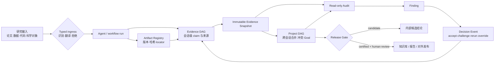

## 来源说明

本文基于 2026-07-20 的每日深度技术研究发布流程写成。今天没有继续写记忆投毒：站内 7 月 19 日刚发布状态修复与跨会话验收文章，再写一篇相邻安全摘要会造成重复。更值得推进的是 AI Native 研究工作流的证据层：站内 7 月 1 日已经回答“自然语言研究问题怎样变成可验证规格和确定性执行 DAG”，本文继续回答一个尚未展开的问题——**实验跑完、Agent 写出结论之后，怎样把 claim、来源、代码、数据、运行、审核和发布决定编译成可验证状态。**

核心原始来源如下：

1. SciForge Team 等：[SciForge: An AI-Native, Multimodal Workbench for Scientific Discovery](https://arxiv.org/abs/2607.16038)，arXiv:2607.16038v1，2026-07-17 提交；[PDF 全文](https://arxiv.org/pdf/2607.16038)。论文提出 thin GUI、translate-then-reason、Evidence DAG、Project DAG、Scientific Model Router 与 goal-scoped release governance，并展示八个端到端用例。[1]
2. SciForge 开源仓库固定版本：[commit `c7a638b`](https://github.com/AGI4Sci/SciForge/tree/c7a638b1fdb03e11baad4f82e1d8c59ec92ee60a)，提交时间为 2026-07-19 17:57 UTC；[Evidence DAG worker](https://github.com/AGI4Sci/SciForge/tree/c7a638b1fdb03e11baad4f82e1d8c59ec92ee60a/packages/workers/evidence-dag) 与[设计文档](https://github.com/AGI4Sci/SciForge/blob/c7a638b1fdb03e11baad4f82e1d8c59ec92ee60a/docs/evidence-project-dag-design.zh-CN.md)公开了结构化 run lineage、不可变 snapshot、只读 audit、provenance 等级、Artifact Registry 与 Decision Event 合同。[2]
3. SciForge [Scientific Modality Router 文档](https://github.com/AGI4Sci/SciForge/blob/c7a638b1fdb03e11baad4f82e1d8c59ec92ee60a/packages/workers/sci-modality-router/README.md)。它把蛋白序列、蛋白结构、小分子与单细胞转录组交给专用 native-to-text translator；未支持的 VCF、BED、GFF、MGF 等格式 fail closed，不把原始内容偷偷交给通用文本模型。[3]
4. W3C Recommendation：[PROV-DM: The PROV Data Model](https://www.w3.org/TR/prov-dm/)。PROV-DM 用 Entity、Activity、Agent 及 `used`、`wasGeneratedBy`、`wasDerivedFrom`、`wasAssociatedWith`、`wasAttributedTo` 等关系表达来源与责任；它是通用 provenance 模型，不自动替领域系统判断一个 claim 是否成立。[4]
5. RO-Crate 官方规范：[RO-Crate 1.1 Introduction](https://www.researchobject.org/ro-crate/specification/1.1/introduction.html)。RO-Crate 用 JSON-LD 聚合或引用研究数据、文件、人员、软件、设备和 workflow metadata，适合作为研究包交换边界，但它同样不会替团队完成 claim 级质量判断。[5]

我做了三项额外核验。第一，全文核对论文架构、用例、成功标准与 limitation，而不是只读摘要。第二，固定到上述 commit 检查仓库树和关键合同：Evidence DAG worker 有独立的 model、snapshot、audit、artifact、lineage、human review、PROV-JSON 与 RO-Crate 模块，并有对应测试文件；这证明架构不只存在于论文图中。第三，核对论文案例的失败披露：基因候选案例的事后文献映射没有预注册，正式专家裁决仍是 future work；分子优化案例的最佳 docking 改善没有越过预注册主阈值，且处于重复运行的噪声范围内。

事实边界：系统架构、代码合同、案例数据与实验结果来自作者和仓库；我没有在本次运行中配置科研模型权重、GPU 与领域数据，因而没有独立复现八个用例。本文的数据模型、发布协议、权限策略、SOP、指标门槛、成本公式和一周实验是我的工程建议，不是 SciForge 团队或 W3C 的规范要求。

站内差异化：7 月 1 日文章聚焦 `research spec -> executable workflow -> run ledger`，本文聚焦 `run/artifact -> evidence snapshot -> project claim -> release decision`。前者解决“怎么跑”，后者解决“跑完以后为什么能信、谁批准、如何撤回”。

稳定 slug：`2026-07-20-ai-native-research-evidence-dag`。

## 先给结论

科研 Agent 的证据层不能只是回答末尾的一串链接，也不能只是一份会不断覆盖的 `research-notes.md`。

一个能进入团队知识库、技术决策或对外报告的结论，至少要同时回答四个问题：

1. **语义问题**：这个 claim 到底说了什么，适用范围和反例是什么？
2. **来源问题**：它来自论文哪一页、数据哪一版、代码哪个 commit、哪次运行？
3. **决策问题**：谁接受、驳回、降级或覆盖了风险，依据是哪一版证据？
4. **时间问题**：来源变化、文件移动、实验重跑或新反证出现后，旧结论是否自动失效？

SciForge 最值得借鉴的不是“让多个 Agent 做科学发现”，而是把这四类问题拆成不同状态对象：会话内的 Evidence DAG 保存局部 claim 与证据路径，项目级 Project DAG 合并多会话结果并连接研究目标，audit 作为只读侧链发现风险，Decision Event 保存人或 AI 的处置，candidate/certified gate 决定什么能发布。[1][2]

我的工程判断是：AI Native 研究系统需要一个 **Research Evidence Compiler**。它不是再加一个“审稿 Agent”，而是把可见 trace、原始工件、结构化 run lineage 和审核决定编译成不可变快照；任何审计与发布都必须引用某个快照 digest，而不能审一份正在变化的聊天记录。



一句话：**Agent 生成的是候选结论；快照、来源链和发布决定共同生成可引用的研究状态。**

## 场景定义：把一周技术研究变成可复核的决策包

选择一个具体场景：平台团队每周研究一个新框架或安全机制，输入包括论文、官方文档、GitHub 仓库、基准数据和本地验证脚本；输出要进入架构评审，决定“试点、暂缓或拒绝”。

原流程通常是：研究员开多个浏览器标签，复制摘要到笔记，Agent 帮忙归纳，工程师跑几个命令，最后在文档里写结论。这个流程可以很快，但交接时经常只剩三样东西：一段顺滑叙述、一组链接、几张没有 run id 的截图。

它的真正成本不在第一次写作，而在三周后有人追问：

- 引用的仓库现在已经变了，当时看的究竟是哪一版？
- “性能提升 30%”是论文报告、本地复现，还是 Agent 从图里读错的？
- 本地测试用了哪个数据集、参数、随机种子和容器？
- 新论文反驳了旧结论，哪些下游文档需要降级？
- 这条结论为什么进入正式知识库，谁审过？

目标不是把研究员变成图数据库管理员，而是让系统在后台把这些问题变成可查询状态，人只在高价值节点做判断。

## 原流程痛点：研究对象与聊天文本被混成一层

| 原步骤 | 表面产物 | 隐藏缺口 | 目标状态对象 |
| --- | --- | --- | --- |
| Agent 读论文 | 摘要与引用链接 | 没有页码、表格、版本和内容哈希 | `ArtifactVersion + SourceAnchor` |
| Agent 跑脚本 | 一段 stdout | 缺输入、参数、环境、seed、输出关系 | `AnalysisRun + evidenceLineage` |
| 多会话研究 | 多份聊天记录 | 同义结论重复，冲突被摘要抹平 | `EvidenceSnapshot -> ProjectClaim` |
| 审稿 Agent 检查 | 一份改写后的文本 | 审计同时改写证据，历史不可复盘 | `ReadOnlyAudit + Finding` |
| 人类说“可以发” | 评论或口头确认 | 不知道审的是哪个版本 | `DecisionEvent(snapshotDigest)` |
| 文件移动/覆盖 | 路径仍相同 | 旧引用悄悄指向新内容 | `ArtifactVersion + stale propagation` |

最危险的设计是让同一个 Agent 同时生成 claim、选择证据、给自己评分、修改证据图和宣布通过。即使模型没有恶意，这个闭环也会把确认偏误编码成系统行为。

## 机制拆解一：双层图不是规模优化，而是责任边界

### Evidence DAG：只回答“这个会话里发生了什么”

Evidence DAG 的边界应该是一次 session 或一次可控 research run。它消费可见 trace，提取 claim、finding、source assertion、可见 reasoning step 和 run lineage，连接精确 source anchor，再提交不可变快照。[2]

会话级边界有三个好处：

- 增量编译成本可控，不需要每次重算整个项目；
- 失败可隔离，一次坏抽取不会直接覆盖项目真相；
- 同一个问题由不同 Agent、模型或研究员独立研究时，可以保留独立证据路径。

### Project DAG：只回答“项目当前接受什么”

Project DAG 消费多个 Evidence Snapshot，不直接读取仍在变化的聊天。它负责同义 claim 合并、冲突保留、独立来源计数、与 Goal 关联，以及候选/认证发布状态。[1][2]

这里有一个容易犯的错误：把 Project DAG 做成“全局最新摘要”。真正需要保留的是来源集合和决策历史。两个会话得出相同结论，不代表可以合并成一个无来源文本；两个会话引用同一篇论文，也不算独立证据。

我会把项目 claim 建模成投影，而不是新事实：

```ts
type ProjectClaim = {
  id: string;
  normalizedStatement: string;
  scope: string[];
  evidenceSnapshots: Array<{
    threadId: string;
    digest: `sha256:${string}`;
    sourceClaimIds: string[];
  }>;
  supportPaths: string[][];
  contradictionPaths: string[][];
  provenanceLevel: "L0" | "L1" | "L2" | "L3" | "L4";
  evidenceState: "hypothesis" | "supported" | "contested" | "invalidated";
  releaseState: "draft" | "candidate" | "certified" | "withdrawn";
};
```

`evidenceState`、`provenanceLevel` 和 `releaseState` 必须分开。一个 claim 可以“有支持但只能追到 URL”（supported + L1），也可以“运行完全可复现但结果互相冲突”（contested + L4）。把它们压成一个 confidence 分数，会丢掉工程处置所需的信息。

## 机制拆解二：多模态输入要先变成有类型的证据，不是把文件塞进 prompt

普通 RAG 很容易把 PDF、表格、PDB、FASTA、SMILES、VCF 都当成“可切块文本”。这在科研场景里并不成立：不同对象需要不同解析器、坐标系、质量检查和领域模型；错误解析产生的自然语言仍然很流畅，后续 Agent 很难察觉。

SciForge 的 `translate-then-reason` 路径把科学对象先交给专用 translator，再把带 provenance 的文本证据交给主 Agent。仓库当前明确支持四类 native-to-text 路径，并对未选择合适 translator 的格式 fail closed。[1][3]

我会把这个思路落成 typed ingress contract：

```json
{
  "objectId": "artifact:protein-structure:7f31",
  "mediaType": "chemical/x-pdb",
  "contentDigest": "sha256:...",
  "detectedModality": "protein_structure",
  "translator": {
    "id": "prot2text-structure",
    "version": "pinned-model-or-service-version",
    "status": "completed"
  },
  "output": {
    "artifactVersionId": "artifact:translation:91ab:v1",
    "digest": "sha256:..."
  },
  "policy": {
    "rawFallback": false,
    "onUnsupported": "fail_closed"
  }
}
```

工程上要注意：translation 是一次有损测量，不是“把对象变成真相”。原始工件、translator 版本和输出必须同时保留；主 Agent 的 claim 只能链接 translation artifact，不能假装直接观察了原对象。高影响结论还应要求第二种解析器、确定性统计或领域专家复核。

## 机制拆解三：来源链必须覆盖 run，不只覆盖论文

W3C PROV-DM 提供 Entity、Activity、Agent 和来源关系的通用骨架。[4] 对 AI Native 研究系统，它最有价值的地方是强迫我们区分：

- 数据集、代码、模型、日志、图表是 Entity；
- 数据清洗、训练、统计分析、图表生成是 Activity；
- 人、Agent、软件 worker 是 Agent；
- “使用了什么”与“由什么生成”是不同关系。

但 PROV-DM 不知道一篇论文的 claim 是否被正确抽取，也不知道一个统计结果是否达到业务发布门。因此我会在 PROV 骨架上增加研究语义层，而不是把所有东西硬塞成一种节点。

一次计算结果要达到可复现等级，最小路径应该是：

```text
Project Finding
  <- Session Finding
  <- AnalysisRun
     <- DatasetVersion(content digest / query snapshot)
     <- SoftwareVersion(repository + commit)
     <- Environment(container digest / lockfile)
     <- Parameters
     <- RandomSeed, if stochastic
     -> Log ArtifactVersion
     -> Output ArtifactVersion
     -> Figure / Table SourceAnchor
```

SciForge 的 Evidence DAG worker 已把 structured `evidenceLineage` 做成显式 envelope，并规定缺字段时产生 provenance breakpoint，不从 prose 猜参数或 seed。[2] 这比“让 Agent 根据日志补全 metadata”更可靠：缺失本身就是需要暴露的事实。

## 机制拆解四：快照、审计与决策必须分成三条链

研究状态不应在审计时原地修改。

我会坚持三个不变量：

1. **快照不可变**：编译成功后生成 digest；失败更新不能暴露半张图。
2. **审计只读**：audit 读取指定 digest，输出 Finding，不直接改 claim 或 edge。
3. **决定追加写**：接受、驳回、补证据、重跑、覆盖风险都写成 Decision Event，再触发下一版编译。

```ts
type DecisionEvent = {
  id: string;
  projectId: string;
  targetSnapshotDigest: `sha256:${string}`;
  targetNodeIds: string[];
  action: "endorse" | "challenge" | "request_evidence" | "rerun" | "override" | "withdraw";
  actor: { type: "human" | "agent"; id: string; role: string };
  rationale: string;
  alternatives: string[];
  autonomyMode: "advisory" | "supervised" | "autonomous";
  reversible: boolean;
  createdAt: string;
};
```

这套分离解决一个很现实的问题：当审计规则升级时，团队可以对旧 snapshot 重跑新 audit，比较 Finding 变化，而不需要篡改历史证据。发布事故发生后，也能还原“当时系统看到了什么、哪条规则放行、谁覆盖了风险”。

## 目标工作流：从候选 claim 到认证发布

| 阶段 | Agent/工具 | 输入 | 输出 | 人工审核点 |
| --- | --- | --- | --- | --- |
| 1. Intake | Source Scout + typed parser/router | 论文、代码、数据、科学对象 | versioned artifacts、source anchors | 敏感数据与未知格式 |
| 2. Execute | Research Agent + workflow engine | approved spec、artifacts | run、logs、outputs | 高成本计算、外部副作用 |
| 3. Compile | Evidence compiler | visible trace、artifact registry、run lineage | immutable Evidence Snapshot | 默认不阻塞 |
| 4. Merge | Project compiler | 多个 snapshot | project claims、冲突、Goal 映射 | 根目标重写、关键 claim 合并 |
| 5. Audit | deterministic checks + Audit Agent | 指定 snapshot digest | Finding、risk digest | critical finding |
| 6. Decide | PI/Tech Lead + Decision service | finding、证据路径、成本 | Decision Event | 认证发布、风险 override |
| 7. Release | release gate | certified project snapshot | research package / knowledge entry | 最终签字 |

Agent 可以自主完成 intake 建议、证据编译、普通审计和草稿生成，但不能同时掌握以下三个权限：修改根研究目标、覆盖 critical Finding、发布认证结论。高风险流程里至少要把后两项留给不同的人或策略主体。

## 数据与权限边界

研究系统至少需要四类权限，而不是一个“Agent 可访问工作区”的总开关。

```yaml
research_evidence_policy:
  ingest:
    allowed_roots: ["projects/current/sources", "projects/current/runs"]
    unsupported_scientific_format: "fail_closed"
    restricted_data: "metadata_only"

  compile:
    may_read_visible_trace: true
    may_read_hidden_chain_of_thought: false
    may_append_snapshot: true
    may_rewrite_history: false

  audit:
    read_snapshot_by_digest: true
    may_mutate_graph: false
    may_open_finding: true

  release:
    candidate:
      min_provenance: "L2"
      approval_roles: ["research-owner"]
    certified_external:
      min_literature_provenance: "L2"
      min_local_result_provenance: "L4"
      approval_roles: ["research-owner", "domain-reviewer"]
      unresolved_critical_findings: 0
```

敏感数据的原则是引用优先：图里保存版本、checksum、查询定义、脱敏 anchor 与 access policy，不默认复制原始数据。导出 RO-Crate 时也应默认输出 metadata 和引用；只有许可明确时才打包受限工件。[2][5]

## 可复制 SOP

第一版不需要先部署图数据库。JSON/JSON-LD 文件、内容哈希、append-only event log 和一个查询 CLI 已经足够验证机制。

1. 为研究项目创建 `artifacts/`、`runs/`、`evidence/threads/`、`evidence/project/`、`audits/`、`decisions/` 与 `releases/`。
2. Source Scout 登记每个来源的 locator、版本、访问时间、media type、digest 和许可；论文 claim 至少建立页码/表格/段落 anchor。
3. 科学对象先走 typed ingress。未知格式、模态歧义或 translator 不可用时停在 intake，不降级成普通文本。
4. workflow engine 的每个结果输出 `evidenceLineage`：run id、输入、软件、环境、参数、seed、日志、输出和 actor。
5. 每个 turn 或 run 完成后，把 watermark 写入 durable queue；compiler 生成新 Evidence Snapshot，成功后原子更新 `latest` 指针。
6. Project compiler 只消费已提交 digest，合并同义 claim 时保留所有 origin path；冲突边不得被摘要删除。
7. audit 对指定 digest 执行结构检查、来源完整性、冲突检查和 claim support 检查；输出只读 Finding。
8. 普通 Finding 可由 Agent 提议补证据或重跑；critical Finding、根目标 reframe 与 certified release 进入人工审核。
9. 人的决定写成结构化事件，不在图数据库后台手改节点。任何 override 必须记录理由、actor、适用范围与可逆性。
10. 发布时生成 research package：project snapshot digest、claim map、PROV projection、artifact manifest、audit report、Decision Events、局限与撤回入口。

建议目录：

```text
research-projects/evidence-compiler-pilot/
  project.yaml
  artifacts/
    registry.json
    anchors/
  runs/
    run-001/lineage.json
    run-001/logs/
  evidence/
    threads/<thread-id>/<digest>.json
    project/<digest>.json
  audits/<snapshot-digest>/<audit-id>.json
  decisions/events.jsonl
  releases/candidate-001/
    manifest.json
    claim-map.md
    ro-crate-metadata.json
```

## 工具栈选择理由

第一阶段我会选 Git + SQLite/JSON + JSON Schema + SHA-256，而不是先上 Neo4j。

- Git 适合保存 schema、policy、Decision Event 与小型 snapshot 的审阅历史。
- SQLite 适合 event outbox、队列、水位和索引；部署成本低，事务语义够用。
- JSON Schema 适合约束 `evidenceLineage`、Artifact、SourceAnchor 与 Decision Event。
- PROV-JSON 或 PROV-O 用于跨系统 provenance 交换，不承担领域质量判定。[4]
- RO-Crate 用于发布研究包 metadata，不作为在线可变数据库。[5]
- 图数据库只在跨项目路径查询、冲突传播和规模证明成为真实瓶颈后引入。

这种选择也便于回滚：在线图索引坏了，可以从 append-only events 和 immutable snapshots 重建；而不是把图数据库当前状态当成唯一真相。

## 质量评估与可验证指标

| 指标 | 计算方式 | 试点门槛 |
| --- | --- | --- |
| Claim anchor coverage | 有结构化 source anchor 的外部 claim / 外部 claim 总数 | ≥ 95% |
| Run lineage completeness | 输入、软件、环境、参数、日志、输出齐全的本地 run / 总 run | ≥ 90%，发布结论 100% |
| Snapshot atomicity | 故障注入后读者看到 partial snapshot 的次数 | 0 |
| Audit purity | audit 导致 graph digest 改变的次数 | 0 |
| Decision binding | 带 target snapshot digest 的审核决定 / 总决定 | 100% |
| Contradiction retention | 已知冲突在 project merge 后仍可查询的比例 | 100% |
| Independent support accuracy | 系统识别“同一底层来源”的准确率 | 抽样 ≥ 95% |
| Stale detection latency | 工件变化到依赖 claim 标 stale 的 P95 | < 5 分钟 |
| Reproducible finding rate | 达 L4 的本地关键 finding / 本地关键 finding 总数 | ≥ 80% 起步 |
| Certified rollback time | 从撤回决定到知识入口隐藏/标红的时间 | < 15 分钟 |
| Human review load | 每个 certified claim 的人工审核分钟数 | 可持续下降，但不以零为目标 |
| Cost per accepted claim | 模型、计算与人审成本 / 认证 claim 数 | 与原流程对比下降 |

不要用“图里有多少节点”衡量价值。节点越多可能只是抽取噪声越多。真正有意义的是关键 claim 能否回到原始位置和具体运行，冲突是否保留，旧来源变化时能否及时降级，发布决定是否可复盘。

## 成本估算

证据编译会增加模型调用、存储和人审成本，因此必须单独计账：

```text
evidence_cost =
  extraction_calls
  + independent_verification_calls
  + artifact_hashing_and_storage
  + audit_compute
  + human_review_minutes * reviewer_rate
  + maintenance_minutes * engineer_rate

avoided_cost =
  saved_research_handoff_minutes
  + saved_reproduction_minutes
  + prevented_wrong_decision_cost * estimated_prevention_probability
  + faster_withdrawal_minutes * incident_rate
```

一周试点不应计算宏大的“科研发现 ROI”。先比较两个可观测量：同一个结论从零追溯到原始证据需要多少分钟；来源变化后识别所有受影响下游结论需要多少分钟。如果这两个时间没有明显下降，证据图只是更复杂的笔记系统。

## 失败模式与回滚

### 1. 抽取器制造伪 claim

Agent 把论文限定性结论改成普遍结论，随后所有边都“结构正确”。回滚：保留 exact anchor；support edge 使用独立 prompt/模型复核；外部发布 claim 强制展示原文位置与适用范围。

### 2. 图合并制造伪共识

三个 Agent 都引用同一篇综述，却被计为三条独立证据。回滚：独立性按底层 ArtifactVersion 与来源路径计算，不按 session 数计算；保留 `same_as` 与共享 ancestry。

### 3. 路径存在，但来源质量很低

一个 claim 能追到 URL，不代表可信。回滚：evidence state、provenance level 与 source quality 分开；发布门分别设阈值。

### 4. translator 产生有损误读

科学对象经过 native-to-text 模型后丢失关键结构。回滚：translation artifact 不覆盖原对象；高影响 claim 要求确定性工具、第二 translator 或领域人审；unsupported 格式 fail closed。

### 5. audit 与编译互相追逐

每次 Finding 都立刻改图并触发新 audit，系统形成无限反馈。回滚：audit 只读；Decision Event 经去重和水位控制进入统一 compiler；同一 snapshot + policy version 的 audit 幂等。

### 6. 文件路径复用导致幽灵更新

`results/final.csv` 被新运行覆盖，旧 claim 看似仍有来源。回滚：路径不是身份；同路径 digest 变化必须创建 ArtifactVersion，并把依赖旧版的 claim 标 stale。

### 7. 人审沦为点击批准

审核页面展示长篇摘要而不展示 blast radius、冲突和断点。回滚：人工界面只呈现 attention frontier：高影响 claim、未解决冲突、低 provenance、不可逆发布；每个批准绑定 snapshot digest。

### 8. 系统无法重建

在线图损坏后团队只能相信数据库备份。回滚：immutable snapshots、artifact registry、append-only events 与 Decision Events 是恢复源；图索引是可重建派生物。每月演练一次从空库恢复。

## 我会如何实现和验证

我会先实现一个 `evidencectl` CLI，不先做完整 GUI。

```text
evidencectl ingest <artifact>
evidencectl anchor <artifact-id> --page 12 --quote-file excerpt.txt
evidencectl record-run --lineage run.json
evidencectl compile-thread <thread-id> --watermark <id>
evidencectl compile-project <project-id>
evidencectl audit <snapshot-digest> --policy policy.yaml
evidencectl decide --event decision.json
evidencectl release <project-digest> --profile certified
evidencectl trace <claim-id>
```

一周验证计划：

| 天数 | 实验 | 验收 |
| --- | --- | --- |
| Day 1 | 定义四个 JSON Schema 与目录 | 非法 lineage、无 digest 决定被拒绝 |
| Day 2 | 导入 3 篇论文、1 个仓库、1 个本地脚本 | 每个关键 claim 有 anchor |
| Day 3 | 跑两次相同分析，第二次更换 seed 与代码 commit | 生成两个独立 ArtifactVersion 与 run |
| Day 4 | 用两个会话得出一条同义 claim，并注入一条反证 | Project merge 保留共同来源与冲突 |
| Day 5 | 在编译中途 kill 进程、移动文件、覆盖同路径文件 | latest 不暴露半成品，stale 正确传播 |
| Day 6 | 对旧 snapshot 用新 audit policy 重审 | 旧 digest 不变，新 Finding 可比较 |
| Day 7 | 让另一位工程师只用 release package 复核结论 | 30 分钟内定位来源、重跑关键结果、判断发布 |

最小成功标准不是“Agent 自动完成研究”，而是：另一位工程师不读原聊天，也能从一个 project claim 走到论文原位置或具体 run，并能解释为什么它被发布、什么条件下应该撤回。

## 工程判断

SciForge 给出的双层图、只读审计和 fail-closed 模态路由，是当前 AI Native 研究工具里很有价值的工程组合。仓库公开的合同也比论文摘要更具体：不可变 snapshot、结构化 anchor、run lineage、provenance breakpoint、事件 outbox 与 RO-Crate export 都能落到代码对象。[2][3]

但我不会直接把论文中的八个 demo 当成系统有效性的充分证明。它们跨越多个领域，展示了覆盖面，却不是统一、预注册、带对照组的产品级 benchmark。论文自己也披露了重要边界：基因候选的文献映射是事后分析；正式专家裁决与一致性度量尚未完成；分子优化没有达到预注册主阈值；team workspace 在比较表中仍标为 future release。[1]

因此，最稳的采用路径不是“部署 SciForge 并让它替团队做科研”，而是先吸收三个协议：

1. 科学对象 `typed ingress + fail closed`；
2. `Evidence Snapshot -> Project Snapshot -> Decision Event`；
3. 文献 L2、内部计算 L4 的差异化发布门。

这三件事即使只用现有 Git、SQLite 和 CI 也能实施，而且能立刻改善研究交接、技术选型和知识库更新。

## 适用场景

最适合：需要跨多次会话、多人交接、混合论文与本地运行、结论会进入架构或产品决策的研究；需要保留负结果、冲突和撤回链的团队知识库；生命科学、数据分析、安全验证等输入类型复杂且结果需要审查的工作流。

不适合：一次性低风险问答；没有任何本地验证、只做轻量资料浏览的任务；结论寿命极短且追溯成本高于错误成本的场景。此时 source index + claim table 可能比完整图更经济。

## 局限分析

第一，claim normalization 本身仍依赖模型判断，同义合并与矛盾识别会有误差。图结构不会自动消除语义错误。

第二，内容哈希证明“字节没变”，不证明数据采集正确、代码没有 bug、实验设计合理或来源可信。

第三，L4 可复现不等于科学上可重复。恢复同一容器和 seed 只能证明计算重现；独立样本、不同实验室或不同工具链的 replication 是另一层要求。

第四，Evidence DAG 会增加存储、索引、模型调用与审核负担。小团队应从关键 claim 开始，不要给每句话建节点。

第五，本次没有在真实科研模型、GPU 和敏感数据环境中复现 SciForge；对其吞吐、长期 snapshot 规模、模型路由稳定性、跨项目权限隔离和真实团队协作成本没有独立结论。

第六，W3C PROV 与 RO-Crate 解决互操作与打包问题，不是科研质量认证标准。任何“用了标准所以可信”的表述都属于过度外推。[4][5]

## 自审

- **事实可靠性**：论文架构、案例数字与限制均按作者报告表述；仓库能力固定到具体 commit；没有把代码存在写成生产验证完成。
- **来源完整性**：同时使用论文、固定版本仓库、关键 worker 文档、W3C 规范与 RO-Crate 规范，关键判断可回到原始来源。
- **非摘要复述**：文章把来源材料重构为 Research Evidence Compiler、三条状态链、权限策略、数据模型、SOP、指标和故障注入计划。
- **站内重复**：与 7 月 1 日“规格与确定性执行”文章分工明确，本文新增多模态入口、双层证据图、不可变快照、审计侧链和发布治理。
- **工程价值**：提供角色分工、输入输出、目录、schema、policy、CLI、人工审核点、成本公式、回滚与一周实验。
- **边界诚实**：明确区分作者 demo、仓库静态核验、我的推断与未完成的独立复现；没有把可复现等同于科学有效。
- **标题与内容**：标题准确描述问题与方案，不使用“全自动科学家”等超出证据的表述。

## 来源

[1] SciForge Team, Gao Z., Fang M., et al. [SciForge: An AI-Native, Multimodal Workbench for Scientific Discovery](https://arxiv.org/abs/2607.16038), arXiv:2607.16038v1, 2026.

[2] AGI4Sci. [SciForge repository at commit c7a638b](https://github.com/AGI4Sci/SciForge/tree/c7a638b1fdb03e11baad4f82e1d8c59ec92ee60a), especially [Evidence DAG worker](https://github.com/AGI4Sci/SciForge/tree/c7a638b1fdb03e11baad4f82e1d8c59ec92ee60a/packages/workers/evidence-dag) and [Evidence DAG / Project DAG design](https://github.com/AGI4Sci/SciForge/blob/c7a638b1fdb03e11baad4f82e1d8c59ec92ee60a/docs/evidence-project-dag-design.zh-CN.md), accessed 2026-07-20.

[3] AGI4Sci. [Scientific Modality Router](https://github.com/AGI4Sci/SciForge/blob/c7a638b1fdb03e11baad4f82e1d8c59ec92ee60a/packages/workers/sci-modality-router/README.md), accessed 2026-07-20.

[4] Moreau L., Missier P. [PROV-DM: The PROV Data Model](https://www.w3.org/TR/prov-dm/), W3C Recommendation, 2013.

[5] RO-Crate Community. [RO-Crate 1.1 Introduction](https://www.researchobject.org/ro-crate/specification/1.1/introduction.html), accessed 2026-07-20.
