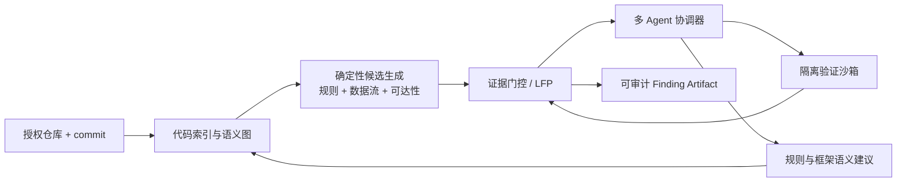
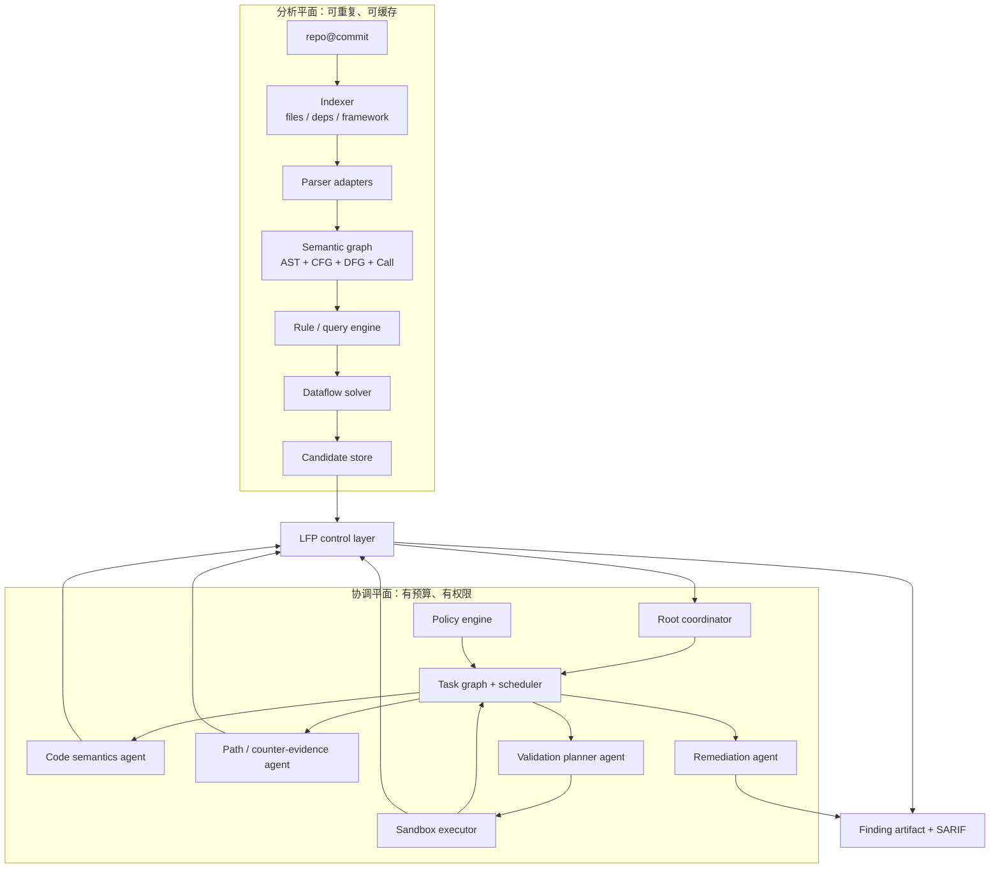
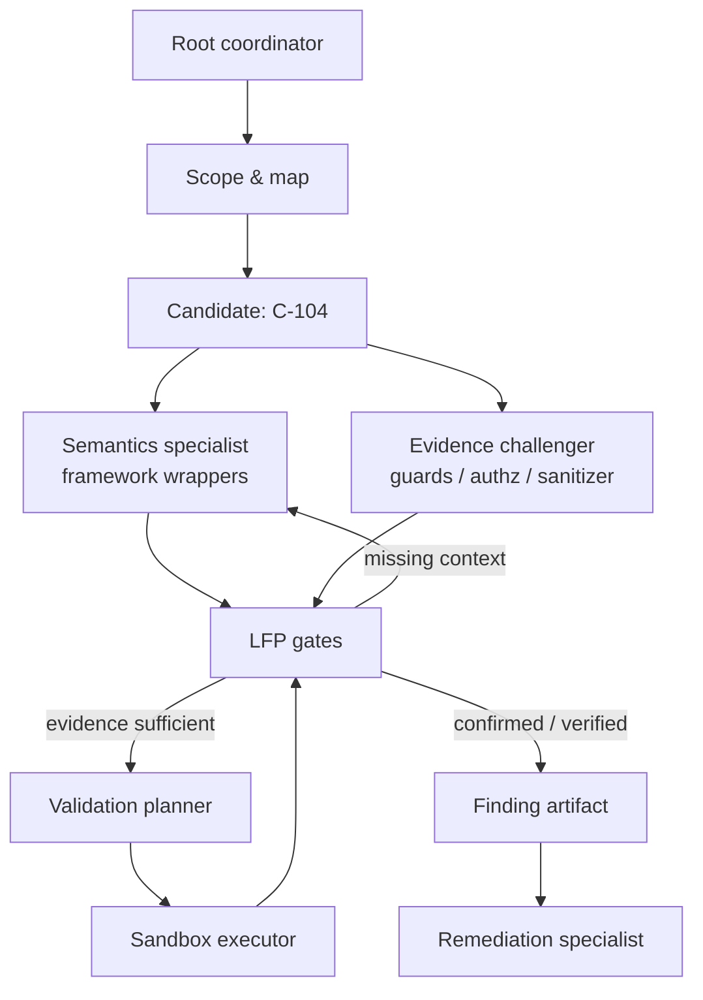
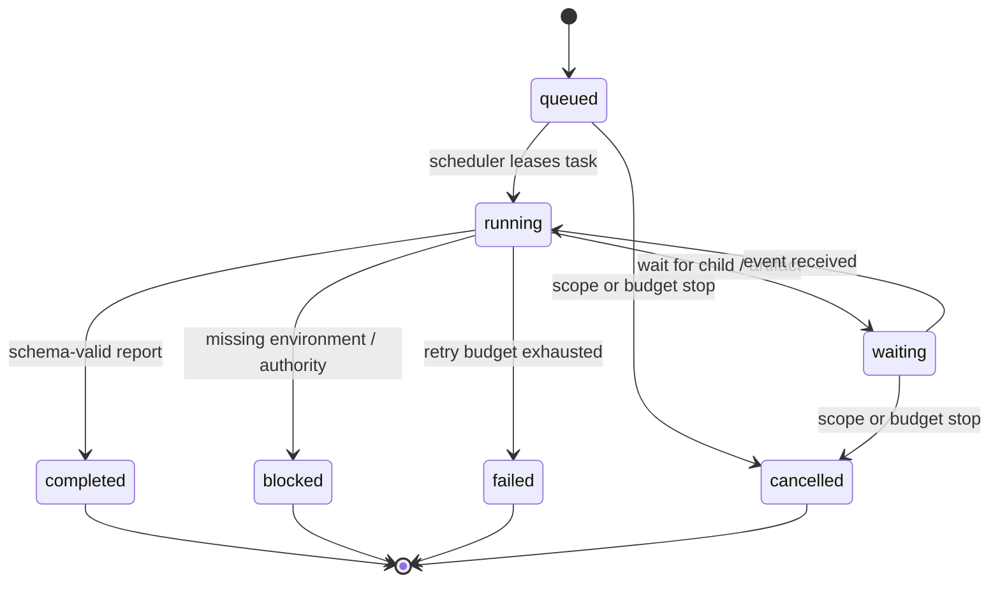
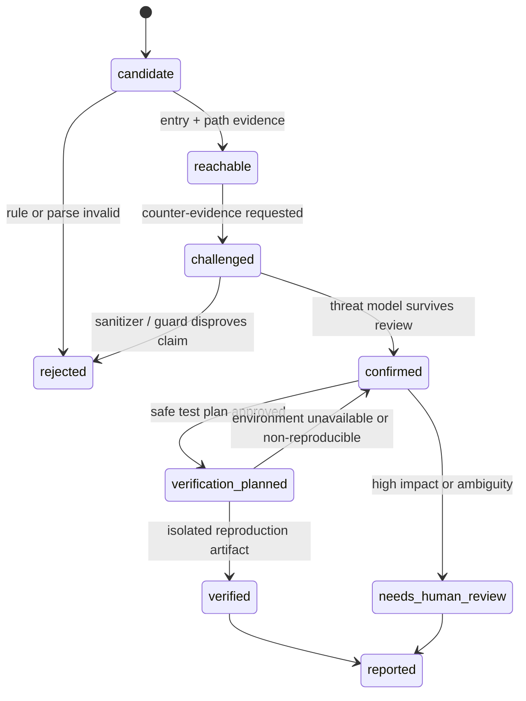
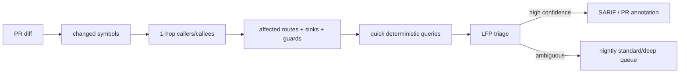

## 来源与边界

本文研究对象是 [usestrix/strix](https://github.com/usestrix/strix) 在 2026-07-20 可见的开源代码与文档。Strix 将自己定位为带动态验证能力的 AI 渗透测试工具；其仓库中可以直接看到的工程事实包括：根 Agent 可以动态创建子 Agent、子 Agent 通过共享协调器登记状态并向父 Agent 回传结构化完成报告、白盒模式先做源码感知的静态分流、候选结论需要动态证据才能进入漏洞报告，以及扫描运行在容器化环境中。[Strix README](https://github.com/usestrix/strix) 与其 [Agent Graph 工具实现](https://github.com/usestrix/strix/blob/main/strix/tools/agents_graph/tools.py) 是本文的主要一手来源。

下面的架构、对象模型、状态机、编排策略和代码骨架是我的工程设计，不是 Strix 对其产品的完整声明，也不是对它内部实现的逐行复述。尤其不要把本文理解为“拿一个模型自动攻击所有目标”的操作说明：讨论范围限定为**自己拥有或已明确授权的代码仓库与隔离测试环境**。白盒扫描的产物是可审计的安全证据；未经授权的外部测试不在范围内。

另外有一个容易混淆的点：多 Agent 不等于多个模型同时读仓库。真正有价值的多 Agent 系统，需要把分工、共享事实、停止条件、验证权限和报告资格做成程序约束。否则它只是把单 Agent 的不确定性并行放大。

核心参考：

- [Strix：源码、CLI 和白盒工作流](https://github.com/usestrix/strix)
- [Strix：多 Agent 图工具](https://github.com/usestrix/strix/blob/main/strix/tools/agents_graph/tools.py)
- [Strix：AgentCoordinator 运行时状态](https://github.com/usestrix/strix/blob/main/strix/core/agents.py)
- [Strix：源码感知白盒协调技能](https://github.com/usestrix/strix/blob/main/strix/skills/coordination/source_aware_whitebox.md)
- [Strix：漏洞报告字段与去重](https://github.com/usestrix/strix/blob/main/strix/tools/reporting/tool.py)
- [OpenAI Agents SDK：Agent orchestration](https://openai.github.io/openai-agents-python/multi_agent/)
- [GitHub CodeQL：用 path query 解释数据流](https://docs.github.com/en/code-security/how-tos/find-and-fix-code-vulnerabilities/scan-from-vs-code/explore-data-flow)
- [OWASP WSTG：源码审查与应用安全测试的互补性](https://owasp.org/www-project-web-security-testing-guide/latest/2-Introduction/README)

## 先给结论

如果目标是构建一套可在团队里长期运行的白盒扫描器，我会采用下面这条原则：

> **确定性程序分析负责“发生了什么”；Agent 负责“下一步该查什么、如何解释、如何验证”；只有带证据的验证闭环才有资格改变 finding 的结论。**

Strix 最值得借鉴的不是“AI pentest”这个标签，而是它把 Agent 当作一个可观察的任务图：有根节点、有父子关系、有运行/等待/完成状态、有目标化消息，以及子任务完成时回传的结构化报告。这个思路很适合迁移到白盒扫描，但需要做一处关键改造：把动态探测优先级下调，把**代码图、数据流路径、可达性、策略和沙箱验证**提升为一等公民。

最终系统不是一条 `analyze(repo)` 的大 prompt，而是两条交错的流水线：



左边是可重复运行的分析引擎，右边是受策略限制的研究与验证编排。Agent 可以让左边更聪明，但不能越过左边和中间的证据门控，直接把自然语言判断写成漏洞结论。

## Strix 给出的四个工程信号

### 1. 编排应当是任务图，而不是固定流水线

Strix 的根 Agent 不直接完成全部测试，而是负责拆分目标、创建专业子 Agent、检查已有任务避免重复、等待或接收完成回报、最后汇总。它的 `create_agent` 接口要求子任务具备明确名称、具体目标和少量关联 skills；`agent_finish` 会把子 Agent 的总结、发现和下一步建议发送给父节点。运行时协调器还保存 `parent_of`、`statuses`、`names` 和待处理消息数。

这比“预先固定 8 个 Agent 并行跑完”成熟得多。白盒扫描中的任务依赖本来就是动态出现的：

- 路由分析发现一个管理端入口，才需要鉴权语义 Agent。
- 污点路径穿过自研 ORM，才需要框架适配 Agent。
- 候选在 LFP 门被拦住，才需要反证 Agent 或验证计划 Agent。
- 一条已确认的路径影响多个模块，才需要修复范围 Agent。

固定流水线会让没有必要的 Agent 消耗上下文和预算；完全自由的 swarm 又会重复工作。合适的形态是**根协调器拥有状态机，Agent 只能在被允许的状态和预算内扩展局部任务图**。

### 2. 子 Agent 的交付物必须是结构化回报，而不是聊天记录

Strix 的完成回报包含任务、状态、时间、摘要、发现和建议。这个细节非常重要：父 Agent 不应从一长段对话中“猜”出子任务是否真的完成。

对白盒扫描器，我会把回报进一步收紧成一个 schema。注意其中没有 `verdict: critical` 这种可被模型任意填写的最终结论；子 Agent 交付的是证据、反证、待验证假设与下一跳建议。

```ts
type AgentReport = {
  taskId: string;
  agentId: string;
  status: "completed" | "blocked" | "failed";
  scope: { repo: string; commit: string; paths: string[] };
  claims: Array<{
    kind: "source" | "sink" | "reachability" | "sanitizer" | "authz" | "environment";
    statement: string;
    evidenceRefs: string[];
    confidence: "observed" | "inferred";
  }>;
  counterEvidence: Array<{ statement: string; evidenceRefs: string[] }>;
  proposedActions: Array<"expand-path" | "run-query" | "validate-in-sandbox" | "human-review">;
  cost: { toolCalls: number; tokens: number; elapsedMs: number };
};
```

`observed` 只能引用已保存的节点、边、文件位置、测试输出或配置快照；`inferred` 可以存在，但不能单独通过报告门。这会强迫整个系统把“模型的解释”与“系统观察到的事实”分开。

### 3. 白盒优先是一个分流问题，不是让模型把源码读一遍

Strix 的源码感知白盒协作说明要求：有源码时先建立 source map，用 Semgrep、AST 结构搜索、Tree-sitter、密钥检查和供应链检查形成初筛，再用这些结果决定动态 PoC 验证的优先级。这个方向与 CodeQL 的 path query 思路一致：告警的价值在于能展示从 source 到 sink 的具体数据流步骤，而不是只报一个危险 API 名称。

白盒扫描器的输入不是“所有文件的文本”，而应先被缩减为下列事实：

| 事实层 | 要回答的问题 | 常用实现 |
| --- | --- | --- |
| 资产层 | 有哪些服务、入口、依赖、构建产物？ | manifest/lockfile、框架探测、仓库索引 |
| 语法层 | 调用了什么、变量怎样赋值、分支在哪里？ | Tree-sitter、编译器 AST |
| 语义层 | 谁调用谁、参数如何跨函数传递？ | symbol resolution、call graph、SSA/summary |
| 风险层 | 输入是否抵达危险操作，保护是否介入？ | taint rule、path query、control-flow checks |
| 运行层 | 路径在给定配置和权限下是否成立？ | test fixture、sandbox trace、日志 |

拿到这五层之后，Agent 获得的上下文应该是一小段可引用子图，而不是整仓库压缩摘要。例如：“`POST /exports` 的 `format` 参数，经 `ExportService.build` 到 `spawn` 的第二参数；路径上没有识别到 allowlist；路由需要 `editor` 角色；测试容器可启动。”这种上下文足以指导研究，也足以让人复核。

### 4. 报告是一个质量门，不是一个文本生成动作

Strix 的漏洞报告工具要求说明、影响、目标、技术分析、PoC、证据、假设、修复和 CVSS 字段齐全，并在写入前做去重。这个设计传递了一个正确的产品信号：报告不是 Agent 的自由发挥，报告是一个需要满足契约的产物。

对白盒系统，我会再加两条硬规则：

1. 每条 finding 必须携带 `repo@commit`、代码位置、规则/图版本和证据哈希；否则不能跨扫描比较，也不能复现。
2. `candidate`、`confirmed`、`verified` 是不同状态，渲染报告时不得把低证据状态写成高证据结论。

## 总体架构：双平面，而非 Agent 包打天下

系统分成分析平面和协调平面。分析平面没有 LLM 也能稳定工作；协调平面可以替换模型、策略或工作流，而不会改写既有事实。



这里的 LFP 仍是 **Low False Positive Control Layer**，即低误报控制层。它不使用一个“判真假模型”替代工程判断，而是检查 finding 是否满足可达性、净化逻辑、权限条件、证据完整性和验证强度。它会把事实送进协调器，也会拒绝没有足够证据的结论。

### 分析平面中的最小可用图模型

第一版没有必要完整复刻所有 CPG 能力，但节点和边的命名必须稳定。建议至少从以下集合开始：

```ts
type NodeKind =
  | "file" | "module" | "function" | "parameter" | "call"
  | "identifier" | "literal" | "route" | "middleware"
  | "config" | "dependency" | "sink" | "sanitizer";

type EdgeKind =
  | "AST_CHILD" | "CALLS" | "RETURNS" | "ARGUMENT_TO_PARAM"
  | "ASSIGNS" | "FLOWS_TO" | "CONTROLS" | "GUARDS"
  | "DECLARES_ROUTE" | "LOADS_CONFIG" | "IMPORTS";

type GraphNode = {
  id: string;
  kind: NodeKind;
  path: string;
  range: { startLine: number; startColumn: number; endLine: number; endColumn: number };
  attrs: Record<string, string | number | boolean>;
};

type GraphEdge = { from: string; to: string; kind: EdgeKind; evidenceId: string };
```

有了 `evidenceId`，每条图边都能回指到解析器版本、输入文件哈希和生成步骤。很多原型在这里偷懒，后面一旦升级解析器或规则，旧 finding 就无法判断究竟基于哪套事实产生。

### 数据流不是“向量检索”，而是带标签的固定点计算

对于注入、路径处理、敏感数据泄露等问题，核心仍是确定性传播。最小语义是带标签的污点事实：

```ts
type TaintLabel = "user_input" | "file_path" | "command_arg" | "sql" | "html" | "secret";

type TaintFact = {
  valueId: string;
  labels: TaintLabel[];
  path: string[];        // graph edge ids, not prose
  context: string[];     // call string or function-summary context
};

function solve(initial: TaintFact[], transfers: TransferRule[]): TaintFact[] {
  const seen = new FactIndex(initial);
  const queue = [...initial];
  while (queue.length) {
    const fact = queue.shift()!;
    for (const next of applyTransfers(fact, transfers)) {
      if (seen.add(next)) queue.push(next);
    }
  }
  return seen.values();
}
```

这里的停止条件是事实集合不再增长，属于数据流分析里的固定点收敛。它和 Agent 编排完全不同：前者是为了保证传播可复现，后者是为了在不确定问题上分工。把这两层混在一起，会出现“模型说已经分析完了，但程序路径还没有收敛”的荒谬状态。

## Agent 拓扑：从角色到可执行任务

我会保留一个根协调器，但不把它当“万能安全专家”。它是状态和权限的所有者；实际研究由四类子 Agent 承担。

| Agent | 输入 | 必须交付 | 不能做什么 |
| --- | --- | --- | --- |
| Scope & Map | `repo@commit`、扫描策略 | 入口、服务边界、框架与依赖清单 | 不判定漏洞 |
| Semantics Specialist | 子图、框架适配资料 | source/sink/sanitizer/authz 候选及代码依据 | 不修改规则库 |
| Evidence Challenger | candidate 与所有证据 | 反证、缺失前置条件、重复 finding 判断 | 不可凭直觉 suppress |
| Validation Planner | 可达候选、测试能力声明 | 最小隔离验证计划与安全副作用等级 | 不直接运行高风险动作 |
| Remediation Specialist | 已确认 artifact | 修复位置、回归断言、修复影响面 | 不提升 finding 状态 |

真正的并发边界不按漏洞类型机械划分，而按**独立证据源**划分。举例说，一个 SQL 注入候选不应该同时拉起三个“SQLi Agent”重复读代码；更好的任务图是一个语义 Agent 查 ORM 封装，一个挑战 Agent 查参数化是否在下游发生，一个验证计划 Agent 查能否在测试数据库里建立无害断言。它们的输出互补，且可以并行。



## 状态机：任务、候选和 finding 不能共用一个状态

很多 Agent 系统把所有东西都塞进 `pending/running/done`，这会直接破坏审计能力。至少要维护三台状态机。

### 任务状态机

任务代表一次可调度工作，它可以失败、被取消或等待外部条件，但任务完成不意味着风险成立。



### 候选状态机

候选只描述分析过程走到哪里。它在动态验证失败时可能回退为 `rejected`，也可能因为环境不可用停在 `confirmed`。



### Finding 发布状态机

最终报告从 artifact 渲染，而不是重新让 Agent 写一个故事。`verified` 与 `reported` 也不能等同：前者代表证据等级，后者代表团队流程中的交接动作。

```text
draft artifact -> LFP passed -> human policy check -> reported -> fixed -> regression verified -> closed
```

三个状态机分离以后，仪表盘才能准确回答：是分析卡住了、验证环境不可用、证据不足，还是开发尚未修复。它们是完全不同的问题。

## 编排策略：代码确定性，路由可控地智能化

OpenAI Agents SDK 文档把常见编排分成 manager-as-tools 与 handoff 两种：前者由中心 Agent 保持控制并调用专家，后者把当前回合交给专业 Agent。对白盒扫描我不建议直接照搬 handoff，因为安全扫描没有“用户对话主导权”需要转移；根协调器应该始终持有任务图、预算和发布权限。

因此采用混合策略：

- **代码决定硬边界**：扫描范围、并发、预算、策略、状态迁移、报告门、沙箱权限全部由程序决定。
- **Agent 决定软探索**：在现有子图中选择该补哪个框架语义、哪条路径值得挑战、需要哪种最小验证。
- **Agent-as-tool 处理有界子任务**：例如“解释这段认证中间件是否构成 guard”，结果必须经过 schema 校验。
- **子 Agent 图处理长任务**：例如“在限定 10 个模块内建立 Express 路由到 service 的摘要”；其生命周期需要独立状态、取消和回报。

伪代码如下。关键是 `schedule` 只接受策略和 LFP 认可的动作，不接受模型直接发出的 shell 命令或状态修改：

```ts
async function advance(candidate: Candidate, ctx: ScanContext) {
  const decision = lfp.evaluate(candidate, ctx.evidence);

  switch (decision.next) {
    case "challenge":
      return scheduler.spawn({
        kind: "evidence-challenger",
        input: selectEvidencePacket(candidate),
        limits: { tokens: 12_000, tools: ["graph.query", "code.read"] },
      });
    case "plan-validation":
      return scheduler.spawn({
        kind: "validation-planner",
        input: selectMinimalReproContext(candidate),
        limits: { tools: ["test.catalog", "fixture.read"] },
      });
    case "execute-validation":
      return sandboxQueue.enqueue(policy.compile(candidate));
    case "report":
      return reportBuilder.render(candidate.toArtifact());
    default:
      return candidate.mark("needs_human_review");
  }
}
```

### 任务去重、取消和预算

从 Strix 的任务图可以延伸出三条必须写进调度器的规则。

**第一，先查图再 spawn。** 子任务应以 `repo@commit + candidateId + role + evidenceVersion` 作为幂等键。若同一个候选已经有活跃的 `evidence-challenger`，新请求只能发送补充信息或等待回报，不能再开一个。

**第二，预算是全扫描级别的，不是单 Agent 的。** Strix 的协调器具有 scan-wide budget stop 的概念；同样地，白盒扫描要累计模型 token、工具次数、沙箱时间、构建时间和队列深度。一旦全局预算耗尽，调度器应停止新任务、唤醒等待任务让它们保存中间 artifact，并把扫描标记为 `partial`，而不是悄悄把“未完成”伪装成“无发现”。

**第三，取消必须自叶到根。** 当候选被 sanitizer 证据否定，所有以它为输入的验证计划和修复建议都应被标记为 `superseded`。否则会出现已经判定误报的候选仍在消耗 sandbox 资源、甚至被报告 Agent 引用的竞态。

## LFP：低误报控制层的具体实现

LFP 不应只是一个加权分数。高风险场景需要不可绕过的硬门，低风险场景才适合用分数排序。

```ts
type LfpDecision = "rejected" | "needs_context" | "challenged" | "confirmed" | "verification_required" | "human_review";

function evaluate(c: Candidate, e: Evidence): LfpDecision {
  if (!e.source || !e.sink || !e.path.length) return "rejected";
  if (!e.entrypoint && c.category !== "hardcoded-secret") return "needs_context";
  if (e.path.some(edge => edge.effect === "sanitized")) return "challenged";
  if (!e.attackerModel || !e.impact) return "needs_context";
  if (c.severity === "high" || c.severity === "critical") return "verification_required";
  return e.counterEvidenceReviewed ? "confirmed" : "challenged";
}
```

建议把决定拆成五个 gate，每个 gate 保存理由、输入 artifact 和规则版本：

| Gate | 通过条件 | 不通过时的下一步 |
| --- | --- | --- |
| Evidence completeness | 有 source、sink、路径、位置、commit | 丢弃或回到图查询 |
| Reachability | 有真实入口或适当的内部威胁模型 | 标为 internal / 补入口模型 |
| Control analysis | sanitizer、鉴权、schema、feature flag 均被检查 | 创建 challenge 任务 |
| Threat model | 攻击者能力与受害者影响明确 | 人工复核或降级候选 |
| Validation strength | 有隔离复现，或明确为何不能复现 | `confirmed` 与 `verified` 分级 |

这个层最重要的输出不是 `false`，而是**为什么没有放行**。被抑制的 finding 至少要记住匹配模式、抑制依据、代码位置、规则版本和过期条件。否则下一次规则更新后，团队只能重新经历一遍相同的误报。

## 验证沙箱：让 Agent 规划，让策略引擎执行

Strix 文档中使用容器化安全工具箱，并把动态验证作为与静态分析互补的能力。白盒扫描器可以保留“隔离容器 + 可回收运行”的方向，但执行权不能交给 Agent 文本。

正确的边界是四段式：

1. **Agent 生成声明式计划**：目标是哪个测试 fixture、需要什么普通测试账户、预期观察什么无害断言。
2. **策略引擎静态校验计划**：只允许白名单镜像、挂载只读源码、临时数据库、受限网络和允许的测试命令。
3. **沙箱执行器运行计划**：记录镜像 digest、环境变量名而非秘密值、命令、退出码、stdout/stderr 哈希和清理结果。
4. **LFP 消费 artifact**：验证成功只能提升证据等级；验证失败不能自动证明安全，只能说明当前计划未复现。

```yaml
# validation-plan.yaml：Agent 生成，策略引擎验证后才可执行
candidate: C-104
fixture: fixtures/export-service
assertion: "untrusted format must not alter the executable selected by the service"
allowed:
  image: registry.example/scanner-node20@sha256:REDACTED
  command: ["pnpm", "test", "--filter", "export-service"]
  network: none
  sourceMount: read-only
  ttlSeconds: 300
denied:
  productionCredentials: true
  hostDockerSocket: true
  externalTargets: true
```

执行运行还必须有副作用分级。读取代码、运行单元测试可以是自动允许；写入测试数据库、触发队列、访问内部集成环境应需要明确策略；任何真实生产写操作都不应由自动流程执行。这个限制不会削弱扫描器，反而是让它能进入企业流水线的前提。

## Finding Artifact：让报告可回放、可去重、可修复

我建议用 artifact 作为唯一事实来源。Markdown、SARIF、PR 评论和工单都由它渲染，不允许每个出口各自用 prompt 重写结论。

```ts
type FindingArtifact = {
  id: string;
  identity: { repo: string; commit: string; ruleId: string; fingerprint: string };
  status: "candidate" | "confirmed" | "verified" | "rejected" | "needs_human_review";
  category: string;
  severity: "low" | "medium" | "high" | "critical";
  locations: Array<{ path: string; startLine: number; endLine: number; nodeId: string }>;
  dataflow: { source: string; sink: string; edgeIds: string[]; labels: string[] };
  threatModel: { actor: string; preconditions: string[]; impact: string };
  evidence: Array<{ kind: "code" | "graph" | "config" | "test" | "trace"; uri: string; sha256: string }>;
  counterEvidence: Array<{ claim: string; disposition: "refuted" | "unresolved"; refs: string[] }>;
  validation?: { planId: string; runId: string; outcome: "reproduced" | "not_reproduced" | "blocked" };
  remediation?: { summary: string; affectedSymbols: string[]; regressionTest: string };
  provenance: { parserVersion: string; graphVersion: string; ruleVersion: string; policyVersion: string };
};
```

去重也应基于工程身份，而不只是标题相似度：`root cause + affected component + source/sink path + remediation boundary`。如果同一输入经过两个不同 endpoint 落到同一根因，是否算一条 finding，需要由“修一个补丁能否同时消除风险”来判断。LLM 可以辅助比较说明，但最终应保留两个 artifact 的证据以供人决定。

## CI/CD：快速增量与深度复核必须分层

Strix 文档把 quick、standard、deep 分成不同扫描模式，并支持在 PR 中按 diff scope 运行。这是很适合白盒系统的发布策略，但“只扫描 diff”有一个陷阱：改动虽小，可能影响全局调用路径或共享 sanitizer。

所以我会采用 `diff-first, graph-expand`：先以 diff 作为成本边界，再沿图扩大到真正受影响的入口、调用者、被调用者和安全控制点。



建议运行档位如下：

| 档位 | 触发时机 | 允许的工作 | 目标 |
| --- | --- | --- | --- |
| Quick | 每个 PR | diff 图扩展、规则、缓存的摘要、零或极少 Agent | 低延迟阻断高置信风险 |
| Standard | 每日主分支 | 完整入口映射、针对性 Agent challenge、受控验证 | 清理高价值候选 |
| Deep | 发布前/每周 | 全仓库重建图、规则回归、复杂业务路径、隔离验证 | 发现跨模块和长期风险 |

PR 中应只注释高证据 finding，并附带路径与修复位置；其余候选进入内部 security backlog。把不确定的 Agent 叙述直接贴到开发者 PR 上，是制造告警疲劳最快的方法。

## 可观测性与评估：不要只看“发现了多少漏洞”

多 Agent 扫描器的性能不能只用 finding 数量衡量。至少应记录以下指标：

| 指标 | 它揭示的问题 |
| --- | --- |
| Candidate -> confirmed 转化率 | 初筛和 LFP 是否产生过多噪声 |
| Confirmed -> verified 转化率 | 验证计划和环境是否有效 |
| 每个 verified finding 的成本 | 模型、构建、沙箱和人审是否可持续 |
| 任务重复率 | 调度器是否真的避免了重复 Agent |
| 被抑制 finding 的回归率 | sanitizer/guard 规则是否过拟合 |
| 修复后复发率 | remediation 与回归断言是否有效 |
| `partial` 扫描比例 | 预算、环境或队列是否让结果不可靠 |

还需要按阶段打 trace：哪条规则产生了候选，哪一个 Agent 引入了新的声明，哪个 gate 阻止或放行，验证计划在哪个策略校验点被拒绝。否则当团队质疑一个 finding 时，只能看最后一段报告，完全无法定位系统出了什么问题。

## 一个可实现的首版路线图

不要从“多语言、全漏洞类型、全自动修复”开始。第一版只要做到在一个可信边界内比传统规则更可解释、更可验证，就已经有价值。

### 第 1 周：确定性骨架

- 支持 TypeScript/JavaScript，一个 Web 框架（例如 Express 或 NestJS）。
- 建立文件、函数、路由、调用与基本数据流图。
- 只实现命令执行和路径处理两类 source-to-sink 规则。
- 定义 `FindingArtifact`、证据哈希和 LFP 的前两个 gate。

### 第 2 周：Agent 只做语义补充

- 只启用 `Scope & Map`、`Semantics Specialist` 和 `Evidence Challenger`。
- Agent 输入限制为 evidence packet，不能直接读取仓库外路径，也不能执行命令。
- 把自研 wrapper、auth middleware、schema validator 建议转为待审规则草案，不自动上线。

### 第 3 周：受控验证和 CI

- 引入声明式 validation plan、容器 policy 和运行 artifact。
- 添加 `verified` 状态、SARIF 渲染和 PR diff-first 扫描。
- 对 10 到 20 个已知样本做回归：真阳性、已修复样本、已知安全 sanitizer、不可复现环境。

### 第 4 周：评估是否值得扩大 Agent

- 对比“无 Agent”“仅语义 Agent”“语义 + challenge + validation”三组的候选质量、成本与人工时间。
- 如果 challenge Agent 没能降低误报，就先修证据包和 gate，而不是继续增加角色。
- 只有当某个框架语义重复出现时，才把它固化为规则、函数摘要或 skill。

这条路线的核心是：让 Agent 的成功可被吸收进确定性资产。今天它发现了一个内部 ORM wrapper，明天应该形成一个可审查的 source/sink/sanitizer 规则，而不是永远依赖同一个 prompt 重新发现它。

## 最后：多 Agent 的价值是让不确定性可管理

Strix 的开源实现显示，AI 安全工具开始认真处理 Agent 的生命周期、专业化、任务关系、报告契约和运行边界。对一个白盒扫描器来说，这些能力比“再换一个更大的模型”更重要。

我会把系统的可信度排序成：

1. 可定位、可版本化的代码与图证据。
2. 可重复的规则、路径查询和数据流收敛。
3. 明确记录的反证、前置条件与低误报门控。
4. 在隔离环境中执行的验证 artifact。
5. Agent 对语义、验证计划和修复的解释。

顺序不能颠倒。模型可以在第五层极大提高覆盖面和速度，但只有前四层扎实，它才会成为安全工程师的放大器，而不是一个写得很像报告的噪声发生器。
