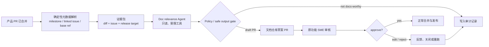
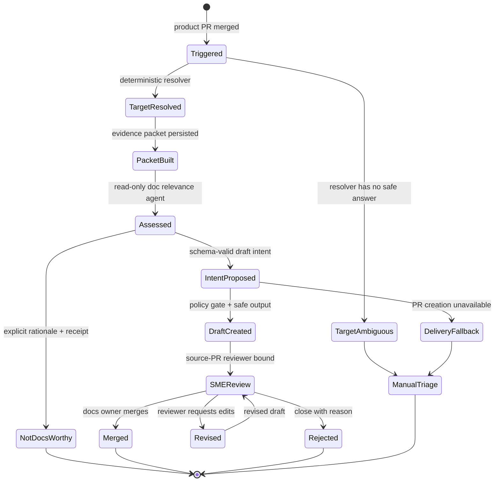
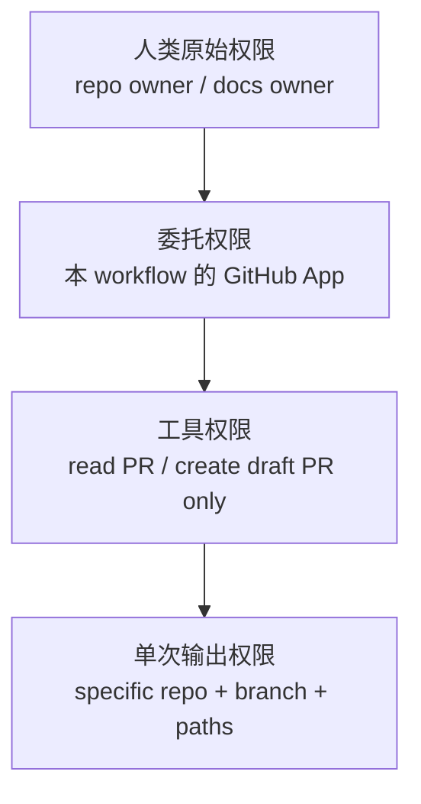

## 来源说明

本文由 2026-07-21 的研究发布流程触发。今天没有发现足以改变 Agent memory 基础架构的新一手材料；安全分支昨天已经发布多 Agent 白盒扫描器，因此不重复制造相邻主题。最强的新信号来自 GitHub 近期公开的一组 Agentic Workflows 实践，尤其是 Aspire 团队在 2026-07-08 公开的跨仓库文档自动化案例：产品代码在 `microsoft/aspire`，文档在 `microsoft/aspire.dev`；流程从已合并的产品 PR 出发，产生草案文档 PR，再由原始功能的领域专家（SME）审核。

核心一手来源：

1. GitHub Blog: [Automating cross-repo documentation with GitHub Agentic Workflows](https://github.blog/ai-and-ml/github-copilot/automating-cross-repo-documentation-with-github-agentic-workflows/)，2026-07-08。文章披露了事件触发、确定性目标分支解析、受限 `safe-outputs`、跨仓库 GitHub App、SME reviewer、失败复盘以及 30 天运行数据。[1]
2. GitHub Changelog: [GitHub Agentic Workflows is now in public preview](https://github.blog/changelog/2026-06-11-github-agentic-workflows-is-now-in-public-preview/)，2026-06-11。该公告确认工作流由 Markdown 描述并编译为 Actions YAML，默认只读、容器隔离、受安全输出与威胁检测约束。[2]
3. 开源实现与文档: [github/gh-aw](https://github.com/github/gh-aw)。仓库 README 说明该项目支持以 Markdown 编写并在 GitHub Actions 中运行 Agentic Workflows，默认只读写入须经过 sanitized `safe-outputs`；同时支持 Copilot、Claude、Codex 与 Gemini 等运行时。[3]
4. 对照材料: [GitHub Agentic Autofix](https://github.blog/changelog/2026-07-10-agentic-autofix-for-code-scanning-alerts-in-public-preview/)，2026-07-10。它采用“探索代码、生成修复、重跑原分析、创建草稿 PR”的闭环，说明 AI 生成改动应交给已有验证器和人审，而不是直接落地。[4]

事实边界必须说清：Aspire 的 396 次运行、82 个文档 PR、44.8 小时 median time-to-merge、100% merge 等数值是其作者在特定团队、特定 30 天窗口内的自述结果，不是对所有组织的承诺。我没有在本次研究中部署 `gh aw`、GitHub App 或 Aspire 的公开 workflow；本文的对象模型、策略、SOP、指标与回滚设计是我的工程建议。

本站已有文章分别讨论过文档 Agent 的可审计动作流、企业 Agent 控制面和研究证据 DAG。本文不重复“Agent 需要人审”这一泛结论，而是只解决一个更具体的问题：**一个已经合并的产品改动，怎样在不授予跨组织写入权限的前提下，变成可审查、可追溯、可回滚的跨仓库文档草案。**

## 先给结论

文档自动化的正确产物不是“Agent 自动更新文档”，而是：

> **受限证据包驱动的文档草案 PR，目标分支由确定性规则选定，写入由策略网关物化，最终准确性由最接近产品变更的 SME 审核。**

这一区别决定了系统是否能上线。

如果直接给 Agent 一个跨仓库 token，再让它读 diff、改文档、推分支，第一天就能跑通 demo，随后会依次遇到错误分支、无关文档 PR、权限过大、提示词注入、文档与代码版本错配、失败后静默丢失和审核责任不清。Aspire 的案例之所以有工程价值，不是因为模型会写 MDX，而是因为它把不确定性留在“是否需要文档、草案如何表达”这一层，把分支、仓库、文件、写入方式和审核人收紧为可检查的规则。[1]

我建议将跨仓库文档 Agent 设计为五段：



这条线的关键不是多 Agent，而是**确定性环节先行，Agent 只能提出受 schema 约束的意图，副作用始终由独立策略层执行**。

## 场景定义：为什么跨仓库文档最容易失控

选择一个很常见的产品组织结构：

- `product-repo`：服务、SDK 或 CLI 的代码与 release branch；
- `docs-repo`：网站、MDX、API reference 和独立部署流水线；
- `support-repo`：示例、FAQ 或 changelog；
- 贡献者、文档作者和 SME 分属不同团队。

当产品 PR 合并后，文档工作通常依赖某人“记得去写”。传统流程是：文档作者晚些时候看到 release，回头阅读旧 diff 和讨论，问功能作者几个问题，再把说明写到可能已经不匹配的目标分支。GitHub 博文把这一段称为 reverse-engineering tax：最懂功能的人已经切换到下一个任务，最需要上下文的人却在反向拼凑它。[1]

这不是单纯的写作效率问题，而是版本与责任问题：

| 原流程问题 | 实际后果 | 工作流应该产生的状态 |
| --- | --- | --- |
| 文档任务发现得晚 | 文档落后于已经发布的功能 | `DocCandidate` 与触发来源 |
| 目标 release branch 靠猜 | 文档写到错误版本，用户看不到 | `TargetResolution` 与规则证据 |
| Diff 直接塞入 prompt | 上下文膨胀，无关改动误触发 | `EvidencePacket` |
| Agent 拥有通用写权限 | 可改到非目标仓库、配置或敏感文件 | `DelegatedWritePolicy` |
| 文档 PR 没有对的人审核 | 文风正确但技术不准确 | `ReviewerBinding` |
| 失败只留 Action 日志 | 没人知道文档是否真的被遗漏 | `DeliveryReceipt` 或 `FallbackIssue` |

AI Native 的目标不是取消技术写作，而是把“从已合并变更回溯功能意图、判断要不要写、创建初稿、通知正确的人”这一重复链路变成可靠的工作流。概念性文档、教程、信息架构、示例质量和最终技术正确性仍需要人承担。

## 原流程与目标工作流的职责变化

先把谁负责什么说清楚。Agent 不应该拥有“决定功能已完成”的语义，更不应拥有“自动合并文档”的权限。

| 步骤 | 原流程 | AI Native 后 | 最终责任人 |
| --- | --- | --- | --- |
| 识别变更 | 文档作者人工浏览 PR | 事件触发 + Agent 判定 docs-worthy | 产品团队定义 rubric |
| 找发布位置 | 人工问 release owner | 确定性 milestone/issue/base-ref 解析 | 发布流程 owner |
| 汇集上下文 | 文档作者读 diff、issue、代码 | 预处理生成小型 evidence packet | workflow maintainer |
| 写初稿 | 文档作者从零起草 | Agent 建议并创建草案 PR | 文档作者 / SME |
| 技术核对 | 功能作者被动答疑 | 原 PR 审核人被绑定为 reviewer | 功能 SME |
| 合并发布 | 文档作者追踪状态 | 现有 docs CI + 人工 merge | 文档仓库 owner |
| 失败处理 | 私聊、忘记或重开任务 | fallback issue + receipt + 重跑去重 | workflow owner |

这种分工让 Agent 承担“证据操作与草稿劳动”，人承担“范围、准确性与发布决定”。没有这个分工，再高质量的内容生成也会变成无人负责的自动化噪声。

## 机制拆解一：分支解析必须在 Agent 醒来前完成

跨仓库流程中最容易被忽略、却最重要的事实是：文档应更新到哪个分支，不能让模型猜。

Aspire 的公开实现先在 bash 中解析目标分支，优先级依次是产品 PR milestone、关联 issue milestone、PR base ref 中的 release 分支、最后才是 `main`。[1] 这是一条极好的工程原则：**路由是确定性业务规则，不是语言模型的创作任务。**

可以把它表达为纯函数，便于单元测试和审计：

```ts
type TargetResolution = {
  branch: "main" | `release/${string}`;
  source: "pr_milestone" | "issue_milestone" | "base_ref" | "fallback";
  evidence: string[];
};

function resolveDocsBranch(pr: PullRequest, linkedIssues: Issue[]): TargetResolution {
  const fromPr = releaseBranch(pr.milestone?.title);
  if (fromPr) return { branch: fromPr, source: "pr_milestone", evidence: [`pr:${pr.number}`] };

  const fromIssue = linkedIssues.map(issue => releaseBranch(issue.milestone?.title)).find(Boolean);
  if (fromIssue) return { branch: fromIssue, source: "issue_milestone", evidence: linkedIssues.map(i => `issue:${i.number}`) };

  const fromBase = releaseBranch(pr.base.ref);
  if (fromBase) return { branch: fromBase, source: "base_ref", evidence: [`base:${pr.base.ref}`] };

  return { branch: "main", source: "fallback", evidence: ["no-release-metadata"] };
}
```

规则本身应与组织的 release policy 对齐。若当前组织没有 milestone-to-branch 约定，最先要补的是这个约定，而不是把分支名交给 Agent 推理。`fallback` 也不是默默写入 `main` 的许可证；它应该成为可观测信号。对于多版本维护的产品，我建议把 fallback 结果降级为“只创建 issue 或需要人工确认”，直到路由准确率达标。

## 机制拆解二：Evidence Packet 让 Agent 看见足够，但不能吞掉仓库

大 diff 直接进 prompt 既贵又容易误判。Aspire 的复盘也明确提到，他们把关联 issue、milestone、base ref 等元数据提前提取，让 Agent 接收小而结构化的摘要，而不是巨大负载。[1]

我的建议是把输入做成版本化 `EvidencePacket`，并且让 Agent 只读取 packet 与允许的只读文件。它不是一个“摘要文本”，而是一份可检索的事实清单：

```yaml
packet:
  id: "docpkt:product-repo:pr-842:sha-9cf2"
  source:
    repo: "org/product-repo"
    pr: 842
    merge_commit: "9cf2..."
    base_branch: "release/4.2"
  target:
    docs_repo: "org/docs-repo"
    branch: "release/4.2"
    resolution: "pr_milestone"
  change_summary:
    public_api_symbols: ["createExport", "ExportOptions.format"]
    changed_paths: ["src/export.ts", "docs/api/export.md"]
    excluded_paths: [".github/", "test/fixtures/"]
  linked_context:
    issues: ["#810"]
    release_notes: ["4.2 feature: export formats"]
  evidence_refs:
    - "github://org/product-repo@9cf2/src/export.ts#L20-L88"
    - "github://org/product-repo/issues/810"
  policy:
    max_context_bytes: 120000
    prohibited_files: ["AGENTS.md", "package-lock.json", ".github/**"]
```

这个 packet 带来三个收益。

第一，**可重放**。三周后有人质疑“为什么 Agent 认为这项改动要写文档”，可以复看当时的 packet，而不是依赖已经变化的 PR 页面。

第二，**可控成本**。变更摘要、公开 API、链接 issue 和 release target 是高信号输入；生成文件、测试 fixture、锁文件和大段无关重构应该在确定性预处理阶段剔除。

第三，**降低提示词注入面**。PR 描述、issue 和仓库文件都是不可信输入。它们可以成为证据，但不能成为工作流指令；Agent 的系统指令、工具权限和安全输出 schema 必须在输入之外固定。

## 机制拆解三：Agent 只能发意图，策略层才允许写入

GitHub Agentic Workflows 的安全输出模型值得直接借鉴：Agent 不直接调用 GitHub 写 API，而是产出一个描述“希望创建何种 PR/issue/comment”的结构化意图；另一个范围更窄的 handler 根据 allow-list 物化它。[1][2][3]

这层间接性看起来麻烦，实际是跨仓库自动化能被信任的原因。把写入拆开后，可以为每一个字段制定确定性策略：

```ts
type CreateDocsPrIntent = {
  packetId: string;
  targetRepo: string;
  baseBranch: string;
  title: string;
  changedFiles: Array<{ path: string; contentRef: string }>;
  reviewerLogin: string;
  rationale: string;
};

function validateIntent(intent: CreateDocsPrIntent, policy: DocsPolicy): string[] {
  const errors: string[] = [];
  if (intent.targetRepo !== policy.docsRepo) errors.push("target repo is not allow-listed");
  if (!policy.allowedBaseBranches.some(rule => matches(rule, intent.baseBranch))) errors.push("base branch is not allowed");
  if (!intent.title.startsWith("[docs] ")) errors.push("title prefix missing");
  if (intent.changedFiles.some(file => policy.protectedFiles.some(rule => matches(rule, file.path)))) errors.push("protected file requested");
  if (!policy.allowedReviewers.includes(intent.reviewerLogin)) errors.push("reviewer is not bound to source PR");
  return errors;
}
```

第一版的 policy 应该比你希望的更窄：

```yaml
docs_agent_policy:
  target_repo: "org/docs-repo"
  allowed_base_branches: ["main", "release/*"]
  allowed_paths: ["docs/**", "content/**", "reference/**"]
  protected_paths:
    - "AGENTS.md"
    - ".github/**"
    - "package.json"
    - "pnpm-lock.yaml"
    - "security/**"
  outputs:
    create_pull_request:
      draft: true
      title_prefix: "[docs] "
      fallback_as_issue: true
    comment_source_pr:
      allow_marker_only: true
  merge: "human_only"
  rerun:
    idempotency_key: "packet_id"
```

`draft: true` 和 `merge: human_only` 不是临时的保守开关，而是职责边界。内容 Agent 可以更换模型、重跑 prompt；写入策略必须像支付、部署或权限策略一样可评审、可测试、可版本化。

## 目标工作流与状态机

不要让这类工作流只有“success / failure”。对业务来说，`no_docs_needed`、`ambiguous_target`、`draft_created`、`review_rejected` 和 `delivery_fallback` 的意义完全不同。



这个状态机强迫系统公开不确定性。比如“Agent 判断不需要文档”并不是没有记录的空操作；它应该有 packet id、rationale、模型/规则版本和可抽样的审计记录。否则团队无法发现 Agent 把重要用户功能漏掉的系统性偏差。

## Agent、工具与人工审核点

第一版不需要多 Agent swarm。一个确定性预处理器、一个只读内容 Agent、一个策略网关和一个人审角色就够了。为了便于运营，可以定义如下职责：

| 角色 | 输入 | 输出 | 权限 | 人工检查 |
| --- | --- | --- | --- | --- |
| Trigger Resolver | merged PR event | 目标分支或 `ambiguous` | GitHub 元数据只读 | 路由异常 |
| Packet Builder | PR、issue、diff、release 元数据 | immutable evidence packet | GitHub 只读、确定性脚本 | PII/敏感路径过滤 |
| Documentation Agent | packet、docs 风格规则、只读 docs workspace | `no_docs_needed` 或 PR intent | 只读、工具 allow-list | 关键产品变更抽样 |
| Policy Gate | intent、policy version | allow / reject / fallback | 无模型、确定性 | 所有拒绝规则可审计 |
| Safe Output Handler | 已允许 intent | draft docs PR / source marker | 单 workflow GitHub App scope | 创建失败时 fallback |
| SME Reviewer | draft、source PR、evidence refs | approve / request changes / reject | 人工 GitHub 权限 | 每个文档 PR |

审核人绑定应优先使用源 PR 已有的 approver 或 feature owner，而不是随机分配给文档队列。Aspire 公开案例采用源 PR 审核人作为 docs reviewer；这是把“谁最懂改动”转化为可执行路由的好方法。[1] 但也要保留 fallback：源 PR 可能没有有效审阅人、审阅人离职或不负责用户文档，此时应转 docs owner，不要让 Agent 自选 reviewer。

## 数据、权限与跨仓库边界

跨仓库自动化最危险的反模式，是用一个可访问整个组织的长寿命 token 解决“文档在另一个 repo”这个便利问题。Aspire 的案例强调每个 workflow 使用范围限定到两个 repo 的 GitHub App，允许的 base branch、protected files 和输出类型也都是显式配置。[1]

我的最小权限模型包含三层：



必须遵守四条规则：

1. **读取与写入分离**：内容 Agent 只有读取权限；写入 handler 不理解自然语言，只消费通过 schema 的 intent。
2. **仓库范围固定**：token/app installation 只覆盖产品 repo 和 docs repo，不能用 `org/*` 作为生产默认值。
3. **路径范围固定**：允许写 `docs/**` 并不代表允许改 CI、依赖清单、指令文件或权限配置。
4. **证据与命令分离**：issue、PR body、代码注释和文档内容是输入证据，不可改变 agent 系统 prompt、工具策略或 output schema。

对于内部文档，packet 还要做敏感数据处理：默认排除 secrets、生产配置、私有客户名、事故细节、内部 roadmap 和法律意见。Agent 的“需要更多上下文”不能成为越权读数的理由；它应输出 `insufficient_evidence` 并转人工。

## 可复制 SOP：一周内做出可信试点

下面是一条只覆盖单一产品 repo 和单一 docs repo 的一周试点路径。它刻意不追求自动 merge。

### Day 1：冻结范围与基线

1. 选择一个有稳定 release branch 约定的产品，收集最近 30 个 merged PR。
2. 人工标注每个 PR 是否 docs-worthy、应写到哪个分支、应由谁审核。
3. 定义排除项：tests-only、依赖更新、内部 CI、日志改动、纯重构默认不创建文档草案。
4. 将 release mapping 写成 `branch-policy.yml`，先为 resolver 写单元测试。

### Day 2：构建 packet，不接 Agent

1. 用 GitHub event、PR metadata、linked issue、milestone 和 merge commit 生成 `EvidencePacket`。
2. 对每个 packet 存 hash、生成时间、过滤规则版本和 source URLs。
3. 人工检查 30 个 packet：分支是否正确、是否泄露敏感路径、是否漏掉公开 API 变更。

### Day 3：Shadow mode 内容判定

1. Agent 只输出结构化 `DocsAssessment`，不创建 PR。
2. 让人工对照 Day 1 金标，标注 false positive、false negative 与证据缺口。
3. 把“无文档需求”的理由要求为枚举值加少量证据，而不是一句泛话。

```json
{
  "packetId": "docpkt:pr-842:sha-9cf2",
  "decision": "needs_docs",
  "userSurface": ["new ExportOptions.format values"],
  "proposedFiles": ["docs/reference/export.md"],
  "evidenceRefs": ["github://.../src/export.ts#L20-L88"],
  "uncertainties": ["release note wording requires product owner review"]
}
```

### Day 4：接入草案 PR，但保留窄写入面

1. 将 Agent 输出转换为 intent；policy gate 校验 repo、branch、路径、标题、reviewer 与 idempotency key。
2. 创建 draft PR，禁止 auto-merge；如果 handler 失败，创建带 packet 链接的 issue。
3. 在源 PR 写一个固定 marker，重复运行时只更新该 marker，避免评论刷屏。

### Day 5：审核与回归

1. 让 source PR 的 SME 审核草案，强制留下 approve/edit/reject 原因。
2. 收集差异：技术错误、目标分支错误、遗漏、无用 PR、文风问题、权限拒绝与 delivery fallback。
3. 只修复出现频率最高的一种失败，不要同时换模型、扩大仓库和改 policy。

### Day 6-7：决定是否扩大

只有在分支路由、敏感数据过滤和 docs-worthiness 三项均通过门槛时，才扩大到第二个产品域；否则保持 shadow 或 draft-only。内容质量差时优先改 packet 与 rubric，而不是一味增加 prompt 长度或 Agent 数量。

## 质量指标、成本与 ROI

不要用“Agent 生成了多少篇文档”衡量成功。文档 PR 数量越多，可能只是噪声越多。应同时看质量、时效、人工成本和风险：

| 指标 | 定义 | 试点目标 |
| --- | --- | --- |
| Target branch accuracy | Agent workflow 选中的 docs branch 与人工金标一致率 | >= 99% |
| Docs-worthiness precision | 创建草案的 PR 中，SME 认为确实应写文档的比例 | >= 85% |
| Docs-worthiness recall | 人工认为应写文档的 merged PR 中，流程捕获的比例 | >= 80% |
| SME acceptance rate | 草案 PR 最终被合并的比例 | 先观察，不单独作为放量依据 |
| Median time-to-draft | 产品 PR merge 到 docs draft 出现的中位时间 | < 15 分钟 |
| Median time-to-merge | merge 到文档合并的中位时间 | 与人工基线比较 |
| Reviewer edit distance | SME 修改的行数 / Agent 新增修改行数 | 持续下降 |
| Unsafe intent block rate | policy 正确拒绝越权或保护文件 intent 的比例 | 必须 > 0 且全部可解释 |
| Silent drop rate | 应产生草案或 fallback，但没有任何 receipt 的比例 | 0 |
| Cost per accepted PR | 模型 + Actions + 人工审核时间 / 最终合并文档 PR | 低于人工 baseline |

Aspire 报告的 396 次运行中只创建了 82 个 docs PR，本身就是很好的提醒：不创建文档往往是正确结果；筛选质量比产量更重要。[1] 它也披露了早期 docs-worthiness 过宽，69 个文档 PR 中有 9 个被关闭，后来通过加入“CI、内部 helper、tests-only 不应触发”的负例收紧了 prompt。[1] 这说明评估需要保存 false positive 的类型，而不是只算一个总 acceptance rate。

成本可以先用一个诚实的账本计算：

```text
cost_per_accepted_pr =
  (model_tokens_cost + actions_minutes_cost + app_operations_cost + reviewer_minutes * loaded_hourly_rate)
  / accepted_docs_pr_count
```

注意分母必须是“被接受的文档 PR”或“经核实缩短了 time-to-docs 的任务”，不是所有 workflow run。否则系统用 300 次正确的 `no_docs_needed` 掩盖了高成本且质量差的草案生成。

## 失败模式与回滚方案

| 失败模式 | 表现 | 预防 | 回滚 / 处置 |
| --- | --- | --- | --- |
| 错误目标分支 | 4.2 功能文档写到 main | 确定性 resolver + 金标测试 | close draft，创建 manual triage，修 branch policy |
| 无关文档草案 | CI 或重构触发 docs PR | 明确反例 + shadow mode 标注 | close with reason，加入 rubric 回归集 |
| 内容技术错误 | 文档描述错误 API 行为 | SME 必审、证据 refs、draft-only | request edits，保留审阅差异作训练样本 |
| 提示词注入 | PR/issue 内容试图改变工作流 | 固定 system policy、证据/命令分离 | block intent，记录安全事件 |
| 跨仓库越权 | intent 指向非允许 repo 或受保护文件 | GitHub App scope + path policy | policy reject，轮换凭据并审计 attempts |
| delivery 失败 | PR 创建失败后没人知晓 | fallback issue + receipt SLO | 自动建 issue，人工处理，不重复盲重试 |
| 重复触发 | rerun 生成多份相同草案 | packet id idempotency key + marker comment | supersede old draft，只保留最新 run |
| 误把草案合并 | 自动化绕过审核 | `draft: true` + human-only merge | 立刻 revert docs PR，暂停 workflow，复查 policy |

回滚要区分内容与控制面。文档内容错误可以 revert 一次 PR；权限、策略或 prompt injection 问题则应立即禁用 safe output handler，保留只读 shadow mode，轮换 GitHub App 凭据，并复查所有近期 intents。不要通过“暂时把 Agent 关掉”掩盖缺失的审计记录。

## 局限分析

这个模式并不适合所有文档。

它最适合 API reference、配置项、CLI 参数、版本化行为、开发者指南里的局部增量。这些内容通常能从 diff、issue、测试和现有模板中建立足够证据。

它不适合让 Agent 独立完成叙事型概念文档、架构决策记录、迁移教程、示例程序或安全敏感说明。它们需要跨版本理解、用户研究、信息架构和经验判断，输出不应被“从 diff 推导”这一范式限制。

同时，GitHub 的公开案例与 `gh-aw` 的功能和版本都在快速演化中。实现时应固定 CLI/action 版本，审查生成的 lockfile，独立验证实际可用的权限模型与计费规则；不要把本文的 schema 当作任何具体工具的官方配置格式。

## 自审

- **来源可靠性**：核心事实来自 GitHub 官方 changelog、官方工程博客与开源仓库；案例统计明确标为作者报告，未当作独立实验结论。
- **非 README 复述**：正文围绕 branch resolver、evidence packet、intent-policy separation、状态机、权限层、SOP、指标和回滚做了独立工程设计。
- **站内差异**：聚焦跨仓库“代码变更到文档草案”的版本路由和安全写入边界，与既有的通用文档 Agent、研究证据与控制面文章不同。
- **可执行性**：给出了 schema、策略、状态机、五天试点和量化 release gate；团队可在一个 repo 对中以 shadow mode 验证。
- **安全与人工边界**：默认只读、受限 intent、draft-only、人审合并、fallback receipt；没有把 Agent 输出视为发布授权。
- **局限**：没有独立复现 Aspire 的工作流或其指标；本文不承诺模型能稳定判断所有 docs-worthy 变更。
