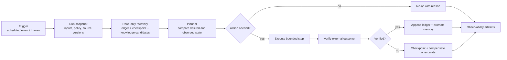
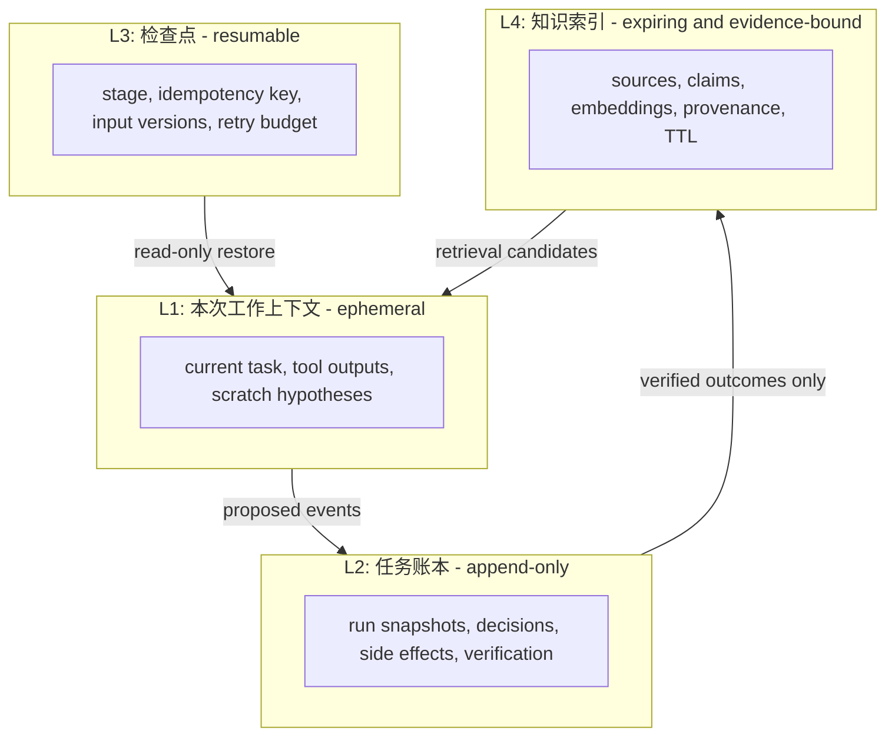
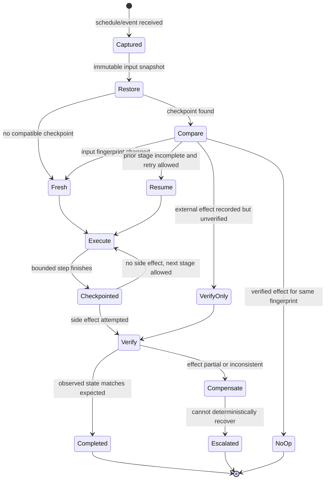

## 来源说明

本文是一篇面向定时研究、内容运营、研发运维与安全分析 Agent 的记忆系统设计笔记。讨论对象是**授权工作流**中的状态、检查点与审计，不是让 Agent 保存无限制的用户数据，也不把“持久记忆”描述为模型天然拥有的能力。

核心一手来源如下：

- GitHub Agentic Workflows Glossary：[Restore Memory](https://github.github.com/gh-aw/reference/glossary/#restore-memory-jobs-job-id-restore-memory) 与 [Repo Memory](https://github.github.com/gh-aw/reference/glossary/#repo-memory)。文档说明，`restore-memory: true` 可在确定性 job 运行前以只读方式恢复 `cache-memory`、`repo-memory`、`comment-memory`；其中 custom job 不会产生 cache save、repo push 或 safe-output write-back，目的是防止意外状态突变。文档也区分 cache memory 的 7 天保留与 repo memory 的持久分支存储。
- GitHub Agentic Workflows：[Compilation Process](https://github.github.com/gh-aw/reference/compilation-process/)。文档列出跨运行工件：结构化 `agent_output.json`、聚合 token 使用量、实际 prompt、firewall audit logs 与 `cache-memory`，并说明 pre-activation 会在模型执行前做角色、截止时间、去重等 gating 检查。
- GitHub Agentic Workflows：[Safe Outputs](https://github.github.com/gh-aw/reference/safe-outputs/)。文档说明 Agent 以只读方式产出结构化请求，由单独的权限受控 job 执行 GitHub 写操作；该分离用于最小权限、审计、抗提示注入和单动作限额。
- GitHub Agentic Workflows：[Security Architecture](https://github.github.com/gh-aw/introduction/architecture/)。文档把 artifacts、prompt、网络日志、token 使用与 `gh aw audit`/`gh aw status` 的可观测性列为调试、成本监控与安全审计基础，且明确将权限分离和 artifact preservation 作为不同安全层的一部分。
- 本站既有文章：[长程 Agent 的上下文压缩应该可逆](/articles/2026-07-02-reversible-context-orchestration-agent-memory/) 与 [代码 Agent 要先收敛证据包，而不是读完整仓库](/articles/2026-07-06-code-agent-evidence-packet-workflow/)。前者讨论单条长程轨迹的 raw/abstract/drop，后者讨论一次代码修复前的证据选择；本文处理的是另一个层次：**定时、可中断工作流如何跨多次运行管理任务事实、进度与发布状态**。

事实边界：上述 GitHub 文档中的 memory store、只读恢复、cache 的 7 天保留、repo memory、artifact、pre-activation、safe outputs 与可观测性能力均以文档当前表述为准，具体行为可能随工具版本变化。本文提出的四层记忆模型、schema、写入门槛、状态机、内容研究示例、数据保留、指标与 SOP 是我的工程建议，不是 GitHub 的产品保证。我没有在生产环境复现 GitHub Agentic Workflows 的全部实现。

稳定 slug：`2026-07-25-scheduled-agent-memory-ledger-checkpoints`。

## 先给结论

一个每天运行的 Agent，最容易犯的错误不是“忘记上一句话”，而是把以下四类信息混在一起：

- 本次运行临时读到的上下文；
- 已经验证、可复用的事实；
- 某个任务走到哪一步、是否已产生外部副作用；
- 已经不再可靠、应被过期或撤销的旧结论。

把聊天历史直接塞回下一次 prompt，只会让这些类别一起增长、互相污染。可靠的定时 Agent 应把记忆拆成：**短期工作上下文、不可变任务账本、可恢复检查点、受 TTL 和证据约束的知识索引**。模型可以读取这些对象并提出下一步，但不能把“我觉得做完了”直接写回为事实，更不能根据旧上下文重复发布、重复发工单或覆盖后来更新的数据。

工程上最重要的三条约束是：

1. **状态先于叙述**：是否发布、是否推送、是否已经验证，不由对话摘要判断，而由带版本、时间、证据和副作用记录的 ledger 判断。
2. **恢复不等于续写**：失败后的新运行先读取只读 checkpoint，比较当前输入版本和先前计划，再决定重试、补偿或从新阶段开始；不能无条件沿用旧工具轨迹。
3. **写入需要门槛**：研究结论、发布动作、外部 API 调用和长期偏好都要有来源、范围、过期策略与验证条件；没有这些元数据就只保留在本次运行上下文。



一句话：跨运行记忆不是“给 Agent 更长的历史”，而是让 Agent 在每次启动时都能重新辨认事实、未完成工作和不该再相信的旧状态。

## 场景定义：定时运行为什么比单次对话更难

以一个每天执行的研究发布 Agent 为例。它要收集新材料、检查站内重复、撰写文章、构建站点、提交、推送、部署并验证线上可见。一个看似简单的“每日任务”实际上跨越了多个不可靠边界：网页内容会更新、构建会失败、网络会超时、Git push 可能成功但部署失败、上次运行的文章可能已写完却未发布。

同样结构也出现在其他 AI Native 场景：

| 场景 | 输入会变化什么 | 重复或陈旧行动的代价 |
| --- | --- | --- |
| 每日研究/内容发布 | 论文版本、新闻、站内文章、搜索结果 | 重复写作、引用过期、将未上线内容说成已发布 |
| CI 失败分析 | commit、日志、测试环境、依赖版本 | 对已修复问题重复告警，或把旧堆栈用于新 commit |
| 安全发现分流 | 扫描结果、资产范围、修复状态、豁免 | 重复建单、误关闭、遗漏已升级的高风险项 |
| 客户知识运营 | 账户状态、权限、文档版本、反馈 | 用旧政策回复、把私密信息带入错误上下文 |
| 数据分析例行任务 | 数据快照、schema、仪表盘阈值 | 二次写入、错误对比、把延迟数据当实时数据 |

这些任务都不应该依赖“上一次聊天记得什么”。真正需要的是一条可查询的状态转换链：这次输入是什么版本、做了哪些尝试、什么外部结果已被验证、下一次从哪儿安全恢复。

## 原流程痛点：聊天记录、摘要和任务状态被混为一谈

很多 Agent 自动化的第一版会把上一轮对话压缩为一段 summary，然后在下一轮把 summary 加进 prompt。这有三个短期好处：实现快、语义看起来连续、模型好像“记得”过去。但在有外部副作用的任务上，它会迅速失效：

| 粗糙做法 | 表面效果 | 实际风险 |
| --- | --- | --- |
| 保存完整对话 | 模型能看到很多历史 | token 不受控，陈旧指令、失败推断和敏感文本永久回流 |
| 保存一句摘要 | 便宜、易实现 | “已部署”“已验证”没有 commit/deployment 证据，事实被叙述替代 |
| 用向量检索所有历史 | 似乎能找相似任务 | 语义相似不等于同一输入版本，容易错配旧结论 |
| 失败后原样重跑 | 容易实现重试 | 重复发评论、重复创建 Issue、覆盖已变更输入 |
| 成功后只记录 `done=true` | 看板很干净 | 无法区分构建成功、推送成功、部署 ready、真实页面可达 |

尤其危险的是“完成幻觉”：Agent 在本次上下文里看到命令输出的一部分，就总结“已经上线”；下次运行拿到这段摘要，又把它当成可依赖事实。正确做法不是让模型更谨慎地复述，而是把外部状态变成可重查的证据对象，例如 commit SHA、push remote、deployment ID、HTTP 验证时间和响应摘要。

GitHub Agentic Workflows 的文档里有一个很有启发的分离：workflow artifacts 保存 prompt、结构化 agent output、token 用量和 firewall 日志；safe outputs 将 Agent 的请求与实际权限写入 job 分开；custom job 的 `restore-memory` 则只读地恢复状态，避免报告/分析步骤意外修改 memory。这些能力不等于完整的记忆架构，但说明了同一个原则：**读取历史、提出计划、外部写入和审计证据应是不同对象、不同阶段、不同权限**。

## 四层记忆模型：把“知道什么”和“做过什么”拆开

我建议为定时 Agent 建立以下四层，而不是一个万能 memory store：



### L1：本次工作上下文

L1 是模型当前能看到的 prompt、工具结果和临时推断。它应该短、可丢弃、按任务最小化。原始网页、长日志、未证实的猜测和用户输入都可以暂时存在 L1，但不应自动成为跨运行记忆。

### L2：任务账本

L2 记录发生过什么，采用 append-only 事件，而不是用一条可覆盖的“当前摘要”。它是判断幂等、审计失败和恢复流程的事实源。每个事件应包含输入版本、执行身份、预期副作用、实际观察和证据引用。

### L3：检查点

L3 是从失败安全续跑所需的最小状态：当前 stage、已用预算、idempotency key、输入 fingerprint、下一步允许动作和恢复策略。它不是完整对话，也不是知识库。GitHub 文档将只读 restore 用于确定性 job 的设计很有价值：先读取状态做分析，不让恢复动作自动触发保存或外部写入。

### L4：知识索引

L4 保存可复用的外部事实和内部经验，但每一条都要带 provenance、scope、保留期和失效条件。研究论文的作者报告、官方 API 行为、一个仓库的 owner map、已经验证的失败模式都可以进入 L4；“我上次感觉这个模型更好”“这个链接似乎永久有效”不应直接进入。

## 数据模型：让记忆对象能被机器拒绝

### 任务账本事件

```ts
type RunStage =
  | "discovery"
  | "assessment"
  | "draft"
  | "build"
  | "commit"
  | "push"
  | "deploy"
  | "verify"
  | "compensate";

type LedgerEvent = {
  eventId: string;
  runId: string;
  at: string;
  stage: RunStage;
  kind: "started" | "proposed" | "succeeded" | "failed" | "skipped" | "verified";
  inputFingerprint: string;
  policyVersion: string;
  idempotencyKey: string;
  effect?: {
    system: "git" | "vercel" | "github" | "site";
    operation: string;
    reference: string;
  };
  evidence: Array<{
    uri: string;
    observedAt: string;
    digest?: string;
    excerpt?: string;
  }>;
  reasonCode?: string;
};
```

这里最重要的是 `inputFingerprint` 和 `effect.reference`。例如一篇文章的 publish run 可将 `post_path + content_digest + target_branch + policy_version` 哈希成输入指纹；`git push` 的 effect reference 是 commit SHA，`deploy` 是 deployment ID，`verify` 是带时间戳的 URL 与页面标题/内容摘要。没有这些信息，就不能安全判断“这次是不是上次那一次”。

### 检查点和知识条目

```ts
type Checkpoint = {
  runId: string;
  inputFingerprint: string;
  stage: RunStage;
  resumeAfter: string;
  retryCount: number;
  maxRetries: number;
  allowedNextStages: RunStage[];
  observedEffects: string[];
  createdAt: string;
  expiresAt: string;
};

type KnowledgeClaim = {
  claimId: string;
  statement: string;
  sourceRefs: string[];
  sourceType: "official-doc" | "paper" | "repo" | "run-evidence";
  scope: { system: string; version?: string; task?: string };
  confidence: "reported" | "verified" | "engineering-inference";
  observedAt: string;
  refreshAfter?: string;
  invalidatedBy?: string[];
};
```

`reported`、`verified` 与 `engineering-inference` 必须分开。论文作者报告的数字不是本团队复现；官方文档说明的功能不是所有部署环境已启用；一次运行成功也不是永久可靠性。把这些区别写进 schema，才能阻止下一次 Agent 把不确定信息润色成确定事实。

## 状态机：恢复前先比较，而不是从旧对话继续说

一个可恢复的 scheduler 应将“重复触发”“输入更新”“外部成功但本地未记录”“本地成功但外部未验证”视为一等状态：



这套状态机能回答几个真实问题：

- 上次 `git push` 成功但 Vercel 部署超时：下一次不应重新写文章或重新提交，只需在 `VerifyOnly` 检查 commit 是否已部署。
- 上次文章草稿已经存在，但 source fingerprint 变了：不能从旧 draft 继续发布，应回到 discovery/assessment，明确标出需要更新的来源。
- 定时器被重复触发：同一 `idempotencyKey` 已有 verified effect 则 no-op，而不是再发一条同样的内容。
- 运行预算耗尽：checkpoint 记录已做的只读发现和未做的外部写入；下次可恢复，但必须重新验证所有会产生副作用的前置条件。

## 记忆写入门槛：不是所有总结都配被保存

一个实用的 write gate 可以分成四类：

| 候选内容 | 默认去向 | 进入长期知识索引的条件 | 失效/删除条件 |
| --- | --- | --- |
| 工具长输出、网页段落、临时假设 | L1，运行结束即丢 | 通常不进入 | 运行结束 |
| `push succeeded`、deployment ID、页面验证 | L2 ledger | 有命令/API/浏览器证据 | 不删除，必要时追加更正事件 |
| 未完成 stage、剩余预算、重试原因 | L3 checkpoint | 有 input fingerprint 与过期时间 | 成功/补偿/TTL 到期 |
| 研究事实、项目机制、稳定团队规则 | L4 knowledge | 原始来源、范围、时间、置信度、刷新策略齐全 | 来源撤回、版本变化、TTL 到期、人工撤销 |
| 人类偏好或敏感资料 | 默认不记忆 | 明确授权、最小范围、访问控制与保留期 | 授权撤回/期限到期 |

这个门槛也解决“忘记”的问题。忘记不应是简单删掉所有旧数据：ledger 为了审计可以保留，但不能当作当前事实；知识条目在 `refreshAfter` 之后只能作为待复核候选，不能直接驱动行动；checkpoint 过期后应该走 `Fresh` 而非悄悄重试。

## 目标工作流：以研究发布 Agent 为例

### 原流程与目标流程

传统日更操作常是：打开一堆网页，写文章，构建，提交，部署；失败后第二天从印象继续。这会产生“内容已写但不知道是否上线”“同一来源反复研究”“上一轮网络异常被误解为发布失败”等问题。

目标流程应把每一步的输入、输出和恢复语义写出来：

| 阶段 | Agent/工具输入 | 结构化输出 | 人工审核点 | 失败兜底 |
| --- | --- | --- | --- | --- |
| Discovery | 当日窗口、主题词、已有文章索引 | source candidates + timestamps + source type | 无足够材料时批准暂缓 | 记录 `no_publish_insufficient_evidence` |
| Assessment | 原始来源、站内重复检索 | claim map、差异点、风险清单 | 支柱选题或敏感断言 | 降级为线索，不写成事实 |
| Draft | claim map、写作规则 | 草稿 digest、引用表、自审 | 发布前质量 gate | 保留 draft，不创建发布 effect |
| Build | 固定 commit、站点配置 | build result + generated route | 构建错误 | checkpoint 在 `build`，不提交 |
| Git | build proof、branch 状态 | commit SHA、push remote result | 有冲突或非预期变更 | 停止，避免强推 |
| Deploy | commit SHA、生产配置 | deployment ID、target、status | 生产切换 | 进入 `VerifyOnly`，不重复 push |
| Verify | canonical URL、文章标题/摘要 | browser evidence、verified timestamp | 页面异常 | 记录失败，标记待重试 |

### 目录与存储组合

文件并非唯一存储形式，但第一版应该可审计、可 diff。一个可行的组合是：

```text
agent-state/
  ledger/
    2026-07.jsonl                 # append-only events
  checkpoints/
    research-publish-<hash>.json  # short-lived resumable states
  knowledge/
    sources.jsonl                 # evidence-bound claims
    topic-index.json              # stable themes and article links
  policies/
    memory-write-gate.yml
    retention.yml
  artifacts/
    <run-id>/                     # immutable build/deploy/browser evidence
```

对于需要跨工作流共享的少量稳定事实，可以使用经过版本控制的仓库文件或专门的持久分支；对于短期重试状态，使用带 TTL 的 cache 或数据库记录；对于 prompt 原始输入、网络日志和部署证明，使用 run artifact。GitHub 的 `cache-memory`、`repo-memory` 与 workflow artifacts 的分层恰好对应了这类不同保留周期，但具体系统不必绑定某个框架。

## Agent、工具与人的分工

| 角色 | 负责什么 | 读什么 | 能写什么 |
| --- | --- | --- | --- |
| Scheduler | 生成 run ID、去重和并发控制 | trigger 元数据、active checkpoint | 新 checkpoint，不执行外部动作 |
| Recovery checker | 比较输入 fingerprint 与 ledger | L2/L3、当前外部状态 | `resume`/`verify_only`/`fresh` 决策 |
| Research Agent | 搜索、阅读、提出 claims | L1 + 受限 L4 候选 | 只提交候选 claim 和草稿 |
| Deterministic validator | schema、来源、build、digest、策略检查 | draft、policy、artifact | 验证结果、拒绝原因 |
| Release executor | Git push、生产部署、浏览器验证 | 已验证输入与 capability | 仅受控外部动作与 ledger effect |
| Human editor/owner | 处理边界案例、策略变化、异常发布 | 证据包、diff、ledger | 批准高影响动作、撤销、改策略 |

最值得坚持的一点是：**模型不拥有“把自己总结写进永久记忆”的直通道**。它只能提出候选；validator 决定 schema/来源是否合格；executor 执行外部动作后，只有观察到结果才能 append verified event。这比让一个 Agent 既写总结又相信总结多了一点步骤，却消除了大量跨运行幻觉。

## 工具栈选择理由与提示词模板

工具选择应该按状态类型，而不是按“最流行的向量库”决定：

| 需求 | 优先机制 | 原因 |
| --- | --- | --- |
| 幂等与审计 | JSONL/数据库 append-only ledger | 能保留事件顺序、前值和证据引用 |
| 失败恢复 | TTL checkpoint store | 快速找到可恢复 stage，过期后自动失效 |
| 研究发现 | provenance-aware 文档索引 + 检索 | 需要来源、时间与范围过滤，不只要语义相似 |
| 部署验证 | 浏览器/HTTP 证据 artifact | “部署成功”必须由用户路径观察确认 |
| 复杂治理 | 策略即代码 + schema validator | 更容易单测、审计和 code review |
| 低成本日常任务 | 规则/确定性工具优先，模型只处理歧义 | 防止所有状态判断都变成昂贵推理 |

研究 Agent 的任务模板可写成：

```text
You are proposing evidence, not writing durable memory.

Read-only inputs:
- Current run snapshot and date window
- Existing topic index and claims, each with source and refresh time
- Draft policy and publication ledger summary

Rules:
1. Treat old claims past refreshAfter as leads, not facts.
2. Do not claim an article is published without a ledger event with deployment and
   browser-verification evidence for the same content digest.
3. Return NO_PUBLISH when source material is insufficient or overlaps an existing
   article without a substantial new mechanism or experiment.
4. Every proposed long-term claim needs source URLs, observed time, scope, and an
   invalidation condition.
5. Output structured proposals only; never request direct external writes.
```

提示词不能替代 schema 和权限，但它能让 Agent 知道“停下、暂缓、请求复核”也是正确输出。工程系统随后必须真的接受这些输出，而不是在模型没有文章时强迫它编一篇。

## 可复制 SOP：七天内验证记忆是否真的提高可靠性

| 日期 | 工作 | 验证目标 | 不通过时怎么办 |
| --- | --- | --- | --- |
| Day 1 | 为一个日程任务定义 stage、side effect 与 input fingerprint | 团队能画出最小状态机 | 缩小任务到一个外部动作 |
| Day 2 | 实现 append-only ledger 和 schema 校验 | 每个 effect 都有证据 URI 和 idempotency key | 先禁止外部写，只做 dry-run |
| Day 3 | 加 checkpoint 与两类故障注入：网络超时、重复 trigger | 重试不会重复产生 effect | 修复去重与 `VerifyOnly` 分支 |
| Day 4 | 将知识条目加入 provenance、refreshAfter 与 invalidation | 过期事实不能直接驱动计划 | 把旧条目降为检索候选 |
| Day 5 | 用只读恢复跑一份报告/分析 job | 恢复过程不改变 memory 或外部状态 | 移除恢复 job 的写权限 |
| Day 6 | 对 20 个历史 run 回放恢复决策 | 能区分 no-op、resume、fresh、escalate | 为错误分类补充状态与原因码 |
| Day 7 | 统计重复 effect、人工排障时间、过期引用与 token | 证明可靠性改善或明确不值得 | 保留 ledger，停止扩大记忆范围 |

故障注入不必等真实事故：人为制造“push 成功但本地进程在 deploy 前中断”“部署 Ready 但 URL 检查失败”“同一 trigger 到达两次”“来源页面版本改变”等输入，检查系统是否能在不重写、不重复发布、不掩盖错误的前提下恢复。

## 可验证指标：记忆系统不是看起来连续就算成功

| 指标 | 计算方式 | 解释 |
| --- | --- | --- |
| 重复副作用率 | 相同 idempotency key 的重复外部写入 / 全部外部写入 | 最直接的 scheduler 安全指标，应接近 0 |
| 恢复正确率 | 回放中选对 `fresh/resume/verify_only/no-op` 的 run / 全部样本 | 衡量 checkpoint 与 fingerprint 是否足够 |
| 未验证完成率 | 只有计划/命令输出、没有外部观察证据却标记完成的 run / 完成 run | 防止完成幻觉 |
| 陈旧 claim 使用率 | 过 `refreshAfter` 的 claim 被当事实引用次数 / 全部 claim 使用 | 衡量忘记/刷新是否有效 |
| 记忆写入拒绝率 | 未满足 write gate 的候选 / 全部候选 | 过低可能是 gate 太松，过高可能是 Agent/模板质量差 |
| P95 恢复时长 | 从 trigger 到安全确定下一步的耗时 | 不应为可靠性付出不可接受的等待 |
| 人工排障分钟数 | 异常 run 的人工调查时间 | ledger/artifact 是否真的降低运维成本 |
| 上下文冗余 | 被注入 prompt 但本次未被引用的记忆 token / memory token | 控制“全部历史都塞进去”的退化 |

第一版不必追求“更多记忆带来更高任务成功率”。更现实的门槛是：在 20 个故障注入或历史回放样本中，零重复外部写入、零未验证发布声明，恢复正确率达到团队预设目标，并且 P95 恢复时长没有显著恶化。

## 失败模式与回滚方案

| 失败模式 | 早期信号 | 处理 | 回滚 |
| --- | --- | --- | --- |
| 账本写成可变摘要 | 历史“完成”状态被覆盖，无法解释差异 | 改为 append-only，保留纠正事件 | 从 artifact 与 Git/部署记录重建最小 ledger |
| checkpoint 污染 | 下一轮自动沿用旧输入或旧命令 | 强制 input fingerprint 比较和 TTL | 废弃 checkpoint，回到 Fresh |
| 过度记忆 | prompt 越来越长、陈旧链接持续出现 | 加 scope、TTL、检索预算和引用追踪 | 停止注入 L4，只用当前快照 |
| 外部结果没验证 | deploy command 返回却页面不可达 | 将 `deploy` 与 `verify` 拆 stage | 降级为 pending，禁止宣布成功 |
| 幂等键设计太粗 | 合法的新版本被误判 no-op | 将 content digest、target 和 policy version 纳入 key | 重新运行受影响的新 fingerprint |
| 幂等键设计太细 | 重试被当新任务，出现重复写入 | 统一 run intent 与 effect key | 关闭 executor，人工补偿重复副作用 |
| 长期知识泄露或越权 | 敏感文本被跨任务检索 | 分类、访问控制、默认不持久化、保留期 | 删除索引条目、轮换凭据、审计消费者 |
| 记忆被模型自证 | 无来源的“已知事实”反复出现 | write gate 要求来源与 validator | 标记 invalidated，清理派生摘要 |

补偿必须是确定性动作。比如错误添加的标签可以按 ledger 前值移除；错误发布的草稿可撤销为 draft/redirect；错误的知识条目应追加 invalidation event 并阻止检索，而不是静默改写历史。这也是账本优于聊天摘要的地方：过去发生过什么可以保留，当前是否应信任它则由新事件决定。

## 适用场景与局限分析

这套设计适合存在可识别阶段、外部副作用、重复 trigger 风险、需要审计或需要跨天恢复的 Agent。研究发布、CI 诊断、安全扫描、项目运营、数据报表和长期客服知识任务都属于这一类。

它不适合把所有个人偏好、所有对话全文或所有网页都保存为长期记忆。对于纯一次性问答，四层系统可能是过度工程；对于高度实时且状态由强事务系统管理的流程，Agent ledger 应是观察/编排层，不应取代业务数据库的权威状态。

还有两个现实限制。第一，来源和 artifact 能提高可审计性，但不能保证来源本身正确；研究结论仍要区分作者报告、复现结果和工程推断。第二，GitHub Agentic Workflows 的具体 memory store、retention、artifact 生命周期和 safe-output 行为是其工具实现的一部分，其他 Agent 平台需要按自身权限和存储模型重新验证，不能照抄字段名。

## 我会如何实现与验证

如果要在一个每天发布研究笔记的站点上实施，我会先只记录四个外部效果：`build_passed`、`commit_created`、`push_confirmed`、`article_browser_verified`。每个 effect 都关联同一份 `contentDigest`、commit SHA 或 deployment ID；任何“已发布”的输出必须查询到该 digest 的 browser verification event。

第二步是加入 24 小时 TTL 的 checkpoint：网络超时后，只允许进入 `VerifyOnly`，先检查远端 commit、Vercel status 与文章 URL；只有确认没有 effect 时才重新执行 deploy。第三步才把研究 claim 放入带来源和刷新期的索引，并用每天的站内标题/摘要索引做重复检查。这样最早解决的是“重复与误报上线”，而不是一开始就做复杂的向量记忆。

我会用 20 次受控回放验证：5 次重复 trigger、5 次 deploy 后验证失败、5 次 source 更新、5 次构建失败。成功标准是零重复发布、所有已发布声明都有在线验证证据、所有旧 source 在刷新期外自动降级为待复核候选。达不到这些条件，就不扩大记忆范围，也不把更多原始对话写进去。

## 自审

- **事实可靠性**：关于只读 `restore-memory`、cache/repo memory、workflow artifacts、pre-activation、safe outputs 和可观测性能力的陈述均链接到 GitHub Agentic Workflows 官方文档；工具特性与本文建议明确区分。
- **来源完整性**：引用 4 份一手技术文档并与站内两篇相邻主题文章对比，说明这篇文章解决的是跨运行任务状态而非一般上下文压缩。
- **工程价值**：包含四层模型、两张架构图、状态机、TypeScript schema、目录结构、提示词、角色分工、七天 SOP、故障注入、指标、失败/回滚与实现顺序。
- **薄内容与标题检查**：文章没有把“记忆”抽象成聊天记录或营销概念；标题准确描述了定时 Agent 的实际问题，正文给出状态与验证边界。
- **不确定性与隐私**：没有把来源报告当作亲自复现；要求敏感数据默认不持久化、带 scope/TTL/访问控制，并承认 artifact 与来源的局限。
- **站内重复检查**：与 7 月 2 日可逆上下文、7 月 6 日代码证据包、7 月 24 日 Issue 授权分别处于运行时上下文、单次编码、外部写权限和跨运行记忆的不同层次。
