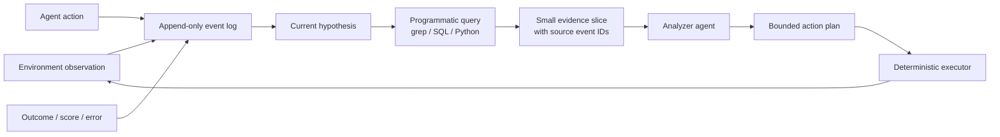
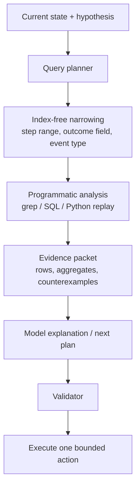
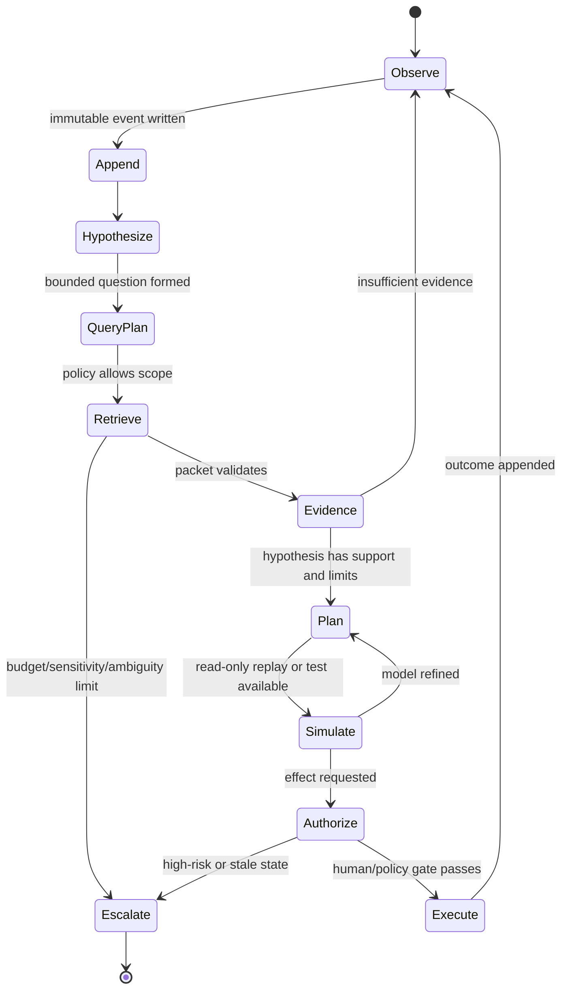

## 来源说明

本文讨论长程、授权任务中的记忆与上下文工程。它不主张把所有用户数据、生产日志或完整聊天记录永久保存，更不把研究基准上的结果包装成真实业务系统的生产承诺。

核心来源如下：

- Alexis Fox 等：[PRO-LONG: Programmatic Memory Enables Long-Horizon Reasoning](https://arxiv.org/abs/2607.20064)，arXiv:2607.20064v1，2026-07-22。论文提出 programmatic memory：harness 将每一步 observation、action、outcome 追加到结构化日志，Agent 以代码和文本工具搜索日志。作者在 ARC-AGI-3 的 25 个公开游戏上报告，PRO-LONG 相对同一 coding agent 的 no-log baseline 平均提高 18.0 个百分点；在匹配设置下，相对若干专用 harness 使用 4.2 到 5.8 倍更少的 billed tokens。本文把这些明确标为作者报告结果。
- 论文正文的 [方法与消融](https://arxiv.org/abs/2607.20064)。我核对了 write/read 定义、每条日志的 action number/level/attempt/score/plan/action/result、完整日志与最近 25 步/无日志条件、工具阶梯消融、workspace persistence 消融、评分与比较限制。论文作者还说明不同模型/游戏运行方差明显，部分外部 baseline 的选择过程或重复 run 不完整。
- 开源实现：[alexisfox7/PRO-LONG](https://github.com/alexisfox7/PRO-LONG)。README 说明默认 full log、`--log-window 25`、无 log 和 stateless workspace 四种条件；实现中 analyzer 在 sandbox Docker container 内通过 read/grep/Python 读日志，输出 JSON action plan，再由 action queue 按步执行。仓库还提供 scorecards 与部分 Fable 5 脱敏 logs，剩余 cohort logs 表示将分批发布。
- 本站既有文章：[定时 Agent 的记忆不是历史聊天](/articles/2026-07-25-scheduled-agent-memory-ledger-checkpoints/)。那篇文章讨论跨运行任务状态、checkpoint 和发布副作用；本文讨论**一条长程探索轨迹的内部记忆**。前者回答“任务是否已发布、能否安全重试”，本文回答“在数百步探索中，模型该怎样保留和查询已经发生的证据”。

事实边界：论文的 benchmark、分数、token/cost、基线和 ablation 均为作者报告，尚未经过我的独立复现；开源仓库中的命令、目录、日志可用性与架构描述来自其 README。本文的企业/研发迁移方案、schema、权限边界、查询预算、SOP 和指标是我的工程推断。ARC-AGI-3 是未知规则的游戏环境，不等同于代码库、研究资料或生产事故环境。

稳定 slug：`2026-07-26-pro-long-programmatic-memory-agent`。

## 先给结论

长程 Agent 的记忆问题，通常被错误地简化成“该不该把历史摘要进 prompt”。PRO-LONG 给出的更有力选择是：**先把历史保存在 prompt 之外的完整、结构化证据日志中；需要时再让 Agent 用程序去问具体问题。**

它的核心不是新向量库，也不是更复杂的多 Agent 编排，而是两条极朴素的规则：

1. 写入时少做判断：每个 observation、action 和 outcome 都以可解析的形式 append；不在写入时凭模型猜测“这条以后有没有用”。
2. 读取时做计算：用 `grep`、正则、Python 或小脚本围绕当前假设搜索、分组、回放、统计，而不是把整条历史重新塞入上下文窗口。

论文在 ARC-AGI-3 上报告了强结果，但真正可迁移的不是“全量日志一定胜过所有摘要”。更稳的判断是：当任务满足**过去细节会在很久以后决定当前行动、过程状态可被结构化、Agent 已有可靠 coding tools、并且能控制日志权限和查询成本**时，programmatic memory 值得成为默认基线。反过来，含高敏感数据、无法结构化、强实时或只需短上下文的任务，完整日志可能带来隐私、存储和检索噪声，而不是收益。



一句话：不要把“记住”实现为反复讲述过去；把过去变成可检索、可回放、可反驳的证据，再让模型在需要时做有限推理。

## 技术问题：完整保存与可用检索为何长期冲突

长程探索任务会不断产生状态、试验、失败路径和局部规律。只保存最近状态有两个明显缺口：早期的反例被遗忘，且当前状态往往不能解释环境规则。把全部历史放进 prompt 则带来另一端的问题：token 成本上升、注意力被稀释、工具输出堆积，模型越来越难定位一个数百步之前的关键转折。

常见方案各自解决一部分问题：

| 方案 | 写入策略 | 读取策略 | 主要风险 |
| --- | --- | --- | --- |
| 滑动窗口 | 保留最近 N 步 | 直接放 prompt | 远期因果和反例消失 |
| 自由摘要/反思 | 模型挑选“重要”信息 | 摘要进入 prompt | 写入时丢失细节，错误摘要会自我强化 |
| 向量检索 | chunk + embedding | 语义近邻 | 相似文本未必对应同一状态、同一时间或可执行反例 |
| 显式世界模型 | 写入结构化假设 | 用模拟器/规划器 | 建模成本高，错误模型可能成为新的单点事实 |
| programmatic memory | append 全量结构化事件 | 代码、正则、聚合、回放 | 日志膨胀、查询能力不足、敏感数据保留 |

PRO-LONG 的新意不在于否定摘要、向量或世界模型，而在于将**完整原始轨迹**和**当前可访问上下文**彻底分开。论文区分 accessed state（当前模型调用窗口）与 accessible state（只能经工具读取的外部状态）。这使 Agent 无需在每一步决定什么必须记住；它可以在新的假设出现后，回到日志检索当时的证据。

这对隐藏规则、长反馈回路和反复试验尤其重要。一个早期操作带来的 score change、异常文本或状态转移，可能在 200 步后才被理解为环境机制。若写入阶段已把它压缩成“尝试失败”，后续推理无法恢复细节；若其保留为结构化记录，Agent 可以重放同类动作、统计差异并写一个可执行模型验证猜想。

## PRO-LONG 的机制拆解

### 1. Append-all write：日志是地面事实，不是心得体会

论文的写路径把每一步 append 到 `logs.txt`，每条包含 action number、level、attempt、score、Agent 的简短计划、选定 action 和 resulting board。这里“完整”有边界：并不是把整个模型内部推理永久保存，而是保存 Agent 与环境交互的可观察事实和行动记录。

可以抽象为如下事件协议：

```json
{
  "event_id": "run-42:step-187",
  "at": "2026-07-26T09:15:03Z",
  "episode": { "level": 4, "attempt": 2, "step": 187 },
  "observation": {
    "kind": "board",
    "digest": "sha256:...",
    "payload_ref": "artifacts/run-42/boards/0187.txt"
  },
  "action": { "kind": "move", "arguments": { "direction": "left" } },
  "outcome": { "score_delta": 10, "terminal": false, "error": null },
  "plan_summary": "test whether the blue switch persists after rewind",
  "provenance": { "agent_version": "v1", "environment_version": "pinned" }
}
```

我认为可迁移时应补上 `digest`、artifact reference、environment version 和 schema version。PRO-LONG 的游戏板可以直接放入日志；真实研发系统的长日志、截图、二进制或敏感载荷则应放到受控 artifact store，主日志只保存哈希、类型、可访问引用和最小可检索字段。否则“lossless”很快会变成“无权限边界的大型泄露面”。

### 2. Programmatic read：让工具做筛选，让模型做解释

PRO-LONG 的 Agent 用 read、grep 和 Python 读取完整日志。论文展示一个实例：Agent 写 `regress.py` 重放所有 action，以检查自己编码的游戏模型是否预测了已记录的 board states。仓库实现进一步把 analyzer 与 executor 拆开：analyzer 输出 JSON action plan，action queue 每次只 drain 一个 action；队列清空或 score 改变时才重新调用 analyzer。

这可以理解为一条查询管线：



关键约束是：模型不应把完整日志读回 prompt 后才开始思考。它先产生一个查询问题，例如“所有 score 增加发生在哪些 action 后？”“尝试 2 与尝试 3 在开关状态上有什么差别？”“我的 transition function 是否能解释事件 80-120？”然后让确定性工具返回小证据包。模型负责提出假设、解释证据和计划下一个受限动作；工具负责筛选、计数、回放和比较。

### 3. 动作队列：把长计划与环境反馈拆开

长程 Agent 很容易在每一个微动作都重新调用模型，既昂贵又容易失去局部计划。PRO-LONG 的 action queue 把 analyzer 的 JSON plan 一步步执行，在队列耗尽或 score 变化时再重新分析。这不是让模型无限信任旧计划，而是把**可预测的局部执行**和**需要重新解释的状态变化**分开。

对于非游戏任务，可以迁移为：

- 数据清理 Agent：先生成最多 20 条无副作用的检查列表，遇到 schema 变化、质量阈值触发或写入请求时重新推理。
- 代码调查 Agent：先执行已批准的只读 `rg`/AST 查询队列，发现跨模块证据冲突时再请求模型重新规划。
- 研究 Agent：先抓取已列出的原始来源和元数据，遇到来源版本变化、引用冲突或内容不足时中断撰写，回到 assessment。

任何会修改生产数据、发布内容、关闭 issue 或执行外部请求的动作，都不能仅凭旧队列自动执行；它必须触发新的验证门和权限检查。

## 论文结果：该相信什么，不该外推什么

论文的定量结果很有价值，但需要按证据强度读取：

| 作者报告 | 我能得出的工程信号 | 不能直接得出的结论 |
| --- | --- | --- |
| PRO-LONG 相对 no-log baseline 平均 +18.0pp | 结构化完整轨迹在该类任务中有显著价值 | 所有业务 Agent 都会提升 18pp |
| 与特定专用 harness 相比 4.2-5.8x 更少 billed tokens | 简化的 append+code-search 可能降低“维护上下文”的推理成本 | programmatic memory 天然比所有 RAG/图谱系统便宜 |
| grep/regex/Python 工具阶梯从 23.1 到 41.2 | 更强的程序化分析与日志价值相关 | 仅给 Agent Python 就能解决长期记忆 |
| full log 优于最近 25 步/无 log，差距随 best@k 变大 | 长期证据保留对高方差探索可能扩大可解任务集合 | 任何任务都不应摘要或删除 |
| 清空 workspace 对 PRO-LONG 影响小于 no-log | 外部事件日志可减少对自写 notes 的依赖 | workspace、notes、结构化模型从此无用 |

论文自己也给出重要边界。它在固定的 ARC-AGI-3 公开游戏集上评估，游戏规则未知但状态表示和 action space 受控；所有重复 run 是独立的，任务之间不传递信息；不同模型/游戏方差显著；若干外部 baseline 的选择与重复数据不完全公开。仓库公开了 scorecards 和部分脱敏 logs，但并非全部 cohort logs 已完全发布。因此最佳姿势是：把 PRO-LONG 当作一个很强的**可复现设计假设**，而不是一个已经跨领域证实的通用定理。

## 从游戏迁移到真实 Agent：需要加上的四个控制层

完整事件日志在研究游戏里很干净，在生产任务里却会遇到权限、隐私、跨系统一致性和成本问题。我的建议是在 PRO-LONG 的 write/read 核心外加四层控制：

| 控制层 | 解决的问题 | 最小实现 |
| --- | --- | --- |
| 事件 schema 与 provenance | 日志文本无法比较、来源不清 | event ID、actor、input digest、schema/version、artifact ref |
| 分区与访问控制 | 将客户数据或密钥跨任务检索 | tenant/task partition、field-level redaction、短期 signed ref |
| 查询预算与 evidence contract | Agent 漫游全量日志、重新塞爆上下文 | 每轮文件数/行数/执行时间上限；每个结论必须回链 event IDs |
| 写入与外部副作用 gate | 旧日志驱动错误发布/修改 | append 可广，effect 需审批、幂等键、当前状态验证 |

### 事件 schema 不是可选装饰

文本 log 可用 `grep`，但没有稳定字段的日志会很快退化。每条记录至少需支持按时间、episode/task、事件类型、实体、输入版本、结果和权限域过滤。即使底层保留 JSONL，也可以在运行时派生 SQLite/DuckDB 表或小型索引，供 Agent 用 SQL 和 Python 做聚合。不要在第一版同时建立全套知识图谱；先让“某结论来自哪些 event”和“某 event 属于哪个 task”可回答。

```sql
SELECT action.kind, COUNT(*) AS n, AVG(outcome.score_delta) AS mean_delta
FROM events
WHERE run_id = :run
  AND outcome.score_delta IS NOT NULL
  AND event_time >= :window_start
GROUP BY action.kind
ORDER BY mean_delta DESC;
```

上面的查询比“回忆一下什么动作最有效”更值得交给 Agent。查询结果回到 prompt 时应保留 query、snapshot ID 和返回行的 event IDs；否则下一步写出的解释无法被 reviewer 或后续 Agent 复核。

### 全量保留不等于全量可读

对研究轨迹可以保留原始 evidence；对真实系统，应采用“可验证引用 + 最小可见载荷”。例如安全扫描日志可存 hash、规则 ID、代码位置和受保护 artifact；客户工单可存去标识化类别和 tenant-scoped reference；发布工作流可存 commit/deployment URL 和浏览器验证摘要。Agent 的 tool 接口默认只返回允许范围的片段，并记录每一次检索。

这也是对 memory injection 的防御：过往日志、外部网页或用户内容都应被视为证据，不应被当成新的系统指令。固定策略、允许工具、写权限和数据范围来自受保护配置；日志文本无权要求 Agent 上传文件、跳过验证或扩大网络访问。

## 一个可落地的实现方案：研究与研发双用途的 TraceStore

下面不是复刻 PRO-LONG，而是把它的可迁移最小核心用于团队的长程 Agent：

```text
trace-store/
  schemas/
    event.schema.json
    evidence-packet.schema.json
  runs/
    <run-id>/events.jsonl
    <run-id>/artifacts/
    <run-id>/index.sqlite
  policies/
    access.yml
    query-budget.yml
    retention.yml
  tools/
    trace_query.py
    trace_replay.py
    trace_diff.py
  reports/
    <run-id>/evidence-packets/
```

### 组件与数据流

| 组件 | 输入 | 输出 | 权限 |
| --- | --- | --- | --- |
| Event writer | observation、action、outcome | append-only `events.jsonl`、artifact digest | 只能 append，不改历史 |
| Indexer | 已验证 events | SQLite/Parquet 可查询投影 | 无外网、无外部写入 |
| Query planner Agent | 当前问题、schema、摘要索引 | 有预算的查询计划 | 不直接读原始敏感 artifact |
| Trace tools | 计划、scoped store | evidence packet、聚合/反例 | 只读、记录 query audit |
| Reasoner Agent | 当前状态、evidence packet | 下一步假设或 bounded plan | 不拥有部署/生产写权限 |
| Effect executor | 已批准 plan、当前状态验证 | 外部动作和结果 event | 仅动作级 capability |
| Human reviewer | packet、action diff、审计轨迹 | 采纳/拒绝/升级原因码 | 高影响动作最终裁决 |

### Evidence packet 合同

每次 programmatic retrieval 后，系统应限制模型看到的不是自由文本堆，而是一份结构化证据包：

```json
{
  "question": "哪个配置变化最可能解释延迟突增？",
  "snapshot": "run-8@event-391",
  "queries": [
    { "tool": "sql", "digest": "sha256:...", "row_count": 12 },
    { "tool": "trace_diff", "digest": "sha256:...", "row_count": 4 }
  ],
  "supporting_events": ["e-122", "e-174", "e-208"],
  "counterexamples": ["e-233"],
  "limitations": ["no control run for region B"],
  "recommended_next_check": "replay config A/B on the fixed fixture"
}
```

`counterexamples` 和 `limitations` 很重要。没有它们，完整日志也可能只被 Agent 用来搜支持自己结论的片段。PRO-LONG 的游戏环境有明确 score；业务场景则应显式要求反证检索和验证建议。

## 状态机：让查询、计划和副作用彼此隔离



在这台状态机里，append history 与 external effect 是完全不同的写操作。前者可以是自动化的、审计型的；后者必须检查当前状态、幂等键和权限。这一边界能避免“某次日志里看起来成功过”被误用为“今天可以直接发布或删除”。

## 可复制 SOP：一周验证 programmatic memory 是否值得引入

### Day 1-2：选择一个真的需要远期证据的任务

不要拿一次三步的 FAQ 来验证。选择一个 30-200 步、有重复尝试、可得到客观反馈的任务，例如：复杂 CI 失败定位、数据 pipeline 异常调查、授权的白盒规则调试、跨多份原始论文的研究证据整理。定义 observation/action/outcome 和任务成功标准，先不接任何 LLM 写入。

### Day 3：只实现 append 与两个确定性查询

建立 JSONL event schema、按 task 分区的 artifact 引用和两个工具：一个按字段过滤/聚合，一个按 event ID 回放/比较。用手工构造的 10 条轨迹验证：每条查询的答案都可追到原事件，且不能越过 task/tenant 边界。

### Day 4：引入 evidence packet，不让模型裸读全量日志

让 Agent 只能请求声明式查询：时间窗口、event type、实体、字段和最大行数。工具返回 packet，要求模型在输出中引用 event IDs，且在高影响判断时写出至少一个反例搜索。记录 token、查询次数、返回行数和人工复核时间。

### Day 5：对照三种 memory condition

与 PRO-LONG 的精神一致，但不照搬游戏环境：

| 条件 | 历史可见性 | 目的 |
| --- | --- | --- |
| recent-only | 最近 N 个 event 直接进 prompt | 代表滑动窗口 |
| summary-only | 人工/模型摘要 + 当前输入 | 代表压缩记忆 |
| programmatic | 全量事件外置、预算化查询 | 测试完整可访问性是否值得 |

对同一批任务保持模型、工具权限、时间预算和成功标准一致。不要只比较“回答是否流畅”，要比较是否找回关键早期证据、是否产生错误行动、成本和复核时间。

### Day 6-7：做失败注入与发布决策

注入四种情况：早期反例被最近事件淹没、日志中包含伪指令、artifact 权限被拒、查询超预算。通过条件不是 Agent 总能完成，而是它能在缺证据或越权时停下并报出准确 reason code。达到门槛后，再把范围从只读分析扩展到低风险 action；没有达到则保留日志与离线评测，停止扩大写权限。

## 质量、成本与 ROI 指标

| 指标 | 定义 | 目的 |
| --- | --- | --- |
| 远期证据召回率 | 需要早期 event 的样本中，被正确找回的比例 | 判断全量可访问性是否解决遗忘 |
| 证据可追溯率 | 结论中能回链 event IDs/artifacts 的比例 | 防止模型将日志改写成无来源叙事 |
| 反例覆盖率 | 高影响结论中执行过反证查询的比例 | 控制确认偏误 |
| 上下文压缩率 | 注入 prompt 的 evidence tokens / 可访问历史 tokens | 衡量是否避免把全量日志重新塞进上下文 |
| 查询预算违例率 | 超出行数、文件、时间或权限限制的请求 / 全部请求 | 审计检索是否失控 |
| 长程任务成功率 | 按预定义 verifier 成功的任务 / 全部任务 | 不能用模型自评代替 |
| 单个已验证成功成本 | 模型 + 计算 + 存储 + 人审成本 / verified successes | 防止完整日志只提升效果却无限烧钱 |
| 敏感数据越界率 | 被拒绝或审计发现的跨 scope 读取 / 全部读取 | 必须为 0 才能扩大场景 |

ROI 的保守表达是：

```text
net_value =
  (verified_successes_delta * estimated_manual_minutes_avoided * blended_cost)
  - (model_cost + query_compute + artifact_storage + reviewer_minutes + maintenance)
```

不应把“模型调用变少”直接记为 ROI。若 programmatic search 让 Agent 花更多工具时间、增加 artifact 存储或让 reviewer 读更长 packet，这些都必须计入成本。论文在基准上的 token 优势是有价值的研究信号，不是业务 ROI 的替代品。

## 失败模式与回滚方案

| 失败模式 | 早期信号 | 处理 | 回滚 |
| --- | --- | --- | --- |
| 日志变成不可解析文本 | 查询靠模糊 grep，字段缺失率上升 | 版本化 schema，拒绝不合格 event | 保留原 artifact，重建索引投影 |
| 日志过大、查询漫游 | 每轮扫描全量文件，token/时延上升 | 行数/时间预算、索引、分区过滤 | 回退为 recent window + 人工触发深查 |
| 日志中的内容被当指令 | 查询结果要求上传、跳过验证或执行命令 | 数据与控制面隔离、prompt 明确标不可信 | 禁止该 artifact 再进入 Agent 上下文，审计读取 |
| 全量保留引入敏感数据风险 | 跨 tenant 引用、artifact 权限拒绝 | 最小字段、redaction、短期引用、ACL | 删除派生索引、轮换访问凭据、事件审计 |
| 选择性检索支持既有假设 | packet 没有 counterexample，结论过度自信 | 强制反证查询和 limitations 字段 | 降级为“待验证”，不执行 effect |
| 旧轨迹驱动新副作用 | 当前输入 digest 与历史不匹配 | 每个 effect 前重验 snapshot/幂等键 | 停止 executor，进入人工补偿 |
| 任务本身无需长期记忆 | 指标无提升、管理成本高 | 缩小到滑动窗口或规则工具 | 停用 TraceStore，但保留必要审计日志 |

## 适用场景与局限分析

programmatic memory 特别适合：未知规则需要试验、过去反例会改变当前计划、轨迹能自然序列化、工具能执行确定性分析、任务可由客观 verifier 判断的场景。ARC 游戏、复杂诊断、实验调参、白盒分析验证、跨多轮资料调查都在这个区域。

它不适合：短小且完全由当前输入决定的任务；没有稳定任务边界的开放式聊天；无法控制数据敏感性的跨用户日志；必须毫秒级返回且不能承担查询开销的请求；没有可验证 outcome、只能靠主观质量评价的场景。在这些情况中，完整轨迹可能只是更昂贵的噪声。

更根本的局限是因果归因。PRO-LONG 的消融显示程序化访问和完整日志相关于性能提升，但仍在特定 harness、模型、工具和游戏分布上测得。业务 Agent 还会受数据质量、权限、工作流设计、人类审核、外部系统延迟和激励机制影响。不能因为日志可回放，就以为 Agent 的解释一定正确；可回放只让错误更容易被定位和反驳。

## 我会如何实现与验证

如果在一个授权的研发调查 Agent 中实施，我会从每次 CI 失败的诊断开始。系统只 append：commit SHA、CI job、结构化错误摘要、命令、exit code、改动 diff digest、测试结果和受保护日志 artifact。Agent 的第一版只拿到三个工具：按字段 SQL 查询、按 event ID 读取 200 行以内片段、在固定 fixture 上重放一个测试。它不拿生产凭据，也不允许修改代码。

我会选择 30 个已关闭的 CI 事故作为回放集，并人为标出哪些需要早期证据。对照 recent-only、summary-only 和 programmatic 三种条件，记录远期证据召回、错误归因、token、查询量和人工审阅分钟数。只有当 programmatic 条件在远期证据召回和已验证诊断上有清晰增益，同时没有权限越界、查询预算失控和显著的复核成本上升，才让它生成修复建议；再之后才考虑受控的草稿 PR。

对于研究发布任务，等价做法是保留来源版本、主张、引用片段、站内相似文章、构建/部署证据为事件；查询工具负责找“同一主张的更新版本”“尚未覆盖的机制差异”“本次草稿引用的原始来源”。这既保留完整可回溯记录，也避免让旧聊天摘要决定今天是否该发布。

## 自审

- **事实可靠性**：PRO-LONG 的日期、定义、ARC-AGI-3 范围、作者报告的分数/token、工具阶梯、workspace 消融、日志结构、动作队列与开源可用性均链接到论文或作者仓库；全部数值标为作者报告，未声称独立复现。
- **来源完整性**：使用论文、论文方法/消融与开源实现三类一手证据；说明仓库只部分发布 cohort logs 的限制。
- **站内差异**：7 月 25 日文章处理跨运行账本、checkpoint 和副作用；本文处理单条长程轨迹的 append-all/programmatic read，且给出更细的工具与查询协议。
- **工程价值**：包含机制图、状态机、事件 schema、SQL、evidence packet、TraceStore 目录、角色分工、七天对照实验、指标、成本与回滚。
- **薄内容与标题检查**：不是论文摘要复述；明确哪些机制可迁移、哪些不能外推，标题准确描述方法与边界，不承诺通用性能提升。
- **安全与隐私**：强调全量保留不等于全量可读，要求 artifact 分区、ACL、query audit、最小字段和副作用 gate；不涉及第三方攻击或未授权数据处理。
