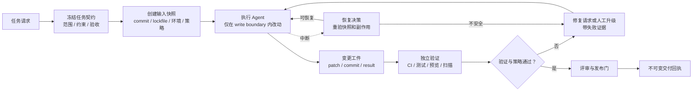
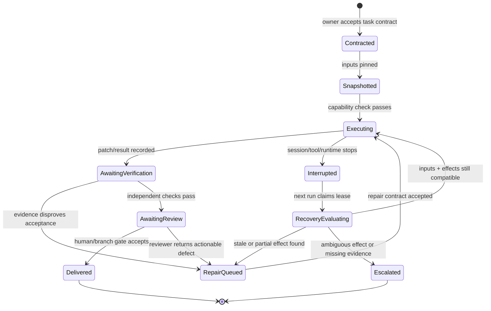

## 来源说明

这篇文章讨论的是授权研发环境里的 Agent 交付与恢复，不讨论绕过代码审查、提权或把私有推理过程收集为员工监控数据。它的出发点很简单：长任务被中断以后，接手它的 Agent 或人不需要重放一大段聊天，也不该依赖一段看起来通顺、但无法核对的总结；他们需要知道**要交付什么、当前代码与环境是什么、做过什么、哪些结果已验证、下一步是否仍然安全**。

本次研究的核心一手来源如下：

1. [Loom 开源仓库](https://github.com/valkor-ai/loom)。README 将长任务组织成 plan、build、test、fix、preview、handoff 的循环，并公开了 `.loom/` 状态、请求引用、结果文件、review record、repair request 与 handoff evidence 等对象；它强调把执行与验证拆开，并按任务路由上下文，而不是反复读取整个仓库。[1]
2. [Loomline Technical Report](https://zonodqioyxil6r3k.public.blob.vercel-storage.com/Loomline-v0.pdf)，2026-06-11。该报告把生产交付与单纯代码生成区分开，主张在需求、架构、实现、测试、审查、部署和演进中保留可验证、可恢复的工件；这是项目愿景和设计立场，不是独立基准的性能证明。[2]
3. [Dapr Workflow 官方文档](https://docs.dapr.io/developing-applications/building-blocks/workflow/workflow-overview/)。文档说明 workflow 可启动、暂停、恢复、终止和查询状态；父工作流可选择向子工作流传递执行历史；并可用 callee-side allow-list 的 `WorkflowAccessPolicy` 约束哪些应用能够调用特定 workflow 或 activity。[3]
4. [Agent Trajectories 开源仓库](https://github.com/AgentWorkforce/trajectories)。它将章节、事件、决策、工件、Git revision 和多人 handoff 做成可导出记录，也支持将轨迹压缩为较小的交接对象。[4]
5. [Agent Skills 开放规范](https://agentskills.io/home) 与 [OpenAI 对 Skills 的说明](https://help.openai.com/en/articles/20001066)。规范把 skill 定义为含 `SKILL.md` 的目录，可带脚本、参考资料和模板；它采用 discovery、activation、execution 的渐进加载。该模型适合承载版本化的操作程序，但并不代替任务状态机。[5][6]

事实边界需要特别强调：Loom、Dapr、Trajectories 和 Skills 分别是独立项目或规范，不构成一个统一标准；它们宣称的能力不能直接推导出团队的交付质量或 ROI。我没有在这次发布中部署上述项目。下文的对象模型、文件协议、权限策略、指标、成本模型和一周试点是我的工程设计建议。Trajectories README 使用了 “train of thought” 这类表述；本文**不建议**采集或持久化模型的隐藏推理链，而只记录对交付、审查和恢复必要的外显事实、决策摘要与证据引用。

站内差异：7 月 25 日的[定时 Agent 记忆账本](/articles/2026-07-25-scheduled-agent-memory-ledger-checkpoints/)解决的是跨运行任务状态与外部副作用；7 月 22 日的[diff 锚定代码审查](/articles/2026-07-22-diff-anchored-code-review-agent/)解决的是怎样对一个变更提出可接受的审查意见；7 月 26 日的[PRO-LONG 解读](/articles/2026-07-26-pro-long-programmatic-memory-agent/)关注单条长程探索怎样保存和检索原始证据。本文进一步收窄到**研发交付交接**：任务如何在模型、会话、工作人员与重试之间移交，并维持“可继续”和“可发布”这两个截然不同的状态。

稳定 slug：`2026-08-11-recoverable-ai-coding-delivery-contract`。

## 先给结论

AI Coding Agent 的长期记忆不应该是一份“它曾经怎么想”的档案，而应该是一份**可验证交付记录**：

> 一个新会话只要读取任务契约、不可变输入快照、变更边界、验证回执、未决风险与批准记录，就能判断该恢复、重跑、修复还是停下请求人工决定；它不需要、也不应获得上一会话的完整推理过程。

这会带来四个工程约束：

1. **状态不是叙述**：`deployment_verified`、`tests_failed`、`review_requested` 必须由有证据的状态转换得出，不能由 Agent 的总结句子得出。
2. **续跑先重判，不续写**：恢复时要重算代码基线、依赖、密钥可用性、任务版本和已有副作用；不匹配就创建新的 attempt，而不是继续执行旧计划。
3. **写入和验证分离**：实现 Agent 能提交受限 patch；验证 Agent 或 CI 产生独立回执；发布与高影响修复保留人工门。
4. **交接物应可压缩**：保留用于审计的原始输出引用，但给下一个 Agent 的是短小、结构化、按权限过滤的 resume packet。



这里的“可恢复”不是“让另一位 Agent 继续打字”，而是一个可被程序执行的判断。

## 场景定义：一个会跨会话的功能交付

假设团队要给既有服务增加一个“导出任务状态”的 API。任务包含代码、schema migration、权限校验、单元与集成测试、预览环境检查、文档更新和 PR 审核。它会遇到典型现实条件：

- Agent 在实现到一半时上下文达到上限或运行环境中断；
- CI 因临时服务不可用失败，不能直接归因到代码；
- 另一个 PR 已经改变了同一个数据模型；
- 新会话拿到的 token 只允许读仓库，不允许部署；
- 需求 owner 修改了“只允许管理员导出”的验收条件；
- 人工 reviewer 只愿意看关键设计取舍与测试证据，不会读数千行聊天记录。

传统流程里，开发者或 Agent 只能翻聊天、终端滚动记录、临时笔记和 CI 页面。所谓交接往往是一段“已经做完大部分，测试可能有点问题”的自然语言。它同时丢失了基线、证据、权限与未决项，下一位执行者只能再读一遍仓库并猜测是否可以继续。

AI Native 工作流不是让 Agent 自己宣布完成，而是把“交付”拆成可独立核对的工件和转换：

| 交付问题 | 原流程 | 目标工作流中的对象 | 谁做最终判断 |
| --- | --- | --- | --- |
| 需求是否变了 | 聊天里追加一句 | `task-contract.json` 的版本与 diff | 产品 / 技术 owner |
| 代码基线是什么 | “我基于最新 main” | `input-snapshot.json` 的 commit、lockfile digest | 恢复控制器 |
| Agent 能改哪里 | 大范围 repo write | `write-boundary.yaml` | repo owner |
| 测试是否真通过 | Agent 口头总结 | `verification-receipt.json` | CI / reviewer |
| 失败为何发生 | 一段日志或猜测 | `failure-classification` + artifact ref | 验证者 / on-call |
| 是否可重试 | 重跑同一 prompt | `recovery-decision.json` | 恢复控制器 |
| 是否可合并或发布 | Agent “完成了” | approval + protected branch status | 人工与现有平台门禁 |

## 原流程痛点：为什么“保存会话”不足以实现恢复

长任务并非只是上下文长度问题。至少有六种状态会在下一会话到来前变化：

| 失真来源 | 仅保存聊天会发生什么 | 正确的恢复信号 |
| --- | --- | --- |
| Git HEAD 已变化 | 旧 patch 打在错误基线 | `base_commit` 与 merge-base 比较 |
| 需求被更新 | 继续实现被撤回的规则 | contract version 与 acceptance diff |
| 测试基础设施抖动 | 把环境故障“修复”为代码改动 | 退出码、服务 health、日志位置与重跑结果 |
| 外部副作用已发生 | 再次部署、重复建 migration | idempotency key、deployment receipt、数据库版本 |
| 权限变更 | 新会话沿用旧 token 假设 | capability snapshot 与 policy version |
| 模型和工具升级 | 旧操作建议不再适用 | runtime image、tool version 与 prompt/skill digest |

这也是为什么把“上次对话摘要”直接写进 `AGENTS.md`、memory 或系统提示词是不稳妥的。它既无法证明陈述仍然为真，又可能把未经审查的文本升级为下一次 Agent 的操作指令。长期状态应从 prompt 里移出，变为只读、可筛选、可验证的控制面对象。

### 不保存思维链，不等于不保存决策

需要区分三个层级：

| 记录类型 | 是否进入交付记录 | 原因 |
| --- | --- | --- |
| 可观察事实 | 是 | 例如 commit、测试命令、退出码、生成的报告、PR URL |
| 决策摘要 | 有条件地是 | 记录“选方案 B，因为 A 与现有租户隔离冲突”，并链接 ADR / issue / diff |
| 隐藏推理过程、敏感 prompt 片段、原始凭据 | 否 | 对恢复通常无必要，且可能泄露敏感数据、扩大审计和滥用风险 |

“决策摘要”必须可以被质疑。它不是模型自评的长文，而是一个含 alternatives、evidence refs、owner 和 expiry 的小对象。例如“迁移采用 expand/contract，因为回滚窗口要求双读两周”应能指向架构决策和 schema diff；“模型认为这样更优雅”不能充当恢复依据。

## 目标工作流：交付契约驱动的有限状态机

Loom 的价值在于将 plan、build、test、fix、preview、handoff 变成显式循环，并把结果和修复记录留在可检查的项目状态中。[1] Dapr Workflow 则提供了启动、暂停、恢复、终止、状态查询、历史传递与调用方 allow-list 等可复用的编排语义。[3] 但把两者直接拼在一起还不够：Agent 工作流还要区分“可以继续执行”和“允许改变外部世界”。

我建议把一次交付建模为下面的状态机：



其中 `AwaitingVerification` 与 `AwaitingReview` 不能被跳过。测试“绿了”并不自动等于可以合并；而 reviewer 的“看起来没问题”也不应覆盖一个缺少 provenance 的测试回执。

### Agent / 工具 / 人的最小分工

| 角色 | 可读取 | 可写入 | 禁止动作 | 成功输出 |
| --- | --- | --- | --- |
| Contract compiler | issue、PRD、repo policy | contract draft | 改代码、部署 | schema-valid contract |
| Planner | contract、snapshot、相关代码索引 | bounded task plan | 推送、修改 policy | task units + verification intent |
| Implementer | task unit、局部代码、已批准 skill | write boundary 内的文件与 patch artifact | 改 CI secrets、合并、部署 | patch + TaskResult |
| Verifier | patch、测试工具、预览环境 | immutable receipt | 修改被测代码 | pass/fail/inconclusive evidence |
| Recovery controller | ledger、snapshot、effect receipts | recovery decision | 直接重做副作用 | resume / compensate / escalate |
| Human reviewer | contract、diff、receipt、risk summary | approval/rejection | 被迫读完整轨迹 | signed decision |

这里的技能（Skill）只承担“如何执行一个受准许步骤”的可版本化程序：例如某框架的测试方法、浏览器验收清单或数据库迁移规范。开放规范的渐进加载正适合减小上下文占用。[5] 但 Skill 不能自行扩大 write boundary 或把它自己的说明当授权书。

## 数据与权限边界：一个可落地的目录协议

第一版不需要引入新数据库。对一个 Git 驱动的软件仓库，采用受保护目录、JSON Schema、CI artifact 和已有 PR 平台就够了：

```text
.agent-delivery/
  contracts/TASK-481.v3.json          # 可审查的需求、验收与风险
  snapshots/TASK-481/a02c.json        # 不可变输入与运行时快照
  plans/TASK-481/a02c.yaml            # 受限任务单元，不含授权
  results/TASK-481/a02c/impl-01.json  # Agent 的外显结果与 artifact refs
  receipts/TASK-481/a02c/test-01.json # CI/验证者写入，不由实现 Agent 写
  recovery/TASK-481/a02c.json         # 新运行的恢复判断
  approvals/TASK-481/a02c.json        # reviewer / release gate 决定
  policy/write-boundary.yaml           # 路径、命令、环境与副作用限制
```

`contracts`、`policy` 和 `approvals` 应受 CODEOWNERS 或等效的保护分支规则约束。`results` 可由 Agent 写入，但不能声称任何外部动作已经完成；`receipts` 必须由 CI、受限 verifier 或人工写入。这样即使实现 Agent 的 prompt 被污染，它最多能产出不可信 patch 或 result，不能伪造发布完成。

### 核心接口：把“完成”改写成可检查结构

```ts
type DeliveryAttempt = {
  taskId: string;
  attemptId: string;
  contract: { id: string; version: number; digest: string };
  input: {
    baseCommit: string;
    mergeBase: string;
    lockfileDigest: string;
    runtimeImage: string;
    policyDigest: string;
  };
  writeBoundary: {
    paths: string[];
    allowedCommands: string[];
    effects: Array<"none" | "preview" | "draft-pr">;
  };
  resultRefs: string[];
  verification: "not_started" | "passed" | "failed" | "inconclusive";
  delivery: "not_requested" | "awaiting_review" | "approved" | "rejected";
};

type VerificationReceipt = {
  receiptId: string;
  attemptId: string;
  verifier: { kind: "ci" | "human" | "isolated-agent"; version: string };
  checks: Array<{
    id: string;
    commandOrSuite: string;
    outcome: "pass" | "fail" | "inconclusive";
    artifactRef: string;
  }>;
  observedAt: string;
  inputDigest: string;
  signatureOrRunUrl: string;
};
```

注意 `VerificationReceipt` 中没有 `agent_confidence` 作为通过条件。自信度可以用来安排人工注意力，但不能替代测试、扫描、预览或 review 的外部证据。

### 写入策略：能力令牌不等于任务授权

将权限分为四层，且每一层都要在 attempt 创建时快照：

| 层级 | 例子 | 处理方式 |
| --- | --- | --- |
| 身份 | 服务账户是谁 | 映射到短期、可撤销身份 |
| 能力 | 可以读仓库、创建草稿 PR | 平台 token 的粗粒度权限 |
| 任务授权 | 只改 `src/export/**` 与 `tests/export/**` | 由 contract + policy 编译为 write boundary |
| 副作用批准 | 可以部署到 preview、可以合并 | 独立 gate，要求回执或人工签名 |

这与 Dapr 在被调用方做 allow-list 的思路一致：调用者即使能发起请求，activity 也要自行检查调用来源和名字是否被准许。[3] 对 Coding Agent 而言，应把这个检查放在执行器和 CI 网关中，而不是只写在自然语言提示词里。

## 执行 SOP：一周内可以跑出的最小闭环

选择一个有稳定测试命令、一个预览环境和低风险 feature 的仓库。不要从 production deploy 或数据库 destructive migration 开始。

### Day 1：定义一个可拒绝的任务契约

将一个 issue 编译为 `task-contract.json`，至少写清：

- `goal`：要增加或修复的用户可观察行为；
- `nonGoals`：明确不改的模块、接口或发布范围；
- `acceptance`：可运行、可观察的验收条件；
- `riskTier`：只读、代码改动、预览、生产变更；
- `owners`：产品、代码、测试与发布责任人；
- `requiredEvidence`：每个验收条件对应的测试、截图、API response 或人工审查；
- `expiry`：需求超过多久必须重新确认。

人工确认这里不是走形式。模糊需求进入自动化只会产生更快的返工。

### Day 2：冻结快照并设置狭窄写入边界

创建 attempt 时记录 `baseCommit`、lockfile digest、Node/Python/runtime image、policy version 与相关 feature flag。把可写路径缩到任务必要范围；仓库配置、workflows、secrets、release 配置和权限文件默认不可写。

```yaml
attempt: TASK-481/a02c
write:
  include:
    - src/export/**
    - tests/export/**
    - docs/api/export.md
  exclude:
    - .github/workflows/**
    - infra/**
    - '**/.env*'
commands:
  allow:
    - npm run test:export
    - npm run lint
    - npm run preview
effects:
  allow:
    - preview
  requireHumanApproval:
    - merge
    - production-deploy
```

### Day 3：让实现 Agent 交付 patch，而非“完成宣言”

给 implementer 的输入只包含 contract、局部索引、相关 file refs、允许的 skill 版本和当前未通过的证据。输出固定为：修改列表、每项修改对应的 acceptance ID、运行过的命令、已知未覆盖项、patch/commit ref。禁止它写入 `receipts` 或 `approvals`。

### Day 4：独立验证与浏览器闭环

Verifier 在干净 checkout 或 CI 中执行测试。对前端行为，测试回执应至少附：可访问 URL、浏览器检查、截图或 trace ref、build commit；对后端接口，附最小请求/响应或契约测试结果。Loom 将实现和 review/repair 分开并要求记录证据，这个方向比“让同一个 Agent 复读自己写的代码”更可靠。[1]

CI 失败必须三分：

```text
code_failure         = 在可重现的相同输入上断言失败
environment_failure  = 依赖服务、网络或 runner 失效，代码断言未被执行
inconclusive         = 证据不够，禁止自动修复或自动标记通过
```

### Day 5：恢复演练，而不是只测顺利路径

在 patch 已生成、测试尚未结束时故意终止一次运行。新的控制器只读取 `contract`、`snapshot`、`result`、`receipt` 和已有外部副作用回执，然后执行：

```ts
function decideRecovery(current: CurrentWorld, saved: DeliveryAttempt) {
  if (current.contractDigest !== saved.contract.digest) return "escalate_contract_changed";
  if (!isDescendant(current.head, saved.input.baseCommit)) return "create_rebase_repair";
  if (current.policyDigest !== saved.input.policyDigest) return "re_authorize";
  if (hasAmbiguousExternalEffect(saved.resultRefs)) return "escalate_effect_unknown";
  if (hasFailedReceiptForCurrentInput(saved)) return "repair_from_failure";
  return "resume_bounded_step";
}
```

`resume_bounded_step` 不是继续原 shell；它是基于当前快照新建一条执行记录，并从上一次的验证证据重新推导下一步。

### Day 6：人工评审与发布门

review packet 只展示：目标、风险、关键 diff、验收映射、失败/未覆盖项、验证回执、恢复历史与需要决策的问题。它不展示冗长 Agent 对话，更不能诱导 reviewer 为了赶进度接受“AI 说没问题”。只有 protected branch 的既有规则与指定 reviewer 都通过，状态才从 `AwaitingReview` 进入 `Delivered`。

### Day 7：量化复盘并决定是否扩大范围

按下节指标对照 baseline。若验证证据完整率、恢复安全率或 reviewer 接受率没有改善，就缩小任务类型或停用自动执行，只保留证据包生成。自动化不应因为“已经搭好了”而继续扩大权限。

## 质量、ROI 与成本：测交付闭环，不测 Agent 话术

建议至少记录四类指标：

| 维度 | 指标 | 计算方式 | 反作弊约束 |
| --- | --- | --- | --- |
| 可验证性 | evidence completeness | 有有效 receipt 的验收项 / 全部验收项 | receipt 必须绑定 input digest |
| 恢复 | safe recovery rate | 无重复副作用且正确进入下一状态的恢复 / 恢复尝试 | 采样人工复核 effect receipt |
| 质量 | post-merge escape rate | 合并后 N 天发现的该任务缺陷 / 已合并任务 | 按 risk tier 分桶 |
| 效率 | reviewer decision latency | request review 到明确决定的中位时长 | 不用“Agent 总运行时长”冒充效率 |
| 成本 | verified task cost | 模型 + CI + sandbox + 人审时长的总成本 / 有效交付数 | 剔除被 policy 拒绝的无效重试 |

可以用一个简单成本模型比较试点前后：

```text
cost_per_verified_delivery =
  (model_tokens_cost + ci_minutes_cost + sandbox_cost + reviewer_minutes * reviewer_rate)
  / verified_deliveries

net_value =
  saved_engineer_minutes * engineer_rate
  - total_delivery_cost
  - post_merge_incident_cost
```

这里的重点不是承诺“某模型让研发提速 X%”，而是观察证据包是否真的减少了 reviewer 的反向追溯时间，同时没有把缺陷转移到 merge 之后。第一周的样本量通常不足以证明长期 ROI；它只足够告诉团队这条工作流是否可控、是否值得继续收集数据。

## 失败模式与回滚方案

| 失败模式 | 早期信号 | 立即处置 | 回滚/长期修复 |
| --- | --- | --- | --- |
| 需求漂移 | contract digest 变化 | 停止执行，创建确认请求 | 新版本 contract 重新快照 |
| Agent 改到边界外 | path policy violation | 拒绝 patch，不进入 verifier | 收窄 allow-list，审计 prompt/skill 来源 |
| 同一 Agent 自证正确 | result 没有独立 receipt | 状态卡在 `AwaitingVerification` | 独立 CI 或 reviewer 生成 receipt |
| CI 环境抖动被当成代码 bug | health check 失败、断言未执行 | 标记 `inconclusive`，不生成修复 patch | 修复 runner 健康检查，重跑对照 |
| 中断后重复部署 | 缺少 idempotency / effect ref | 停止恢复，人工核对外部系统 | 给 preview/deploy 加 idempotency key 与 receipt |
| 轨迹泄露敏感信息 | result 包含 prompt、token、客户数据 | 隔离 artifact，撤销访问，通知 owner | 最小载荷、脱敏、保留期与访问审计 |
| 过度自动化 | 高风险任务进入自动执行 | 降级为 draft/建议模式 | 风险分级与批准门重新评估 |

特别值得保留的是 `inconclusive`。没有足够证据时，让流程明确停住比让 Agent 编造“应该是环境问题”更有价值。Dapr 的暂停、恢复、终止和状态查询能力说明编排框架可以提供这一类控制面操作；实际团队仍要自己定义何时允许恢复、何时必须人工升级。[3]

## 适用场景与不适用场景

最适合：跨会话的 feature/bugfix、已有 CI 的仓库、需要多人 handoff、需要把 Agent 修改纳入既有 PR 流程、以及部署前能在 preview 验证的 Web/API 项目。它也适合在多 Agent 之间传递最小状态，而不会让每个角色重读整个 repo。

暂不适合：没有测试和可观察验收条件的探索性原型、需求 owner 无法响应的高不确定性项目、必须保存大量敏感运行数据但尚未建立访问控制的环境、直接作用于生产资金/医疗/基础设施的不可逆操作。此时应把 Agent 限制为研究、草案或只读分析，而非让它推进交付状态机。

## 局限分析

- **状态机不创造正确需求**：contract 质量差，只会让错误流程被更稳定地执行。
- **证据也可能失真**：测试通过不代表覆盖了用户真正需要的行为；因此验收映射与人工审查仍不可省略。
- **工件有维护成本**：schema、保留期、访问控制、artifact 存储和 CI 集成都要维护。对只有十分钟的一次性脚本，这套协议可能过重。
- **项目资料不是通用证据**：Loom 和 Trajectories 的 README 描述实现和目标，不代表已被独立大规模验证；Dapr 的 durable workflow 语义也不能自动覆盖 Git、云平台或业务 API 的幂等性。
- **可审计不等于可监控**：记录应服务于交付、恢复和安全，不应用于无边界地采集个人行为或模型隐藏推理。

## 我会如何实现与验证

若在一个真实 TypeScript 服务中落地，我会先只实现 `.agent-delivery/` 的 schema 校验、Git snapshot、path policy、CI receipt 与 recovery decision 五件事，存储仍放在 Git 与 CI artifact 中。第一条流水线只允许修改一个低风险目录、创建 draft PR 和部署 preview，禁止 merge 与 production deploy。

随后选 10 个相似难度的任务：5 个走现有人工流程，5 个走交付契约流程。每个 Agent 中断至少一次；每次恢复都检查是否发生重复外部副作用、是否重新核对了基线、reviewer 是否能仅凭 packet 作出决定。只有当 evidence completeness 达到预设阈值、恢复没有越权或重复动作、且 post-merge 缺陷没有恶化时，才将范围扩大到更多任务类型。

## 自审

- **事实可靠性**：关于 Loom、Dapr、Trajectories 和 Agent Skills 的机制均链接到项目仓库、技术报告或官方文档；没有把 README 的功能描述写成独立效果数据。
- **来源完整性**：包含开源实现、项目技术报告、编排框架官方文档和开放规范；关键建议明确标为工程设计。
- **非复述**：文章没有停留在工具清单，给出状态机、目录协议、数据接口、权限矩阵、恢复算法、SOP、指标、成本模型与回滚条件。
- **反薄内容**：包含两张机制图、多个表格、配置和伪代码，以及一周可执行试点。
- **安全与隐私**：明确拒绝把隐藏思维链、凭据或敏感 prompt 作为长期交接资产；所有写入、部署与合并保留受限权限和人工门。
- **站内定位**：属于 `ai-native-practice`，聚焦研发交付的交接与恢复，和本站的记忆账本、代码审查、长程轨迹文章互补而不重复。

## 参考来源

1. [valkor-ai/loom](https://github.com/valkor-ai/loom)，访问于 2026-08-11。
2. [Loomline Technical Report](https://zonodqioyxil6r3k.public.blob.vercel-storage.com/Loomline-v0.pdf)，2026-06-11。
3. [Dapr Workflow overview](https://docs.dapr.io/developing-applications/building-blocks/workflow/workflow-overview/)，访问于 2026-08-11。
4. [AgentWorkforce/trajectories](https://github.com/AgentWorkforce/trajectories)，访问于 2026-08-11。
5. [Agent Skills Overview](https://agentskills.io/home)，访问于 2026-08-11。
6. [Skills in ChatGPT](https://help.openai.com/en/articles/20001066)，访问于 2026-08-11。
