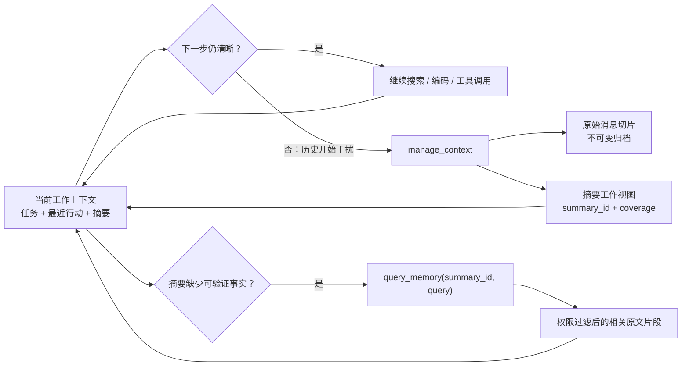
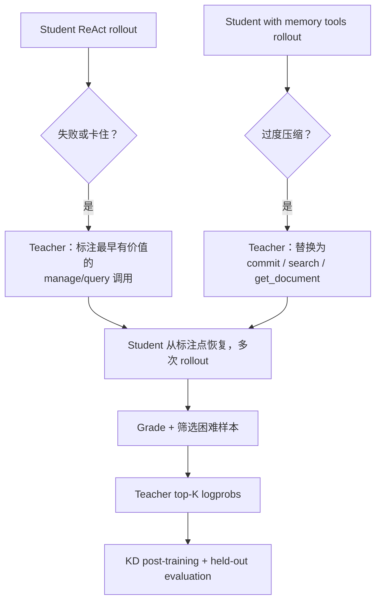
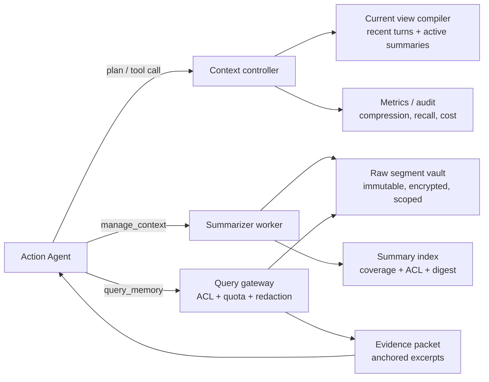
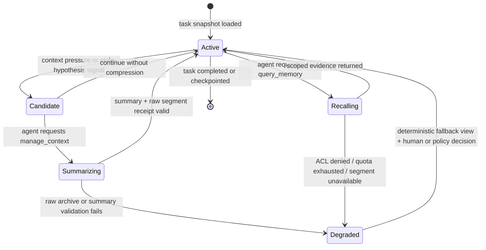

## 来源说明

本文基于 2026-08-12 的研究发布流程写成。今天的强信号是 2026-07-26 发布的 ACM：**Agentic Context Management for Long Horizon Tasks**。它要解决的不是跨任务的长期知识沉淀，也不是再训练一个检索器，而是单条长程任务在工具调用、观察和中间假设不断增加时，怎样让模型主动维护一个仍可推理的工作上下文。

核心一手来源：

1. Li 等：[ACM: Agentic Context Management for Long Horizon Tasks](https://arxiv.org/abs/2607.23809)，arXiv:2607.23809v1，2026-07-26。论文定义 `manage_context` 与 `query_memory` 两个工具：前者将一个摘要边界前的消息压缩为摘要、把原始消息外存；后者以摘要 ID 和查询回读对应原始消息。作者将两项性质称为 agent-initiated 与 lossless，并在 BrowseComp-Plus、DeepSearchQA 与 SWE-Bench Verified 上报告实验结果。[1]
2. ACM [HTML 论文版](https://arxiv.org/html/2607.23809v1)。它公开了方法、主要对比、训练数据构造和 prompts；作者报告 post-training 后，相对 ReAct baseline 在 BrowseComp-Plus、DeepSearchQA、SWE-Bench Verified 上分别有 27%、16%、8% 的提升，并报告峰值 token 使用约下降 20%。这些均是作者在特定模型、任务与评估设置下的结果，不是通用生产指标。[2]
3. [官方实现](https://github.com/lixiaochuan2020/agentic-context-management)。仓库公开了 agent loop、tool/prompt、teacher guide、distillation、训练脚本、BrowseComp-Plus 题集以及部分 rollout、模型和 teacher logprob cache 的下载位置；README 同时说明训练流水线使用 Qwen3.5-9B student、GPT-5 teacher annotation 和 Qwen3.5-397B-A17B 的 teacher logprobs。[3]
4. 本站先前文章：[PRO-LONG 给长期 Agent 的启示](/articles/2026-07-26-pro-long-programmatic-memory-agent/)、[长程 Agent 的上下文压缩应该可逆](/articles/2026-07-02-reversible-context-orchestration-agent-memory/)、[定时 Agent 的记忆不是历史聊天](/articles/2026-07-25-scheduled-agent-memory-ledger-checkpoints/)。本文不重复跨运行 checkpoint、完整结构化轨迹或泛化的 raw/abstract/drop 模型；它只讨论一个更窄的问题：**单次任务运行时，压缩什么时候发生、摘要和原始证据如何互相定位、回查如何不污染工作上下文**。

事实边界：ACM 是尚新的 arXiv 论文，本文没有复现训练或独立重跑其基准。论文与仓库里的分数、token、模型、数据和训练流程都明确写为作者报告。下文的“上下文账本”、权限模型、接口、阈值、评估门与一周实验是我的工程建议；它们补上了论文没有作为重点处理的多租户隔离、数据保留、提示注入、预算与外部副作用问题。

稳定 slug：`2026-08-12-acm-lossless-context-management`。

## 先给结论

长程 Agent 不应在上下文快满时把整段历史变成一次性的摘要并丢弃原文。更可靠的做法是：

> **把摘要当作当前任务的可编辑工作视图，而不是记忆本体；每个摘要都必须指向一个不可变、可授权回查的原始片段，Agent 既能主动收缩当前窗口，也能在新假设出现时精确恢复证据。**

ACM 给出了两个很小但足够表达这个机制的工具：

- `manage_context`：在 Agent 判断“旧上下文开始妨碍下一步探索”时，对上一个摘要边界之前的消息做压缩，把原文保存到外部存储；
- `query_memory(summary_id, query)`：Agent 怀疑摘要漏掉关键事实时，按摘要 ID 载入关联原文，让一个查询器只返回与问题有关的片段。

与定时压缩的区别不在于摘要文笔，而在于三个控制权：**何时压缩由 Agent 发起、原始内容不会被丢掉、回查是显式工具调用而非把所有历史再塞回 prompt**。[1]



对生产系统最重要的补充是：lossless 不能理解为“永久保存一切”。它只能表示**在允许的保留期、授权范围和加密边界内，不以摘要替代原始证据**。隐私删除、tenant 隔离、数据最小化和外部副作用的真实状态仍须由独立控制面负责。

## 技术问题：上下文爆炸并不等于 token 不够

一个研究、代码修复或安全分析 Agent 在数十轮后常出现三类症状：

| 症状 | 仅扩展 context window 为什么不够 | 正确的系统问题 |
| --- | --- | --- |
| 早期约束被忽略 | 信息仍在窗口内，却不再影响当前决策 | 哪些状态应保持显著 |
| 重复搜索或重复失败 | 完整轨迹太长，局部线索难以再定位 | 怎样按意图回查证据 |
| 历史淹没当前任务 | 每轮输入越来越贵，局部计划被旧输出打断 | 怎样收缩工作视图而不丢证据 |
| 固定阈值时强制摘要 | 模型在仍需比对旧细节时失去原文 | 谁决定何时、压缩哪一段 |
| 摘要错误被固化 | 新会话只能相信摘要的措辞 | 摘要是否可被原始证据推翻 |

这正是 ACM 所说的 context management，而不是一般意义的 RAG。RAG 的典型问题是“有一堆外部文档，下一步该取哪几篇”；ACM 的问题是“这条任务轨迹本身已经形成一个不断变化的工作集，如何让 Agent 在继续工作时维护它”。论文比较的 summary-agent 方案在固定 context 使用率超过阈值后压缩并舍弃旧消息；ACM 则将压缩变成 Agent 自己的动作，并把旧消息绑定到摘要 ID。[1]

## 机制拆解：两个工具与两份状态

### `manage_context` 不是把所有内容压成一段 prose

论文中，Agent 在任意时点调用 `manage_context`；summarizer 将上一个摘要边界到当前边界的消息压缩成简洁摘要，原始消息写入外部 workspace，摘要则以唯一 ID 指向这些原始消息。[1][2]

工程实现时至少需要两份不同性质的状态：

| 对象 | 目的 | 是否可修改 | Agent 默认可见内容 |
| --- | --- | --- | --- |
| Raw segment | 证据、工具结果、失败信息的原始载荷 | 不可变；删除走受控 erasure | 否，只见 ID、元数据、摘要 |
| Working summary | 支撑下一步任务的短视图 | 版本化；新摘要可取代当前视图 | 是 |
| Summary index | `summary_id -> raw segment` 映射与权限信息 | append / revoke | 只见允许范围 |
| Context budget | 当前窗口、回查与压缩成本 | 每步更新 | 是 |

因此摘要要带 coverage，不能只写“已调查数据库连接失败”。好的摘要至少要表达：已经覆盖的范围、尚未确认的假设、可回查证据锚点和下一步不变量。

```json
{
  "summary_id": "sum_018",
  "task_id": "TASK-481",
  "parent_summary_id": "sum_014",
  "covers": { "message_start": 42, "message_end": 67 },
  "raw_segment_ref": "vault://tasks/TASK-481/segments/42-67",
  "working_view": {
    "confirmed": ["导出接口需要管理员权限", "当前集成测试在 mock server 前失败"],
    "open_questions": ["RBAC middleware 是否已覆盖异步 job 路径"],
    "do_not_repeat": ["不要再次修改 lockfile；依赖差异已排除"],
    "next_check": "用管理员与普通用户两个 token 跑 contract test"
  },
  "access": { "scope": "TASK-481", "classification": "internal" },
  "created_from": { "agent_version": "runner-3.2", "summarizer_version": "sum-1.1" }
}
```

`working_view` 是可被后续摘要更新的衍生物；`raw_segment_ref` 才是可追溯证据。不要把摘要本身提升成长期知识，也不要让它跨 task、repository 或 tenant 被无条件检索。

### `query_memory` 是证据回查，不是全文回灌

ACM 的查询器接收查询和某个摘要 ID 映射的原始消息，只将相关信息作为 tool result 返回给主 Agent。[1] 这个设计避免了“为了找一句旧日志，把十万 token 再放回窗口”。

生产实现应再加四个约束：

1. **先授权，后读取**：`summary_id` 只能解析到当前 `task_id`、tenant、数据分类允许的 segment；不能把 ID 当跨范围数据指针。
2. **查询有预算**：每个 attempt 设置最大查询次数、最大返回 token 和最大深度，防止 Agent 因不确定而不停回溯。
3. **返回可定位引用**：每条结果带 `segment_id`、message range、工具/来源类型与 digest；主 Agent 不能把它写成“已验证”而没有引用。
4. **载荷默认最小化**：优先返回结构化字段、日志的相关行、代码位置或 artifact ref；敏感正文只在必要且有权限时解封。

```ts
type MemoryQuery = {
  taskId: string;
  summaryId: string;
  question: string;
  reason: "verify_constraint" | "compare_attempt" | "recover_failure" | "locate_artifact";
  maxItems: number;
};

type MemoryEvidence = {
  statement: string;
  segmentId: string;
  messageRange: [number, number];
  provenance: "tool_result" | "human_input" | "agent_output";
  artifactRef?: string;
  digest: string;
};
```

上面的 `reason` 并非论文 API，而是为了让团队审计“为什么要打开旧上下文”。对于带外部副作用的 Agent，`query_memory` 的返回只能帮助理解历史；是否部署、推送或关闭告警，仍要重新读取当前世界状态。

## ACM、PRO-LONG 与固定压缩：不要把相邻方法混成一个词

它们都试图缓解长程轨迹问题，却控制了不同层面：

| 方法 | 主要对象 | 当前窗口如何变短 | 原始轨迹如何再取 | 核心风险 |
| --- | --- | --- | --- | --- |
| 固定阈值摘要 | 对话历史 | 外部监控在阈值触发摘要 | 通常无法精确回查旧原文 | 摘要丢失被固化 |
| ACM | 单次任务的消息轨迹 | Agent 调用 `manage_context` | `summary_id + query_memory` | 触发策略学错、外存治理缺失 |
| PRO-LONG | 单次探索的完整 action/observation log | 不必把 log 放进 prompt | coding agent 用程序化工具查结构化日志 | 查询能力和日志 schema 决定上限 |
| 任务账本 / checkpoint | 跨运行任务状态与副作用 | 不负责压缩当前推理 | 读取 ledger、receipt 和 snapshot | 把旧状态误当当前事实 |

PRO-LONG 的启示是把完整轨迹变成可编程证据；ACM 的启示是把**当前注意力**也作为 Agent 可以管理的对象。前者更像一个可查询的日志面，后者更像一个会收缩和扩张的 working-memory 面。一个生产系统可以同时采用两者：用摘要 ID 管理当前对话，用结构化事件日志保存工具事实；但不要让二者共享一个无范围、无保留期的“memory”表。

## 训练机制：ACM 为什么特别强调“何时不压缩”

论文并不只让 teacher 标注“这里应该摘要”。它使用双向约束：对没有 memory tool 的失败轨迹，teacher 标出更早应该插入 context management 的点；对已经使用工具的轨迹，teacher 也找出不应该压缩的调用，并改写成继续搜索、读取文档或直接完成。[2]



这个细节很有工程价值。很多团队把“压缩次数越多”当成高效指标，结果会把模型训练成遇到不确定就总结。ACM 的公开分析也显示，未经专门训练的强模型可能几乎不调用 memory tools，而训练后的模型调用更频繁；这说明工具存在并不等于模型拥有合适的介入策略。[2]

但不能据此推导“所有 Agent 都应 post-train 一个 context manager”。对大多数团队，第一阶段更实际的是为现有模型提供可逆工具和可观测指标，然后用离线轨迹判断人设的 trigger 是否真的有收益。训练前先建立评价，不然只会优化模型调用工具的样子。

## 工程判断：把 ACM 变成受控上下文账本

下面是一套无需改模型权重的最小架构。它保留 ACM 的主动、可逆思想，但把政策和安全判断留在系统侧：



### 状态机：压缩是一种建议，不是不可逆动作



`Degraded` 很关键。若原始段没有成功写入、摘要没有 coverage、ACL 不允许读取，系统不能悄悄继续并把摘要视为完全可靠。最小 fallback 是保留最近 N 轮、标记“earlier context unavailable”、禁止据此执行高影响动作，并把失败原因写进 task receipt。

### 何时给 Agent 主动权，何时设置硬护栏

| 决策 | 建议控制者 | 原因 |
| --- | --- | --- |
| 是否开始压缩 | Agent，外加预算信号 | 与当前推理焦点最相关 |
| 原始段是否已归档 | 系统事务 | 不能依赖模型自报成功 |
| 读取哪个 segment | Agent 提意图，gateway 做 ACL | 有效检索与数据隔离必须分开 |
| 单次返回多少内容 | 系统 quota + query gateway | 防止上下文回灌与成本失控 |
| 删除 / 保留多久 | 数据 owner 与 policy | 不是模型可以决定的记忆行为 |
| 是否据旧信息执行外部副作用 | 当前世界验证器 / 人 | 历史证据不等于当前状态 |

这组分工也解释了“agent-initiated”真正适合放在哪里：放在认知层的收缩和回查，不放在授权、保留和发布层。

## 适用场景

| 场景 | 最有价值的 segment | 建议摘要内容 | 回查的典型问题 |
| --- | --- | --- | --- |
| 代码修复 | 测试失败、局部 diff、API 约束 | 已排除原因、当前假设、待跑测试 | “上次为什么不改这个文件？” |
| 深度研究 | 原始引用、冲突证据、检索路径 | 已证实 / 未证实 claim、来源 ID | “这个数字来自哪一段原文？” |
| 白盒扫描 | rule result、数据流路径、验证日志 | 已证实 sink、待确认前置条件 | “这个 finding 是哪次 analyzer run 生成的？” |
| 文档 Agent | issue、PR diff、目标分支规则 | 文档候选、版本约束、SME 问题 | “哪个 release metadata 决定了当前分支？” |
| 运营研究 | 发布回执、外部页面检查 | 已发布/未发布、需重试原因 | “这个文章是否已经在线上可见？” |

不适合直接采用原始 ACM 形式的情况包括：需要跨 tenant 共享可检索知识但尚未建立清晰访问控制；原始消息包含高敏感材料且无法设置删除/审计机制；任务依赖的事实会快速过期；以及 Agent 可以通过旧工具输出直接触发生产操作。此时应先做数据分类、状态账本和副作用验证，而不是先加一个 summarizer。

## 一周实现与验证计划

不要先训练模型。以一个有稳定测试的代码修复 Agent 或研究 Agent 为对象，完成如下最小实验：

| 天数 | 工作 | 交付物 | 验证门 |
| --- | --- | --- | --- |
| Day 1 | 定义 `RawSegment`、`Summary`、`MemoryQuery` schema 与 task scope | JSON Schema + 20 条合成轨迹 | 每个 summary 都有 range、digest、scope |
| Day 2 | 实现 append-only vault 与 summary index | 原始段写入回执 | 归档失败时不更新 active summary |
| Day 3 | 实现 `manage_context` | summary worker + coverage 检查 | 原文可按 summary ID 回放 |
| Day 4 | 实现 `query_memory` | ACL、quota、redaction gateway | 不能跨 task/tenant 回查 |
| Day 5 | 做三种策略对照 | fixed threshold / agent tool / no compression | 同一任务集、同一预算 |
| Day 6 | 插入恢复与权限失败 | degraded state、fallback view | 不会把摘要当作原文事实 |
| Day 7 | 人工抽样审查与复盘 | metric dashboard + keep/change/stop 决定 | 只扩大已证明安全的范围 |

一个简单的基准 harness 足够开始：每个任务都注入必须在早期观察、在后期才能使用的约束；同时注入一个早期失败路径，检查 Agent 是否重复尝试。对每种策略运行多次，保存完整 raw segment 但只把最小化 summary 给 action Agent。

```text
for task in held_out_tasks:
  run(no_compression, task, fixed_budget)
  run(fixed_threshold_summary, task, fixed_budget)
  run(agent_managed_lossless, task, fixed_budget)
  score(task_success, constraint_recall, repeated_failure, peak_tokens,
        total_tokens, tool_calls, recall_precision, unsafe_recall)
```

这里的 held-out 不只是没见过的问题文本，也应包含没见过的任务长度、失败模式和权限组合。否则系统可能只学会在熟悉的 token 位置调用 `manage_context`。

## 可验证指标：别把“压缩率”当作唯一胜利

| 指标 | 定义 | 为什么要测 |
| --- | --- | --- |
| task success | 完成可观察验收的比例 | token 更少但任务失败没有价值 |
| critical constraint recall | 后期仍正确使用早期关键约束的比例 | 检验压缩有没有让行为状态衰减 |
| evidence recovery precision | 回查返回且真正支持当前判断的片段 / 返回片段 | 防止 query 变成噪声回灌 |
| raw-to-summary traceability | 可由摘要定位到原始范围的关键 claim / 全部关键 claim | 确保摘要可审计 |
| peak context tokens | 单条轨迹峰值输入 token | 反映 KV-cache 压力，不等于总成本 |
| total token and tool cost | 模型 + summarizer + query worker + 工具调用成本 | 主动压缩可能增加工具调用 |
| compression regret rate | 压缩后立即不得不回查 / 压缩次数 | 识别过度压缩 |
| unsafe recall rate | 被 ACL、scope 或 retention policy 拒绝的异常回查比例 | 发现范围混淆或越权尝试 |

ACM 作者报告的峰值 token 下降和 benchmark 提升值得关注，但工程团队应将自己的预算、模型、任务、隐私条件和工具延迟都计入。尤其要分开测 peak token 与 total token：频繁摘要可以降低峰值，却因 summary/query 调用增加总成本。

## 失败模式与回滚

| 失败模式 | 早期信号 | 处置 | 长期修复 |
| --- | --- | --- | --- |
| 过早压缩 | 紧接着发生 `query_memory`，且回查量很大 | 回滚到上一 active view，标记 regret | 训练/提示中加入“继续探索”替代动作 |
| 迟迟不压缩 | peak token 接近 hard limit，重复旧结论 | 系统只发 budget warning，不替模型伪造摘要 | 以离线轨迹校准 tool guidance |
| 摘要漏掉关键约束 | 原文与 working view 冲突 | 标记 summary invalid，重新生成并保留旧版本 | coverage checklist + claim traceability |
| 原始段写入失败 | 没有 digest/receipt | 不提交 summary 切换，进入 `Degraded` | storage transaction、retry 与告警 |
| 查询越过范围 | task/tenant/classification 不匹配 | 拒绝并记录 reason | ACL 前置、密钥隔离、测试越权路径 |
| 旧轨迹驱动新部署 | 回查内容与 current snapshot 不一致 | 阻止 effect，重新获取当前状态 | 将 ledger/receipt 与 working memory 分层 |
| 长期累积成本失控 | segment 数、保留字节或 query 成本持续上升 | 限制预算并做 retention review | TTL、加密归档、删除与指标分桶 |

回滚的基本原则是：**可以回滚工作视图，不能伪造原始证据；可以删除受政策约束的原始数据，不能让摘要偷偷成为删除后的替代证据。** 数据删除后，summary 应标记 source unavailable，任何依赖它的高影响结论必须重新验证。

## 局限分析

- ACM 的“lossless”针对论文中的外存原始消息，不自动涵盖真实企业的删除权、密钥轮换、数据驻留、权限收回或备份生命周期。
- 作者的实验模型、benchmark 与 tool 环境有明确范围；论文也说明有些强模型几乎不主动调用 memory tools，因此不能把“提供两个工具”视为普遍有效的策略。[2]
- 摘要器和查询器仍是模型调用，可能省略、误述或选择错误片段。可回查降低风险，却不会自动证明结论正确。
- 对短任务，context management 的额外调用可能纯属开销；对极长任务，单个 summary ID 的 raw segment 本身也可能太大，需要进一步分段和二级索引。
- ACM 处理的是任务内上下文，不处理跨天调度、权限、幂等发布和环境当前状态；这些仍应放在任务账本、checkpoint 和独立验证器中。

## 我会如何实现与验证

若把它加入一个真实研究或 Coding Agent，我会从一个本地、单任务的 JSONL vault 开始：每次 `manage_context` 先写原始 segment 并取得内容 digest，再产生带 coverage 的 summary；`query_memory` 只能读取同 task 的 segment，并按 2,000 token / 5 次查询的预算返回带引用的证据包。主 Agent 的系统提示只知道“可请求压缩与回查”，并不获得 vault 文件系统的任意读取权限。

随后我会用 30 条内部合成任务和 10 条真实历史任务做三组对照，重点复核：关键约束有没有在后期生效、失败命令是否被重复、摘要是否能回指原文、峰值与总成本如何变化、权限拒绝是否正确。通过这些门之前，不接入会发布、推送、关闭工单或修改生产配置的 Agent。

## 自审

- **来源与事实**：关键机制、模型、训练流程和作者报告均链接至 arXiv 与官方仓库；所有结果都标注为作者报告，未声称独立复现。
- **技术完整性**：包含流程图、状态机、方法对比、JSON schema、TypeScript 接口、任务分工、SOP、bench harness、指标与回滚。
- **工程判断**：明确将 agent-initiated 限定为认知层决策，把权限、保留、删除与外部副作用放在独立控制面。
- **不薄内容**：不是论文摘要复述，提出可实现的上下文账本、fallback 和可验证实验计划。
- **站内差异**：与 PRO-LONG、定时任务账本和可逆压缩文章分别处理的对象不同，聚焦摘要 ID、主动时机与受控回查。
- **安全边界**：不提供未授权访问路径；强调 scope、ACL、最小返回、加密、删除与对当前世界状态的重新验证。

## 参考来源

1. Li, X. et al. [ACM: Agentic Context Management for Long Horizon Tasks](https://arxiv.org/abs/2607.23809)，2026-07-26。
2. Li, X. et al. [ACM HTML paper](https://arxiv.org/html/2607.23809v1)，访问于 2026-08-12。
3. [lixiaochuan2020/agentic-context-management](https://github.com/lixiaochuan2020/agentic-context-management)，访问于 2026-08-12。
