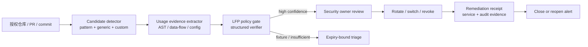
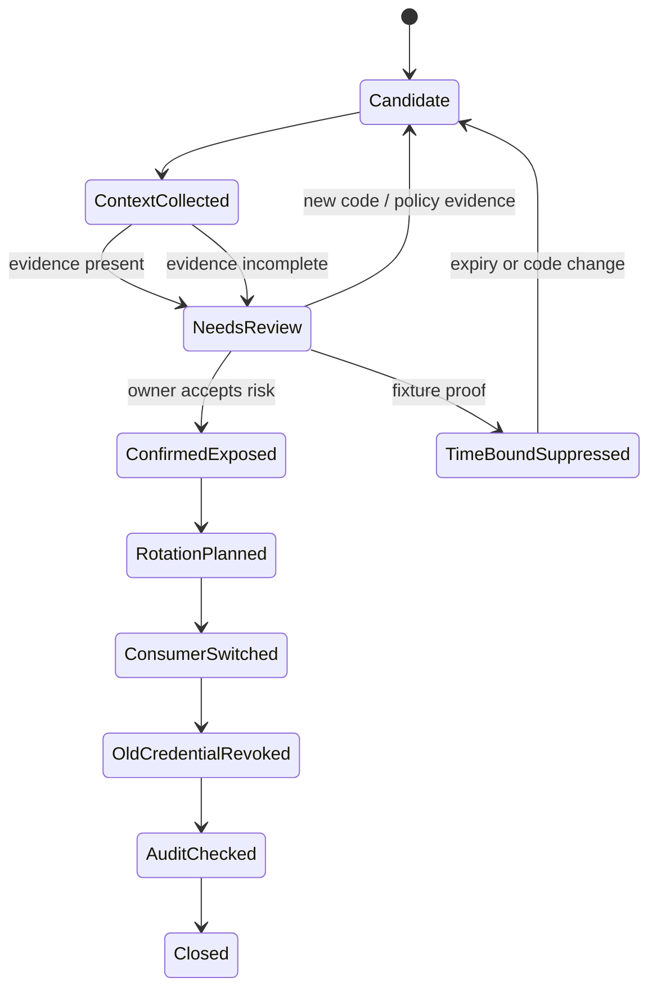

## 来源说明与本文边界

这篇文章研究的是**已授权代码库**中的凭据泄露防御，不包含发现或利用第三方泄露凭据的操作。主要一手来源有四组：

- GitHub 在 2026 年 6 月发布的 [Making secret scanning more trustworthy: Reducing false positives at scale](https://github.blog/security/application-security/making-secret-scanning-more-trustworthy-reducing-false-positives-at-scale/)。文中说明其在不改变上游检测覆盖面的前提下，使用高信号代码使用上下文验证候选；75.76% 的误报降幅是 GitHub 对其评测的报告结果，而不是可直接外推的行业基准。
- [GitHub MCP Server 的 Secret scanning 上线说明](https://github.blog/changelog/2026-06-04-secret-scanning-with-the-github-mcp-server-is-generally-available/)。它说明兼容 MCP 的编码 Agent 可以在提交前扫描当前改动，且仍遵守已有 push protection 的定制与绕过策略。
- [GitHub Secret scanning 文档](https://docs.github.com/en/code-security/concepts/secret-security/secret-scanning) 与 [泄露凭据修复教程](https://docs.github.com/en/code-security/tutorials/remediate-leaked-secrets/remediating-a-leaked-secret)。文档明确：删除代码中的值不等于完成修复；高风险泄露需要先考虑轮换或吊销，并检查依赖服务与安全日志。
- GitHub Security Lab 对 [Taskflow Agent](https://github.blog/security/vulnerability-research/taskflow-an-ai-agent-framework-for-security-research/) 的工程复盘。其先建立威胁模型和预期用途、再判断问题是否成立的做法，适合作为“代码上下文不能脱离安全边界”的参照。

本文的状态机、对象模型、权限设计和 SOP 是我的工程方案，不是 GitHub 产品内部实现的复述。本文和站内“白盒扫描器的 LFP 层”相邻，但问题更具体：**字符串像凭据，不等于凭据泄露；像凭据在代码中被使用，也不等于可以跳过人工处置。**

## 先给结论

Secret 扫描系统不应该把一个匹配结果直接叫作“泄露”。我会把它拆成四个不可合并的层：

1. **候选层**负责不漏掉可能的凭据，宁可保留较宽的规则与 AI 检测。
2. **上下文层**只收集能复核的代码使用证据，控制低误报，而不是让模型凭字符串外观判真伪。
3. **结论层**把“疑似、需人工确认、已确认暴露、测试样例”编码成受策略约束的状态，未知不能自动关闭。
4. **处置层**负责轮换、服务切换、吊销、日志检查与关闭收据；它不能由扫描 Agent 自行持有生产凭据或执行。

这四层的关键是方向不可倒置：上下文验证可帮助**排序和减少人工噪声**，不能把候选召回变窄；自动化可创建工单和收集收据，不能替代凭据所有者决定轮换。GitHub 的公开案例也是类似信号：其验证器查看变量是否被送入请求认证头、云 SDK、数据库客户端等高信号位置，而不是把整仓库交给模型做一次无边界判断。



## 技术问题：两种错误都很贵

传统模式、熵值和通用 token 规则擅长召回，却不可避免命中 UUID、示例值、测试 fixture、脱敏占位符或已失效的串。若每个命中都中断开发，开发者会形成“告警疲劳”，最终出现直接绕过 push protection 的坏激励。

反过来，单纯用更严格的正则降低噪声也危险：服务自定义 token、私钥片段、连接串和非结构化密码未必都有稳定格式。GitHub 在其公开案例里明确选择不修改上游 detection，而是在后面引入 context-aware verification；这是一个值得保留的工程分层。

还有第三种常见误解：把“从代码里删掉”当作修复。对已提交或公开暴露的活跃凭据，删除历史可能昂贵却不改变其已经泄露的事实。GitHub 文档建议优先考虑吊销/轮换，并更新仍使用旧 token 的服务；在有停机风险时，先生成等权新凭据、切换消费者、再吊销旧凭据通常更稳妥。

因此，系统真正要回答的不是 `match == secret?`，而是四个不同的问题：

| 问题 | 负责层 | 可接受证据 | 不应推导出的结论 |
| --- | --- | --- | --- |
| 这段值值得看吗？ | Candidate | 规则类型、位置、token 指纹 | 一定有效或已泄露 |
| 它在代码里承担什么角色？ | Context | 赋值、数据流、调用参数、配置作用域 | 已被外部使用 |
| 现在应怎样分级？ | Triage | 可见性、环境、所有者、有效性检查结果 | 可以自行销毁凭据 |
| 修复是否完成？ | Response | 轮换记录、消费者切换、审计检查、复测 | 仅删除文本就已闭环 |

## 机制拆解：让 LFP 看证据，不看“感觉”

本站前文把 LFP 定义为 **Low False Positive Control Layer**。在 Secret 扫描里，它不是一个“判真假的大模型”，而是一组可审计门：只要证据不足，就提升到人工 triage，而不是以 `false_positive` 自动结案。

### 1. 检测器只产生最小敏感引用

候选记录不应在日志、模型提示词或工单正文复制完整原值。保存 provider/type、文件位置、commit、截断掩码和不可逆指纹即可；真正的值只能留在受控扫描器内存或专门的凭据保管边界。

```ts
type SecretCandidate = {
  id: string;
  repo: string;
  commit: string;
  location: { path: string; line: number; column: number };
  detector: { kind: "provider" | "generic" | "custom" | "ai"; ruleId: string };
  secretType: string;
  maskedPreview: string;
  fingerprint: string; // HMAC(key, normalized value), never a plain hash alone
  exposureScope: "working-tree" | "private-repo" | "public-repo" | "unknown";
};
```

`fingerprint` 用受控密钥计算，是为了做去重和轮换后复扫，不是把低熵 token 的裸哈希变成另一个可离线猜测的数据库。扫描、Agent、工单机器人还应分别使用不同的访问身份，避免“为了验证误报”把秘密扩散到更多系统。

### 2. 上下文提取器只回答可定位事实

GitHub 的公开说明强调“更好的上下文，而不是更多数据”：高信号例子包括候选被赋给变量，随后流入认证请求头、云 SDK 或数据库客户端。工程上可以由 AST、符号引用和有限深度的数据流负责提取这些事实。

```text
literal/config key
  -> assignment / environment lookup
  -> wrapper summary (optional)
  -> HTTP Authorization | cloud SDK credential | DB client constructor
```

这里的箭头是“代码内使用关系”，不是“凭据已在生产有效”的证明。第一版只需要同文件与一跳 wrapper summary；跨服务、运行时模板和动态反射一律显式写成 `unknown`，不要让 Agent 补全缺失路径。

```ts
type UsageEvidence = {
  candidateId: string;
  relation: "assigned" | "read_by_env" | "passed_to_auth" | "passed_to_sdk" | "fixture" | "redacted";
  anchors: Array<{ path: string; startLine: number; endLine: number; symbol?: string }>;
  pathEdgeIds: string[];
  extractorVersion: string;
  confidence: "observed" | "incomplete";
};
```

### 3. 验证器输出有限枚举和反证

LLM 可以解释框架封装或阅读注释，但它只接收掩码候选与上述 anchors，不接收全仓库、更不接收完整秘密。输出必须符合 schema，并同时写支持证据和反证：

```ts
type TriageVerdict = {
  disposition: "likely-exposed" | "test-fixture" | "redacted-placeholder" | "insufficient-evidence";
  reasons: string[];
  evidenceRefs: string[];
  counterEvidenceRefs: string[];
  needsHuman: boolean;
  expiresAt?: string; // only for time-bound suppression
};
```

策略必须覆盖模型判断：`insufficient-evidence` 永远不能自动关闭；`test-fixture` 只有在测试目录、固定样例来源和无真实调用路径三者都成立时才能建议抑制；任何 public/production/unknown 组合都需要所有者审核。GitHub Security Lab 对 Taskflow 的复盘也说明了同一原则：脱离预期用途和威胁模型，静态信号很容易被误读成漏洞。

### 4. 处置控制面和扫描控制面隔离

处置 Agent 最多能创建工单、定位 `CODEOWNERS`、生成切换清单并检查回执。它**没有**云控制台、密钥管理系统或生产运行时的直接写权限。真正的轮换由 provider 集成或凭据所有者完成，且必须留下可核验的 receipt。



`Closed` 的前置条件是处置收据，而不是 diff 中看不到原字符串。对“暂时不可轮换”的低风险告警，可以用带过期时间、所有者、理由和复查日期的抑制，绝不能做永久静默。

## 一套可落地的架构与权限边界

第一版可以不做多 Agent swarm，而是四个小角色加一个策略机。这样更容易审计，也更适合接入 GitHub 的现有 Secret scanning 与 push protection。

| 组件 | 输入 | 输出 | 权限边界 |
| --- | --- | --- | --- |
| Detector | 受授权 commit/PR | `SecretCandidate` | 只读代码；不发外部请求 |
| Context extractor | 候选位置、AST/索引 | `UsageEvidence` | 只读代码图；不拿完整原值 |
| Triage agent | 掩码候选、anchors、策略 | `TriageVerdict` | 无 Git 写入、无云凭据 |
| Response coordinator | 已审批 verdict | 工单、轮换计划、receipt 校验 | 可建工单；无吊销权 |
| Owner / provider integration | 审批后的计划 | 轮换与吊销收据 | 最小化、可审计的生产权限 |

GitHub MCP Server 的提交前扫描适合作为开发环节的早反馈：它检查当前改动，同时仍受已有 push protection 和绕过配置约束。它不能替代服务器端扫描或历史扫描，原因很简单：分支合并、网页内容、旧 commit 与旁路提交通常不在一次本地改动的视野里。

一个最小策略文件可以如下；关键在于把“谁能关闭”和“何时需要证据”写成配置，而不是藏在 prompt 里：

```yaml
policies:
  - when: "exposureScope in [public-repo, unknown]"
    require: [owner_review, rotation_plan]
  - when: "disposition == test-fixture"
    require: [fixture_anchor, no_runtime_usage, expiry]
  - when: "disposition == insufficient-evidence"
    action: create_triage
    forbid: close_alert
  - when: "push_protection_bypassed == true"
    require: [bypass_reason, security_review]
```

## 可复制 SOP：从 PR 到轮换收据

1. **预提交与 CI 召回。** 对当前 diff 和默认分支运行 provider、generic、custom 三类规则；候选只保存掩码与指纹。
2. **提取局部代码证据。** 从命中处向同文件与允许的 wrapper 深度追踪，生成 anchors、调用类型和不确定性，不把全仓库塞给模型。
3. **策略化 triage。** 验证器产出有限 disposition；策略机把 public、production、unknown、绕过保护等情况直接送人工。
4. **所有者评审。** 人工确认值类型、仓库可见性、环境、所有者和服务依赖。有效性检查若需联络 provider，只能使用批准过的官方集成，且不把原值交给普通 Agent。
5. **轮换与切换。** 对高风险场景先生成新凭据、让消费者切换并做健康检查，再吊销旧凭据；同时检查相关访问日志。这个顺序来自 GitHub 的公开修复建议，具体服务仍以 provider 的运行手册为准。
6. **记录与复扫。** 保存 ticket、审批人、轮换时间、消费者切换结果、吊销或失效回执、后续扫描结果。仅当这些记录满足策略时关闭告警。

## 我会如何在一周内验证

选择一个非生产、明确授权的服务仓库，准备只包含人工生成的假凭据、占位值和 test fixture 的小型语料。不要把真实 secret 放进 benchmark。

| 指标 | 定义 | 一周目标 |
| --- | --- | --- |
| 候选召回保持率 | 上下文层前后候选数及已知假样例命中 | 不因 LFP 缩窄 detector 覆盖 |
| 人工精度 | 人工确认需处置数 / 进入 triage 数 | 与纯规则基线对比记录 |
| 错误抑制率 | 被抑制后重新认定需处置的比例 | 必须接近 0；出现即回滚规则 |
| 首次响应时间 | 候选创建到 owner 分配 | 按仓库 SLA 设阈值 |
| 轮换闭环时间 | 确认到 receipt 完整 | 按 secret 类型分位数统计 |
| 绕过率 | push protection bypass / 所有阻断 | 每次有理由且可审计 |

试验分两轮。前三天只“影子运行”：人工给每条候选打标签，比较规则基线与上下文层的差异。后四天才让 `test-fixture` 建议生成带过期的抑制草案，仍不自动关闭。只要出现一次真实样例被抑制、或模型输出无法回指 anchors，就回滚到“候选全部人工 triage”，保留日志并收紧对应策略。

## 失败模式与局限

| 失败模式 | 为什么会发生 | 控制方式 |
| --- | --- | --- |
| 把 UUID 或样例值说成活跃凭据 | 只看字符串形态 | 必须有使用 anchors；未知转人工 |
| 把 fixture 永久静默 | 测试目录并不保证无真实调用 | 三重证据 + 到期复查 |
| 模型看到完整凭据 | 为了“提高判断质量”扩大上下文 | 掩码、最小必要 anchors、隔离日志 |
| 轮换造成停机 | 旧凭据仍有隐藏消费者 | 先切新值、健康检查、再吊销 |
| 删除代码后过早关单 | 将代码状态误当泄露状态 | 需要 provider/owner 的处置收据 |
| 验证服务本身成为高权限入口 | Agent 获得云平台写权限 | 扫描、决策、处置身份分离 |

这套方法也有明确边界。代码使用上下文无法可靠解释运行时拼接、外部配置中心、跨仓库依赖和动态语言反射；有效性检查受 provider 支持、网络和权限限制；“没有发现异常访问”也不能证明从未被滥用。它的价值不在于承诺自动判断全部真假，而在于让不确定性、人工责任和轮换闭环可见。

## 自审

- **事实可靠性：** GitHub 的产品行为、上下文验证方向和处置建议均链接至其公开博客或文档；75.76% 仅表述为 GitHub 报告结果。
- **非复述：** 文章给出四层模型、状态机、最小对象、权限隔离、策略、SOP 和一周实验，不把产品说明改写成结论。
- **安全边界：** 仅讨论授权仓库和防御处置；不包含凭据收集、绕过或第三方验证步骤。
- **反薄内容检查：** 包含两张机制图、接口、可验证指标、回滚条件和局限，且与站内通用白盒扫描文章的主题区分为凭据告警闭环。
- **标题与证据等级：** 标题只承诺“低误报控制”的系统设计；“活跃/泄露/修复”均由不同状态和人工门禁约束。
