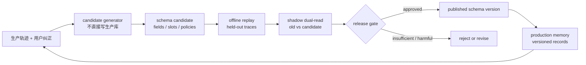
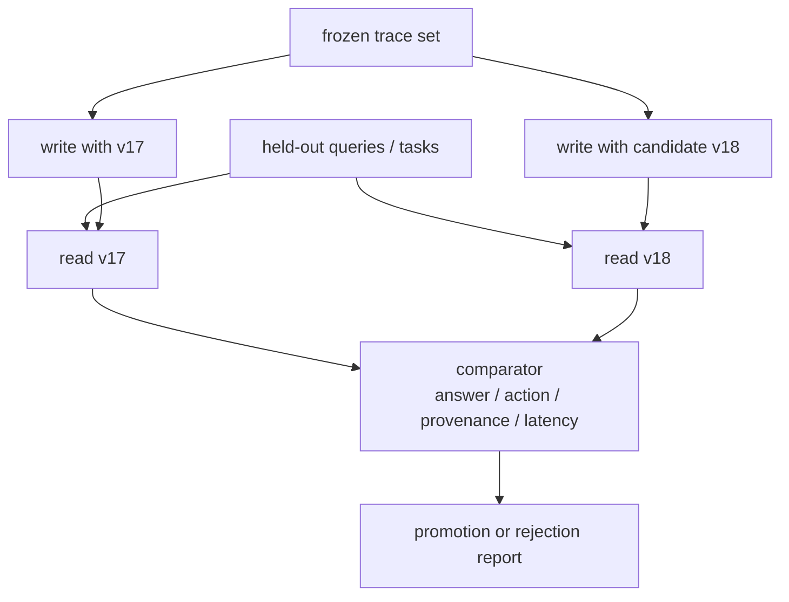

## 来源说明与站内差异

本文围绕“记忆系统能否随着使用而演化”展开，主要使用以下一手来源：

- [MindMemOS: A Portable and Self-Evolving Memory Operating Layer for AI Agents](https://arxiv.org/abs/2608.12428)，2026-08-12 提交的预印本。论文摘要提出统一的 entity-property-time 组织方式、面向目标场景的验证驱动 schema 搜索、合并冗余并解决冲突的记忆整合、利用隐式纠正反馈修订记忆，以及从 Agent 轨迹逐步形成技能。其 LoCoMo、PersonaMem 与 SpreadsheetBench 数值均为作者报告结果，尚不应当视为独立复现后的生产结论。
- [LongMemEval-V2 官方实现](https://github.com/xiaowu0162/LongMemEval-V2)。该项目的 2026-08 更新包含 AgentRunbook-C V2；它把长期记忆评测放到 web 与 enterprise 环境轨迹中，评测静态状态、动态状态、工作流知识、环境陷阱和前提意识，并同时记录回答正确性与查询延迟。
- [LongMemEval-V2 的 leaderboard 打包约束](https://github.com/xiaowu0162/LongMemEval-V2/blob/main/leaderboard/README.md)。它要求每个提交包含完成的 web/enterprise 运行、逐题日志、运行输入和聚合指标，并把 accuracy-latency 共同纳入比较；这提供了“记忆变更必须有可比较证据”的工程参照。

站内已经讨论过 ghost memory 的当前/历史/过渡态，以及 consolidation 的写路径风险。本文不重复它们：关注点是**当系统想要改变记忆 schema、组织策略或可复用技能时，怎样把这次改变当成一次软件发布来管理**。下面的架构、接口、门禁与指标是我的工程建议，不是 MindMemOS 的实现声明。

## 先给结论

“记忆能自进化”值得研究，但生产系统不该让 Agent 在运行中直接替换自己的长期记忆模型。更稳妥的最小闭环是：

> **生产记忆只接受已经被证据、回放和策略批准的 schema 版本；Agent 可以提出演化候选，不能自行把候选变成事实。**

这条界线很重要。记忆 schema 不只是数据库字段，它决定了什么会被写入、哪些记录被视为同一状态、如何检索、什么可以进 prompt，以及一段轨迹何时被提升为工作流技能。一旦 schema 改错，错误会同时污染写入、读取和行动。

因此我会把自进化拆成两个平面：探索平面可以从纠正反馈和轨迹中提出 `candidate schema`；运行平面只读取 `published schema`。两者通过影子回放、双读比较、人审和可逆迁移连接。



## 技术问题：演化的不只是“存储格式”

以往谈记忆升级，常把它理解为换 embedding、加一个 metadata 字段，或把笔记改成图谱。对 Agent 而言，这不够准确。一个 schema 演化可能同时改变五件事：

| 改变对象 | 例子 | 潜在行为变化 |
| --- | --- | --- |
| 记忆类型 | 把 episode 区分为事实、偏好、工作流、失败案例 | 检索排序和写入门槛改变 |
| 状态槽 | 将“默认项目”拆成用户、团队、仓库三个作用域 | 旧的全局事实不再可直接套用 |
| 时间语义 | 增加 `valid_from`、`supersedes` | 当前问题不再误用历史记录 |
| 来源与置信度 | 给工具观察、用户陈述、模型推断分级 | 低证据内容不能直接驱动动作 |
| 技能表示 | 将一次轨迹摘要成可执行步骤 | 可能提升复用，也可能把偶发做法变成规则 |

MindMemOS 的新意正是在这里：它不把 memory 看成开发完成后固定的存储，而是试图让记忆模型、组织策略与程序性知识随使用调整。论文摘要称其 `MindMemEvolve` 使用 validation-driven evolutionary search 优化目标场景的记忆 schema，并用隐式纠正反馈识别和修订不准确或错位的记忆。这个方向很对，但在工程上必须补上一个问题：**谁来验证一次演化没有牺牲既有场景？**

如果没有这个问题的答案，自进化会退化成另一种在线 prompt tuning：今天为了少漏一个工作流把 schema 改宽，明天可能让过时偏好覆盖当前状态；今天把失败轨迹提炼成技能，明天可能因为缺少环境前置条件而反复执行错误动作。

## 机制拆解：候选、评测、发布是三种不同状态

### 1. Candidate schema 是假设，不是迁移结果

候选可以由规则、离线分析或 Agent 提出。例如系统发现大量“在仓库 A 生效、在仓库 B 失败”的编码经验，建议把原来的 `coding_preference` 拆为 `repo_convention` 和 `personal_preference`。这只是一个可检验假设。

```ts
type SchemaCandidate = {
  id: string;
  parentVersion: string;
  proposedAt: string;
  changes: Array<
    | { kind: "add_field"; field: string; type: string; rationale: string }
    | { kind: "split_slot"; from: string; into: string[]; rationale: string }
    | { kind: "change_policy"; policy: string; before: string; after: string }
    | { kind: "add_skill_contract"; name: string; inputs: string[]; outputs: string[] }
  >;
  evidence: Array<{ traceId: string; observation: string; source: "user_correction" | "tool_result" | "review" }>;
  status: "proposed" | "replaying" | "review_required" | "published" | "rejected";
};
```

这里故意不让 candidate 带 `apply()`。提案里必须引用产生它的轨迹或纠正，且纠正本身要区分来源：用户明确更正、工具返回的失败、人工 review 和模型自我猜测不应拥有同等权重。

### 2. Offline replay 检查“新 schema 是否更会做事”

LongMemEval-V2 很适合提醒我们，环境记忆不止是问答事实。它评测静态状态、动态状态、重复工作流、环境陷阱和部署前提，且一个 memory backend 只需要实现构建与查询两个清晰接口。对生产系统而言，schema 演化的 replay 也该覆盖这五类问题，而不是只比较检索相似度。

我会为每个候选版本保留冻结的历史轨迹和答案/动作期望，按以下方式重放：



需要特别注意两点。第一，写入候选时不能看到评测问题、标准答案或目标 action，否则 schema 搜索会变成对评测集的过拟合。第二，不要只看最终成功率。成功率下降可能是写入漏掉了事实、检索没找到、prompt 编译丢了状态，或技能误用；报告需要记录每一级证据。

### 3. Published schema 才有资格影响生产行动

通过回放也不是自动上线。对有副作用的 Agent，schema 发布至少需要一个所有者和一个可读 diff：新字段、废弃字段、迁移数量、受影响 memory type、回归集变化、延迟与成本变化、失败样本链接。

发布后采用双读而非一次性替换：写入可以继续以稳定版本为主，候选版本在影子库写同一份事件；读取时以稳定版本返回结果，同时抽样记录候选版会返回什么。只有在明确窗口内没有出现回归，才逐步提高候选版本的流量。

## 一个可落地的记忆演化控制面

### 版本化 record，而不是原地覆盖

记忆记录需要携带 schema 版本、来源和可回放的输入引用。这样升级可以重建，而不是对不可解释文本做原地变形。

```ts
type MemoryRecord = {
  id: string;
  schemaVersion: string;
  kind: "fact" | "preference" | "episode" | "procedure" | "failure_pattern";
  scope: { userId?: string; teamId?: string; projectId?: string; environment?: string };
  content: string;
  state: "candidate" | "active" | "superseded" | "quarantined";
  validTime?: { from?: string; until?: string };
  provenance: Array<{ traceId: string; span?: string; observedAt: string; confidence: "observed" | "reviewed" | "inferred" }>;
  migration?: { fromVersion: string; transformId: string; reviewed: boolean };
};
```

`schemaVersion` 的作用不是展示给用户，而是让诊断回答这些具体问题：某条错误流程记忆由哪个 transform 生成？它的原始轨迹在哪里？这次发布是否把某类用户偏好迁移错了？能否只回滚这个 transform，而不清空整个 memory bank？

### 最小目录和职责

```text
memory-control-plane/
  schemas/
    v17.yaml
    v18-candidate.yaml
  transforms/
    v17_to_v18.ts
  replay/
    manifests/
    fixtures/
    expected-actions.jsonl
  reports/
    v18-shadow.json
  policies/
    promotion.yaml
```

| 角色 | 能做什么 | 不能做什么 |
| --- | --- | --- |
| Evolution agent | 根据纠正和 trace 提出 candidate | 发布、删除生产记录、改策略阈值 |
| Replay runner | 重放冻结数据并保存结果 | 访问生产用户数据、调用有副作用工具 |
| Comparator | 计算差异、聚类失败样本 | 自行把指标解释为批准 |
| Memory owner | 审查 diff、批准灰度与回滚 | 修改原始审计日志 |
| Runtime agent | 读取已发布 schema | 读取候选库、绕过来源约束 |

这种分工不花哨，但能避免“提出改进的模型”同时成为“验证改进的模型”和“发布改进的模型”。

### Promotion policy 例子

```yaml
promotion:
  require:
    - held_out_action_success_not_lower_than: 0.98
    - provenance_coverage_not_lower_than: 0.995
    - current_state_regression_rate_not_higher_than: 0.005
    - p95_query_latency_multiplier_not_higher_than: 1.15
    - human_review_for:
        - preference
        - identity
        - permission
        - procedure
  forbid:
    - automatic_overwrite_of_reviewed_memory
    - permanent_delete_without_retention_receipt
    - promotion_when_fixture_contains_gold_question
```

阈值只是示例，不能照抄。真正的重点是：把质量、可追溯性、时延、数据泄露风险和人工责任写进同一份可版本化策略，而不是散落在 prompts 中。

## 可复制 SOP：一次 schema 演化如何运行

1. **收集信号。** 仅接收可引用的用户更正、工具失败、人工标注和重复检索失败；模型“我觉得应该这样记”只能是弱信号。
2. **生成有限候选。** 每轮最多改变一个语义概念，例如拆一个 slot 或增加一个作用域字段，避免大规模重构让失败原因不可归因。
3. **静态检查迁移。** 检查 transform 是否保留 provenance、是否把 current/historical 状态混淆、是否会扩大跨用户或跨项目作用域。
4. **离线双写与回放。** 用冻结轨迹分别写入父版本和候选版本，对保留问题、工作流任务、反例与已知失败重放。
5. **比较与反例审查。** 自动比较回答、动作、引用证据、token、时延；重点人工查看“旧版成功而候选失败”和“候选变得更自信但来源更弱”的样本。
6. **批准灰度。** 发布不可变 schema 版本，先进行小比例 shadow read；高影响类型仍使用旧版结果。
7. **观测并回滚。** 设定观察窗口和自动暂停条件。出现当前状态误用、跨作用域泄露、关键 workflow 失败或 provenance 丢失时，停灰度并回到父版本。

## 我会如何做一周验证

第一天，挑一个范围窄的改变，例如把研发 Agent 的 `project_note` 拆成 `repo_convention` 与 `task_episode`，并准备至少 30 条带来源的历史轨迹。第二至三天，建立反例集：同名项目、版本变化、旧约定、用户更正和“看似相似但不该复用”的失败任务。

第四天，对 v17/v18 做双写，测状态检索、工作流复用、来源回链和查询时延。第五天，人工逐条审查所有回归。第六天，仅在非关键任务 shadow read。第七天，根据以下指标决定保留、修订或放弃，而不是为了“自进化”而上线。

| 指标 | 定义 | 失败时的处置 |
| --- | --- | --- |
| Migration fidelity | 有效 record 可被新版本表示且 provenance 未丢失的比例 | 阻断发布，修 transform |
| State regression | 当前问题被历史/错误作用域记忆影响的比例 | 立即暂停灰度 |
| Workflow delta | 同一冻结任务上 v18 相对 v17 的成功变化 | 低于阈值则保留旧版 |
| Correction uptake | 已确认纠正被后续正确使用的比例 | 回查 slot 和优先级策略 |
| Unsupported generalization | 技能跨越来源项目/环境被套用的比例 | 收紧 scope 或降为 episode |
| Provenance coverage | 回答与动作引用可回查原始 trace 的比例 | 不足时禁止 promotion |
| Cost and latency delta | token、检索调用、p50/p95 延迟变化 | 分开决定 fast/balanced 版本 |
| Rollback recovery | 回滚后关键任务恢复的时间与成功率 | 检查发布与路由机制 |

## 失败模式与回滚

| 失败模式 | 典型原因 | 回滚/缓解 |
| --- | --- | --- |
| schema 把局部规则升格为全局技能 | 只看成功轨迹，缺少反例 | 降级为 scoped episode，增加环境字段 |
| 用户纠正被模型误读 | 隐式反馈语义不清 | 标为候选，要求二次证据或人审 |
| 新字段看似完整但来源断裂 | transform 丢弃原始 span | 停止发布，重新从 raw trace 构建 |
| shadow 成功、真实运行失败 | replay 缺少权限/工具/时序条件 | 补充 action-level fixture，降低灰度 |
| 新版更准但显著变慢 | schema 增加过多边或二次检索 | 维护准确/时延不同 operating point |
| 回滚后仍读到新版 | cache 或索引未按版本隔离 | record、index、prompt cache 都携带 schemaVersion |

这里的回滚对象不是“删除所有新记忆”。正确做法是撤回新版本的路由，把受影响 record 标为 `quarantined`，保留迁移映射和审计记录；这样既能恢复行为，也不会抹掉后来用于诊断的证据。

## 局限分析

MindMemOS 目前是新提交预印本。本文只采用摘要能直接支持的机制与作者报告分数，未把其完整算法、系统实现或结果视为已独立验证。它提出的 `validation-driven` 思路很有价值，但“验证集是否代表生产变化”仍是开放问题。

LongMemEval-V2 的环境记忆设置比纯聊天问答更接近 Agent 工作，但 benchmark 仍不能覆盖企业里的权限、合规、跨系统数据和真实用户纠正。离线 replay 也无法完整模拟真实世界的工具抖动与组织变化。

最后，本文不是反对自动化。它反对的是没有隔离、没有证据、没有回滚的自动化。成熟后的系统当然可以提高候选生成、回放和灰度的自动程度；但发布权仍应由明确定义的策略与责任主体掌握。

## 自审

- **来源与事实：** MindMemOS 的提交时间、机制与数值明确标为作者报告；LongMemEval-V2 的任务维度、接口、仓库更新与 leaderboard 约束来自官方仓库。
- **站内差异：** 不重复 A-TMA 的状态协调或 faulty consolidation 的风险诊断，新增 schema 演化控制面、双写回放和发布策略。
- **工程价值：** 给出版本化对象、目录、职责表、策略、SOP、一周实验、指标与回滚条件，能够作为现有 memory store 的薄控制层落地。
- **不确定性：** 不把预印本结果说成生产保证；没有声称已复现 MindMemOS。
- **薄内容与标题党：** 包含机制图、数据模型、流程、失败模式和边界，标题准确描述“可回滚发布”的工程主张。
