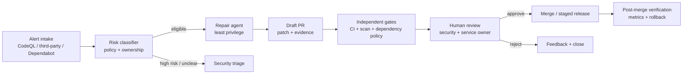
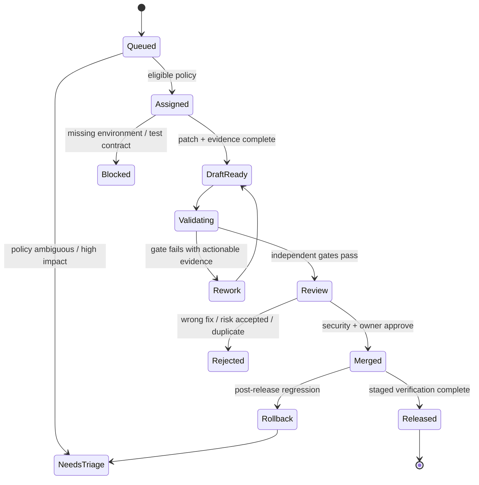

## 来源说明与边界

本文讨论的是团队**自己拥有或明确授权**的仓库中，如何把 AI 编码 Agent 接进安全告警修复流程；不包含攻击、绕过扫描或未经授权的测试。

一手依据如下：

- GitHub 于 2026-07-10 公布 [Agentic Autofix for code scanning alerts](https://github.blog/changelog/2026-07-10-agentic-autofix-for-code-scanning-alerts-in-public-preview/)。它说明 Agent 可跨仓库探索相关文件、生成修复、重跑原分析，并开出待 review 的草稿 PR；功能在 public preview，且会消耗 AI Credits 和 Actions minutes。
- [GitHub 的 Autofix 文档](https://docs.github.com/en/code-security/concepts/code-scanning/autofix-for-code-scanning) 明确它是 best-effort：基于 CodeQL query suite 的复跑不能确认 custom query 或 security-extended query 的告警已经解决，第三方工具 finding 的修复质量也不保证。
- GitHub 于 2026-04-07 公布 [Dependabot alerts 可分派给 Copilot、Claude 与 Codex](https://github.blog/changelog/2026-04-07-dependabot-alerts-are-now-assignable-to-ai-agents-for-remediation/)。Agent 会分析 advisory 与依赖使用、开 draft PR，并尝试处理升级引入的测试失败；GitHub 同时明确要求人工 review、测试和确认后再合并。
- GitHub 的 [CodeQL PR alert metrics](https://docs.github.com/en/code-security/concepts/code-scanning/pull-request-alert-metrics) 可区分有无 Autofix 的修复、未解决即合并、风险接受、修复率和平均修复时间。
- Singla 等人的 [Understanding Security Risks of AI Agents' Dependency Updates](https://arxiv.org/abs/2601.00205) 对 2,807 个仓库、117,062 次依赖变更的作者报告显示，Agent 选择 PR 当时已知脆弱版本的比例高于人工（2.46% 对 1.64%）。这不是对所有 Agent 的定论，但足以说明“测试通过”不能替代依赖风险门。

本文的状态机、策略、对象、SOP 和 ROI 计算是我的工程建议。与站内白盒扫描和凭据扫描文章的区别是：本文的主问题不是如何发现风险，而是**发现后怎样让 Agent 参与修复，同时不把合并、发布和风险接受外包给它**。

## 先给结论

安全修复 Agent 最合理的权限不是“自动修复并上线”，而是：

> **读取一个受限的告警证据包，创建一个可审查的草稿 PR，运行许可内的验证；是否接受风险、合并和发布仍由人与独立门禁决定。**

GitHub 的产品形态其实已经给出这个方向：Code scanning 的 agentic autofix 最终打开 draft PR，Dependabot 也强调审查、测试与确认。真正缺的一层是团队自己的工作流：什么告警能派给 Agent、Agent 能读什么、哪些测试算通过、谁审批依赖变更、何时必须暂停和回滚。



这不是把人工拖回每一个编辑动作，而是把人放在不可逆决策上：权限扩大、依赖引入、行为变更、数据迁移、风险接受和生产发布。

## 场景定义：原来为什么慢，AI Native 后谁做什么

传统安全修复通常是安全团队看到告警，创建 issue，开发者在上下文切换后阅读 advisory 和代码，升级依赖或改逻辑，CI 失败后来回排查，最后由 reviewer 判断是否真修好。瓶颈往往不是“把一行 API 改掉”，而是收集足够上下文、定位所有受影响调用、让修复在项目约束下通过验证。

AI Native 的目标不是取消这个流程，而是把机械且可复核的部分收敛为 Agent 任务。对 Code scanning，GitHub 的公开流程是探索相关文件、生成修复、重跑 CodeQL、迭代并开草稿 PR。对 Dependabot，Agent 可以在版本升级导致 API 破坏或测试失败时继续处理代码改动。两者不能共用一套“修复成功”的定义。

| 告警类型 | Agent 的有用工作 | 不能据此证明什么 | 人工责任 |
| --- | --- | --- | --- |
| CodeQL 默认 query | 定位 source/sink、提出局部补丁、重跑同一 query | 业务语义、回归行为、所有路径安全 | 审核补丁与威胁模型 |
| Custom/extended/third-party scan | 收集证据、写验证计划、开草稿 PR | 原扫描复跑即已关闭风险 | 安全工程师确认检测与修复 |
| Dependabot 简单 patch | 更新锁文件、运行测试、列出 changelog | 依赖在运行时无兼容/供应链影响 | 依赖所有者 review |
| Dependabot major/恶意包 | 分析 API break、提出迁移、标注 fallback | 新版本无新漏洞或功能完全等价 | 服务 owner 批准、灰度与回滚 |

这张表就是最重要的分工边界：Agent 的输出是“可审查的修复假设”，不是“风险已消失”。

## 目标工作流：把告警变成有状态的修复契约

我会把每个修复任务建模为一个 `RemediationCase`。它代替散落在 alert、聊天、Agent session 和 PR 描述里的非结构化状态。

```ts
type RemediationCase = {
  id: string;
  repo: string;
  baseCommit: string;
  source: "codeql" | "third_party_sast" | "dependabot";
  alert: {
    id: string;
    ruleOrAdvisory: string;
    severity: "low" | "medium" | "high" | "critical";
    locations: Array<{ path: string; line?: number }>;
    evidenceRefs: string[];
  };
  riskClass: "patch" | "behavior_change" | "dependency_major" | "high_impact" | "needs_triage";
  allowedActions: Array<"read_code" | "edit_branch" | "run_tests" | "run_scanner" | "open_draft_pr">;
  requiredGates: string[];
  status: "queued" | "assigned" | "draft_ready" | "validating" | "review" | "merged" | "released" | "rejected";
  receipts: Array<{ kind: string; uri: string; commit?: string; createdAt: string }>;
};
```

`baseCommit`、`alert id` 与 `evidenceRefs` 是不可少的。否则 Agent 改完一段“相似代码”后，团队无法判断它是否真的处理了同一个告警，也无法在扫描规则升级后重现当时的判断。

### 状态机：草稿 PR 不是终点



这一状态机刻意把 `Validating` 和 `Review` 分开。Agent 自己重跑的分析只能作为一个 receipt；独立 CI、依赖策略、测试和人审才组成真正的合并门。

## Agent、工具与人工分工

一个可控的“修复工厂”不需要大量 Agent。第一版四个角色足够：

| 角色 | 输入 | 输出 | 权限与限制 |
| --- | --- | --- | --- |
| Intake classifier | alert、仓库标签、服务等级 | `riskClass`、owner、required gates | 只读；不改代码 |
| Repair agent | case、局部代码、测试合同、repo instructions | 分支、patch、草稿 PR、变更说明 | 无 merge、无 deploy、无 secrets |
| Verification runner | PR commit、固定 CI profile | 测试/扫描/SBOM/lockfile receipts | 隔离 runner；无生产写权限 |
| Human reviewers | diff、receipts、业务风险 | approve/reject/rework/release 计划 | 安全 owner 与服务 owner 分离 |

对 Agent 的输入应是小型 evidence packet，而不是整仓库和全部历史告警：告警原文、位置、规则/咨询编号、受影响依赖树、已知测试、所有者、禁止触碰路径、允许命令、敏感信息脱敏策略。这样既降低上下文污染，也避免 Agent 为了“修复”探索无关私密目录。

```yaml
# .security/agent-remediation-policy.yaml
defaults:
  branch_prefix: "agent/security/"
  draft_pull_request: true
  deny:
    - merge_pull_request
    - deploy_production
    - read_production_secrets
    - change_ci_permissions
classes:
  patch:
    allow: [read_code, edit_branch, run_tests, run_scanner, open_draft_pr]
    require: [unit_tests, original_scan, code_owner_review]
  dependency_major:
    allow: [read_code, edit_branch, run_tests, run_scanner, open_draft_pr]
    require: [lockfile_diff, dependency_policy, integration_tests, service_owner_review, staged_release]
  high_impact:
    allow: [read_code, open_draft_pr]
    require: [security_review, threat_model_update, human_test_plan]
```

这里的 `deny` 比 `allow` 更关键。任何能够直接提高 CI 权限、读取生产 secret、合并 PR 或发布生产环境的操作，都不应该由修复 Agent 持有。

## 具体执行 SOP

1. **入口去重和风险分类。** 以 `(repo, alert id, base commit)` 做幂等键。合并同一依赖 advisory 的重复任务，但不要把无关 CodeQL alert 打包进同一个 PR。
2. **构建证据包。** 固定告警、规则帮助、调用位置、依赖 manifest/lockfile、测试命令、`CODEOWNERS`、运行环境等级与禁止路径。敏感 token、生产配置和完整 SBOM 私有字段不进入 prompt。
3. **生成草稿。** Agent 只在隔离分支编辑；PR 描述必须生成结构化 sections：告警、修复假设、代码/依赖 diff、已运行验证、未覆盖风险、回滚建议。
4. **独立验证。** 在 Agent session 之外重新执行原 scanner、单元/集成测试、依赖策略、许可证/恶意包检查和 lockfile diff。对 major upgrade 加 smoke test 或预发环境验证。
5. **双人审核。** 安全 reviewer 关注漏洞闭环和新增攻击面；服务 owner 关注业务行为、兼容性和发布窗口。两者不是同一个 checkbox。
6. **分级合并与发布。** 低风险 patch 可在完整 gates 后合并；行为或依赖重大变更必须灰度、观察并保留可逆部署。
7. **回写学习信号。** 记录接受、拒绝、返工原因、CI 失败类型、最后关闭状态和耗时。只把经过人工确认的模式沉淀为 repo instruction 或修复 playbook。

## 验证体系：为什么“原扫描绿了”不够

GitHub 文档已经给出一个现实边界：agentic autofix 通过重跑 CodeQL query suite 验证，不能确认 custom/security-extended query 的修复；第三方 finding 也不保证质量。因此验证需要按告警类组合，而不是让一个 `scan passed` 充当万能收据。

| Gate | Code scanning patch | Dependabot patch | Major dependency change |
| --- | --- | --- | --- |
| 原告警不再出现 | 必须 | 视 advisory/扫描器 | 必须 |
| 单元测试 | 必须 | 必须 | 必须 |
| 集成/契约测试 | 风险驱动 | 推荐 | 必须 |
| 依赖策略与 lockfile diff | 若新增依赖则必须 | 必须 | 必须 |
| SBOM/许可证/恶意包检查 | 推荐 | 必须 | 必须 |
| 人工 threat model | 高影响时 | 通常不必 | 必须 |
| 灰度与运行指标 | 高影响时 | 视服务等级 | 必须 |

论文中的依赖研究给了额外理由：Agent 的依赖决定会涉及版本安全、已有库复用和不必要新增，而这些通常不被功能测试捕捉。我的工程推断是，dependency diff 应有单独的 `registry-aware` gate：在 PR 时间点检查目标版本是否已知存在 advisory、是否已有满足约束的补丁版本、是否新增了重复能力的包，以及 lockfile 是否引入异常的传递依赖扩张。

## 一周试点与 ROI 账本

不要从所有 critical alert 开始。选择一个测试较完整、无生产写权限、每月有稳定中低风险告警的服务，先试 20 个 `patch` 或小型 `dependency` case。

| 天数 | 工作 | 成功判据 |
| --- | --- | --- |
| 第 1 天 | 定义 taxonomy、owners、禁止操作与 CI profile | 每类告警有明确路由 |
| 第 2 天 | 建 evidence packet 和 case ledger | 任务可从 alert 复现到 PR |
| 第 3-4 天 | Agent 只开 draft PR，完全人工审核 | 收集返工与失败标签 |
| 第 5 天 | 启用独立扫描、依赖策略与 lockfile gate | 无 agent 自证通过即合并 |
| 第 6 天 | 审核 20 个样本，修正 policy | 高风险误路由为 0 |
| 第 7 天 | 评估扩大或暂停 | 以质量和队列改善决定 |

ROI 不应该只算“Agent 节省了多少分钟”。建议同时记录：

```text
net_value = reviewer_minutes_saved
          + mean_time_to_remediate_reduction * incident_cost_per_minute
          - agent_session_cost
          - actions_minutes_cost
          - extra_review_minutes
          - post_merge_regression_cost
```

GitHub 的 CodeQL 指标可提供一部分事实数据：有无 Autofix 的修复数、未解决即合并、风险接受和平均修复时间。团队还应补充 patch acceptance rate、首次 PR gate pass rate、rework cycles、发布后回滚数、依赖策略拒绝数和每个已关闭高风险告警的总成本。若 Agent 只是更快地产生更多被拒的 PR，它没有创造净价值。

## 失败模式与回滚

| 失败模式 | 典型表现 | 防护与回滚 |
| --- | --- | --- |
| 修复只让告警消失 | 通过隐藏/改写触发点，业务风险仍在 | 要求威胁模型、测试与 reviewer 解释修复机理 |
| 批量告警塞进一张 PR | diff 难审、回滚粒度太粗 | 按组件和风险拆 case；每 PR 保持单一修复目的 |
| Agent 加入新依赖绕过问题 | 测试通过但供应链/许可变复杂 | lockfile、registry、SBOM、许可 gate |
| Agent 改 CI 或权限使检查“变绿” | 降低门槛、扩大 token 权限 | policy deny + workflow diff 强制人工审核 |
| 第三方/custom query 无法自证 | Agent 宣称已修，扫描仍不可靠 | 标为 `needs_security_review`，保留原 tool receipt |
| 重大依赖升级回归 | API、序列化、性能或部署行为改变 | 预发/灰度、版本 pin、快速回滚与兼容窗口 |
| 学习信号反向污染 instructions | 从一次例外学到永久规则 | 只允许人工批准的 pattern 进入 playbook |

回滚不能只回滚代码。若某次 patch 已合并并影响运行时，需要同时恢复应用版本、锁定依赖版本、重新扫描、关闭或重新打开 alert，并把失败原因写回 case ledger。否则团队只会在下一个同类告警里重做同一次错误。

## 适用范围与局限

这条流程特别适合已有 CI、代码扫描、依赖清单和明确服务 owner 的团队。它对规则清晰、修复局部、测试可跑的中低风险告警最先有效；对业务逻辑漏洞、数据迁移、认证授权、大规模 framework 升级和生产事故，Agent 更适合做证据收集、草稿和测试计划，而不是承担自主修复。

GitHub 的 agentic autofix 仍在 public preview，能力、计费与支持范围可能变化。论文中的依赖数据来自特定样本与作者方法，不能直接外推到某一个团队。更重要的是：即使未来模型修复成功率变高，权限隔离、独立验证和人对不可逆风险的责任也不会失效。

## 自审

- **事实可靠性：** GitHub 产品行为、preview/best-effort 限制、Dependabot 分派与指标均来自官方 changelog 或 docs；依赖研究数字明确标作作者报告。
- **实践完整性：** 包含原流程痛点、目标工作流、Agent/工具/人分工、数据与权限边界、SOP、验证矩阵、ROI、失败与回滚、一周试点。
- **安全边界：** 仅面向已授权仓库的防御修复；没有攻击、绕过或 secret 获取步骤。
- **站内差异：** 重点是告警到草稿 PR 的运营闭环和 merge/release 权限，不重复白盒扫描、LFP 或一般代码审查文章。
- **反薄内容：** 提供流程图、状态机、数据对象、策略示例、指标与局限；标题没有承诺自动解决安全风险。
